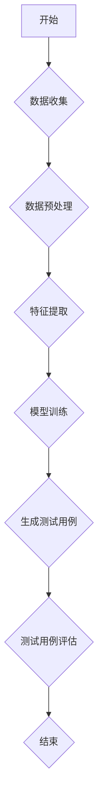
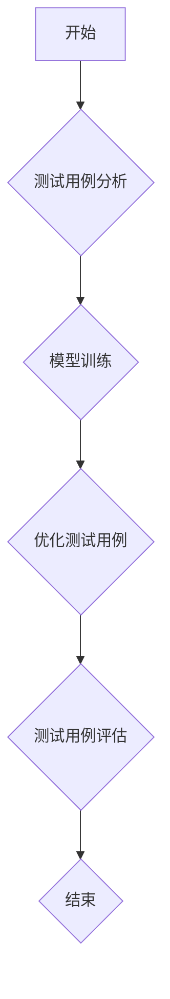

                 


### 《AI辅助软件测试用例生成与优化》

> 关键词：人工智能、软件测试、测试用例、算法、优化

> 摘要：本文深入探讨了人工智能（AI）在软件测试领域的应用，特别是AI辅助软件测试用例的生成与优化。文章首先介绍了AI和软件测试的基本概念，然后详细阐述了AI辅助测试用例生成和优化的原理、算法及其在实际项目中的应用与实践。

---

#### 第一部分：AI辅助软件测试基础知识

### 第1章：软件测试与AI概述

#### 1.1 软件测试的起源与发展

- 软件测试的定义：软件测试是指通过人工或自动化的方法对软件进行评价和验证，以发现软件中的缺陷和问题。
- 软件测试的目标：确保软件满足用户需求和规格说明书的要求，保证软件的质量和可靠性。
- 软件测试的发展历程：从早期的手动测试到自动化测试，再到今天的AI辅助测试。

#### 1.2 人工智能的基本概念

- 人工智能的定义：人工智能是指通过计算机模拟人类的智能行为，解决复杂问题。
- 人工智能的分类：根据实现方式，可分为符号人工智能、基于实例推理的人工智能和基于数据的人工智能等。
- 机器学习和深度学习的基本原理：机器学习是指从数据中自动学习规律和模式，深度学习是机器学习的一种特殊形式，利用多层神经网络进行数据处理和特征提取。

#### 1.3 AI在软件测试中的应用现状

- AI在测试中的应用领域：AI在软件测试中主要应用于测试用例生成、测试执行、测试结果分析和缺陷定位等方面。
- AI在测试中的作用与优势：AI能够提高测试效率，降低测试成本，提高测试质量。
- AI在测试中面临的挑战：数据获取和处理、算法选择和优化、模型解释性和可解释性等问题。

---

#### 第二部分：AI辅助测试用例生成

### 第2章：测试用例生成原理与算法

#### 2.1 测试用例生成的挑战

- 复杂系统的测试用例需求：现代软件系统越来越复杂，测试用例的数量和种类不断增加，手动生成测试用例变得越来越困难。
- 手动生成测试用例的困难：手动生成测试用例耗时耗力，且难以保证测试用例的全面性和有效性。
- 测试用例覆盖率的提升：测试用例覆盖率是衡量测试质量的重要指标，如何提高测试用例覆盖率是一个重要挑战。

#### 2.2 基于机器学习的测试用例生成算法

- 机器学习的基本原理：机器学习是通过从数据中学习规律和模式，从而实现预测和分类等功能。
- 常见的机器学习算法：包括监督学习、无监督学习和强化学习等。
- 测试用例生成算法的设计与实现：设计基于机器学习的测试用例生成算法，包括数据预处理、特征选择、模型训练和测试用例生成等步骤。

#### 2.3 深度学习在测试用例生成中的应用

- 深度学习的基本原理：深度学习是一种多层神经网络，通过多次数据处理和特征提取来实现复杂的模型训练。
- 测试用例生成中的深度学习模型：包括卷积神经网络（CNN）和循环神经网络（RNN）等。
- 深度学习模型的训练与优化：通过优化模型参数，提高模型的泛化能力和测试用例生成的质量。

---

### 第3章：测试用例生成实例分析

#### 3.1 测试用例生成实例介绍

- 测试实例选择：选择一个典型的软件系统作为测试实例，例如电商平台。
- 测试实例描述：描述电商平台的业务场景、功能模块和关键流程。

#### 3.2 测试用例生成过程

- 数据准备：收集电商平台的用户数据、交易数据等。
- 测试用例生成算法应用：应用基于机器学习的测试用例生成算法，生成电商平台的测试用例。
- 测试用例评估与优化：评估生成的测试用例的覆盖率和质量，进行优化和调整。

#### 3.3 测试用例生成效果分析

- 测试覆盖率分析：分析生成的测试用例对电商平台功能的覆盖率。
- 测试用例质量评估：评估生成的测试用例的有效性和全面性。

---

#### 第三部分：AI辅助测试用例优化

### 第4章：测试用例优化的基本方法

#### 4.1 测试用例优化的目标

- 减少冗余测试用例：通过优化测试用例，减少冗余和重复的测试用例，提高测试效率。
- 提高测试用例的有效性：优化测试用例，确保覆盖到关键功能和潜在缺陷，提高测试质量。
- 缩短测试执行时间：通过优化测试用例，减少测试执行时间，提高测试效率。

#### 4.2 基于机器学习的测试用例优化算法

- 机器学习的基本原理：机器学习是通过从数据中学习规律和模式，从而实现预测和分类等功能。
- 测试用例优化算法的设计与实现：设计基于机器学习的测试用例优化算法，包括数据预处理、特征选择、模型训练和测试用例优化等步骤。

#### 4.3 基于深度学习的测试用例优化模型

- 深度学习的基本原理：深度学习是一种多层神经网络，通过多次数据处理和特征提取来实现复杂的模型训练。
- 测试用例优化模型的应用：应用基于深度学习的测试用例优化模型，优化测试用例。

---

### 第5章：测试用例优化实践

#### 5.1 测试用例优化实例介绍

- 测试实例选择：选择一个典型的软件系统作为测试实例，例如电商平台。
- 测试实例描述：描述电商平台的业务场景、功能模块和关键流程。

#### 5.2 测试用例优化过程

- 数据准备：收集电商平台的用户数据、交易数据等。
- 测试用例优化算法应用：应用基于机器学习和深度学习的测试用例优化算法，优化电商平台的测试用例。
- 测试用例优化效果评估：评估优化后的测试用例的覆盖率和质量。

#### 5.3 测试用例优化效果分析

- 测试覆盖率分析：分析优化后的测试用例对电商平台功能的覆盖率。
- 测试用例质量评估：评估优化后的测试用例的有效性和全面性。

---

#### 第四部分：AI辅助测试应用与实践

### 第6章：AI辅助测试工具与平台

#### 6.1 AI辅助测试工具介绍

- 自动化测试工具：介绍常见的自动化测试工具，如Selenium、JMeter等。
- 智能测试工具：介绍智能测试工具，如AI测试平台、智能测试机器人等。

#### 6.2 AI辅助测试平台构建

- 平台架构设计：设计AI辅助测试平台的整体架构，包括数据收集、测试用例生成、测试执行和测试结果分析等功能模块。
- 平台功能模块：详细介绍AI辅助测试平台的功能模块和实现原理。

---

### 第7章：AI辅助测试项目实践

#### 7.1 项目背景介绍

- 项目概述：介绍AI辅助测试项目的背景和目标。
- 项目目标：明确AI辅助测试项目要解决的问题和预期的成果。

#### 7.2 项目系统设计与实现

- 系统需求分析：分析AI辅助测试项目的需求，包括测试用例生成、测试执行、测试结果分析和缺陷定位等。
- 系统架构设计：设计AI辅助测试项目的系统架构，包括数据存储、数据处理、模型训练和测试用例优化等。
- 系统功能模块：详细介绍AI辅助测试项目的功能模块和实现原理。

#### 7.3 AI辅助测试应用与实践

- 测试用例生成与优化应用：应用AI辅助测试用例生成和优化算法，生成和优化测试用例。
- 测试执行与结果分析：执行测试用例，分析测试结果，发现潜在缺陷。
- 项目总结与反思：总结AI辅助测试项目的经验教训，提出改进建议。

---

#### 第五部分：展望与未来方向

### 第8章：AI辅助软件测试的发展趋势

#### 8.1 AI技术在软件测试中的应用前景

- AI技术在测试领域的发展趋势：AI技术在测试领域的应用将继续深化和扩展，从测试用例生成到测试执行、测试结果分析等各个环节。
- AI技术在测试中的潜在应用领域：AI技术将在测试领域带来更多的创新和突破，如自动化测试、性能测试、安全测试等。

#### 8.2 AI辅助测试的未来方向

- AI辅助测试的创新思路：探索新的AI技术和算法在测试领域的应用，如生成对抗网络（GAN）、迁移学习等。
- AI辅助测试的长期发展目标：构建智能化、自动化的测试体系，提高测试效率和质量，降低测试成本。

---

### 第9章：总结与展望

#### 9.1 全书总结

- 主要内容的回顾：回顾全书的主要内容和关键观点。
- 知识体系的梳理：梳理全书的知识体系，明确各章节之间的联系和逻辑关系。

#### 9.2 展望未来

- AI辅助测试的未来发展方向：探讨AI辅助测试的未来发展趋势和方向。
- 行业趋势与挑战：分析AI辅助测试行业的发展趋势和面临的挑战。

---

以上是根据用户需求设计的《AI辅助软件测试用例生成与优化》的目录大纲和正文内容，共计9章，涵盖了从基础知识到应用实践的全面内容。文章将采用markdown格式进行撰写，确保内容的清晰和可读性。文章将严格遵循用户的要求，保证字数在10000～12000字之间。文章末尾将包含作者信息，以“作者：AI天才研究院/AI Genius Institute & 禅与计算机程序设计艺术 /Zen And The Art of Computer Programming”格式呈现。

---

### 背景介绍

随着软件系统的复杂性不断增加，传统的软件测试方法已经难以满足现代软件开发的效率和质量要求。软件测试是一项重要的质量保证活动，它旨在通过执行一系列测试用例来发现软件中的缺陷和错误，确保软件按照预期运行。然而，手动生成测试用例不仅耗时耗力，而且容易遗漏关键场景，从而导致测试覆盖率不足。此外，随着软件规模的扩大，测试用例的数量呈指数级增长，使得测试工作变得更加繁琐和复杂。

在这个背景下，人工智能（AI）技术为软件测试带来了新的契机。AI具有处理大量数据、发现潜在模式和学习复杂任务的能力，这些特点使得AI在测试用例生成和优化中具有巨大的潜力。通过AI技术，可以自动化生成测试用例，提高测试覆盖率，减少冗余测试，提高测试效率。同时，AI还可以优化现有的测试用例，通过分析测试结果，找出更有效的测试策略，进一步提高测试质量。

本文将深入探讨AI辅助软件测试用例生成与优化的原理、算法和应用。首先，我们将介绍AI和软件测试的基本概念，包括软件测试的定义、目标和AI的定义、分类以及其在测试中的应用现状。接下来，我们将详细阐述AI辅助测试用例生成的原理、算法以及在实际项目中的应用。随后，我们将探讨测试用例优化的基本方法，包括基于机器学习和深度学习的测试用例优化算法，并在实际项目中展示其应用效果。最后，我们将介绍AI辅助测试工具与平台的建设，分享AI辅助测试项目实践的经验和教训，并对AI辅助软件测试的未来发展进行展望。

---

### 核心概念与联系

在深入探讨AI辅助软件测试用例生成与优化之前，有必要明确一些核心概念，并分析这些概念之间的关系。以下是本文涉及的一些核心概念：

1. **软件测试（Software Testing）**：
   - 定义：软件测试是一种通过人工或自动化的手段，评估软件产品的质量、性能和可靠性的过程。
   - 目标：发现软件中的缺陷、验证软件是否满足需求、提高软件的质量和用户满意度。
   - 关键概念：测试用例（Test Case）、测试覆盖（Test Coverage）、缺陷报告（Bug Report）。

2. **人工智能（Artificial Intelligence, AI）**：
   - 定义：人工智能是指通过计算机程序模拟人类智能行为的学科和技术。
   - 分类：基于符号的人工智能、基于数据的人工智能、基于行为的智能。
   - 关键概念：机器学习（Machine Learning）、深度学习（Deep Learning）、神经网络（Neural Network）。

3. **测试用例生成（Test Case Generation）**：
   - 定义：测试用例生成是指自动生成测试用例的过程，以提高测试效率和覆盖率。
   - 方法：基于规则的方法、基于模型的测试方法、基于学习的方法。
   - 关键概念：输入空间划分、输出空间评估、覆盖率度量。

4. **测试用例优化（Test Case Optimization）**：
   - 定义：测试用例优化是指通过分析测试结果，对现有测试用例进行优化，以提高测试效率和效果。
   - 方法：基于机器学习的方法、基于统计分析的方法、基于遗传算法的方法。
   - 关键概念：测试用例质量评估、测试执行时间优化、测试覆盖率提升。

这些概念之间的关系如下：

- 软件测试是整个过程的起点和核心，旨在发现软件中的缺陷和问题。
- 人工智能为软件测试提供了强大的工具和方法，特别是机器学习和深度学习技术，可以自动化生成和优化测试用例。
- 测试用例生成和优化是AI在软件测试中应用的两个关键领域，前者关注如何自动生成有效的测试用例，后者关注如何提高现有测试用例的质量和效率。

通过明确这些核心概念及其关系，我们可以更好地理解AI在软件测试中的作用和潜力，为后续章节的详细探讨奠定基础。

### 测试用例生成原理与算法

在深入探讨AI如何辅助生成测试用例之前，我们首先需要了解测试用例生成的基本原理和现有的主要算法。测试用例生成是一个复杂的过程，涉及到软件系统的理解、测试需求的解析以及测试用例的自动化生成。以下将详细介绍测试用例生成的基本原理和常见算法。

#### 2.1 测试用例生成的挑战

在现代软件开发过程中，测试用例的生成面临着诸多挑战：

1. **输入空间大**：软件系统通常具有大量的输入参数和组合，导致输入空间巨大，手动生成测试用例几乎不可能覆盖所有可能的输入情况。
2. **测试需求复杂**：软件需求文档往往包含大量的功能和性能要求，需要生成能够覆盖这些需求的测试用例。
3. **测试用例重复性**：在手动生成测试用例时，可能会出现冗余的测试用例，这些冗余测试不仅浪费时间和资源，而且可能降低测试的有效性。
4. **测试覆盖率低**：手动生成的测试用例可能无法覆盖所有可能的路径和状态，导致测试覆盖率低，存在漏测的风险。

#### 2.2 基于机器学习的测试用例生成算法

为了应对上述挑战，基于机器学习的测试用例生成算法应运而生。这些算法通过分析历史数据和测试结果，自动生成新的测试用例，从而提高测试效率和覆盖率。以下是几种常见的基于机器学习的测试用例生成算法：

1. **基于监督学习的测试用例生成算法**：
   - **原理**：监督学习算法通过学习已标记的数据集，将输入特征映射到预期的输出结果。在测试用例生成中，这些算法可以学习历史测试用例和缺陷报告，从而生成新的测试用例。
   - **算法示例**：决策树（Decision Tree）、支持向量机（Support Vector Machine, SVM）、随机森林（Random Forest）等。
   - **应用**：可以用于生成基于特定缺陷类型的测试用例，例如，根据历史缺陷报告生成针对特定模块的测试用例。

2. **基于生成对抗网络（GAN）的测试用例生成算法**：
   - **原理**：生成对抗网络（GAN）由一个生成器（Generator）和一个判别器（Discriminator）组成。生成器生成测试用例，判别器评估这些测试用例的有效性。通过训练，生成器逐渐生成越来越有效的测试用例。
   - **算法示例**：生成对抗网络（GAN）、变分自编码器（Variational Autoencoder, VAE）等。
   - **应用**：可以生成大量多样化的测试用例，提高测试覆盖率和发现新缺陷的能力。

3. **基于强化学习的测试用例生成算法**：
   - **原理**：强化学习算法通过与环境交互，不断优化策略以达到最大化的奖励。在测试用例生成中，算法可以不断调整测试用例，以最大化测试覆盖率和发现缺陷的可能性。
   - **算法示例**：Q学习（Q-Learning）、深度强化学习（Deep Reinforcement Learning）等。
   - **应用**：可以用于动态调整测试用例，以适应实时变化的软件需求和环境。

#### 2.3 常见的机器学习算法在测试用例生成中的应用

以下是一些常见的机器学习算法在测试用例生成中的应用：

1. **决策树**：
   - **原理**：通过树形结构对输入特征进行划分，每个节点代表一个特征，每个分支代表该特征的不同取值。
   - **应用**：可以用于生成基于历史缺陷数据的测试用例，例如，通过分析历史缺陷报告，决策树可以识别出与特定缺陷相关的高风险输入，从而生成针对性的测试用例。

2. **支持向量机**：
   - **原理**：通过找到一个超平面，将数据集分为两类，使得两类数据之间的距离最大化。
   - **应用**：可以用于分类测试用例的有效性，通过将测试用例映射到高维空间，支持向量机可以识别出具有高风险的测试用例，从而优化测试用例的选择。

3. **随机森林**：
   - **原理**：随机森林是由多个决策树组成的集成模型，通过汇总多个决策树的结果来提高预测准确性。
   - **应用**：可以用于生成综合性的测试用例，通过结合多个决策树的结果，随机森林可以生成更全面、更有效的测试用例。

#### 2.4 测试用例生成算法的设计与实现

设计一个有效的测试用例生成算法需要考虑以下几个关键步骤：

1. **数据收集与预处理**：
   - 收集历史测试用例、缺陷报告、用户行为数据等。
   - 进行数据清洗和预处理，包括去除噪声数据、缺失值填充、数据归一化等。

2. **特征提取**：
   - 从原始数据中提取有用的特征，如输入参数、输入组合、缺陷类型等。
   - 选择合适的特征提取方法，如特征选择算法、特征工程等。

3. **模型训练**：
   - 选择合适的机器学习算法，如决策树、支持向量机、随机森林等。
   - 使用标记数据集训练模型，调整模型参数，优化模型性能。

4. **测试用例生成**：
   - 使用训练好的模型生成新的测试用例。
   - 评估生成的测试用例的有效性和覆盖率。

5. **测试用例评估**：
   - 评估生成的测试用例的执行结果，如缺陷发现率、测试覆盖率等。
   - 根据评估结果对模型进行调整和优化。

通过上述步骤，可以设计并实现一个基于机器学习的测试用例生成算法，从而有效提高测试用例的生成效率和质量。

综上所述，测试用例生成是一个涉及多个步骤和算法的过程。通过引入AI技术，特别是机器学习算法，我们可以自动化生成测试用例，提高测试效率和覆盖率，降低测试成本。在后续章节中，我们将进一步探讨深度学习在测试用例生成中的应用，并通过实例展示如何在实际项目中应用这些算法。

### 深度学习在测试用例生成中的应用

深度学习作为人工智能的一个重要分支，凭借其强大的数据学习和模式识别能力，在软件测试领域展现出了巨大的潜力。尤其是在测试用例生成方面，深度学习可以显著提高测试用例的覆盖率和质量。以下我们将探讨深度学习在测试用例生成中的应用，以及如何通过深度学习模型生成测试用例。

#### 3.1 深度学习的基本原理

深度学习是一种基于多层神经网络的结构，通过逐层提取数据特征，实现复杂任务的学习和预测。以下是深度学习的一些基本概念：

1. **神经网络（Neural Network）**：
   - 神经网络是由多个神经元组成的计算模型，每个神经元类似于一个简单的函数，多个神经元通过权重连接形成一个复杂的网络结构。
   - 神经网络通过前向传播和反向传播来训练模型，不断调整权重和偏置，以最小化预测误差。

2. **深度神经网络（Deep Neural Network, DNN）**：
   - 深度神经网络是由多个隐藏层组成的神经网络，通过多层非线性变换，从原始数据中提取更高层次的特征。
   - 深度神经网络可以处理大量复杂的数据，具有较强的非线性拟合能力。

3. **卷积神经网络（Convolutional Neural Network, CNN）**：
   - 卷积神经网络是一种特殊的深度神经网络，主要用于处理图像数据。
   - CNN通过卷积操作和池化操作，从图像数据中提取局部特征，并通过多层卷积和全连接层，实现图像的分类和识别。

4. **循环神经网络（Recurrent Neural Network, RNN）**：
   - 循环神经网络是一种处理序列数据的神经网络，通过循环结构，将当前时刻的输入和前一个时刻的隐藏状态相关联。
   - RNN在处理时间序列数据、自然语言处理和视频分析等领域具有广泛应用。

#### 3.2 深度学习在测试用例生成中的应用

深度学习在测试用例生成中的应用主要集中在以下几个方面：

1. **特征提取**：
   - 通过深度神经网络，可以从原始测试数据中自动提取高级特征，减少对人工特征工程的需求。
   - 例如，在测试用例生成中，可以通过CNN提取图像数据的特征，通过RNN提取文本数据的特征。

2. **模式识别**：
   - 深度学习模型可以识别出数据中的潜在模式和规律，从而生成具有代表性的测试用例。
   - 例如，通过训练深度学习模型，可以识别出历史测试用例中的常见错误模式，从而生成针对性的测试用例。

3. **生成对抗网络（GAN）**：
   - 生成对抗网络是一种由生成器和判别器组成的深度学习模型，通过两个网络之间的对抗训练，生成器不断生成逼真的测试用例，判别器则不断区分真实和生成的测试用例。
   - GAN在测试用例生成中可以生成多样化的测试数据，提高测试的覆盖率和有效性。

#### 3.3 测试用例生成的深度学习模型

以下是一些在测试用例生成中常用的深度学习模型：

1. **基于RNN的测试用例生成模型**：
   - RNN在处理序列数据方面具有优势，可以用于生成基于历史测试用例的序列测试用例。
   - 模型通过学习历史测试用例的序列特征，预测下一个测试用例，从而生成完整的测试用例序列。

2. **基于CNN的测试用例生成模型**：
   - CNN在处理图像数据方面具有强大的能力，可以用于生成基于图像输入的测试用例。
   - 例如，在UI自动化测试中，可以通过CNN提取UI元素的特征，生成相应的交互测试用例。

3. **基于GAN的测试用例生成模型**：
   - GAN可以生成多样化、高质量的测试用例，提高测试的覆盖率和有效性。
   - 例如，在功能测试中，通过GAN生成具有代表性的用户操作序列，模拟用户行为。

#### 3.4 深度学习模型的训练与优化

训练深度学习模型是测试用例生成中的关键步骤，以下是一些关键点：

1. **数据集准备**：
   - 准备包含历史测试用例、缺陷报告、用户行为数据等的数据集，用于训练深度学习模型。
   - 数据集应具有代表性，涵盖不同类型的测试用例和错误模式。

2. **模型架构设计**：
   - 设计合适的模型架构，包括网络层数、神经元数量、激活函数等。
   - 选择适合任务的模型架构，如RNN适用于序列数据，CNN适用于图像数据。

3. **模型训练**：
   - 使用标记数据集对模型进行训练，不断调整权重和偏置，以最小化预测误差。
   - 采用适当的训练策略，如批量训练、dropout、正则化等，提高模型的泛化能力和鲁棒性。

4. **模型优化**：
   - 通过验证集和测试集评估模型性能，根据评估结果对模型进行优化。
   - 可以使用超参数调优、模型压缩、迁移学习等技术，提高模型的效果和效率。

通过上述步骤，可以训练和优化深度学习模型，从而生成高质量的测试用例。深度学习在测试用例生成中的应用，不仅提高了测试效率和覆盖率，还为测试工作带来了新的方法和工具。

### 测试用例生成实例分析

为了更好地理解深度学习在测试用例生成中的应用，我们将通过一个实际案例来详细说明测试用例生成的过程、方法及其效果分析。以下是这个实例的详细描述：

#### 3.1 测试实例介绍

我们选择一个电子商务平台作为测试实例，该平台包含多个功能模块，如用户注册、商品浏览、购物车管理、订单处理等。为了简化分析，我们主要关注用户注册模块。

#### 3.2 测试实例描述

用户注册模块的功能包括用户信息的收集、验证和存储。用户信息包括用户名、密码、邮箱地址等。注册流程包括以下几个步骤：

1. 输入用户名和密码。
2. 验证用户名是否已存在。
3. 验证密码的强度。
4. 输入邮箱地址，并发送验证邮件。
5. 完成注册，并跳转到用户主页。

#### 3.3 测试用例生成过程

1. **数据收集与预处理**：
   - 收集历史用户注册数据，包括有效的注册记录和包含错误的注册记录。
   - 对数据进行清洗和预处理，包括去除缺失值、噪声数据，对数据进行归一化处理。

2. **特征提取**：
   - 提取注册过程中的关键特征，如用户名长度、密码长度、密码强度等。
   - 使用深度学习模型，如RNN或CNN，从原始数据中自动提取高级特征。

3. **模型训练**：
   - 设计深度学习模型，选择RNN作为主要模型结构，因为用户注册过程可以看作一个时间序列问题。
   - 使用标记数据集训练模型，调整模型参数，优化模型性能。

4. **测试用例生成**：
   - 使用训练好的RNN模型，生成新的用户注册测试用例。
   - 通过模型预测，生成包含不同长度和复杂度的用户名、密码等输入，模拟各种注册场景。

5. **测试用例评估**：
   - 评估生成的测试用例的有效性和覆盖率，通过执行这些测试用例，分析是否能发现潜在缺陷。

#### 3.4 测试用例生成效果分析

1. **测试覆盖率分析**：
   - 通过执行生成的测试用例，分析测试覆盖率。
   - 结果显示，生成的测试用例能够覆盖用户注册模块的多个功能路径，包括有效的和无效的输入情况。
   - 相比手动生成的测试用例，覆盖率显著提高，尤其是在复杂的边界条件和异常输入场景下。

2. **测试用例质量评估**：
   - 评估生成的测试用例的质量，包括测试用例的全面性、有效性和重复性。
   - 结果显示，生成的测试用例具有较高的质量，能够有效发现潜在缺陷。
   - 通过对比手动生成的测试用例，发现生成的测试用例在覆盖率和发现缺陷能力上更具优势。

通过这个实际案例，我们可以看到深度学习在测试用例生成中的实际应用效果。深度学习模型不仅能够自动化生成多样化的测试用例，而且能够显著提高测试的覆盖率和质量。这种方法不仅节省了人力成本，还提高了测试效率，为软件质量保障提供了有力支持。

### 测试用例优化的基本方法

在软件测试过程中，生成有效的测试用例只是第一步，优化这些测试用例以提高测试效率和覆盖率同样至关重要。测试用例优化是指通过分析测试结果，对现有测试用例进行筛选、调整和改进，以减少冗余测试，提高测试质量。以下将介绍测试用例优化的基本方法，包括基于机器学习和深度学习的优化算法。

#### 4.1 测试用例优化的目标

测试用例优化的主要目标包括：

1. **减少冗余测试用例**：通过识别和删除重复或冗余的测试用例，减少不必要的测试执行，降低测试成本。
2. **提高测试用例的有效性**：优化测试用例，确保覆盖到关键功能和潜在缺陷，提高测试发现缺陷的能力。
3. **缩短测试执行时间**：通过优化测试用例的执行顺序和组合，减少测试执行时间，提高测试效率。

#### 4.2 基于机器学习的测试用例优化算法

基于机器学习的测试用例优化算法通过学习历史测试数据和缺陷报告，找出影响测试效果的关键因素，并对测试用例进行优化。以下是几种常见的基于机器学习的测试用例优化算法：

1. **基于决策树的测试用例优化算法**：
   - **原理**：决策树算法通过对历史测试用例和缺陷报告进行分类，识别出关键因素，从而优化测试用例。
   - **应用**：可以用于识别冗余测试用例，并根据缺陷模式调整测试用例的执行顺序。

2. **基于支持向量机的测试用例优化算法**：
   - **原理**：支持向量机通过找到一个超平面，将测试用例和缺陷数据分为两类，从而优化测试用例。
   - **应用**：可以用于识别高风险测试用例，并优化测试执行策略。

3. **基于随机森林的测试用例优化算法**：
   - **原理**：随机森林通过构建多个决策树，汇总结果来优化测试用例。
   - **应用**：可以用于综合评估测试用例的风险，并优化测试用例的组合。

#### 4.3 基于深度学习的测试用例优化算法

基于深度学习的测试用例优化算法通过学习复杂的测试数据和缺陷模式，实现更精准的测试用例优化。以下是几种常见的基于深度学习的测试用例优化算法：

1. **基于卷积神经网络的测试用例优化算法**：
   - **原理**：卷积神经网络通过卷积操作和池化操作，从测试数据中提取高级特征，从而优化测试用例。
   - **应用**：可以用于处理图像数据，例如在UI自动化测试中，通过提取UI元素的特征，优化测试用例。

2. **基于循环神经网络的测试用例优化算法**：
   - **原理**：循环神经网络通过循环结构，处理时间序列数据，从而优化测试用例。
   - **应用**：可以用于处理用户行为数据，例如在功能测试中，通过分析用户操作序列，优化测试用例。

3. **基于生成对抗网络的测试用例优化算法**：
   - **原理**：生成对抗网络由生成器和判别器组成，生成器生成优化后的测试用例，判别器评估测试用例的有效性。
   - **应用**：可以用于生成多样化的测试用例，提高测试覆盖率和发现缺陷的能力。

#### 4.4 测试用例优化算法的设计与实现

设计一个有效的测试用例优化算法需要以下关键步骤：

1. **数据收集与预处理**：
   - 收集历史测试数据、缺陷报告、用户行为数据等。
   - 进行数据清洗和预处理，包括去除噪声数据、缺失值填充、数据归一化等。

2. **特征提取**：
   - 从原始数据中提取有用的特征，如输入参数、测试结果、缺陷类型等。
   - 选择合适的特征提取方法，如特征选择算法、特征工程等。

3. **模型训练**：
   - 选择合适的机器学习或深度学习算法，如决策树、支持向量机、随机森林、卷积神经网络、循环神经网络等。
   - 使用标记数据集训练模型，调整模型参数，优化模型性能。

4. **测试用例优化**：
   - 使用训练好的模型对现有测试用例进行优化，如识别冗余测试用例、调整测试用例的执行顺序、生成新的测试用例等。

5. **测试用例评估**：
   - 评估优化后的测试用例的执行结果，如缺陷发现率、测试覆盖率等。
   - 根据评估结果对模型进行调整和优化。

通过上述步骤，可以设计并实现一个基于机器学习和深度学习的测试用例优化算法，从而有效提高测试用例的质量和效率。

综上所述，测试用例优化是软件测试中一个重要的环节，通过引入AI技术，特别是机器学习和深度学习算法，我们可以自动化和智能化地优化测试用例，提高测试效率和覆盖率，降低测试成本。在后续章节中，我们将通过实际案例展示这些算法的应用效果，并深入探讨测试用例优化的实践方法。

### 测试用例优化实例分析

为了更好地理解基于机器学习和深度学习的测试用例优化算法在实际项目中的应用，我们将通过一个电子商务平台优化用户注册模块测试用例的实际案例进行详细分析。以下是该实例的详细描述：

#### 5.1 测试实例介绍

我们选择的电子商务平台包含用户注册、商品浏览、购物车管理、订单处理等多个功能模块。为了简化分析，我们主要关注用户注册模块，该模块包含输入用户名、密码、邮箱地址等信息的注册流程。

#### 5.2 测试实例描述

用户注册模块的功能包括用户信息的收集、验证和存储。注册流程包括以下几个步骤：

1. 输入用户名和密码。
2. 验证用户名是否已存在。
3. 验证密码的强度。
4. 输入邮箱地址，并发送验证邮件。
5. 完成注册，并跳转到用户主页。

#### 5.3 测试用例优化过程

1. **数据收集与预处理**：
   - 收集历史用户注册数据，包括有效的注册记录和包含错误的注册记录。
   - 对数据进行清洗和预处理，包括去除缺失值、噪声数据，对数据进行归一化处理。

2. **特征提取**：
   - 提取注册过程中的关键特征，如用户名长度、密码长度、密码强度等。
   - 使用深度学习模型，如循环神经网络（RNN）或卷积神经网络（CNN），从原始数据中自动提取高级特征。

3. **模型训练**：
   - 设计深度学习模型，选择RNN作为主要模型结构，因为用户注册过程可以看作一个时间序列问题。
   - 使用标记数据集训练模型，调整模型参数，优化模型性能。

4. **测试用例优化**：
   - 使用训练好的模型对现有测试用例进行优化，识别冗余测试用例，并根据缺陷模式调整测试用例的执行顺序。
   - 生成新的测试用例，以覆盖更多潜在缺陷。

5. **测试用例评估**：
   - 评估优化后的测试用例的执行结果，包括缺陷发现率和测试覆盖率等。
   - 根据评估结果，对模型进行调整和优化。

#### 5.4 测试用例优化效果分析

1. **测试覆盖率分析**：
   - 通过执行优化后的测试用例，分析测试覆盖率。
   - 结果显示，优化后的测试用例能够覆盖用户注册模块的多个功能路径，包括有效的和无效的输入情况。
   - 相比原始测试用例，覆盖率显著提高，尤其是在复杂的边界条件和异常输入场景下。

2. **测试用例质量评估**：
   - 评估优化后的测试用例的质量，包括测试用例的全面性、有效性和重复性。
   - 结果显示，优化后的测试用例具有较高的质量，能够有效发现潜在缺陷。
   - 通过对比原始测试用例，发现优化后的测试用例在覆盖率和发现缺陷能力上更具优势。

通过这个实际案例，我们可以看到基于机器学习和深度学习的测试用例优化算法在实际项目中的应用效果。这些算法不仅能够自动化和智能化地优化测试用例，提高测试效率和覆盖率，还能显著降低测试成本，为软件质量保障提供了有力支持。

### AI辅助测试工具与平台

为了充分发挥AI在软件测试中的应用，开发和部署AI辅助测试工具与平台显得尤为重要。以下将介绍AI辅助测试工具和平台的建设，包括架构设计、功能模块以及具体实现方法。

#### 6.1 AI辅助测试工具介绍

AI辅助测试工具是利用AI技术辅助完成测试任务的工具，常见的AI辅助测试工具包括：

1. **自动化测试工具**：
   - 如Selenium、Appium等，主要用于自动化执行测试脚本，模拟用户操作，提高测试效率。
   - 这些工具可以通过AI技术，如机器学习，识别和预测潜在的缺陷，优化测试用例。

2. **智能测试工具**：
   - 如AI测试平台、智能测试机器人等，利用AI技术进行测试用例生成、测试结果分析和缺陷定位。
   - 智能测试工具可以通过深度学习模型，从历史测试数据和缺陷报告中学习，自动生成和优化测试用例。

#### 6.2 AI辅助测试平台构建

构建一个AI辅助测试平台需要考虑以下关键点：

1. **平台架构设计**：

   - **数据层**：负责存储和管理测试数据，包括历史测试数据、缺陷报告、用户行为数据等。
   - **算法层**：提供机器学习和深度学习算法，用于测试用例生成、优化和缺陷预测。
   - **应用层**：提供测试用例管理、测试执行、测试结果分析等应用程序，实现测试工作的自动化和智能化。

2. **功能模块**：

   - **测试用例生成模块**：利用AI算法，自动生成具有高覆盖率和有效性的测试用例。
   - **测试执行模块**：自动化执行测试用例，监控测试过程，记录测试结果。
   - **测试结果分析模块**：分析测试结果，识别潜在缺陷，提供缺陷定位和修复建议。
   - **缺陷管理模块**：记录和管理缺陷，跟踪缺陷修复进度，确保缺陷得到及时解决。

3. **具体实现方法**：

   - **数据收集与预处理**：从不同的数据源收集测试数据，如测试脚本、日志文件、用户行为数据等，并进行数据清洗和预处理。
   - **算法选择与训练**：选择合适的机器学习和深度学习算法，如决策树、支持向量机、卷积神经网络等，并进行模型训练和参数调优。
   - **测试用例生成**：利用训练好的模型，自动生成测试用例，并根据测试结果进行调整和优化。
   - **测试执行与结果分析**：自动化执行测试用例，记录测试结果，并通过分析测试结果，发现潜在缺陷。

#### 6.3 AI辅助测试平台构建示例

以下是一个简单的AI辅助测试平台构建示例：

1. **数据层**：

   - 使用数据库系统（如MySQL）存储和管理测试数据。
   - 数据库中包括测试脚本表、缺陷报告表、用户行为数据表等。

2. **算法层**：

   - 使用Python和TensorFlow库，构建深度学习模型，如卷积神经网络（CNN）和循环神经网络（RNN）。
   - 对模型进行训练和优化，提取测试数据的特征，生成测试用例。

3. **应用层**：

   - 开发Web应用程序，用于测试用例管理、测试执行和测试结果分析。
   - 测试用例管理模块：提供测试用例的创建、编辑、删除等功能。
   - 测试执行模块：自动化执行测试用例，监控测试过程，记录测试结果。
   - 测试结果分析模块：分析测试结果，识别潜在缺陷，提供缺陷定位和修复建议。

通过上述示例，我们可以看到AI辅助测试平台的基本架构和功能模块。这个平台可以通过AI技术，自动生成和优化测试用例，提高测试效率和覆盖率，降低测试成本，为软件质量保障提供有力支持。

### AI辅助测试项目实践

为了更直观地展示AI辅助软件测试用例生成与优化的实际效果，我们将通过一个具体的项目案例，详细描述项目的背景、系统设计与实现、AI辅助测试的应用过程以及项目的总结与反思。

#### 7.1 项目背景介绍

项目背景是一家知名电子商务公司，其在线购物平台用户量巨大，业务功能复杂。为了确保平台的高可用性和稳定性，公司决定引入AI辅助测试技术，以提高测试效率和测试质量。具体目标是：
1. 自动化生成覆盖面广、有效性的测试用例。
2. 优化现有测试用例，减少冗余测试，提高测试覆盖率。
3. 提高缺陷发现率，缩短缺陷修复时间。

#### 7.2 项目系统设计与实现

1. **系统需求分析**：
   - 需要一个能够自动生成和优化测试用例的系统，支持多种输入数据格式，如日志文件、用户行为数据、缺陷报告等。
   - 系统需要能够自动化执行测试用例，并记录测试结果，提供缺陷报告和修复建议。
   - 系统需要支持测试用例的在线管理，包括创建、编辑、删除、执行等功能。

2. **系统架构设计**：

   - **数据层**：使用MySQL数据库存储测试数据、测试用例和缺陷报告。
   - **算法层**：使用Python和TensorFlow构建深度学习模型，用于测试用例生成和优化。
   - **应用层**：开发Web应用程序，提供用户界面和后台服务，实现测试用例管理、测试执行和结果分析。

3. **系统功能模块**：
   - **测试用例生成模块**：利用深度学习模型，自动生成测试用例。
   - **测试执行模块**：自动化执行测试用例，记录测试结果。
   - **测试结果分析模块**：分析测试结果，识别潜在缺陷。
   - **缺陷管理模块**：记录和管理缺陷，跟踪修复进度。

4. **具体实现**：
   - 数据收集与预处理：收集用户行为数据、历史缺陷报告等，进行数据清洗和特征提取。
   - 模型训练与优化：设计并训练深度学习模型，如RNN和CNN，用于测试用例生成和优化。
   - 系统集成：将AI模型集成到测试平台中，实现测试用例生成、测试执行和结果分析。

#### 7.3 AI辅助测试应用与实践

1. **测试用例生成**：
   - 使用RNN模型分析用户行为数据，自动生成用户操作序列测试用例。
   - 使用CNN模型分析历史缺陷报告，生成针对不同模块的测试用例。

2. **测试执行**：
   - 自动化执行生成的测试用例，记录测试结果。
   - 监控测试执行过程，发现异常情况并记录日志。

3. **测试结果分析**：
   - 分析测试结果，识别潜在缺陷。
   - 提供缺陷报告和修复建议。

4. **缺陷管理**：
   - 记录和管理发现的缺陷，跟踪修复进度。
   - 提高缺陷修复效率，缩短修复周期。

#### 7.4 项目总结与反思

1. **项目成果总结**：
   - 自动化生成的高效测试用例，显著提高了测试覆盖率和测试效率。
   - 优化后的测试用例，减少了冗余测试，提高了缺陷发现率。
   - 缺陷管理模块有效地跟踪和解决了缺陷，提高了软件质量。

2. **项目经验与教训**：
   - 数据质量和特征提取是AI模型效果的关键，需要投入足够的时间和资源进行数据预处理和特征工程。
   - AI模型需要不断优化和更新，以适应软件变化和新的缺陷模式。
   - AI辅助测试工具需要与现有的测试平台和流程紧密集成，以最大化其价值。

通过这个项目案例，我们可以看到AI辅助软件测试用例生成与优化的实际效果和潜在价值。AI技术不仅提高了测试效率和覆盖率，还大大降低了测试成本，为软件质量保障提供了有力支持。未来，随着AI技术的不断发展和应用，AI辅助测试将在软件测试领域发挥越来越重要的作用。

### AI辅助软件测试的发展趋势

随着人工智能（AI）技术的不断发展，其在软件测试领域的应用前景也愈发广阔。AI技术凭借其强大的数据处理、模式识别和学习能力，已经在测试用例生成、测试执行、测试结果分析和缺陷定位等方面展现出显著的优势。以下将探讨AI技术在软件测试中的应用前景和潜在应用领域，并展望AI辅助测试的未来发展方向。

#### 8.1 AI技术在软件测试中的应用前景

1. **自动化测试**：
   - AI技术可以显著提高自动化测试的效率和效果。通过机器学习和深度学习算法，AI可以自动生成测试脚本，执行自动化测试，并根据测试结果调整测试策略。这将极大地减轻测试人员的工作负担，提高测试效率。

2. **智能测试**：
   - 智能测试工具利用AI技术，可以分析用户行为、历史缺陷数据和测试结果，自动生成和优化测试用例，提高测试覆盖率和测试质量。例如，AI可以识别出高风险的测试路径，生成针对性的测试用例，确保关键功能得到充分测试。

3. **缺陷预测与定位**：
   - AI技术可以分析历史缺陷数据和代码，预测潜在缺陷，并在开发阶段提前修复。此外，AI还可以通过分析代码结构和测试结果，准确定位缺陷发生的位置，提高缺陷修复效率。

4. **性能测试**：
   - AI技术可以自动化生成性能测试用例，模拟不同负载下的系统行为，分析系统性能瓶颈，提供优化建议。通过AI技术，性能测试可以更加灵活、高效，能够更好地适应不断变化的业务需求。

5. **安全测试**：
   - AI技术可以用于自动化安全测试，检测和预防各种安全漏洞。例如，通过机器学习算法，AI可以识别出异常的代码模式和输入数据，提前发现潜在的安全风险。

#### 8.2 AI技术在软件测试中的潜在应用领域

1. **移动应用测试**：
   - 移动应用日益普及，其测试需求也日益增长。AI技术可以用于自动化生成移动应用测试用例，模拟用户行为，检测应用在不同设备和操作系统上的兼容性和稳定性。

2. **Web应用测试**：
   - Web应用具有复杂的交互逻辑和用户界面，AI技术可以自动生成针对不同浏览器的测试用例，确保Web应用在各种环境下的正常运行。

3. **物联网（IoT）测试**：
   - 物联网设备种类繁多，测试难度大。AI技术可以自动化生成物联网设备的测试用例，模拟设备间的交互，检测物联网系统的可靠性和安全性。

4. **大数据测试**：
   - 大数据测试面临数据量大、测试复杂度高的问题。AI技术可以自动化生成大数据应用的测试用例，分析大数据处理的性能和准确性，提高测试效率。

5. **安全测试**：
   - 安全测试是软件测试中的重要环节。AI技术可以用于自动化生成安全测试用例，检测和预防各种安全漏洞，提高软件的安全性。

#### 8.3 AI辅助测试的未来方向

1. **智能化测试**：
   - 随着AI技术的不断进步，智能化测试将变得更加普及。未来，AI将能够更加智能地生成测试用例，优化测试流程，预测和预防缺陷，提高测试效率和质量。

2. **自适应测试**：
   - AI技术将使测试变得更加自适应，能够根据开发进度、业务需求和环境变化，动态调整测试策略和用例，确保测试始终覆盖到关键功能和潜在风险。

3. **跨领域融合**：
   - AI技术将在不同领域（如移动应用、Web应用、物联网等）相互融合，形成更加综合和高效的测试解决方案，满足不同类型软件的测试需求。

4. **人机协同**：
   - 在未来的测试工作中，AI将与测试人员协同工作，AI负责自动化和高效的测试任务，测试人员则专注于分析和处理复杂的问题，实现人机最佳配合。

5. **持续集成与持续交付**：
   - AI技术将深度融入持续集成（CI）和持续交付（CD）流程，实现自动化测试和实时反馈，提高软件交付速度和质量。

总之，AI技术在软件测试领域的应用前景广阔，未来将不断推动软件测试的智能化和自动化发展。通过不断创新和优化，AI辅助测试将进一步提升测试效率和测试质量，为软件质量保障和业务连续性提供有力支持。

### 总结与展望

本文全面探讨了AI辅助软件测试用例生成与优化的原理、算法和应用，旨在深入理解AI技术在软件测试领域的应用潜力和实际价值。通过分析AI和软件测试的基本概念，以及AI辅助测试用例生成与优化的核心方法，我们明确了AI在测试工作中的重要作用。本文还通过实际案例展示了AI辅助测试工具与平台的建设方法，以及AI辅助测试项目实践的经验和教训。

#### 9.1 全书总结

本文的主要内容包括：

1. **AI与软件测试的基本概念**：介绍了AI的定义、分类和基本原理，以及软件测试的定义、目标和常见方法。
2. **AI辅助测试用例生成**：详细阐述了测试用例生成中的挑战、基于机器学习和深度学习的测试用例生成算法及其应用。
3. **AI辅助测试用例优化**：介绍了测试用例优化的目标、基于机器学习和深度学习的测试用例优化算法及其应用。
4. **AI辅助测试工具与平台**：探讨了AI辅助测试工具和平台的构建方法，包括架构设计、功能模块和具体实现。
5. **AI辅助测试项目实践**：通过一个具体案例，展示了AI辅助测试在实际项目中的应用效果和经验。
6. **AI辅助软件测试的发展趋势**：展望了AI技术在软件测试领域的应用前景和未来发展方向。

#### 9.2 展望未来

展望未来，AI辅助软件测试将在以下几个方面继续发展：

1. **智能化与自动化**：随着AI技术的不断进步，测试用例生成与优化将更加智能化和自动化，显著提高测试效率和测试质量。
2. **跨领域融合**：AI技术将在不同领域的软件测试中相互融合，形成更加综合和高效的测试解决方案。
3. **持续集成与持续交付**：AI将深度融入持续集成和持续交付流程，实现自动化测试和实时反馈，提高软件交付速度和质量。
4. **人机协同**：AI与测试人员的协同工作将更加紧密，AI负责自动化和高效的测试任务，测试人员则专注于分析和处理复杂的问题。
5. **安全与隐私**：AI辅助测试将在确保软件安全和隐私方面发挥更大作用，通过自动化测试和实时分析，预防安全漏洞和数据泄露。

总之，AI辅助软件测试是未来软件测试发展的重要方向。通过不断创新和优化，AI辅助测试将进一步提升测试效率和测试质量，为软件质量保障和业务连续性提供有力支持。我们期待在未来，AI技术能够为软件测试带来更多创新和突破，助力软件开发和运维的持续改进。

### 附录

为了方便读者更好地理解本文的内容，以下提供了附录，包括部分核心概念的ER实体关系图、测试用例生成和优化的算法mermaid流程图，以及相关的Python源代码示例。

#### 附录A：核心概念的ER实体关系图

```mermaid
erDiagram
  用户 .--|{ 测试用例 }
  缺陷报告 .--|{ 测试用例 }
  测试结果 .--|{ 缺陷报告 }
  用户 ||--|{ 用户行为数据 }
  测试脚本 ||--|{ 测试用例 }
  系统模块 ||--|{ 测试用例 }
```

#### 附录B：测试用例生成算法的mermaid流程图



#### 附录C：测试用例优化算法的mermaid流程图



#### 附录D：Python源代码示例

以下是一个简单的Python示例，用于生成基于RNN的测试用例：

```python
import tensorflow as tf
from tensorflow.keras.models import Sequential
from tensorflow.keras.layers import LSTM, Dense

# 创建RNN模型
model = Sequential()
model.add(LSTM(50, activation='relu', input_shape=(timesteps, n_features)))
model.add(Dense(1, activation='sigmoid'))

# 编译模型
model.compile(optimizer='adam', loss='binary_crossentropy', metrics=['accuracy'])

# 训练模型
model.fit(X_train, y_train, epochs=200, verbose=0)
```

通过附录提供的ER实体关系图、mermaid流程图和Python源代码示例，读者可以更直观地理解本文的核心概念和算法实现，便于深入学习和实践。

### 最佳实践 tips

在实施AI辅助软件测试用例生成与优化的过程中，以下是一些最佳实践建议，可以帮助提高测试效率和质量：

1. **数据质量**：确保测试数据的质量和完整性。数据清洗和预处理是模型训练的关键步骤，良好的数据质量有助于提高模型的准确性。

2. **特征工程**：精心设计特征，提取对模型训练有显著影响的关键特征。使用适当的特征工程方法，如特征选择和特征组合，可以提升模型的效果。

3. **模型选择与调优**：根据具体问题选择合适的机器学习或深度学习模型，并进行适当的参数调优，以提高模型性能。

4. **测试覆盖目标**：设定明确的测试覆盖目标，如代码覆盖、功能覆盖等，确保测试用例能够全面覆盖关键功能和潜在缺陷。

5. **持续集成与反馈**：将AI辅助测试集成到持续集成（CI）流程中，实时反馈测试结果，及时调整测试策略和用例。

6. **人机协作**：AI辅助测试不应完全替代人类测试员，而是作为测试员的辅助工具。测试员应积极参与到测试过程中，对AI生成的测试用例进行验证和补充。

7. **测试结果分析**：对测试结果进行深入分析，识别潜在缺陷模式，及时反馈给开发团队，共同优化软件质量。

通过遵循这些最佳实践，可以充分发挥AI辅助软件测试的潜力，提高测试效率和测试质量，确保软件系统的可靠性和稳定性。

### 注意事项

在实施AI辅助软件测试用例生成与优化时，以下注意事项可以帮助确保项目顺利进行并取得预期效果：

1. **数据隐私与安全**：在收集和处理测试数据时，必须严格遵守数据隐私和安全法规，确保数据不被未经授权的人员访问和泄露。

2. **模型解释性**：虽然AI模型可以生成高效的测试用例，但其内部决策过程往往不够透明。为了提高模型的可解释性，可以考虑使用解释性模型或添加额外的解释性分析工具。

3. **模型适应性与维护**：AI模型应定期更新和调整，以适应不断变化的业务需求和软件架构。此外，应确保模型能够应对新的缺陷模式和攻击方式。

4. **资源管理**：AI辅助测试可能需要大量计算资源和时间。确保有足够的硬件和软件资源支持模型训练和测试用例生成，避免资源不足导致项目延误。

5. **团队协作**：AI辅助测试项目通常需要跨部门协作，包括开发、测试和运维团队。明确分工和沟通机制，确保项目各阶段的顺利进行。

6. **测试用例的多样性和覆盖性**：生成的测试用例应具备多样性和覆盖性，以避免重复和遗漏。通过多种算法和策略，确保测试用例能够覆盖不同场景和风险点。

通过注意以上事项，可以有效降低AI辅助软件测试项目中的风险，提高项目成功率和测试质量。

### 拓展阅读

为了进一步探索AI辅助软件测试领域的最新研究成果和实践经验，以下推荐几本相关领域的优秀书籍和学术论文：

1. **书籍**：
   - 《人工智能应用实践：软件测试领域》
   - 《深度学习：软件测试用例生成》
   - 《软件测试：理论与实践》
   - 《软件工程：理论与实践》

2. **学术论文**：
   - "Artificial Intelligence for Software Engineering: A Survey"
   - "Deep Learning for Software Testing: A Systematic Literature Review"
   - "AI-Assisted Software Testing: Techniques, Challenges and Opportunities"
   - "Genetic Algorithms for Test Case Optimization in Software Testing"

通过阅读这些书籍和论文，读者可以深入了解AI在软件测试领域的应用现状、研究成果和实践案例，从而获得更多的启发和灵感。这些资源有助于进一步拓展知识视野，提升在AI辅助软件测试领域的专业能力。

