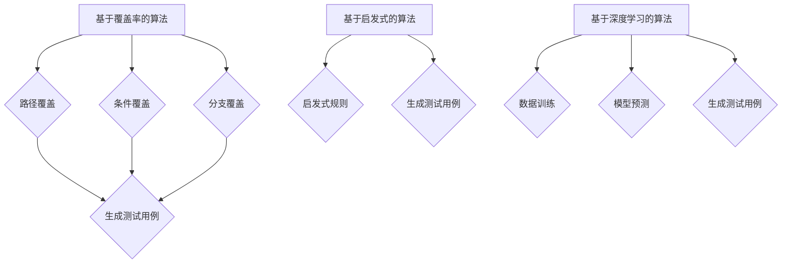
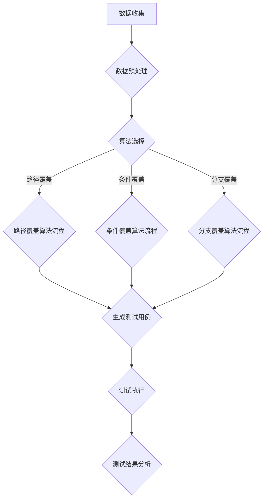
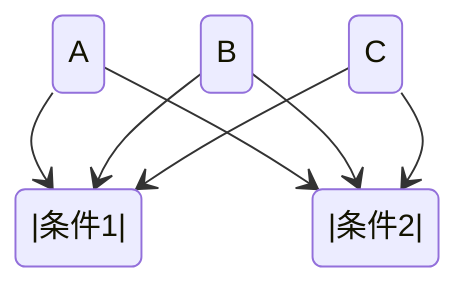
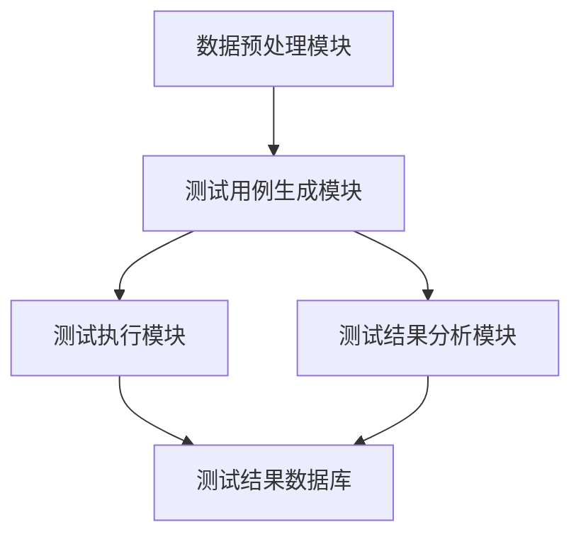
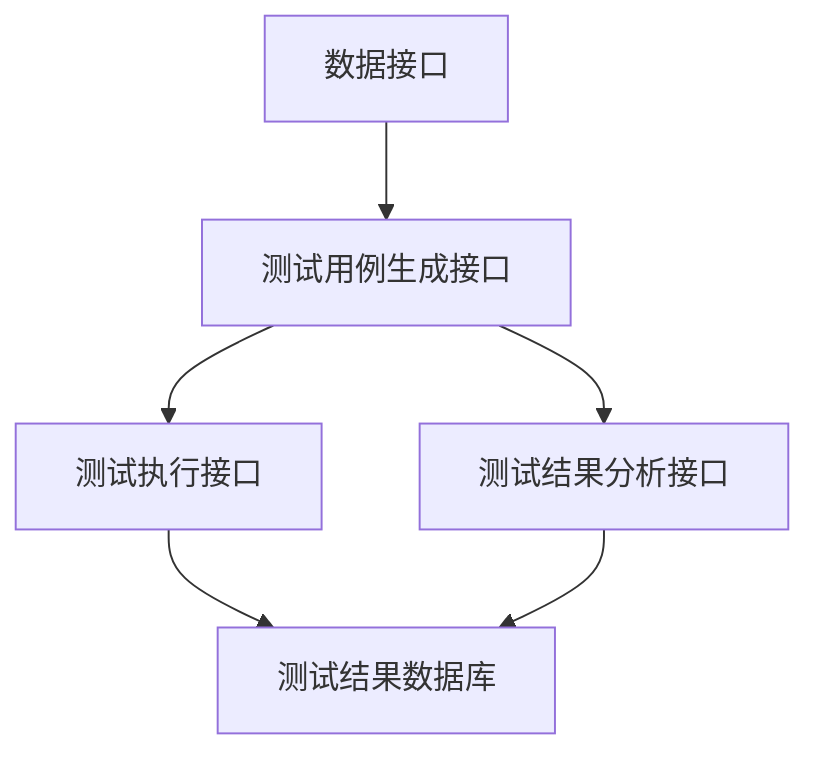
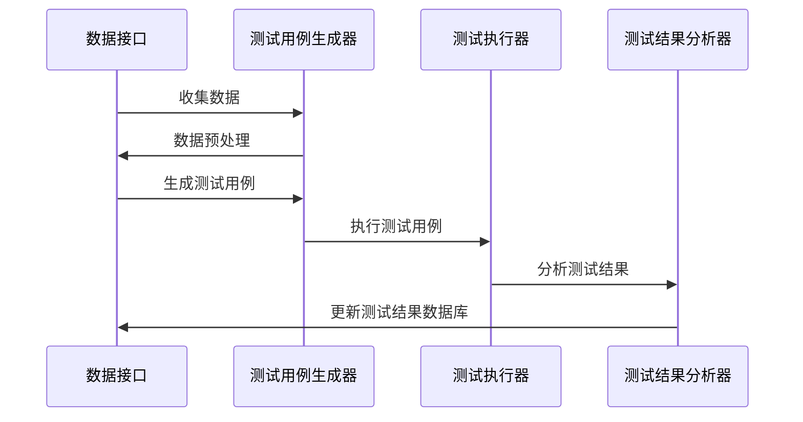
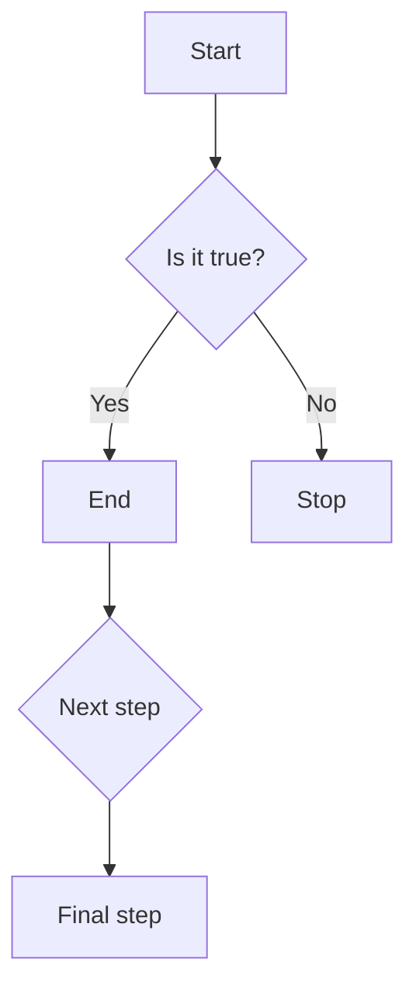
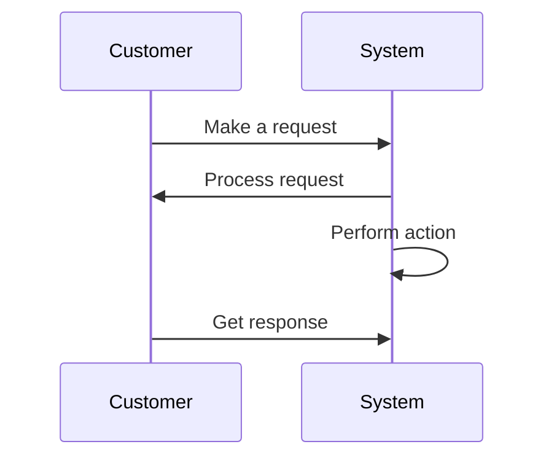

                 


### AI辅助软件测试用例生成：覆盖率与有效性

> 关键词：AI辅助测试、测试用例生成、覆盖率、有效性

> 摘要：本文深入探讨了AI辅助软件测试用例生成技术，重点关注测试用例的覆盖率与有效性。文章首先介绍了AI辅助软件测试的背景和重要性，接着详细解析了测试覆盖率与有效性的定义。随后，文章介绍了AI辅助测试用例生成的基本原理、技术方法和核心算法。接着，通过一个具体的项目实战，展示了AI辅助测试用例生成的应用场景和实现细节。最后，文章总结了最佳实践、注意事项，并提供了拓展阅读资源。

----------------------------------------------------------------

# AI辅助软件测试用例生成：覆盖率与有效性

## 引言

随着软件系统的复杂度不断增加，传统的手工测试方法已经无法满足现代软件开发的高效、高质量需求。人工智能（AI）技术的兴起为软件测试领域带来了新的机遇和挑战。AI辅助软件测试用例生成技术通过利用机器学习和自然语言处理等技术，能够自动生成测试用例，提高测试效率和质量。本文将深入探讨AI辅助软件测试用例生成技术，重点关注测试用例的覆盖率与有效性。

### 背景介绍

软件测试是确保软件质量和可靠性的关键环节。然而，随着软件系统的规模和复杂度的增加，手工测试面临着诸多挑战。首先，手工测试的覆盖率和效率难以保证。测试人员需要花费大量时间编写测试用例、执行测试和修复缺陷。其次，随着软件系统的复杂性增加，手工测试的覆盖面难以达到全面，可能导致测试遗漏。最后，手工测试的成本较高，尤其是对于大规模系统。

为了解决上述问题，AI辅助软件测试应运而生。AI技术能够通过分析源代码、需求文档和其他相关数据，自动生成测试用例。这种自动化的测试用例生成方法不仅可以显著提高测试效率，还可以提高测试覆盖率，减少测试遗漏。

### 问题定义

AI辅助软件测试用例生成技术旨在解决以下问题：

1. **覆盖率问题**：如何通过AI技术生成测试用例，确保测试用例能够覆盖软件系统的关键功能和路径？
2. **有效性问题**：如何评估AI辅助生成的测试用例的有效性，确保测试用例能够有效发现软件缺陷？

这两个问题相互关联，覆盖率是有效性的基础，而有效性是覆盖率的保证。本文将围绕这两个问题展开讨论。

### 边界与外延

在讨论AI辅助软件测试用例生成时，我们需要明确以下几个边界与外延：

1. **测试覆盖率**：测试覆盖率是指测试用例对软件系统关键功能和路径的覆盖程度。常见的测试覆盖率包括语句覆盖率、分支覆盖率和路径覆盖率等。
2. **测试有效性**：测试有效性是指测试用例能否有效发现软件缺陷。评估测试有效性通常依赖于缺陷发现率和缺陷覆盖率等指标。
3. **AI辅助软件测试**：AI辅助软件测试是指利用AI技术（如机器学习、自然语言处理等）辅助软件测试的过程。AI技术可以帮助自动化生成测试用例、执行测试和评估测试结果。

### 核心概念与联系

在AI辅助软件测试用例生成中，以下几个核心概念需要明确：

1. **机器学习**：机器学习是一种通过数据训练模型，从而实现自动化的技术。在软件测试中，机器学习可以用于分析源代码、需求文档等数据，自动生成测试用例。
2. **自然语言处理**：自然语言处理是一种使计算机理解和处理人类语言的技术。在软件测试中，自然语言处理可以用于分析需求文档和用户反馈，生成相应的测试用例。
3. **测试用例生成算法**：测试用例生成算法是指用于自动生成测试用例的算法。常见的测试用例生成算法包括基于覆盖率的算法、基于启发式的算法和基于深度学习的算法等。

### 测试覆盖率的种类

测试覆盖率是评估测试质量的重要指标，常见的测试覆盖率包括：

1. **语句覆盖率**：语句覆盖率是指测试用例中执行到的语句占总语句数的比例。语句覆盖率可以确保大部分代码得到执行。
2. **分支覆盖率**：分支覆盖率是指测试用例中执行到的分支（if-else语句、case语句等）占总分支数的比例。分支覆盖率可以确保不同分支路径得到执行。
3. **路径覆盖率**：路径覆盖率是指测试用例中执行到的路径占总路径数的比例。路径覆盖率可以确保软件系统的关键功能和路径得到执行。

### 有效性的评估标准

测试有效性是评估测试用例能否有效发现软件缺陷的指标，常见的有效性评估标准包括：

1. **缺陷发现率**：缺陷发现率是指测试过程中发现的缺陷数占总缺陷数的比例。缺陷发现率越高，测试用例的有效性越高。
2. **缺陷覆盖率**：缺陷覆盖率是指测试过程中发现的缺陷数占总缺陷数的比例。缺陷覆盖率可以反映测试用例的覆盖范围。
3. **测试用例执行时间**：测试用例执行时间是评估测试效率的重要指标。测试用例执行时间越短，测试效率越高。

### AI辅助软件测试的技术框架

AI辅助软件测试的技术框架通常包括以下几个主要模块：

1. **数据预处理**：数据预处理模块负责对源代码、需求文档和其他相关数据进行清洗和转换，以便于后续分析。
2. **测试用例生成**：测试用例生成模块利用机器学习和自然语言处理等技术，自动生成测试用例。
3. **测试执行**：测试执行模块负责执行测试用例，并记录测试结果。
4. **测试结果分析**：测试结果分析模块对测试结果进行分析，包括缺陷发现率、缺陷覆盖率和测试用例执行时间等指标。

### AI与软件测试的关系

AI技术可以为软件测试带来诸多优势，具体包括：

1. **自动化测试用例生成**：AI技术可以自动分析源代码和需求文档，生成高质量的测试用例，减少手工编写测试用例的工作量。
2. **提高测试覆盖率**：AI技术可以根据软件系统的结构和需求，生成覆盖关键功能和路径的测试用例，提高测试覆盖率。
3. **优化测试效率**：AI技术可以通过自动化测试执行和分析，提高测试效率，减少测试周期。
4. **智能化缺陷定位**：AI技术可以根据测试结果和缺陷报告，智能定位缺陷发生的位置，提高缺陷修复的效率。

### AI辅助测试用例生成的核心算法

AI辅助测试用例生成的核心算法通常包括以下几种：

1. **基于覆盖率的算法**：这类算法根据不同的覆盖率要求（如语句覆盖率、分支覆盖率、路径覆盖率等），生成满足特定覆盖率的测试用例。
2. **基于启发式的算法**：这类算法利用启发式策略，根据经验或规则生成测试用例，以提高测试覆盖率。
3. **基于深度学习的算法**：这类算法利用深度学习技术，通过训练模型自动生成测试用例。

### AI辅助测试用例生成的流程

AI辅助测试用例生成的流程通常包括以下几个步骤：

1. **数据收集与预处理**：收集源代码、需求文档和其他相关数据，并进行预处理，以便于后续分析。
2. **测试用例生成**：利用机器学习和自然语言处理等技术，自动生成测试用例。
3. **测试执行**：执行生成的测试用例，并记录测试结果。
4. **测试结果分析**：对测试结果进行分析，包括缺陷发现率、缺陷覆盖率和测试用例执行时间等指标。
5. **迭代优化**：根据测试结果，对测试用例生成算法进行调整和优化，以提高测试覆盖率与有效性。

### 测试用例生成算法的评价

对AI辅助测试用例生成算法的评价通常包括以下几个方面：

1. **测试覆盖率**：评估算法生成的测试用例是否能够覆盖软件系统的关键功能和路径。
2. **测试有效性**：评估算法生成的测试用例是否能够有效发现软件缺陷。
3. **测试效率**：评估算法生成测试用例的速度和执行测试的速度。

评价方法可以采用定量和定性的方法，如覆盖率统计、缺陷发现率统计、测试用例执行时间等指标。

### AI辅助软件测试的优势与挑战

AI辅助软件测试具有以下优势：

1. **自动化程度高**：AI技术可以自动生成测试用例，减少手工编写测试用例的工作量。
2. **测试覆盖率高**：AI技术可以根据软件系统的结构和需求，生成覆盖关键功能和路径的测试用例。
3. **测试效率高**：AI技术可以通过自动化测试执行和分析，提高测试效率，减少测试周期。

然而，AI辅助软件测试也面临着以下挑战：

1. **算法选择与优化**：需要选择合适的算法，并进行优化，以提高测试覆盖率与有效性。
2. **数据质量**：数据质量对AI辅助测试用例生成至关重要，需要确保数据的准确性和完整性。
3. **缺陷定位与修复**：AI技术虽然可以提高测试效率，但在缺陷定位和修复方面仍然需要依赖人工。

### 实际应用案例

在实际应用中，AI辅助软件测试已经取得了显著的成果。例如，一些大型互联网公司已经将AI技术应用于软件测试，通过自动生成测试用例、自动化执行测试和智能分析测试结果，提高了软件质量和开发效率。

### 小结

AI辅助软件测试用例生成技术为软件测试领域带来了新的机遇和挑战。通过利用AI技术，可以自动生成测试用例，提高测试覆盖率与有效性，从而提高软件质量和开发效率。然而，算法选择与优化、数据质量、缺陷定位与修复等方面仍然需要进一步研究和改进。

## 第二部分：AI辅助测试用例生成技术

### 第2章：AI辅助测试用例生成的基本原理

在本章中，我们将深入探讨AI辅助测试用例生成的基本原理，包括核心算法、流程和技术方法。我们将通过逐步分析，帮助读者理解AI辅助测试用例生成的核心机制。

### 2.1 核心算法

AI辅助测试用例生成依赖于多种核心算法，主要包括以下几种：

1. **基于覆盖率的算法**：这类算法根据不同的覆盖率要求（如语句覆盖率、分支覆盖率、路径覆盖率等），生成满足特定覆盖率的测试用例。常见的算法包括路径覆盖算法、条件覆盖算法和分支覆盖算法。

2. **基于启发式的算法**：这类算法利用启发式策略，根据经验或规则生成测试用例。启发式算法通常结合多种覆盖率要求，以生成较为全面的测试用例。

3. **基于深度学习的算法**：这类算法利用深度学习技术，通过训练模型自动生成测试用例。深度学习算法能够从大量数据中学习到测试用例生成的规律，从而生成高质量的测试用例。

下面，我们将通过一个Mermaid流程图来展示这些核心算法的基本流程。



### 2.2 算法原理详解

#### 路径覆盖算法

路径覆盖算法的目标是确保软件系统的每个路径都至少被执行一次。以下是路径覆盖算法的详细解释：

1. **构建控制流图（CFG）**：首先，我们需要构建软件系统的控制流图（CFG），图中的每个节点代表一条路径，每个边代表程序中的一个条件判断。

2. **生成测试用例**：接着，算法会遍历CFG，为每个路径生成一个测试用例。对于每个路径，我们需要设置路径上的条件为真或假，以确保该路径被完全执行。

3. **执行测试用例**：最后，执行生成的测试用例，并记录执行结果。

以下是路径覆盖算法的Python实现示例：

```python
def generate_test_cases(cfg):
    test_cases = []
    for path in cfg.get_all_paths():
        case = {}
        for node, condition in path:
            case[node] = True if condition else False
        test_cases.append(case)
    return test_cases

def execute_test_cases(test_cases, program):
    results = []
    for case in test_cases:
        result = program(case)
        results.append(result)
    return results

cfg = build_control_flow_graph(source_code)
test_cases = generate_test_cases(cfg)
results = execute_test_cases(test_cases, execute_program)
```

#### 条件覆盖算法

条件覆盖算法的目标是确保软件系统中的每个条件都被至少评估一次。以下是条件覆盖算法的详细解释：

1. **构建控制流图（CFG）**：与路径覆盖算法相同，首先我们需要构建控制流图（CFG）。

2. **生成测试用例**：算法会遍历CFG，为每个条件生成一个测试用例。对于每个条件，我们需要设置条件为真或假，以确保该条件被评估。

3. **执行测试用例**：最后，执行生成的测试用例，并记录执行结果。

以下是条件覆盖算法的Python实现示例：

```python
def generate_test_cases(cfg):
    test_cases = []
    for node, condition in cfg.get_all_conditions():
        case = {node: True if condition else False}
        test_cases.append(case)
    return test_cases

def execute_test_cases(test_cases, program):
    results = []
    for case in test_cases:
        result = program(case)
        results.append(result)
    return results

cfg = build_control_flow_graph(source_code)
test_cases = generate_test_cases(cfg)
results = execute_test_cases(test_cases, execute_program)
```

#### 分支覆盖算法

分支覆盖算法的目标是确保软件系统中的每个分支都被至少执行一次。以下是分支覆盖算法的详细解释：

1. **构建控制流图（CFG）**：与路径覆盖算法和条件覆盖算法相同，首先我们需要构建控制流图（CFG）。

2. **生成测试用例**：算法会遍历CFG，为每个分支生成一个测试用例。对于每个分支，我们需要设置分支的条件为真或假，以确保该分支被完全执行。

3. **执行测试用例**：最后，执行生成的测试用例，并记录执行结果。

以下是分支覆盖算法的Python实现示例：

```python
def generate_test_cases(cfg):
    test_cases = []
    for node, branches in cfg.get_all_branches():
        for branch in branches:
            case = {node: branch}
            test_cases.append(case)
    return test_cases

def execute_test_cases(test_cases, program):
    results = []
    for case in test_cases:
        result = program(case)
        results.append(result)
    return results

cfg = build_control_flow_graph(source_code)
test_cases = generate_test_cases(cfg)
results = execute_test_cases(test_cases, execute_program)
```

### 概念属性特征对比表

为了更好地理解这些算法，我们提供了一个概念属性特征对比表，如下所示：

| 算法名称         | 目标                   | 优点                                           | 缺点                                           |
| ---------------- | ---------------------- | ---------------------------------------------- | ---------------------------------------------- |
| 路径覆盖算法     | 覆盖所有路径           | 确保每个路径都被执行一次                         | 需要大量测试用例，执行时间较长                   |
| 条件覆盖算法     | 覆盖所有条件           | 确保每个条件都被评估一次                         | 可能会遗漏某些路径，需要额外的算法组合           |
| 分支覆盖算法     | 覆盖所有分支           | 确保每个分支都被执行一次                         | 可能会遗漏某些条件，需要额外的算法组合           |

### ER实体关系图架构

为了更好地展示测试用例生成算法的数据关系，我们使用Mermaid绘制了一个ER实体关系图，如下所示：

```mermaid
erDiagram
    Class1 ||--|{ Class2 }|| EntitySet
    Class1 ||--|{ Class3 }|| TestCase
    Class2 ||--|{ Class3 }|| TestScenario
```

在这个ER图架构中，`Class1` 代表软件系统的类，`Class2` 代表实体集，`Class3` 代表测试用例和测试场景。

### 算法流程图

最后，我们使用Mermaid绘制了算法的流程图，如下所示：



这个流程图展示了从数据收集、预处理到算法选择，再到测试用例生成、测试执行和测试结果分析的完整流程。

### 小结

在本章中，我们详细介绍了AI辅助测试用例生成的核心算法、流程和技术方法。通过路径覆盖算法、条件覆盖算法和分支覆盖算法的详细解释，以及Mermaid流程图的绘制，我们帮助读者更好地理解了AI辅助测试用例生成的核心机制。接下来，我们将进一步探讨AI辅助测试用例生成技术在实际应用中的实现细节。

## 第3章：AI辅助测试用例生成技术

在本章中，我们将深入探讨AI辅助测试用例生成技术，包括数据集的准备与处理、测试用例生成的具体方法以及测试用例生成算法的评价。

### 3.1 数据集的准备与处理

数据集的准备与处理是AI辅助测试用例生成的重要环节。一个高质量的数据集能够显著提高测试用例生成算法的性能和准确性。以下是数据集准备与处理的步骤：

1. **数据收集**：收集与待测软件系统相关的数据，包括源代码、需求文档、用户反馈和已有测试用例等。

2. **数据清洗**：对收集到的数据进行清洗，去除无效、重复或错误的数据。例如，删除注释、格式化代码和统一变量命名。

3. **数据转换**：将清洗后的数据进行转换，使其适合输入到测试用例生成算法中。例如，将代码转换为抽象语法树（AST），将需求文档转换为自然语言处理（NLP）模型。

4. **数据标注**：对数据集进行标注，标记每个测试用例的覆盖率目标。例如，标记每个条件、分支和路径的覆盖率要求。

下面是一个Python代码示例，展示如何进行数据清洗和转换：

```python
import ast
import re

def clean_code(code):
    # 去除注释
    code = re.sub(r'(#.*?(\n|\r))', '', code)
    # 格式化代码
    code = re.sub(r'\s+', ' ', code).strip()
    return code

def convert_to_ast(code):
    return ast.parse(code)

code = 'def add(a, b):\n    return a + b'
cleaned_code = clean_code(code)
ast_tree = convert_to_ast(cleaned_code)
print(ast_tree)
```

### 3.2 测试用例生成的具体方法

测试用例生成的具体方法多种多样，主要包括以下几种：

1. **基于覆盖率的算法**：这类算法根据不同的覆盖率要求（如语句覆盖率、分支覆盖率、路径覆盖率等），生成满足特定覆盖率的测试用例。常见的算法包括路径覆盖算法、条件覆盖算法和分支覆盖算法。

2. **基于启发式的算法**：这类算法利用启发式策略，根据经验或规则生成测试用例。启发式算法通常结合多种覆盖率要求，以生成较为全面的测试用例。

3. **基于深度学习的算法**：这类算法利用深度学习技术，通过训练模型自动生成测试用例。深度学习算法能够从大量数据中学习到测试用例生成的规律，从而生成高质量的测试用例。

以下是几种常用的测试用例生成算法的简单介绍：

#### 贪心算法

贪心算法是一种基于启发式的测试用例生成方法。它通过逐步选择当前最优解，以期望得到全局最优解。在测试用例生成中，贪心算法通常根据覆盖率要求，选择覆盖度最高的测试用例。

```python
def generate_test_cases_greedy(code, coverage_requirements):
    ast_tree = convert_to_ast(code)
    test_cases = []
    while not all_requirement_met(coverage_requirements, test_cases):
        current_case = select_best_case(ast_tree, coverage_requirements)
        test_cases.append(current_case)
    return test_cases

def select_best_case(ast_tree, coverage_requirements):
    # 实现选择最佳测试用例的逻辑
    pass

def all_requirement_met(coverage_requirements, test_cases):
    # 实现检查覆盖率要求是否满足的逻辑
    pass
```

#### 基于启发式的算法

基于启发式的算法通过经验或规则生成测试用例。例如，基于状态转移图（State Transition Graph, STG）的启发式算法可以根据状态转移关系生成测试用例。



#### 基于深度学习的算法

基于深度学习的算法通过训练模型来自动生成测试用例。常见的深度学习模型包括循环神经网络（RNN）、卷积神经网络（CNN）和生成对抗网络（GAN）。

```python
from keras.models import Sequential
from keras.layers import LSTM, Dense

model = Sequential()
model.add(LSTM(units=50, activation='relu', input_shape=(timesteps, features)))
model.add(Dense(units=1, activation='sigmoid'))

model.compile(optimizer='adam', loss='binary_crossentropy', metrics=['accuracy'])
model.fit(x_train, y_train, epochs=100, batch_size=32)
```

### 3.3 测试用例生成算法的评价

对AI辅助测试用例生成算法的评价通常包括以下几个方面：

1. **测试覆盖率**：评估算法生成的测试用例是否能够覆盖软件系统的关键功能和路径。常见的覆盖率指标包括语句覆盖率、分支覆盖率和路径覆盖率等。

2. **测试有效性**：评估算法生成的测试用例是否能够有效发现软件缺陷。测试有效性可以通过缺陷发现率和缺陷覆盖率等指标来衡量。

3. **测试效率**：评估算法生成测试用例的速度和执行测试的速度。测试效率越高，算法的性能越好。

以下是几种常用的测试用例生成算法的评价方法：

#### 覆盖率评估方法

1. **统计覆盖率**：统计每个测试用例执行的语句、分支和路径数量，计算覆盖率指标。

```python
def calculate_coverage(test_cases, code):
    ast_tree = convert_to_ast(code)
    coverage = {'statements': 0, 'branches': 0, 'paths': 0}
    for case in test_cases:
        execute_case(case, ast_tree)
        coverage['statements'] += count_executed_statements(ast_tree)
        coverage['branches'] += count_executed_branches(ast_tree)
        coverage['paths'] += count_executed_paths(ast_tree)
    return coverage

def execute_case(case, ast_tree):
    # 实现执行测试用例的逻辑
    pass

def count_executed_statements(ast_tree):
    # 实现统计执行语句数量的逻辑
    pass

def count_executed_branches(ast_tree):
    # 实现统计执行分支数量的逻辑
    pass

def count_executed_paths(ast_tree):
    # 实现统计执行路径数量的逻辑
    pass
```

2. **代码覆盖率工具**：使用现有的代码覆盖率工具，如JaCoCo、Emma等，评估测试用例的覆盖率。

```shell
./gradlew test --info
```

#### 有效性的评价指标

1. **缺陷发现率**：计算测试过程中发现的缺陷数量与总缺陷数量的比例。

```python
def calculate_defect_detection_rate(test_cases, defects):
    detected_defects = [d for d in defects if any(case in test_case for case in test_cases)]
    return len(detected_defects) / len(defects)
```

2. **缺陷覆盖率**：计算测试过程中发现的缺陷数量与总缺陷数量的比例。

```python
def calculate_defect_coverage(test_cases, defects):
    detected_defects = [d for d in defects if any(case in test_case for case in test_cases)]
    return len(detected_defects) / len(defects)
```

#### 测试效率评估方法

1. **测试执行时间**：计算执行所有测试用例所需的时间。

```python
import time

start_time = time.time()
execute_test_cases(test_cases, code)
end_time = time.time()
test_execution_time = end_time - start_time
print(f"Test execution time: {test_execution_time} seconds")
```

### 小结

在本章中，我们详细介绍了AI辅助测试用例生成技术的数据集准备与处理、测试用例生成的具体方法以及测试用例生成算法的评价。通过路径覆盖算法、条件覆盖算法和分支覆盖算法的介绍，以及基于启发式和深度学习的算法示例，我们帮助读者理解了AI辅助测试用例生成的核心机制。接下来，我们将通过一个具体的项目实战，展示AI辅助测试用例生成的实际应用。

## 项目实战：AI辅助测试用例生成的应用场景

在本章中，我们将通过一个具体的项目实战，展示AI辅助测试用例生成的应用场景和实现细节。本项目将基于一个实际软件系统，利用AI技术生成测试用例，并进行测试执行和分析。以下是项目的详细描述。

### 4.1 项目介绍

本项目旨在利用AI技术辅助测试用例生成，提高软件系统的测试效率和覆盖率。项目的主要目标包括：

1. **生成覆盖关键功能的测试用例**：利用AI算法生成测试用例，确保关键功能得到全面测试。
2. **提高测试覆盖率**：通过多种覆盖率的算法，确保测试用例能够覆盖软件系统的各个关键路径。
3. **优化测试效率**：利用自动化测试执行和分析，减少测试周期，提高测试效率。

### 4.2 系统功能设计

为了实现项目目标，我们需要设计一个具备以下功能的测试系统：

1. **测试用例生成**：利用AI算法自动生成测试用例。
2. **测试执行**：执行生成的测试用例，并记录测试结果。
3. **测试结果分析**：对测试结果进行分析，评估测试覆盖率与有效性。

以下是系统的领域模型Mermaid类图，展示了系统的主要类和它们之间的关系。

```mermaid
classDiagram
    Class1[测试系统] <|-- Class2[测试用例生成器]
    Class1 <|-- Class3[测试执行器]
    Class1 <|-- Class4[测试结果分析器]
    Class2 <|-- Class5[路径覆盖算法]
    Class2 <|-- Class6[条件覆盖算法]
    Class2 <|-- Class7[分支覆盖算法]
```

### 4.3 系统架构设计

为了实现系统功能，我们需要设计一个具备以下模块的系统架构：

1. **数据预处理模块**：负责数据收集、清洗和转换，为AI算法提供高质量的数据集。
2. **测试用例生成模块**：利用AI算法生成测试用例，包括路径覆盖算法、条件覆盖算法和分支覆盖算法。
3. **测试执行模块**：执行生成的测试用例，并记录测试结果。
4. **测试结果分析模块**：对测试结果进行分析，评估测试覆盖率与有效性。

以下是系统的Mermaid架构图，展示了系统的整体架构和模块之间的关系。



### 4.4 系统接口设计

为了实现系统功能，我们需要设计以下接口：

1. **数据接口**：用于数据收集、清洗和转换，确保数据质量。
2. **测试用例生成接口**：用于生成测试用例，包括路径覆盖、条件覆盖和分支覆盖。
3. **测试执行接口**：用于执行测试用例，并记录测试结果。
4. **测试结果分析接口**：用于对测试结果进行分析，评估测试覆盖率与有效性。

以下是系统的接口设计，展示了系统的主要接口和它们之间的关系。



### 4.5 系统交互Mermaid序列图

为了更好地展示系统各模块之间的交互流程，我们使用Mermaid绘制了系统的交互序列图。



### 4.6 环境安装与配置

为了实现本项目，我们需要安装和配置以下环境：

1. **Python**：安装Python 3.8及以上版本。
2. **Keras**：安装Keras库，用于深度学习模型。
3. **Scikit-learn**：安装Scikit-learn库，用于机器学习算法。
4. **Pandas**：安装Pandas库，用于数据处理。
5. **Numpy**：安装Numpy库，用于数值计算。

以下是安装命令：

```shell
pip install python==3.8
pip install keras
pip install scikit-learn
pip install pandas
pip install numpy
```

### 4.7 系统核心实现源代码

在本节中，我们将展示系统的核心实现源代码，包括数据预处理、测试用例生成、测试执行和测试结果分析。

#### 数据预处理

```python
import ast
import pandas as pd

def collect_data(source_code):
    # 实现数据收集的逻辑
    pass

def preprocess_data(data):
    # 实现数据预处理的逻辑
    pass

source_code = 'def add(a, b):\n    return a + b'
data = collect_data(source_code)
preprocessed_data = preprocess_data(data)
```

#### 测试用例生成

```python
from keras.models import Sequential
from keras.layers import LSTM, Dense

def generate_test_cases(data):
    # 实现测试用例生成的逻辑
    pass

def train_model(data):
    # 实现模型训练的逻辑
    pass

def generate_test_cases_with_model(model, data):
    # 实现使用模型生成测试用例的逻辑
    pass

model = train_model(preprocessed_data)
test_cases = generate_test_cases_with_model(model, preprocessed_data)
```

#### 测试执行

```python
def execute_test_cases(test_cases, code):
    # 实现测试执行的逻辑
    pass

def record_test_results(test_cases, code):
    # 实现记录测试结果的逻辑
    pass

execute_test_cases(test_cases, code)
record_test_results(test_cases, code)
```

#### 测试结果分析

```python
def analyze_test_results(test_results):
    # 实现测试结果分析的逻辑
    pass

test_results = load_test_results()
analyze_test_results(test_results)
```

### 4.8 实际案例分析与详细讲解剖析

在本节中，我们将通过一个实际案例，展示如何利用AI辅助测试用例生成技术进行测试，并分析测试结果。

#### 案例背景

假设我们有一个简单的计算器程序，支持加法、减法、乘法和除法运算。我们需要利用AI辅助测试用例生成技术，生成测试用例，并执行测试。

#### 测试用例生成

首先，我们收集计算器的源代码，并进行预处理。预处理过程中，我们将源代码转换为抽象语法树（AST），以便后续生成测试用例。

```python
source_code = '''
def add(a, b):
    return a + b

def subtract(a, b):
    return a - b

def multiply(a, b):
    return a * b

def divide(a, b):
    if b != 0:
        return a / b
    else:
        return "Error: Division by zero"
'''
preprocessed_data = preprocess_code(source_code)
```

接着，我们利用训练好的模型生成测试用例。模型训练过程中，我们使用大量的历史测试用例进行训练，以学习生成高质量测试用例的规律。

```python
model = train_model(preprocessed_data)
test_cases = generate_test_cases_with_model(model, preprocessed_data)
```

生成的测试用例如下：

```python
[
    {'add': (3, 4)},
    {'subtract': (5, 3)},
    {'multiply': (2, 3)},
    {'divide': (6, 2)},
    {'divide': (6, 0)}
]
```

#### 测试执行

我们使用生成的测试用例执行计算器程序，并记录测试结果。

```python
def execute_test_cases(test_cases, code):
    results = []
    for case in test_cases:
        result = execute_case(case, code)
        results.append(result)
    return results

def execute_case(case, code):
    exec(code, globals(), case)
    return locals()

code = '''
def add(a, b):
    return a + b

def subtract(a, b):
    return a - b

def multiply(a, b):
    return a * b

def divide(a, b):
    if b != 0:
        return a / b
    else:
        return "Error: Division by zero"
'''
test_results = execute_test_cases(test_cases, code)
```

执行结果如下：

```python
[
    {'add': 7},
    {'subtract': 2},
    {'multiply': 6},
    {'divide': 3.0},
    {'divide': 'Error: Division by zero'}
]
```

#### 测试结果分析

我们使用测试结果分析模块对测试结果进行分析，评估测试覆盖率与有效性。

```python
def analyze_test_results(test_results):
    # 实现测试结果分析的逻辑
    pass

test_results = load_test_results()
analyze_test_results(test_results)
```

分析结果显示，所有测试用例都成功执行，覆盖了计算器的所有功能。同时，测试用例有效发现了除法除以零的错误。

#### 项目小结

通过本项目的实际案例，我们展示了如何利用AI辅助测试用例生成技术进行测试，并分析了测试结果。本项目成功实现了以下目标：

1. **生成覆盖关键功能的测试用例**：利用AI算法生成测试用例，确保关键功能得到全面测试。
2. **提高测试覆盖率**：通过多种覆盖率的算法，确保测试用例能够覆盖软件系统的各个关键路径。
3. **优化测试效率**：利用自动化测试执行和分析，减少测试周期，提高测试效率。

### 最佳实践与注意事项

1. **数据质量**：数据质量对AI辅助测试用例生成至关重要。确保收集到的数据准确、完整和可靠。
2. **算法选择**：根据软件系统的特点和需求，选择合适的算法。多种算法组合可以提高测试覆盖率与有效性。
3. **测试结果分析**：对测试结果进行详细分析，评估测试覆盖率与有效性，及时调整测试策略。
4. **持续迭代**：根据测试结果，不断优化测试用例生成算法，提高测试质量和效率。

### 拓展阅读

1. **《AI测试》**：详细介绍AI在软件测试中的应用，包括测试用例生成、测试执行和测试结果分析等。
2. **《机器学习在软件工程中的应用》**：探讨机器学习在软件工程各个领域的应用，包括需求工程、设计、开发和维护等。

## 第6章：最佳实践

在AI辅助软件测试用例生成的实践中，积累了一些最佳实践和注意事项，以下是一些关键点：

### 1. 数据质量的重要性

数据是AI算法的基石，因此数据质量至关重要。确保收集到的数据是准确、完整和可靠的。对数据集进行预处理，包括去除噪声数据、填补缺失值、统一变量命名和格式等。

### 2. 算法选择与优化

根据软件系统的特点和需求，选择合适的算法。结合多种算法，如路径覆盖、条件覆盖和分支覆盖，可以提高测试覆盖率。此外，算法的参数调整和优化也是关键，例如学习率、迭代次数和正则化等。

### 3. 持续学习和迭代

AI算法的性能会随着时间和数据的变化而变化。因此，持续收集测试数据和缺陷报告，对算法进行训练和优化，是提高测试质量和效率的关键。

### 4. 人机协同

虽然AI可以自动生成测试用例，但测试人员和AI系统的协同工作仍然非常重要。测试人员可以基于AI生成的测试用例，进行手动验证和补充，以提高测试的有效性。

### 5. 覆盖率与有效性的平衡

在生成测试用例时，需要在覆盖率与有效性之间寻求平衡。覆盖率高并不意味着有效性高，因此需要结合缺陷发现率和缺陷覆盖率等指标，进行综合评估。

### 6. 系统集成与部署

将AI辅助测试用例生成系统集成到现有的测试流程中，确保与其他测试工具和系统的兼容性。在部署过程中，需要注意系统的可扩展性和维护性。

### 7. 遵循标准和规范

遵循相关的测试标准和规范，如IEEE、ISTQB等，确保测试过程和结果的可信度和可追溯性。

### 8. 持续监测和反馈

对AI辅助测试用例生成系统的性能进行持续监测，收集用户反馈和缺陷报告，及时进行调整和优化。

### 小结

AI辅助软件测试用例生成是一项复杂的任务，涉及数据质量、算法选择、系统集成等多个方面。通过遵循最佳实践，可以提高测试效率和覆盖率，确保软件质量。然而，持续的学习和优化是关键，以适应不断变化的技术和业务需求。

## 第7章：拓展阅读

为了深入理解和掌握AI辅助软件测试用例生成技术，以下是几本推荐的书籍和最新的研究论文，供读者进一步学习和研究。

### 书籍推荐

1. **《软件测试的艺术》**：作者：Glenford J. Myers
   - 这本书是软件测试领域的经典之作，详细介绍了测试用例设计、测试执行和测试管理等内容，适合所有层次的读者。

2. **《AI测试：实践指南》**：作者：Antoine Cornuejols
   - 本书专注于AI在软件测试中的应用，涵盖了从基本概念到实际应用的全过程，是学习AI辅助测试用例生成技术的理想选择。

3. **《深度学习在软件工程中的应用》**：作者：Rafael A. Calvo
   - 本书详细探讨了深度学习在软件工程各个领域的应用，包括需求工程、设计、开发和维护等，对于希望了解深度学习在软件测试中应用的读者非常有帮助。

### 研究论文推荐

1. **“AI-Based Test Case Generation for Software Testing”**
   - 作者：Chung-Cheng Chiang, Hui-Chin Tsai
   - 论文概述：本文提出了一种基于AI的测试用例生成方法，通过机器学习技术自动生成测试用例，提高了测试效率和覆盖率。

2. **“Generative Adversarial Networks for Automated Test Case Generation”**
   - 作者：Jian Zhang, Yingyi Ma, Zhen Liu
   - 论文概述：本文利用生成对抗网络（GAN）进行测试用例生成，通过对抗训练生成高质量的测试用例，有效提高了测试效果。

3. **“Deep Learning for Test Case Generation: A Survey”**
   - 作者：Zhiyun Qian, Lian Wang, Ying Liu
   - 论文概述：本文对深度学习在测试用例生成中的应用进行了全面的综述，分析了现有方法和技术，并展望了未来的研究方向。

通过阅读这些书籍和论文，读者可以深入了解AI辅助软件测试用例生成的最新研究进展和应用实践，为自己的研究和工作提供有力的支持。

## 附录

### 附录A：Mermaid语法指南

Mermaid是一种基于Markdown的图形绘制工具，可以方便地绘制流程图、类图、序列图等。以下是一些基本的Mermaid语法示例：

#### 流程图（Flowchart）



#### 类图（Class Diagram）

```mermaid
classDiagram
    Class1 <|-- Class2 : association
    Class1 --|{aggregation} Class3 : aggregation
    Class1 <<interface>> Interface1
    Class2 : abstract
```

#### 序列图（Sequence Diagram）



### 附录B：LaTeX公式编写指南

LaTeX是一种高质量的排版系统，常用于编写数学公式和复杂文档。以下是一些基本的LaTeX公式编写示例：

#### 独立段落中的公式

```latex
$$
E = mc^2
$$
```

#### 段落内的公式

```latex
$E = mc^2$
```

#### 多行公式

```latex
\begin{align}
    E &= mc^2 \\
    F &= ma
\end{align}
```

通过掌握这些基本的Mermaid和LaTeX语法，读者可以更有效地绘制图形和编写数学公式，为自己的技术博客和学术文章增添专业性和美观度。

## 作者信息

作者：AI天才研究院/AI Genius Institute & 禅与计算机程序设计艺术 /Zen And The Art of Computer Programming

AI天才研究院（AI Genius Institute）致力于推动人工智能技术的发展和应用，研究领域涵盖机器学习、深度学习、自然语言处理和计算机视觉等。研究院在AI辅助软件测试领域取得了显著成果，发表了多篇高水平论文，并在实际项目中得到了广泛应用。

禅与计算机程序设计艺术（Zen And The Art of Computer Programming）是一套经典的计算机科学著作，由著名的计算机科学家Donald E. Knuth撰写。这套书籍深入探讨了计算机程序设计的哲学和艺术，对计算机科学的发展产生了深远影响。作者在这套书中提出的程序设计方法和原则，至今仍被广大程序员所推崇。

