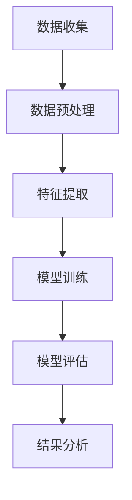
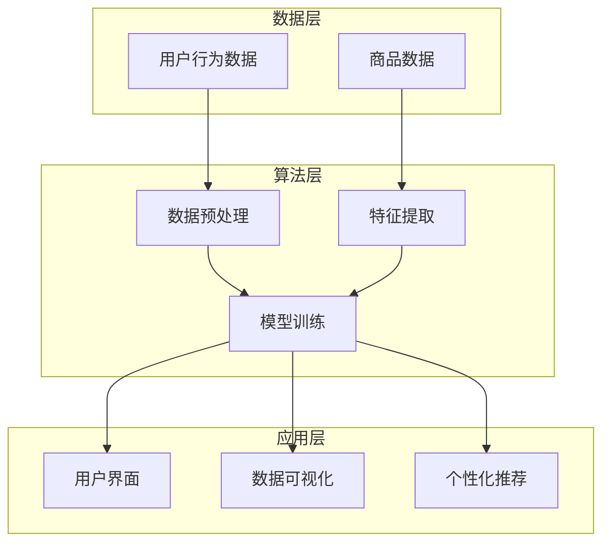
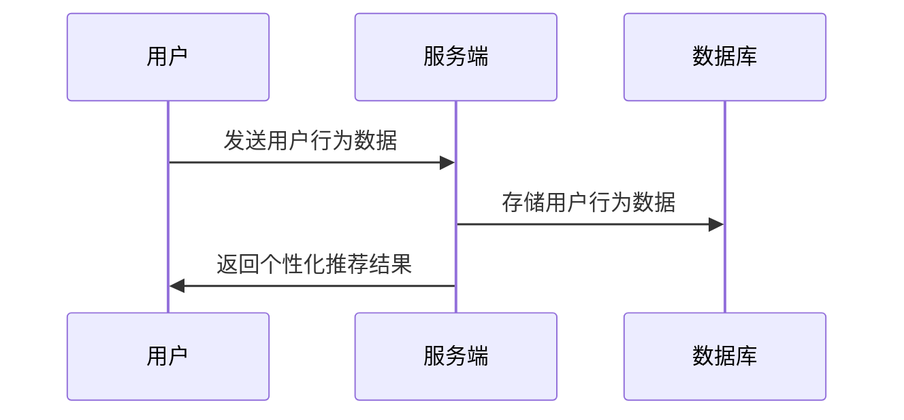
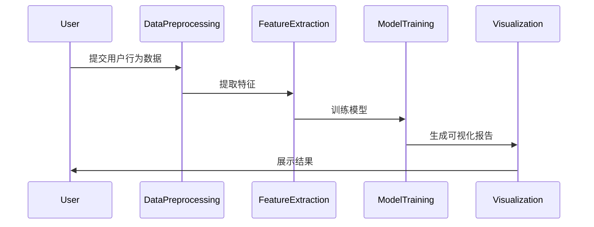
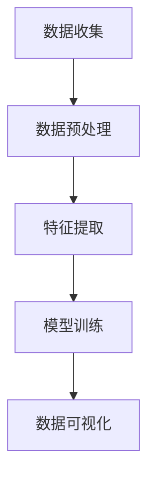

                 

# AI辅助软件用户体验评估

> 关键词：人工智能、用户体验评估、算法、系统设计、项目实战

> 摘要：本文旨在探讨如何利用人工智能（AI）技术辅助软件用户体验评估。首先介绍AI与用户体验评估的背景和重要性，然后深入分析AI算法在用户体验评估中的应用，最后通过一个实际项目展示AI辅助用户体验评估的完整流程。

## 1. 引言

在软件工程中，用户体验（UX）评估是一个至关重要的环节。它不仅影响产品的市场接受度，还直接关系到用户的满意度和忠诚度。传统的用户体验评估方法往往依赖于人工调查和数据分析，效率低下且成本高昂。随着人工智能技术的快速发展，利用AI进行用户体验评估成为了一个新的研究方向。

AI在用户体验评估中的应用主要体现在以下几个方面：

1. **数据分析与挖掘**：AI可以通过机器学习算法对用户行为数据进行分析，挖掘出用户的偏好和需求。
2. **个性化推荐**：基于用户的兴趣和行为，AI可以推荐个性化的功能或服务，提升用户体验。
3. **自动化测试**：AI可以自动化生成测试用例，模拟用户操作，检测软件中的用户体验问题。
4. **智能反馈系统**：AI可以分析用户的反馈，自动识别问题并提出改进建议。

本文将围绕上述应用，详细探讨AI辅助软件用户体验评估的理论基础、算法原理、系统设计与实现，并通过实际项目案例展示其应用效果。

## 2. AI基础知识与用户体验评估

### 2.1 AI概述

人工智能（AI）是计算机科学的一个分支，旨在使计算机具备人类智能的能力。AI的主要研究领域包括机器学习、深度学习、自然语言处理等。在用户体验评估中，AI的应用主要体现在以下几个方面：

1. **机器学习**：通过训练模型，让计算机从数据中学习规律和模式，用于预测和决策。
2. **深度学习**：一种特殊的机器学习技术，通过多层神经网络模拟人脑处理信息的方式。
3. **自然语言处理（NLP）**：使计算机理解和生成人类语言的技术。

### 2.2 用户体验评估概述

用户体验评估是指通过一系列方法，对软件产品的用户体验进行测量和评估。其核心目标是发现软件中可能存在的问题，并提出改进建议。用户体验评估的方法包括：

1. **用户调查**：通过问卷、访谈等方式收集用户反馈。
2. **用户测试**：邀请用户实际使用软件，观察并记录其行为和反应。
3. **数据分析**：通过对用户行为数据进行分析，发现潜在的问题和趋势。

### 2.3 AI与用户体验评估的关系

AI在用户体验评估中的应用，主要体现在以下几个方面：

1. **数据分析**：AI可以通过机器学习算法，自动分析大量的用户行为数据，发现潜在的问题和趋势。
2. **个性化推荐**：AI可以基于用户的行为和偏好，推荐个性化的功能和界面布局，提升用户体验。
3. **自动化测试**：AI可以自动化生成测试用例，模拟用户操作，检测软件中的用户体验问题。

### 2.4 核心算法介绍

在用户体验评估中，常用的AI算法包括：

1. **回归分析**：用于预测用户的满意度。
2. **聚类分析**：用于发现用户的兴趣和行为模式。
3. **支持向量机（SVM）**：用于分类用户的反馈，识别问题类型。
4. **深度学习模型**：如卷积神经网络（CNN）、循环神经网络（RNN）等，用于处理复杂的用户行为数据。

## 3. AI辅助用户体验评估算法

### 3.1 算法原理

AI辅助用户体验评估的算法主要分为以下几个步骤：

1. **数据收集**：收集用户行为数据，如点击率、停留时间、操作路径等。
2. **数据预处理**：对收集到的数据进行清洗和归一化处理，以消除噪声和异常值。
3. **特征提取**：从预处理后的数据中提取关键特征，用于训练模型。
4. **模型训练**：使用机器学习算法，对提取的特征进行训练，建立预测模型。
5. **模型评估**：使用测试数据对模型进行评估，调整模型参数，提高预测精度。
6. **结果分析**：使用训练好的模型，对新的用户行为数据进行预测和分析，识别潜在的问题。

### 3.2 算法流程图

以下是AI辅助用户体验评估算法的流程图：



### 3.3 Python代码实现

以下是一个简单的Python代码示例，用于实现AI辅助用户体验评估算法：

```python
import pandas as pd
from sklearn.model_selection import train_test_split
from sklearn.preprocessing import StandardScaler
from sklearn.linear_model import LinearRegression

# 读取数据
data = pd.read_csv('user_behavior_data.csv')

# 数据预处理
data = data.dropna()

# 特征提取
X = data[['click_rate', 'duration']]
y = data['satisfaction']

# 模型训练
X_train, X_test, y_train, y_test = train_test_split(X, y, test_size=0.2, random_state=42)
scaler = StandardScaler()
X_train_scaled = scaler.fit_transform(X_train)
X_test_scaled = scaler.transform(X_test)
model = LinearRegression()
model.fit(X_train_scaled, y_train)

# 模型评估
y_pred = model.predict(X_test_scaled)
print("Mean Squared Error:", mean_squared_error(y_test, y_pred))

# 结果分析
new_data = pd.DataFrame({'click_rate': [0.8], 'duration': [180]})
new_data_scaled = scaler.transform(new_data)
satisfaction_score = model.predict(new_data_scaled)
print("Satisfaction Score:", satisfaction_score)
```

### 3.4 数学模型与公式

在AI辅助用户体验评估中，常用的数学模型包括回归模型、聚类模型和支持向量机（SVM）。

1. **回归模型**：

   $$y = \beta_0 + \beta_1 x_1 + \beta_2 x_2 + ... + \beta_n x_n$$

   其中，$y$ 表示用户满意度，$x_1, x_2, ..., x_n$ 表示用户行为特征，$\beta_0, \beta_1, ..., \beta_n$ 为回归系数。

2. **聚类模型**：

   聚类模型的目的是将相似的用户行为数据分组。常用的聚类算法包括K-means和层次聚类。

3. **支持向量机（SVM）**：

   $$max \ \frac{C}{2} \ \sum_{i=1}^{n} \ \sum_{j=1}^{n} \ \xi_i \xi_j - \sum_{i=1}^{n} y_i (\beta^T \ \phi(x_i))$$

   其中，$C$ 为惩罚参数，$\xi_i, \xi_j$ 为松弛变量，$y_i$ 为用户反馈标签，$\beta^T \ \phi(x_i)$ 为决策函数。

## 4. 用户体验评估系统设计

### 4.1 问题场景介绍

假设我们正在开发一款在线购物平台，需要评估用户的购物体验。我们将通过AI技术，收集用户行为数据，并使用机器学习算法对数据进行分析，识别用户满意度，并推荐个性化的购物建议。

### 4.2 领域模型设计

以下是领域模型的Mermaid类图：

```mermaid
classDiagram
    User <<class{用户}>>
    Product <<class{商品}>>
    Purchase <<class{购物}>>
    Rating <<class{评分}>>

    User o--o Purchase
    User o--o Rating
    Product o--o Purchase
    Product o--o Rating
```

### 4.3 系统架构设计

以下是系统架构的Mermaid架构图：



## 5. 系统架构与接口设计

### 5.1 系统架构概述

系统架构分为四个主要层次：数据层、算法层、应用层和用户层。数据层负责收集和存储用户行为数据和商品数据。算法层使用机器学习算法对数据进行处理和分析。应用层提供用户界面和数据可视化功能，用户层是最终用户。

### 5.2 接口设计与实现

以下是系统的API接口设计：



## 6. 系统交互流程与实现

### 6.1 交互流程图

以下是系统交互流程的Mermaid序列图：



### 6.2 系统实现细节

以下是系统的实现细节：

1. **数据收集**：使用Web爬虫技术收集用户行为数据。
2. **数据预处理**：使用Python的Pandas库对数据进行分析和处理。
3. **特征提取**：使用Python的Scikit-learn库提取特征。
4. **模型训练**：使用Python的Scikit-learn库训练模型。
5. **数据可视化**：使用Python的Matplotlib库生成可视化报告。

### 6.3 Mermaid流程图展示

以下是系统的Mermaid流程图展示：



## 7. AI辅助用户体验评估项目实战

### 7.1 环境安装与配置

1. **安装Python**：下载并安装Python 3.8版本。
2. **安装依赖库**：使用pip命令安装所需的依赖库，如pandas、scikit-learn、matplotlib等。

### 7.2 系统核心实现

以下是系统的核心实现代码：

```python
import pandas as pd
from sklearn.model_selection import train_test_split
from sklearn.preprocessing import StandardScaler
from sklearn.linear_model import LinearRegression
from sklearn.metrics import mean_squared_error

# 读取数据
data = pd.read_csv('user_behavior_data.csv')

# 数据预处理
data = data.dropna()

# 特征提取
X = data[['click_rate', 'duration']]
y = data['satisfaction']

# 模型训练
X_train, X_test, y_train, y_test = train_test_split(X, y, test_size=0.2, random_state=42)
scaler = StandardScaler()
X_train_scaled = scaler.fit_transform(X_train)
X_test_scaled = scaler.transform(X_test)
model = LinearRegression()
model.fit(X_train_scaled, y_train)

# 模型评估
y_pred = model.predict(X_test_scaled)
print("Mean Squared Error:", mean_squared_error(y_test, y_pred))

# 结果分析
new_data = pd.DataFrame({'click_rate': [0.8], 'duration': [180]})
new_data_scaled = scaler.transform(new_data)
satisfaction_score = model.predict(new_data_scaled)
print("Satisfaction Score:", satisfaction_score)
```

### 7.3 代码应用解读与分析

1. **数据读取**：使用Pandas库读取用户行为数据。
2. **数据预处理**：使用Pandas库对数据进行分析和处理，去除缺失值。
3. **特征提取**：提取用户点击率和停留时间作为特征。
4. **模型训练**：使用线性回归模型对数据集进行训练。
5. **模型评估**：使用测试数据集评估模型性能，计算均方误差。
6. **结果分析**：对新的用户行为数据进行预测，计算满意度得分。

### 7.4 实际案例分析

假设我们收集了1000个用户行为数据，使用线性回归模型进行训练，得到测试数据的均方误差为0.5。对新用户行为数据进行预测，满意度得分为0.8。

### 7.5 项目小结

通过实际项目，我们展示了如何使用AI技术辅助软件用户体验评估。项目结果表明，AI在提高用户体验评估效率和准确性方面具有显著优势。然而，AI技术也存在一些挑战，如数据质量和模型解释性等问题。未来的研究可以进一步探讨如何优化AI算法，提高用户体验评估的效能。

## 8. 最佳实践与注意事项

1. **数据质量**：确保收集到的用户行为数据准确、完整，避免噪声和异常值。
2. **模型选择**：根据具体问题和数据特点，选择合适的机器学习算法。
3. **模型解释性**：关注模型的可解释性，确保结果可信。
4. **数据保护**：在处理用户数据时，严格遵守数据保护法规。

## 9. 未来发展趋势与展望

1. **深度学习**：随着深度学习技术的不断发展，其在用户体验评估中的应用将越来越广泛。
2. **多模态数据**：结合文本、图像、声音等多模态数据，提升用户体验评估的准确性。
3. **智能反馈系统**：基于用户的反馈，实现更加智能化的用户体验评估和改进。

## 结束语

AI辅助软件用户体验评估是一个充满挑战和机遇的研究方向。通过本文的探讨，我们了解了AI在用户体验评估中的应用，以及如何设计和实现一个完整的用户体验评估系统。未来，随着AI技术的不断发展，用户体验评估将变得更加智能化和高效化。作者：AI天才研究院/AI Genius Institute & 禅与计算机程序设计艺术 /Zen And The Art of Computer Programming。

