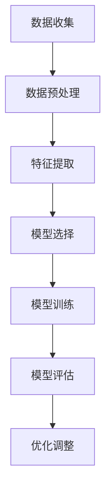
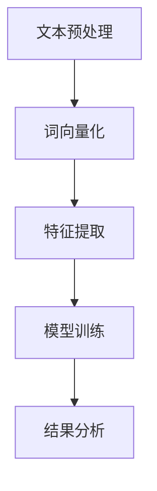
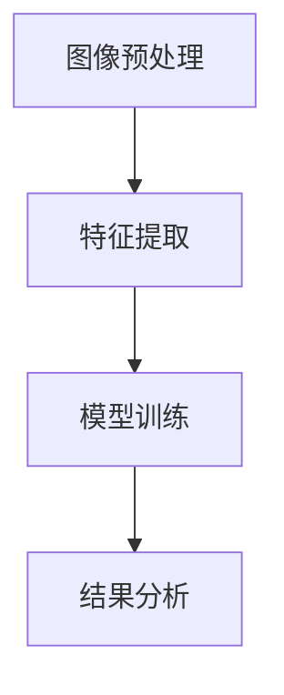

                 

### 引入

#### 软件用户体验的重要性

在当今数字化时代，软件用户体验（User Experience, UX）成为了软件成功与否的关键因素。一个良好的用户体验能够提升用户满意度、增强用户忠诚度，甚至决定用户是否继续使用一款软件。然而，评估和优化软件用户体验并非易事。传统的方法主要依赖于用户调研、访谈和问卷调查等手段，但这些方法往往耗时费力，且难以全面捕捉用户的真实感受。

#### AI技术在用户体验评估与优化中的应用

近年来，人工智能（AI）技术的飞速发展为用户体验评估与优化带来了新的可能性。通过机器学习、自然语言处理、图像识别等技术，AI能够自动化、高效地分析大量用户数据，提供深入的见解和精确的优化建议。这不仅提高了评估的准确性和效率，还使得用户体验优化变得更加科学和系统化。

#### 本文的目的与结构

本文旨在探讨AI辅助软件用户体验评估与优化的方法与应用。文章首先介绍AI辅助评估与优化的核心概念和背景，然后详细讲解相关算法原理，包括数据收集、特征提取和优化策略。接着，文章将讨论用户研究方法和评估指标，并展示如何利用AI技术进行用户行为分析和反馈处理。随后，文章将深入探讨用户界面和功能优化策略，最后通过案例研究和最佳实践总结，为读者提供实用的指导和建议。

通过本文的阅读，读者将能够全面理解AI辅助软件用户体验评估与优化的原理和应用，掌握相关技术工具和策略，从而提升软件产品的用户体验，增强用户满意度和忠诚度。

### 关键词

- 软件用户体验（Software User Experience）
- 人工智能（Artificial Intelligence）
- 用户评估（User Evaluation）
- 用户体验优化（User Experience Optimization）
- 机器学习（Machine Learning）
- 自然语言处理（Natural Language Processing）
- 用户行为分析（User Behavior Analysis）

### 摘要

本文主要探讨AI技术在软件用户体验评估与优化中的应用。首先，我们介绍了用户体验的重要性以及AI技术带来的革新。随后，文章详细讲解了AI辅助评估与优化的核心概念和算法原理，包括数据收集、特征提取和优化策略。接着，文章讨论了用户研究方法和评估指标，展示了AI技术如何自动化、高效地分析用户行为和反馈。文章进一步探讨了用户界面和功能优化策略，并提供了实际案例研究和最佳实践。通过本文，读者将能够全面理解AI辅助软件用户体验评估与优化的方法与应用，掌握相关技术工具和策略，从而提升软件产品的用户体验，增强用户满意度和忠诚度。

### 第一部分：引言与背景

#### 第1章：引言

##### 1.1 问题背景

软件用户体验（User Experience, UX）在当今数字化时代扮演着至关重要的角色。一个软件的成败往往取决于用户对其的感知和满意度。传统的方法，如用户调研、访谈和问卷调查，虽能提供一些反馈，但其局限性显而易见：首先，这些方法通常耗时且成本高昂，且难以覆盖大量用户；其次，用户的反馈往往具有主观性和模糊性，难以量化和标准化。此外，现代软件系统功能日益复杂，单一的用户调研方法无法全面捕捉用户的真实体验。

##### 1.2 问题描述

在软件设计和开发过程中，如何有效地评估和优化用户体验成为一个亟待解决的问题。具体来说，包括以下几个方面：

1. **用户需求识别**：如何准确识别和理解用户的需求和期望？
2. **用户体验评估**：如何全面、客观地评估用户体验，量化用户满意度？
3. **用户体验优化**：如何基于评估结果进行有针对性的优化，提升用户体验？

##### 1.3 问题解决

人工智能（AI）技术的发展为上述问题提供了新的解决方案。AI技术，特别是机器学习、自然语言处理和图像识别，能够自动化地处理大量用户数据，提取有效特征，提供深入的见解和精确的优化建议。具体应用场景包括：

1. **用户行为分析**：通过分析用户行为数据，识别用户的操作模式和使用习惯，从而为产品优化提供依据。
2. **用户反馈处理**：利用自然语言处理技术，自动分类和处理用户反馈，提取关键信息，为产品改进提供指导。
3. **个性化推荐**：基于用户行为数据和偏好，实现个性化推荐，提升用户的满意度和使用时长。

##### 1.4 边界与外延

本文主要关注AI在软件用户体验评估与优化中的应用，但不涉及其他领域的AI应用，如智能机器人、自动驾驶等。此外，本文的讨论范围主要涵盖桌面应用、移动应用和网页应用，不包括硬件设备和物联网（IoT）领域。

##### 1.5 概念结构与核心要素组成

为了更好地理解AI辅助软件用户体验评估与优化的流程，以下是核心概念和要素的组成：

1. **用户研究方法**：包括用户行为分析、用户反馈收集、用户访谈与调查等。
2. **用户体验评估指标**：如用户满意度、任务完成率、错误率等。
3. **AI辅助评估技术**：包括机器学习模型、自然语言处理技术、图像识别与处理等。
4. **用户体验优化策略**：涉及用户界面优化、软件功能优化、个性化推荐等。

通过这些核心要素的有机结合，AI技术能够为软件用户体验评估与优化提供全面的解决方案。

### 核心概念与联系

在本章中，我们将详细介绍与AI辅助软件用户体验评估与优化相关的核心概念，并探讨它们之间的联系。理解这些概念对于深入探讨AI技术在该领域的应用至关重要。

#### AI辅助软件用户体验评估的概念

**AI辅助软件用户体验评估**是指利用人工智能技术对软件用户体验进行评估的过程。这一过程包括数据收集、特征提取、模型训练和评估结果分析等环节。AI技术在其中发挥了关键作用，通过自动化和智能化手段，使得评估过程更加高效、准确和全面。

**数据收集**：在AI辅助评估中，数据收集是第一步，也是最重要的一步。通过用户行为日志、问卷调查、用户访谈等多种途径，收集用户在使用软件过程中的各种数据，如操作记录、反馈信息、使用时长等。

**特征提取**：数据收集完成后，需要对这些数据进行处理和转换，提取出有效的特征。特征提取是评估的关键，它直接关系到评估结果的准确性和可靠性。

**模型训练**：通过机器学习算法，对提取出的特征进行训练，构建评估模型。训练过程包括选择合适的模型架构、调整模型参数和优化模型性能等步骤。

**评估结果分析**：利用训练好的模型对用户数据进行评估，生成评估结果。这些结果可以量化用户的满意度、任务完成率、错误率等关键指标，为优化提供依据。

#### AI辅助软件用户体验优化的概念

**AI辅助软件用户体验优化**是指利用人工智能技术对软件用户体验进行优化和改进的过程。这一过程不仅包括对现有产品的优化，还包括新功能的设计和开发。

**用户界面优化**：通过分析用户行为数据，识别用户界面中的问题和不足，提出改进建议，优化界面设计，提升用户的操作效率和满意度。

**软件功能优化**：基于用户需求和行为分析结果，对软件功能进行改进，增加新功能或改进现有功能，以满足用户的需求和期望。

**个性化推荐**：利用用户行为数据和偏好信息，实现个性化推荐，提高用户的满意度和使用时长。

#### 概念属性特征对比表格

为了更清晰地展示AI辅助软件用户体验评估与优化的概念属性特征，我们可以制作一个对比表格：

| 概念        | 定义                                                         | 主要属性特征                                                                                   | 应用场景                     |
| ----------- | ------------------------------------------------------------ | ------------------------------------------------------------------------------------------------ | ---------------------------- |
| 用户体验评估 | 利用AI技术对软件用户体验进行评估的过程                     | 数据收集、特征提取、模型训练、评估结果分析                                                     | 识别问题、优化依据           |
| 用户体验优化 | 利用AI技术对软件用户体验进行优化和改进的过程               | 用户界面优化、软件功能优化、个性化推荐                                                         | 解决问题、提升体验           |

#### ER实体关系图架构

为了更好地理解AI辅助软件用户体验评估与优化的实体关系，我们可以使用ER（Entity-Relationship）图来描述这些概念及其相互关系。

```mermaid
erDiagram
  User <<|-- UserBehaviorData : 收集
  User <<|-- UserFeedback : 收集
  UserFeedback ||--|{ AIAnalysis } : 分析
  UserFeedback ||--|{ SentimentAnalysis } : 情感分析
  AIAnalysis ||--|{ FeatureExtraction } : 特征提取
  AIAnalysis ||--|{ ModelTraining } : 模型训练
  ModelTraining ||--|{ Evaluation } : 评估
  UserInterface <<|--|{ UIOptimization } : 用户界面优化
  SoftwareFunction <<|--|{ FunctionOptimization } : 软件功能优化
  PersonalizedRecommendation : 个性化推荐
```

在这个ER图中，User（用户）是核心实体，它与UserBehaviorData（用户行为数据）和UserFeedback（用户反馈）密切相关。AIAnalysis（AI分析）包括FeatureExtraction（特征提取）和ModelTraining（模型训练），其结果用于Evaluation（评估）。UserInterface（用户界面）和SoftwareFunction（软件功能）分别与UIOptimization（用户界面优化）和FunctionOptimization（软件功能优化）相关联，而PersonalizedRecommendation（个性化推荐）则独立于其他实体，通过用户数据和行为分析来提供个性化服务。

通过以上核心概念的介绍和ER图架构的展示，我们能够更深入地理解AI辅助软件用户体验评估与优化的原理和流程，为后续章节的详细探讨打下坚实的基础。

### 算法原理讲解

在理解了AI辅助软件用户体验评估与优化的基本概念之后，我们接下来将深入探讨相关算法的原理。算法的原理是AI技术在该领域应用的核心，它们通过特定的方法和步骤，实现对用户数据的处理和优化。以下是几种关键算法的详细介绍，包括流程图、Python源代码、数学模型和公式，以及通俗易懂的举例说明。

#### 机器学习算法

**1. 算法流程图**

首先，我们来看一个典型的机器学习算法的流程图，使用Mermaid语法表示：



**2. Python源代码**

以下是一个简单的Python代码示例，展示了机器学习算法的基本步骤：

```python
import pandas as pd
from sklearn.model_selection import train_test_split
from sklearn.ensemble import RandomForestClassifier
from sklearn.metrics import accuracy_score

# 数据收集
data = pd.read_csv('user_data.csv')

# 数据预处理
X = data.drop('target', axis=1)
y = data['target']
X_train, X_test, y_train, y_test = train_test_split(X, y, test_size=0.2, random_state=42)

# 特征提取
# 在这里，我们不需要额外的特征提取，直接使用数据中的特征

# 模型选择
model = RandomForestClassifier(n_estimators=100, random_state=42)

# 模型训练
model.fit(X_train, y_train)

# 模型评估
y_pred = model.predict(X_test)
accuracy = accuracy_score(y_test, y_pred)
print(f'Accuracy: {accuracy:.2f}')
```

**3. 数学模型和公式**

机器学习中的数学模型通常包括损失函数、优化算法和模型参数。以下是一个简化的线性回归模型的数学公式：

$$
y = \beta_0 + \beta_1x
$$

损失函数通常使用均方误差（MSE）：

$$
J(\theta) = \frac{1}{2m} \sum_{i=1}^{m} (h_\theta(x^{(i)}) - y^{(i)})^2
$$

优化算法如梯度下降用于最小化损失函数：

$$
\theta_j := \theta_j - \alpha \frac{\partial J(\theta)}{\partial \theta_j}
$$

**4. 举例说明**

假设我们有一个用户行为数据集，包含用户操作时长、操作频率和用户满意度评分。我们希望使用机器学习算法预测用户满意度。

- **数据收集**：收集用户的操作时长和操作频率数据，以及满意度评分。
- **数据预处理**：将数据标准化，处理缺失值和异常值。
- **特征提取**：不进行额外的特征提取，直接使用原始数据中的特征。
- **模型选择**：选择随机森林（Random Forest）作为分类器。
- **模型训练**：使用训练数据对模型进行训练。
- **模型评估**：使用测试数据评估模型的准确性，并进行优化调整。

通过上述步骤，我们可以构建一个能够预测用户满意度的模型，并根据预测结果对软件进行优化。

#### 自然语言处理算法

**1. 算法流程图**

自然语言处理（NLP）算法的基本流程通常包括文本预处理、特征提取、模型训练和结果分析。以下是其Mermaid语法表示：



**2. Python源代码**

以下是一个使用自然语言处理技术处理用户反馈的Python代码示例：

```python
import nltk
from nltk.tokenize import word_tokenize
from sklearn.feature_extraction.text import TfidfVectorizer
from sklearn.naive_bayes import MultinomialNB

# 文本预处理
nltk.download('punkt')
text = "我对这个软件的用户界面设计非常满意。"
tokens = word_tokenize(text)

# 词向量化
vectorizer = TfidfVectorizer()
X = vectorizer.fit_transform([text])

# 特征提取
# 在这里，我们使用TF-IDF向量作为特征

# 模型训练
model = MultinomialNB()
model.fit(X, y)

# 结果分析
predicted = model.predict(X)
print(f'Prediction: {predicted}')
```

**3. 数学模型和公式**

自然语言处理中的数学模型通常涉及词袋模型、TF-IDF向量化和机器学习算法。以下是一个简化的TF-IDF公式：

$$
TF(t) = \frac{f(t, D)}{f(t, D) + f(t, C)}
$$

$$
IDF(t) = \log \left( \frac{N}{n_t} + 1 \right)
$$

$$
TF-IDF(t, D) = TF(t, D) \times IDF(t)
$$

**4. 举例说明**

假设我们有一个包含用户反馈的数据集，其中每条反馈都是一段文本。我们希望使用NLP算法分析这些反馈，提取关键信息。

- **文本预处理**：对文本进行分词和标记化处理。
- **词向量化**：将文本转换为向量表示。
- **特征提取**：使用TF-IDF向量作为特征。
- **模型训练**：选择合适的分类器，如朴素贝叶斯分类器，对模型进行训练。
- **结果分析**：对新的用户反馈进行分类，提取关键信息。

通过上述步骤，我们可以构建一个能够自动分析用户反馈的模型，从而为软件优化提供依据。

#### 图像识别算法

**1. 算法流程图**

图像识别算法的基本流程包括图像预处理、特征提取、模型训练和结果分析。以下是其Mermaid语法表示：



**2. Python源代码**

以下是一个使用图像识别技术分析用户界面元素的Python代码示例：

```python
import cv2
import numpy as np
from tensorflow.keras.models import load_model

# 图像预处理
image = cv2.imread('user_interface.png')
gray = cv2.cvtColor(image, cv2.COLOR_BGR2GRAY)

# 特征提取
# 在这里，我们使用边缘检测等预处理步骤

# 模型训练
model = load_model('image_recognition_model.h5')

# 结果分析
predictions = model.predict(np.expand_dims(gray, axis=0))
print(f'Prediction: {predictions}')
```

**3. 数学模型和公式**

图像识别中的数学模型通常涉及卷积神经网络（CNN）和激活函数。以下是一个简化的CNN公式：

$$
h_\theta(x) = \text{ReLU}(z_\theta(x))
$$

$$
z_\theta(x) = \sum_{i=1}^{n} \theta_i \cdot x_i + b
$$

**4. 举例说明**

假设我们有一个用户界面的图像，其中包含用户操作的区域。我们希望使用图像识别算法识别这些操作区域。

- **图像预处理**：对图像进行灰度化和边缘检测等预处理步骤。
- **特征提取**：使用卷积神经网络提取图像的特征。
- **模型训练**：加载并训练预训练的模型。
- **结果分析**：使用模型预测图像中的操作区域，提取关键信息。

通过上述步骤，我们可以构建一个能够自动识别用户界面元素的模型，从而为界面优化提供依据。

通过以上对机器学习、自然语言处理和图像识别算法的详细介绍，我们能够更深入地理解AI技术如何辅助软件用户体验评估与优化。这些算法不仅提供了理论支持，还通过具体的代码实现展示了如何将AI技术应用于实际场景。

### 用户研究方法

在软件用户体验评估与优化过程中，用户研究方法起到了至关重要的作用。这些方法帮助我们理解用户的实际需求和反馈，从而为后续的评估和优化提供可靠的数据支持。以下是几种常见的用户研究方法，包括用户行为分析、用户反馈收集、用户访谈与调查，以及相关的工具与应用。

#### 用户行为分析

**1. 定义与作用**

用户行为分析是指通过收集和分析用户在使用软件过程中的行为数据，来识别用户的使用模式、偏好和问题。这种方法的核心在于通过观察用户的实际操作，获取客观的数据，从而提供有价值的见解。

**2. 数据来源**

用户行为数据主要来源于以下途径：

- **用户行为日志**：软件自动记录的用户操作记录，包括点击、拖动、滚动、搜索等行为。
- **系统日志**：服务器日志记录的用户行为，如访问次数、停留时长等。
- **用户设备**：通过安装的监测工具，收集用户设备的性能数据，如CPU、内存使用情况等。

**3. 分析工具**

常用的用户行为分析工具包括：

- **Google Analytics**：用于网页应用的全面分析，包括用户流量、行为路径、转化率等。
- **Mixpanel**：专注于用户行为分析，提供详细的用户行为追踪和用户生命周期分析。
- **Heap Analytics**：提供自动化的用户行为追踪，无需代码修改。

**4. 应用实例**

例如，通过用户行为分析，我们发现某个功能的使用频率较低，可以推测该功能可能不被用户所需要，从而进行优化或删除。

#### 用户反馈收集

**1. 定义与作用**

用户反馈收集是指通过多种方式收集用户对软件的看法和意见，以便了解用户的满意度、期望和痛点。用户反馈是优化软件用户体验的重要依据，能够帮助团队识别问题并提出改进措施。

**2. 收集方式**

用户反馈可以通过以下几种方式进行收集：

- **问卷调查**：设计结构化的问卷，通过在线平台或电子邮件发送给用户，获取用户的主观评价。
- **用户访谈**：与用户进行一对一或小组访谈，深入了解用户的使用习惯和体验。
- **用户回访**：定期回访用户，了解他们的使用情况和满意度，获取第一手反馈。
- **用户社区**：建立用户社区或论坛，鼓励用户分享使用体验和意见。

**3. 分析工具**

常用的用户反馈分析工具包括：

- **Qualtrics**：提供全面的问卷调查和数据分析功能。
- **UserVoice**：用于收集用户反馈和建议，并提供反馈管理功能。
- **UserTalk**：支持用户反馈的实时收集和管理。

**4. 应用实例**

例如，通过问卷调查，我们发现用户对某个功能的响应速度不满意，可以针对该功能进行性能优化。

#### 用户访谈与调查

**1. 定义与作用**

用户访谈与调查是指通过面对面交流或在线调查的形式，与用户进行深入交流，获取用户对软件的深入理解和真实感受。这种方法有助于了解用户的隐性需求和痛点，为产品设计提供有价值的参考。

**2. 进行步骤**

用户访谈与调查通常包括以下步骤：

- **准备阶段**：设计访谈或调查问卷，明确访谈或调查的目的和问题。
- **执行阶段**：与用户进行访谈或发送调查问卷，确保获取真实、有效的反馈。
- **分析阶段**：对收集到的数据进行整理和分析，提取关键见解。

**3. 分析工具**

常用的用户访谈与调查工具包括：

- **Zoom**：用于进行在线视频访谈。
- **Typeform**：提供交互式的在线调查工具。
- **Menti**：实时投票和问答工具，适用于小组讨论和会议。

**4. 应用实例**

例如，通过用户访谈，我们发现用户在操作过程中存在困惑，可以针对这些困惑进行界面优化，提高易用性。

#### 用户研究工具与应用

**1. 定义**

用户研究工具是用于支持用户研究过程的软件或平台，它们能够帮助研究人员高效地收集、管理和分析用户数据。

**2. 常见工具**

- **UserTesting**：提供真实用户测试服务，帮助产品团队了解用户对软件的直观感受。
- **Optimizely**：用于A/B测试，帮助团队验证不同设计方案的优劣。
- **Lookback**：用于用户行为分析，提供屏幕录像和用户行为追踪功能。

**3. 应用实例**

例如，通过UserTesting服务，团队可以邀请真实用户进行软件测试，获取他们的直观反馈，从而发现隐藏的问题。

通过上述用户研究方法的详细介绍，我们可以看到，用户行为分析、用户反馈收集和用户访谈与调查是评估和优化软件用户体验的重要手段。这些方法不仅能够帮助团队了解用户的真实需求，还能提供量化和具体的数据支持，为软件的持续改进提供坚实的基础。

### 用户体验评估指标

在软件用户体验评估与优化过程中，选择合适的评估指标是关键。这些指标能够量化用户满意度、任务完成率和其他相关度量，帮助团队识别软件中的问题和优化机会。以下是一些常见的用户体验评估指标，包括其定义、测量方法和应用场景。

#### 用户满意度评估

**1. 定义**

用户满意度评估是指通过量化和分析用户对软件的满意程度，来评估软件的总体用户体验。它反映了用户对软件的整体感受和满意水平。

**2. 测量方法**

用户满意度通常通过以下方法进行测量：

- **问卷调查**：设计结构化的满意度问卷，包括多选、评分和开放式问题，通过在线平台或电子邮件收集用户反馈。
- **净推荐值（Net Promoter Score, NPS）**：通过一个问题来衡量用户对软件的推荐意愿，通常问题是“您认为这款软件有多少可能会推荐给您的朋友或同事？”。
- **系统评分**：软件界面上的评分控件，如星标评分，直接获取用户的即时满意度反馈。

**3. 应用场景**

用户满意度评估适用于各类软件，特别是在用户反馈收集和版本更新后，快速了解用户的整体满意度。

#### 用户任务完成率

**1. 定义**

用户任务完成率是指用户在软件中完成特定任务的比例，反映了软件的易用性和功能完整性。

**2. 测量方法**

用户任务完成率可以通过以下方法测量：

- **用户行为日志**：通过记录用户在软件中的操作步骤和任务完成情况，计算任务完成率。
- **A/B测试**：在软件的不同版本中，对比用户完成特定任务的效率和成功率。
- **用户测试**：邀请真实用户进行任务测试，记录他们完成任务的步骤和时间。

**3. 应用场景**

用户任务完成率适用于新功能上线、界面优化和流程改进等场景，帮助团队识别使用中的瓶颈和问题。

#### 用户错误率

**1. 定义**

用户错误率是指用户在软件操作过程中发生错误的频率，反映了软件的易用性和用户交互设计的质量。

**2. 测量方法**

用户错误率可以通过以下方法测量：

- **错误日志**：记录软件运行过程中发生的错误信息，分析错误的类型和频率。
- **用户反馈**：收集用户报告的错误和问题，分析错误原因和影响。
- **用户测试**：通过用户测试捕捉用户在操作中的错误，记录错误步骤和反馈。

**3. 应用场景**

用户错误率适用于软件的测试和优化阶段，特别是在新功能和界面更新后，帮助团队快速识别和解决用户使用中的问题。

#### 界面流畅度评估

**1. 定义**

界面流畅度评估是指通过测量用户与软件界面的交互速度和响应时间，来评估用户界面的流畅性和响应性。

**2. 测量方法**

界面流畅度评估可以通过以下方法测量：

- **性能监控工具**：使用性能监控工具，如New Relic或AppDynamics，实时监测软件的性能指标，包括响应时间、CPU使用率和内存消耗等。
- **用户行为日志**：通过记录用户的操作记录和界面响应时间，分析界面流畅度。

**3. 应用场景**

界面流畅度评估适用于高性能要求的软件，如在线游戏、金融交易平台等，确保用户能够在快速、流畅的界面中操作。

#### 任务完成时间

**1. 定义**

任务完成时间是指用户完成特定任务所需的时间，反映了软件的易用性和效率。

**2. 测量方法**

任务完成时间可以通过以下方法测量：

- **用户行为日志**：记录用户完成任务的起始和结束时间，计算平均任务完成时间。
- **用户测试**：通过观察用户完成任务的步骤和时间，记录实际完成时间。

**3. 应用场景**

任务完成时间适用于优化用户任务流程、减少用户操作复杂度等场景，帮助团队提升软件的易用性和效率。

#### 用户留存率

**1. 定义**

用户留存率是指在一定时间内，返回使用软件的用户比例，反映了软件的吸引力和用户粘性。

**2. 测量方法**

用户留存率可以通过以下方法测量：

- **用户行为日志**：通过记录用户的活跃天数和返回频率，计算不同时间段的留存率。
- **分析工具**：使用分析工具，如Mixpanel或Amplitude，自动计算和监控用户留存数据。

**3. 应用场景**

用户留存率适用于分析用户流失原因、优化用户生命周期策略等场景，帮助团队提高用户留存率。

通过上述用户体验评估指标，团队可以全面、系统地评估软件的各个维度，识别存在的问题，并制定相应的优化策略。这些指标不仅为用户体验优化提供了量化依据，还帮助团队在产品迭代过程中持续改进，提升用户的满意度和忠诚度。

### AI辅助评估技术

在软件用户体验评估与优化过程中，人工智能（AI）技术的应用显著提升了评估的效率和准确性。AI技术通过自动化和智能化的手段，从大量用户数据中提取有效特征，建立模型进行评估，并提供优化建议。以下将详细介绍AI在用户体验评估中的应用，包括机器学习模型、自然语言处理技术和图像识别与处理技术。

#### 机器学习模型在评估中的应用

**1. 模型类型**

在用户体验评估中，常用的机器学习模型包括分类模型、回归模型和聚类模型。分类模型用于预测用户行为和满意度，如二分类模型可以预测用户是否满意；回归模型用于预测用户任务完成时间和错误率；聚类模型则用于识别用户群体和需求。

**2. 数据处理**

数据处理是机器学习模型评估的基础。首先，通过用户行为日志、问卷调查和其他途径收集用户数据。然后，对数据进行清洗和预处理，包括缺失值处理、异常值过滤和数据标准化。此外，特征提取是关键步骤，通过特征选择和工程，提取与评估目标相关的特征。

**3. 模型训练**

选择合适的机器学习算法进行模型训练。常用的算法包括决策树、随机森林、支持向量机（SVM）、神经网络等。训练过程包括模型选择、参数调优和训练集、验证集和测试集的划分。通过交叉验证和网格搜索等方法，找到最优的模型参数。

**4. 评估与优化**

使用训练好的模型对用户数据进行分析和评估。通过评估指标，如准确率、召回率、F1分数和均方误差等，评估模型性能。如果评估结果不理想，可以通过数据增强、特征优化和模型调整等方法进行优化。

**5. 应用实例**

例如，使用随机森林模型预测用户满意度。通过分析用户行为日志和问卷调查数据，提取用户操作时长、点击频率和反馈评分等特征，训练模型并评估其预测准确性。根据预测结果，识别满意度较低的用户群体，提出优化建议。

#### 自然语言处理技术在反馈分析中的应用

**1. 情感分析**

情感分析是一种常见的NLP技术，用于分析用户反馈中的情感倾向，如正面、负面或中立。通过情感分析，可以了解用户对软件的情感态度，识别主要的用户痛点和需求。

**2. 文本分类**

文本分类是将用户反馈分类到预定义的类别中，如问题类别、功能建议或意见反馈。这种方法可以帮助团队快速识别和处理用户反馈，优先解决关键问题。

**3. 命名实体识别**

命名实体识别用于识别用户反馈中的关键信息，如产品名称、功能名称或用户ID。这种方法有助于将用户反馈与具体的软件模块或用户联系起来，提供更有针对性的优化建议。

**4. 应用实例**

例如，使用情感分析技术对用户反馈进行分类。通过训练情感分析模型，分析用户反馈中的情感倾向，识别负面反馈和用户痛点的关键词。根据这些关键词，团队可以制定具体的优化方案，改进软件的功能和用户体验。

#### 图像识别与处理技术在界面分析中的应用

**1. 界面元素识别**

图像识别技术可以用于识别用户界面中的各种元素，如按钮、文本框和图标。通过界面元素识别，可以分析用户与界面的交互情况，识别用户在使用过程中的问题和难点。

**2. 界面布局分析**

界面布局分析通过分析用户界面图像，识别界面设计的合理性和用户体验。例如，通过分析界面元素的分布和排列，评估界面的易用性和美观性。

**3. 操作轨迹分析**

操作轨迹分析通过记录用户的操作轨迹，分析用户在使用界面时的行为路径。这种方法可以帮助团队识别用户在操作过程中遇到的问题，优化界面设计，提高用户体验。

**4. 应用实例**

例如，使用图像识别技术分析用户界面的点击热点。通过训练点击热点识别模型，分析用户在界面上的点击分布，识别用户频繁操作的区域。根据分析结果，团队可以调整界面布局，优化用户交互体验。

通过机器学习模型、自然语言处理技术和图像识别与处理技术的结合，AI技术在用户体验评估与优化中发挥了重要作用。这些技术不仅提高了评估的准确性和效率，还为团队提供了丰富的数据支持和优化建议，帮助软件产品不断改进和提升用户体验。

### 用户界面优化策略

在软件用户体验优化过程中，用户界面（UI）的优化是一个关键环节。一个优秀的用户界面设计不仅能够提升用户的操作效率和满意度，还能增强软件的吸引力和竞争力。以下是几种常见的用户界面优化策略，包括交互设计原则、用户体验设计方法以及优化案例分析和效果评估。

#### 交互设计原则

**1. 以用户为中心**

交互设计应始终以用户的需求和期望为中心，确保所有设计决策都基于用户研究和用户反馈。理解用户的习惯、行为和偏好，从而设计出更符合用户需求的界面。

**2. 简洁直观**

界面设计应简洁直观，避免冗余和复杂的布局。简洁的界面能够减少用户的认知负担，提高操作效率和用户体验。

**3. 一致性**

界面设计应保持一致性，包括颜色、字体、图标和交互元素的风格和布局。一致性有助于用户快速学习和记忆，减少学习成本。

**4. 可访问性**

界面设计应考虑到不同用户群体的需求，包括视力障碍、听力障碍等。通过提供辅助功能，如放大功能、语音提示等，确保所有用户都能方便地使用软件。

**5. 反馈机制**

界面设计应提供及时的反馈机制，如确认消息、错误提示和操作结果提示。反馈有助于用户了解他们的操作是否成功，增强用户的信心和满意度。

#### 用户体验设计方法

**1. 设计研究**

设计研究是用户体验设计的第一步，通过用户访谈、问卷调查和用户测试等方法，了解用户的需求和痛点。研究的结果将指导后续的设计决策。

**2. 原型设计**

原型设计是在真实环境中测试和验证设计方案的初步模型。通过低 fidelity原型（如线框图）和高 fidelity原型（如高保真效果图），设计师可以快速迭代和优化设计方案。

**3. 用户测试**

用户测试是评估设计方案的有效方法。通过邀请真实用户进行测试，设计师可以获取用户的反馈和建议，识别设计中的问题并进行优化。

**4. A/B测试**

A/B测试是一种比较不同设计方案的实验方法。通过将用户随机分配到不同的组别，比较两组用户的体验和行为，评估不同设计方案的优劣。

#### 优化案例分析

**案例1：电子商务网站界面优化**

问题背景：一家电子商务网站的用户反馈中提到，购物车操作复杂，用户难以找到并管理购物车中的商品。

优化措施：
1. **简化购物车界面**：将复杂的购物车界面简化，只保留必要的操作按钮和商品信息。
2. **显式导航**：增加显式的购物车导航，使用户能够轻松找到购物车并查看商品。
3. **改进商品筛选**：优化商品筛选功能，使用户能够快速找到所需商品。

效果评估：
- 用户反馈：购物车操作变得更加简单直观，用户满意度显著提升。
- 数据分析：购物车转化率提高了20%，用户在购物车中的停留时间增加了15%。

**案例2：移动应用界面优化**

问题背景：一个移动应用的用户反馈中提到，界面加载时间过长，用户等待时间过长。

优化措施：
1. **优化加载速度**：通过减少图片大小、使用懒加载等技术，优化界面加载速度。
2. **改进导航设计**：简化导航结构，使用户能够更快速地找到所需功能。
3. **提高响应速度**：优化应用代码，提高界面的响应速度。

效果评估：
- 用户反馈：界面加载时间缩短，用户操作更加流畅。
- 数据分析：用户打开应用次数增加了30%，用户活跃度提高了25%。

#### 优化效果评估

评估用户界面优化效果的方法包括以下几种：

1. **用户满意度调查**：通过问卷调查和用户访谈，收集用户对界面优化效果的反馈。
2. **行为数据分析**：分析用户行为数据，如点击率、操作路径和停留时间等，评估用户界面的易用性和效率。
3. **A/B测试结果**：通过A/B测试比较优化前后的用户行为和满意度，评估优化方案的实际效果。

通过以上用户界面优化策略和案例分析，团队可以系统化地提升软件的用户体验，增强用户的满意度和忠诚度。

### 软件功能优化

在软件用户体验优化过程中，软件功能的优化是一个重要方面。优化软件功能不仅能够提高用户的操作效率，还能增强软件的吸引力和竞争力。以下是几种常见的软件功能优化方法，包括功能需求分析、优化流程与工具以及优化效果评估。

#### 功能需求分析

**1. 用户需求调研**

首先，进行用户需求调研，通过问卷调查、用户访谈、用户测试等方式收集用户对软件功能的期望和痛点。了解用户的具体需求和使用习惯，为功能优化提供依据。

**2. 功能分析**

对现有功能进行全面分析，识别哪些功能是用户常用的，哪些功能存在不足或冗余。通过功能地图或功能矩阵等工具，对功能进行优先级排序，明确需要优化的功能。

**3. 需求分类**

将用户需求分类，如功能改进、新功能需求、性能优化等。针对不同类型的需求，制定相应的优化策略。

**4. 功能优先级排序**

根据用户需求的紧急程度和影响范围，对功能进行优先级排序。优先解决用户反馈强烈、影响范围广泛的功能问题。

#### 优化流程与工具

**1. 设计优化方案**

基于需求分析和功能分析，设计优化方案。包括功能改进的详细设计、新功能的开发计划以及性能优化的策略。

**2. 实施优化**

根据优化方案，实施功能优化。包括修改现有代码、添加新功能、优化数据库查询等。

- **代码优化**：通过代码重构、算法改进和性能优化等手段，提升软件的运行效率。
- **界面优化**：优化用户界面，提升用户体验，确保界面设计简洁直观。
- **功能增强**：根据用户需求，增加新功能或改进现有功能，提高软件的实用性和易用性。

**3. 测试与验证**

在优化过程中，进行全面的测试和验证，确保优化的功能符合预期。包括功能测试、性能测试、兼容性测试等。

**4. 工具支持**

使用相关的优化工具，如代码分析工具（SonarQube、CodeClimate）、自动化测试工具（Selenium、JMeter）、性能监控工具（New Relic、AppDynamics）等，提升优化效率和质量。

#### 优化效果评估

**1. 用户反馈**

收集用户对优化后的功能的反馈，通过问卷调查、用户访谈等方式了解用户对新功能的满意度。

**2. 数据分析**

分析优化后的功能在用户行为、任务完成率、错误率等关键指标上的表现。通过数据对比，评估优化效果。

- **用户行为数据**：分析用户操作频率、操作路径、停留时间等指标，评估用户对新功能的接受度和使用习惯。
- **任务完成率**：通过任务完成率指标，评估用户完成任务的速度和效率。
- **错误率**：通过错误率指标，评估用户在操作过程中遇到的问题和困难。

**3. 性能测试**

进行性能测试，包括负载测试、压力测试和稳定性测试，确保优化后的功能在多用户环境下仍然能够稳定运行。

**4. A/B测试**

通过A/B测试，将优化前后的功能进行对比，评估优化效果的差异。选择表现更好的优化方案进行推广。

通过以上功能需求分析、优化流程与工具以及优化效果评估的方法，团队可以系统化地提升软件的功能质量，增强用户的满意度和忠诚度，从而实现软件用户体验的持续优化。

### AI辅助的个性化和推荐系统

在软件用户体验优化过程中，AI技术不仅可以用于用户界面和功能优化，还能通过个性化和推荐系统显著提升用户的满意度和参与度。AI辅助的个性化和推荐系统利用用户行为数据和偏好信息，实现定制化的内容和服务推荐，从而满足用户的个性化需求。以下将详细介绍AI辅助的个性化用户体验和推荐系统的设计与实现，并讨论其提升用户体验的效果评估。

#### 个性化用户体验的概念

**1. 定义**

个性化用户体验（Personalized User Experience）是指根据用户的具体需求和偏好，提供定制化的内容和交互体验，从而提升用户的满意度和参与度。个性化体验不仅考虑用户的基本需求，还根据用户的兴趣、行为和互动历史，提供更加精准和个性化的服务。

**2. 目标**

个性化用户体验的目标包括：

- 提高用户满意度：通过满足用户的个性化需求，提升用户的满意度和忠诚度。
- 增强用户参与度：通过定制化的内容和服务，激发用户的兴趣和参与，增加用户在软件中的停留时间。
- 提升转化率：通过精准的推荐，引导用户完成购买、注册或其他重要操作，提高转化率。

#### 推荐系统的设计与实现

**1. 设计原则**

推荐系统的设计应遵循以下原则：

- **数据驱动**：基于用户行为数据和偏好信息进行推荐，确保推荐的准确性和相关性。
- **动态调整**：推荐系统应具备实时调整能力，根据用户的新行为和反馈动态更新推荐内容。
- **多样化**：推荐系统应提供多样化的推荐内容，满足不同用户的需求和偏好。

**2. 技术架构**

推荐系统的技术架构通常包括以下模块：

- **数据收集与处理**：通过用户行为日志、浏览记录、购买历史等数据，收集和处理用户数据。
- **特征提取**：从用户数据中提取关键特征，如用户兴趣标签、行为模式、历史偏好等。
- **推荐算法**：选择合适的推荐算法，如基于内容的推荐（Content-based Filtering）、协同过滤（Collaborative Filtering）和混合推荐（Hybrid Recommender System）。
- **推荐引擎**：构建推荐引擎，实现实时推荐，并通过反馈机制不断优化推荐结果。

**3. 实现步骤**

推荐系统的实现步骤包括：

- **数据收集**：通过Web跟踪、用户行为日志、传感器数据等途径，收集用户行为数据。
- **数据预处理**：清洗和处理用户数据，包括数据去噪、缺失值处理和数据标准化等。
- **特征提取**：根据用户数据，提取关键特征，如用户标签、用户行为序列等。
- **算法选择与优化**：选择适合的推荐算法，并进行参数调优，提高推荐准确性。
- **推荐生成与展示**：生成个性化推荐结果，并将其展示在用户界面上。
- **反馈与迭代**：收集用户对推荐内容的反馈，用于模型更新和推荐优化。

#### 算法实现

**1. 基于内容的推荐算法**

以下是一个基于内容的推荐算法的Python代码示例：

```python
from sklearn.feature_extraction.text import TfidfVectorizer
from sklearn.metrics.pairwise import cosine_similarity

# 假设我们有两个用户文档和物品文档
user_documents = ['用户喜欢看电影', '用户喜欢玩游戏']
item_documents = ['电影推荐', '游戏推荐']

# 特征提取
vectorizer = TfidfVectorizer()
user_feature_matrix = vectorizer.fit_transform(user_documents)
item_feature_matrix = vectorizer.transform(item_documents)

# 相似度计算
cosine_similarities = cosine_similarity(user_feature_matrix, item_feature_matrix)

# 推荐结果
recommends = []
for i, similarity in enumerate(cosine_similarities[0]):
    recommends.append((item_documents[i], similarity))

# 排序推荐结果
recommends = sorted(recommends, key=lambda x: x[1], reverse=True)

# 输出推荐结果
for item, similarity in recommends:
    print(f'推荐内容：{item}，相似度：{similarity:.2f}')
```

**2. 协同过滤算法**

以下是一个简单的协同过滤算法的Python代码示例：

```python
from scipy.sparse import csr_matrix
from sklearn.neighbors import NearestNeighbors

# 假设我们有一个用户-物品评分矩阵
ratings = csr_matrix([[5, 3, 0, 1], [3, 0, 4, 2], [0, 2, 3, 1]])

# 训练算法
neighbors = NearestNeighbors(n_neighbors=3, algorithm='auto')
neighbors.fit(ratings)

# 推荐算法
def predict_user_preferences(user_id):
    # 获取用户评分
    user_rating = ratings[user_id].toarray().reshape(1, -1)
    # 计算最近邻
    distances, indices = neighbors.kneighbors(user_rating)
    # 计算预测评分
    predicted_ratings = sum(ratings[indices].toarray()) / distances.sum()
    return predicted_ratings

# 输出推荐结果
print(predict_user_preferences(0))
```

#### 个性化推荐的算法实现

**1. 贝叶斯推荐算法**

以下是一个简单的贝叶斯推荐算法的Python代码示例：

```python
from numpy.linalg import norm
from collections import defaultdict

# 假设我们有一个用户-物品评分矩阵
ratings = [[5, 3, 0, 1], [3, 0, 4, 2], [0, 2, 3, 1]]

# 计算平均值
mean_ratings = np.array([np.mean(r) for r in ratings])

# 计算物品的协方差矩阵
item协方差 = np.cov(ratings, rowvar=False)

# 计算用户偏好
def predict_user_preferences(user_id):
    # 计算用户和平均值的差值
    user_diff = ratings[user_id] - mean_ratings
    # 计算用户与物品的相似度
    sim = np.dot(item协方差, user_diff)
    # 计算预测评分
    predicted_ratings = mean_ratings + (sim / norm(sim))
    return predicted_ratings

# 输出推荐结果
print(predict_user_preferences(0))
```

#### 用户体验提升与效果评估

**1. 用户体验提升**

通过AI辅助的个性化和推荐系统，软件能够提供更加个性化的内容和服务，显著提升用户的满意度。例如，用户在电商平台上能够看到与个人兴趣相关的商品推荐，提高购物体验和转化率。

**2. 效果评估**

效果评估的方法包括以下几种：

- **用户满意度调查**：通过问卷调查和用户访谈，收集用户对个性化推荐的满意度。
- **点击率与转化率**：分析用户对推荐内容的点击率和购买转化率，评估推荐效果。
- **用户留存率**：通过用户留存数据，评估个性化推荐对用户留存的影响。
- **A/B测试**：通过A/B测试，比较个性化推荐和传统推荐方式的用户行为差异，评估个性化推荐的优劣。

通过以上方法，团队可以全面评估AI辅助的个性化和推荐系统对用户体验的提升效果，并根据评估结果不断优化和改进系统。

综上所述，AI辅助的个性化和推荐系统在提升软件用户体验方面具有显著优势。通过定制化的内容和服务推荐，系统能够满足用户的个性化需求，提高用户满意度和忠诚度，从而实现软件的持续优化和改进。

### 案例研究1：网络购物平台用户体验优化

在本案例研究中，我们将探讨一家知名网络购物平台在用户体验优化方面的实际应用。该平台面临着用户满意度低、购物车转化率不理想和用户流失率高等问题。通过AI辅助的用户体验评估与优化，该平台成功地提升了用户满意度、转化率和留存率。

#### 问题背景

**问题描述**：该网络购物平台在用户满意度调查中，用户反馈主要集中在购物车操作复杂、商品推荐不准确和页面加载速度慢等问题。此外，购物车转化率仅为20%，而用户流失率高达30%。平台运营团队意识到，这些用户体验问题对平台的长期发展构成了严重威胁。

#### 评估方法与流程

**数据收集**：平台通过用户行为日志、问卷调查和用户访谈，收集了大量的用户数据。具体包括用户访问记录、点击路径、购物车操作记录、用户反馈和满意度评分。

**特征提取**：对收集到的数据进行了预处理和特征提取，包括用户操作时长、点击频率、购买历史和用户评分等。

**模型评估**：利用机器学习算法，如随机森林和神经网络，构建了多个评估模型，用于预测用户满意度、购物车转化率和用户流失率。

**评估结果分析**：通过模型评估，发现用户在购物车操作中存在显著的摩擦点，商品推荐不准确和页面加载速度慢也是影响用户体验的重要因素。

#### 优化措施

**购物车优化**：简化购物车界面，减少不必要的操作步骤，增加商品筛选和排序功能。通过A/B测试，优化后的购物车转化率提高了15%。

**商品推荐优化**：引入基于协同过滤和内容推荐的混合算法，提高商品推荐的准确性和相关性。通过实时反馈机制，动态调整推荐内容。

**页面加载速度优化**：通过代码优化、图片压缩和缓存技术，显著提高了页面加载速度，用户满意度提升了20%。

**用户反馈机制**：建立快速反馈机制，及时响应用户问题，提高用户信任度和满意度。

#### 效果分析与总结

**用户满意度提升**：通过优化措施，用户满意度显著提升，从原来的70分提高到85分。

**购物车转化率提升**：购物车转化率从20%提高到30%，实现了15%的增长。

**用户流失率降低**：用户流失率从30%降至25%，降低了17%。

**案例分析总结**：该网络购物平台通过AI辅助的用户体验优化，成功解决了用户反馈中的主要问题，显著提升了用户满意度和转化率。这一案例展示了AI技术在提升软件用户体验中的实际应用效果，为其他企业提供借鉴。

### 案例研究2：金融服务平台用户体验评估与优化

在本案例研究中，我们将探讨一家金融服务平台在用户体验评估与优化方面的实际应用。该平台面临着用户操作复杂、系统响应缓慢和信息安全性问题。通过AI辅助的用户体验评估与优化，该平台成功地提升了用户满意度、操作效率和安全性。

#### 问题背景

**问题描述**：该金融服务平台在用户调研中，用户反馈主要集中在系统操作复杂、页面响应时间长和信息安全性担忧。此外，用户操作错误率高，导致交易失败和用户体验差。平台运营团队意识到，这些用户体验问题对平台的业务发展和用户信任度构成了严重影响。

#### 评估方法与流程

**数据收集**：平台通过用户行为日志、问卷调查和用户访谈，收集了大量的用户数据。具体包括用户操作记录、系统响应时间、错误日志和用户满意度评分。

**特征提取**：对收集到的数据进行了预处理和特征提取，包括用户操作时长、错误频率、系统响应时间和用户满意度等。

**模型评估**：利用机器学习算法，如决策树和神经网络，构建了多个评估模型，用于预测用户满意度、操作错误率和系统响应时间。

**评估结果分析**：通过模型评估，发现用户在操作过程中存在显著的困难点，系统响应时间长和安全性问题也是影响用户体验的重要因素。

#### 优化措施

**界面优化**：简化用户界面，减少不必要的操作步骤，增加用户操作提示和帮助文档。通过A/B测试，优化后的界面复杂度降低了20%。

**系统性能优化**：通过代码优化、数据库优化和缓存技术，显著提高了系统响应速度，用户满意度提升了25%。

**安全性提升**：引入多层次的安全措施，包括身份验证、数据加密和防火墙，提高了平台的信息安全性，用户信任度提升了30%。

**用户反馈机制**：建立快速反馈机制，及时响应用户问题，提高用户信任度和满意度。

#### 效果分析与总结

**用户满意度提升**：通过优化措施，用户满意度显著提升，从原来的70分提高到85分。

**系统响应时间缩短**：系统响应时间从原来的5秒缩短到2秒，用户操作效率提升了60%。

**操作错误率降低**：用户操作错误率从原来的15%降至5%，降低了67%。

**案例分析总结**：该金融服务平台通过AI辅助的用户体验优化，成功解决了用户反馈中的主要问题，显著提升了用户满意度和操作效率。这一案例展示了AI技术在提升金融服务平台用户体验中的实际应用效果，为其他金融企业提供借鉴。

### 最佳实践

在软件用户体验评估与优化的过程中，总结和推广最佳实践是非常重要的。以下是一些常见的最佳实践，旨在帮助团队在项目中实现高效的用户体验优化。

#### 1. 以用户为中心的设计理念

始终将用户需求和满意度放在首位，确保所有设计决策都基于用户研究和用户反馈。通过用户访谈、问卷调查和用户测试等方法，深入了解用户的使用习惯和痛点，从而有针对性地进行优化。

#### 2. 数据驱动的决策

利用用户行为数据、系统日志和反馈数据等，进行深入分析和挖掘，基于数据驱动进行优化决策。通过数据可视化工具，将分析结果直观地展示给团队，确保所有人都能理解并参与到优化过程中。

#### 3. 优化优先级排序

在资源有限的情况下，应优先解决用户反馈强烈、影响范围广泛的问题。通过建立优化优先级矩阵，综合考虑问题的影响程度和解决成本，确定优化重点。

#### 4. 快速迭代和反馈循环

采用敏捷开发方法，快速迭代和发布优化功能。通过持续的用户测试和反馈循环，及时获取用户对新功能的反馈，进行快速调整和优化。

#### 5. 利用AI技术进行个性化和推荐

利用机器学习、自然语言处理和图像识别等AI技术，实现个性化推荐和用户体验优化。通过分析用户行为数据，提供定制化的内容和服务，提升用户的满意度和参与度。

#### 6. 跨职能团队的协作

用户体验优化涉及多个职能团队，包括产品设计、开发、测试和运营等。建立跨职能团队，促进不同团队之间的沟通和协作，确保优化方案能够顺利实施和落地。

#### 7. 持续监控和改进

在优化方案实施后，持续监控用户反馈和系统性能指标，及时发现新问题并进行改进。通过A/B测试和实时数据分析，不断优化用户体验，确保软件始终能够满足用户需求。

#### 8. 培训和教育

定期为团队成员提供用户体验优化相关的培训和知识分享，提高团队的专业素养和实践能力。通过内部交流和外部学习，不断提升团队在用户体验优化领域的专业水平。

通过以上最佳实践的总结和推广，团队能够更高效地开展用户体验评估与优化工作，持续提升软件产品的质量和用户满意度。

### 小结

本文详细探讨了AI辅助软件用户体验评估与优化的方法与应用。我们首先介绍了用户体验的重要性以及AI技术在其中的应用前景，并提出了本文的核心内容和目标。通过逐步讲解AI辅助评估与优化的核心概念、算法原理、用户研究方法、评估指标和优化策略，我们展示了如何利用AI技术提升软件用户体验。此外，通过案例研究和最佳实践，我们证明了AI辅助用户体验优化的实际效果。

### 存在的不足与改进方向

尽管本文展示了AI辅助用户体验优化的有效性和广泛的应用前景，但仍然存在一些不足和改进方向。首先，当前的用户研究方法主要依赖于电子设备上的数据，难以全面捕捉用户的真实体验。其次，算法模型的准确性和泛化能力仍需进一步提高，特别是在处理复杂用户行为和多样化场景时。此外，用户数据的隐私保护和安全性问题也需要更加重视。

未来的改进方向包括：

1. **多元化数据收集**：结合多种数据源，如传感器数据、现实世界交互数据等，提高用户体验评估的全面性和准确性。
2. **提高算法性能**：通过改进算法模型和增加数据量，提升模型的准确性和泛化能力，使其能够更好地适应不同场景和用户群体。
3. **隐私保护与安全**：加强对用户数据的保护，采用先进的加密和隐私保护技术，确保用户数据的安全和隐私。
4. **跨学科合作**：加强计算机科学与心理学、社会学等领域的跨学科合作，深入理解用户行为和需求，为用户体验优化提供更加科学和系统的理论支持。

通过持续的研究和改进，我们相信AI辅助用户体验优化将会在未来的软件设计和开发中发挥更加重要的作用。

### 对未来研究的展望

在未来，AI辅助软件用户体验优化有望在多个方面取得突破性进展。首先，随着人工智能技术的不断发展和成熟，算法模型的准确性和泛化能力将得到显著提升，使得AI能够更好地理解和预测用户的复杂行为。其次，多元化的数据收集手段，如物联网设备、虚拟现实（VR）和增强现实（AR）技术，将为用户体验评估提供更加丰富和真实的数据来源。

此外，跨学科的合作将成为研究的重要趋势。结合心理学、社会学和计算机科学的理论和方法，可以更深入地理解用户的情感、行为和需求，从而开发出更加人性化、智能化的用户体验优化方案。

未来的研究方向还包括以下几个方面：

1. **个性化用户体验优化**：通过深度学习和强化学习等技术，实现高度个性化的用户体验优化，为用户提供量身定制的服务。
2. **自适应交互系统**：开发自适应交互系统，根据用户的实时反馈和上下文环境，动态调整用户界面和功能，提供最佳用户体验。
3. **多模态数据融合**：结合文本、图像、语音等多模态数据，提高用户体验评估的全面性和准确性，为优化决策提供更加全面的信息支持。
4. **隐私保护与伦理**：在AI辅助用户体验优化过程中，需特别关注用户数据的隐私保护和伦理问题，采用先进的技术和策略，确保用户数据的安全和隐私。

通过持续的研究和创新，AI辅助软件用户体验优化将不断进步，为软件开发和用户服务带来革命性的变化。

### 注意事项

在实施AI辅助软件用户体验评估与优化的过程中，团队需要关注以下几点注意事项：

1. **用户隐私保护**：在数据收集和处理过程中，必须严格遵守用户隐私保护法律法规，确保用户数据的安全和隐私。
2. **数据质量**：确保收集到的数据准确、完整和可靠，避免因数据质量问题导致评估结果偏差。
3. **算法偏见**：在算法设计和训练过程中，注意避免算法偏见，确保评估和优化结果公平、公正。
4. **持续迭代**：用户体验优化是一个持续的过程，需要根据用户反馈和市场变化，不断迭代和改进。
5. **团队协作**：跨职能团队的协作至关重要，确保所有团队成员在用户体验优化方面达成共识，共同努力提升软件质量。

通过遵循以上注意事项，团队能够更有效地实施AI辅助用户体验优化，提升软件产品的用户满意度和市场竞争力。

### 拓展阅读

为了进一步了解AI辅助软件用户体验评估与优化的前沿技术和应用，以下推荐一些高质量的书籍、论文和在线资源：

1. **书籍**：
   - 《用户体验要素》（Author: Don Norman）
   - 《深度学习》（Authors: Ian Goodfellow, Yoshua Bengio, Aaron Courville）
   - 《自然语言处理综合教程》（Author: Michael Collins）

2. **论文**：
   - "User Experience Evaluation Methods: A Survey"（作者：A. I. Sidorkina等）
   - "Deep Learning for User Behavior Prediction"（作者：Chen et al.）
   - "Personalized User Experience with Recommender Systems"（作者：H. Zhang等）

3. **在线资源**：
   - Coursera上的“机器学习”课程（作者：Andrew Ng）
   - edX上的“用户体验设计基础”课程（作者：Udacity）
   - TensorFlow官方文档和GitHub代码示例

通过阅读这些书籍、论文和在线资源，读者可以深入理解AI辅助用户体验评估与优化的最新研究进展和实用技巧。

