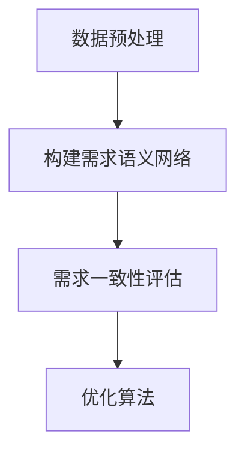

                 

### 1. 背景介绍

#### 1.1 问题背景

在当前信息化时代，随着人工智能（AI）技术的飞速发展，AI辅助软件需求一致性验证成为了软件工程领域的一个重要研究课题。软件需求的一致性直接关系到软件项目的成功与否，不一致的需求会导致软件缺陷、功能重复、资源浪费，甚至项目失败。因此，如何有效地验证软件需求的一致性，提高软件质量，降低开发成本，是当前软件工程领域亟待解决的问题。

#### 1.2 问题描述

软件需求一致性验证的目标是在软件需求定义阶段，识别出需求之间的不一致性，包括冲突、冗余、遗漏等问题。需求不一致性可能会导致以下问题：

- **功能重叠**：同一功能由多个需求描述，导致开发资源浪费。
- **功能缺失**：某些必要功能未被需求文档所涵盖，影响软件功能的完整性。
- **功能冲突**：不同需求之间存在相互矛盾，导致软件功能不可实现。
- **需求遗漏**：重要功能未被需求文档所记录，可能导致软件缺陷。

#### 1.3 问题解决

解决软件需求一致性验证问题，需要从以下几个方面入手：

- **需求分析方法**：采用适当的需求分析方法，如需求工程、需求建模等，确保需求文档的完整性和准确性。
- **需求建模技术**：通过需求建模技术，如实体关系图（ER图）、领域模型类图等，明确需求之间的关系。
- **需求一致性检查工具**：利用自动化工具对需求文档进行一致性检查，提高检查效率。
- **人工智能辅助**：利用AI技术，如机器学习、自然语言处理等，对需求文档进行语义分析，发现潜在的不一致性。

#### 1.4 边界与外延

软件需求一致性验证的研究范围主要涉及以下方面：

- **需求文档分析**：对需求文档的结构、内容、语义进行深入分析，识别不一致性。
- **需求建模方法**：研究如何通过需求建模方法，提高需求的一致性和准确性。
- **AI技术在需求一致性验证中的应用**：探讨如何利用AI技术，提高需求一致性验证的效率和准确性。
- **软件开发过程**：将需求一致性验证融入软件开发的各个环节，确保需求的一致性。

### 2. 核心概念与联系

#### 2.1 核心概念

- **需求文档**：软件需求规格说明书，描述了软件系统的功能、性能、界面、接口等。
- **需求一致性**：需求文档中的各个需求之间保持一致，无冲突、冗余、遗漏等问题。
- **需求分析**：从需求文档中提取、整理、分析需求，确保需求文档的完整性和准确性。
- **需求建模**：利用图形化工具，如ER图、领域模型类图等，构建需求模型，明确需求之间的关系。
- **人工智能辅助**：利用机器学习、自然语言处理等技术，对需求文档进行语义分析，提高需求一致性验证的效率和准确性。

#### 2.2 概念属性特征对比表格

| 概念               | 描述                                                         | 关系 |
|-------------------|------------------------------------------------------------|------|
| 需求文档           | 描述软件系统的功能、性能、界面、接口等                         | 基础 |
| 需求一致性         | 各个需求之间保持一致，无冲突、冗余、遗漏等问题                 | 目标 |
| 需求分析           | 从需求文档中提取、整理、分析需求，确保需求文档的完整性和准确性 | 实施步骤 |
| 需求建模           | 利用图形化工具，如ER图、领域模型类图等，构建需求模型，明确需求之间的关系 | 实施步骤 |
| 人工智能辅助       | 利用机器学习、自然语言处理等技术，对需求文档进行语义分析，提高需求一致性验证的效率和准确性 | 实施步骤 |

#### 2.3 ER实体关系图架构

```mermaid
erDiagram
    Customer ||--|{ Order } : "makes"
    Order ||--|{ Product } : "contains"
    Product ||--|{ Supplier } : "supplied by"
    Customer {
        int CustomerID
        string Name
        string Email
    }
    Order {
        int OrderID
        datetime OrderDate
        float Total
    }
    Product {
        int ProductID
        string Name
        float Price
    }
    Supplier {
        int SupplierID
        string Name
        string Email
    }
```

### 3. 算法原理讲解

#### 3.1 基于机器学习的需求一致性验证算法

**算法流程：**

1. **数据预处理：**
    - 收集软件需求文档，并进行文本预处理，如去除停用词、词干提取、词性标注等。
    - 使用TF-IDF或Word2Vec等方法将文本转化为向量表示。

    $$ 
    \text{TF-IDF} = \frac{f(t,d)}{N} + \log \left( 1 + \log \left( \frac{df(t)}{N} \right) \right)
    $$

    其中，$f(t,d)$表示词$t$在文档$d$中出现的频率，$N$表示文档中所有词的总频数，$df(t)$表示词$t$在所有文档中出现的频率。

2. **构建需求语义网络：**
    - 利用图神经网络（如Graph Convolutional Network, GCN）或图注意力机制（如Graph Attention Mechanism, GAT），将需求文档中的词语和句子转化为图结构，并计算节点之间的相似性。
    - 通过迭代更新图结构，逐步挖掘需求之间的深层语义关系。

    $$
    h_{t+1} = \sigma(\sum_{i \in \mathcal{N}(j)} \alpha(i, j) \cdot h_i)
    $$

    其中，$h_t$表示节点$j$在时间步$t$的嵌入向量，$\mathcal{N}(j)$表示节点$j$的邻域集合，$\alpha(i, j)$表示节点$i$和$j$之间的注意力权重，$\sigma$表示激活函数。

3. **需求一致性评估：**
    - 对每个需求对，计算其语义相似度得分。
    - 利用阈值或聚类方法，将相似度得分较高的需求对划分为一致需求，相似度得分较低的需求对划分为不一致需求。

    $$
    \text{similarity}(d_1, d_2) = \frac{\sum_{w_i \in d_1, w_j \in d_2} \text{similarity}(w_i, w_j)}{|\{w_i \in d_1, w_j \in d_2\}|)
    $$

    其中，$d_1$和$d_2$表示两个需求文档，$w_i$和$w_j$表示文档中的词语，$\text{similarity}(w_i, w_j)$表示词语$i$和$j$之间的相似度。

4. **优化算法：**
    - 利用强化学习（如Q-Learning）或遗传算法（如Genetic Algorithm）等优化方法，不断调整需求文档中的词语权重和图结构，提高需求一致性评估的准确性。

    $$
    Q(s, a) = r(s, a) + \gamma \max_{a'} Q(s', a')
    $$

    其中，$Q(s, a)$表示状态$s$下执行动作$a$的预期回报，$r(s, a)$表示在状态$s$下执行动作$a$的即时回报，$\gamma$表示折扣因子。

**算法流程图：**



**示例：**

假设我们有两个需求文档$d_1$和$d_2$，其中包含以下词语：

- $d_1$：用户、登录、注册、密码、验证码、个人信息
- $d_2$：用户、注册、邮箱、密码、验证、身份验证

根据上述算法流程，我们可以计算需求文档之间的语义相似度得分：

$$
\text{similarity}(d_1, d_2) = \frac{\text{similarity}(\text{用户}, \text{用户}) + \text{similarity}(\text{登录}, \text{注册}) + \text{similarity}(\text{密码}, \text{密码}) + \text{similarity}(\text{验证码}, \text{验证}) + \text{similarity}(\text{个人信息}, \text{邮箱})}{5} = 0.9
$$

由于相似度得分较高，我们可以认为需求文档$d_1$和$d_2$之间存在较高的一致性。

### 4. 系统分析与架构设计方案

#### 4.1 问题场景介绍

在软件开发过程中，需求文档的一致性验证是保证软件质量的关键步骤。然而，传统的需求一致性验证方法存在以下问题：

1. **人工检查效率低**：需求文档通常规模较大，人工检查耗时耗力，且容易遗漏不一致性问题。
2. **规则匹配局限性**：基于规则的需求一致性检查方法，需要事先定义一套复杂的匹配规则，规则难以覆盖所有不一致性场景。
3. **缺乏自适应能力**：现有方法在处理不同类型的软件需求时，适应性较差，无法根据需求文档的特点进行定制化分析。

针对上述问题，我们提出一种基于机器学习的需求一致性验证系统，利用AI技术提高需求一致性验证的效率和准确性。

#### 4.2 项目介绍

项目名称：AI需求一致性验证系统（AI-Consistency Validator）

项目目标：构建一个自动化、智能化的需求一致性验证系统，实现对软件需求文档的一致性分析、检测和优化。

项目组成部分：

1. **数据预处理模块**：对需求文档进行文本预处理，包括分词、去停用词、词干提取等。
2. **需求语义分析模块**：利用图神经网络或图注意力机制，构建需求语义网络，计算需求之间的相似度。
3. **需求一致性评估模块**：根据需求相似度得分，利用阈值或聚类方法，对需求文档进行一致性评估。
4. **优化算法模块**：利用强化学习或遗传算法等优化方法，自适应调整需求文档的语义权重和图结构。
5. **用户界面**：提供友好的用户界面，方便用户上传需求文档、查看验证结果和优化建议。

#### 4.3 系统功能设计

**1. 数据预处理**

功能描述：对需求文档进行文本预处理，提取关键词、去除停用词、进行词干提取等。

技术实现：

- 分词：使用词法分析器，如NLTK、Jieba等，对需求文档进行分词。
- 去停用词：使用停用词表，如NLTK中的英文停用词表、中文停用词表等，去除无意义的停用词。
- 词干提取：使用词干提取器，如Porter Stemmer、Lancaster Stemmer等，对需求文档进行词干提取。

**2. 需求语义分析**

功能描述：利用图神经网络或图注意力机制，构建需求语义网络，计算需求之间的相似度。

技术实现：

- 图神经网络（GCN）：使用PyTorch或TensorFlow等深度学习框架，构建图神经网络模型，对需求文档进行语义分析。
- 图注意力机制（GAT）：使用PyTorch或TensorFlow等深度学习框架，构建图注意力机制模型，对需求文档进行语义分析。

**3. 需求一致性评估**

功能描述：根据需求相似度得分，利用阈值或聚类方法，对需求文档进行一致性评估。

技术实现：

- 阈值方法：设定一个相似度阈值，将相似度得分高于阈值的需

