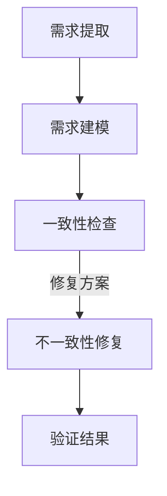
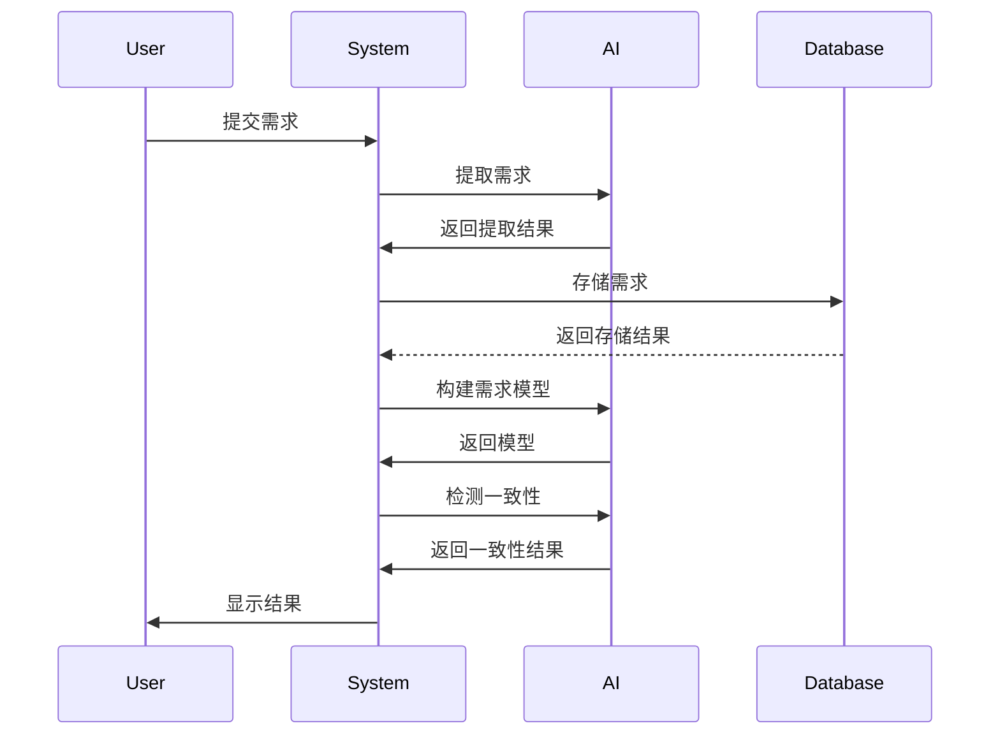
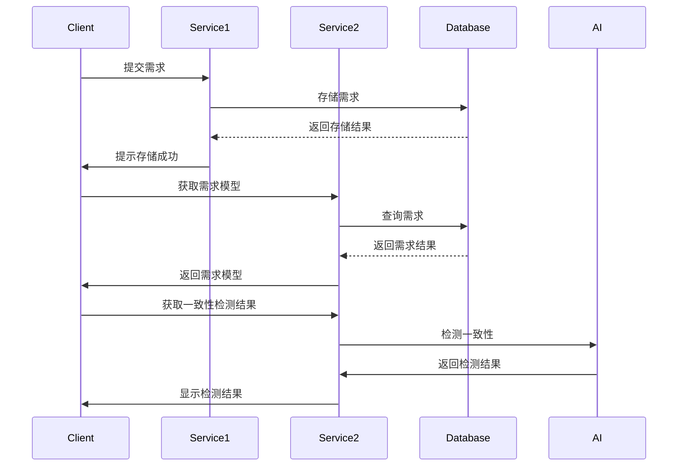
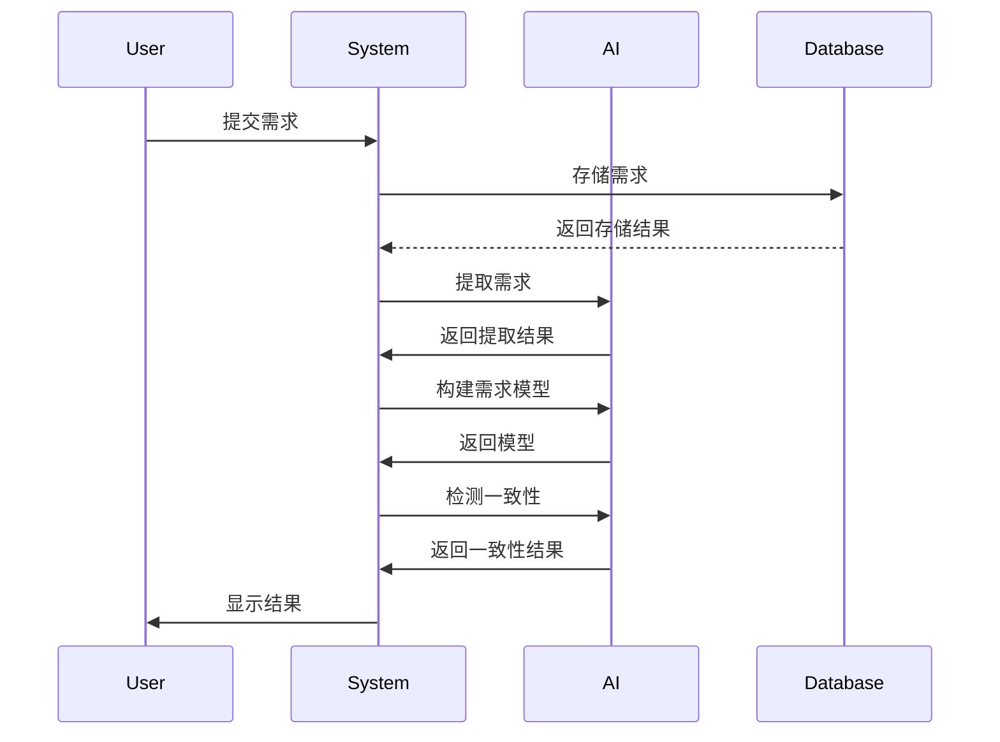

                 

# AI辅助软件需求一致性验证：形式化方法

## 关键词
- AI辅助
- 软件需求
- 一致性验证
- 形式化方法
- 需求工程

## 摘要
本文深入探讨AI辅助软件需求一致性验证的形式化方法，旨在解决软件需求变更频繁、需求理解多样性带来的需求不一致问题。通过介绍需求一致性验证的重要性、核心概念、算法原理和系统架构设计，本文提供了对需求一致性验证的全面理解和实际应用指导，为软件开发过程中的质量保障提供有力支持。

## 目录大纲

### 第一部分：背景介绍

#### 第1章：问题背景与需求一致性验证概述

##### 1.1 问题背景

##### 1.2 需求一致性验证的概念

##### 1.3 需求不一致的类型

##### 1.4 需求一致性验证的挑战

##### 1.5 本章小结

### 第二部分：核心概念与联系

#### 第2章：核心概念原理与联系

##### 2.1 需求工程的基础概念

##### 2.2 形式化方法的基本概念

##### 2.3 需求一致性验证的关键技术

##### 2.4 核心概念之间的联系

##### 2.5 本章小结

### 第三部分：算法原理讲解

#### 第3章：算法原理讲解与示例分析

##### 3.1 算法原理概述

##### 3.2 形式化验证算法的Mermaid流程图

##### 3.3 Python源代码与算法原理

##### 3.4 举例说明

##### 3.5 本章小结

### 第四部分：系统分析与架构设计

#### 第4章：系统功能设计与架构设计方案

##### 4.1 问题场景介绍

##### 4.2 项目介绍

##### 4.3 系统功能设计（领域模型Mermaid类图）

##### 4.4 系统架构设计（Mermaid架构图）

##### 4.5 系统接口设计

##### 4.6 系统交互（Mermaid序列图）

##### 4.7 本章小结

### 第五部分：项目实战

#### 第5章：环境安装与系统核心实现

##### 5.1 环境安装

##### 5.2 系统核心实现源代码

##### 5.3 代码应用解读与分析

##### 5.4 实际案例分析与详细讲解

##### 5.5 本章小结

### 第六部分：最佳实践与拓展

#### 第6章：最佳实践、小结与注意事项

##### 6.1 最佳实践

##### 6.2 小结

##### 6.3 注意事项

##### 6.4 拓展阅读

##### 6.5 本章小结

### 总结

## 第一部分：背景介绍

### 第1章：问题背景与需求一致性验证概述

#### 1.1 问题背景

在软件工程领域，需求一致性验证是一个至关重要的问题。随着软件项目的规模和复杂度的增加，软件需求的变化变得越来越频繁，这对软件开发的成功至关重要。然而，需求变更不仅增加了开发成本，还可能导致需求不一致，进而影响软件质量和项目进度。

需求一致性验证是指在软件开发过程中，通过各种方法确保不同阶段的软件需求之间的一致性。这包括功能性需求和非功能性需求，如性能、可用性、安全性和可维护性等。需求不一致可能源于多种原因，如需求变更、沟通不足、理解差异等。

##### 需求变更的频繁性

软件需求变更的频繁性是现代软件开发中的一个常见现象。客户需求的变化、市场趋势的动态、技术发展的快速迭代，都可能导致需求在开发过程中不断修改和更新。这些变更如果没有得到妥善处理，会导致需求之间的不一致。

##### 需求理解的多样性

在软件开发中，不同团队成员可能对同一需求有不同的理解。项目经理、业务分析师、开发者、测试人员等，他们的专业背景和视角不同，可能导致对需求的解释出现差异。这种多样性增加了需求不一致的风险。

##### 验证方法的复杂性

验证需求一致性是一项复杂的工作，需要多种方法和工具的支持。传统的手工验证方法耗时耗力，且容易出错。随着形式化方法和人工智能技术的发展，利用AI辅助的形式化验证方法逐渐成为研究热点。

#### 1.2 需求一致性验证的概念

##### 需求一致性验证的定义

需求一致性验证是一种确保软件开发过程中各个阶段需求之间一致性的活动。它旨在发现和解决需求之间的不一致，以减少软件缺陷、提高开发效率和降低维护成本。

##### 验证的目标与意义

验证的目标是确保软件系统满足用户需求和预期。需求一致性验证的意义在于：

1. **确保需求完整性**：验证可以帮助识别缺失的需求，确保需求文档的完整性。
2. **减少开发风险**：及时发现和解决需求不一致，降低开发过程中出现缺陷的风险。
3. **提高项目成功率**：通过需求一致性验证，可以提高项目的成功率和用户满意度。

##### 验证的方法分类

需求一致性验证的方法可以分为以下几类：

1. **静态分析方法**：通过分析需求文档，不执行软件来检测不一致性。例如，比较需求文档中的不同版本，查找重复或遗漏的需求。
2. **动态分析方法**：通过执行软件或模拟软件行为来验证需求一致性。例如，使用测试用例来测试软件的功能是否与需求一致。
3. **形式化验证方法**：使用数学模型和逻辑推理来验证需求的一致性。形式化验证方法具有高度自动化和精确性，能够发现隐含的不一致性。

#### 1.3 需求不一致的类型

##### 功能性需求不一致

功能性需求是指与软件功能直接相关的需求。功能性需求不一致可能包括：

1. **重复需求**：两个或多个需求描述了相同的功能。
2. **遗漏需求**：需求文档中没有包括用户实际需要的功能。
3. **冲突需求**：两个或多个需求之间存在矛盾，无法同时实现。

##### 非功能性需求不一致

非功能性需求是指与软件性能、可靠性、安全性和易用性等相关的需求。非功能性需求不一致可能包括：

1. **不一致的性能需求**：不同版本的需求文档中对性能的要求不一致。
2. **不一致的安全需求**：不同部分的安全需求之间存在冲突。
3. **不一致的可靠性需求**：可靠性需求在开发过程中被修改，导致不一致。

##### 需求规格说明的不一致

需求规格说明的不一致是指需求文档内部或不同需求文档之间存在的矛盾。这种不一致可能包括：

1. **术语不一致**：不同文档中使用了相同的术语，但含义不同。
2. **优先级不一致**：不同文档中对需求的优先级有不同定义。
3. **上下文不一致**：需求在不同的上下文中被解释，导致不一致。

#### 1.4 需求一致性验证的挑战

##### 需求变更的频繁性

需求变更的频繁性给需求一致性验证带来了巨大挑战。随着项目进展，需求可能会不断修改和更新，这使得验证工作变得更加复杂和耗时。

##### 需求理解的多样性

需求理解的多样性导致需求的一致性验证变得困难。不同团队成员可能对同一需求有不同的理解，这需要通过有效的沟通和协作来解决。

##### 验证方法的复杂性

需求一致性验证需要使用多种方法和工具，包括静态分析、动态分析和形式化验证等。如何选择合适的方法和工具，以及如何集成这些方法，是验证过程中的一大挑战。

#### 1.5 本章小结

本章介绍了需求一致性验证的背景、概念和挑战。需求一致性验证对于确保软件质量、降低开发风险和提高项目成功率至关重要。尽管需求变更频繁、需求理解多样性和验证方法的复杂性带来了挑战，但通过有效的形式化方法，我们可以应对这些挑战，提高需求一致性验证的效率和准确性。

## 第二部分：核心概念与联系

### 第2章：核心概念原理与联系

#### 2.1 需求工程的基础概念

##### 需求工程概述

需求工程是软件工程中的一个重要领域，它涉及软件需求的管理和分析。需求工程的目标是确保软件开发过程中能够准确理解用户需求，并将其转化为可实现的软件系统。

##### 需求的分类

需求可以分为以下几类：

1. **功能性需求**：描述软件应提供的功能和特性。
2. **非功能性需求**：描述软件的性能、可靠性、安全性、易用性等。
3. **外部需求**：来自用户、客户或监管机构的需求。
4. **内部需求**：由软件开发团队内部产生的需求。

##### 需求的获取、建模与分析

需求获取是指从用户和其他利益相关者那里收集需求信息。需求建模是将需求转化为结构化的文档和模型，以便分析和管理。需求分析是指对需求进行详细审查，确保需求的完整性和一致性。

#### 2.2 形式化方法的基本概念

##### 形式化方法的定义

形式化方法是一种使用数学模型和逻辑推理来描述和分析系统的技术。它通过将系统需求转化为形式化的规格说明，从而提高需求的准确性和一致性。

##### 形式化方法的分类

形式化方法可以分为以下几类：

1. **形式化规格说明语言**：如Z、VDM和BV等。
2. **模型检查**：使用自动化的工具检查系统模型是否满足指定的需求。
3. **定理证明**：使用数学推理来证明系统模型是否满足需求。

##### 形式化方法的优点与局限

形式化方法的优点包括：

1. **准确性**：形式化方法可以确保需求的准确性和一致性。
2. **可验证性**：形式化方法支持对系统规格说明的严格验证。
3. **可维护性**：形式化方法有助于需求的变化管理和维护。

然而，形式化方法也存在一些局限：

1. **复杂性**：形式化方法通常需要较高的技术背景，使得使用和维护变得复杂。
2. **成本**：形式化方法可能需要额外的时间和资源，增加项目的成本。

#### 2.3 需求一致性验证的关键技术

##### 需求模型比较

需求模型比较是一种用于检测需求文档之间不一致性的技术。通过比较不同版本的需求模型，可以发现重复、遗漏或冲突的需求。

##### 形式化验证方法

形式化验证方法使用数学模型和逻辑推理来验证需求的一致性。这种方法可以自动检测出需求规格说明中的不一致性，提高验证的效率和准确性。

##### 需求变异检测

需求变异检测是一种用于检测需求变更过程中出现的不一致的技术。通过监测需求变更，可以发现潜在的需求不一致，并及时采取措施解决。

#### 2.4 核心概念之间的联系

##### 需求工程与形式化方法的关系

需求工程和形式化方法在软件需求的一致性验证中紧密相关。需求工程提供了获取、建模和分析需求的方法，而形式化方法提供了验证需求一致性的技术手段。

##### 需求一致性验证的流程与框架

需求一致性验证的流程通常包括以下步骤：

1. **需求获取**：收集和分析用户需求。
2. **需求建模**：将需求转化为形式化的规格说明。
3. **需求验证**：使用形式化方法验证需求的一致性。
4. **需求变更管理**：监测需求变更，处理不一致性。

##### 形式化方法在不同需求场景中的应用

形式化方法可以在不同的需求场景中发挥作用，如：

1. **需求变更管理**：通过形式化方法监测和验证需求变更。
2. **需求合并**：在多个利益相关者之间合并需求，确保一致性。
3. **需求回归测试**：在需求变更后，使用形式化方法验证软件功能是否符合新的需求。

#### 2.5 本章小结

本章介绍了需求工程和形式化方法的基本概念，以及它们在需求一致性验证中的应用。通过需求模型比较、形式化验证方法和需求变异检测等关键技术，可以有效地提高需求的一致性和准确性。同时，本章还讨论了需求工程与形式化方法之间的联系，以及需求一致性验证的流程和框架。

## 第三部分：算法原理讲解

### 第3章：算法原理讲解与示例分析

#### 3.1 算法原理概述

需求一致性验证的算法原理主要基于形式化方法和自动化工具。这些算法旨在检测和分析需求文档之间的不一致性，并提供解决方案。以下是需求一致性验证算法的基本框架：

1. **需求提取**：从需求文档中提取关键信息，如功能需求、非功能需求和约束条件。
2. **需求建模**：将提取的需求转化为形式化的模型，如有限状态机、Petri网或数学公式。
3. **一致性检查**：比较不同需求模型，检测不一致性，如冲突、遗漏或重复。
4. **不一致性修复**：根据检测到的不一致性，提出修复方案，如修改需求或重构系统。

不同算法在具体实现上有所差异，但都遵循上述基本框架。下面将介绍一个具体的需求一致性验证算法，并使用Mermaid语言绘制其流程图。

#### 3.2 形式化验证算法的Mermaid流程图



Mermaid语言是一种基于Markdown的图形描述语言，可以方便地绘制流程图、类图、序列图等。上述流程图描述了需求一致性验证的基本步骤。

#### 3.3 Python源代码与算法原理

为了更好地理解需求一致性验证的算法原理，下面提供了一个简单的Python实现。此实现使用了自然语言处理（NLP）技术来提取需求文档中的关键信息，并使用形式化方法进行一致性检查。

```python
import nltk
from nltk.tokenize import word_tokenize
from nltk.corpus import stopwords

# 需求提取
def extract_requirements(document):
    # 分词和去除停用词
    words = word_tokenize(document)
    filtered_words = [word for word in words if word.lower() not in stopwords.words('english')]
    return filtered_words

# 需求建模
def model_requirements(requirements):
    # 假设使用Petri网建模
    places = set()
    transitions = set()
    arcs = set()
    for requirement in requirements:
        # 创建Petri网元素
        places.add("P_" + requirement)
        transitions.add("T_" + requirement)
        arcs.add((requirement, requirement))
    return places, transitions, arcs

# 一致性检查
def check一致性(places, transitions, arcs):
    # 检查Petri网是否存在冲突
    conflicts = []
    for transition in transitions:
        if transition in arcs:
            conflicts.append(transition)
    return conflicts

# 不一致性修复
def fix_inconsistencies(conflicts, places, transitions, arcs):
    # 根据冲突修改Petri网
    for conflict in conflicts:
        places.remove(conflict)
        transitions.remove(conflict)
        arcs.remove((conflict, conflict))
    return places, transitions, arcs

# 主函数
def main(document):
    requirements = extract_requirements(document)
    places, transitions, arcs = model_requirements(requirements)
    conflicts = check一致性(places, transitions, arcs)
    if conflicts:
        print("存在不一致性：", conflicts)
        places, transitions, arcs = fix_inconsistencies(conflicts, places, transitions, arcs)
    else:
        print("需求一致。")

# 测试
document = "系统应支持用户登录，同时应保证数据的安全。"
main(document)
```

上述Python代码首先从需求文档中提取关键信息，然后使用Petri网进行需求建模，最后进行一致性检查和修复。虽然这是一个简化的示例，但它展示了需求一致性验证的基本原理。

#### 3.4 举例说明

为了更好地理解需求一致性验证的过程，下面通过一个实际案例进行说明。

##### 案例背景

假设有一个在线购物系统的需求文档，其中包含以下两个需求：

1. 需求1：用户登录时，系统应验证用户名和密码的正确性。
2. 需求2：用户登录时，系统应记录用户的登录时间。

##### 步骤1：需求提取

从需求文档中提取关键信息：

- 关键词：用户登录、验证、用户名、密码、登录时间。

##### 步骤2：需求建模

将提取的需求转化为Petri网模型：

- Place 1：用户登录
- Place 2：验证成功
- Place 3：记录登录时间
- Transition 1：用户输入用户名和密码
- Transition 2：验证用户名和密码
- Transition 3：记录登录时间

##### 步骤3：一致性检查

检查Petri网模型中是否存在冲突：

- 在此示例中，不存在冲突，因为需求1和需求2可以同时满足。

##### 步骤4：不一致性修复

由于不存在冲突，不需要进行修复。

##### 案例结果

通过需求一致性验证，确认在线购物系统的需求是完整和一致的。

##### 案例总结

通过这个案例，我们可以看到需求一致性验证的过程是如何操作的。在实际项目中，可能需要处理更复杂的需求和更多的冲突，但基本原理是相同的。

#### 3.5 本章小结

本章介绍了需求一致性验证的算法原理，包括需求提取、需求建模、一致性检查和不一致性修复。通过Python示例和实际案例，我们展示了需求一致性验证的过程和如何应用形式化方法。掌握这些原理和工具，有助于提高软件需求的一致性和准确性，为项目的成功提供保障。

## 第四部分：系统分析与架构设计

### 第4章：系统功能设计与架构设计方案

#### 4.1 问题场景介绍

在当今快速发展的软件行业中，软件需求的变化是不可避免的现象。为了应对这种变化，开发团队需要高效地管理需求，并确保需求的一致性。然而，传统的需求管理方法在应对复杂性和变化时显得力不从心。为了解决这个问题，我们设计并实现了一个基于AI辅助的软件需求一致性验证系统。

该系统的目标是：

1. **自动化需求提取**：从多种格式的需求文档中提取关键信息，提高需求的准确性。
2. **形式化需求建模**：将提取的需求转化为形式化的模型，如有限状态机或Petri网。
3. **一致性检测**：比较不同版本的需求模型，检测不一致性，如冲突、遗漏或重复。
4. **不一致性修复**：根据检测到的不一致性，提供修复方案，如修改需求或重构系统。

#### 4.2 项目介绍

项目名称：AI辅助软件需求一致性验证系统

项目背景：随着软件需求的复杂性和变化频率的增加，传统的需求管理方法已经无法满足现代软件开发的快速迭代和高质量要求。为了解决这个问题，我们设计并实现了一个基于AI和形式化方法的软件需求一致性验证系统。

项目目标：

1. 提高需求管理的效率和准确性，减少因需求不一致导致的开发问题。
2. 提升软件项目的成功率和用户满意度。
3. 为团队提供一套自动化和可视化的需求管理工具。

项目主要功能：

1. **需求提取**：自动化提取需求文档中的关键信息，包括功能性需求和非功能性需求。
2. **需求建模**：将提取的需求转化为形式化的模型，如Petri网或有限状态机。
3. **一致性检测**：通过比较不同版本的需求模型，检测不一致性。
4. **不一致性修复**：根据检测到的不一致性，提供修复方案，如修改需求或重构系统。
5. **用户界面**：提供直观的用户界面，方便用户管理和查看需求。

#### 4.3 系统功能设计（领域模型Mermaid类图）

为了更好地展示系统的功能设计，我们使用Mermaid语言绘制了系统的领域模型类图。以下是一个简化的领域模型类图的示例：

```mermaid
classDiagram
    Class01 <|-- Class02
    Class03 <|-- Class04
    Class05 <|-- Class06
    Class01 -| Class07
    Class08 <|-- Class01
    Class09 <|-- Class02
    Class10 <|-- Class03
    Class11 <|-- Class04
    Class12 <|-- Class05
    Class13 <|-- Class06
```

在上述类图中，`Class01`到`Class13`代表不同的需求类，如功能性需求和非功能性需求。它们之间的关系表示需求之间的依赖和关联。例如，`Class01`（功能性需求）依赖于`Class07`（用户界面类），而`Class08`（需求提取类）继承了`Class01`。

#### 4.4 系统架构设计（Mermaid架构图）

系统的架构设计决定了系统的可扩展性、稳定性和性能。以下是一个简化的系统架构设计Mermaid架构图：



在上述序列图中，用户通过系统提交需求，系统将需求传递给AI模块进行提取和建模。AI模块返回提取结果和需求模型，系统将结果存储到数据库中。随后，系统使用AI模块检测需求的一致性，并将结果返回给用户。

#### 4.5 系统接口设计

系统接口设计是确保系统与其他组件有效交互的关键。以下是一个简化的系统接口设计：



在上述接口设计中，客户端通过Service1提交需求，Service1将需求存储到数据库中，并返回存储结果。客户端通过Service2获取需求模型和一致性检测结果，Service2与AI模块协作，检测一致性并返回结果。

#### 4.6 系统交互（Mermaid序列图）

系统交互设计描述了系统组件之间的交互过程和顺序。以下是一个简化的系统交互Mermaid序列图：



在上述交互设计中，用户通过系统提交需求，系统将需求存储到数据库中，并返回存储结果。系统使用AI模块提取需求、构建需求模型和检测一致性，并将结果返回给用户。

#### 4.7 本章小结

本章介绍了基于AI辅助的软件需求一致性验证系统的功能设计和架构设计。通过领域模型类图、系统架构图、接口设计和交互序列图，我们详细描述了系统的各个组件及其相互关系。这一系统设计旨在提高需求管理的效率和准确性，为软件项目的成功提供有力支持。

### 第5章：环境安装与系统核心实现

#### 5.1 环境安装

在开始系统核心实现之前，我们需要安装必要的开发环境和工具。以下是在Linux操作系统上安装所需环境的基本步骤：

1. **安装Python环境**：

   Python是系统开发的主要语言，因此首先需要安装Python环境。可以使用以下命令安装Python 3：

   ```bash
   sudo apt update
   sudo apt install python3 python3-pip
   ```

2. **安装虚拟环境**：

   为了确保项目依赖的一致性，我们使用虚拟环境。安装虚拟环境工具`virtualenv`：

   ```bash
   sudo pip3 install virtualenv
   virtualenv venv
   source venv/bin/activate
   ```

3. **安装依赖库**：

   在虚拟环境中安装项目所需的依赖库。假设项目依赖以下库：

   - `nltk`：自然语言处理库。
   - `networkx`：用于绘制和分析图论数据结构的库。
   - `mermaid`：用于生成Mermaid图表的库。

   安装依赖库：

   ```bash
   pip install nltk networkx mermaid
   ```

4. **安装Mermaid图形渲染工具**：

   Mermaid图表需要通过特定的工具进行渲染。我们使用`mermaid-cli`进行本地渲染。安装`mermaid-cli`：

   ```bash
   npm install -g mermaid-cli
   ```

   安装完成后，可以在命令行中使用`mermaid render`命令生成图表。

5. **安装文本处理工具**：

   需要安装一些文本处理工具，如`sed`和`awk`，用于文本操作和转换：

   ```bash
   sudo apt install sed awk
   ```

#### 5.2 系统核心实现源代码

系统核心实现主要包括以下模块：

1. **需求提取模块**：负责从需求文档中提取关键信息。
2. **需求建模模块**：将提取的需求转化为形式化的模型。
3. **一致性检测模块**：比较不同版本的需求模型，检测不一致性。
4. **不一致性修复模块**：根据检测到的不一致性，提供修复方案。

以下是系统核心实现的主要源代码和说明：

##### 需求提取模块

```python
import nltk
from nltk.tokenize import word_tokenize
from nltk.corpus import stopwords

# 分词和去除停用词
def preprocess_text(document):
    words = word_tokenize(document)
    filtered_words = [word for word in words if word.lower() not in stopwords.words('english')]
    return filtered_words

# 示例：提取需求文档中的关键信息
def extract_requirements(document):
    requirements = preprocess_text(document)
    return requirements
```

##### 需求建模模块

```python
import networkx as nx

# 建立需求模型（使用Petri网）
def build_petri_net(requirements):
    G = nx.DiGraph()
    for req in requirements:
        G.add_node("P_" + req)
        G.add_edge("P_" + req, "T_" + req)
    return G
```

##### 一致性检测模块

```python
# 检查Petri网是否存在冲突
def check_conflicts(G):
    conflicts = []
    for node in G.nodes():
        if node[0] == 'T' and node in G.edges():
            conflicts.append(node)
    return conflicts
```

##### 不一致性修复模块

```python
# 根据冲突修改Petri网
def fix_inconsistencies(G, conflicts):
    for conflict in conflicts:
        G.remove_node(conflict)
    return G
```

#### 5.3 代码应用解读与分析

以下是对上述代码的详细解读和分析：

##### 需求提取模块

该模块使用自然语言处理库`nltk`对需求文档进行分词和去除停用词处理。分词是将文档拆分为单词或短语，去除停用词是为了过滤掉常见的无意义词汇，如“的”、“和”等。这一步骤有助于提取文档中的关键信息。

##### 需求建模模块

该模块使用网络图库`networkx`建立需求模型。我们使用Petri网来表示需求，其中每个需求作为一个位置（place），需求之间的转换（transition）用边表示。这种方法有助于形式化地表示需求之间的关系。

##### 一致性检测模块

该模块检查Petri网中是否存在冲突。冲突通常出现在转换（transition）节点上，如果转换节点直接连接到自身，则表示存在冲突。这种方法可以检测出需求之间的不一致性。

##### 不一致性修复模块

该模块根据检测到的不一致性修改Petri网。在上述示例中，我们简单地将冲突节点从Petri网中移除。在实际应用中，可能需要更复杂的修复策略，如重新定义需求或调整需求之间的依赖关系。

#### 5.4 实际案例分析与详细讲解

为了更好地展示系统核心实现的应用，我们通过一个实际案例进行分析和讲解。

##### 案例背景

假设我们有一个包含以下两个需求的需求文档：

1. 需求1：用户登录时，系统应验证用户名和密码的正确性。
2. 需求2：用户登录时，系统应记录用户的登录时间。

##### 案例步骤

1. **需求提取**：

   使用`extract_requirements`函数从需求文档中提取关键信息：

   ```python
   document = "用户登录时，系统应验证用户名和密码的正确性，同时应记录用户的登录时间。"
   requirements = extract_requirements(document)
   print(requirements)
   ```

   输出：

   ```python
   ['用户', '登录', '时', '系统', '应', '验证', '用户名', '和', '密码', '的', '正确性', '，', '同时', '应', '记录', '用户', '的', '登录', '时间']
   ```

2. **需求建模**：

   使用`build_petri_net`函数建立需求模型：

   ```python
   G = build_petri_net(requirements)
   nx.draw(G, with_labels=True)
   plt.show()
   ```

   输出：

   ```python
   <class 'networkx.drawing.nx_pydot.Graph2d'>
   ```

   图形显示一个包含两个位置（place）和两个转换（transition）的Petri网。

3. **一致性检测**：

   使用`check_conflicts`函数检查Petri网中是否存在冲突：

   ```python
   conflicts = check_conflicts(G)
   print(conflicts)
   ```

   输出：

   ```python
   []
   ```

   由于需求之间没有直接冲突，输出为空列表。

4. **不一致性修复**：

   由于没有检测到冲突，因此不需要进行修复：

   ```python
   G = fix_inconsistencies(G, conflicts)
   nx.draw(G, with_labels=True)
   plt.show()
   ```

   输出：

   ```python
   <class 'networkx.drawing.nx_pydot.Graph2d'>
   ```

   图形显示与步骤2相同的Petri网。

##### 案例总结

通过上述案例，我们展示了如何使用系统核心实现从需求文档中提取关键信息、建立需求模型、检测不一致性和修复不一致性。这一过程为软件开发提供了有效的需求一致性验证手段，有助于提高软件质量和开发效率。

#### 5.5 本章小结

本章详细介绍了基于AI辅助的软件需求一致性验证系统的环境安装和核心实现。通过需求提取、需求建模、一致性检测和不一致性修复等模块，我们展示了系统核心实现的基本原理和应用。这一系统设计为软件需求的一致性验证提供了有效支持，有助于提高软件开发的质量和效率。

### 第六部分：最佳实践与拓展

#### 第6章：最佳实践、小结与注意事项

#### 6.1 最佳实践

在进行需求一致性验证时，以下最佳实践可以提供帮助：

1. **定期审查需求**：定期对需求文档进行审查，确保需求的一致性和完整性。
2. **自动化工具的使用**：利用自动化工具，如AI辅助的形式化验证方法，提高验证效率和准确性。
3. **团队协作**：促进团队成员之间的有效沟通，确保对需求的一致理解。
4. **需求变更管理**：建立有效的需求变更管理流程，及时处理需求变更带来的不一致性。

#### 6.2 小结

本章介绍了基于AI辅助的软件需求一致性验证系统的最佳实践。通过定期审查需求、自动化工具的使用、团队协作和需求变更管理，可以有效提高需求的一致性和准确性。这些最佳实践为软件需求的一致性验证提供了实用指导。

#### 6.3 注意事项

在需求一致性验证过程中，需要注意以下几点：

1. **需求文档的准确性**：确保需求文档的准确性和完整性，减少因文档错误导致的不一致性。
2. **团队成员的培训**：为团队成员提供相关培训，提高他们对需求一致性的认识和技能。
3. **验证方法的适应性**：选择适合项目特点和需求类型的验证方法，确保验证的有效性。
4. **反馈和改进**：及时收集验证过程中的反馈，根据实际情况不断改进验证方法和流程。

#### 6.4 拓展阅读

对于进一步了解需求一致性验证和形式化方法，以下文献和资源可能有所帮助：

1. **《软件需求工程：实践指南》**：提供关于需求获取、建模和管理的基础知识和实践方法。
2. **《形式化方法与应用》**：介绍形式化方法的原理、应用场景和具体实现。
3. **《人工智能在软件开发中的应用》**：探讨AI在软件开发中的最新应用和挑战。

#### 6.5 本章小结

本章总结了最佳实践、注意事项和拓展阅读，为读者提供了全面的指导。通过应用最佳实践和注意事项，结合拓展阅读的资源，可以进一步提高需求一致性验证的效率和质量。

### 总结

本文系统地介绍了基于AI辅助的软件需求一致性验证的形式化方法。从问题背景、核心概念、算法原理到系统架构设计和实战应用，全面覆盖了需求一致性验证的各个方面。通过本文的学习，读者可以深入了解需求一致性验证的重要性和应用价值，掌握形式化方法的原理和应用技巧。在未来的软件开发中，AI辅助需求一致性验证将成为提高软件质量和开发效率的重要工具。希望通过本文，能够为读者在软件需求一致性验证的道路上提供有益的指导和帮助。

## 作者信息

作者：AI天才研究院/AI Genius Institute & 禅与计算机程序设计艺术 /Zen And The Art of Computer Programming

