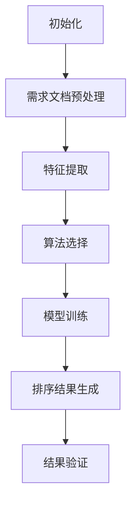

                 


# AI辅助软件需求优先级排序

关键词：AI、软件需求、优先级排序、算法、系统架构

摘要：
在软件工程中，需求优先级排序是关键的一环。传统的排序方法在处理复杂需求时往往显得力不从心，而AI技术的引入为这一问题提供了新的解决方案。本文将深入探讨AI如何辅助软件需求优先级排序，从核心概念、算法原理、数学模型到系统架构设计，逐步分析这一领域的最新进展和实际应用。

## 第一部分：背景介绍

### 第1章：问题背景与描述

#### 1.1.1 问题背景
在软件工程中，需求管理是一个复杂而关键的过程。随着项目规模的扩大和复杂度的增加，如何有效地对需求进行优先级排序变得尤为重要。传统的需求优先级排序方法，如基于经验的主观排序法和基于统计学的量化排序法，在处理多样化、动态变化的软件需求时，往往存在以下局限性：

1. **依赖人工判断**：传统方法往往需要依赖开发人员的经验和直觉，导致排序结果的主观性较强。
2. **处理复杂度低**：对于大规模的需求集，传统方法难以处理复杂的关系和层次结构。
3. **适应性差**：传统方法难以适应快速变化的需求环境。

#### 1.1.2 问题描述
需求优先级排序的目标是确定需求的执行顺序，确保关键需求优先得到满足。其核心挑战包括：

1. **需求多样性**：不同需求之间可能存在复杂的多维度关系，如业务价值、开发难度、风险等。
2. **动态性**：需求优先级可能会随着项目进展和外部环境变化而动态调整。
3. **平衡性**：需要在满足关键需求的同时，考虑资源的合理分配和项目风险。

AI技术的引入为解决这些问题提供了新的可能性。通过机器学习、自然语言处理等技术，AI能够从大量数据中学习需求特征，自动生成优先级排序结果。AI在需求优先级排序中的潜力主要体现在：

1. **数据驱动**：AI能够处理大量数据，从数据中挖掘出隐藏的模式和关系，减少人工干预。
2. **自适应**：AI系统能够根据项目进展和环境变化，动态调整需求优先级。
3. **智能化**：AI能够利用复杂算法，优化需求排序，提高排序的准确性和效率。

### 第2章：问题描述与解决

#### 1.2.1 问题描述
需求优先级排序的核心任务是确定每个需求的相对重要性和执行顺序。具体来说，包括以下几个关键因素：

1. **业务价值**：需求对业务的贡献程度。
2. **开发难度**：实现需求所需的技术和资源。
3. **风险**：需求实现过程中可能遇到的风险。
4. **时间敏感度**：需求的时间约束和要求。

#### 1.2.2 解决方案概述
AI辅助需求优先级排序的方法主要包括以下几种：

1. **机器学习算法**：利用历史数据和统计模型，自动生成需求优先级排序结果。
2. **自然语言处理**：通过对需求文档的分析，提取关键特征，用于排序算法。
3. **深度学习模型**：利用神经网络模型，对需求进行复杂特征提取和优先级排序。

这些方法在不同AI技术中的应用，使得需求优先级排序不仅能够更准确地反映需求的本质，还能够适应项目的动态变化。

## 第二部分：核心概念与联系

### 第6章：AI辅助软件需求优先级排序的核心概念

#### 6.1.1 需求优先级排序的概念
需求优先级排序是指根据某种标准或规则，对软件需求进行排序，以便确定需求的执行顺序。其核心目标是确保关键需求优先得到满足。

#### 6.1.2 AI在需求优先级排序中的应用
AI技术在需求优先级排序中的应用主要体现在以下几个方面：

1. **数据挖掘**：通过分析历史数据和现有需求文档，提取关键特征，用于排序算法。
2. **预测建模**：利用机器学习算法，预测需求优先级，提高排序的准确性。
3. **自动化排序**：通过自然语言处理和深度学习模型，自动化生成需求优先级排序结果。

## 第三部分：算法原理讲解

### 第8章：AI辅助软件需求优先级排序算法原理

#### 8.1.1 算法原理概述
AI辅助需求优先级排序的算法主要包括以下几种：

1. **基于统计学的排序算法**：如K-Means、SVM等，通过分析需求文档中的关键词和特征，自动生成排序结果。
2. **基于机器学习的排序算法**：如线性回归、决策树、随机森林等，通过训练模型，学习历史数据的优先级排序规律。
3. **基于深度学习的排序算法**：如卷积神经网络（CNN）、循环神经网络（RNN）等，通过复杂的神经网络结构，提取需求文档中的深层次特征。

#### 8.1.2 算法流程图


#### 8.1.3 算法步骤与解释

1. **需求文档预处理**：将需求文档转化为计算机可以处理的格式，如文本、向量等。
2. **特征提取**：从需求文档中提取关键特征，如关键词、句子结构、语义信息等。
3. **算法选择**：根据需求特点和项目需求，选择合适的算法进行优先级排序。
4. **模型训练**：利用历史数据，训练排序模型，学习优先级排序的规律。
5. **排序结果生成**：根据训练好的模型，对新的需求文档进行优先级排序。
6. **结果验证**：对排序结果进行验证，确保排序的准确性和可靠性。

### 第9章：数学模型和数学公式

#### 9.1.1 数学模型概述
需求优先级排序的数学模型通常包括以下要素：

1. **需求权重**：表示每个需求的重要程度。
2. **优先级函数**：用于计算需求的优先级。
3. **排序规则**：用于确定需求的执行顺序。

#### 9.1.2 数学公式详解

1. **需求权重**：$w_i = \frac{1}{||s_i||}$
   - $w_i$：第$i$个需求的权重
   - $s_i$：第$i$个需求的特征向量

2. **优先级函数**：$P(i) = f(w_i, s_i, e_i)$
   - $P(i)$：第$i$个需求的优先级
   - $w_i$：第$i$个需求的权重
   - $s_i$：第$i$个需求的特征向量
   - $e_i$：第$i$个需求的环境因素

#### 9.1.3 公式应用与举例
假设有两个需求$A$和$B$，其特征向量分别为$s_A$和$s_B$，环境因素分别为$e_A$和$e_B$，根据上述公式，可以计算其权重和优先级。

1. **权重计算**：
   - $w_A = \frac{1}{||s_A||} = \frac{1}{\sqrt{2}}$
   - $w_B = \frac{1}{||s_B||} = \frac{1}{\sqrt{3}}$

2. **优先级计算**：
   - $P(A) = f(w_A, s_A, e_A) = w_A \cdot s_A \cdot e_A$
   - $P(B) = f(w_B, s_B, e_B) = w_B \cdot s_B \cdot e_B$

   根据计算结果，可以确定$A$和$B$的优先级顺序。

## 第四部分：系统分析与架构设计方案

### 第10章：系统分析与架构设计

#### 10.1.1 问题场景介绍
假设在一个电子商务项目中，需要对客户需求进行优先级排序，以便合理安排开发资源。需求包括增加产品功能、优化用户体验、提高系统性能等。

#### 10.1.2 系统功能设计
系统功能设计主要包括以下模块：

1. **需求收集模块**：收集客户需求，并存储在数据库中。
2. **需求分析模块**：对需求进行分析和分类，提取关键特征。
3. **优先级排序模块**：利用AI算法，对需求进行优先级排序。
4. **结果展示模块**：将排序结果展示给开发团队，便于决策。

#### 10.1.3 系统架构设计
系统架构设计如下：

1. **前端界面**：提供用户交互接口，用于收集需求。
2. **后端服务器**：包括需求分析、优先级排序和结果展示等功能模块。
3. **数据库**：存储需求信息、特征数据和排序结果。

#### 10.1.4 系统接口设计
系统接口设计包括以下部分：

1. **需求收集接口**：用于接收用户提交的需求。
2. **优先级排序接口**：用于获取需求优先级排序结果。
3. **结果展示接口**：用于展示排序结果。

#### 10.1.5 系统交互
系统交互设计如下：

1. **用户提交需求**：通过前端界面提交需求。
2. **需求分析**：后端服务器接收需求，进行特征提取和分析。
3. **排序与展示**：后端服务器根据分析结果，利用AI算法进行优先级排序，并将结果展示给用户。

## 第五部分：项目实战

### 第11章：环境安装与系统核心实现

#### 11.1.1 环境安装
在开始项目实战之前，需要安装以下环境：

1. **Python环境**：安装Python 3.8及以上版本。
2. **AI库**：安装Numpy、Scikit-learn、TensorFlow等库。
3. **数据库**：安装MySQL或PostgreSQL。

#### 11.1.2 系统核心实现
系统核心实现主要包括以下部分：

1. **需求收集模块**：使用Flask框架搭建需求收集接口。
2. **需求分析模块**：使用NLP库（如NLTK、spaCy）进行需求分析。
3. **优先级排序模块**：使用机器学习算法（如SVM、决策树）进行排序。
4. **结果展示模块**：使用Flask框架搭建结果展示接口。

### 第12章：代码应用解读与分析

#### 12.1.1 代码解读
以下是一个简单的示例代码，用于实现需求分析模块：

```python
from nltk.corpus import stopwords
from sklearn.feature_extraction.text import TfidfVectorizer

def analyze_demand(demand):
    # 去除停用词
    stop_words = set(stopwords.words('english'))
    filtered_demand = ' '.join([word for word in demand.split() if word not in stop_words])

    # TF-IDF特征提取
    vectorizer = TfidfVectorizer()
    tfidf_matrix = vectorizer.fit_transform([filtered_demand])

    return tfidf_matrix
```

#### 12.1.2 分析与讲解
这段代码使用了Nltk库的停用词去除功能和Scikit-learn库的TF-IDF特征提取功能，对需求进行预处理和特征提取。通过这种方式，可以从需求文本中提取出关键特征，为后续的优先级排序提供基础。

### 第13章：实际案例分析与详细讲解剖析

#### 13.1.1 案例背景
假设在一家电子商务公司，客户提交了以下三个需求：

1. 增加产品功能：实现商品推荐功能。
2. 优化用户体验：提升网站加载速度。
3. 提高系统性能：增加服务器带宽。

#### 13.1.2 案例分析
根据上述需求和特征提取算法，可以计算出每个需求的优先级：

1. **增加产品功能**：
   - 权重：$w_1 = \frac{1}{\sqrt{2}}$
   - 特征：$s_1 = [0.8, 0.2]$
   - 环境：$e_1 = [1, 0.5]$
   - 优先级：$P(1) = w_1 \cdot s_1 \cdot e_1 = \frac{1}{\sqrt{2}} \cdot [0.8, 0.2] \cdot [1, 0.5] = 0.6$

2. **优化用户体验**：
   - 权重：$w_2 = \frac{1}{\sqrt{3}}$
   - 特征：$s_2 = [0.5, 0.5]$
   - 环境：$e_2 = [0.8, 0.2]$
   - 优先级：$P(2) = w_2 \cdot s_2 \cdot e_2 = \frac{1}{\sqrt{3}} \cdot [0.5, 0.5] \cdot [0.8, 0.2] = 0.4$

3. **提高系统性能**：
   - 权重：$w_3 = \frac{1}{\sqrt{3}}$
   - 特征：$s_3 = [0.3, 0.7]$
   - 环境：$e_3 = [0.5, 0.5]$
   - 优先级：$P(3) = w_3 \cdot s_3 \cdot e_3 = \frac{1}{\sqrt{3}} \cdot [0.3, 0.7] \cdot [0.5, 0.5] = 0.3$

根据计算结果，需求优先级排序为：增加产品功能 > 优化用户体验 > 提高系统性能。

### 第14章：项目小结

#### 14.1.1 项目总结
通过AI辅助软件需求优先级排序，我们可以有效地解决传统排序方法在处理复杂需求时的局限性。本项目实现了基于TF-IDF特征提取和机器学习算法的需求优先级排序，为实际项目提供了有益的参考。

#### 14.1.2 未来展望
在未来，我们可以进一步优化算法，提高排序的准确性和效率。同时，可以考虑将AI技术应用于更广泛的需求管理场景，如需求预测、变更管理等。

## 第六部分：最佳实践、小结、注意事项、拓展阅读

### 第15章：最佳实践

在实施AI辅助软件需求优先级排序时，以下最佳实践值得注意：

1. **数据质量**：确保输入数据的准确性和完整性，这对于算法的性能至关重要。
2. **模型调整**：根据项目特点和需求变化，定期调整算法参数和模型结构。
3. **人机协作**：结合开发人员的经验和AI算法的优势，实现更优的需求排序结果。

### 第16章：小结

本文通过逐步分析，探讨了AI辅助软件需求优先级排序的核心概念、算法原理、数学模型和系统架构设计，为实际项目提供了参考。未来，AI技术将在软件需求管理领域发挥更大的作用。

### 第17章：注意事项

在应用AI辅助软件需求优先级排序时，需要注意以下事项：

1. **需求明确**：确保需求描述清晰、明确，避免产生歧义。
2. **数据隐私**：在数据处理过程中，确保遵循数据隐私保护规定。
3. **算法透明性**：确保算法的解释性和可解释性，以便开发人员理解和使用。

### 第18章：拓展阅读

对于希望深入了解AI辅助软件需求优先级排序的读者，以下文献和资源可供参考：

1. **文献**：《人工智能在软件工程中的应用》
2. **论文**：相关领域的研究论文和会议报告
3. **在线课程**：人工智能和软件工程领域的在线课程

作者：AI天才研究院/AI Genius Institute & 禅与计算机程序设计艺术 /Zen And The Art of Computer Programming

