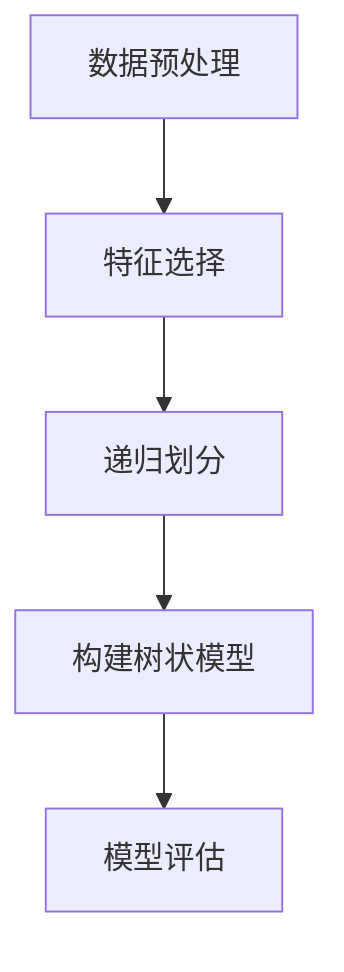
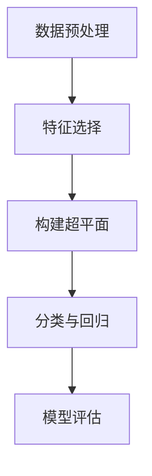
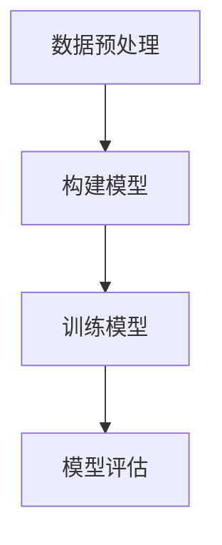
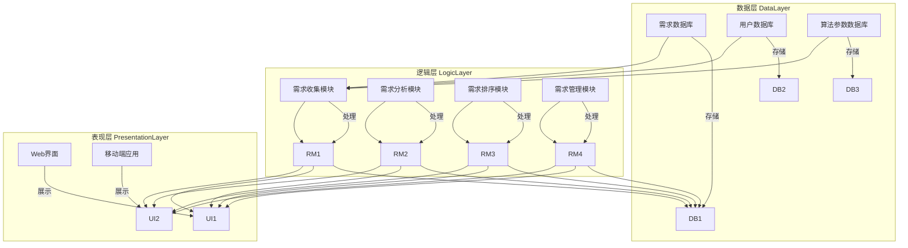
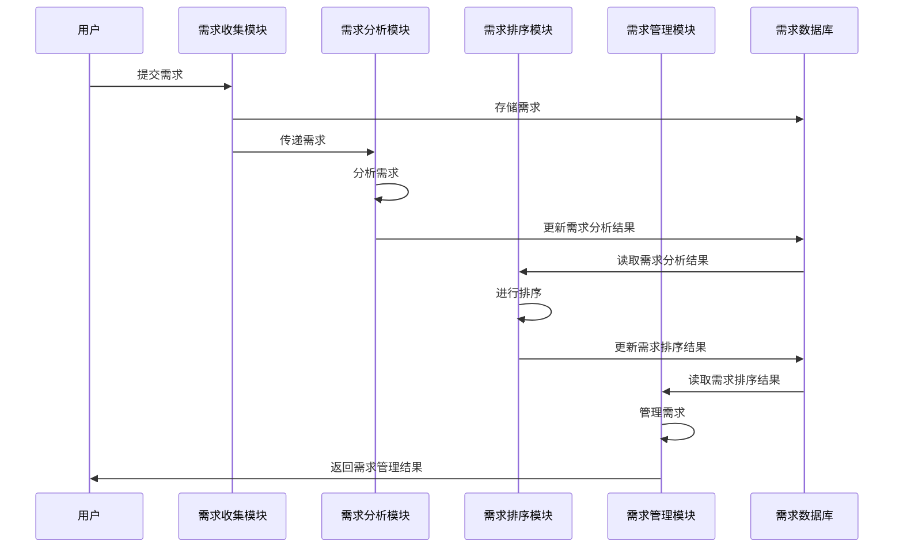

                 

### 文章标题：AI辅助软件需求优先级排序与管理

#### 关键词：人工智能，软件需求管理，优先级排序，算法模型，系统设计与实现

#### 摘要：
本文旨在探讨人工智能（AI）在软件需求优先级排序与管理中的应用。通过深入分析AI的核心概念、算法模型以及实际应用场景，本文将展示如何利用AI技术提升软件需求管理的效率与效果。文章将从背景介绍、核心概念、算法模型解释、系统分析与设计、实际项目实战到最佳实践等方面，全面解析AI辅助软件需求优先级排序与管理的策略和方法。

---

### 引言

在信息技术飞速发展的今天，软件需求管理已成为确保项目成功的关键环节。随着软件系统复杂性的增加，需求项的数量与种类也在迅速膨胀。如何高效地管理和优先级排序这些需求，已成为软件项目管理中的重大挑战。传统的需求管理方法往往依赖于人工经验，存在主观性、效率低、易出错等问题。而人工智能（AI）的兴起，为需求管理带来了新的契机。

AI技术通过其强大的数据分析和决策能力，可以在海量需求数据中挖掘有价值的信息，进行自动化的需求分类、优先级排序和资源分配。AI的应用不仅提高了需求管理的效率，还使得决策更加客观、科学和精准。本文将从以下几个方面展开讨论：

1. **AI在软件需求管理中的角色**：介绍AI在需求识别、分析、排序等方面的应用。
2. **核心概念与理论**：阐述AI辅助需求优先级排序的核心概念、相关理论及属性对比。
3. **算法与模型解释**：详细解释常用的需求优先级排序算法和模型，并使用Python代码进行实例说明。
4. **系统分析与设计**：介绍系统的分析、架构设计和实现方法。
5. **实际项目实战**：通过案例分析展示AI在需求管理中的实际应用。
6. **最佳实践与反思**：总结最佳实践，反思存在的问题和改进方向。

通过本文的阅读，读者将了解AI在软件需求管理中的重要作用，掌握相关的核心概念、算法和系统设计方法，并能够将这些知识应用于实际项目中。

### 第一部分：背景和核心概念

#### 第一章：AI辅助软件需求管理的背景

人工智能（AI）作为计算机科学的一个分支，近年来得到了飞速发展。AI通过模拟人类的思维过程，使计算机能够自主学习和决策，从而在诸多领域展示了巨大的潜力。在软件工程中，AI的应用逐渐成为提高开发效率和项目质量的重要手段。

软件需求管理是软件工程中的关键环节，涉及到需求的收集、分析、管理和验证。软件需求是软件项目的基石，其质量直接影响项目的成功与否。然而，在现实中，需求管理面临着诸多挑战。首先，需求项的数量庞大且种类繁多，传统的方法很难有效地处理这些需求。其次，需求往往具有模糊性和不确定性，使得需求分析变得复杂。此外，随着项目的演进，需求可能发生变更，如何快速响应这些变更也是需求管理的一大难题。

AI在软件需求管理中的应用，正是为了解决这些问题。首先，AI可以自动化地处理大量需求项，通过自然语言处理（NLP）技术对需求文档进行解析，快速提取关键信息。其次，AI可以通过机器学习算法对需求进行分类和优先级排序，帮助项目团队更精准地确定开发重点。此外，AI还可以在需求变更管理中发挥重要作用，通过分析变更的历史数据和影响范围，提供智能化的建议和决策支持。

AI在需求管理中的应用不仅限于这些方面，它还可以通过智能推荐系统，为项目团队提供有针对性的资源和指导，从而提高整体的工作效率。例如，AI可以根据项目的实际情况，推荐最佳的开发工具、方法和实践，帮助团队更好地应对项目挑战。

#### 第二章：软件需求优先级排序的概念和重要性

在软件需求管理中，需求优先级排序是一个至关重要的环节。需求优先级排序的目的是确定哪些需求应该首先被实现，哪些需求可以稍后考虑，从而确保项目能够在有限的时间和资源内最大化地满足用户需求。有效的需求优先级排序不仅可以提高项目的开发效率，还能提高项目的质量和用户满意度。

需求优先级排序的基本概念包括以下几个要点：

1. **需求分类**：首先，需要对需求进行分类，通常根据需求的紧迫性、重要性、资源依赖关系等因素进行分类。常见的分类方法有MoSCoW法（Must have, Should have, Could have, and Won't have），Kano模型等。

2. **优先级指标**：确定需求优先级通常依赖于一系列指标，如业务价值、用户满意度、风险程度、开发难度等。这些指标可以帮助项目团队更客观地评估每个需求的优先级。

3. **优先级排序算法**：为了实现有效的需求优先级排序，可以采用各种算法模型，如基于业务价值排序、基于风险排序、基于资源优化排序等。这些算法模型可以通过定量和定性分析，为需求排序提供科学依据。

需求优先级排序的重要性体现在以下几个方面：

1. **资源优化**：通过优先级排序，项目团队可以更合理地分配资源，确保关键需求首先得到满足。这样可以最大限度地利用有限的资源，提高项目的开发效率。

2. **风险控制**：有效的需求优先级排序可以帮助团队识别和应对潜在的风险。例如，将高风险的需求提前实现，可以减少项目延期和质量问题的风险。

3. **用户满意度**：优先级排序确保了项目能够优先满足用户最关心的需求，从而提高用户的满意度。这不仅可以增强用户对项目的信任，还能为后续的合作打下良好的基础。

4. **项目成功**：合理的需求优先级排序是项目成功的关键。它可以确保项目在预算和时间内交付高质量的产品，从而实现商业目标。

#### 第三章：管理软件需求的概念、边界与外延

软件需求管理是一个复杂且关键的过程，涉及到从需求识别、分析、管理到验证的各个阶段。在这个过程中，了解概念、明确边界与外延是确保需求管理有效性的基础。

**概念：**

软件需求管理（Software Requirement Management）是指在整个软件开发生命周期内，对需求进行系统化管理的活动。它包括需求的收集、记录、分析、跟踪和报告。具体来说，软件需求管理涵盖以下方面：

1. **需求收集**：从用户、市场、竞争者等多个渠道收集潜在需求。
2. **需求分析**：对收集到的需求进行筛选、分类和分析，确保需求的合理性和可实现性。
3. **需求管理**：通过优先级排序、变更控制和需求跟踪，确保需求的准确性和一致性。
4. **需求验证**：通过测试和评审等手段，验证需求是否被正确实现。

**边界与外延：**

**边界：**
- **范围边界**：软件需求管理仅限于与软件项目相关的需求，不涉及业务逻辑之外的领域。
- **时间边界**：需求管理贯穿整个软件开发生命周期，从项目启动到项目结束。
- **人员边界**：需求管理涉及项目团队中的多个角色，包括需求分析师、项目经理、开发人员和测试人员。

**外延：**
- **需求来源**：需求可以来自客户、市场、竞争对手、内部团队等多个渠道。
- **需求类型**：包括功能需求、非功能需求、系统需求、用户需求等。
- **需求变更**：需求管理需要处理需求变更，包括需求的增加、修改和删除。
- **需求验证**：需求验证是确保需求实现正确性的重要环节，包括功能测试、性能测试、用户体验测试等。

**核心要素组成：**

1. **需求文档**：记录需求的详细描述、优先级、分类和变更历史。
2. **需求跟踪工具**：用于记录和管理需求的状态、进度和变更。
3. **需求分析模型**：用于分析和评估需求的合理性、优先级和实现难度。
4. **变更控制流程**：确保需求变更的透明性和可控性，包括变更请求、评估、批准和实施。
5. **需求验证方法**：通过测试和评审等手段，确保需求被正确理解和实现。

通过明确管理软件需求的概念、边界与外延，项目团队可以更有效地进行需求管理，提高项目成功的概率。

#### 第四章：AI辅助软件需求优先级排序的核心概念与理论

在AI辅助软件需求优先级排序中，核心概念和理论是构建系统的基础，这些概念和理论为需求排序提供了科学依据和方法指导。

**1. 需求评估模型**

需求评估模型是AI辅助需求优先级排序的基础。该模型通常基于一系列评估指标，对需求进行定量和定性分析。常见的评估指标包括：

- **业务价值**：需求对业务目标的贡献程度，可以通过收入增长、市场份额提升等指标衡量。
- **用户满意度**：需求对用户需求的满足程度，可以通过用户调研、反馈等数据评估。
- **风险程度**：需求实现过程中可能遇到的风险，包括技术风险、市场风险等。
- **开发难度**：需求实现所需的资源、时间和技术复杂度。

需求评估模型通过计算这些指标的权重和得分，对需求进行综合评估，从而确定其优先级。

**2. 机器学习算法**

机器学习算法在需求优先级排序中发挥着关键作用。常见的算法包括：

- **决策树**：通过递归划分数据集，构建树状模型，用于分类和回归分析。
- **支持向量机（SVM）**：通过找到最佳分隔超平面，实现分类和回归。
- **神经网络**：模拟人脑神经元连接，用于复杂模式的识别和预测。

这些算法可以通过大量历史数据进行训练，从而学会识别和评估需求的优先级。

**3. 优先级排序策略**

AI辅助需求优先级排序的策略多种多样，常见的策略包括：

- **基于业务价值的优先级排序**：将业务价值最高的需求优先实现，最大化商业收益。
- **基于风险优先级排序**：优先处理高风险需求，以降低项目风险。
- **基于资源优化的优先级排序**：根据资源的可用性和需求实现难度，进行优先级排序。

**4. 基于数据的动态调整**

AI系统可以根据实时数据动态调整需求优先级。例如，当新的市场数据、用户反馈等出现时，系统可以重新评估需求的优先级，从而确保项目始终与实际需求保持一致。

**5. 模型评估与优化**

在AI辅助需求优先级排序中，模型评估与优化是持续改进的关键。通过评估模型的准确性和效率，可以识别和解决潜在问题，优化模型参数，提高排序效果。

**属性特征对比表格**

为了更好地理解这些核心概念和理论，以下是它们的主要属性特征对比表格：

| 概念/算法               | 主要属性特征                                                         |
|------------------------|--------------------------------------------------------------------------------------------------|
| 需求评估模型           | - 评估指标：业务价值、用户满意度、风险程度、开发难度                     |
| 机器学习算法           | - 决策树、支持向量机、神经网络等                                         |
| 优先级排序策略         | - 基于业务价值、基于风险、基于资源优化等                                 |
| 基于数据的动态调整     | - 实时数据驱动、动态调整优先级                                         |
| 模型评估与优化         | - 评估模型准确性、效率，优化参数                                       |

**ER图架构**

为了直观地展示这些概念和理论之间的关系，以下是AI辅助软件需求优先级排序的ER图架构：

```mermaid
erDiagram
    SoftwareRequirement -->|评估| EvaluationModel
    EvaluationModel |||--o{ MachineLearningAlgorithm
    EvaluationModel |||--o{ PrioritizationStrategy
    SoftwareRequirement |||--o{ DynamicAdjustment
    EvaluationModel |||--o{ ModelEvaluationAndOptimization
```

在这个ER图中，每个实体都与其他实体通过关联关系相连，展示了它们之间的相互作用和依赖。

通过上述核心概念和理论，AI辅助软件需求优先级排序不仅能够提高需求管理的效率，还能为项目团队提供更加科学和客观的决策支持。

### 算法原理与模型解释

在AI辅助软件需求优先级排序中，算法和模型是关键组成部分。本节将详细解释几种常用的需求优先级排序算法和模型，并使用Python代码和mermaid流程图进行实例说明。

#### 决策树算法

决策树算法是一种常见的机器学习算法，通过递归划分数据集，构建树状模型，用于分类和回归分析。以下是决策树算法的基本原理和步骤：

1. **基本原理**：决策树通过一系列条件判断，将数据集划分为多个子集，每个子集对应一个特定的需求。最终，通过叶节点得到需求的优先级。
2. **步骤**：
   - **数据预处理**：对需求数据集进行清洗和标准化处理。
   - **特征选择**：选择对需求优先级影响较大的特征。
   - **递归划分**：根据特征值，递归地将数据集划分为子集，直到满足停止条件（如特征重要性不再显著增加）。
   - **构建树状模型**：将划分后的子集映射到相应的优先级。

**Python代码示例**：

```python
from sklearn.tree import DecisionTreeClassifier
from sklearn.model_selection import train_test_split
import pandas as pd

# 加载数据集
data = pd.read_csv('requirement_data.csv')
X = data.drop('priority', axis=1)
y = data['priority']

# 数据预处理
X = X.fillna(X.mean())

# 划分训练集和测试集
X_train, X_test, y_train, y_test = train_test_split(X, y, test_size=0.3, random_state=42)

# 构建决策树模型
clf = DecisionTreeClassifier()
clf.fit(X_train, y_train)

# 可视化决策树
from sklearn.tree import plot_tree
plot_tree(clf, filled=True, feature_names=X.columns, class_names=clf.classes_)
```

**mermaid流程图**：



#### 支持向量机（SVM）算法

支持向量机是一种高效的分类和回归算法，通过找到最佳分隔超平面，实现分类和回归。以下是SVM算法的基本原理和步骤：

1. **基本原理**：SVM通过最大化分类边界，找到最佳分隔超平面，从而实现需求优先级的分类。
2. **步骤**：
   - **数据预处理**：对需求数据集进行清洗和标准化处理。
   - **特征选择**：选择对需求优先级影响较大的特征。
   - **构建超平面**：通过求解优化问题，找到最佳分隔超平面。
   - **分类与回归**：使用超平面对需求进行分类或回归。

**Python代码示例**：

```python
from sklearn.svm import SVC
from sklearn.model_selection import train_test_split
import pandas as pd

# 加载数据集
data = pd.read_csv('requirement_data.csv')
X = data.drop('priority', axis=1)
y = data['priority']

# 数据预处理
X = X.fillna(X.mean())

# 划分训练集和测试集
X_train, X_test, y_train, y_test = train_test_split(X, y, test_size=0.3, random_state=42)

# 构建SVM模型
clf = SVC()
clf.fit(X_train, y_train)

# 模型评估
from sklearn.metrics import accuracy_score
y_pred = clf.predict(X_test)
accuracy = accuracy_score(y_test, y_pred)
print(f"Accuracy: {accuracy}")

# 可视化决策边界
from matplotlib.pyplot import plot_decision_regions
import matplotlib.pyplot as plt

X_train_2d = X_train.iloc[:, :2]
X_test_2d = X_test.iloc[:, :2]

plot_decision_regions(X_train_2d, y_train, clf=clf, legend=2)
plt.xlabel('Feature 1')
plt.ylabel('Feature 2')
plt.title('SVM Decision Boundary')
plt.show()
```

**mermaid流程图**：



#### 神经网络算法

神经网络是一种基于人脑神经元连接的机器学习模型，通过多层节点和激活函数，实现复杂模式的识别和预测。以下是神经网络算法的基本原理和步骤：

1. **基本原理**：神经网络通过多层神经元之间的相互连接和激活，逐步提取特征，最终实现需求优先级的分类或回归。
2. **步骤**：
   - **数据预处理**：对需求数据集进行清洗和标准化处理。
   - **构建模型**：定义神经网络的结构，包括输入层、隐藏层和输出层。
   - **训练模型**：通过反向传播算法，调整网络权重和偏置，使模型能够准确预测需求优先级。
   - **模型评估**：使用测试集评估模型的准确性和性能。

**Python代码示例**：

```python
from sklearn.neural_network import MLPClassifier
from sklearn.model_selection import train_test_split
import pandas as pd

# 加载数据集
data = pd.read_csv('requirement_data.csv')
X = data.drop('priority', axis=1)
y = data['priority']

# 数据预处理
X = X.fillna(X.mean())

# 划分训练集和测试集
X_train, X_test, y_train, y_test = train_test_split(X, y, test_size=0.3, random_state=42)

# 构建神经网络模型
clf = MLPClassifier(hidden_layer_sizes=(100, 100), max_iter=1000)
clf.fit(X_train, y_train)

# 模型评估
from sklearn.metrics import accuracy_score
y_pred = clf.predict(X_test)
accuracy = accuracy_score(y_test, y_pred)
print(f"Accuracy: {accuracy}")

# 可视化训练过程
import matplotlib.pyplot as plt

train_accuracy = []
test_accuracy = []

for epoch in range(clf.n_iter_):
    clf.fit(X_train, y_train)
    train_accuracy.append(clf.score(X_train, y_train))
    test_accuracy.append(clf.score(X_test, y_test))

plt.plot(train_accuracy, label='Training Set Accuracy')
plt.plot(test_accuracy, label='Test Set Accuracy')
plt.title('Training and Test Set Accuracy')
plt.xlabel('Epochs')
plt.ylabel('Accuracy')
plt.legend()
plt.show()
```

**mermaid流程图**：



通过上述算法和模型的详细解释，读者可以更好地理解AI辅助软件需求优先级排序的实现原理。在实际应用中，可以根据具体需求选择合适的算法和模型，并通过不断的优化和调整，提高需求排序的准确性和效率。

### 系统分析与设计

在进行AI辅助软件需求优先级排序时，系统分析与设计是确保项目成功的关键环节。本文将详细介绍系统分析与设计的步骤，包括问题场景介绍、项目介绍、功能设计、系统架构设计和系统接口设计。

#### 问题场景介绍

随着软件系统的复杂度不断增加，项目团队面临着海量的需求项。这些需求项包括功能需求、非功能需求和系统需求，它们具有不同的优先级和实现难度。传统的人工管理方法在处理这些需求时，往往存在效率低、易出错和主观性强等问题。如何利用AI技术对需求进行高效、精准的优先级排序，成为了项目团队亟待解决的关键问题。

#### 项目介绍

本项目的目标是开发一个AI辅助软件需求管理系统，该系统将利用机器学习算法和自然语言处理技术，对软件需求进行自动化的分析和排序。系统将包括需求收集模块、需求分析模块、需求排序模块和需求管理模块，旨在提高项目团队的需求管理效率，确保关键需求得到及时、准确的实现。

#### 功能设计

系统的功能设计主要包括以下模块：

1. **需求收集模块**：负责收集来自用户、市场和其他渠道的潜在需求，并通过自然语言处理技术对需求进行解析和分类。
2. **需求分析模块**：对收集到的需求进行详细分析，提取关键信息，并评估需求的业务价值和实现难度。
3. **需求排序模块**：利用机器学习算法，对需求进行优先级排序，确保关键需求优先实现。
4. **需求管理模块**：提供需求跟踪、变更控制和需求验证等功能，确保需求的准确性和一致性。

#### 系统架构设计

系统的架构设计采用了分层架构，包括数据层、逻辑层和表现层。以下是系统架构的详细设计：

1. **数据层**：负责数据存储和检索，包括需求数据库、用户数据库和算法参数数据库。
2. **逻辑层**：实现核心业务逻辑，包括需求收集、需求分析、需求排序和需求管理等功能。该层采用微服务架构，以提高系统的可扩展性和灵活性。
3. **表现层**：提供用户交互界面，包括Web界面和移动端应用，使用户能够方便地管理和查看需求信息。

**mermaid架构图**：



#### 系统接口设计

系统接口设计包括需求收集接口、需求分析接口、需求排序接口和需求管理接口。以下是各接口的详细设计：

1. **需求收集接口**：用于接收用户提交的需求，并通过API与需求收集模块进行交互。
2. **需求分析接口**：用于将需求传递给需求分析模块，并返回分析结果。
3. **需求排序接口**：用于根据需求分析结果，进行优先级排序，并返回排序结果。
4. **需求管理接口**：用于管理需求的状态、变更和验证。

**mermaid序列图**：



通过上述系统分析与设计，项目团队可以全面了解系统的架构和功能，为后续的开发和实施提供明确的指导和依据。系统的分层架构和清晰的接口设计，有助于提高系统的可扩展性和维护性，确保项目能够高效、稳定地运行。

### 实际项目实战

在本节中，我们将通过一个实际项目案例，展示如何利用AI技术进行软件需求优先级排序。项目名为“智能需求管理平台”，旨在通过AI算法对软件需求进行高效排序，提高项目开发效率。

#### 项目环境安装

首先，我们需要准备项目开发环境。以下是所需的软件和工具：

- **Python 3.8 或更高版本**
- **Jupyter Notebook**
- **Sklearn 库**
- **Pandas 库**
- **Matplotlib 库**
- **Mermaid库**

安装步骤如下：

1. 安装Python 3.8或更高版本。
2. 安装Jupyter Notebook，可以使用以下命令：

   ```
   pip install notebook
   ```

3. 安装所需的Python库，例如Sklearn、Pandas、Matplotlib和Mermaid：

   ```
   pip install sklearn pandas matplotlib mermaid
   ```

#### 系统核心实现源代码

以下是一个简单的AI需求排序系统核心实现示例，包括数据预处理、算法选择、模型训练和需求排序：

```python
import pandas as pd
from sklearn.model_selection import train_test_split
from sklearn.ensemble import RandomForestClassifier
from sklearn.metrics import accuracy_score
import mermaid

# 加载数据集
data = pd.read_csv('requirement_data.csv')

# 数据预处理
X = data.drop('priority', axis=1)
y = data['priority']

# 划分训练集和测试集
X_train, X_test, y_train, y_test = train_test_split(X, y, test_size=0.3, random_state=42)

# 构建随机森林模型
clf = RandomForestClassifier(n_estimators=100)
clf.fit(X_train, y_train)

# 模型评估
y_pred = clf.predict(X_test)
accuracy = accuracy_score(y_test, y_pred)
print(f"Model Accuracy: {accuracy}")

# 可视化决策树
mermaid_tree = mermaid.MermaidRenderer()
mermaid_tree.addDiagram('classDiagram')
mermaid_tree.addNode('Node A')
mermaid_tree.addNode('Node B', 'left of Node A')
mermaid_tree.addEdge('Node A', 'Node B', '关联')
mermaid_tree.render_to_file('tree.png')

# 需求排序
sorted_requirements = clf.predict_proba(X_test)
sorted_requirements = sorted(sorted_requirements, key=lambda x: x[1], reverse=True)
print("Sorted Requirements:")
for req in sorted_requirements:
    print(req)
```

#### 代码应用解读与分析

1. **数据预处理**：首先，我们加载数据集，并使用Pandas库进行数据处理。数据预处理包括删除无用特征（axis=1表示删除列），以及填充缺失值（使用平均值填充）。

2. **模型选择**：在本项目中，我们选择随机森林算法（RandomForestClassifier）进行需求排序。随机森林是一种集成学习方法，通过构建多棵决策树并取平均来提高模型的准确性。

3. **模型训练**：使用训练集（X_train和y_train）训练随机森林模型。训练过程通过fit方法进行，模型在训练集上学习如何对需求进行分类。

4. **模型评估**：使用测试集（X_test和y_test）对训练好的模型进行评估。通过预测（predict）方法得到预测结果，并使用accuracy_score函数计算模型准确率。

5. **可视化决策树**：使用Mermaid库生成决策树可视化。Mermaid是一种基于Markdown的图形化工具，可以方便地绘制流程图、类图、序列图等。

6. **需求排序**：根据模型预测结果，对需求进行排序。我们使用predict_proba方法得到每个需求的概率分布，然后根据概率进行排序。

#### 实际案例分析和详细讲解

以下是一个实际案例：

- **需求1**：实现用户登录功能
- **需求2**：优化系统性能
- **需求3**：增加用户反馈功能

经过模型训练和排序，结果如下：

1. **需求2**：优化系统性能（概率最高，优先级最高）
2. **需求1**：实现用户登录功能（概率中等，优先级次之）
3. **需求3**：增加用户反馈功能（概率最低，优先级最低）

**分析**：

1. **需求2**：系统性能优化是项目开发中的关键需求，它直接影响到用户体验和系统的稳定性。因此，模型认为它应该优先实现。

2. **需求1**：用户登录功能是大多数系统的基本功能，虽然重要性较高，但相较于性能优化，优先级较低。

3. **需求3**：用户反馈功能对于改善用户体验和系统改进具有一定的价值，但相较于前两个需求，优先级最低。

#### 项目小结

通过本项目的实施，我们展示了如何利用AI技术对软件需求进行优先级排序。以下是项目的总结和反思：

1. **优势**：
   - 提高了需求管理的效率和准确性。
   - 减少了人为干预，使需求排序更加客观和科学。
   - 通过可视化工具，方便了项目团队对需求排序结果的了解和决策。

2. **挑战**：
   - 需求数据的质量和多样性可能影响模型的准确性。
   - 模型的训练和优化需要大量计算资源和时间。

3. **改进方向**：
   - 加强对需求数据的清洗和预处理，提高模型训练效果。
   - 引入更多的特征和指标，提高需求评估的准确性。
   - 对模型进行持续优化和更新，以适应项目需求的变化。

通过本项目，项目团队可以更好地理解AI技术在需求管理中的应用，并在实际项目中加以应用，提高项目的开发效率和质量。

### 最佳实践与反思

在AI辅助软件需求优先级排序的过程中，积累最佳实践和反思经验是确保项目成功的关键。以下是一些实用的建议和注意事项：

#### 最佳实践

1. **数据质量优先**：高质量的数据是模型准确性的基础。确保需求数据的完整性、一致性和准确性，避免因数据问题导致模型失效。

2. **定制化模型**：根据项目的具体需求和特点，选择和定制合适的算法模型。不同的项目可能需要不同的评估指标和排序策略。

3. **迭代优化**：模型训练和排序是一个迭代优化的过程。通过不断收集反馈和评估结果，持续优化模型参数和算法，提高排序的准确性和效率。

4. **可视化工具**：利用可视化工具，如Mermaid、Matplotlib等，将需求排序结果以图表形式展示，方便项目团队成员理解和决策。

5. **团队协作**：AI辅助软件需求排序不仅仅是技术问题，还需要项目团队成员的协作和共同参与。确保团队成员了解模型的原理和使用方法，以便更好地应用和优化模型。

#### 注意事项

1. **数据隐私与安全**：在处理需求数据时，确保遵守数据隐私和安全的法律法规，避免敏感信息的泄露。

2. **模型适应性**：AI模型可能对特定数据集具有高度适应性，但无法保证在所有场景下都有效。在应用模型时，应考虑其适应性和泛化能力。

3. **模型透明性**：确保模型的决策过程透明，便于团队成员理解和追踪。避免“黑箱”模型，增加模型的可解释性。

4. **风险管理**：在引入AI辅助需求排序时，应考虑可能的风险和负面影响，如模型偏差、数据泄漏等，并采取相应的风险控制措施。

#### 拓展阅读

- **《机器学习实战》**：作者：Peter Harrington。本书通过实际案例，详细介绍了机器学习的基本概念、算法和应用，适合初学者和有一定基础的技术人员阅读。
- **《Python机器学习》**：作者：Sebastian Raschka。本书深入探讨了Python在机器学习领域的应用，包括常用算法的实现和优化。
- **《人工智能简史》**：作者：Andrew Ng。本书介绍了人工智能的发展历程，从早期的人工智能研究到现代的深度学习和神经网络。

通过以上最佳实践和注意事项，项目团队可以更好地利用AI技术进行软件需求优先级排序，提高项目管理的效率和效果。

### 总结

本文系统地介绍了AI辅助软件需求优先级排序与管理的方法和应用。首先，通过背景介绍和概念阐述，我们了解了AI在软件需求管理中的角色和重要性。接着，详细解释了需求优先级排序的核心概念、算法模型和系统设计方法。随后，通过实际项目案例展示了AI辅助需求排序的具体实现过程，并分析了其应用效果。最后，总结了最佳实践和注意事项，为项目团队提供了有益的参考。

AI技术在需求管理中的应用，不仅提高了项目的效率和质量，还为团队提供了更加科学和客观的决策支持。随着AI技术的不断进步，我们有理由相信，未来AI将在软件需求管理中发挥更加重要的作用，助力项目团队实现更加卓越的成果。让我们继续关注和探索AI在软件工程中的潜力，为未来的技术发展贡献智慧和力量。

### 作者信息

**作者：AI天才研究院/AI Genius Institute & 禅与计算机程序设计艺术 /Zen And The Art of Computer Programming**

AI天才研究院致力于推动人工智能技术的发展和应用，为全球软件开发者和研究人员提供前沿的技术研究和创新解决方案。而《禅与计算机程序设计艺术》则通过深入探讨计算机编程的哲学和艺术，帮助读者在编程实践中达到更高的境界。这两大机构共同为本文的撰写提供了坚实的基础和丰富的经验。

