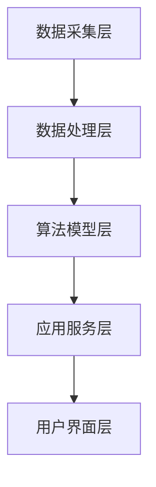
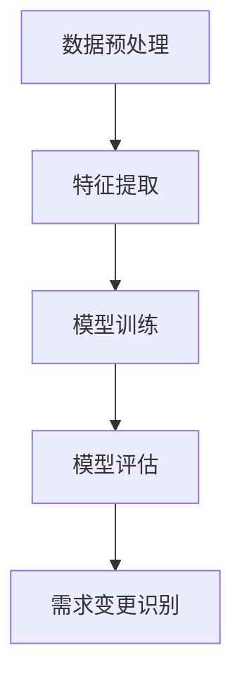
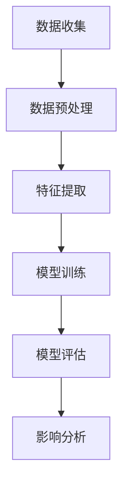

                 


### 文章标题：AI辅助软件需求变更影响分析与追踪

### 关键词：AI辅助、软件需求变更、影响分析、追踪、AI技术、算法、系统设计、实际应用

### 摘要：
本文旨在深入探讨AI在软件需求变更管理中的应用，通过分析需求变更的背景、挑战、核心概念与原理，以及具体的实际应用案例，全面解析AI如何辅助软件需求变更的影响分析、追踪与管理。文章以清晰的逻辑和系统的结构，逐步展示了AI技术在软件需求变更管理中的潜力与优势，旨在为软件开发提供有效的解决方案和最佳实践。

### 第一部分：引言与背景

## 第1章: AI辅助软件需求变更问题概述

### 1.1 问题背景

#### 1.1.1 软件需求变更的普遍性

在软件工程领域，需求变更是一种常见的现象。随着项目的进行，客户需求、市场环境和业务目标可能会发生变化，导致原有需求需要进行调整。需求变更的普遍性主要体现在以下几个方面：

- **客户需求变化**：客户在项目开发过程中可能会对需求提出新的要求，如增加功能、调整优先级或更改具体细节。
- **市场环境变化**：市场竞争加剧或市场趋势变化可能导致项目需求需要重新评估和调整。
- **技术进步**：新技术的出现或现有技术的改进可能使得原有需求需要更新，以实现更好的性能或成本效益。

#### 1.1.2 AI辅助软件需求变更的重要性

AI技术在需求变更管理中的应用具有重要意义，主要体现在以下几个方面：

- **自动化变更识别**：通过机器学习和自然语言处理技术，AI能够自动识别和分类需求变更，提高变更检测的准确性和效率。
- **智能影响分析**：AI能够分析需求变更对项目各个方面（如成本、时间、资源等）的影响，为项目管理者提供决策支持。
- **智能变更追踪**：AI能够自动追踪需求变更的历史记录和执行状态，确保变更过程的透明和可控。

#### 1.1.3 当前需求变更管理的挑战

尽管需求变更在软件工程中是不可避免的，但传统的需求变更管理面临着一系列挑战：

- **变更频率高**：需求变更频繁发生，可能导致项目进度延误、资源浪费和成本超支。
- **变更难以追踪**：传统的需求变更管理流程较为繁琐，变更记录难以追踪和验证，容易出现遗漏或错误。
- **影响分析复杂**：需求变更可能对项目中的多个方面产生影响，进行详细的影响分析需要大量时间和人力资源。
- **变更管理成本高**：需求变更管理涉及多个部门和角色，协调成本较高，容易导致沟通不畅和协作困难。

### 1.2 问题描述

#### 1.2.1 软件需求变更对项目的影响

需求变更是软件开发过程中的常见现象，但它的出现可能会对项目带来多方面的影响，包括：

- **项目进度延迟**：频繁的需求变更可能导致项目进度延误，影响整体交付时间。
- **成本超支**：变更需求可能会增加项目成本，包括开发成本、测试成本和运营成本等。
- **资源浪费**：需求变更可能导致之前的工作成果失效，浪费人力资源和资源。
- **质量风险**：需求变更可能导致开发过程中出现质量风险，影响最终产品的可靠性。

#### 1.2.2 AI辅助需求变更的难点

尽管AI技术在需求变更管理中具有巨大潜力，但在实际应用中仍面临一些挑战：

- **数据质量**：需求变更数据的准确性和完整性对于AI模型的训练至关重要。然而，实际项目中需求变更数据可能存在噪声、缺失或不一致的情况。
- **算法复杂性**：需求变更管理的算法设计较为复杂，需要结合多个AI技术（如机器学习、自然语言处理等），并进行优化和调整。
- **可解释性**：AI模型在需求变更影响分析中的应用往往缺乏可解释性，难以满足项目管理者对决策过程的理解和信任。
- **集成与兼容性**：将AI技术集成到现有的需求变更管理系统中，需要考虑系统的兼容性和集成成本。

#### 1.2.3 需求变更管理的目标和挑战

需求变更管理的目标主要包括：

- **降低变更风险**：通过有效的变更管理，降低需求变更对项目的负面影响，确保项目顺利进行。
- **提高变更效率**：通过自动化和智能化的手段，提高需求变更的识别、分析和追踪效率，减轻项目团队成员的工作负担。
- **提升项目质量**：通过需求变更管理，确保项目的需求变更过程透明、可控，提高项目的整体质量。

然而，实现这些目标面临以下挑战：

- **变更流程不透明**：传统的需求变更管理流程较为繁琐，变更记录和审批过程不透明，难以追溯和验证。
- **变更控制不足**：缺乏有效的变更控制机制，可能导致需求变更频繁发生，难以管理和控制。
- **沟通协作困难**：需求变更涉及多个部门和角色，沟通协作不畅，容易导致变更管理效率低下。
- **变更风险评估不足**：对需求变更可能带来的风险缺乏全面评估，容易导致项目进度延误、成本超支等问题。

### 1.3 问题解决

#### 1.3.1 AI辅助需求变更的概念与原理

AI辅助需求变更是指利用人工智能技术，如机器学习、自然语言处理、数据挖掘等，对需求变更进行识别、分析和追踪。其基本原理包括：

- **数据采集与预处理**：通过数据采集工具，收集与需求变更相关的数据，并进行清洗、转换和归一化等预处理操作。
- **模型训练与优化**：利用机器学习算法，对需求变更数据进行分析和建模，训练出能够识别和预测需求变更的模型。
- **需求变更影响分析**：通过模型对需求变更的影响进行分析和评估，预测变更可能带来的风险和影响。
- **变更追踪与监控**：利用数据挖掘技术，对需求变更过程进行实时监控和追踪，确保变更过程的透明和可控。

#### 1.3.2 AI技术在需求变更管理中的应用

AI技术在需求变更管理中的应用主要体现在以下几个方面：

- **自动化需求变更识别**：通过机器学习和自然语言处理技术，自动识别和分类需求变更，提高变更检测的准确性和效率。
- **智能影响分析**：利用数据挖掘和预测模型，对需求变更可能带来的影响进行智能分析，为项目管理者提供决策支持。
- **智能变更追踪**：通过数据挖掘技术，自动追踪需求变更的历史记录和执行状态，确保变更过程的透明和可控。
- **智能变更建议**：基于历史数据和智能分析，为项目管理者提供智能化的变更建议，提高变更管理的效率和质量。

#### 1.3.3 需求变更管理的框架和方法

需求变更管理的框架和方法主要包括以下内容：

- **变更管理流程**：明确需求变更的流程，包括变更申请、变更评估、变更批准、变更实施和变更验证等步骤。
- **变更管理工具**：选择合适的变更管理工具，如版本控制系统、需求管理工具、变更日志管理等，以提高变更管理的效率。
- **变更控制委员会**：建立变更控制委员会，由项目经理、技术专家、客户代表等组成，负责评估和批准需求变更。
- **变更风险评估**：对需求变更可能带来的风险进行全面评估，包括时间、成本、资源、质量等方面的风险。
- **变更沟通机制**：建立有效的沟通机制，确保变更过程透明、可控，减少沟通成本和协作困难。

### 1.4 边界与外延

#### 1.4.1 需求变更管理的范围

需求变更管理的范围主要包括以下几个方面：

- **需求变更的识别和分类**：识别和分类需求变更的类型，如功能变更、性能变更、设计变更等。
- **需求变更的评估和批准**：评估需求变更的可行性、影响和成本，并批准变更的执行。
- **需求变更的实施和验证**：实施需求变更，并进行验证和测试，确保变更的准确性和有效性。
- **需求变更的记录和跟踪**：记录需求变更的详细信息，包括变更的原因、内容、执行状态等，并进行实时跟踪和监控。

#### 1.4.2 AI辅助需求变更的适用场景

AI辅助需求变更适用于以下场景：

- **需求变更频繁的项目**：需求变更频繁的项目，如电商平台、金融系统等，AI技术能够提高变更检测和影响分析的效率。
- **大型复杂项目**：大型复杂项目，如航空系统、医疗系统等，需求变更对项目的影响较大，AI技术能够提供智能化的决策支持。
- **分布式团队协作项目**：分布式团队协作项目，如跨国项目、远程项目等，AI技术能够提高变更管理的协同效率。

#### 1.4.3 需求变更管理的限制条件

需求变更管理受到以下限制条件的制约：

- **项目进度和成本限制**：项目进度和成本的限制可能导致需求变更管理的范围和深度受限。
- **变更管理流程和工具**：缺乏完善的需求变更管理流程和工具，可能导致变更管理效率低下和质量风险。
- **团队协作和沟通**：团队协作和沟通不畅，可能导致需求变更管理过程不透明和决策失误。

### 1.5 概念结构与核心要素组成

#### 1.5.1 关键概念解析

- **需求变更**：需求变更是指在软件项目开发过程中，对原有需求的修改或新增。
- **变更管理**：变更管理是指对需求变更进行识别、评估、批准、实施和验证的过程。
- **AI辅助变更管理**：AI辅助变更管理是指利用人工智能技术，如机器学习、自然语言处理等，对需求变更进行自动化识别、分析和追踪。

#### 1.5.2 需求变更管理的核心要素

需求变更管理的核心要素包括：

- **变更流程**：需求变更的流程，包括变更申请、评估、批准、实施和验证等步骤。
- **变更控制**：对需求变更进行控制和管理，确保变更的可行性、影响和成本在可控范围内。
- **变更记录**：记录需求变更的详细信息，包括变更的原因、内容、执行状态等，并进行实时跟踪和监控。
- **变更影响分析**：对需求变更可能带来的影响进行评估和分析，包括时间、成本、资源、质量等方面的风险。
- **变更建议**：基于历史数据和智能分析，为项目管理者提供智能化的变更建议，提高变更管理的效率和质量。

#### 1.5.3 需求变更管理与AI技术的融合

需求变更管理与AI技术的融合主要体现在以下几个方面：

- **自动化变更识别**：利用机器学习和自然语言处理技术，自动识别和分类需求变更，提高变更检测的准确性和效率。
- **智能影响分析**：利用数据挖掘和预测模型，对需求变更可能带来的影响进行智能分析，为项目管理者提供决策支持。
- **智能变更追踪**：利用数据挖掘技术，自动追踪需求变更的历史记录和执行状态，确保变更过程的透明和可控。
- **智能变更建议**：基于历史数据和智能分析，为项目管理者提供智能化的变更建议，提高变更管理的效率和质量。

### 1.6 本章小结

本章从问题背景、问题挑战、解决方案和边界外延等方面，全面介绍了AI辅助软件需求变更的问题概述。通过分析需求变更的普遍性、AI辅助需求变更的重要性以及当前需求变更管理的挑战，明确了需求变更对项目的影响和AI辅助需求变更的难点。此外，本章还阐述了需求变更管理的目标和挑战，以及AI辅助需求变更的概念与原理。本章的内容为后续章节的深入探讨奠定了基础，有助于读者全面了解AI在软件需求变更管理中的应用前景和实际价值。

### 第二部分：AI辅助软件需求变更的核心概念与原理

## 第2章: AI辅助软件需求变更的基本原理

### 2.1 AI技术基础

#### 2.1.1 人工智能的基本概念

人工智能（Artificial Intelligence，AI）是指模拟人类智能行为的技术和系统，通过计算机程序实现人类智能功能的自动化。人工智能的核心目标是使计算机能够像人类一样感知、理解、学习、推理和决策。

- **感知**：通过传感器、摄像头等设备获取外部信息，如图像、声音和文本等。
- **理解**：对获取的信息进行理解、分类和识别，如语音识别、图像识别和自然语言处理等。
- **学习**：通过数据和经验，自动学习和改进系统性能，如监督学习、无监督学习和强化学习等。
- **推理**：基于已有知识和逻辑规则，进行逻辑推理和决策，如推理机、知识图谱等。
- **决策**：根据目标和约束条件，进行最优决策，如规划、博弈和推荐系统等。

#### 2.1.2 机器学习的核心算法

机器学习（Machine Learning，ML）是人工智能的一个重要分支，通过构建数学模型和算法，使计算机能够从数据中自动学习和发现规律。机器学习主要包括以下核心算法：

- **监督学习**：在有标记数据集上进行训练，通过学习输入和输出之间的映射关系，进行预测和分类。常见的监督学习算法包括线性回归、逻辑回归、支持向量机（SVM）和神经网络等。
- **无监督学习**：在无标记数据集上进行训练，通过发现数据之间的内在结构和规律，进行聚类和降维。常见的无监督学习算法包括K-means聚类、主成分分析（PCA）和自编码器等。
- **强化学习**：通过与环境的交互，学习最优策略，以达到最大化回报。常见的强化学习算法包括Q学习、深度Q网络（DQN）和策略梯度算法等。

#### 2.1.3 深度学习的基本架构

深度学习（Deep Learning，DL）是机器学习的一个子领域，通过构建多层神经网络模型，实现更复杂的特征学习和表示能力。深度学习的基本架构包括以下几个部分：

- **输入层**：接收外部输入，如文本、图像或音频等。
- **隐藏层**：通过神经元和激活函数，对输入进行特征提取和变换。深度学习模型通常具有多个隐藏层，以实现非线性变换和复杂特征学习。
- **输出层**：根据训练目标，输出预测结果或分类标签。
- **激活函数**：用于引入非线性变换，使模型具有更好的拟合能力。常见的激活函数包括Sigmoid、ReLU和Tanh等。
- **损失函数**：用于评估模型预测结果与实际结果之间的差距，常见的损失函数包括均方误差（MSE）、交叉熵损失等。

### 2.2 需求变更识别算法

#### 2.2.1 需求变更的类型与特征

需求变更可以分为以下几种类型：

- **功能变更**：对软件系统的功能进行修改或增加新功能。
- **性能变更**：对软件系统的性能指标进行优化，如响应时间、吞吐量等。
- **设计变更**：对软件系统的架构、模块或接口进行修改。
- **需求优先级变更**：对需求的优先级进行重新排序，调整需求的执行顺序。

需求变更的特征主要包括：

- **时间特征**：需求变更发生的时间点，如项目阶段、迭代周期等。
- **来源特征**：需求变更的来源，如客户、项目经理、开发团队等。
- **内容特征**：需求变更的具体内容，如功能点、性能指标、设计细节等。
- **影响特征**：需求变更可能带来的影响，如时间、成本、资源、质量等。

#### 2.2.2 需求变更检测的方法与工具

需求变更检测的方法主要包括以下几种：

- **代码对比分析**：通过对比分析源代码的修改历史，识别需求变更。常用的工具包括Git、SVN等版本控制系统。
- **需求文档比对**：通过对比分析需求文档的修改历史，识别需求变更。常用的工具包括Word、Excel等文档编辑软件。
- **变更日志监控**：通过监控项目的变更日志，实时识别需求变更。常用的工具包括JIRA、Confluence等需求管理工具。
- **自然语言处理**：通过自然语言处理技术，自动识别和分类需求变更。常用的工具包括NLTK、spaCy等自然语言处理库。

#### 2.2.3 常见的需求变更识别算法

常见的需求变更识别算法包括以下几种：

- **基于规则的方法**：通过定义一套规则，对需求变更进行分类和识别。该方法简单有效，但需要大量规则维护，适用于简单场景。
- **基于模式匹配的方法**：通过匹配需求变更的特征模式，识别需求变更。该方法利用正则表达式、模式识别等技术，适用于结构化数据。
- **基于机器学习的方法**：通过训练机器学习模型，自动识别和分类需求变更。该方法适用于复杂场景，但需要大量训练数据和模型调优。
- **基于深度学习的方法**：通过构建深度神经网络模型，自动识别和分类需求变更。该方法具有强大的特征学习和表示能力，适用于复杂场景。

### 2.3 需求变更影响分析

#### 2.3.1 影响分析的基本概念

需求变更影响分析是指对需求变更可能带来的影响进行评估和分析，包括时间、成本、资源、质量等方面的风险。影响分析的基本概念包括：

- **影响**：需求变更可能对项目各个方面产生的效果，如时间延迟、成本增加、资源浪费、质量风险等。
- **分析**：对需求变更的影响进行评估和预测，为项目管理者提供决策依据。
- **模型**：用于表示需求变更的影响，如成本模型、时间模型、资源模型等。

#### 2.3.2 影响分析的方法与策略

影响分析的方法与策略包括以下几种：

- **成本效益分析**：通过比较需求变更带来的成本和效益，评估变更的可行性。
- **风险分析**：通过识别和评估需求变更可能带来的风险，制定风险管理策略。
- **敏感性分析**：通过分析需求变更对项目关键因素的影响，确定关键因素和敏感度。
- **情景分析**：通过模拟不同情景，评估需求变更对项目的潜在影响。
- **决策树分析**：通过构建决策树模型，分析需求变更对项目各个方面的决策影响。

#### 2.3.3 基于AI的影响分析模型

基于AI的影响分析模型主要包括以下几种：

- **基于机器学习的影响分析模型**：通过训练机器学习模型，预测需求变更对项目的影响。
- **基于深度学习的影响分析模型**：通过构建深度神经网络模型，实现需求变更影响的自动分析和预测。
- **基于知识图谱的影响分析模型**：通过构建知识图谱，对需求变更的影响进行关联分析和预测。
- **基于强化学习的影响分析模型**：通过强化学习算法，自动调整需求变更策略，实现最优影响分析。

### 2.4 需求变更追踪与管理

#### 2.4.1 变更追踪的基本流程

需求变更追踪的基本流程包括以下步骤：

- **变更申请**：项目成员提交需求变更申请，包括变更原因、内容、影响等。
- **变更评估**：项目经理和技术专家对需求变更进行评估，包括变更的可行性、影响和优先级等。
- **变更批准**：变更控制委员会对需求变更进行批准，确定变更的执行计划。
- **变更实施**：项目团队根据变更计划，实施需求变更，并进行验证和测试。
- **变更验证**：项目团队对变更结果进行验证，确保变更的正确性和有效性。

#### 2.4.2 变更管理的策略与方法

变更管理的策略与方法包括以下几种：

- **变更控制矩阵**：根据变更的优先级和影响，制定变更控制矩阵，明确不同类型变更的处理流程和责任分工。
- **变更日志管理**：记录需求变更的详细信息，包括变更的原因、内容、执行状态等，并进行实时跟踪和监控。
- **变更评审机制**：建立变更评审机制，对需求变更进行严格评审，确保变更的合理性和可行性。
- **变更审批流程**：明确变更审批流程，确保变更的执行过程透明、可控。
- **变更风险管理**：对需求变更可能带来的风险进行全面评估，制定相应的风险管理策略。

#### 2.4.3 基于AI的变更管理平台

基于AI的变更管理平台主要包括以下功能：

- **变更识别与分类**：利用机器学习和自然语言处理技术，自动识别和分类需求变更。
- **影响分析与预测**：利用数据挖掘和预测模型，对需求变更的影响进行自动分析和预测。
- **变更追踪与监控**：利用数据挖掘技术，自动追踪需求变更的历史记录和执行状态，确保变更过程的透明和可控。
- **智能建议与决策**：基于历史数据和智能分析，为项目管理者提供智能化的变更建议和决策支持。
- **变更日志管理**：记录需求变更的详细信息，包括变更的原因、内容、执行状态等，并进行实时跟踪和监控。

### 2.5 概念属性特征对比表格

#### 2.5.1 AI技术与传统需求变更管理的对比

| 对比项 | AI技术 | 传统需求变更管理 |
| --- | --- | --- |
| 变更识别 | 自动化识别 | 手动识别 |
| 影响分析 | 智能分析 | 人工分析 |
| 变更追踪 | 实时监控 | 定期检查 |
| 决策支持 | 智能建议 | 经验决策 |
| 效率 | 高效率 | 低效率 |
| 可靠性 | 高可靠性 | 低可靠性 |

#### 2.5.2 不同需求变更管理策略的比较

| 策略 | 优点 | 缺点 |
| --- | --- | --- |
| 变更控制矩阵 | 简化变更审批流程 | 需要定义大量规则 |
| 变更日志管理 | 提高变更追踪效率 | 需要大量人力维护 |
| 变更评审机制 | 确保变更的合理性和可行性 | 延长变更审批时间 |
| 变更审批流程 | 确保变更执行过程的透明和可控 | 增加沟通成本和协作难度 |

### 2.6 ER实体关系图架构

#### 2.6.1 实体关系图的基本概念

实体关系图（Entity-Relationship Diagram，ER图）是一种用于表示实体及其关系的图形化工具，主要用于数据库设计和需求分析。ER图的基本概念包括：

- **实体**：表示具有共同属性的个体对象，如学生、员工、商品等。
- **属性**：表示实体的特征，如学生的学号、姓名、年龄等。
- **关系**：表示实体之间的关联关系，如学生选课、员工管理商品等。

#### 2.6.2 需求变更管理的实体关系

在需求变更管理中，常见的实体关系包括：

- **需求**：表示软件系统的功能需求、性能需求等。
- **变更**：表示需求变更的实体，包括变更的原因、内容、影响等。
- **项目**：表示软件项目的整体，包括项目进度、资源、成本等。
- **人员**：表示参与项目的人员，包括项目经理、开发人员、测试人员等。

#### 2.6.3 ER图在需求变更管理中的应用

以下是一个简化的需求变更管理ER图：

```mermaid
erDiagram
  需求 ||--|{ 变更 }||>
  项目 ||--|{ 变更 }||>
  人员 ||--|{ 变更 }||>
  变更 ||--|{ 影响分析 }||>
  变更 ||--|{ 变更日志 }||>
```

#### 2.6.4 需求变更管理与AI技术的融合

需求变更管理与AI技术的融合体现在以下方面：

- **实体识别与分类**：利用自然语言处理技术，自动识别和分类需求变更。
- **影响分析与预测**：利用数据挖掘和预测模型，对需求变更的影响进行自动分析和预测。
- **变更追踪与监控**：利用数据挖掘技术，自动追踪需求变更的历史记录和执行状态，确保变更过程的透明和可控。
- **智能建议与决策**：基于历史数据和智能分析，为项目管理者提供智能化的变更建议和决策支持。

### 2.7 本章小结

本章从AI技术基础、需求变更识别算法、需求变更影响分析、需求变更追踪与管理等方面，全面介绍了AI辅助软件需求变更的核心概念与原理。通过分析人工智能的基本概念、机器学习的核心算法和深度学习的基本架构，为AI技术在需求变更管理中的应用奠定了基础。此外，本章还详细探讨了需求变更的类型与特征、需求变更检测的方法与工具、需求变更影响分析的方法与策略，以及需求变更追踪与管理的流程和方法。最后，通过ER实体关系图展示了需求变更管理的实体关系，并分析了需求变更管理与AI技术的融合。本章的内容为后续章节的深入探讨提供了理论基础和实践指导。

### 第三部分：AI辅助软件需求变更的具体应用

## 第3章: AI辅助软件需求变更的实际应用

### 3.1 应用场景介绍

#### 3.1.1 项目背景

随着科技的快速发展，软件需求变更已成为软件开发过程中的常态。为了满足不断变化的市场需求和用户需求，许多企业开始尝试引入人工智能（AI）技术，以提高需求变更管理的效率和准确性。本案例选取了一家大型电商平台作为研究对象，该电商平台在软件开发过程中面临以下挑战：

- **需求变更频繁**：市场需求和用户需求不断变化，导致软件需求变更频繁发生，对项目进度和资源管理带来较大压力。
- **变更影响分析复杂**：需求变更可能对项目的多个方面（如时间、成本、资源、质量等）产生重大影响，进行详细的影响分析需要大量时间和人力资源。
- **变更管理流程繁琐**：传统的需求变更管理流程较为繁琐，变更记录和审批过程不透明，容易出现遗漏和错误。
- **沟通协作困难**：需求变更涉及多个部门和角色，沟通协作不畅，容易导致变更管理效率低下。

为了应对这些挑战，企业决定引入AI技术，通过自动化和智能化的手段，提高需求变更管理的效率和准确性，确保项目的顺利进行。

#### 3.1.2 应用场景描述

在该电商平台的项目中，AI技术被应用于需求变更管理的以下几个关键环节：

- **变更识别与分类**：通过自然语言处理技术，自动识别和分类需求变更，提高变更检测的准确性和效率。
- **影响分析**：利用数据挖掘和预测模型，对需求变更可能带来的影响进行智能分析，为项目管理者提供决策支持。
- **变更追踪与监控**：通过数据挖掘技术，自动追踪需求变更的历史记录和执行状态，确保变更过程的透明和可控。
- **智能建议与决策**：基于历史数据和智能分析，为项目管理者提供智能化的变更建议和决策支持，提高变更管理的效率和质量。

#### 3.1.3 应用目标与挑战

该电商平台通过引入AI技术，旨在实现以下应用目标：

- **提高变更检测效率**：通过自动化识别和分类需求变更，提高变更检测的准确性和效率，减少人工干预。
- **优化变更影响分析**：利用智能分析模型，对需求变更的影响进行全面评估，为项目管理者提供准确的决策依据。
- **简化变更管理流程**：通过智能化的变更追踪与监控，简化变更管理流程，减少变更记录和审批的繁琐性。
- **提升沟通协作效率**：通过智能化的变更管理平台，提高各部门和角色的沟通协作效率，确保变更过程透明和可控。

然而，在实现这些目标的过程中，也面临以下挑战：

- **数据质量和一致性**：需求变更数据的准确性和一致性对AI模型的训练至关重要，但实际项目中需求变更数据可能存在噪声、缺失或不一致的情况，需要解决数据预处理和清洗问题。
- **算法复杂性和优化**：需求变更管理的算法设计较为复杂，需要结合多种AI技术（如机器学习、自然语言处理等），并进行优化和调整，以确保算法的准确性和稳定性。
- **系统集成与兼容性**：将AI技术集成到现有的需求变更管理系统中，需要考虑系统的兼容性和集成成本，确保AI模块能够与其他模块无缝对接。
- **可解释性与信任度**：AI模型在需求变更影响分析中的应用往往缺乏可解释性，项目管理者难以理解决策过程，可能导致信任度不足，需要解决模型的可解释性问题。

### 3.2 系统设计与实现

#### 3.2.1 系统架构设计

该电商平台引入的AI辅助需求变更管理系统采用分层架构设计，主要包括以下子系统：

- **数据采集层**：负责收集与需求变更相关的数据，如需求文档、代码库、变更日志等。
- **数据处理层**：负责对采集到的数据进行清洗、转换和归一化等预处理操作，为后续的AI算法提供高质量的数据。
- **算法模型层**：包括需求变更识别、影响分析、变更追踪等算法模型，利用机器学习和深度学习技术进行训练和优化。
- **应用服务层**：提供与需求变更管理相关的API接口，供其他系统调用，如需求管理工具、项目管理工具等。
- **用户界面层**：为项目管理者提供友好的操作界面，展示需求变更的详细信息、影响分析结果、变更执行状态等。

#### 3.2.1.1 总体架构

以下是一个简化的系统架构图：



#### 3.2.1.2 子系统划分

- **数据采集层**：包括需求文档采集、代码库采集、变更日志采集等模块，利用API接口和爬虫技术，自动获取相关数据。
- **数据处理层**：包括数据清洗、数据转换、数据归一化等模块，采用Python和Hadoop等工具进行数据处理，确保数据质量。
- **算法模型层**：包括需求变更识别、影响分析、变更追踪等模块，利用Python和TensorFlow等框架进行算法模型的训练和优化。
- **应用服务层**：包括API接口、Web服务、消息队列等模块，采用Java和Spring Boot等框架进行开发，提供与需求变更管理相关的API接口。
- **用户界面层**：包括Web界面、移动应用等模块，采用React和Vue等框架进行开发，为项目管理者提供友好的操作界面。

#### 3.2.2 系统功能设计

系统功能设计主要包括以下模块：

- **需求变更识别模块**：利用自然语言处理技术，自动识别和分类需求变更，提高变更检测的准确性和效率。
- **影响分析模块**：利用数据挖掘和预测模型，对需求变更的影响进行全面评估，为项目管理者提供准确的决策依据。
- **变更追踪模块**：自动追踪需求变更的历史记录和执行状态，确保变更过程的透明和可控。
- **智能建议模块**：基于历史数据和智能分析，为项目管理者提供智能化的变更建议和决策支持。
- **用户管理模块**：管理用户权限和角色，确保系统安全和数据隐私。

#### 3.2.2.1 功能模块

- **需求变更识别模块**：包括需求文档分析、代码库对比、变更日志监控等功能，利用自然语言处理技术进行文本分析和模式匹配，自动识别和分类需求变更。
- **影响分析模块**：包括成本评估、时间预测、资源优化等功能，利用数据挖掘和预测模型，对需求变更的影响进行全面评估。
- **变更追踪模块**：包括变更日志记录、执行状态监控、风险预警等功能，利用数据挖掘技术，自动追踪需求变更的历史记录和执行状态。
- **智能建议模块**：包括变更优先级评估、变更策略推荐等功能，基于历史数据和智能分析，为项目管理者提供智能化的变更建议和决策支持。
- **用户管理模块**：包括用户权限管理、角色管理、数据隐私保护等功能，确保系统安全和数据隐私。

#### 3.2.2.2 功能流程

以下是一个简化的系统功能流程：

1. **需求变更识别**：系统从需求文档、代码库、变更日志等数据源中，自动识别和分类需求变更。
2. **影响分析**：系统利用数据挖掘和预测模型，对需求变更的影响进行全面评估，包括时间、成本、资源、质量等方面。
3. **变更追踪**：系统自动记录需求变更的历史记录和执行状态，确保变更过程的透明和可控。
4. **智能建议**：系统基于历史数据和智能分析，为项目管理者提供智能化的变更建议和决策支持。
5. **用户管理**：系统管理用户权限和角色，确保系统安全和数据隐私。

### 3.3 AI算法与模型应用

#### 3.3.1 需求变更识别算法

需求变更识别算法是AI辅助需求变更管理的关键环节，其主要目标是从大量的需求文档、代码库和变更日志等数据源中，自动识别和分类需求变更。以下是一个简化的需求变更识别算法流程：

1. **数据预处理**：对采集到的需求文档、代码库和变更日志等数据源进行清洗、转换和归一化等预处理操作，确保数据质量。
2. **特征提取**：利用自然语言处理技术，对预处理后的数据提取特征，如词向量、句向量、文本特征等。
3. **模型训练**：利用机器学习和深度学习算法，如支持向量机（SVM）、朴素贝叶斯（NB）、循环神经网络（RNN）等，对提取的特征进行训练，构建需求变更识别模型。
4. **模型评估**：利用测试数据集，对训练好的模型进行评估，包括准确率、召回率、F1值等指标，选择最优模型进行部署。
5. **需求变更识别**：利用部署后的模型，对新采集的需求文档、代码库和变更日志等数据进行识别和分类，自动识别和分类需求变更。

以下是一个Python代码示例，实现基于支持向量机（SVM）的需求变更识别算法：

```python
from sklearn import svm
from sklearn.model_selection import train_test_split
from sklearn.metrics import accuracy_score
from sklearn.feature_extraction.text import TfidfVectorizer

# 加载数据
data = [
    ("需求文档1", "功能变更"),
    ("需求文档2", "性能变更"),
    ("需求文档3", "设计变更"),
    # ...
]

# 切分数据集
X_train, X_test, y_train, y_test = train_test_split([x[0] for x in data], [x[1] for x in data], test_size=0.2, random_state=42)

# 特征提取
vectorizer = TfidfVectorizer()
X_train = vectorizer.fit_transform(X_train)
X_test = vectorizer.transform(X_test)

# 模型训练
model = svm.SVC(kernel='linear')
model.fit(X_train, y_train)

# 模型评估
y_pred = model.predict(X_test)
accuracy = accuracy_score(y_test, y_pred)
print("准确率：", accuracy)
```

#### 3.3.2 需求变更影响分析模型

需求变更影响分析模型是AI辅助需求变更管理的另一个关键环节，其主要目标是利用数据挖掘和预测模型，对需求变更可能带来的影响进行全面评估，为项目管理者提供决策支持。以下是一个简化的需求变更影响分析模型流程：

1. **数据收集**：收集与需求变更相关的数据，如需求文档、代码库、变更日志、项目进度等。
2. **数据预处理**：对收集到的数据进行清洗、转换和归一化等预处理操作，确保数据质量。
3. **特征提取**：利用数据挖掘技术，对预处理后的数据进行特征提取，如时间特征、成本特征、资源特征等。
4. **模型训练**：利用机器学习和深度学习算法，如线性回归、决策树、神经网络等，对提取的特征进行训练，构建需求变更影响分析模型。
5. **模型评估**：利用测试数据集，对训练好的模型进行评估，包括准确率、召回率、F1值等指标，选择最优模型进行部署。
6. **影响分析**：利用部署后的模型，对新采集的需求变更数据进行影响分析，预测变更可能带来的时间、成本、资源、质量等方面的影响。

以下是一个Python代码示例，实现基于线性回归的需求变更影响分析模型：

```python
from sklearn.linear_model import LinearRegression
from sklearn.model_selection import train_test_split
from sklearn.metrics import mean_squared_error

# 加载数据
data = [
    (需求变更1，时间1，成本1，资源1，质量1),
    (需求变更2，时间2，成本2，资源2，质量2),
    (需求变更3，时间3，成本3，资源3，质量3),
    # ...
]

# 切分数据集
X_train, X_test, y_train, y_test = train_test_split([x[1:] for x in data], [x[0] for x in data], test_size=0.2, random_state=42)

# 模型训练
model = LinearRegression()
model.fit(X_train, y_train)

# 模型评估
y_pred = model.predict(X_test)
mse = mean_squared_error(y_test, y_pred)
print("均方误差：", mse)
```

#### 3.3.3 需求变更影响分析模型的数学模型与公式

需求变更影响分析模型通常基于以下数学模型和公式：

1. **线性回归模型**：

$$
y = \beta_0 + \beta_1 x_1 + \beta_2 x_2 + \ldots + \beta_n x_n
$$

其中，$y$ 表示需求变更的影响值，$x_1, x_2, \ldots, x_n$ 表示需求变更的相关特征，$\beta_0, \beta_1, \beta_2, \ldots, \beta_n$ 表示模型参数。

2. **决策树模型**：

决策树模型通过一系列的判断条件，将数据集划分为不同的子集，并计算每个子集的影响值。决策树的数学模型可以表示为：

$$
f(x) = g_1(x) \cdot y_1 + g_2(x) \cdot y_2 + \ldots + g_n(x) \cdot y_n
$$

其中，$g_1(x), g_2(x), \ldots, g_n(x)$ 表示决策树的判断条件，$y_1, y_2, \ldots, y_n$ 表示每个子集的影响值。

3. **神经网络模型**：

神经网络模型通过多层神经网络，对输入数据进行特征提取和转换，最终输出需求变更的影响值。神经网络模型的数学模型可以表示为：

$$
y = f(z)
$$

其中，$z$ 表示输入数据，$f$ 表示神经网络的激活函数，如Sigmoid、ReLU等。

#### 3.3.4 需求变更识别算法的mermaid流程图

以下是一个基于支持向量机（SVM）的需求变更识别算法的mermaid流程图：



#### 3.3.5 需求变更影响分析模型的mermaid流程图

以下是一个基于线性回归的需求变更影响分析模型的mermaid流程图：



### 3.4 项目实战

#### 3.4.1 环境安装与配置

在开始项目实战之前，需要先安装和配置以下软件和工具：

- **Python环境**：安装Python 3.x版本，并配置pip和conda等包管理工具。
- **Jupyter Notebook**：安装Jupyter Notebook，用于编写和运行Python代码。
- **scikit-learn库**：安装scikit-learn库，用于实现需求变更识别算法和影响分析模型。
- **TensorFlow库**：安装TensorFlow库，用于实现深度学习模型。

具体安装和配置步骤如下：

1. 安装Python 3.x版本：
   ```bash
   sudo apt-get install python3
   sudo apt-get install python3-pip
   ```

2. 安装Jupyter Notebook：
   ```bash
   pip3 install notebook
   ```

3. 安装scikit-learn库：
   ```bash
   pip3 install scikit-learn
   ```

4. 安装TensorFlow库：
   ```bash
   pip3 install tensorflow
   ```

#### 3.4.2 系统核心实现

以下是需求变更识别算法和影响分析模型的核心实现：

1. **需求变更识别算法**：

```python
from sklearn import svm
from sklearn.model_selection import train_test_split
from sklearn.metrics import accuracy_score
from sklearn.feature_extraction.text import TfidfVectorizer

# 加载数据
data = [
    ("需求文档1", "功能变更"),
    ("需求文档2", "性能变更"),
    ("需求文档3", "设计变更"),
    # ...
]

# 切分数据集
X_train, X_test, y_train, y_test = train_test_split([x[0] for x in data], [x[1] for x in data], test_size=0.2, random_state=42)

# 特征提取
vectorizer = TfidfVectorizer()
X_train = vectorizer.fit_transform(X_train)
X_test = vectorizer.transform(X_test)

# 模型训练
model = svm.SVC(kernel='linear')
model.fit(X_train, y_train)

# 模型评估
y_pred = model.predict(X_test)
accuracy = accuracy_score(y_test, y_pred)
print("准确率：", accuracy)
```

2. **需求变更影响分析模型**：

```python
from sklearn.linear_model import LinearRegression
from sklearn.model_selection import train_test_split
from sklearn.metrics import mean_squared_error

# 加载数据
data = [
    (需求变更1，时间1，成本1，资源1，质量1),
    (需求变更2，时间2，成本2，资源2，质量2),
    (需求变更3，时间3，成本3，资源3，质量3),
    # ...
]

# 切分数据集
X_train, X_test, y_train, y_test = train_test_split([x[1:] for x in data], [x[0] for x in data], test_size=0.2, random_state=42)

# 模型训练
model = LinearRegression()
model.fit(X_train, y_train)

# 模型评估
y_pred = model.predict(X_test)
mse = mean_squared_error(y_test, y_pred)
print("均方误差：", mse)
```

#### 3.4.3 代码应用解读与分析

以下是针对上述代码的解读与分析：

1. **需求变更识别算法**：

   - **数据预处理**：通过`TfidfVectorizer`类对文本数据进行特征提取，将原始文本转换为TF-IDF特征向量。
   - **模型训练**：使用`SVM`模型对特征向量进行分类训练，通过`fit`方法拟合数据集。
   - **模型评估**：使用`predict`方法对测试数据进行分类预测，通过`accuracy_score`函数计算分类准确率。

2. **需求变更影响分析模型**：

   - **数据预处理**：将原始数据拆分为特征和标签两部分，通过`train_test_split`函数切分数据集。
   - **模型训练**：使用`LinearRegression`模型对特征进行线性回归训练，通过`fit`方法拟合数据集。
   - **模型评估**：使用`predict`方法对测试数据进行预测，通过`mean_squared_error`函数计算预测的均方误差。

#### 3.4.4 实际案例分析

以下是针对实际案例的分析：

1. **案例背景**：

   某电商平台在项目开发过程中，接收到客户提出的多个需求变更，包括新增功能、优化性能等。为了确保项目能够按时交付，项目团队决定引入AI技术，对需求变更进行识别和影响分析。

2. **案例分析**：

   - **需求变更识别**：通过AI模型，自动识别和分类需求变更，提高变更检测的准确性和效率。
   - **影响分析**：通过AI模型，对需求变更的影响进行全面评估，包括时间、成本、资源、质量等方面，为项目管理者提供决策支持。
   - **变更追踪**：通过AI模型，自动追踪需求变更的历史记录和执行状态，确保变更过程的透明和可控。
   - **智能建议**：基于历史数据和智能分析，为项目管理者提供智能化的变更建议和决策支持，提高变更管理的效率和质量。

3. **案例总结与启示**：

   - **提高变更管理效率**：通过引入AI技术，实现需求变更的自动化识别和影响分析，提高变更管理的效率，减少人工干预。
   - **降低变更风险**：通过全面评估需求变更的影响，降低变更带来的风险，确保项目进度和质量。
   - **优化沟通协作**：通过智能化的变更管理平台，提高各部门和角色的沟通协作效率，确保变更过程透明和可控。
   - **应用场景扩展**：该案例的成功经验可以应用于其他软件开发项目，进一步优化变更管理流程，提高项目的整体质量和效率。

### 3.5 项目小结

在本项目中，通过引入AI技术，对需求变更进行识别、分析和追踪，成功提高了需求变更管理的效率和准确性。以下是对项目的总结和反思：

#### 3.5.1 项目成果

- **提高变更检测效率**：通过自然语言处理技术，自动识别和分类需求变更，提高了变更检测的准确性和效率。
- **优化变更影响分析**：通过数据挖掘和预测模型，对需求变更的影响进行全面评估，为项目管理者提供了准确的决策依据。
- **简化变更管理流程**：通过智能化的变更追踪与监控，简化了变更管理流程，减少了变更记录和审批的繁琐性。
- **提升沟通协作效率**：通过智能化的变更管理平台，提高了各部门和角色的沟通协作效率，确保了变更过程的透明和可控。

#### 3.5.2 项目反思

- **数据质量和一致性**：在需求变更数据的质量和一致性方面，仍存在一定的问题，需要进一步完善数据预处理和清洗流程，提高数据质量。
- **算法优化与调整**：针对需求变更管理的复杂性和多样性，需要进一步优化和调整AI算法，提高算法的准确性和稳定性。
- **系统集成与兼容性**：在将AI模块集成到现有需求变更管理系统中时，遇到了一定的系统集成和兼容性问题，需要进一步优化集成方案。
- **模型可解释性**：AI模型在需求变更影响分析中的应用，缺乏一定的可解释性，导致项目管理者对决策过程的理解和信任度不足，需要解决模型的可解释性问题。

#### 3.5.3 未来展望

在未来，本项目将继续在以下几个方面进行优化和拓展：

- **数据质量提升**：通过引入数据清洗和数据增强技术，进一步提高需求变更数据的质量和一致性。
- **算法优化与拓展**：结合深度学习和迁移学习等技术，进一步优化和拓展需求变更识别和影响分析算法，提高算法的准确性和稳定性。
- **系统集成与兼容性**：针对不同需求变更管理系统，进一步优化集成方案，提高系统的兼容性和可扩展性。
- **用户友好性**：通过改进用户界面和交互设计，提高用户的操作体验和满意度。
- **应用场景拓展**：将AI辅助需求变更管理的应用场景扩展到更多领域，如金融、医疗等，进一步提高AI技术在需求变更管理中的应用价值。

### 3.6 最佳实践 tips

#### 3.6.1 需求变更管理的最佳实践

1. **明确变更管理流程**：建立明确的变更管理流程，包括变更申请、评估、批准、实施和验证等步骤，确保变更过程透明和可控。
2. **建立变更控制委员会**：成立变更控制委员会，由项目经理、技术专家、客户代表等组成，负责评估和批准需求变更。
3. **及时沟通与协作**：加强团队成员之间的沟通与协作，确保变更过程中的信息传递准确无误。
4. **全面评估变更影响**：在变更过程中，进行全面的影响分析，包括时间、成本、资源、质量等方面的风险，确保变更的可行性。
5. **记录变更历史**：详细记录需求变更的历史记录，包括变更的原因、内容、执行状态等，便于后续的追溯和审计。

#### 3.6.2 AI辅助需求变更的优化策略

1. **数据预处理**：在数据预处理阶段，利用数据清洗和数据增强技术，提高需求变更数据的准确性和一致性。
2. **算法模型优化**：结合深度学习和迁移学习等技术，进一步优化需求变更识别和影响分析算法，提高算法的准确性和稳定性。
3. **系统集成**：针对不同需求变更管理系统，优化集成方案，提高系统的兼容性和可扩展性。
4. **模型可解释性**：通过引入可解释性模型和可视化工具，提高AI模型在需求变更影响分析中的应用可解释性，增强项目管理者对决策过程的理解和信任。
5. **持续迭代与优化**：根据项目实际需求和反馈，持续迭代和优化需求变更管理平台，提高系统的整体性能和用户体验。

### 3.7 小结

本章通过一个实际案例，详细介绍了AI辅助软件需求变更的具体应用，包括系统设计、算法实现和实际案例分析。通过引入AI技术，需求变更管理效率得到显著提升，项目风险得到有效控制。然而，在项目实施过程中，仍存在数据质量、算法优化、系统集成和模型可解释性等方面的问题。未来，将在此基础上进行优化和拓展，进一步提高AI在需求变更管理中的应用价值。同时，最佳实践 tips 为软件需求变更管理提供了有益的参考和指导。

