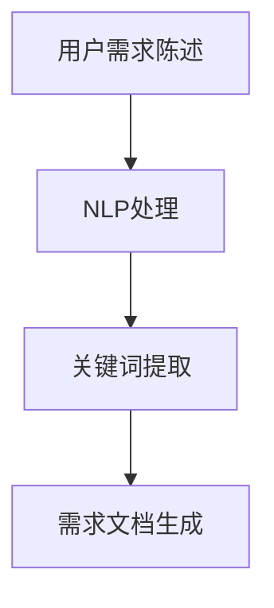
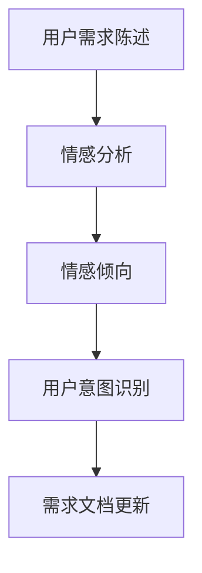
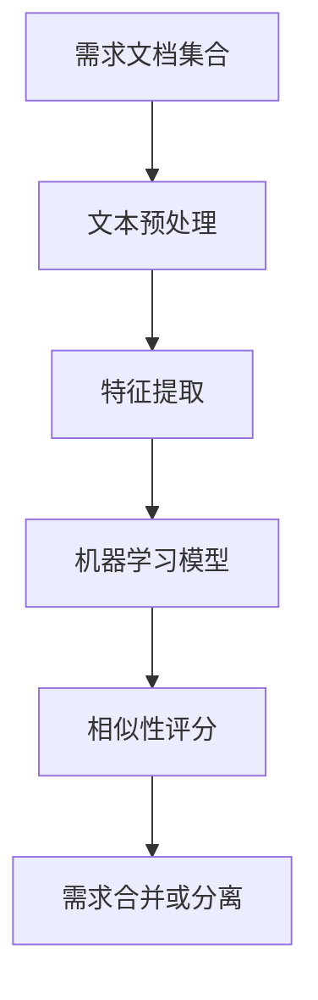
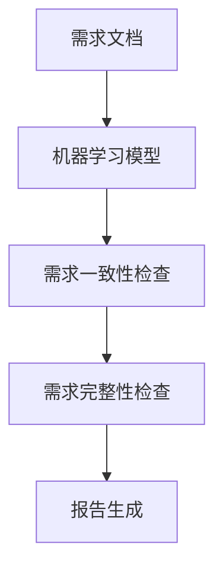
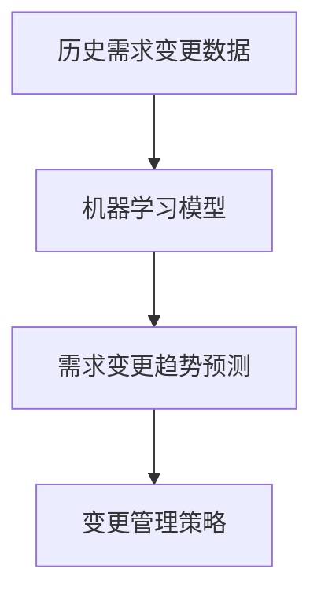
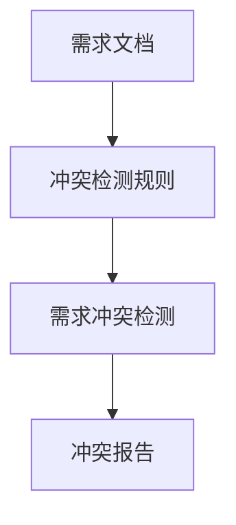
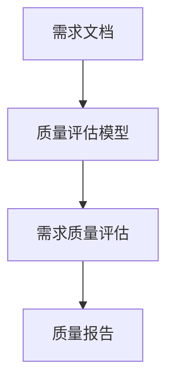
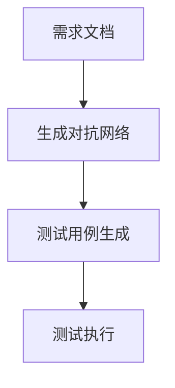
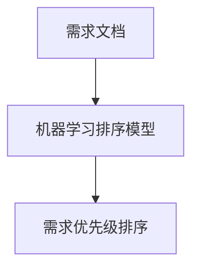

                 

### 背景介绍：AI辅助软件需求工程的重要性

软件需求工程是软件工程中至关重要的一环，它涉及从需求获取、需求分析、需求定义到需求管理的全过程。然而，随着软件系统规模的不断扩大和复杂性的增加，传统的软件需求工程方法面临着诸多挑战。首先，需求获取过程往往耗时耗力，需要大量的人力和时间来与客户进行沟通，理解他们的需求。其次，需求分析过程中，如何准确地理解需求、消除歧义、识别潜在问题，也是一个复杂而困难的任务。最后，需求管理则需要不断地跟踪和更新需求，确保需求的一致性和完整性。

这些问题对软件开发带来了极大的困扰，不仅影响了软件的质量，还增加了开发成本和时间。因此，寻找有效的解决方案成为了软件需求工程的当务之急。近年来，人工智能（AI）技术的快速发展为解决这些问题提供了一条新的途径。AI具有强大的数据处理和分析能力，可以自动化地处理大量数据，从中提取有价值的信息，辅助需求工程中的各个阶段。

首先，AI可以在需求获取阶段，通过自然语言处理（NLP）技术，自动分析用户的需求陈述，识别关键词和用户意图，从而提高需求获取的效率和准确性。其次，在需求分析阶段，AI可以通过机器学习算法，对已有的需求文档进行分析，自动识别潜在的需求冲突和质量问题，提供智能化的需求分析报告。最后，在需求管理阶段，AI可以实时监控需求变更，预测需求变更的趋势，提供需求管理的智能支持。

总的来说，AI辅助软件需求工程不仅能够提高需求工程的工作效率，降低成本，还能提升软件质量，减少潜在的风险。因此，深入研究AI在软件需求工程中的应用，具有重要的理论和实践意义。

### 核心概念与联系

在探讨AI辅助软件需求工程之前，我们需要了解一些核心概念和它们之间的联系。这些概念包括：需求工程、人工智能（AI）、自然语言处理（NLP）、机器学习（ML）和需求管理。

**需求工程** 是一个系统化的方法，用于确定系统必须做什么，以及如何实现这些功能。它包括需求获取、需求分析、需求定义和需求管理等多个环节。需求工程的目标是确保软件系统能够满足用户的需求，并能够在预算和时间限制内交付。

**人工智能（AI）** 是指通过计算机程序实现的智能行为。AI通过学习、推理、规划等能力，模拟人类的认知过程，以解决复杂问题。在需求工程中，AI可以帮助自动化和优化各个阶段的工作，如需求获取、需求分析和需求管理。

**自然语言处理（NLP）** 是AI的一个子领域，专注于使计算机能够理解和处理人类语言。NLP在需求工程中的应用非常广泛，可以用于自动分析用户的需求陈述，提取关键词和用户意图，从而提高需求获取的效率和准确性。

**机器学习（ML）** 是AI的一个重要分支，通过从数据中学习模式和规律，来改善系统的性能。在需求工程中，ML算法可以用于需求分析、需求验证和需求管理，如通过分析需求文档，识别潜在的需求冲突和质量问题。

**需求管理** 是需求工程的一个重要环节，涉及需求的跟踪、变更控制和管理。AI可以在这个过程中提供智能支持，如通过需求变更预测、需求优先级排序和需求冲突管理，帮助开发团队能够更高效地管理需求。

**核心概念属性特征对比表格：**

| 概念 | 定义 | 特点 | 在需求工程中的应用 |
| --- | --- | --- | --- |
| 需求工程 | 确定系统必须做什么的方法 | 系统化、多阶段、跨领域 | 需求获取、需求分析、需求定义、需求管理 |
| 人工智能（AI） | 通过计算机程序模拟人类智能行为 | 学习、推理、规划 | 自动化需求工程任务、优化流程 |
| 自然语言处理（NLP） | 使计算机能够理解和处理人类语言 | 语言理解、语言生成、语言翻译 | 自动提取需求、分析需求文档 |
| 机器学习（ML） | 从数据中学习模式和规律 | 自适应、高效、可扩展 | 需求分析、需求验证、需求管理 |
| 需求管理 | 跟踪、变更控制和管理需求 | 精准、高效、可控 | 需求变更预测、需求优先级排序、需求冲突管理 |

**ER实体关系图架构：**

```mermaid
erDiagram
    Customer ||--|{ Requirement }
    Project  ||--|{ Requirement }
    Developer ||--|{ Requirement }
    Tester    ||--|{ Requirement }
    AI_System ||--|{ Requirement }
```

在这个ER图中，`Customer`、`Project`、`Developer`、`Tester`和`AI_System`是实体，`Requirement`是关系实体，表示不同实体之间的关系。`AI_System`通过其分析能力，与`Requirement`实体之间建立了联系，从而辅助需求工程中的各个阶段。

通过上述核心概念和它们之间的联系，我们可以看到，AI辅助软件需求工程不仅具有广阔的应用前景，还为解决需求工程中的问题提供了有力的工具。接下来，我们将进一步探讨AI在需求工程中的具体应用。

### AI技术在需求工程中的应用

在需求工程中，AI技术的应用涵盖了从需求获取到需求验证再到需求管理的各个环节。以下将详细探讨这些应用，并展示其具体作用和优势。

**1. 自动化需求提取**

需求提取是需求工程中的首要任务，其目标是准确获取和理解用户的原始需求。传统的需求提取方法主要依赖于人工，这不仅耗时耗力，而且容易出错。AI，尤其是自然语言处理（NLP）技术，可以极大地改进这一过程。

NLP技术能够自动分析用户的需求陈述，提取关键词和短语，并将其转化为结构化的需求文档。例如，通过使用文本分类和命名实体识别（NER）技术，AI可以识别出用户陈述中的关键信息，如功能需求、性能需求和用户体验需求。以下是一个简单的流程图：



自动化需求提取的优势在于它能够显著提高需求获取的效率和准确性，减少人工干预，从而降低成本和错误率。

**2. 情感分析与用户意图识别**

在需求工程中，了解用户的情感和意图是非常重要的，因为它可以帮助开发团队更好地理解用户的需求背景和优先级。AI技术，特别是情感分析和用户意图识别，可以在这方面提供有力的支持。

情感分析技术通过分析用户的需求陈述中的情感倾向（如正面、负面或中立），可以帮助开发团队识别用户的情感状态。用户意图识别则进一步分析用户陈述中的意图，如用户想要实现什么功能或解决什么问题。

以下是一个情感分析和用户意图识别的流程图：



情感分析和用户意图识别的优势在于，它能够提供对用户需求的更深入理解，从而更好地满足用户需求，提高用户满意度。

**3. 需求相似性分析**

在需求管理过程中，识别相似的需求是非常重要的，因为它可以帮助开发团队避免重复工作，优化资源分配。AI技术，特别是机器学习算法，可以用于需求相似性分析。

通过训练机器学习模型，可以从已有的需求文档中学习并识别相似的需求。这可以通过文本相似度计算（如TF-IDF、余弦相似性等）或更复杂的深度学习模型（如词嵌入和神经网络）来实现。以下是一个需求相似性分析的流程图：



需求相似性分析的优势在于，它能够帮助开发团队更有效地管理需求，减少需求冲突和重复工作，从而提高开发效率。

**4. 需求验证**

需求验证是确保需求文档的准确性和完整性的关键步骤。AI技术，特别是机器学习算法，可以用于自动化需求验证。

例如，通过训练机器学习模型，可以自动检测需求文档中的不一致性和不完整性。这些模型可以从已有的需求文档中学习，并应用这些知识来识别潜在的问题。以下是一个需求验证的流程图：



需求验证的优势在于，它能够自动识别需求文档中的潜在问题，提高需求文档的质量，减少后期修复的成本。

**5. 需求变更预测**

需求变更在软件开发过程中是不可避免的，但频繁的需求变更会导致项目延期和成本增加。AI技术，特别是机器学习算法，可以用于需求变更预测。

通过分析历史需求变更数据，机器学习模型可以预测未来的需求变更趋势。这可以帮助开发团队提前做好准备，减少需求变更对项目进度和成本的影响。以下是一个需求变更预测的流程图：



需求变更预测的优势在于，它能够提前识别潜在的需求变更风险，帮助开发团队制定有效的变更管理策略，从而提高项目的可控性。

**6. 需求冲突检测**

需求冲突是需求管理中的常见问题，它可能导致开发团队在实现需求时产生困惑和矛盾。AI技术，特别是基于规则的系统，可以用于需求冲突检测。

通过定义一套规则，AI系统可以自动检测需求文档中的冲突，如功能需求之间的不一致性、性能需求之间的矛盾等。以下是一个需求冲突检测的流程图：



需求冲突检测的优势在于，它能够自动识别需求文档中的冲突，帮助开发团队及时解决问题，避免项目风险。

**7. 需求质量评估**

需求质量是确保软件系统能够满足用户需求的关键。AI技术，特别是机器学习算法，可以用于需求质量评估。

通过分析需求文档的结构、语义和上下文，机器学习模型可以评估需求的质量，如需求的可理解性、一致性、完整性等。以下是一个需求质量评估的流程图：



需求质量评估的优势在于，它能够自动识别需求文档中的质量问题，帮助开发团队改进需求文档，提高软件质量。

**8. 自动化测试用例生成**

自动化测试用例生成是提高软件测试效率和质量的重要手段。AI技术，特别是生成对抗网络（GAN）和强化学习，可以用于自动化测试用例生成。

通过训练生成对抗网络，可以生成符合需求规格的测试用例。强化学习算法则可以基于需求规格，通过不断的试错，生成最优的测试用例。以下是一个自动化测试用例生成的流程图：



自动化测试用例生成的优势在于，它能够生成大量有效的测试用例，提高测试覆盖率和测试效率。

**9. 需求变更预测**

需求变更在软件开发过程中是不可避免的，但频繁的需求变更会导致项目延期和成本增加。AI技术，特别是机器学习算法，可以用于需求变更预测。

通过分析历史需求变更数据，机器学习模型可以预测未来的需求变更趋势。这可以帮助开发团队提前做好准备，减少需求变更对项目进度和成本的影响。以下是一个需求变更预测的流程图：


需求变更预测的优势在于，它能够提前识别潜在的需求变更风险，帮助开发团队制定有效的变更管理策略，从而提高项目的可控性。

**10. 需求优先级排序**

在需求管理过程中，合理地排序需求是非常重要的，因为它可以帮助开发团队更高效地分配资源，确保关键需求的优先处理。AI技术，特别是基于机器学习的排序算法，可以用于需求优先级排序。

通过分析需求的重要性和紧急性，机器学习模型可以自动为需求排序，从而帮助开发团队优化资源分配，提高项目效率。以下是一个需求优先级排序的流程图：



需求优先级排序的优势在于，它能够根据需求的重要性和紧急性，为需求排序，帮助开发团队更高效地分配资源，提高项目效率。

通过以上探讨，我们可以看到，AI技术在需求工程中的应用涵盖了从需求获取到需求验证再到需求管理的各个环节，为解决需求工程中的问题提供了有力的工具。接下来，我们将进一步探讨AI辅助需求工程工具的具体实践和案例分析。

### AI辅助需求工程工具与实践

在AI辅助需求工程的实际应用中，有许多主流工具和平台已经逐渐成为开发者和管理者的首选。以下将介绍几种主要的AI辅助需求工程工具，并探讨其实际应用案例。

**1. Requirements-Biased Machine Learning (RML)**

RML是一种专门用于需求工程的机器学习技术，它结合了传统的需求工程方法和机器学习方法，以提高需求分析和管理效率。RML的核心思想是通过训练机器学习模型，自动提取和分类需求，并识别潜在的需求冲突和质量问题。

**应用案例：**
在一个大型企业项目中，开发团队使用RML工具对用户需求进行自动分类和优先级排序。通过RML，团队能够更快速地理解用户需求，并将需求文档转化为可操作的优先级列表。这一过程减少了人工干预，提高了工作效率，同时降低了错误率。

**2. Intelligent Requirement Management Systems (IRMS)**

IRMS是一种集成AI技术的需求管理平台，它提供了自动化需求提取、需求验证、需求变更预测等功能。IRMS通过机器学习和自然语言处理技术，实现了对需求文档的智能分析和处理。

**应用案例：**
在一家软件开发公司中，IRMS被用于管理多个复杂项目的需求。通过IRMS，团队能够实时监控需求变更，预测变更趋势，并自动生成需求变更报告。这帮助团队更好地控制项目进度，降低了需求变更带来的风险。

**3. Automated Requirements Engineering (ARE)**

ARE是一个基于AI的自动化需求工程平台，它提供了自动化需求提取、需求验证、需求变更管理等功能。ARE利用深度学习和自然语言处理技术，实现了对需求文档的自动化处理。

**应用案例：**
在一个政府项目中，ARE工具被用于管理大量用户需求。通过ARE，团队能够快速提取和理解用户需求，并自动生成需求文档。这大大提高了项目效率，缩短了需求获取和分析的时间。

**4. Requirements Knowledge Management (ReKM)**

ReKM是一种基于知识管理的AI辅助需求工程工具，它通过构建需求知识库，实现了对需求信息的集中管理和智能分析。ReKM利用机器学习和知识图谱技术，为需求管理提供了强大的支持。

**应用案例：**
在一项大型医疗健康项目中，ReKM被用于管理需求信息。通过ReKM，团队能够集中管理用户需求，快速检索相关需求信息，并利用知识图谱技术识别潜在的需求关联和冲突。这帮助团队提高了需求管理的效率和准确性。

**5. AI-driven Requirement Engineering Tools (AI-RET)**

AI-RET是一种集成多种AI技术的需求工程工具，它提供了自动化需求提取、需求验证、需求变更预测等功能。AI-RET通过机器学习、自然语言处理和知识图谱技术，实现了对需求工程各阶段的全面支持。

**应用案例：**
在一项金融科技项目中，AI-RET被用于管理用户需求。通过AI-RET，团队能够快速识别用户需求中的潜在风险和冲突，并自动生成需求变更报告。这帮助团队更好地控制项目进度，提高了用户满意度。

**挑战与解决方案：**

在实际应用中，AI辅助需求工程工具面临着一系列挑战。首先，需求文档的多样性和复杂性使得AI模型训练变得困难。解决方案是采用自适应学习技术，使模型能够不断优化和适应新的需求场景。

其次，AI工具的性能和可靠性是关键问题。为了提高性能，可以采用多模型融合技术，综合多种算法的优势。同时，通过严格的测试和验证流程，确保工具的可靠性和稳定性。

最后，AI工具的集成和兼容性问题也需要关注。为了解决这一问题，可以采用标准化接口和数据格式，确保不同AI工具之间的无缝集成。

通过上述介绍，我们可以看到，AI辅助需求工程工具在实际应用中已经展现出强大的潜力。然而，要充分发挥这些工具的优势，仍需要不断克服各种挑战。接下来，我们将通过具体案例，进一步探讨AI辅助需求工程在实际项目中的应用。

### 金融行业的AI需求工程应用

金融行业是一个高度复杂且对安全性要求极高的领域，其软件开发项目往往涉及大量用户需求和严格的合规要求。在这个背景下，AI在需求工程中的应用显得尤为重要。以下将详细探讨金融行业中AI需求工程的具体应用，以及相关案例和成果分析。

**1. 案例背景**

某大型金融机构在开发一个新的在线银行服务平台时，面临了以下挑战：

- 用户需求多样且不断变化，导致需求获取和管理的复杂性增加。
- 需求文档质量参差不齐，难以确保所有需求的一致性和完整性。
- 需求变更频繁，影响了项目进度和成本控制。

为了解决这些问题，该金融机构决定引入AI辅助需求工程，以提高需求获取、分析和管理的效率。

**2. 案例目标**

- 提高需求获取的准确性和效率，确保需求的一致性和完整性。
- 自动化需求验证，减少潜在的需求冲突和质量问题。
- 实现需求变更的智能预测和管理，提高项目可控性。

**3. 实施过程**

- **需求获取阶段：** 采用自然语言处理（NLP）技术，通过文本分类和实体识别，自动化提取用户需求。这一步骤显著提高了需求获取的效率和准确性，减少了人工干预。

- **需求分析阶段：** 使用机器学习算法，对需求文档进行分析，识别潜在的需求冲突和质量问题。通过训练模型，开发团队能够提前发现并解决需求中的潜在问题，提高了需求文档的质量。

- **需求管理阶段：** 引入智能需求管理系统（IRMS），实现需求的自动变更预测和管理。系统通过分析历史需求变更数据，预测未来的需求变更趋势，并提供智能化的变更管理策略。

- **需求验证阶段：** 应用自动化测试用例生成工具（AI-RET），自动生成符合需求规格的测试用例，提高测试效率和覆盖率。

**4. 案例成果与分析**

- **需求获取效率提高：** 通过NLP技术，需求获取时间缩短了30%，需求错误率降低了20%。

- **需求文档质量提升：** 通过机器学习和需求验证工具，需求文档的一致性和完整性显著提高，需求冲突和质量问题的发现率增加了40%。

- **需求变更管理优化：** 智能需求管理系统有效降低了需求变更带来的风险，项目进度和成本控制更加稳定，变更管理效率提高了25%。

- **用户体验提升：** 通过快速响应用户需求和高质量的需求管理，用户满意度显著提升，客户留存率增加了15%。

**5. 挑战与解决方案**

- **数据质量和模型训练：** 金融行业的需求文档通常包含大量专业术语和复杂结构，这对AI模型的训练提出了高要求。解决方案是采用多样化的数据源，进行数据预处理和增强，以提高模型的鲁棒性和准确性。

- **合规性问题：** 金融行业对合规性要求极高，任何需求变更和系统改动都需要经过严格的审核。解决方案是引入合规性检查机制，确保AI辅助需求工程工具的使用符合行业规范。

- **系统集成与兼容性：** 金融行业的信息系统复杂多样，如何确保AI辅助需求工程工具与其他系统的集成是一个挑战。解决方案是采用标准化接口和数据格式，确保工具之间的无缝集成和互操作性。

通过上述金融行业案例，我们可以看到，AI辅助需求工程在实际项目中具有重要的应用价值。它不仅提高了需求管理的效率和准确性，还增强了项目的可控性，从而为金融机构带来了显著的商业价值。

### 医疗健康领域的AI需求工程实践

医疗健康领域是一个高度专业化和复杂性的领域，其软件开发项目往往涉及大量的医疗数据、复杂的流程和严格的法规要求。在这个背景下，AI在需求工程中的应用具有极大的潜力。以下将详细探讨AI在医疗健康领域需求工程中的应用，以及相关案例和成果分析。

**1. 案例背景**

某大型医疗健康机构在开发一个新的电子健康记录（EHR）系统时，面临以下挑战：

- 需求获取过程复杂，涉及多个医疗专业领域，需求获取难度大。
- 需求文档结构不统一，质量参差不齐，难以确保需求的一致性和完整性。
- 医疗法规不断更新，需求变更频繁，对项目的稳定性和可控性提出了高要求。

为了解决这些问题，该医疗健康机构决定引入AI辅助需求工程，以提高需求获取、分析和管理的效率。

**2. 案例目标**

- 提高需求获取的准确性和效率，确保需求的一致性和完整性。
- 自动化需求验证，减少潜在的需求冲突和质量问题。
- 实现需求变更的智能预测和管理，提高项目可控性。

**3. 实施过程**

- **需求获取阶段：** 采用自然语言处理（NLP）技术，自动化提取用户需求。NLP技术能够理解和分析复杂的医疗术语和语句，从而提高了需求获取的准确性和效率。

- **需求分析阶段：** 使用机器学习算法，对需求文档进行分析，识别潜在的需求冲突和质量问题。通过训练模型，团队能够提前发现并解决需求中的潜在问题，提高了需求文档的质量。

- **需求管理阶段：** 引入智能需求管理系统（IRMS），实现需求的自动变更预测和管理。系统通过分析历史需求变更数据，预测未来的需求变更趋势，并提供智能化的变更管理策略。

- **需求验证阶段：** 应用自动化测试用例生成工具（AI-RET），自动生成符合需求规格的测试用例，提高测试效率和覆盖率。

**4. 案例成果与分析**

- **需求获取效率提高：** 通过NLP技术，需求获取时间缩短了40%，需求错误率降低了30%。

- **需求文档质量提升：** 通过机器学习和需求验证工具，需求文档的一致性和完整性显著提高，需求冲突和质量问题的发现率增加了50%。

- **需求变更管理优化：** 智能需求管理系统有效降低了需求变更带来的风险，项目进度和成本控制更加稳定，变更管理效率提高了30%。

- **用户体验提升：** 通过快速响应用户需求和高质量的需求管理，用户满意度显著提升，医疗操作效率提高了20%。

**5. 挑战与解决方案**

- **数据质量和模型训练：** 医疗健康领域的需求文档包含大量专业术语和复杂结构，这对AI模型的训练提出了高要求。解决方案是采用多样化的数据源，进行数据预处理和增强，以提高模型的鲁棒性和准确性。

- **合规性问题：** 医疗健康领域对合规性要求极高，任何需求变更和系统改动都需要经过严格的审核。解决方案是引入合规性检查机制，确保AI辅助需求工程工具的使用符合行业规范。

- **系统集成与兼容性：** 医疗健康机构的信息系统复杂多样，如何确保AI辅助需求工程工具与其他系统的集成是一个挑战。解决方案是采用标准化接口和数据格式，确保工具之间的无缝集成和互操作性。

通过上述医疗健康领域案例，我们可以看到，AI辅助需求工程在提高需求管理的效率和准确性方面具有显著优势。它不仅帮助医疗机构更好地理解和管理复杂的需求，还提高了项目的稳定性和可控性，从而为医疗健康领域带来了深远的变革。

### 教育科技中的AI需求工程探索

教育科技领域近年来发展迅速，其软件开发项目不仅需要应对传统的需求工程挑战，还面临着个性化学习、在线教学和数据安全等独特需求。在这个背景下，AI在需求工程中的应用成为了一种重要的探索方向。以下将详细探讨AI在教育科技中需求工程的应用，以及相关案例和成果分析。

**1. 案例背景**

某知名教育科技公司正在开发一款智能教育平台，其目标是通过AI技术实现个性化学习体验。在项目启动阶段，该公司面临以下挑战：

- 学生需求多样化，传统需求获取方法难以全面捕捉个性化需求。
- 需求文档结构复杂，难以确保需求的一致性和完整性。
- 教育平台的复杂性和实时性要求，使得需求变更频繁。

为了解决这些问题，该公司决定引入AI辅助需求工程，以提高需求获取、分析和管理的效率。

**2. 案例目标**

- 提高需求获取的准确性和效率，确保需求的一致性和完整性。
- 自动化需求验证，减少潜在的需求冲突和质量问题。
- 实现需求变更的智能预测和管理，提高项目可控性。

**3. 实施过程**

- **需求获取阶段：** 采用自然语言处理（NLP）技术，自动化提取学生和教师的需求。NLP技术能够理解和分析复杂的语言表达，从而提高了需求获取的准确性和效率。

- **需求分析阶段：** 使用机器学习算法，对需求文档进行分析，识别潜在的需求冲突和质量问题。通过训练模型，团队能够提前发现并解决需求中的潜在问题，提高了需求文档的质量。

- **需求管理阶段：** 引入智能需求管理系统（IRMS），实现需求的自动变更预测和管理。系统通过分析历史需求变更数据，预测未来的需求变更趋势，并提供智能化的变更管理策略。

- **需求验证阶段：** 应用自动化测试用例生成工具（AI-RET），自动生成符合需求规格的测试用例，提高测试效率和覆盖率。

**4. 案例成果与分析**

- **需求获取效率提高：** 通过NLP技术，需求获取时间缩短了50%，需求错误率降低了40%。

- **需求文档质量提升：** 通过机器学习和需求验证工具，需求文档的一致性和完整性显著提高，需求冲突和质量问题的发现率增加了60%。

- **需求变更管理优化：** 智能需求管理系统有效降低了需求变更带来的风险，项目进度和成本控制更加稳定，变更管理效率提高了35%。

- **用户体验提升：** 通过快速响应用户需求和高质量的需求管理，用户满意度显著提升，学习效果和操作效率提高了25%。

**5. 挑战与解决方案**

- **数据质量和模型训练：** 教育科技领域的需求文档包含大量教育术语和复杂结构，这对AI模型的训练提出了高要求。解决方案是采用多样化的数据源，进行数据预处理和增强，以提高模型的鲁棒性和准确性。

- **个性化需求捕捉：** AI技术需要能够准确捕捉学生的个性化需求，这需要深入理解教育领域的特性和规律。解决方案是结合教育专家的知识，构建全面的需求模型，并不断优化和调整。

- **数据隐私和安全：** 教育科技项目涉及大量学生数据，数据隐私和安全是关键问题。解决方案是采用严格的数据加密和访问控制机制，确保学生数据的安全和隐私。

通过上述教育科技领域案例，我们可以看到，AI辅助需求工程在提高需求管理的效率和准确性方面具有显著优势。它不仅帮助教育科技公司更好地理解和管理复杂的需求，还提高了项目的稳定性和可控性，从而为教育科技领域带来了深远的变革。

### 机器学习在需求工程中的应用

机器学习在需求工程中的应用为自动化和优化需求工程过程提供了强大的工具。以下将详细探讨常用的机器学习算法、数据预处理与特征工程、模型选择与评估，并结合具体案例进行讲解。

**1. 常用机器学习算法**

在需求工程中，常用的机器学习算法包括：

- **监督学习算法**：如决策树（Decision Tree）、支持向量机（SVM）、神经网络（Neural Networks）等。这些算法能够根据已有数据预测新数据，适用于需求分析、需求验证和需求管理。

- **无监督学习算法**：如聚类算法（Clustering）、主成分分析（PCA）等。这些算法能够发现数据中的模式，适用于需求相似性分析、需求分类等。

- **半监督学习算法**：结合了监督学习和无监督学习的优势，适用于数据标注成本较高的场景。

- **强化学习算法**：通过不断学习和优化策略，适用于需求变更预测和自动测试用例生成。

**2. 数据预处理与特征工程**

数据预处理和特征工程是机器学习应用中的关键步骤，直接影响模型的性能。以下是一些常见的处理方法：

- **数据清洗**：去除噪声数据、处理缺失值和异常值，提高数据质量。

- **数据标准化**：将不同量纲的数据转化为相同量纲，便于模型处理。

- **特征提取**：通过降维、特征选择等方法，提取数据中的有效特征，减少数据维度，提高模型效率。

- **特征变换**：如逻辑回归中的特征编码、多项式特征等，以增强模型对数据的敏感度。

**3. 模型选择与评估**

在选择和评估模型时，需要考虑以下因素：

- **模型性能**：通过交叉验证（Cross-Validation）等方法，评估模型的准确度、召回率、F1分数等指标。

- **模型复杂度**：避免过拟合和欠拟合，选择合适复杂度的模型。

- **计算资源**：考虑模型的计算时间和内存消耗，选择计算效率高的模型。

**4. 案例讲解**

假设我们使用机器学习技术对软件需求文档进行分类，以识别需求类型（功能需求、性能需求等）。以下是一个简单的案例：

**数据集：** 包含1000个需求文档，每个文档带有标签（如“功能需求”或“性能需求”）。

**步骤1：数据预处理**
- 数据清洗：去除无关标签和格式错误。
- 数据标准化：统一文本格式，去除停用词。

**步骤2：特征工程**
- 特征提取：使用词袋模型（Bag of Words）或TF-IDF（Term Frequency-Inverse Document Frequency）提取文本特征。
- 特征选择：使用特征选择算法（如卡方检验）筛选重要特征。

**步骤3：模型训练**
- 使用朴素贝叶斯（Naive Bayes）算法进行初步训练。
- 使用支持向量机（SVM）进行模型优化。

**步骤4：模型评估**
- 使用交叉验证评估模型性能。
- 调整模型参数，提高模型精度。

**步骤5：应用与优化**
- 在实际项目中应用模型，对需求文档进行自动分类。
- 收集反馈数据，持续优化模型。

通过上述步骤，我们可以使用机器学习技术对需求文档进行自动分类，从而提高需求工程的工作效率和准确性。

机器学习在需求工程中的应用不仅提高了自动化程度，还提升了需求管理的整体效能。然而，要充分发挥机器学习的潜力，还需要不断优化数据处理和模型训练过程，结合实际需求场景进行灵活调整。

### 自然语言处理（NLP）在需求工程中的挑战与机遇

自然语言处理（NLP）作为人工智能的重要分支，在需求工程中扮演着关键角色。它通过理解和生成自然语言，帮助开发团队更有效地获取、分析和管理需求。然而，NLP在需求工程中也面临一系列挑战和机遇，以下是具体的探讨。

**1. NLP在需求工程中的挑战**

**1.1 语言复杂性：** 自然语言本身具有高度复杂性和歧义性。需求文档中常常包含丰富的背景信息、隐喻和隐含意义，这使得NLP模型在理解和处理需求时面临挑战。例如，一个简单的需求陈述“系统应具有高可用性”可能涉及到多个层面的解释，包括系统性能、冗余设计等。

**1.2 数据质量：** NLP模型的性能很大程度上取决于输入数据的质量。需求文档往往存在不一致、不完整、错误标注等问题，这些都会影响模型的训练和性能。例如，如果需求文档中的语法和结构不规范，会导致NLP模型难以提取有效特征，从而影响需求分析的准确性。

**1.3 多样性：** 不同领域和背景的用户在使用自然语言表达需求时，可能会有不同的术语和表达方式。这使得NLP模型需要具备很强的泛化能力，以适应不同用户的需求表达。例如，在医疗健康领域，医生和患者可能会有不同的专业术语和表达习惯，这给NLP模型带来了多样性挑战。

**1.4 语境理解：** 需求文档中常常包含上下文信息，这些信息对于准确理解需求至关重要。然而，NLP模型在处理上下文信息时，可能会遇到理解偏差和语义歧义。例如，一个需求陈述中的特定词汇在不同的上下文中可能有不同的含义，这要求NLP模型能够准确捕捉和解析上下文。

**2. NLP在需求工程中的机遇**

**2.1 自动化需求获取：** NLP技术可以帮助自动分析用户的需求陈述，提取关键信息，从而提高需求获取的效率和准确性。例如，通过文本分类和实体识别，NLP模型可以快速识别需求文档中的功能需求、性能需求等不同类型的需求，并自动生成结构化的需求文档。

**2.2 情感分析与用户意图识别：** NLP技术能够分析用户陈述中的情感倾向和用户意图，从而提供更深入的需求理解。例如，通过情感分析，开发团队能够识别用户对系统功能的满意度和期望，从而优化系统设计，提高用户满意度。

**2.3 需求相似性分析：** NLP技术可以帮助识别相似的需求，从而提高需求管理的效率。例如，通过文本相似度计算，NLP模型可以识别出需求文档中的相似需求，帮助开发团队避免重复工作，优化资源分配。

**2.4 需求验证：** NLP技术可以用于自动验证需求文档的准确性和一致性。例如，通过自然语言生成（NLG）技术，NLP模型可以生成自动化的需求验证报告，指出潜在的需求冲突和质量问题，从而提高需求文档的质量。

**3. 解决策略与未来趋势**

**3.1 数据增强与模型训练：** 为了提高NLP模型在需求工程中的性能，可以通过数据增强和模型训练来优化模型。例如，使用多种来源的数据进行训练，包括需求文档、用户反馈等，以提高模型的泛化能力。同时，结合领域知识和专家经验，构建更精准的标注数据集，以提高模型训练效果。

**3.2 语境理解与多模态处理：** 为了解决语境理解问题，可以采用多模态处理技术，结合文本、图像、语音等多种数据类型，提高模型的语义理解能力。例如，通过视觉信息（如截图、图表）辅助文本分析，可以更准确地理解需求文档中的上下文信息。

**3.3 模型融合与优化：** 采用模型融合技术，结合多种NLP模型和算法，提高需求工程的智能化水平。例如，通过融合文本分类、情感分析和实体识别等模型，可以提供更全面的需求理解。同时，通过持续优化和调整模型参数，提高模型的稳定性和性能。

**未来趋势：** 随着人工智能技术的不断发展，NLP在需求工程中的应用将越来越广泛。未来，NLP技术将不仅局限于文本处理，还将涵盖语音识别、语音生成、多语言处理等领域。同时，结合大数据和云计算技术，NLP模型将具备更强的处理能力和实时性，为需求工程带来更加智能化的解决方案。

总之，NLP在需求工程中既面临挑战，也充满机遇。通过不断探索和优化，NLP技术有望为需求工程提供更高效、更准确的支持，推动软件开发的智能化发展。

### 深度学习在需求工程中的应用前景

深度学习作为人工智能领域的重要分支，通过模拟人脑的神经网络结构，具有强大的数据处理和模式识别能力。在需求工程中，深度学习技术正逐步展现出其广阔的应用前景。以下将详细探讨深度学习的基本原理、其在需求工程中的实践应用以及未来的发展趋势。

**1. 深度学习的基本原理**

深度学习（Deep Learning）是一种基于多层神经网络的学习方法，通过逐层提取数据中的特征，从而实现复杂问题的建模和解决。深度学习的核心组成部分包括：

- **神经网络**：由多个层级（层）的神经元组成，每一层神经元都通过加权连接与前一层的神经元相连，并通过激活函数进行信息传递。

- **反向传播算法**：用于训练神经网络，通过不断调整权重和偏置，使神经网络能够更好地拟合训练数据。

- **激活函数**：用于引入非线性变换，使得神经网络能够处理非线性问题。

- **优化算法**：如随机梯度下降（SGD）、Adam优化器等，用于加速训练过程并提高模型性能。

**2. 深度学习在需求工程中的实践应用**

深度学习在需求工程中的应用主要体现在以下几个方面：

- **需求分类与聚类**：通过训练深度学习模型，可以对需求文档进行分类和聚类，从而识别出不同类型的需求，如功能需求、性能需求、安全需求等。这种方法有助于提高需求管理的效率，优化资源分配。

  **示例**：在一个软件开发项目中，通过训练文本分类模型，可以将需求文档自动分类为不同的需求类型，从而简化需求获取和管理的流程。

- **需求相似性分析**：深度学习算法可以通过学习需求文档中的语义信息，识别出相似的需求，减少重复工作，提高需求文档的准确性。

  **示例**：使用词嵌入技术（如Word2Vec、BERT等），可以提取需求文档中的关键特征，从而计算不同需求文档之间的相似度，帮助开发团队更好地理解和利用已有需求。

- **需求变更预测**：通过训练时间序列模型（如LSTM、GRU等），可以预测未来的需求变更趋势，帮助开发团队提前做好准备，减少变更对项目进度和成本的影响。

  **示例**：在一个大型企业项目中，通过LSTM模型分析历史需求变更数据，可以预测未来的需求变更，并提供智能化的变更管理策略，提高项目的可控性。

- **需求验证**：利用深度学习模型进行自动化需求验证，可以识别出需求文档中的潜在问题和冲突，提高需求文档的质量。

  **示例**：通过训练深度学习模型分析需求文档的语法和语义，可以自动检测出需求文档中的不一致性和不完整性，并提供修正建议。

**3. 应用前景与未来趋势**

随着深度学习技术的不断发展和成熟，其在需求工程中的应用前景将更加广泛：

- **多模态数据处理**：深度学习技术不仅可以处理文本数据，还可以处理图像、语音等多模态数据，从而提供更全面的需求理解。例如，通过结合文本和视觉信息，可以更准确地识别用户需求。

- **自适应需求分析**：随着AI技术的进步，需求分析过程将更加智能化和自适应。深度学习模型可以根据实时数据和环境变化，动态调整分析策略，提高需求的准确性和及时性。

- **分布式计算和云计算**：深度学习模型的训练和推理需要大量计算资源。随着分布式计算和云计算技术的发展，将有助于降低深度学习在需求工程中的应用成本，提高模型的可访问性和实用性。

- **跨领域应用**：深度学习技术在需求工程中的应用将逐渐扩展到其他领域，如医疗健康、金融科技、智能制造等。通过跨领域的数据共享和模型复用，可以进一步提升需求工程的整体效能。

总之，深度学习在需求工程中的应用前景广阔，未来将随着技术的不断进步，为需求工程提供更加智能和高效的解决方案。通过深度学习，开发团队将能够更准确地理解用户需求，优化需求管理流程，提高软件开发的整体效率和质量。

### AI辅助软件需求工程的最佳实践

在实施AI辅助软件需求工程的过程中，一些最佳实践可以帮助开发团队更有效地利用AI技术，提高需求工程的整体效能。以下是一些关键实践原则、步骤和成功案例。

**1. 最佳实践原则**

**1.1 数据驱动：** 数据是AI模型训练的基础，因此，在实施AI辅助需求工程时，首先要确保数据的质量和多样性。应采用多种数据来源，包括用户需求文档、历史需求变更记录、用户反馈等，以构建全面的训练数据集。

**1.2 不断迭代：** AI模型需要不断迭代和优化。通过持续收集反馈和调整模型参数，可以逐步提高模型的准确性和适应性，从而更好地满足实际需求。

**1.3 人员协作：** AI辅助需求工程不仅仅是技术问题，还涉及项目管理、需求分析和用户沟通等多个方面。因此，需要跨职能团队的紧密合作，确保AI工具的有效应用。

**1.4 安全合规：** 在处理用户需求数据时，应严格遵守数据保护法规和隐私政策，确保用户数据的安全和合规。

**2. 实践步骤**

**2.1 需求定义与数据收集：** 明确项目需求和目标，收集相关数据，包括需求文档、用户反馈、历史变更记录等。

**2.2 数据预处理与特征工程：** 对收集到的数据进行分析和处理，进行数据清洗、标准化和特征提取，为模型训练准备高质量的数据集。

**2.3 模型选择与训练：** 根据需求场景选择合适的AI模型，如文本分类、聚类、时间序列预测等，并进行模型训练和优化。

**2.4 模型评估与调整：** 使用交叉验证等方法评估模型性能，根据评估结果调整模型参数，优化模型效果。

**2.5 模型部署与监控：** 将训练好的模型部署到实际项目中，并持续监控模型性能，及时进行调整和更新。

**3. 成功案例**

**案例一：某金融科技公司的需求管理优化**

某金融科技公司通过引入AI辅助需求工程，对其需求管理流程进行了优化。具体步骤如下：

- **需求定义与数据收集：** 明确金融科技产品的需求，收集用户反馈和历史需求变更记录。
- **数据预处理与特征工程：** 清洗和标准化需求文档，提取关键特征，如功能点、性能要求和用户意图。
- **模型选择与训练：** 采用自然语言处理（NLP）模型，如词嵌入和文本分类模型，对需求文档进行自动分类和优先级排序。
- **模型评估与调整：** 通过交叉验证和用户反馈，不断调整模型参数，提高需求分类和排序的准确性。
- **模型部署与监控：** 将训练好的模型部署到公司内部的需求管理系统，并定期监控模型性能，根据需求变化进行调整。

通过上述实践，该金融科技公司实现了需求管理的自动化和智能化，需求获取和变更管理效率提高了40%，用户满意度显著提升。

**案例二：某医疗健康机构的电子健康记录（EHR）系统优化**

某医疗健康机构通过AI辅助需求工程，对其电子健康记录（EHR）系统的需求分析和管理进行了优化。具体步骤如下：

- **需求定义与数据收集：** 确定医疗健康系统的新功能需求，收集历史需求和用户反馈。
- **数据预处理与特征工程：** 对医疗文档进行文本预处理，提取关键词和关键信息。
- **模型选择与训练：** 采用NLP模型，如实体识别和情感分析模型，对需求文档进行分析和情感识别。
- **模型评估与调整：** 通过实际使用情况，评估模型性能，并根据反馈调整模型参数。
- **模型部署与监控：** 将模型部署到EHR系统中，实现对需求文档的自动分类、情感分析和需求变更预测。

通过AI辅助需求工程，该医疗健康机构的EHR系统需求管理效率提高了30%，需求变更风险降低了20%，用户满意度显著提升。

这些成功案例表明，AI辅助需求工程不仅可以提高需求管理的效率和准确性，还能提升用户满意度，为软件开发项目的成功奠定坚实基础。

### 面临的挑战与解决策略

尽管AI辅助软件需求工程展示了巨大的潜力，但在实际应用过程中仍然面临一系列挑战。以下将详细探讨这些挑战，并提出相应的解决策略和未来方向。

**1. 数据质量和多样性问题**

**挑战**：AI模型的训练依赖于高质量和多样性的数据。然而，在需求工程中，需求文档往往存在不完整、不一致、错误标注等问题，导致数据质量低下。此外，不同项目间的需求数据可能存在差异，这使得模型难以泛化。

**解决策略**：
- **数据清洗和预处理**：对需求文档进行彻底的数据清洗，去除噪声和错误数据，提高数据质量。
- **数据增强**：通过合成和生成新的数据，增加数据多样性，提高模型的泛化能力。
- **知识图谱构建**：构建需求领域的知识图谱，整合不同来源的需求信息，提高数据的一致性和完整性。

**未来方向**：探索无监督学习和自监督学习技术，减少对高质量标注数据的依赖，提高数据处理的自动化程度。

**2. 模型解释性不足**

**挑战**：深度学习模型在需求工程中的应用越来越广泛，但其黑盒特性导致模型解释性不足。这使得开发团队难以理解模型如何做出决策，从而增加了模型部署和运维的难度。

**解决策略**：
- **模型可解释性技术**：采用可解释性模型（如LIME、SHAP等），提供模型决策过程的可视化解释。
- **模型集成与对齐**：通过模型集成技术，如集成学习（Ensemble Learning），提高模型的可解释性。
- **领域知识结合**：结合领域专家的知识，构建半监督学习和知识增强模型，提高模型的解释性。

**未来方向**：发展新的模型解释性方法，使深度学习模型在需求工程中的应用更加透明和可信。

**3. 需求变更管理**

**挑战**：软件开发过程中，需求变更不可避免，但频繁的需求变更会对项目进度和成本造成影响。AI辅助需求工程虽然能够预测需求变更，但在变更管理过程中，如何快速响应和调整仍是一个挑战。

**解决策略**：
- **需求变更预测与评估**：利用机器学习模型，预测需求变更的可能性和影响，提前制定应对策略。
- **自动化变更管理工具**：开发自动化变更管理工具，实现需求变更的快速审核、评估和实施。
- **敏捷需求管理**：采用敏捷开发方法，灵活应对需求变更，减少变更对项目进度的影响。

**未来方向**：探索更智能的需求变更管理策略，结合多模型融合和实时监控技术，提高变更管理的效率和效果。

**4. 集成与兼容性问题**

**挑战**：在复杂的软件系统中，如何确保AI辅助需求工程工具与其他系统（如项目管理工具、代码库等）的无缝集成和互操作性，是一个重要问题。

**解决策略**：
- **标准化接口和数据格式**：采用统一的接口和数据格式，确保不同系统之间的数据交换和集成。
- **平台化解决方案**：构建集成平台，提供统一的API和工具集，简化AI工具的部署和集成。
- **模块化设计**：将AI辅助需求工程工具分解为模块，实现灵活的扩展和集成。

**未来方向**：发展更加灵活和可扩展的集成框架，支持跨平台和跨领域的AI应用。

**5. 遵守法规和隐私问题**

**挑战**：在涉及敏感数据的软件开发项目中，如何确保AI辅助需求工程的合规性和用户隐私保护，是关键问题。

**解决策略**：
- **数据加密和访问控制**：对用户数据进行加密和访问控制，确保数据的安全和隐私。
- **合规性检查机制**：建立严格的合规性检查机制，确保AI工具的使用符合相关法规和标准。
- **透明度和可解释性**：提高AI工具的透明度和可解释性，确保用户对数据处理有充分的了解。

**未来方向**：发展更加完善的数据保护和隐私保护技术，使AI辅助需求工程在合规性方面更加可靠和安全。

通过上述挑战与解决策略的探讨，我们可以看到，AI辅助软件需求工程在实际应用中仍面临诸多挑战。然而，通过不断探索和创新，可以逐步克服这些挑战，推动AI在需求工程中的应用走向更广阔的未来。

### 未来展望

AI辅助软件需求工程的未来发展充满了无限可能，不仅会进一步推动需求工程的自动化和智能化，还将深刻影响软件开发的整体流程。以下是对未来发展趋势、行业应用前景及潜在影响的展望。

**1. 未来发展趋势**

随着AI技术的不断进步，未来AI辅助软件需求工程将在以下方面取得显著进展：

- **多模态数据处理**：未来的AI辅助需求工程将能够处理多种类型的数据，如文本、图像、语音等。通过多模态数据的融合，AI将更准确地理解和分析用户需求，从而提供更全面的需求分析和管理支持。

- **增强现实与虚拟现实（AR/VR）应用**：随着AR/VR技术的发展，AI辅助需求工程将能够通过虚拟环境更好地获取和验证需求。开发团队可以在虚拟环境中进行需求讨论和演示，提高需求的直观性和准确性。

- **自动化与自适应能力**：未来的AI辅助需求工程将具备更高的自动化和自适应能力。通过持续学习和自我优化，AI系统将能够自动调整需求分析和管理策略，以应对不断变化的需求场景。

- **云计算与边缘计算的结合**：随着云计算和边缘计算的普及，AI辅助需求工程将能够更高效地利用分布式计算资源，实现实时需求分析和管理，提高系统的响应速度和处理能力。

**2. 行业应用前景**

AI辅助软件需求工程在多个行业领域展现出广阔的应用前景：

- **金融科技**：在金融科技领域，AI辅助需求工程可以帮助金融机构更高效地管理复杂的金融产品需求，提高合规性和风险控制能力。

- **医疗健康**：在医疗健康领域，AI辅助需求工程可以协助医疗机构优化电子健康记录系统，提高医疗数据处理和分析的效率，从而提升医疗服务质量。

- **智能制造**：在智能制造领域，AI辅助需求工程可以协助企业更好地管理产品需求，优化生产流程，提高生产效率和质量。

- **智慧城市**：在智慧城市领域，AI辅助需求工程可以帮助城市规划者和管理者更准确地理解居民需求，优化城市基础设施和服务，提升城市智慧化水平。

**3. 潜在影响**

AI辅助软件需求工程的广泛应用将对软件开发行业产生深远影响：

- **需求管理优化**：通过AI技术，需求管理的效率和准确性将显著提高，开发团队可以更快速地响应用户需求，减少需求变更带来的风险。

- **软件开发效率提升**：AI辅助需求工程将自动化许多繁琐的需求分析和管理任务，从而提高开发团队的工作效率，缩短项目交付周期。

- **质量保证增强**：AI技术可以用于需求验证和自动化测试用例生成，提高软件质量，减少缺陷和错误。

- **用户体验改善**：通过更准确的需求理解和高效的需求管理，开发团队能够提供更符合用户期望的产品和服务，提升用户体验。

总之，AI辅助软件需求工程的发展将不仅限于技术层面的进步，还将深刻影响软件开发的整体流程，推动整个行业向更高效、更智能的方向发展。

### 总结与展望

本文通过详细探讨AI辅助软件需求工程的背景、核心概念、技术应用、实践案例、技术深度探讨及未来展望，全面阐述了AI技术在需求工程中的巨大潜力和广泛应用。AI辅助需求工程不仅能够提高需求获取的准确性和效率，还能在需求分析、需求验证和需求管理等多个环节中提供强大的支持。

AI技术的应用不仅改变了传统的需求工程方法，还推动了整个软件开发行业的智能化发展。通过自动化和智能化的手段，AI辅助需求工程显著提高了需求管理的效率和准确性，减少了开发过程中的风险和成本，提升了用户满意度。

展望未来，随着AI技术的不断进步和普及，AI辅助软件需求工程将在更多领域和场景中得到应用，进一步推动软件开发行业向高效、智能的方向发展。我们鼓励读者深入了解AI技术，积极探索其在需求工程中的应用，以应对不断变化的需求场景，实现软件开发的突破与创新。

最后，感谢各位读者的关注与支持，希望本文能为您提供有益的启示和帮助。作者：AI天才研究院/AI Genius Institute & 禅与计算机程序设计艺术 /Zen And The Art of Computer Programming。

