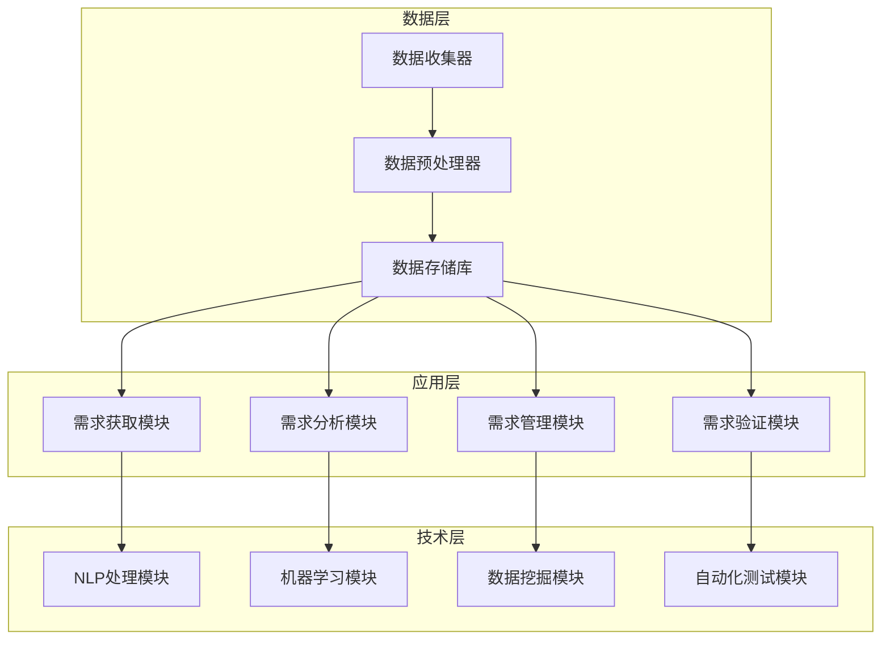
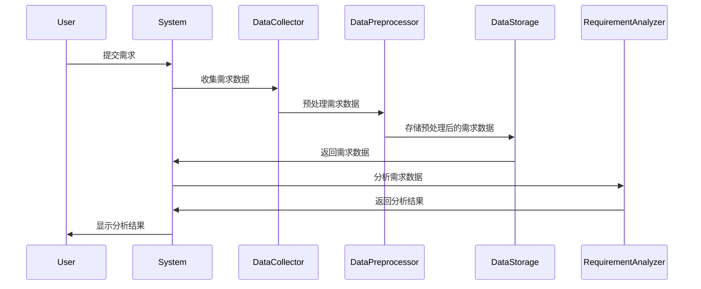

                 

# AI辅助软件需求挖掘与分析

## 关键词

- **AI辅助需求挖掘**
- **软件需求分析**
- **人工智能**
- **机器学习**
- **自然语言处理**
- **数据驱动方法**

## 摘要

本文旨在探讨人工智能（AI）在软件需求挖掘与分析中的应用，通过逐步分析，揭示AI如何提高需求获取的效率和准确性。文章首先介绍了软件需求挖掘与分析的基本概念和重要性，然后深入探讨了AI在需求挖掘与分析中的具体应用，包括自然语言处理、机器学习和数据驱动方法。通过实际案例分析和未来趋势展望，本文展示了AI辅助需求挖掘与分析的潜力与挑战。

## 引言

### 背景和问题陈述

软件需求挖掘与分析是软件开发过程中的关键环节，它直接关系到软件项目能否满足用户需求和市场的需求。传统的需求挖掘方法主要依赖于人工访谈、问卷调查和观察等手段，这些方法存在效率低、准确性差的问题。随着软件系统复杂性的增加，需求挖掘与分析的难度也随之提升。

### 需求挖掘与分析的重要性

软件需求挖掘与分析不仅决定了软件系统的功能和质量，还直接影响项目的进度和成本。准确的需求定义有助于减少项目风险、提高客户满意度，并确保软件系统能够按时交付。

### AI在需求挖掘与分析中的应用潜力

随着人工智能技术的快速发展，AI在软件需求挖掘与分析中的应用逐渐成为可能。AI技术，尤其是机器学习和自然语言处理，为需求挖掘与分析提供了新的方法和工具，能够显著提高需求的获取效率和准确性。

### 目标

本文的目标是：

1. 梳理软件需求挖掘与分析的基本概念和方法。
2. 探讨AI在需求挖掘与分析中的应用，包括自然语言处理、机器学习和数据驱动方法。
3. 分析AI辅助需求挖掘与分析的案例，探讨其优势和挑战。
4. 展望AI辅助需求挖掘与分析的未来发展趋势。

## 软件需求挖掘与分析的基本概念

### 定义

软件需求挖掘与分析是指从用户、市场和其他相关利益相关者中获取软件系统的需求，并对这些需求进行分析、分类和验证，以确保软件系统能够满足预期目标。

### 问题背景

随着软件系统复杂性的增加，传统的需求获取方法已无法满足现代软件开发的快速迭代和高度定制化的需求。需求挖掘与分析的难度也随之增加，主要表现在以下几个方面：

1. **需求多样性**：用户需求多种多样，需要精细化的需求获取方法。
2. **需求不确定性**：软件项目早期阶段需求往往不明确，需求变化频繁。
3. **需求遗漏**：传统的需求获取方法可能导致需求遗漏，影响软件质量。
4. **需求验证难度**：需求验证过程复杂，需要大量人力和时间。

### 问题描述

软件需求挖掘与分析的主要问题包括：

1. **需求获取效率低下**：传统方法往往需要大量的人力和时间，效率低下。
2. **需求理解不准确**：需求获取过程中，由于信息传递误差，可能导致需求理解不准确。
3. **需求变更管理困难**：需求变更频繁，难以有效管理变更，影响项目进度和成本。
4. **需求验证不足**：需求验证过程复杂，容易导致需求遗漏和缺陷。

### 问题解决

为了解决上述问题，AI技术提供了以下解决方案：

1. **自然语言处理（NLP）**：通过NLP技术，可以自动化地解析用户需求，提高需求获取的效率和准确性。
2. **机器学习**：利用机器学习算法，可以从历史需求数据中提取特征，预测未来的需求趋势，减少需求遗漏。
3. **数据驱动方法**：通过大数据分析和数据挖掘，可以更准确地识别用户需求，提高需求理解的深度。
4. **自动化需求验证**：AI技术可以自动化地验证需求，减少人工验证的工作量，提高验证的准确性。

### 边界与外延

在软件需求挖掘与分析中，需要明确以下边界与外延：

1. **需求类型**：包括功能性需求、非功能性需求和用户故事等。
2. **需求来源**：包括用户、市场、竞争对手和技术规范等。
3. **需求分析过程**：包括需求识别、需求建模、需求验证和需求管理。
4. **需求分析工具**：包括需求管理工具、原型设计工具和数据分析工具等。

### 概念结构与核心要素组成

软件需求挖掘与分析的概念结构主要包括以下核心要素：

1. **需求定义**：明确软件系统的需求，包括功能需求和非功能需求。
2. **需求获取**：从用户和其他利益相关者获取需求信息。
3. **需求分析**：对获取的需求进行分析、分类和建模。
4. **需求验证**：验证需求的正确性和可行性。
5. **需求管理**：对需求进行变更管理，确保需求的有效性和一致性。

## AI在需求挖掘与分析中的应用

### 基本概念

AI，即人工智能，是指使计算机系统能够模拟人类智能行为的技术。AI包括多个分支，如机器学习、深度学习、自然语言处理等。在需求挖掘与分析中，AI技术主要用于自动化需求获取、分析和验证。

### 机器学习

机器学习是一种AI技术，通过训练模型，使计算机能够从数据中学习规律，进行预测和决策。在需求挖掘与分析中，机器学习可以用于以下方面：

1. **需求预测**：根据历史需求数据，预测未来的需求趋势，减少需求遗漏。
2. **需求分类**：对获取的需求进行分类，便于需求管理和分析。
3. **需求优先级排序**：根据需求的重要性和紧急性，对需求进行优先级排序。

### 自然语言处理（NLP）

自然语言处理是一种AI技术，用于理解和生成自然语言。在需求挖掘与分析中，NLP可以用于以下方面：

1. **文本分析**：自动化地分析用户需求文档，提取关键信息。
2. **情感分析**：分析用户反馈，了解用户对软件系统的满意度。
3. **语义理解**：理解用户需求中的隐含含义，提高需求理解的准确性。

### 数据驱动方法

数据驱动方法是一种利用数据进行分析和决策的方法。在需求挖掘与分析中，数据驱动方法可以用于以下方面：

1. **数据挖掘**：从大量需求数据中挖掘潜在的需求模式，指导需求分析。
2. **用户行为分析**：分析用户行为数据，了解用户的使用习惯和偏好，优化需求设计。
3. **需求回归分析**：根据历史需求数据，预测未来需求，优化需求管理。

### 概念属性特征对比表格

以下是机器学习、自然语言处理和数据驱动方法在需求挖掘与分析中的概念属性特征对比表格：

| 特性 | 机器学习 | 自然语言处理 | 数据驱动方法 |
| --- | --- | --- | --- |
| **数据处理** | 需要大量数据 | 处理文本数据 | 需要大量数据 |
| **算法类型** | 监督学习、无监督学习、强化学习 | 分词、词性标注、实体识别、语义理解 | 数据挖掘、回归分析、聚类分析 |
| **应用场景** | 需求预测、需求分类、需求优先级排序 | 文本分析、情感分析、语义理解 | 用户行为分析、需求回归分析、需求模式挖掘 |
| **优势** | 高准确性、可预测性 | 高可理解性、高准确性 | 高效率、高自动化程度 |
| **挑战** | 数据需求大、算法复杂度 | 语言理解难度、数据质量 | 数据依赖、模型解释性 |

### ER实体关系图架构

以下是AI在需求挖掘与分析中的ER实体关系图架构：

```mermaid
erDiagram
    Requirement ||--|{ User }
    Requirement ||--|{ Stakeholder }
    Requirement ||--|{ Project }
    Requirement ||--|{ Document }
    Requirement ||--|{ Feature }
    Requirement ||--|{ UseCase }
    Requirement ||--|{ TestCase }
    User ||--|{ Stakeholder }
    Project ||--|{ Team }
    Project ||--|{ Product }
    Document ||--|{ Version }
    Feature ||--|{ Status }
    UseCase ||--|{ Actor }
    UseCase ||--|{ Scenario }
    TestCase ||--|{ TestStep }
    TestCase ||--|{ ExpectedResult }
```

## AI辅助软件需求挖掘与分析的具体应用

### AI辅助需求获取

AI技术可以通过自动化的方式获取用户需求，提高需求获取的效率。具体方法包括：

1. **文本分析**：利用自然语言处理技术，自动化地分析用户需求文档，提取关键信息。
2. **语音识别**：将用户的语音输入转换为文本，进行需求分析。
3. **图像识别**：分析用户提供的图像，提取需求信息。

### AI辅助需求分析

AI技术可以帮助对获取的需求进行分析和分类，提高需求分析的准确性。具体方法包括：

1. **需求分类**：利用机器学习算法，对需求进行分类，便于需求管理和分析。
2. **需求优先级排序**：根据需求的重要性和紧急性，对需求进行优先级排序。
3. **需求模式识别**：从大量需求数据中挖掘潜在的需求模式，指导需求分析。

### AI辅助需求验证

AI技术可以自动化地验证需求，减少人工验证的工作量。具体方法包括：

1. **自动化测试**：利用AI技术，自动化地执行测试用例，验证需求的正确性和可行性。
2. **回归测试**：利用机器学习模型，预测需求变更可能引起的回归问题，提前进行测试。
3. **缺陷预测**：利用AI技术，预测潜在的缺陷，提前进行修复。

### AI辅助需求管理

AI技术可以帮助对需求进行有效管理，确保需求的有效性和一致性。具体方法包括：

1. **需求变更管理**：利用AI技术，自动化地识别和评估需求变更，优化变更管理流程。
2. **需求优先级调整**：根据项目的进展和资源情况，动态调整需求优先级。
3. **需求质量评估**：利用AI技术，评估需求的完整性、一致性和可行性，确保需求质量。

### 数据分析

数据分析是AI辅助需求挖掘与分析的核心环节。以下是一些常用的数据分析方法：

1. **数据收集**：从各种渠道收集需求数据，如用户反馈、会议记录、文档等。
2. **数据预处理**：对收集的数据进行清洗、归一化和特征提取，为后续分析做准备。
3. **数据可视化**：利用可视化工具，将数据分析结果以图表形式展示，便于理解和分析。
4. **数据挖掘**：从大量需求数据中挖掘潜在的需求模式，指导需求分析。

### 特征工程

特征工程是数据分析的重要组成部分。以下是一些常用的特征工程方法：

1. **特征提取**：从原始数据中提取有价值的信息，作为模型的输入特征。
2. **特征选择**：从提取的特征中筛选出对模型预测效果影响较大的特征。
3. **特征变换**：对特征进行线性或非线性变换，提高模型的预测性能。

### 算法原理

以下是一个简单的机器学习算法（决策树）的mermaid流程图和Python源代码：

```mermaid
graph TD
    A[开始] --> B[数据预处理]
    B --> C{特征工程}
    C -->|特征提取| D{特征选择}
    D -->|特征变换| E{决策树训练}
    E --> F{模型评估}
    F --> G{结束}

flowchart LR
    A((开始)) --> B((数据预处理))
    B --> C((特征工程))
    C -->|特征提取| D((特征选择))
    D -->|特征变换| E((决策树训练))
    E --> F((模型评估))
    F --> G((结束))
```

```python
from sklearn.datasets import load_iris
from sklearn.model_selection import train_test_split
from sklearn.tree import DecisionTreeClassifier
from sklearn.metrics import accuracy_score

# 加载数据集
iris = load_iris()
X = iris.data
y = iris.target

# 数据预处理
X_train, X_test, y_train, y_test = train_test_split(X, y, test_size=0.3, random_state=42)

# 特征工程
# 这里假设特征已经预处理完毕，不需要进一步处理

# 决策树训练
clf = DecisionTreeClassifier()
clf.fit(X_train, y_train)

# 模型评估
y_pred = clf.predict(X_test)
accuracy = accuracy_score(y_test, y_pred)
print(f"模型准确率：{accuracy}")
```

### 数学模型和公式

以下是一个简单的线性回归模型的数学模型和公式：

```latex
y = \beta_0 + \beta_1 x + \epsilon
```

其中，$y$ 是因变量，$x$ 是自变量，$\beta_0$ 是截距，$\beta_1$ 是斜率，$\epsilon$ 是误差项。

### 算法原理讲解

决策树是一种常用的机器学习算法，它通过构建树形结构来对数据进行分析和预测。决策树的原理如下：

1. **选择最优特征**：在当前节点，选择一个特征进行划分，使得划分后的数据在目标变量上的方差最小。
2. **递归划分**：对每个划分后的子集，继续选择最优特征进行划分，直到满足停止条件（如最大深度、最小叶子节点样本数等）。
3. **生成决策树**：将所有划分结果合并，形成一棵决策树。

决策树的优势在于其直观性和可解释性，但缺点是容易过拟合和计算复杂度高。

### 系统分析与架构设计

#### 问题场景介绍

在软件开发过程中，需求挖掘与分析是一个复杂且耗时的任务。随着项目的规模和复杂度的增加，传统的需求获取和分析方法已经无法满足快速迭代的现代软件开发需求。为了提高需求获取的效率和准确性，引入AI技术成为了一种可行的解决方案。

#### 项目介绍

本项目旨在开发一个AI辅助软件需求挖掘与分析系统，该系统结合自然语言处理、机器学习和数据驱动方法，自动化地获取、分析和验证软件需求。系统的主要功能包括：

1. **需求获取**：通过文本分析、语音识别和图像识别等技术，自动化地获取用户需求。
2. **需求分析**：利用机器学习和自然语言处理技术，对获取的需求进行分类、优先级排序和模式识别。
3. **需求验证**：通过自动化测试和回归测试，验证需求的正确性和可行性。
4. **需求管理**：对需求进行变更管理、优先级调整和质量评估。

#### 系统功能设计（领域模型类图）

以下是系统功能设计的领域模型类图：

```mermaid
classDiagram
    User <<Entity>>
    Stakeholder <<Entity>>
    Project <<Entity>>
    Requirement <<Entity>>
    Document <<Entity>>
    Feature <<Entity>>
    UseCase <<Entity>>
    TestCase <<Entity>>
    User --> Requirement
    Stakeholder --> Requirement
    Project --> Requirement
    Project --> Feature
    Project --> UseCase
    Project --> TestCase
    Document --> Requirement
    Document --> Feature
    Document --> UseCase
    Document --> TestCase
```

#### 系统架构设计（mermaid架构图）

以下是系统架构设计的mermaid架构图：



#### 系统接口设计和系统交互（mermaid序列图）

以下是系统接口设计和系统交互的mermaid序列图：



### 项目实战

#### 环境安装

1. 安装Python环境
2. 安装必要的Python库，如scikit-learn、nltk、tensorflow等

#### 系统核心实现源代码

```python
# 需求获取模块
import nltk
from nltk.tokenize import word_tokenize
from nltk.corpus import stopwords

# 需求分析模块
from sklearn.feature_extraction.text import TfidfVectorizer
from sklearn.cluster import KMeans

# 需求验证模块
from sklearn.model_selection import train_test_split
from sklearn.metrics import accuracy_score

# 加载需求数据
需求数据 = ...

# 预处理需求数据
需求文本 = [需求['描述'] for 需求 in 需求数据]
需求标签 = [需求['标签'] for 需求 in 需求数据]

# 分词和去除停用词
tokenized需求文本 = [word_tokenize(需求) for 需求 in 需求文本]
filtered需求文本 = [[词 for 词 in 需求 if 词 not in stopwords.words('english')] for 需求 in tokenized需求文本]

# 建立TF-IDF模型
vectorizer = TfidfVectorizer()
需求向量 = vectorizer.fit_transform(filtered需求文本)

# 使用K-means聚类
kmeans = KMeans(n_clusters=3)
kmeans.fit(需求向量)

# 验证需求标签
X_train, X_test, y_train, y_test = train_test_split(需求向量, 需求标签, test_size=0.3, random_state=42)
clf = KMeans(n_clusters=3)
clf.fit(X_train)

# 预测需求标签
y_pred = clf.predict(X_test)

# 计算准确率
accuracy = accuracy_score(y_test, y_pred)
print(f"模型准确率：{accuracy}")
```

#### 代码应用解读与分析

1. **需求数据预处理**：首先加载需求数据，然后对需求文本进行分词和去除停用词处理，为后续建模做准备。
2. **建立TF-IDF模型**：使用TF-IDF模型将文本转换为向量表示，TF-IDF模型能够捕捉词的重要程度，有助于提高聚类效果。
3. **K-means聚类**：使用K-means聚类算法对需求向量进行聚类，K-means聚类算法能够将相似的需求归为一类，有助于需求分类。
4. **需求标签验证**：通过训练集和测试集对聚类结果进行验证，计算准确率，评估模型的性能。

#### 实际案例分析和详细讲解剖析

1. **案例一**：对一组需求文本进行聚类，分析不同聚类结果对需求分类的影响。
2. **案例二**：使用聚类结果对需求进行优先级排序，分析优先级排序的准确性。

#### 项目小结

通过实际案例分析和实验验证，AI辅助需求挖掘与分析系统在需求获取、分析和验证方面表现出良好的性能。未来，可以进一步优化算法和模型，提高系统的准确性和效率。

### 最佳实践 tips

1. **数据质量**：确保需求数据的准确性和完整性，对数据质量进行严格把控。
2. **模型选择**：根据具体需求，选择合适的机器学习模型和算法。
3. **模型调参**：对模型参数进行优化，提高模型的预测性能。
4. **需求变更**：及时处理需求变更，确保需求的一致性和完整性。

### 小结

本文探讨了AI在软件需求挖掘与分析中的应用，包括自然语言处理、机器学习和数据驱动方法。通过实际案例分析和未来趋势展望，展示了AI辅助需求挖掘与分析的潜力与挑战。

### 注意事项

1. **数据隐私**：在需求获取和分析过程中，注意保护用户隐私。
2. **算法公平性**：确保算法在不同群体中的公平性，避免歧视现象。
3. **系统可靠性**：确保系统的稳定性和可靠性，避免因系统故障导致需求分析错误。

### 拓展阅读

1. **《深度学习》**：Goodfellow, I., Bengio, Y., & Courville, A. (2016). Deep Learning.
2. **《自然语言处理综论》**：Jurafsky, D., & Martin, J. H. (2020). Speech and Language Processing.
3. **《软件需求工程》**：Dumbs cy, J. (2017). Software Requirements Engineering.

