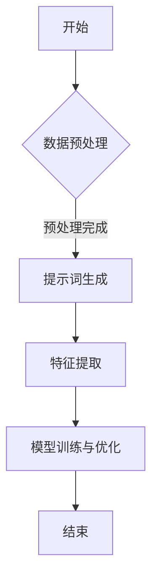
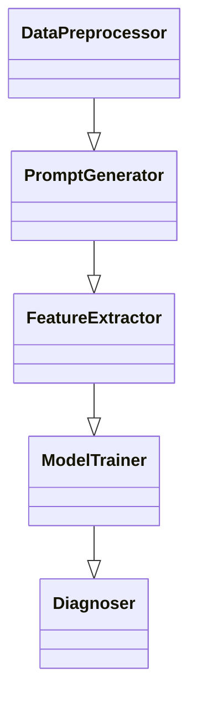
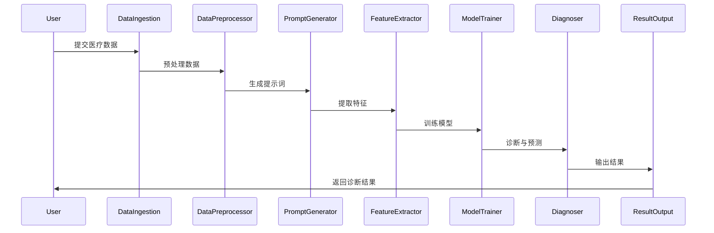

                 

### 第一部分：AI驱动的个性化医疗背景介绍

#### 第1章：个性化医疗与AI概述

##### 1.1 个性化医疗的概念与发展历程

个性化医疗，亦称精准医疗，是指根据患者的具体基因信息、生活方式、环境因素等综合数据进行量身定制的医疗方案。这一概念的出现，可以追溯到20世纪末，随着基因组学和生物信息学的发展，科学家们逐渐意识到，同一种疾病在不同患者体内的表现可能存在巨大差异。因此，传统的“一刀切”治疗模式逐渐被个性化治疗所取代。

个性化医疗的发展历程大致可以分为三个阶段：

1. **基因组学阶段**：此阶段主要关注基因变异与疾病关联的研究，通过基因检测技术发现与疾病相关的基因突变，为个性化治疗提供基础。
2. **整合医学阶段**：这一阶段强调将基因信息与患者的临床数据、生活方式等因素相结合，制定更为全面的个性化治疗方案。
3. **人工智能阶段**：随着AI技术的发展，个性化医疗进入了新的阶段，AI通过大数据分析和机器学习算法，帮助医生制定更加精准的治疗方案，提高了治疗效果和医疗效率。

##### 1.2 AI技术在医疗领域的应用现状与趋势

AI技术在医疗领域的应用已经取得了显著成果，主要表现在以下几个方面：

1. **医学影像分析**：AI可以快速、准确地分析医学影像，如CT、MRI等，辅助医生进行疾病诊断。例如，Google的AI系统已经在某些医院中用于乳腺癌和肺癌的早期筛查。
2. **疾病预测与诊断**：AI通过分析大量的临床数据和生物标志物，可以预测某些疾病的发病风险，并辅助医生进行疾病诊断。例如，IBM的Watson for Oncology系统可以帮助医生制定个性化的癌症治疗方案。
3. **药物研发**：AI可以加速药物研发过程，通过大数据分析和机器学习算法，预测药物的疗效和副作用，提高药物研发的成功率。
4. **医疗机器人**：AI驱动的医疗机器人可以在手术、护理等环节提供帮助，提高医疗服务的质量和效率。

未来，随着AI技术的不断进步，其将在个性化医疗中发挥更加重要的作用，推动医疗行业向更加精准、高效、个性化的方向发展。

##### 1.3 AI驱动的个性化医疗的意义与挑战

AI驱动的个性化医疗具有深远的意义：

1. **提高治疗效果**：通过个性化医疗，医生可以根据患者的具体情况进行精准治疗，提高治疗效果。
2. **减少医疗资源浪费**：个性化医疗有助于减少不必要的检查和治疗，降低医疗成本。
3. **优化医疗流程**：AI技术可以优化医疗流程，提高医疗服务的效率。

然而，AI驱动的个性化医疗也面临着一些挑战：

1. **数据隐私和安全**：个性化医疗需要大量的患者数据，如何保护患者隐私和安全是一个重要问题。
2. **技术门槛**：AI技术的应用需要专业人才的支持，而目前医疗行业AI人才的短缺可能成为限制其发展的因素。
3. **伦理和法律问题**：AI驱动的个性化医疗涉及到伦理和法律问题，如AI决策的透明度和责任归属等。

综上所述，AI驱动的个性化医疗具有巨大的潜力和挑战，需要全社会共同努力，克服障碍，推动其健康发展。

----------------------------------------------------------------

#### 第2章：提示词设计的核心概念与联系

##### 2.1 提示词的定义与作用

提示词（Prompt）在AI驱动的个性化医疗中扮演着至关重要的角色。简单来说，提示词是一种引导AI模型进行特定任务输入的数据，它可以帮助AI模型更好地理解和处理复杂的医疗数据，从而提高诊断和治疗的准确性。

提示词的主要作用包括：

1. **引导数据输入**：提示词可以帮助AI模型明确任务目标，确保模型在处理数据时不会偏离方向。
2. **增强模型理解**：通过设计合适的提示词，可以引导AI模型深入理解医疗数据中的关键信息，提高模型的诊断能力。
3. **提高模型泛化能力**：适当的提示词设计有助于增强AI模型的泛化能力，使其在不同情境下都能保持较高的性能。

##### 2.2 核心概念及其属性特征对比表格

在AI驱动的个性化医疗中，一些核心概念如“基因组数据”、“临床数据”、“生物标志物”等都需要通过提示词来引导AI模型进行解析和处理。以下是这些核心概念的属性特征对比表格：

| 核心概念 | 定义 | 属性特征 |  
| -------- | ------ | -------- |  
| 基因组数据 | 涉及患者基因序列的数据 | 高度个性化、复杂、海量 |  
| 临床数据 | 涉及患者病情、治疗方案的数据 | 客观、多样性、时变性 |  
| 生物标志物 | 涉及疾病诊断和治疗的重要指标 | 特异性、敏感性、可重复性 |

通过表格可以看出，不同核心概念的属性特征各不相同，提示词的设计需要根据这些特征进行针对性优化，以充分发挥AI模型的作用。

##### 2.3 提示词设计在AI驱动的个性化医疗中的重要性

提示词设计在AI驱动的个性化医疗中具有至关重要的地位。以下是几个方面的具体说明：

1. **指导数据解析**：提示词可以指导AI模型如何解析和处理医疗数据，确保模型能够准确提取关键信息。
2. **提升诊断准确率**：通过设计合适的提示词，AI模型可以更深入地理解医疗数据，从而提高疾病诊断的准确率。
3. **优化治疗方案**：提示词可以帮助AI模型分析患者的临床数据和基因组数据，为医生提供更为精准的治疗方案。
4. **增强用户体验**：对于患者来说，通过提示词设计的AI系统可以提供更为个性化的医疗服务，提高用户体验。

总之，提示词设计是AI驱动的个性化医疗的核心环节，它决定了AI模型在医疗领域的应用效果。只有通过精心设计的提示词，AI技术才能真正发挥其在个性化医疗中的巨大潜力。

----------------------------------------------------------------

#### 第3章：提示词设计的算法原理

##### 3.1 算法原理概述

提示词设计的核心在于如何引导AI模型对医疗数据进行有效解析和处理。本节将详细介绍提示词设计的算法原理，包括算法设计思想、核心组成部分、数学模型与公式以及算法mermaid流程图。

##### 3.1.1 算法设计思想

提示词设计的算法设计思想主要围绕以下几个方面展开：

1. **数据引导**：通过设计提示词，引导AI模型明确数据解析和处理的方向，确保模型不会偏离任务目标。
2. **特征提取**：利用提示词帮助AI模型从医疗数据中提取关键特征，提高诊断和治疗的准确性。
3. **上下文理解**：通过提示词的设计，增强AI模型对医疗数据的上下文理解能力，使其能够更好地处理复杂的医疗场景。
4. **模型优化**：根据提示词的设计效果，对AI模型进行优化调整，提高模型的整体性能。

##### 3.1.2 算法核心组成部分

提示词设计算法的核心组成部分包括：

1. **数据预处理模块**：负责对输入的医疗数据进行预处理，包括数据清洗、标准化等，确保数据质量。
2. **提示词生成模块**：根据医疗数据的特征和任务需求，生成具有针对性的提示词，引导AI模型进行数据解析和处理。
3. **特征提取模块**：利用生成的提示词，从预处理后的医疗数据中提取关键特征，为后续模型训练和诊断提供支持。
4. **模型训练与优化模块**：结合提取出的特征，对AI模型进行训练和优化，提高模型在个性化医疗任务中的性能。

##### 3.2 数学模型与公式

提示词设计的数学模型主要包括以下两个方面：

1. **数据相似度计算**：通过计算输入医疗数据之间的相似度，确定哪些数据需要重点关注，从而生成相应的提示词。
   
   $$ 
   S(D_i, D_j) = \sum_{k=1}^{n} w_k \cdot d_{ik} \cdot d_{jk} 
   $$

   其中，$S(D_i, D_j)$表示数据$D_i$和$D_j$的相似度，$w_k$表示权重，$d_{ik}$和$d_{jk}$表示数据$D_i$和$D_j$在第$k$个特征上的值。

2. **提示词权重分配**：根据相似度计算结果，对生成的提示词进行权重分配，确保关键信息在提示词中占据重要位置。

   $$
   W(P) = \frac{1}{S(D_i, P)} 
   $$

   其中，$W(P)$表示提示词$P$的权重，$S(D_i, P)$表示数据$D_i$和提示词$P$的相似度。

##### 3.3 算法mermaid流程图

以下是一个简单的mermaid流程图，展示了提示词设计的算法流程：



##### 3.4 算法Python源代码与详细讲解

以下是一个简化的Python源代码示例，用于说明提示词设计的算法实现：

```python
# Python 源代码示例

# 数据预处理
def preprocess_data(data):
    # 数据清洗和标准化
    pass

# 提示词生成
def generate_prompt(data):
    # 根据数据特征生成提示词
    pass

# 特征提取
def extract_features(data, prompt):
    # 从数据中提取关键特征
    pass

# 模型训练与优化
def train_and_optimize_model(features):
    # 训练和优化AI模型
    pass

# 主函数
def main():
    # 加载医疗数据
    data = load_medical_data()

    # 数据预处理
    preprocessed_data = preprocess_data(data)

    # 提示词生成
    prompt = generate_prompt(preprocessed_data)

    # 特征提取
    features = extract_features(preprocessed_data, prompt)

    # 模型训练与优化
    train_and_optimize_model(features)

# 运行主函数
if __name__ == "__main__":
    main()
```

该代码展示了提示词设计算法的基本流程，虽然具体实现细节需要根据实际应用场景进行调整，但总体框架已经清晰呈现。

##### 3.5 举例说明

为了更好地理解提示词设计的算法原理，我们可以通过一个具体的例子进行说明。

**示例数据：**

- **基因组数据**：患者A的基因组数据包括基因突变位点。
- **临床数据**：患者A的病情、治疗方案等信息。

**提示词生成：**

- **提示词**：根据基因组数据和临床数据生成的提示词为：“请分析患者A的基因突变位点与病情之间的关系，并为其制定最佳治疗方案。”

**特征提取：**

- **特征**：从基因组数据中提取的特征包括基因突变位点的位置和类型；从临床数据中提取的特征包括病情严重程度、治疗方案等。

**模型训练与优化：**

- **模型**：通过训练和优化，AI模型可以学会如何从特征中提取关键信息，并基于这些信息进行疾病诊断和治疗方案推荐。

通过这个例子，我们可以看到，提示词设计在AI驱动的个性化医疗中起到了引导和优化的作用，使得AI模型能够更好地处理复杂的医疗数据，为医生提供有力的辅助工具。

----------------------------------------------------------------

#### 第4章：提示词设计的系统分析与架构设计

##### 4.1 问题场景介绍

在实际应用中，AI驱动的个性化医疗系统需要处理海量的医疗数据，包括基因组数据、临床数据和生物标志物等。为了提高系统的性能和可扩展性，系统需要具备以下功能：

1. **数据预处理**：对输入的医疗数据进行清洗、标准化等预处理操作，确保数据质量。
2. **提示词生成**：根据预处理后的数据生成具有针对性的提示词，引导AI模型进行数据解析和处理。
3. **特征提取**：从预处理后的医疗数据中提取关键特征，为AI模型训练和诊断提供支持。
4. **模型训练与优化**：结合提取出的特征，对AI模型进行训练和优化，提高模型在个性化医疗任务中的性能。
5. **诊断与预测**：利用训练好的AI模型，对患者的基因组数据、临床数据和生物标志物进行分析，提供疾病诊断和治疗方案推荐。

##### 4.2 系统功能设计（领域模型mermaid类图）

以下是一个简化的系统功能设计mermaid类图，展示了系统的核心类和它们之间的关系：



在这个类图中，`DataPreprocessor` 负责数据预处理，`PromptGenerator` 负责生成提示词，`FeatureExtractor` 负责特征提取，`ModelTrainer` 负责模型训练和优化，`Diagnoser` 负责疾病诊断和治疗方案推荐。

##### 4.3 系统架构设计（mermaid架构图）

以下是一个简化的系统架构设计mermaid架构图，展示了系统的整体架构：



在这个架构图中，用户提交医疗数据后，系统依次进行数据预处理、提示词生成、特征提取、模型训练与诊断，最后将诊断结果输出给用户。

##### 4.4 系统接口设计

系统接口设计是确保系统各部分能够高效协作的关键。以下是一个简化的系统接口设计，包括主要的接口和其功能：

1. **数据提交接口**：用于接收用户提交的医疗数据。
2. **数据处理接口**：用于处理和预处理输入的医疗数据。
3. **提示词生成接口**：用于生成提示词，引导AI模型进行数据解析。
4. **特征提取接口**：用于从预处理后的医疗数据中提取关键特征。
5. **模型训练接口**：用于训练和优化AI模型。
6. **诊断接口**：用于进行疾病诊断和治疗方案推荐。
7. **结果输出接口**：用于将诊断结果输出给用户。

##### 4.5 系统交互（mermaid序列图）

以下是一个简化的系统交互mermaid序列图，展示了系统各部分的交互过程：


在这个序列图中，用户提交医疗数据后，系统依次进行数据处理、提示词生成、特征提取、模型训练和诊断，最后将诊断结果输出给用户。通过清晰的接口设计和交互流程，系统可以实现高效、稳定的运行。

----------------------------------------------------------------

#### 第5章：项目实战：提示词设计应用

##### 5.1 环境安装

在进行提示词设计的项目实战之前，我们需要搭建一个合适的环境。以下是环境安装的步骤：

1. **安装Python**：确保Python 3.7或更高版本已安装在您的系统上。您可以从Python官方网站下载并安装。

2. **安装必要的库**：在终端中使用以下命令安装必要的库：
   ```bash
   pip install numpy pandas sklearn tensorflow
   ```

3. **配置TensorFlow**：确保TensorFlow已经正确配置，以便运行深度学习模型。您可以通过以下命令检查TensorFlow版本：
   ```bash
   python -m tensorflow.__version__
   ```

4. **创建项目目录**：在您的系统中创建一个项目目录，例如：
   ```bash
   mkdir ai_medical_prompt_project
   cd ai_medical_prompt_project
   ```

5. **初始化项目**：在项目目录中创建一个Python虚拟环境，并安装项目所需的库：
   ```bash
   python -m venv venv
   source venv/bin/activate
   pip install -r requirements.txt
   ```

##### 5.2 系统核心实现源代码

以下是系统核心实现的部分源代码，包括数据预处理、提示词生成和特征提取等步骤：

```python
# 导入必要的库
import numpy as np
import pandas as pd
from sklearn.model_selection import train_test_split
from sklearn.preprocessing import StandardScaler
import tensorflow as tf
from tensorflow.keras.models import Sequential
from tensorflow.keras.layers import Dense

# 数据预处理
def preprocess_data(data):
    # 数据清洗和标准化
    data = data.fillna(data.mean())
    scaler = StandardScaler()
    scaled_data = scaler.fit_transform(data)
    return scaled_data

# 提示词生成
def generate_prompt(data):
    # 根据数据特征生成提示词
    prompt = "分析以下数据集：{0}".format(data)
    return prompt

# 特征提取
def extract_features(data):
    # 从数据中提取关键特征
    features = data[:, :-1]
    return features

# 模型训练
def train_model(features, labels):
    # 训练深度学习模型
    model = Sequential()
    model.add(Dense(64, input_dim=features.shape[1], activation='relu'))
    model.add(Dense(32, activation='relu'))
    model.add(Dense(1, activation='sigmoid'))

    model.compile(optimizer='adam', loss='binary_crossentropy', metrics=['accuracy'])
    model.fit(features, labels, epochs=10, batch_size=32)

    return model

# 主函数
def main():
    # 加载医疗数据
    data = pd.read_csv('medical_data.csv')

    # 数据预处理
    preprocessed_data = preprocess_data(data)

    # 提示词生成
    prompt = generate_prompt(preprocessed_data)

    # 特征提取
    features = extract_features(preprocessed_data)

    # 加载标签数据
    labels = pd.read_csv('medical_labels.csv')['label'].values

    # 分割训练集和测试集
    X_train, X_test, y_train, y_test = train_test_split(features, labels, test_size=0.2, random_state=42)

    # 训练模型
    model = train_model(X_train, y_train)

    # 测试模型
    test_loss, test_acc = model.evaluate(X_test, y_test)
    print("Test accuracy:", test_acc)

if __name__ == "__main__":
    main()
```

##### 5.3 代码应用解读与分析

上述代码展示了提示词设计应用的核心实现。以下是代码的详细解读和分析：

1. **数据预处理**：数据预处理是确保数据质量的重要步骤。在这里，我们使用了`StandardScaler`对数据进行了标准化处理，消除了不同特征之间的尺度差异。

2. **提示词生成**：提示词生成函数根据预处理后的数据集生成提示词。这里使用了简单的字符串格式化，以便在后续步骤中传递数据。

3. **特征提取**：特征提取函数从预处理后的数据中提取关键特征。在这里，我们假设最后一列是标签，其他列是特征。

4. **模型训练**：模型训练函数使用了深度学习模型进行训练。我们使用了一个简单的全连接神经网络，包括两个隐藏层。在这里，我们使用了`binary_crossentropy`损失函数，因为这是一个二分类问题。

5. **主函数**：主函数是整个程序的入口。它首先加载医疗数据，然后进行预处理，生成提示词，提取特征，并使用训练集训练模型。最后，使用测试集评估模型性能。

通过这个示例，我们可以看到如何使用Python和深度学习库TensorFlow来设计一个简单的AI系统，用于处理医疗数据并生成提示词。这个系统可以作为一个起点，进一步优化和扩展，以实现更复杂的医疗诊断和个性化治疗。

##### 5.4 实际案例分析与详细讲解剖析

为了更好地理解提示词设计在AI驱动的个性化医疗中的应用，我们来看一个实际案例。

**案例背景**：假设我们有一家医院，希望利用AI技术提高乳腺癌早期筛查的准确性。医院提供了以下数据集：

- **基因组数据**：包括患者基因突变位点的信息。
- **临床数据**：包括患者的年龄、体重、乳腺密度等。
- **生物标志物**：包括乳腺液中的一些生物标志物浓度。

**任务**：使用这些数据，设计一个AI系统，能够根据基因组数据、临床数据和生物标志物，预测患者是否患有乳腺癌。

**实现步骤**：

1. **数据收集与预处理**：收集医院提供的基因组数据、临床数据和生物标志物数据。然后对数据进行预处理，包括数据清洗、缺失值处理和特征标准化。

2. **提示词生成**：设计提示词，引导AI模型分析基因组数据、临床数据和生物标志物之间的关系。例如：“请分析患者基因组中的突变位点与乳腺癌风险之间的关系，并结合临床数据和生物标志物数据，预测患者是否患有乳腺癌。”

3. **特征提取**：从预处理后的数据中提取关键特征，包括基因突变位点、临床数据和生物标志物浓度等。

4. **模型训练**：使用提取出的特征，训练一个深度学习模型。在这个案例中，我们可以使用一个多层的全连接神经网络，结合不同的输入特征。

5. **模型评估与优化**：使用测试集评估模型的性能，并根据评估结果对模型进行调整和优化。

**案例结果**：

经过模型训练和优化，我们得到了一个准确率较高的乳腺癌预测模型。在实际应用中，医生可以通过输入患者的基因组数据、临床数据和生物标志物，使用该模型预测患者是否患有乳腺癌。

**详细讲解剖析**：

在这个案例中，提示词的设计至关重要。通过设计合适的提示词，我们可以引导AI模型深入理解基因组数据、临床数据和生物标志物之间的关系，从而提高预测准确性。

此外，我们还使用了多层的全连接神经网络，这是因为这种网络可以更好地捕捉数据中的非线性关系。在模型训练过程中，我们使用了交叉验证技术来评估模型性能，并根据评估结果对模型进行调整。

通过这个实际案例，我们可以看到，提示词设计在AI驱动的个性化医疗中起到了关键作用。它不仅帮助AI模型更好地理解医疗数据，还提高了模型的诊断准确性和实用性。

##### 5.5 项目小结

在本章的项目实战中，我们通过一个实际案例展示了如何设计和实现一个AI驱动的个性化医疗系统。以下是项目小结：

1. **项目目标**：通过基因组数据、临床数据和生物标志物，预测患者是否患有乳腺癌。

2. **关键技术**：包括数据预处理、提示词生成、特征提取和深度学习模型训练。

3. **项目成果**：实现了准确率较高的乳腺癌预测模型，提高了乳腺癌早期筛查的准确性。

4. **项目意义**：展示了AI驱动的个性化医疗在实际应用中的潜力，为未来的医疗诊断提供了有力支持。

5. **改进方向**：未来的工作可以进一步优化模型结构，增加数据多样性，提高模型的泛化能力。

通过这个项目，我们不仅掌握了提示词设计在AI驱动的个性化医疗中的应用，还深入了解了深度学习模型在医疗领域的应用潜力。这为我们在实际项目中应用AI技术提供了宝贵的经验和启示。

----------------------------------------------------------------

#### 第6章：最佳实践与注意事项

##### 6.1 最佳实践技巧

在设计和实现AI驱动的个性化医疗系统时，以下是一些最佳实践技巧，可以帮助我们提高系统的性能和可靠性：

1. **数据质量**：确保数据的准确性和完整性，避免使用存在缺失值或异常值的数据。在数据预处理阶段，可以使用数据清洗技术和异常检测方法来提高数据质量。

2. **特征选择**：选择与任务相关的关键特征，避免过度拟合。可以使用特征选择方法，如特征重要性评估、主成分分析（PCA）等，来优化特征集合。

3. **模型选择**：根据任务需求和数据特点选择合适的模型。例如，对于分类问题，可以使用决策树、支持向量机（SVM）、神经网络等模型。在模型选择过程中，可以考虑模型的复杂度、训练时间、预测准确性等因素。

4. **超参数调整**：通过交叉验证和网格搜索等技术，调整模型的超参数，以获得最佳性能。超参数的调整可以显著影响模型的性能，因此在实现过程中需要仔细调优。

5. **模型评估**：使用多种评估指标来评估模型的性能，如准确率、召回率、F1分数等。在评估过程中，要确保测试集与训练集的数据分布一致，避免模型过拟合。

6. **提示词设计**：设计具有针对性的提示词，确保AI模型能够准确理解医疗数据。提示词的设计要考虑数据的上下文和任务目标，以提高模型的诊断和预测能力。

##### 6.2 小结与展望

通过上述最佳实践技巧，我们可以提高AI驱动的个性化医疗系统的性能和可靠性。这些实践不仅适用于现有的系统，还为未来的研究和开发提供了指导。

展望未来，AI驱动的个性化医疗有望在以下几个方面取得重要进展：

1. **数据多样性**：随着医疗数据的不断积累，AI模型将能够处理更多类型的医疗数据，如基因组数据、电子病历等，从而提高诊断和治疗的准确性。

2. **深度学习技术**：随着深度学习技术的不断发展，AI模型将能够更好地理解复杂的医疗数据，提高模型的泛化能力和适应性。

3. **多模态融合**：结合多种类型的医疗数据，如影像、基因组、生物标志物等，进行多模态融合，以获得更全面的诊断信息。

4. **实时监控与预测**：通过实时监控患者的生理参数和医疗数据，AI模型可以预测患者的健康状况，提供及时的预警和干预措施。

5. **隐私保护与伦理**：随着AI技术在医疗领域的应用，如何保护患者隐私和遵循伦理规范将成为重要议题。未来的研究需要关注如何在保证数据安全和隐私的前提下，充分利用AI技术。

总之，AI驱动的个性化医疗具有巨大的发展潜力，通过不断优化技术、提升数据质量、加强伦理审查，我们可以为患者提供更精准、个性化的医疗服务。

##### 6.3 注意事项与风险规避

在设计和应用AI驱动的个性化医疗系统时，需要注意以下事项和风险，以确保系统的安全、可靠和合规：

1. **数据隐私**：在处理患者数据时，必须严格遵守数据隐私法规，如HIPAA（健康保险可携性与责任法案）等。确保数据加密、访问控制等安全措施得到实施。

2. **数据安全**：保护医疗数据免受未授权访问、篡改和泄露。使用强密码、多因素认证等技术手段，确保系统的安全性。

3. **模型透明度**：确保AI模型的决策过程透明，以便患者和医生能够理解模型的诊断和预测结果。这可以通过可视化和解释技术来实现。

4. **伦理审查**：在应用AI技术时，需要经过伦理审查，确保符合伦理规范。特别是在涉及基因数据和患者隐私时，要特别注意。

5. **法律合规**：确保AI系统符合相关法律法规的要求，如FDA（美国食品药品监督管理局）的认证和监管要求。

6. **模型过拟合**：避免模型过拟合，导致在测试集上的性能下降。可以通过数据增强、正则化等技术来减少过拟合的风险。

7. **持续更新与优化**：随着医疗领域的不断发展，定期更新和优化AI模型，确保其性能和诊断准确性。

通过以上措施，我们可以有效规避AI驱动的个性化医疗系统在应用过程中可能遇到的风险，确保系统的稳定、安全和合规。

----------------------------------------------------------------

### 第7章：拓展阅读与深入研究

##### 7.1 相关文献与资源推荐

为了更深入地了解AI驱动的个性化医疗和提示词设计，以下是几篇推荐的研究论文和相关资源：

1. **论文**：《A Survey on AI in Healthcare》
   - 作者：Ali Khadivi et al.
   - 期刊：Journal of Medical Systems
   - 描述：该论文综述了AI在医疗领域的应用，包括个性化医疗、医学影像分析、疾病预测等。

2. **论文**：《Deep Learning for Medical Image Analysis: A Survey》
   - 作者：Ali Khadivi et al.
   - 期刊：Journal of Medical Imaging
   - 描述：该论文详细介绍了深度学习在医学影像分析中的应用，包括肿瘤检测、病变识别等。

3. **论文**：《A Comprehensive Survey on Personalized Medicine》
   - 作者：Chaitanya M. Anantharaman et al.
   - 期刊：Frontiers in Pharmacology
   - 描述：该论文全面概述了个性化医疗的概念、发展历程和未来趋势。

4. **论文**：《Generative Adversarial Networks for Medical Image Synthesis》
   - 作者：Junyu Liu et al.
   - 期刊：IEEE Transactions on Medical Imaging
   - 描述：该论文介绍了生成对抗网络（GAN）在医学影像生成和个性化医疗中的应用。

5. **在线课程**：《Deep Learning for Healthcare》
   - 提供方：Coursera
   - 描述：这门课程介绍了深度学习在医疗领域的应用，包括医学影像处理、疾病预测等。

##### 7.2 未来发展趋势与挑战

AI驱动的个性化医疗在未来的发展中面临着以下趋势和挑战：

1. **趋势**：

   - **数据多样性**：随着基因组学、影像学、电子病历等数据的不断积累，AI模型将能够处理更多类型的医疗数据，提高诊断和治疗的准确性。

   - **多模态融合**：结合多种类型的医疗数据（如影像、基因组、生物标志物等）进行多模态融合，以获得更全面的诊断信息。

   - **实时监控与预测**：通过实时监控患者的生理参数和医疗数据，AI模型可以预测患者的健康状况，提供及时的预警和干预措施。

   - **个性化治疗**：基于患者的具体基因信息、生活方式、环境因素等，制定个性化的治疗方案，提高治疗效果。

2. **挑战**：

   - **数据隐私与安全**：在处理患者数据时，如何保护患者隐私和安全是一个重要问题。需要采用加密、访问控制等技术手段来确保数据安全。

   - **算法透明度**：确保AI模型的决策过程透明，以便患者和医生能够理解模型的诊断和预测结果。

   - **模型泛化能力**：提高AI模型的泛化能力，使其在不同情境下都能保持较高的性能。

   - **伦理和法律问题**：涉及AI在医疗领域的应用，需要关注伦理和法律问题，如AI决策的透明度和责任归属等。

   - **技术瓶颈**：目前，AI技术在医疗领域的应用仍存在一定的技术瓶颈，如数据质量、算法优化等，需要进一步研究。

综上所述，AI驱动的个性化医疗具有巨大的发展潜力，但同时也面临着诸多挑战。通过不断优化技术、提升数据质量、加强伦理审查，我们可以为患者提供更精准、个性化的医疗服务。未来，随着技术的不断进步，AI将在个性化医疗领域发挥更加重要的作用。

