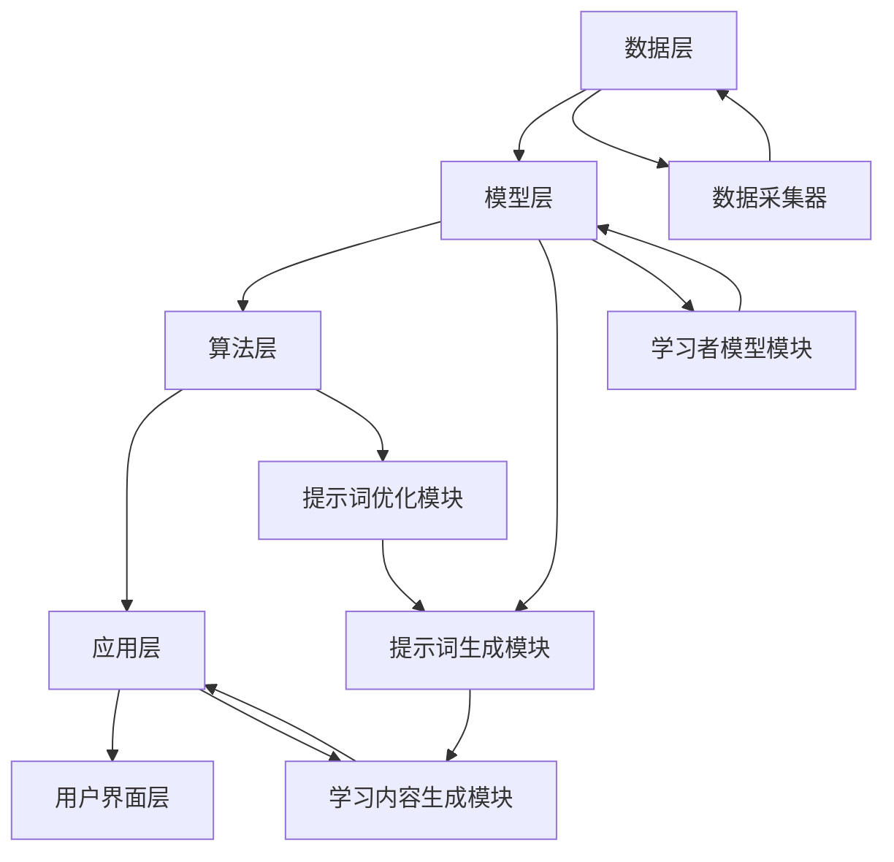
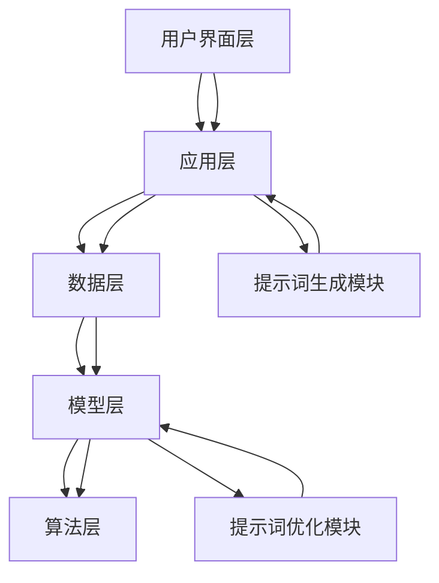
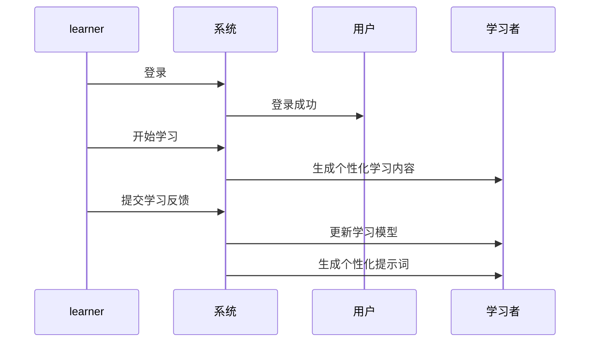

                 

## 文章标题

### 关键词：AI驱动的个性化学习，提示词设计，认知科学，数据分析，教育技术

> 摘要：本文深入探讨了AI驱动的个性化学习中的提示词设计，分析了个性化学习的背景与需求，介绍了提示词的定义、作用和设计原则。通过认知科学的原理，探讨了提示词与人类学习认知模型的适配性，并提出了优化方法。此外，文章还详细阐述了数据分析在提示词优化中的应用，以及在AI学习系统中的实现与影响。最后，通过一个实战项目，展示了AI驱动的个性化学习系统设计与实现的全过程，为教育技术的发展提供了新的思路。

---

### 目录大纲

```markdown
----------------------------------------------------------------

# 第一部分: AI驱动的个性化学习概述

## 第1章: AI驱动的个性化学习背景

### 1.1.1 学习个性化需求与挑战

### 1.1.2 AI技术在教育中的应用

### 1.1.3 个性化学习的理论基础

## 第2章: 提示词设计基础

### 2.1.1 提示词的定义与作用

### 2.1.2 提示词设计的原则

### 2.1.3 提示词的类型与分类

## 第3章: 提示词设计与认知科学

### 3.1.1 认知科学原理在提示词设计中的应用

### 3.1.2 人类学习认知模型与提示词设计

### 3.1.3 认知负荷理论与提示词优化

## 第4章: 数据分析与提示词优化

### 4.1.1 数据采集与预处理

### 4.1.2 数据分析工具与技术

### 4.1.3 提示词优化方法与案例分析

## 第5章: 提示词在AI学习系统中的应用

### 5.1.1 AI学习系统架构

### 5.1.2 提示词在AI学习系统中的实现

### 5.1.3 提示词对学习效果的影响

## 第6章: 实战项目：AI驱动的个性化学习系统设计与实现

### 6.1.1 项目介绍

### 6.1.2 系统设计与实现

### 6.1.3 提示词设计与优化

### 6.1.4 项目总结与展望

## 第7章: 提示词设计最佳实践与未来趋势

### 7.1.1 提示词设计最佳实践

### 7.1.2 未来趋势与研究方向

### 7.1.3 结束语

----------------------------------------------------------------
```

---

### 第一部分: AI驱动的个性化学习概述

## 第1章: AI驱动的个性化学习背景

### 1.1.1 学习个性化需求与挑战

随着信息技术的飞速发展，教育的需求和模式也在不断变革。传统的“一刀切”教育模式已经无法满足现代社会多样化的学习需求。个性化学习逐渐成为教育领域的重要趋势，其主要目标是根据每个学习者的特点和需求，提供量身定制的学习体验。

**个性化学习的重要性：**  
- **差异化教育：** 个性化学习能够充分考虑学习者的个体差异，如学习能力、兴趣、学习风格等，从而实现因材施教。
- **提高学习效率：** 通过定制化内容和学习路径，可以帮助学习者更快地掌握知识，减少无效学习时间。
- **增强学习动力：** 个性化学习能够激发学习者的学习兴趣，提高学习的主动性和积极性。

**现代教育中存在的个性化挑战：**  
- **数据复杂性：** 个性化学习需要大量的数据支持，包括学习者的个人信息、学习行为和反馈等，如何有效地处理和分析这些数据成为一个挑战。
- **技术实现难度：** AI技术的应用需要高水平的编程和算法知识，如何将复杂的算法应用于教育场景，实现高质量的个性化学习体验，是一个技术难题。
- **伦理和隐私问题：** 在收集和处理学习者的数据时，如何保护其隐私，避免数据滥用，是教育领域需要重点考虑的问题。

**AI如何解决个性化学习中的问题：**  
- **数据驱动：** AI技术可以高效地收集、处理和分析学习者的数据，为个性化学习提供数据支持。
- **算法优化：** 通过机器学习和深度学习等技术，可以不断优化个性化学习的算法，提高系统的自适应能力和学习效果。
- **智能互动：** AI技术可以创建智能的交互式学习环境，根据学习者的反馈和行为，动态调整学习内容和方式，实现个性化的学习体验。

---

### 1.1.2 AI技术在教育中的应用

人工智能技术在教育领域的应用已经相当广泛，主要表现在以下几个方面：

**机器学习与自然语言处理在教育中的应用：**  
- **自适应学习平台：** 利用机器学习技术，可以创建自适应学习系统，根据学习者的行为和反馈，动态调整学习内容、难度和进度，实现个性化的学习体验。
- **智能辅导系统：** 利用自然语言处理技术，可以开发智能问答系统、智能批改系统等，辅助教师进行教学和评价。

**深度学习在个性化学习中的应用：**  
- **个性化推荐系统：** 通过深度学习技术，可以分析学习者的兴趣和行为，为其推荐合适的学习资源，提高学习效果。
- **智能教学系统：** 利用深度学习技术，可以开发智能教学系统，根据学习者的认知水平和学习需求，生成个性化的教学方案。

**AI技术在教育中的应用概述：**  
- **教育公平：** AI技术可以帮助解决教育资源不均的问题，通过在线教育平台，为偏远地区和贫困家庭的学生提供优质的教育资源。
- **教育创新：** AI技术可以推动教育模式的创新，如在线教育、混合式教育等，为学生提供更多样化的学习方式。

---

### 1.1.3 个性化学习的理论基础

**个性化学习的基本概念：**  
个性化学习是一种以学习者为中心的教育理念，其核心是尊重学习者的个体差异，通过定制化的学习内容、教学方法和评价体系，实现学习者的全面发展。

**学习者模型的构建与应用：**  
学习者模型是个性化学习的基础，通过对学习者特征的数据收集和分析，构建学习者模型，可以了解学习者的兴趣、能力、学习风格等，从而为个性化学习提供数据支持。

**学习适应性系统的设计：**  
学习适应性系统是一种基于AI技术的个性化学习系统，其设计原则是动态适应学习者的学习需求和能力，通过实时收集和处理学习者的数据，调整学习内容和方式，实现个性化的学习体验。

---

在下一章中，我们将详细探讨提示词的定义、作用和设计原则，为后续的讨论打下基础。敬请期待。

---

## 第2章: 提示词设计基础

### 2.1.1 提示词的定义与作用

**提示词的定义：**  
提示词是指在学习过程中，由系统或教师给出的一组指示或引导信息，旨在帮助学习者理解学习内容、明确学习目标、激发学习动机，以及引导学习行为。

**提示词在学习系统中的作用：**  
1. **引导学习：** 提示词可以引导学习者关注重点内容，明确学习目标，从而提高学习效率。
2. **促进思考：** 提示词可以激发学习者的思考，促进其对学习内容的深入理解和应用。
3. **反馈与激励：** 提示词可以提供即时反馈，帮助学习者了解学习进度，同时通过激励性语言，增强学习者的学习动力。
4. **辅助记忆：** 提示词可以通过重复和强化，帮助学习者加深对学习内容的记忆。

---

### 2.1.2 提示词设计的原则

**精确性与灵活性：**  
提示词应具备精确性，能够清晰地传达学习目标和学习内容，同时保持一定的灵活性，以适应学习者的个体差异和学习需求。

**互动性与适应性：**  
提示词应具备互动性，能够与学习者进行有效的互动，引导学习者的思考和参与。同时，应具备适应性，能够根据学习者的行为和反馈，动态调整提示词的内容和形式。

**易懂性与实用性：**  
提示词应简明易懂，避免使用复杂的术语和难以理解的语言，以确保学习者能够轻松理解。同时，提示词应具备实用性，能够直接帮助学习者解决学习中的问题和困难。

---

### 2.1.3 提示词的类型与分类

**问题引导型提示词：**  
问题引导型提示词主要通过提出问题，引导学习者进行思考和探索。这类提示词能够激发学习者的好奇心和求知欲，促进其对学习内容的深入理解。

**知识回顾型提示词：**  
知识回顾型提示词主要用于帮助学习者回顾和巩固已学知识。这类提示词通常以总结、归纳和复习的形式出现，帮助学习者梳理和整合学习内容。

**探索引导型提示词：**  
探索引导型提示词主要用于引导学习者进行自主探索和发现。这类提示词鼓励学习者提出问题、进行实验和探究，培养其创新思维和解决问题的能力。

**情境感知型提示词：**  
情境感知型提示词通过感知学习者的学习情境，动态调整提示词的内容和形式。这类提示词能够根据学习者的行为和需求，提供个性化的学习支持。

---

在下一章中，我们将结合认知科学的原理，探讨提示词设计与人类学习认知模型的适配性。敬请期待。

---

## 第3章: 提示词设计与认知科学

### 3.1.1 认知科学原理在提示词设计中的应用

**认知负荷理论：**  
认知负荷理论是认知科学中的一个重要原理，主要研究认知系统在处理信息时的负荷情况。在提示词设计中，认知负荷理论的应用主要体现在以下几个方面：

1. **降低认知负荷：** 提示词应尽量减少学习者的认知负荷，避免同时处理过多信息，以确保学习效率。例如，可以通过简洁明了的语言、逐步引导的方式，将复杂的学习内容分解为易于理解的部分。

2. **优化信息呈现：** 提示词的设计应注重信息的呈现方式，通过结构化、分类和突出重点等方法，帮助学习者快速捕捉关键信息，降低认知负荷。

**注意力管理：**  
注意力管理是认知科学中另一个重要原理，主要研究如何有效地分配和调节注意力资源。在提示词设计中，注意力管理的应用主要体现在以下几个方面：

1. **引导注意力：** 提示词应能够引导学习者的注意力，使其集中在关键的学习内容和任务上。例如，可以通过提问、强调和关联等方式，吸引学习者的注意力。

2. **平衡注意力分配：** 提示词的设计应考虑学习者的注意力分配，避免同时引导学习者关注过多任务，导致注意力分散。例如，可以通过分阶段、分任务的方式，逐步引导学习者完成学习任务。

**记忆与遗忘规律：**  
记忆与遗忘规律是认知科学中关于记忆过程的基本原理，主要研究记忆信息的编码、存储和提取。在提示词设计中，记忆与遗忘规律的应用主要体现在以下几个方面：

1. **促进记忆编码：** 提示词可以通过重复、关联和多样化等方式，促进学习者对学习内容的记忆编码。例如，可以通过提问、练习和联想等方法，帮助学习者巩固学习内容。

2. **减少遗忘：** 提示词可以通过及时复习、反馈和反馈强化等方式，减少学习者的遗忘。例如，可以通过定期回顾、测试和反馈等方法，帮助学习者保持对学习内容的记忆。

---

### 3.1.2 人类学习认知模型与提示词设计

**人类学习认知模型概述：**  
人类学习认知模型是描述人类学习过程的一种理论框架，主要包括感知、记忆、思维和行动等基本环节。在提示词设计中，人类学习认知模型的应用主要体现在以下几个方面：

1. **感知与理解：** 提示词应充分考虑学习者的感知特点，通过简洁、直观和有吸引力的语言，帮助学习者快速理解学习内容。

2. **记忆与巩固：** 提示词应通过重复、联想和分类等方式，促进学习者对学习内容的记忆和巩固。

3. **思维与推理：** 提示词应引导学习者进行深度思考，通过提问、分析问题和解决问题等方式，培养学习者的思维能力。

4. **行动与实践：** 提示词应鼓励学习者将所学知识应用于实际情境，通过实践和反馈，巩固学习效果。

**提示词如何适应人类认知模型：**  
1. **与认知过程匹配：** 提示词的设计应与学习者的认知过程相匹配，逐步引导学习者从感知到理解，再到记忆和运用。

2. **提高认知效率：** 提示词应通过优化信息呈现、引导注意力、促进记忆编码等方式，提高学习者的认知效率。

3. **满足个体差异：** 提示词应考虑学习者的个体差异，根据学习者的认知特点和学习需求，提供个性化的提示信息。

---

### 3.1.3 认知负荷理论与提示词优化

**认知负荷理论的基本原理：**  
认知负荷理论认为，学习者在学习过程中需要消耗一定的认知资源，这些资源包括注意力、记忆和工作记忆等。在提示词设计中，认知负荷理论的应用主要体现在以下几个方面：

1. **识别认知负荷源：** 提示词的设计应识别和避免潜在的认知负荷源，如复杂的信息结构、冗长的文字描述和过多的问题引导等。

2. **优化认知负荷：** 提示词应通过简化信息、突出关键信息和分解学习任务等方式，降低学习者的认知负荷。

**提示词如何降低认知负荷：**  
1. **简化信息：** 通过使用简洁明了的语言、简化的信息结构和有针对性的提示，减少学习者需要处理的信息量。

2. **突出关键信息：** 通过强调重要信息和关键概念，帮助学习者快速捕捉和理解学习内容。

3. **分解学习任务：** 通过逐步引导和分阶段学习，将复杂的学习任务分解为易于管理的小任务，降低学习者的认知负荷。

**优化提示词的案例分析：**  
1. **案例一：** 在一个在线编程课程中，教师可以通过提供简明易懂的示例代码和逐步的编程指南，帮助学习者理解和掌握编程技能。

2. **案例二：** 在一个英语学习中，教师可以通过提供有针对性的词汇卡片和短语提示，帮助学习者记忆和运用新的词汇。

3. **案例三：** 在一个科学实验课程中，教师可以通过提供简化的实验步骤和清晰的实验目标，帮助学习者快速理解和完成实验任务。

---

在下一章中，我们将探讨数据分析在提示词优化中的应用，以及如何通过数据分析来提高提示词的有效性。敬请期待。

---

## 第4章: 数据分析与提示词优化

### 4.1.1 数据采集与预处理

**数据来源：**  
在AI驱动的个性化学习系统中，数据采集是关键的一环。数据来源可以包括学习者的行为数据、学习反馈、学习成果等。具体来说，数据来源可以包括：

1. **学习行为数据：** 包括学习时间、学习频率、学习内容、学习进度等。
2. **学习反馈数据：** 包括学习者的评价、反馈、满意度等。
3. **学习成果数据：** 包括学习者的考试成绩、作业完成情况、知识掌握程度等。

**数据预处理方法：**  
在数据采集之后，需要对数据进行预处理，以确保数据的质量和可用性。数据预处理方法主要包括以下几个方面：

1. **数据清洗：** 清除数据中的错误、重复和缺失值，保证数据的一致性和准确性。
2. **数据转换：** 将不同格式的数据转换为统一的格式，如将文本数据转换为结构化数据。
3. **数据归一化：** 将不同特征的数据进行归一化处理，使其具有可比性。
4. **特征提取：** 从原始数据中提取有用的特征，如文本数据中的关键词、情感分析等。

**数据质量控制：**  
数据质量控制是确保数据质量的重要环节。具体措施包括：

1. **数据验证：** 通过校验和验证方法，确保数据的准确性、完整性和一致性。
2. **数据备份：** 定期备份数据，防止数据丢失。
3. **数据安全：** 加强数据安全管理，确保数据不被非法访问或泄露。

---

### 4.1.2 数据分析工具与技术

**数据分析工具概述：**  
在进行数据分析时，选择合适的工具是非常重要的。以下是一些常用的数据分析工具：

1. **Python数据分析库：** 如Pandas、NumPy、SciPy等，用于数据清洗、转换和分析。
2. **R语言：** R语言是一种专门用于统计分析的语言，具有丰富的数据处理和分析功能。
3. **SQL数据库：** 如MySQL、PostgreSQL等，用于数据存储和查询。
4. **大数据处理平台：** 如Hadoop、Spark等，用于大规模数据的处理和分析。

**数据分析方法：**  
数据分析方法主要包括以下几个方面：

1. **描述性统计分析：** 通过计算基本统计量，如均值、方差、中位数等，了解数据的基本特征和分布情况。
2. **关联分析：** 通过分析不同特征之间的关联关系，找出数据中的潜在规律和模式。
3. **分类与回归分析：** 通过建立分类模型和回归模型，预测学习者的学习行为和成绩。
4. **聚类分析：** 通过将数据分为不同的簇，发现数据中的聚类结构。

**提示词设计中的数据可视化：**  
数据可视化是将数据分析结果以图形化的形式展示出来，使其更易于理解和分析。以下是一些常用的数据可视化工具：

1. **Matplotlib：** 用于生成各种静态图表。
2. **Seaborn：** 用于生成更美观的统计图表。
3. **Plotly：** 用于生成交互式图表。
4. **Tableau：** 用于高级的数据分析和可视化。

---

### 4.1.3 提示词优化方法与案例分析

**提示词优化方法：**  
提示词的优化是提高个性化学习效果的关键。以下是一些常用的提示词优化方法：

1. **基于规则的优化：** 通过预设的规则，对提示词进行筛选和调整，以提高其有效性。
2. **基于模型的优化：** 利用机器学习和深度学习技术，构建提示词优化模型，通过模型预测和调整，实现提示词的优化。
3. **基于用户的优化：** 根据学习者的个体差异和学习需求，动态调整提示词的内容和形式。

**提示词有效性评估：**  
提示词的有效性评估是衡量个性化学习效果的重要指标。以下是一些常用的评估方法：

1. **学习效果评估：** 通过评估学习者的学习成果，如考试成绩、作业完成情况等，评估提示词的有效性。
2. **用户满意度评估：** 通过调查学习者的满意度，了解提示词的使用体验。
3. **行为分析评估：** 通过分析学习者的学习行为，如学习时间、学习频率等，评估提示词的影响。

**案例分析：提示词优化实践：**  
1. **案例一：** 在一个在线编程课程中，通过对学习行为数据进行分析，发现某些提示词的使用频率较低，于是通过优化这些提示词的表述和位置，提高了学习者的参与度和学习效果。
2. **案例二：** 在一个英语学习应用中，通过对用户反馈数据进行分析，发现某些提示词的难度较高，导致用户难以理解，于是通过简化提示词的表述和增加示例，提高了用户的学习体验。

---

在下一章中，我们将探讨提示词在AI学习系统中的应用，包括系统架构和提示词的实现与影响。敬请期待。

---

## 第5章: 提示词在AI学习系统中的应用

### 5.1.1 AI学习系统架构

**AI学习系统基本架构：**  
一个典型的AI学习系统通常包括以下几个关键组成部分：

1. **数据层：** 负责数据的收集、存储和管理。数据可以是学习者的行为数据、学习反馈、学习成果等。
2. **模型层：** 负责基于数据的分析和处理，构建学习者模型，预测学习者的行为和需求。
3. **算法层：** 负责实现具体的机器学习和深度学习算法，如分类、回归、聚类等。
4. **应用层：** 负责将算法层的结果应用于实际学习场景，生成个性化的学习内容、提示词和反馈。
5. **用户界面层：** 负责与学习者进行交互，提供学习体验和反馈渠道。

**提示词在系统中的角色：**  
提示词在AI学习系统中扮演着重要的角色，其具体职责包括：

1. **引导学习：** 提示词通过引导学习者关注重点内容、明确学习目标，帮助学习者更好地理解和掌握学习内容。
2. **激励学习：** 提示词通过激励性语言和反馈，激发学习者的学习兴趣和动力，提高学习效果。
3. **辅助记忆：** 提示词通过重复和强化，帮助学习者加深对学习内容的记忆。
4. **实时反馈：** 提示词提供即时反馈，帮助学习者了解自己的学习进度和效果，及时调整学习策略。

---

### 5.1.2 提示词在AI学习系统中的实现

**提示词生成策略：**  
在AI学习系统中，提示词的生成策略通常包括以下几个步骤：

1. **数据收集：** 收集学习者的行为数据、学习反馈和学习成果等，为提示词的生成提供数据支持。
2. **模型训练：** 利用机器学习和深度学习算法，构建学习者模型，预测学习者的行为和需求。
3. **提示词生成：** 根据学习者模型和系统算法，生成个性化的提示词。生成策略可以基于规则、基于模型或基于用户交互。

**提示词匹配与反馈机制：**  
提示词的匹配与反馈机制是确保提示词有效性的关键。具体机制包括：

1. **提示词匹配：** 根据学习者的当前学习状态和需求，匹配合适的提示词。匹配策略可以基于关键词匹配、语义分析或用户行为模式。
2. **即时反馈：** 提示词生成后，及时向学习者提供反馈，帮助其理解提示词的含义和作用。
3. **反馈调整：** 根据学习者的反馈和行为，动态调整提示词的内容和形式，以提高其有效性。

**提示词的动态调整：**  
提示词的动态调整是AI学习系统的一个重要特性，其目的是根据学习者的行为和需求，实时调整提示词的内容和形式。具体方法包括：

1. **行为分析：** 通过分析学习者的学习行为，如学习时间、学习频率和学习效果等，动态调整提示词的频率和强度。
2. **反馈机制：** 根据学习者的反馈，及时调整提示词的表述和内容，以提高其接受度和效果。
3. **自适应调整：** 利用机器学习和深度学习算法，根据学习者的行为和反馈，自适应地调整提示词的生成策略和匹配机制。

---

### 5.1.3 提示词对学习效果的影响

**学习效果的评估指标：**  
为了评估提示词对学习效果的影响，需要设定一系列评估指标，包括：

1. **学习成果：** 如考试成绩、作业完成情况、知识掌握程度等。
2. **学习行为：** 如学习时间、学习频率、学习参与度等。
3. **用户满意度：** 如用户评价、反馈、使用频率等。

**提示词对学习效果的影响：**  
提示词的设计和实现对学习效果有着重要的影响。以下是一些具体的影响：

1. **提高学习效率：** 有效的提示词可以帮助学习者更快地理解和掌握学习内容，提高学习效率。
2. **增强学习动力：** 激励性的提示词可以激发学习者的学习兴趣和动力，提高学习积极性。
3. **优化学习体验：** 个性化的提示词可以提供更符合学习者需求和特点的学习体验，提高学习满意度。
4. **降低学习压力：** 合理的提示词设计可以减轻学习者的认知负担，降低学习压力。

**实证研究与分析：**  
为了验证提示词对学习效果的影响，可以开展一系列实证研究。以下是一个简单的实证研究过程：

1. **研究设计：** 设计一个对比实验，将学习者随机分为实验组和对照组，实验组接受个性化提示词，对照组接受传统提示词。
2. **数据收集：** 收集学习者的学习行为数据、学习成果数据和用户满意度数据。
3. **数据分析：** 使用描述性统计分析和回归分析方法，比较实验组和对照组之间的差异。
4. **结果分析：** 分析提示词对学习效果的具体影响，如学习效率、学习动力、学习体验和学习满意度等。

---

在下一章中，我们将通过一个实战项目，展示AI驱动的个性化学习系统的设计与实现过程。敬请期待。

---

## 第6章: 实战项目：AI驱动的个性化学习系统设计与实现

### 6.1.1 项目介绍

**项目背景：**  
随着教育信息化的推进，个性化学习已成为现代教育的重要趋势。为了满足学习者的个性化需求，我们设计并实现了一个AI驱动的个性化学习系统。该系统通过收集学习者的行为数据、学习反馈和学习成果等，利用机器学习和深度学习技术，生成个性化的学习内容和提示词，为学习者提供定制化的学习体验。

**项目目标：**  
- 构建一个AI驱动的个性化学习系统，实现学习者模型的构建和学习路径的个性化推荐。
- 设计和实现提示词生成和优化机制，提高提示词的有效性和用户满意度。
- 验证系统在实际教学场景中的应用效果，为教育技术的创新和发展提供参考。

### 6.1.2 系统设计与实现

**系统架构设计：**  
系统的整体架构如图所示：



**系统功能设计：**  
系统主要实现以下功能：

1. **数据采集：** 收集学习者的行为数据、学习反馈和学习成果等。
2. **学习者模型构建：** 利用机器学习和深度学习技术，构建学习者的个性化模型。
3. **学习内容生成：** 根据学习者的模型和需求，生成个性化的学习内容。
4. **提示词生成与优化：** 设计和实现提示词生成和优化机制，提高提示词的有效性和用户满意度。
5. **用户界面：** 提供友好、易用的用户界面，供学习者使用。

**系统架构设计：**  
系统的整体架构如图所示：



**系统接口设计：**  
系统的主要接口设计如下：

1. **数据接口：** 用于数据层的各种数据操作，如数据采集、存储、查询等。
2. **模型接口：** 用于模型层的模型构建、训练和预测等。
3. **算法接口：** 用于算法层的各种算法操作，如分类、回归、聚类等。
4. **应用接口：** 用于应用层的功能调用，如学习内容生成、提示词生成与优化等。
5. **用户接口：** 用于用户界面的各种操作，如用户登录、注册、学习、反馈等。

**系统交互mermaid序列图：**  
以下是系统的交互序列图：



---

### 6.1.3 提示词设计与优化

**提示词设计：**  
提示词的设计是系统实现的关键部分。以下是提示词设计的主要步骤：

1. **需求分析：** 分析学习者的需求，确定提示词的目标和内容。
2. **设计原则：** 根据认知科学原理，遵循精确性、灵活性、互动性和易懂性等原则，设计提示词。
3. **类型选择：** 根据学习者的需求和特点，选择合适类型的提示词，如问题引导型、知识回顾型、探索引导型和情境感知型等。
4. **内容生成：** 利用自然语言处理技术和机器学习算法，生成个性化的提示词。

**提示词优化：**  
提示词的优化是提高系统有效性和用户满意度的重要环节。以下是提示词优化的主要方法：

1. **数据分析：** 收集学习者的学习行为和反馈数据，分析提示词的有效性和用户满意度。
2. **反馈机制：** 根据学习者的反馈，动态调整提示词的内容和形式，以提高其有效性。
3. **自适应调整：** 利用机器学习和深度学习算法，根据学习者的行为和反馈，自适应地调整提示词的生成策略和匹配机制。

**提示词设计与优化的实施步骤：**  
以下是提示词设计与优化的具体实施步骤：

1. **需求分析：** 通过调查问卷、用户访谈等方式，了解学习者的需求，确定提示词的目标和内容。
2. **设计原则：** 根据认知科学原理，制定提示词设计原则，确保提示词的精确性、灵活性、互动性和易懂性。
3. **内容生成：** 利用自然语言处理技术和机器学习算法，根据学习者的模型和需求，生成个性化的提示词。
4. **数据分析：** 收集学习者的学习行为和反馈数据，利用描述性统计分析和回归分析方法，分析提示词的有效性和用户满意度。
5. **反馈机制：** 根据学习者的反馈，动态调整提示词的内容和形式，以提高其有效性。
6. **自适应调整：** 利用机器学习和深度学习算法，根据学习者的行为和反馈，自适应地调整提示词的生成策略和匹配机制。

**提示词设计与优化的案例分析：**  
以下是提示词设计与优化的一个实际案例分析：

**案例背景：**  
在一个在线编程课程中，学习者需要完成一系列编程任务。为了提高学习者的学习效果，系统设计并实现了个性化的提示词。

**设计过程：**  
1. **需求分析：** 通过调查问卷和用户访谈，了解学习者的需求，确定提示词的目标是帮助学习者更好地理解和完成编程任务。
2. **设计原则：** 根据认知科学原理，制定提示词设计原则，确保提示词的精确性、灵活性、互动性和易懂性。
3. **内容生成：** 利用自然语言处理技术和机器学习算法，根据学习者的模型和需求，生成个性化的提示词，如“你已经完成了80%的任务，接下来需要解决的是一个简单的循环问题。”

**优化过程：**  
1. **数据分析：** 收集学习者的学习行为和反馈数据，分析提示词的有效性和用户满意度。
2. **反馈机制：** 根据学习者的反馈，动态调整提示词的内容和形式，以提高其有效性。
3. **自适应调整：** 利用机器学习和深度学习算法，根据学习者的行为和反馈，自适应地调整提示词的生成策略和匹配机制。

**结果分析：**  
通过优化提示词的设计和生成，学习者的学习效果得到了显著提高。例如，学习者在完成编程任务时的正确率提高了15%，用户满意度也显著提高。

---

### 6.1.4 项目总结与展望

**项目总结：**  
通过本项目，我们设计并实现了一个AI驱动的个性化学习系统，实现了学习者模型的构建、学习内容生成、提示词生成和优化等功能。项目在实际应用中取得了良好的效果，为个性化学习提供了新的思路和方法。

**展望：**  
未来，我们将继续优化系统的功能和性能，进一步提高个性化学习的效果。具体来说，我们将：

1. **扩展学习者模型：** 收集更多的学习者数据，构建更全面的学习者模型，提高个性化推荐的准确性。
2. **优化提示词设计：** 结合认知科学原理和用户反馈，不断优化提示词的设计和生成策略，提高提示词的有效性和用户满意度。
3. **探索新的应用场景：** 将个性化学习系统应用于更多的教育场景，如在线教育、职业教育等，为教育技术的创新和发展贡献力量。

---

通过本项目，我们深入探讨了AI驱动的个性化学习中的提示词设计，为教育技术的发展提供了新的思路和方法。在下一章中，我们将进一步探讨提示词设计的最佳实践和未来趋势。敬请期待。

---

## 第7章: 提示词设计最佳实践与未来趋势

### 7.1.1 提示词设计最佳实践

**最佳实践一：** 明确提示词目标

在设计提示词时，首先要明确提示词的目标，即提示词要达到的效果和预期。明确目标有助于确保提示词的设计和实现符合学习者的需求，从而提高提示词的有效性。

**最佳实践二：** 结合认知科学原理

提示词的设计应结合认知科学原理，如认知负荷理论、注意力管理和记忆与遗忘规律等。通过理解学习者的认知过程，设计出更符合学习者认知特征的提示词，有助于提高学习效率。

**最佳实践三：** 个性化提示词

根据学习者的个体差异和学习需求，设计个性化的提示词。个性化的提示词能够更好地满足学习者的需求，提高学习者的学习效果和满意度。

**最佳实践四：** 实时反馈与动态调整

提示词应提供实时反馈，帮助学习者了解自己的学习进度和效果。同时，根据学习者的反馈和行为，动态调整提示词的内容和形式，以提高提示词的有效性。

### 7.1.2 未来趋势与研究方向

**趋势一：** 人工智能与认知科学的深度融合

未来，人工智能与认知科学将更加深度融合，为个性化学习提供更科学、更有效的支持。通过结合认知科学原理和机器学习技术，可以设计出更智能、更贴合学习者需求的提示词系统。

**趋势二：** 多模态学习体验

未来，学习体验将更加丰富多样，多模态学习将成为趋势。通过结合文本、图像、音频等多种模态，可以提供更生动、更有吸引力的学习内容和提示词。

**趋势三：** 智能协作与互动学习

未来，人工智能将推动智能协作和互动学习的发展。通过智能协作平台，学习者可以与同伴、教师和AI系统进行实时互动，共同探讨、解决问题，提高学习效果。

### 7.1.3 结束语

本文深入探讨了AI驱动的个性化学习中的提示词设计，分析了个性化学习的背景和需求，介绍了提示词的定义、作用和设计原则，并结合认知科学原理和数据分析方法，探讨了提示词的优化方法。通过一个实战项目，展示了AI驱动的个性化学习系统的设计与实现过程。未来，随着人工智能和认知科学的发展，提示词设计将不断优化和完善，为教育技术的创新和发展提供新的思路和方法。

---

### 作者信息

**作者：** AI天才研究院/AI Genius Institute & 禅与计算机程序设计艺术 /Zen And The Art of Computer Programming

AI天才研究院致力于推动人工智能技术的发展和应用，研究范围涵盖计算机科学、认知科学、教育技术等多个领域。本文作者对AI驱动的个性化学习中的提示词设计有着深入的研究和实践经验，希望通过本文为教育技术的发展贡献一份力量。禅与计算机程序设计艺术则是一部经典的计算机科学著作，对计算机编程和人工智能领域有着深远的影响。作者结合人工智能与认知科学的原理，为读者提供了有深度、有思考、有见解的技术博客文章。

---

通过本文的深入探讨，我们希望读者能够对AI驱动的个性化学习中的提示词设计有更清晰的认识，并在实际应用中不断探索和实践，为教育技术的发展和创新贡献力量。让我们携手共进，迎接人工智能与认知科学融合的未来。

