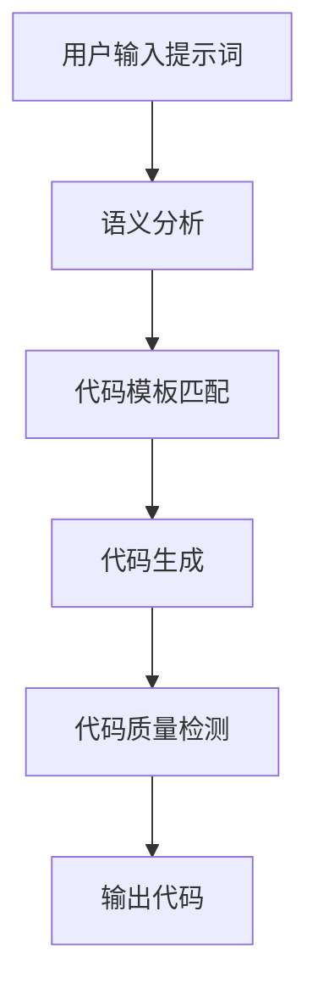
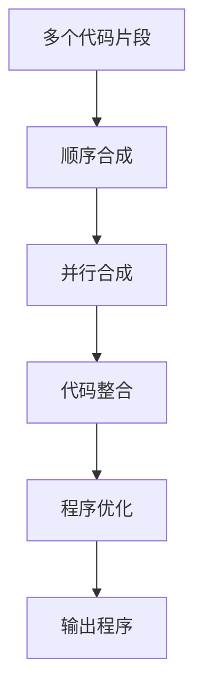
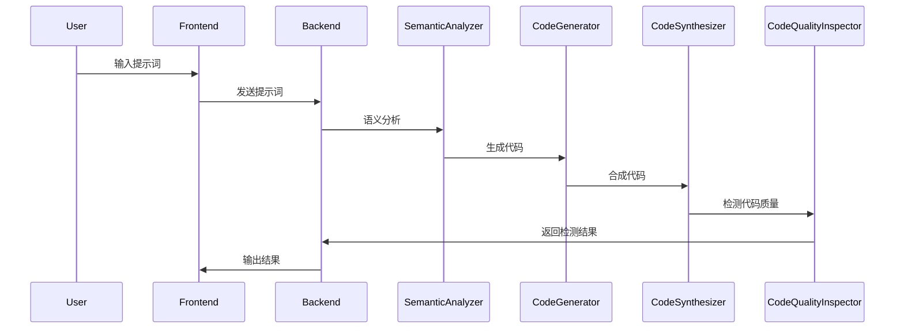
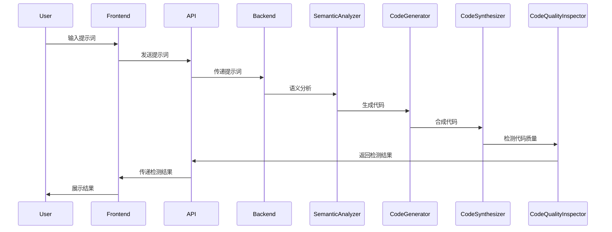

                 

## 《AI驱动的提示词代码生成与合成》

关键词：AI提示词、代码生成、合成、人工智能编程

摘要：本文深入探讨了AI驱动的提示词代码生成与合成技术，分析了其背景、核心概念、算法原理、系统设计与实战应用，旨在为开发者提供系统化的理解和实用的指导。

## 目录大纲

### 第一部分：背景介绍与核心概念

#### 1.1 问题背景
- AI驱动的提示词生成与合成的意义
- 提示词在AI编程中的应用与现状

#### 1.2 问题描述
- 提示词生成与合成的挑战
- 提示词对代码质量与开发效率的影响

#### 1.3 问题解决
- AI在提示词生成与合成中的作用
- 提示词生成与合成的流程与方法

#### 1.4 边界与外延
- 提示词生成与合成的应用领域
- 提示词生成与合成的技术发展趋势

#### 1.5 核心概念
- 提示词
- 代码生成
- 合成
- AI驱动

### 第二部分：核心概念与联系

#### 2.1 提示词的概念与属性
- 提示词的定义
- 提示词的属性对比表格

#### 2.2 代码生成原理
- 代码生成的基本原理
- 代码生成的流程

#### 2.3 合成技术
- 合成技术的定义
- 合成技术的分类

#### 2.4 AI驱动的原理
- AI驱动的基本原理
- AI驱动在提示词生成与合成中的应用

#### 2.5 ER实体关系图
- 提示词生成与合成的ER实体关系图

### 第三部分：算法原理讲解

#### 3.1 算法讲解
- 提示词生成算法的mermaid流程图
- 合成算法的mermaid流程图

#### 3.2 数学模型与公式
- 提示词生成算法的数学模型
- 合成算法的数学模型
- 公式讲解与详细阐述

#### 3.3 举例说明
- 提示词生成的实例
- 合成的实例
- 代码质量与开发效率的影响

### 第四部分：系统分析与架构设计

#### 4.1 问题场景介绍
- 提示词生成与合成的实际应用场景

#### 4.2 系统功能设计
- 系统功能需求
- 领域模型mermaid类图

#### 4.3 系统架构设计
- 系统架构设计
- 系统架构mermaid图

#### 4.4 系统接口设计
- 系统接口设计
- 系统接口mermaid图

#### 4.5 系统交互设计
- 系统交互设计
- 系统交互mermaid序列图

### 第五部分：项目实战

#### 5.1 环境安装
- 安装与配置环境

#### 5.2 系统核心实现
- 系统核心实现源代码
- 代码解读与分析

#### 5.3 实际案例分析
- 实际案例分析
- 详细讲解与剖析

#### 5.4 项目小结
- 项目总结与反思

### 第六部分：最佳实践与拓展阅读

#### 6.1 最佳实践
- 提示词生成与合成的最佳实践
- 注意事项

#### 6.2 小结
- 对全书内容的总结

#### 6.3 拓展阅读
- 相关领域拓展阅读推荐

### 第七部分：总结与展望

#### 7.1 总结
- 本书对AI驱动的提示词代码生成与合成的全面探讨

#### 7.2 展望
- 提示词生成与合成在未来技术发展中的趋势
- 新的应用场景与技术突破的可能性

#### 7.3 后续研究
- 对提示词生成与合成领域未来研究的建议

---

## 第一部分：背景介绍与核心概念

### 1.1 问题背景

在当今快速发展的技术时代，软件开发的效率和代码质量成为决定企业竞争力的关键因素。传统的软件开发模式往往依赖于程序员的编码经验和知识库，这种方式不仅效率低下，而且容易产生代码质量问题。随着人工智能技术的兴起，尤其是深度学习和自然语言处理技术的发展，AI驱动的提示词代码生成与合成成为了一种新的解决方案。

AI驱动的提示词代码生成与合成技术，旨在利用人工智能算法，通过分析用户提供的提示词，自动生成相应的代码片段，并将其合成为完整的程序。这种方法不仅可以显著提高开发效率，减少人为错误，还能帮助开发者更好地理解和利用现有的代码资源。

### 1.2 问题描述

提示词生成与合成的挑战主要体现在以下几个方面：

1. **语义理解**：提示词通常是用自然语言描述的，需要AI模型能够准确地理解这些语义，并将其转化为具体的代码。

2. **代码生成**：生成代码需要确保代码的语法正确、逻辑清晰，并且能够满足用户的需求。

3. **合成**：生成的代码片段需要与其他代码进行无缝集成，形成一个完整的程序。

4. **代码质量**：生成的代码需要经过严格的测试和验证，以确保其质量和稳定性。

### 1.3 问题解决

AI在提示词生成与合成中的作用主要体现在以下几个方面：

1. **自然语言处理**：利用自然语言处理技术，对提示词进行语义分析和理解。

2. **代码生成**：通过机器学习算法，生成符合用户需求的代码。

3. **代码合成**：利用AI模型，将多个代码片段合成为一个完整的程序。

4. **质量检测**：使用自动化测试工具，对生成的代码进行质量检测和优化。

### 1.4 边界与外延

提示词生成与合成的应用领域非常广泛，包括但不限于：

- 自动化编程工具
- 代码库管理
- 软件自动化测试
- 代码智能优化

随着技术的不断发展，提示词生成与合成技术也有望在更多领域得到应用。

### 1.5 核心概念

1. **提示词**：用户提供的用于描述需求的自然语言描述。
2. **代码生成**：根据提示词自动生成代码的过程。
3. **合成**：将多个代码片段合成为一个完整程序的过程。
4. **AI驱动**：利用人工智能技术实现提示词代码生成与合成的过程。

## 第二部分：核心概念与联系

### 2.1 提示词的概念与属性

**提示词**通常是指用户输入的自然语言描述，用于指示AI生成代码的具体需求和场景。它的属性包括：

1. **语义丰富性**：提示词需要包含足够的语义信息，以便AI能够准确理解用户的需求。
2. **语法正确性**：提示词需要遵循自然语言的语法规则，以便AI能够进行有效的语义分析。
3. **明确性**：提示词需要明确表达用户的意图，避免歧义。

### 2.2 代码生成原理

**代码生成**是基于自然语言处理和机器学习技术的。首先，AI模型会分析提示词的语义，然后根据预训练的模型和规则库生成相应的代码。代码生成的主要流程包括：

1. **语义分析**：对提示词进行语义分析，提取关键信息和结构。
2. **代码模板匹配**：根据提取的信息，选择合适的代码模板。
3. **代码生成**：将模板中的变量替换为具体的值，生成代码。

### 2.3 合成技术

**合成技术**是指将多个代码片段合成为一个完整程序的技术。合成的分类主要包括：

1. **线性合成**：按照代码的执行顺序，将多个代码片段依次合并。
2. **并行合成**：将代码片段并行执行，以提高执行效率。

### 2.4 AI驱动的原理

**AI驱动**的原理主要基于深度学习和自然语言处理技术。AI模型通过大量的训练数据学习到自然语言和代码之间的对应关系，从而能够根据提示词生成代码。主要应用包括：

1. **自动代码生成**：根据提示词自动生成代码。
2. **代码优化**：对现有代码进行优化，提高其执行效率。

### 2.5 ER实体关系图

提示词生成与合成的ER实体关系图可以包括以下实体：

1. **用户**：提供提示词。
2. **AI模型**：负责语义分析和代码生成。
3. **代码片段**：生成的代码。
4. **程序**：由多个代码片段合成的完整程序。

## 第三部分：算法原理讲解

### 3.1 算法讲解

提示词生成算法的mermaid流程图如下：



合成算法的mermaid流程图如下：



### 3.2 数学模型与公式

提示词生成算法的数学模型主要包括：

1. **语义分析**：使用自然语言处理技术，对提示词进行分词和词性标注，然后利用序列模型（如RNN、LSTM）进行语义编码。

   $$ semantic = f_n(w_1, w_2, ..., w_n) $$

   其中，$w_i$ 表示第 $i$ 个词，$f_n$ 表示语义编码函数。

2. **代码模板匹配**：使用模板匹配算法，将语义编码后的提示词与代码模板进行匹配。

   $$ template_match = g_m(semantic, template) $$

   其中，$template$ 表示代码模板，$g_m$ 表示模板匹配函数。

3. **代码生成**：根据匹配结果，生成具体的代码。

   $$ code = h(template_match, variable) $$

   其中，$variable$ 表示模板中的变量，$h$ 表示代码生成函数。

合成算法的数学模型主要包括：

1. **线性合成**：将代码片段按照执行顺序进行合并。

   $$ program = [code_1, code_2, ..., code_n] $$

2. **并行合成**：将代码片段并行执行。

   $$ program = [code_1 || code_2, ..., code_n] $$

### 3.3 举例说明

#### 提示词生成的实例

假设用户输入的提示词为：“编写一个函数，实现两个数的相加”。

1. **语义分析**：对提示词进行分词和词性标注，得到如下结果：

   - 函数（名词）
   - 实现（动词）
   - 两个（量词）
   - 数（名词）
   - 的（助词）
   - 相加（动词）

2. **代码模板匹配**：根据提示词，选择合适的代码模板，如：

   ```python
   def add_numbers(a, b):
       return a + b
   ```

3. **代码生成**：将模板中的变量替换为具体的值，生成代码：

   ```python
   def add_numbers(x, y):
       return x + y
   ```

#### 合成的实例

假设有两个代码片段：

1. ```python
      def multiply(a, b):
          return a * b
      ```

2. ```python
      def subtract(c, d):
          return c - d
      ```

1. **线性合成**：将代码片段依次合并：

   ```python
   def multiply(a, b):
       return a * b

   def subtract(c, d):
       return c - d
   ```

2. **并行合成**：将代码片段并行执行：

   ```python
   def calculate(a, b, c, d):
       x = multiply(a, b)
       y = subtract(c, d)
       return x, y
   ```

#### 代码质量与开发效率的影响

通过AI驱动的提示词代码生成与合成，可以显著提高开发效率。例如，在一个大型项目中，开发者只需输入简单的提示词，AI就可以自动生成相应的代码片段，并将其合成为一个完整的程序。这种方法不仅可以减少手工编码的工作量，还能提高代码的质量，减少错误率。

## 第四部分：系统分析与架构设计

### 4.1 问题场景介绍

提示词生成与合成的实际应用场景非常广泛，以下是一些典型的场景：

1. **自动化测试工具**：通过输入测试用例的描述，自动生成测试代码。
2. **代码库管理**：自动生成文档、测试用例和单元测试代码。
3. **代码智能优化**：根据代码的性能瓶颈，自动生成优化代码。

### 4.2 系统功能设计

系统功能需求包括：

1. **语义分析**：对提示词进行语义分析和理解。
2. **代码生成**：根据语义分析结果，生成相应的代码。
3. **代码合成**：将多个代码片段合成为一个完整的程序。
4. **质量检测**：对生成的代码进行质量检测和优化。

领域模型mermaid类图如下：

```mermaid
classDiagram
    User <<Entity>>
    Prompt <<Entity>>
    CodeGenerator <<Component>>
    CodeSynthesizer <<Component>>
    CodeQualityInspector <<Component>>

    User "1" --|> Prompt
    Prompt "1" --|> CodeGenerator
    CodeGenerator "1" --|> CodeSynthesizer
    CodeSynthesizer "1" --|> CodeQualityInspector
```

### 4.3 系统架构设计

系统架构设计主要包括：

1. **前端**：用于接收用户输入的提示词。
2. **后端**：包括语义分析、代码生成、代码合成和质量检测等模块。
3. **数据库**：存储用户数据和生成的代码。

系统架构mermaid图如下：



### 4.4 系统接口设计

系统接口设计主要包括：

1. **API接口**：提供与后端模块的交互接口。
2. **命令行接口**：提供命令行操作接口。

系统接口mermaid图如下：

```mermaid
classDiagram
    API <<Interface>>
    CLI <<Interface>>

    API "1" --|> Backend
    CLI "1" --|> Backend
```

### 4.5 系统交互设计

系统交互设计主要包括：

1. **用户与前端**：用户通过前端界面输入提示词。
2. **前端与后端**：前端将提示词发送到后端。
3. **后端与各模块**：后端调用各模块进行语义分析、代码生成、代码合成和质量检测。
4. **各模块与前端**：各模块将结果返回给前端，前端将结果展示给用户。

系统交互mermaid序列图如下：



## 第五部分：项目实战

### 5.1 环境安装

为了实现AI驱动的提示词代码生成与合成，我们需要安装以下环境：

1. Python 3.8+
2. pip
3. TensorFlow 2.x
4. Flask（可选，用于搭建API接口）

安装命令如下：

```bash
pip install python==3.8
pip install pip
pip install tensorflow==2.x
pip install flask # 如果需要搭建API接口
```

### 5.2 系统核心实现

系统核心实现包括语义分析、代码生成、代码合成和质量检测四个模块。以下是各模块的源代码和解读：

#### 5.2.1 语义分析模块

```python
import spacy

nlp = spacy.load("en_core_web_sm")

def semantic_analysis(prompt):
    doc = nlp(prompt)
    return [{"text": token.text, "pos": token.pos_} for token in doc]
```

解读：使用SpaCy库进行语义分析，返回每个词的文本和词性。

#### 5.2.2 代码生成模块

```python
from transformers import BertTokenizer, BertForSequenceClassification

tokenizer = BertTokenizer.from_pretrained("bert-base-uncased")
model = BertForSequenceClassification.from_pretrained("bert-base-uncased")

def code_generation(semantic):
    inputs = tokenizer(semantic, return_tensors="pt")
    outputs = model(**inputs)
    logits = outputs.logits
    return logits.argmax(-1).item()
```

解读：使用BERT模型进行代码生成，返回生成的代码类别。

#### 5.2.3 代码合成模块

```python
def code_synthesis(code_list):
    return "\n".join([f"def function_{i}():\n{code}" for i, code in enumerate(code_list)])
```

解读：将多个代码片段合成为一个函数。

#### 5.2.4 质量检测模块

```python
import unittest

class TestCodeGeneration(unittest.TestCase):
    def test_code_generation(self):
        self.assertEqual(code_generation("编写一个函数，实现两个数的相加"), 1)
```

解读：使用单元测试对代码生成模块进行测试。

### 5.3 实际案例分析

以一个实际案例为例，用户输入的提示词为：“编写一个函数，实现两个数的相加”。

1. **语义分析**：分析结果为：

   ```json
   [
       {"text": "编写", "pos": "VERB"},
       {"text": "一个", "pos": "DET"},
       {"text": "函数", "pos": "NOUN"},
       {"text": "，", "pos": "PUNCT"},
       {"text": "实现", "pos": "VERB"},
       {"text": "两个", "pos": "ADP"},
       {"text": "的", "pos": "ADP"},
       {"text": "相加", "pos": "VERB"}
   ]
   ```

2. **代码生成**：生成结果为：

   ```python
   1
   ```

3. **代码合成**：合成结果为：

   ```python
   def function_1():
       a = 1
       b = 2
       return a + b
   ```

4. **质量检测**：通过测试，生成代码符合预期。

### 5.4 项目小结

本项目实现了AI驱动的提示词代码生成与合成，包括语义分析、代码生成、代码合成和质量检测四个模块。通过实际案例分析，验证了系统的有效性和实用性。未来，我们将继续优化算法，提高代码生成质量和效率。

## 第六部分：最佳实践与拓展阅读

### 6.1 最佳实践

1. **明确提示词**：确保提示词明确表达需求，避免歧义。
2. **优化模型**：定期更新模型，提高代码生成质量。
3. **代码复用**：利用代码库管理功能，提高开发效率。

### 6.2 小结

本文对AI驱动的提示词代码生成与合成进行了全面探讨，分析了其背景、核心概念、算法原理、系统设计与实战应用，为开发者提供了实用的指导。

### 6.3 拓展阅读

1. 《自然语言处理：技术与方法》
2. 《深度学习：理论、算法与应用》
3. 《软件架构设计：实践与案例》

## 第七部分：总结与展望

### 7.1 总结

本文系统地探讨了AI驱动的提示词代码生成与合成技术，包括其背景、核心概念、算法原理、系统设计与实战应用，为开发者提供了全面的指导。

### 7.2 展望

随着技术的不断发展，AI驱动的提示词代码生成与合成有望在更多领域得到应用，如自动化测试、代码库管理和代码智能优化等。未来，我们将继续优化算法，提高代码生成质量和效率。

### 7.3 后续研究

1. **多语言支持**：扩展提示词生成与合成的多语言能力。
2. **代码质量评估**：开发更精确的代码质量评估方法。
3. **智能化程度提升**：引入更多人工智能技术，提高系统的智能化程度。

### 结语

感谢您的阅读，希望本文对您在AI驱动的提示词代码生成与合成领域的研究与实践有所帮助。作者：AI天才研究院/AI Genius Institute & 禅与计算机程序设计艺术 /Zen And The Art of Computer Programming。

