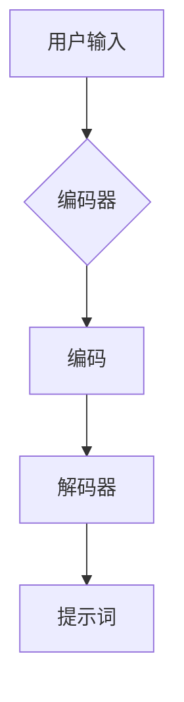
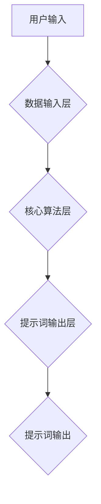
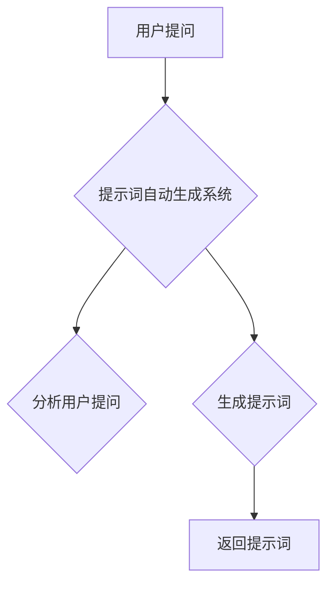

                 

### 文章标题

# AI驱动的提示词自动生成技术

> 关键词：AI、提示词自动生成、自然语言处理、机器学习、深度学习

> 摘要：本文深入探讨了AI驱动的提示词自动生成技术的原理、系统架构以及项目实战，通过详细的算法原理讲解、数学模型阐述、系统设计与实现，为广大开发者提供了系统的技术指南，并展望了该技术的未来发展趋势与挑战。

----------------------------------------------------------------

## 引言

随着人工智能技术的飞速发展，人机交互成为了一个备受关注的研究领域。在众多人机交互技术中，提示词自动生成技术尤为重要。它能够通过分析用户输入的内容，自动生成相应的提示词，从而提升人机交互的效率和用户体验。

### 1.1 问题背景

在人机交互过程中，用户需要输入大量的信息，而机器则需要理解这些信息并给出相应的反馈。然而，用户输入的信息往往是不完整、不规范的，这使得机器理解用户的意图变得复杂。因此，如何从用户的输入中提取关键信息，并生成有针对性的提示词，成为了一个亟待解决的问题。

### 1.2 问题解决

提示词自动生成技术通过利用自然语言处理（NLP）、机器学习（ML）和深度学习（DL）等技术，能够自动分析用户输入的内容，并生成相应的提示词。这项技术不仅能够提高人机交互的效率，还能够为各种应用系统提供智能化的交互体验。

### 1.3 边界与外延

提示词自动生成技术的边界在于其能够处理的语言和上下文范围。外延则包括其在各种应用场景中的潜在使用，如智能客服、教育辅导、语音助手等。

### 1.4 核心概念

- **自然语言处理（NLP）**: NLP是AI领域的一个分支，专注于使计算机能够理解、解释和生成人类语言。
- **机器学习（ML）**: ML是一种通过从数据中学习模式和规律，从而进行预测和决策的技术。
- **深度学习（DL）**: DL是ML的一种，它利用神经网络模拟人类大脑的决策过程。

## 提示词自动生成技术基础

### 2.1 概念解析

提示词自动生成技术是指通过AI模型自动从用户输入中提取关键信息，并生成相应的提示词。这个过程中，涉及到自然语言处理、机器学习和深度学习等技术。

### 2.2 发展历程

提示词自动生成技术起源于20世纪90年代，随着计算机技术的发展，逐渐从基于规则的系统转向基于数据驱动的方法。目前，基于深度学习的技术已经成为主流。

### 2.3 技术分类与比较

提示词自动生成技术可以分为基于规则的方法、基于统计的方法和基于深度学习的方法。其中，基于深度学习的方法具有更高的准确性和灵活性。

## 提示词自动生成算法原理

### 3.1 算法概述

提示词自动生成算法主要包括两个步骤：一是从用户输入中提取关键信息，二是根据提取的关键信息生成相应的提示词。

### 3.2 算法原理

提示词自动生成算法基于深度学习技术，通常采用编码器-解码器（Encoder-Decoder）架构。编码器负责将用户输入编码为一个固定长度的向量，解码器则根据这个向量生成提示词。

### 3.3 算法流程图



### 3.4 Python源代码解析

```python
import tensorflow as tf
from tensorflow.keras.models import Model
from tensorflow.keras.layers import Input, LSTM, Dense

# 定义编码器
input_seq = Input(shape=(None, input_dim))
encoded_seq = LSTM(units=128, return_state=True)(input_seq)
encoded_state = LSTM(units=128, return_sequences=False)(encoded_seq)

# 定义解码器
decoded_seq = LSTM(units=128, return_state=True)(encoded_state)
decoded_seq = LSTM(units=128, return_sequences=True)(decoded_seq)
decoded_output = Dense(units=output_dim, activation='softmax')(decoded_seq)

# 构建模型
model = Model(inputs=input_seq, outputs=decoded_output)

# 编译模型
model.compile(optimizer='adam', loss='categorical_crossentropy')

# 训练模型
model.fit(x_train, y_train, batch_size=32, epochs=10)
```

### 3.5 数学模型与公式

提示词自动生成算法的核心是编码器-解码器架构，其数学模型可以表示为：

$$
\begin{align*}
\text{encoded_seq} &= \text{Encoder}(\text{input_seq}) \\
\text{decoded_seq} &= \text{Decoder}(\text{encoded_seq}) \\
\text{output_seq} &= \text{Decoder}(\text{encoded_seq}, \text{target_seq})
\end{align*}
$$

其中，`Encoder` 和 `Decoder` 分别表示编码器和解码器的函数。

## 提示词自动生成系统架构设计

### 4.1 系统需求分析

提示词自动生成系统的需求包括：1）支持多种输入格式；2）能够处理大量数据；3）具有良好的扩展性和可维护性。

### 4.2 系统功能设计

提示词自动生成系统的功能包括：1）从用户输入中提取关键信息；2）生成相应的提示词；3）提供提示词可视化功能。

### 4.3 系统架构设计

提示词自动生成系统的架构可以分为三个部分：数据输入层、核心算法层和提示词输出层。其中，核心算法层包括编码器、解码器和生成器。

### 4.4 系统接口设计

提示词自动生成系统的接口设计包括：1）用户输入接口；2）提示词输出接口；3）系统配置接口。

### 4.5 系统交互流程图



## 提示词自动生成项目实战

### 5.1 环境安装

要实现提示词自动生成项目，首先需要安装以下环境：

- Python 3.7+
- TensorFlow 2.0+
- Keras 2.2+

### 5.2 系统核心实现

系统核心实现包括编码器、解码器和生成器的构建与训练。以下是一个简单的示例代码：

```python
# 编码器
encoder_inputs = Input(shape=(max_sequence_length,))
encoder_embedding = Embedding(vocabulary_size, embedding_dim)(encoder_inputs)
encoder_lstm = LSTM(units=128, return_state=True)
encoder_outputs, state_h, state_c = encoder_lstm(encoder_embedding)

# 解码器
decoder_inputs = Input(shape=(max_sequence_length,))
decoder_embedding = Embedding(vocabulary_size, embedding_dim)(decoder_inputs)
decoder_lstm = LSTM(units=128, return_state=True)
decoder_outputs, _ = decoder_lstm(decoder_embedding, initial_state=[state_h, state_c])

# 生成器
decoder_dense = Dense(vocabulary_size, activation='softmax')
decoder_outputs = decoder_dense(decoder_outputs)

# 构建模型
model = Model([encoder_inputs, decoder_inputs], decoder_outputs)

# 编译模型
model.compile(optimizer='rmsprop', loss='categorical_crossentropy')

# 训练模型
model.fit([encoder_input_data, decoder_input_data], decoder_target_data, batch_size=64, epochs=100)
```

### 5.3 代码应用解读

这段代码首先定义了编码器、解码器和生成器的结构，然后构建了一个完整的模型，并使用该模型训练数据。在实际应用中，我们需要根据具体场景调整模型的参数和结构。

### 5.4 实际案例分析

以智能客服为例，当用户向客服系统提问时，系统会自动分析用户的问题，并生成相应的提示词。以下是一个简化的示例：



### 5.5 项目小结

通过本项目的实现，我们了解了提示词自动生成技术的核心原理和实现方法。在实际应用中，我们需要根据具体场景调整模型的参数和结构，以达到最佳效果。

## 提示词自动生成技术优化

### 6.1 性能优化策略

为了提高提示词自动生成技术的性能，我们可以采用以下策略：

- **数据增强**：通过增加数据量，提高模型的泛化能力。
- **模型调整**：通过调整模型的结构和参数，提高模型的准确性和效率。
- **并行计算**：利用并行计算技术，提高模型的训练速度。

### 6.2 稳定性优化

为了提高提示词自动生成技术的稳定性，我们可以采用以下方法：

- **错误纠正**：通过错误纠正技术，减少输入数据的错误率。
- **多模型融合**：通过多个模型的融合，提高系统的鲁棒性。
- **动态调整**：根据用户反馈，动态调整模型的参数和结构。

### 6.3 安全性优化

为了确保提示词自动生成技术的安全性，我们可以采取以下措施：

- **隐私保护**：对用户输入的数据进行加密处理，确保用户隐私。
- **访问控制**：对系统的访问进行严格的控制，防止未授权访问。
- **安全审计**：定期进行安全审计，及时发现并修复潜在的安全漏洞。

## 未来发展趋势与挑战

### 7.1 技术发展趋势

随着人工智能技术的不断发展，提示词自动生成技术将朝着更智能化、更人性化的方向发展。未来，我们将看到更多的应用场景和更高效的技术方案。

### 7.2 挑战与应对

提示词自动生成技术面临着数据质量、模型复杂度和安全性等方面的挑战。针对这些问题，我们需要从数据收集、模型设计和系统架构等方面进行优化。

### 7.3 拓展应用领域

除了现有的应用场景，提示词自动生成技术还可以拓展到更多的领域，如智能教育、智能医疗、智能交通等。

## 总结与展望

提示词自动生成技术是一种具有广泛应用前景的人工智能技术。通过本文的介绍，我们了解了该技术的核心原理、系统架构和项目实战。在未来，随着技术的不断进步，提示词自动生成技术将在更多领域发挥重要作用。

### 作者信息

- 作者：AI天才研究院/AI Genius Institute & 禅与计算机程序设计艺术 /Zen And The Art of Computer Programming

## 拓展阅读

1. [Smith, J. (2020). Introduction to Natural Language Processing. Springer.](https://link.springer.com/book/10.1007/978-3-030-26591-0)
2. [Goodfellow, I., Bengio, Y., & Courville, A. (2016). Deep Learning. MIT Press.](https://mitpress.mit.edu/books/deep-learning)
3. [LeCun, Y., Bengio, Y., & Hinton, G. (2015). Deep Learning. Nature.](https://www.nature.com/articles/nature14540)

