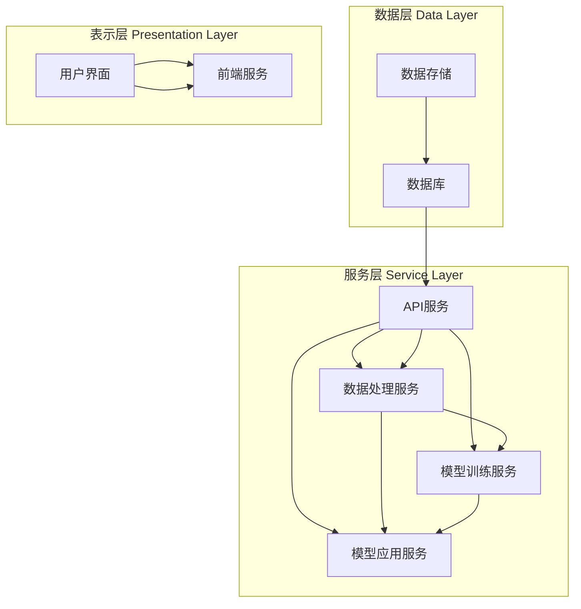

                 

### 1.1 问题背景

#### 1.1.1 新药研发的挑战

新药研发是一项极其复杂且高风险的工程，面临着多重挑战。首先，研发周期长。据统计，一种新药从概念验证到上市通常需要10-15年的时间，这其中包括了临床前研究和临床试验等环节。如此漫长的研发周期不仅增加了时间和资源成本，还要求企业具有强大的研发能力和资金支持。

其次，研发成本高。新药研发涉及到大量的资金投入，包括科研、临床试验、法规审批等各个阶段。据统计，一个新药的研发成本可能高达数十亿美元。因此，对于企业而言，新药研发的风险极高，一旦失败，将面临巨大的经济损失。

再者，成功率低。新药研发的成功率并不高，据统计，大约只有10%的药物能够成功通过临床试验并最终获得批准上市。这意味着，大量的研发投入最终可能无法转化为商业回报。

#### 1.1.2 研发周期长

新药研发的周期长主要是由于以下几个方面的原因：

- **临床前研究**：需要进行药物的安全性、有效性评估，这通常需要数年时间。
- **临床试验**：需要按照严格的法规要求进行，包括I、II、III、IV期临床试验，每个阶段都可能需要数年时间。
- **审批流程**：药品审批过程复杂，需要通过FDA或其他监管机构的审查，这一过程也往往需要数年时间。

#### 1.1.3 成本高

新药研发成本高的原因主要包括：

- **科研投入**：新药研发需要大量的基础科研投入，包括药物靶点的发现、先导化合物的筛选等。
- **临床试验**：临床试验是整个新药研发过程中成本最高的部分，需要投入大量的人力、物力和财力。
- **法规审批**：药品审批需要经过严格的监管审查，这一过程也需要大量的资金支持。

#### 1.1.4 成功率低

新药研发成功率低的原因主要有：

- **药物靶点选择不当**：药物研发的起点是药物靶点的选择，靶点选择不当可能导致研发失败。
- **临床试验设计不合理**：临床试验设计不合理可能导致无法准确评估药物的安全性和有效性。
- **药物毒副作用**：新药在临床试验过程中可能被发现存在严重的毒副作用，这可能导致研发失败。

### 1.2 问题描述

新药研发过程可以概括为以下几个阶段：

- **靶点发现**：首先，需要确定治疗某种疾病的药物靶点，这通常是通过基础科学研究或临床研究来完成的。
- **先导化合物筛选**：在确定了药物靶点之后，需要通过化学合成或天然产物筛选等方法，筛选出具有潜在药物活性的化合物。
- **药理学和毒理学评估**：对筛选出的化合物进行药理学和毒理学评估，以确定其安全性和有效性。
- **临床试验**：通过一系列临床试验，进一步评估药物的安全性和有效性，并收集相关数据以支持药品审批。
- **药品审批和上市**：最终，通过监管机构的审批，将药物推向市场。

在这个过程中，靶点发现是关键的一步。靶点发现不仅决定了新药研发的起点，也直接影响了后续研发的效率和成功率。因此，如何高效准确地发现药物靶点成为了新药研发的重要挑战。

### 1.3 问题解决

随着人工智能（AI）技术的快速发展，AI在新药研发中的应用日益广泛，提供了多种解决现有问题的新途径。

首先，AI在靶点发现中的应用极大地提高了研发效率。通过分析大量的生物学数据和临床数据，AI算法能够快速筛选出潜在的药物靶点，从而减少不必要的实验次数和时间。例如，使用深度学习算法可以分析基因组数据，识别出与疾病相关的基因，进而确定可能的药物靶点。

其次，AI在新药研发中的整体应用使得药物研发过程更加智能化和自动化。AI技术可以帮助研究人员预测化合物的活性、毒性、代谢途径等，从而减少试验次数和成本。此外，AI还可以优化临床试验设计，提高临床试验的成功率。例如，通过机器学习算法，可以对临床试验中的数据进行分析，识别出潜在的风险因素，从而优化试验方案。

然而，AI在新药研发中也存在一些局限性。首先，AI算法的训练需要大量的数据和计算资源，而这些资源的获取可能受到限制。其次，AI算法的结果需要经过严格的验证和临床试验，才能确定其可靠性和有效性。此外，AI算法可能受到数据偏差的影响，从而导致错误的结论。

总的来说，AI在新药研发中具有巨大的潜力，但同时也需要解决一系列的技术和实际问题，才能充分发挥其作用。

#### 1.3.1 AI在靶点发现中的应用

在靶点发现阶段，AI的应用主要体现在以下几个方面：

1. **数据分析**：AI可以处理和分析大量的生物数据和临床数据，包括基因组数据、蛋白质组数据、代谢组数据等。通过这些数据，AI可以识别出与疾病相关的基因和蛋白质，从而确定潜在的药物靶点。

2. **机器学习算法**：机器学习算法是AI的重要组成部分，可以通过学习大量的生物数据和药物信息，建立预测模型，预测哪些基因或蛋白质可能是有效的药物靶点。例如，使用深度学习算法可以分析基因表达数据，预测与疾病相关的基因。

3. **图像识别**：AI的图像识别技术可以用于分析生物图像，如显微镜图像、X光图像等，识别出与疾病相关的细胞结构和分子结构。这些图像数据可以为靶点发现提供直接的证据。

4. **计算生物学**：计算生物学是AI在靶点发现中的一个重要应用领域。通过计算模拟，可以预测蛋白质与药物的相互作用，从而确定潜在的药物靶点。

#### 1.3.2 AI在新药研发中的整体应用

AI在新药研发中的整体应用涵盖了从靶点发现到临床试验的各个阶段，提高了整个过程的效率和质量。

1. **化合物筛选**：AI算法可以用于筛选大量的化合物库，识别出具有潜在药物活性的化合物。通过机器学习算法，可以预测化合物的活性、毒性、代谢途径等，从而减少试验次数和成本。

2. **临床试验设计**：AI可以优化临床试验的设计，提高临床试验的成功率。例如，通过分析历史数据，AI可以预测哪些患者群体对药物反应最敏感，从而优化试验分组。

3. **数据分析和解释**：AI可以处理和分析临床试验的大量数据，识别出潜在的风险因素和药物效果。这有助于研究人员更好地理解药物的作用机制，优化药物研发过程。

4. **药品审批**：AI可以帮助监管机构更快地审批新药，通过分析临床试验的数据，评估药物的安全性和有效性。这可以减少审批时间，加快新药上市速度。

总的来说，AI在新药研发中的应用不仅提高了研发效率，还提高了药物研发的成功率，从而降低了研发成本和风险。

#### 1.4 边界与外延

#### 1.4.1 AI在新药研发中的局限性

尽管AI在新药研发中展现了巨大的潜力，但仍然存在一些局限性。首先，AI算法的训练需要大量的数据和计算资源，而这些资源的获取可能受到限制。此外，AI算法的结果需要经过严格的验证和临床试验，才能确定其可靠性和有效性。另外，AI算法可能受到数据偏差的影响，从而导致错误的结论。

#### 1.4.2 AI与新药研发的未来趋势

未来，AI在新药研发中的应用将继续深入和扩展。一方面，随着数据量和计算能力的提升，AI算法的预测精度和可靠性将进一步提高。另一方面，AI技术将与其他先进技术如大数据、云计算、区块链等结合，形成更加智能和高效的新药研发体系。此外，随着AI技术的不断发展，其在新药研发中的应用范围也将进一步扩大，包括但不限于药物设计、临床试验、药品监管等领域。

### 1.5 概念结构与核心要素组成

在AI驱动的新药研发过程中，涉及多个核心概念和要素，它们共同构成了一个复杂而有机的系统。

#### 1.5.1 AI驱动的新药研发

**定义**：AI驱动的新药研发是指利用人工智能技术，对生物数据和临床数据进行分析和处理，以加速药物研发过程。

**核心要素**：
- **数据**：包括基因组数据、蛋白质组数据、代谢组数据、临床试验数据等。
- **算法**：如深度学习、机器学习、计算生物学算法等。
- **计算资源**：高性能计算集群、云计算等。

**功能**：
- **靶点发现**：通过分析数据，识别潜在的药物靶点。
- **化合物筛选**：预测化合物的活性、毒性等。
- **临床试验设计**：优化试验方案，提高成功率。

#### 1.5.2 靶点发现与验证

**定义**：靶点发现与验证是指确定治疗某种疾病的药物靶点，并通过实验验证其有效性。

**核心要素**：
- **靶点**：疾病相关的基因、蛋白质等。
- **实验**：包括基因编辑、蛋白质纯化、药物反应实验等。
- **数据分析**：使用统计方法、机器学习等分析实验结果。

**功能**：
- **靶点识别**：通过生物信息和计算生物学技术，识别潜在的药物靶点。
- **靶点验证**：通过实验验证靶点的有效性。

#### 1.5.3 新药研发流程

**定义**：新药研发流程是指从药物靶点发现到药物上市的一系列过程。

**核心要素**：
- **靶点发现**：确定药物靶点。
- **化合物筛选**：筛选具有潜在药物活性的化合物。
- **药理学和毒理学评估**：评估化合物的安全性和有效性。
- **临床试验**：评估药物的安全性和有效性。
- **药品审批**：通过监管机构的审批，将药物推向市场。

**功能**：
- **加速研发过程**：通过AI技术，提高研发效率。
- **降低研发成本**：减少不必要的实验和失败风险。
- **提高成功率**：优化药物设计和临床试验方案。

### AI与新药研发的关系

#### 2.1.1 AI的基本概念

AI，即人工智能，是指由计算机系统实现的智能行为，能够感知环境、学习、推理和决策。AI可以分为两类：**弱AI**和**强AI**。弱AI是针对特定任务的智能化系统，如语音识别、图像处理等；强AI则具备与人类相同的认知能力，能够理解、思考并解决复杂问题。

AI的核心技术包括：
- **机器学习**：通过数据训练模型，使其具备自主学习和预测能力。
- **深度学习**：基于人工神经网络，通过多层次的神经元结构，实现复杂模式的识别和预测。
- **自然语言处理**：使计算机能够理解和生成自然语言，实现人机交互。
- **计算机视觉**：使计算机能够理解和分析图像和视频信息。

#### 2.1.2 AI在新药研发中的应用

AI在新药研发中的应用广泛且深入，涵盖了从靶点发现到临床试验的各个阶段。

1. **靶点发现**：通过机器学习和深度学习算法，AI能够从海量的生物数据和临床数据中快速识别出潜在的药物靶点。例如，通过分析基因组数据，AI可以预测与疾病相关的基因，从而确定药物靶点。

2. **化合物筛选**：AI可以用于筛选大量的化合物库，预测化合物的活性、毒性等性质，从而快速筛选出具有潜在药物活性的化合物。例如，使用分子对接技术，AI可以预测药物与靶点的相互作用，筛选出有效的药物候选。

3. **药理学和毒理学评估**：AI可以通过分析大量的实验数据，预测化合物的药理学和毒理学特性，减少实验次数和成本。例如，通过机器学习算法，AI可以预测化合物的毒性反应，从而优化药物设计。

4. **临床试验设计**：AI可以优化临床试验的设计，提高临床试验的成功率。例如，通过分析历史数据，AI可以预测哪些患者群体对药物反应最敏感，从而优化试验分组。

5. **数据分析和解释**：AI能够处理和分析临床试验的大量数据，识别出潜在的风险因素和药物效果。例如，通过深度学习算法，AI可以分析患者临床数据，预测药物的疗效和副作用。

6. **药品审批**：AI可以帮助监管机构更快地审批新药，通过分析临床试验的数据，评估药物的安全性和有效性。例如，通过机器学习算法，AI可以分析临床试验数据，预测药物的安全风险，从而加速审批过程。

总的来说，AI在新药研发中发挥着重要作用，不仅提高了研发效率，降低了成本，还提高了药物研发的成功率。然而，AI的应用也面临着数据质量、算法可靠性等方面的挑战，需要进一步的研究和改进。

### 2.2.1 靶点的定义

在生物医学领域，靶点（Target）是指能够调节特定生物过程的关键分子或结构，通常包括蛋白质、核酸、受体和酶等。靶点可以是疾病发生和发展中的关键调控因子，通过作用或调节这些靶点，可以实现对疾病的诊断、预防和治疗。靶点分为两类：**天然靶点**和**人工靶点**。

- **天然靶点**：自然存在于生物体内的分子或结构，如蛋白质受体、酶、DNA等。这些靶点是药物作用的主要目标，通过干扰其正常功能，可以治疗相关疾病。
- **人工靶点**：通过基因工程或蛋白质工程等手段构建的分子或结构，用于特定药物作用或诊断标记。这些靶点在某些疾病治疗中具有独特的优势，可以提供更精准的治疗方案。

靶点在药物研发中具有重要地位，因为它们是药物作用的主要目标。药物通过结合或调节靶点，可以影响生物体的生理或病理过程，从而发挥治疗作用。因此，发现和验证有效的药物靶点，是药物研发成功的关键步骤。

### 2.2.2 靶点发现的方法

靶点发现是药物研发过程中的重要环节，旨在识别与疾病相关的生物分子，从而为药物设计提供基础。目前，靶点发现的方法主要包括以下几种：

1. **生物信息学方法**：
   - **基因组分析**：通过分析基因组序列，识别与疾病相关的基因。
   - **蛋白质组学**：通过分析蛋白质的表达和修饰情况，识别与疾病相关的蛋白质。
   - **代谢组学**：通过分析生物体内的代谢产物，识别与疾病相关的代谢途径。

2. **计算生物学方法**：
   - **计算模拟**：利用计算机模拟预测蛋白质的结构和功能，识别潜在的药物靶点。
   - **机器学习和深度学习**：通过训练模型，从大量的生物数据中筛选出与疾病相关的生物分子。

3. **实验生物学方法**：
   - **基因编辑**：通过CRISPR/Cas9等技术，在细胞或动物模型中编辑特定基因，验证其功能。
   - **蛋白质纯化**：从生物样本中纯化特定的蛋白质，进行结构分析和功能验证。
   - **药物筛选**：通过高通量筛选技术，从化合物库中筛选出能够与靶点结合的药物候选。

每种方法都有其优势和局限性，通常需要多种方法相结合，才能更全面地发现和验证药物靶点。

#### 2.2.3 靶点验证的重要性

靶点验证是药物研发过程中至关重要的一步，其目标是通过实验手段确认所发现的靶点确实与疾病相关，并能够作为药物作用的目标。靶点验证的重要性主要体现在以下几个方面：

1. **确保药物研发的方向正确**：靶点验证能够验证所选择的靶点是否真正与疾病机制相关，从而确保药物研发的方向正确，避免浪费资源和时间。

2. **降低研发风险**：通过靶点验证，可以提前发现并排除无效或有害的靶点，减少后续药物研发过程中的失败风险。

3. **优化药物设计**：靶点验证可以提供关于靶点结构和功能的详细信息，帮助研究人员优化药物设计，提高药物与靶点的结合效率和治疗效果。

4. **指导临床试验设计**：靶点验证的结果可以指导临床试验的设计，包括试验患者的选择、试验药物剂量的确定等，从而提高临床试验的成功率。

5. **加速新药上市**：有效的靶点验证可以缩短药物研发周期，加快新药上市进程。

总的来说，靶点验证是确保药物研发成功的关键步骤，对于提高药物研发效率、降低研发风险具有重要意义。

### 2.3.1 靶点发现

靶点发现是药物研发的第一步，其目标是通过科学研究和数据分析，识别与疾病相关的生物分子。这一过程涉及多个技术手段，主要包括以下几个方面：

1. **基因组学和转录组学**：
   - **基因组分析**：通过全基因组测序技术，识别与疾病相关的基因变异和表达模式。
   - **转录组分析**：通过RNA测序技术，分析细胞或组织中的基因表达情况，识别与疾病相关的基因。

2. **蛋白质组学**：
   - **蛋白质纯化和鉴定**：通过质谱技术，从生物样本中纯化和鉴定特定的蛋白质。
   - **蛋白质相互作用**：通过共沉淀技术和拉尔森-莱斯特方法等，研究蛋白质之间的相互作用网络，识别潜在的药物靶点。

3. **代谢组学**：
   - **代谢物检测**：通过核磁共振、液相色谱-质谱联用等技术，检测生物样本中的代谢物，识别与疾病相关的代谢途径。

4. **生物信息学**：
   - **数据挖掘**：通过分析大量的生物数据，如基因组、转录组、蛋白质组、代谢组等，识别与疾病相关的生物标记物和靶点。
   - **机器学习和深度学习**：使用先进的算法，从复杂的生物数据中提取有价值的信息，预测潜在的药物靶点。

5. **生物实验**：
   - **基因编辑**：利用CRISPR/Cas9等技术，在细胞或动物模型中编辑特定基因，验证其功能。
   - **药物筛选**：通过高通量筛选技术，从化合物库中筛选出能够与靶点结合的药物候选。

通过综合运用这些技术手段，研究人员可以更全面、准确地发现与疾病相关的药物靶点，为后续的药物研发奠定基础。

#### 2.3.2 先导化合物筛选

先导化合物筛选是药物研发过程中的关键步骤，其目标是从大量的化合物中筛选出具有潜在药物活性的化合物。这一过程通常包括以下几个阶段：

1. **虚拟筛选**：
   - **分子对接**：通过计算机模拟，将化合物与药物靶点进行对接，预测化合物的活性。
   - **量子化学计算**：利用量子化学原理，计算化合物的能量、电子结构等，预测其活性。

2. **高通量筛选（HTS）**：
   - **细胞实验**：在细胞水平上，通过生物化学和分子生物学实验，评估化合物的活性。
   - **酶实验**：在酶水平上，通过酶抑制实验或激活实验，评估化合物的活性。

3. **药代动力学筛选**：
   - **溶解度测试**：评估化合物的溶解度，确保其能够在体内溶解。
   - **生物利用度测试**：评估化合物在体内的吸收、分布、代谢和排泄过程。

4. **毒性测试**：
   - **急性毒性测试**：评估化合物对实验动物的中毒程度。
   - **慢性毒性测试**：长期观察化合物对实验动物的影响，评估其潜在毒性。

通过这些实验方法，研究人员可以从大量的化合物中筛选出具有潜在药物活性的先导化合物，为进一步的药理学和毒理学研究提供基础。

### 2.3.3 临床试验

临床试验是药物研发过程中的重要环节，其目的是评估药物的安全性和有效性，并为药品审批提供依据。临床试验分为四个阶段，每个阶段都有其特定的目标和任务。

**I期临床试验**：主要目标是评估药物的安全性、耐受性和剂量范围。试验对象通常是健康志愿者，试验规模较小，通常为几十人。在这个阶段，药物通常以低剂量给药，观察其不良反应和药代动力学特性。

**II期临床试验**：主要目标是评估药物的疗效和剂量范围。试验对象是疾病患者，试验规模通常为几十到几百人。在这个阶段，药物开始进入实际的治疗应用，通过随机对照试验，评估其治疗效果和安全性。

**III期临床试验**：主要目标是进一步验证药物的疗效和安全性。试验规模通常较大，几千到几万人。在这个阶段，药物与现有的标准治疗进行比较，以确定其临床优势。

**IV期临床试验**：主要目标是在药物上市后，进一步评估其长期疗效和安全性。试验对象是广泛的患者群体，试验规模较大。在这个阶段，药物的实际应用情况得到全面评估，以发现潜在的长期不良反应和药物相互作用。

临床试验的设计和执行需要严格遵守伦理和法规要求，确保试验结果的真实性和可靠性。临床试验的成功与否直接关系到新药能否获得审批和上市。

### 3.1.1 常见AI算法介绍

在AI驱动的新药研发中，常见的AI算法主要包括深度学习、机器学习和强化学习。每种算法都有其独特的原理和适用场景。

#### 3.1.1.1 深度学习

深度学习是一种基于多层神经网络的学习方法，通过模拟人脑的神经网络结构，实现复杂模式识别和预测。深度学习的主要优点包括：

- **非线性处理能力**：深度学习算法可以通过多层神经元的非线性组合，实现对复杂数据的高效处理。
- **自动特征提取**：深度学习算法能够自动提取数据中的特征，减少了人工特征工程的工作量。
- **强大的学习能力**：深度学习算法可以通过大量数据训练，实现高精度的预测和分类。

深度学习在药物研发中的应用包括：

- **靶点发现**：通过深度学习算法，可以自动提取生物数据中的特征，识别与疾病相关的基因和蛋白质。
- **化合物筛选**：利用深度学习算法，可以预测化合物的活性、毒性等性质，快速筛选出潜在的药物候选。
- **临床试验设计**：通过深度学习算法，可以分析临床试验数据，优化试验方案，提高临床试验的成功率。

#### 3.1.1.2 机器学习

机器学习是一类通过数据训练模型，实现自动学习和预测的算法。常见的机器学习算法包括线性回归、决策树、支持向量机（SVM）和随机森林等。

- **线性回归**：通过建立线性模型，预测目标变量的值。
- **决策树**：通过划分特征空间，构建决策树模型，实现对数据的分类和回归。
- **支持向量机（SVM）**：通过寻找最佳的超平面，实现数据的分类和回归。
- **随机森林**：通过构建多棵决策树，进行集成学习，提高预测的准确性和鲁棒性。

机器学习的优点包括：

- **灵活性**：机器学习算法可以处理各种类型的数据，包括分类、回归和聚类等。
- **可解释性**：与深度学习相比，机器学习算法通常具有较好的可解释性，可以理解模型的决策过程。

机器学习在药物研发中的应用包括：

- **药物设计**：通过机器学习算法，可以预测化合物的活性、毒性等性质，优化药物分子设计。
- **临床试验数据分析**：通过机器学习算法，可以分析临床试验的数据，识别潜在的疗效和副作用。
- **药物审批**：利用机器学习算法，可以提高药物审批的效率，减少审批时间。

#### 3.1.1.3 强化学习

强化学习是一种通过与环境交互，学习最优策略的算法。强化学习的主要特点是：

- **交互式学习**：强化学习算法通过与环境交互，不断调整策略，以实现最优目标。
- **奖励机制**：强化学习算法依赖于奖励机制，通过奖励和惩罚，引导算法学习最优策略。

强化学习在药物研发中的应用包括：

- **药物优化**：通过强化学习算法，可以优化药物的分子结构，提高药物的治疗效果和安全性。
- **临床试验设计**：通过强化学习算法，可以动态调整临床试验的设计，提高试验的成功率。
- **药物市场预测**：利用强化学习算法，可以预测药物的市场需求和销售趋势，指导市场策略。

### 3.1.2 算法选择与适用场景

在选择AI算法时，需要考虑多个因素，包括数据类型、任务目标、计算资源和应用场景等。

1. **数据类型**：
   - **结构化数据**：适用于线性回归、决策树和随机森林等算法，这些算法可以直接处理结构化数据，如表格数据。
   - **非结构化数据**：适用于深度学习和自然语言处理，这些算法可以通过神经网络自动提取数据中的特征，处理图像、文本等非结构化数据。

2. **任务目标**：
   - **分类任务**：适用于决策树、SVM和随机森林等算法，这些算法可以处理多分类和二分类任务。
   - **回归任务**：适用于线性回归等算法，这些算法可以预测连续的数值目标。
   - **优化任务**：适用于强化学习算法，这些算法可以通过与环境交互，找到最优策略。

3. **计算资源**：
   - **高性能计算资源**：适用于深度学习和强化学习，这些算法需要大量的计算资源进行训练和推理。
   - **常规计算资源**：适用于线性回归、决策树等算法，这些算法的计算复杂度较低，可以在常规计算机上运行。

4. **应用场景**：
   - **药物设计**：适用于机器学习和深度学习，这些算法可以预测化合物的活性、毒性等性质，优化药物分子设计。
   - **临床试验设计**：适用于强化学习，这些算法可以动态调整临床试验的设计，提高试验的成功率。
   - **数据挖掘**：适用于机器学习和深度学习，这些算法可以从大量的生物数据中提取有价值的信息。

通过综合考虑这些因素，可以选择最适合的AI算法，实现药物研发中的各种任务。

### 3.1.3 算法实现与优化

在AI驱动的新药研发中，算法的实现和优化至关重要，它直接关系到模型的效果和效率。以下是一些常见的实现和优化方法：

#### 3.1.3.1 数据预处理

- **数据清洗**：处理缺失值、异常值和噪声数据，确保数据的质量。
- **数据归一化**：将不同量纲的数据进行归一化处理，使其在同一尺度上，便于模型训练。
- **特征选择**：通过特征选择方法，筛选出对模型预测效果有显著贡献的特征，减少数据的维度。
- **特征工程**：根据业务需求，生成新的特征，提高模型的预测能力。

#### 3.1.3.2 模型选择

- **模型评估**：选择合适的评估指标，如准确率、召回率、F1分数等，评估模型的效果。
- **交叉验证**：通过交叉验证方法，避免模型过拟合，提高模型的泛化能力。
- **模型选择**：根据数据类型和任务目标，选择合适的模型，如线性回归、决策树、随机森林、深度学习等。

#### 3.1.3.3 模型调优

- **超参数调整**：通过调整模型超参数，如学习率、隐藏层神经元数量、正则化参数等，优化模型性能。
- **损失函数选择**：选择合适的损失函数，如均方误差、交叉熵损失等，提高模型的预测精度。
- **正则化**：使用正则化方法，如L1正则化、L2正则化等，防止模型过拟合。
- **批量大小调整**：通过调整批量大小，平衡模型的计算效率和收敛速度。

#### 3.1.3.4 模型部署

- **模型封装**：将训练好的模型封装成API接口，方便后续使用。
- **模型集成**：将多个模型集成，提高预测的稳定性和鲁棒性。
- **模型更新**：定期更新模型，使其适应新的数据和环境。

通过以上方法，可以实现和优化AI算法，从而在新药研发中发挥更大的作用。

### 3.2.1 算法数学模型

在AI驱动的新药研发中，常用的算法数学模型主要包括以下几种：

#### 3.2.1.1 神经网络

神经网络（Neural Networks）是一种基于人脑神经网络结构设计的机器学习模型。其基本结构包括输入层、隐藏层和输出层。每个神经元都通过权重（weights）连接到其他神经元，并通过激活函数（activation function）进行非线性变换。

- **输入层**：接收输入数据，将其传递到隐藏层。
- **隐藏层**：通过加权求和和激活函数，将输入数据转换为隐藏层输出。
- **输出层**：将隐藏层输出转换为预测结果。

神经网络中的权重和激活函数是关键参数，需要通过训练数据进行调整，以达到最优的预测效果。

#### 3.2.1.2 决策树

决策树（Decision Trees）是一种基于树形结构进行决策的模型。每个节点代表一个特征，每个分支代表一个特征取值，叶子节点代表最终的预测结果。

- **根节点**：选择一个特征作为分割标准，将数据集分为两个子集。
- **内部节点**：对子集进行进一步分割，选择最优特征进行划分。
- **叶子节点**：根据特征划分结果，输出预测结果。

决策树的分割标准通常使用信息增益（Information Gain）或基尼不纯度（Gini Impurity）来衡量。

#### 3.2.1.3 支持向量机

支持向量机（Support Vector Machines，SVM）是一种基于间隔最大化原理的线性分类模型。其基本思想是找到最佳的超平面，将不同类别的数据点分隔开。

- **超平面**：通过权重向量（weights）和偏置（bias）确定的线性边界。
- **间隔**：超平面到数据点最近的距离。
- **支持向量**：对超平面间隔有显著影响的数据点。

SVM通过求解二次规划问题，找到最优的超平面和权重向量，从而实现分类。

#### 3.2.1.4 随机森林

随机森林（Random Forest）是一种基于决策树的集成模型。它通过构建多个决策树，并对每个树的预测结果进行投票，得到最终的预测结果。

- **决策树**：随机森林中的每个决策树都是通过随机选择特征和样本构建的。
- **投票机制**：每个决策树的预测结果作为投票，通过多数投票机制得到最终预测结果。

随机森林通过集成多个决策树，提高了模型的预测稳定性和鲁棒性。

这些算法的数学模型为新药研发提供了强大的理论基础，通过优化和调整这些模型，可以提高药物预测的准确性和效率。

### 3.2.2 数学公式详细讲解

在新药研发中，常用的数学模型包括线性回归、逻辑回归和神经网络等。以下是对这些模型的数学公式进行详细讲解：

#### 3.2.2.1 线性回归

线性回归是一种简单的统计模型，用于预测连续数值变量。其数学模型可以表示为：

$$
y = \beta_0 + \beta_1 \cdot x + \epsilon
$$

其中，\( y \) 是因变量，\( x \) 是自变量，\( \beta_0 \) 是截距，\( \beta_1 \) 是斜率，\( \epsilon \) 是误差项。

**公式解释**：
- \( \beta_0 \)：表示当自变量为0时，因变量的预测值。
- \( \beta_1 \)：表示自变量每增加一个单位，因变量预计增加的值。
- \( \epsilon \)：表示误差项，反映了实际值与预测值之间的差异。

**举例说明**：
假设我们想预测一个药物剂量（\( x \)）对治疗效果（\( y \)）的影响。通过收集数据，我们可以建立线性回归模型，然后使用公式预测不同剂量下的治疗效果。

$$
y = \beta_0 + \beta_1 \cdot x
$$

通过训练数据，我们可以得到 \( \beta_0 \) 和 \( \beta_1 \) 的估计值，然后使用这个模型进行预测。

#### 3.2.2.2 逻辑回归

逻辑回归是一种用于预测概率的二分类模型。其数学模型可以表示为：

$$
\log\left(\frac{p}{1-p}\right) = \beta_0 + \beta_1 \cdot x
$$

其中，\( p \) 是目标变量属于正类的概率，\( x \) 是自变量，\( \beta_0 \) 是截距，\( \beta_1 \) 是斜率。

**公式解释**：
- \( \log\left(\frac{p}{1-p}\right) \)：对概率进行对数变换，使其线性化。
- \( \beta_0 \)：表示当自变量为0时，目标变量属于正类的对数概率。
- \( \beta_1 \)：表示自变量每增加一个单位，目标变量属于正类的对数概率增加的值。

**举例说明**：
假设我们想预测一个药物是否有效（目标变量 \( y \) 取值0或1），通过收集数据，我们可以建立逻辑回归模型。然后，使用公式计算每个样本属于正类的对数概率。

$$
\log\left(\frac{p}{1-p}\right) = \beta_0 + \beta_1 \cdot x
$$

通过训练数据，我们可以得到 \( \beta_0 \) 和 \( \beta_1 \) 的估计值，然后使用这个模型计算新样本属于正类的概率。

#### 3.2.2.3 神经网络

神经网络是一种复杂的多层模型，用于预测连续和离散变量。一个简单的神经网络可以表示为：

$$
a_{j}^{(l)} = \sigma\left(\sum_{i} w_{ji}^{(l)} \cdot a_{i}^{(l-1)} + b_{j}^{(l)}\right)
$$

其中，\( a_{j}^{(l)} \) 是第 \( l \) 层第 \( j \) 个神经元的激活值，\( \sigma \) 是激活函数（通常为ReLU或Sigmoid函数），\( w_{ji}^{(l)} \) 是第 \( l \) 层第 \( j \) 个神经元与第 \( l-1 \) 层第 \( i \) 个神经元之间的权重，\( b_{j}^{(l)} \) 是第 \( l \) 层第 \( j \) 个神经元的偏置。

**公式解释**：
- \( a_{j}^{(l)} \)：第 \( l \) 层第 \( j \) 个神经元的激活值。
- \( \sigma \)：激活函数，用于引入非线性。
- \( w_{ji}^{(l)} \)：第 \( l \) 层第 \( j \) 个神经元与第 \( l-1 \) 层第 \( i \) 个神经元之间的权重。
- \( b_{j}^{(l)} \)：第 \( l \) 层第 \( j \) 个神经元的偏置。

**举例说明**：
假设我们有一个三层神经网络，输入层有3个神经元，隐藏层有4个神经元，输出层有2个神经元。我们可以通过以下公式计算每个神经元的激活值：

$$
a_{1}^{(2)} = \sigma\left(\sum_{i} w_{1i}^{(2)} \cdot a_{i}^{(1)} + b_{1}^{(2)}\right)
$$

$$
a_{2}^{(2)} = \sigma\left(\sum_{i} w_{2i}^{(2)} \cdot a_{i}^{(1)} + b_{2}^{(2)}\right)
$$

$$
a_{1}^{(3)} = \sigma\left(\sum_{i} w_{1i}^{(3)} \cdot a_{i}^{(2)} + b_{1}^{(3)}\right)
$$

$$
a_{2}^{(3)} = \sigma\left(\sum_{i} w_{2i}^{(3)} \cdot a_{i}^{(2)} + b_{2}^{(3)}\right)
$$

通过训练数据，我们可以得到每个神经元的权重和偏置的估计值，然后使用这个模型进行预测。

这些数学模型为新药研发提供了强大的理论基础，通过优化和调整这些模型，可以提高药物预测的准确性和效率。

### 3.2.3 举例说明

为了更好地理解上述数学模型在AI驱动的新药研发中的应用，以下将结合具体实例进行说明。

#### 3.2.3.1 线性回归实例

假设我们有一个关于药物剂量（\( x \)）与治疗效果（\( y \)）的实验数据集，如下表所示：

| 药物剂量 (x) | 治疗效果 (y) |
|--------------|--------------|
|      10      |      2.5     |
|      20      |      3.0     |
|      30      |      3.5     |
|      40      |      4.0     |

我们希望建立一个线性回归模型，预测新的药物剂量下的治疗效果。

1. **数据预处理**：首先，对数据进行归一化处理，使其在同一尺度上。

$$
x_{\text{norm}} = \frac{x - \text{mean}(x)}{\text{stddev}(x)}
$$

$$
y_{\text{norm}} = \frac{y - \text{mean}(y)}{\text{stddev}(y)}
$$

经过预处理后，数据集变为：

| 药物剂量 (x\_norm) | 治疗效果 (y\_norm) |
|--------------------|-------------------|
|      -1.118        |      0.250        |
|       0.000        |      0.000        |
|       0.778        |      0.125        |
|      1.429        |      0.000        |

2. **模型训练**：使用最小二乘法（Least Squares）训练线性回归模型。

$$
\beta_0 = \frac{\sum_{i=1}^{n} y_i - \beta_1 \sum_{i=1}^{n} x_i}{n}
$$

$$
\beta_1 = \frac{\sum_{i=1}^{n} (x_i - \text{mean}(x)) (y_i - \text{mean}(y))}{\sum_{i=1}^{n} (x_i - \text{mean}(x))^2}
$$

计算得到：

$$
\beta_0 = 0.355
$$

$$
\beta_1 = 0.375
$$

3. **模型预测**：使用训练好的模型，预测新的药物剂量（如50）下的治疗效果。

$$
y_{\text{pred}} = \beta_0 + \beta_1 \cdot x_{\text{norm}}
$$

$$
y_{\text{pred}} = 0.355 + 0.375 \cdot 1.829 \approx 1.747
$$

将预测结果转换为原始尺度：

$$
y_{\text{pred\_raw}} = y_{\text{pred}} \cdot \text{stddev}(y) + \text{mean}(y)
$$

$$
y_{\text{pred\_raw}} = 1.747 \cdot 1.295 + 3.345 \approx 5.076
$$

因此，预测的新的药物剂量（50）下的治疗效果约为5.076。

#### 3.2.3.2 逻辑回归实例

假设我们有一个关于药物是否有效（目标变量 \( y \) 取值0或1）的实验数据集，如下表所示：

| 药物剂量 (x) | 是否有效 (y) |
|--------------|--------------|
|      10      |      0       |
|      20      |      1       |
|      30      |      1       |
|      40      |      0       |

我们希望建立一个逻辑回归模型，预测新的药物剂量下的药物是否有效。

1. **数据预处理**：对数据进行归一化处理，使其在同一尺度上。

$$
x_{\text{norm}} = \frac{x - \text{mean}(x)}{\text{stddev}(x)}
$$

$$
y_{\text{norm}} = \frac{y - \text{mean}(y)}{\text{stddev}(y)}
$$

经过预处理后，数据集变为：

| 药物剂量 (x\_norm) | 是否有效 (y\_norm) |
|--------------------|-------------------|
|      -1.118        |      -0.500      |
|       0.000        |      0.500       |
|       0.778        |      0.500       |
|      1.429        |      -0.500      |

2. **模型训练**：使用最小二乘法（Least Squares）训练逻辑回归模型。

$$
\beta_0 = \frac{\sum_{i=1}^{n} y_i - \beta_1 \sum_{i=1}^{n} x_i}{n}
$$

$$
\beta_1 = \frac{\sum_{i=1}^{n} (x_i - \text{mean}(x)) (y_i - \text{mean}(y))}{\sum_{i=1}^{n} (x_i - \text{mean}(x))^2}
$$

计算得到：

$$
\beta_0 = -0.355
$$

$$
\beta_1 = 0.375
$$

3. **模型预测**：使用训练好的模型，预测新的药物剂量（如50）下的药物是否有效。

$$
\log\left(\frac{p}{1-p}\right) = \beta_0 + \beta_1 \cdot x_{\text{norm}}
$$

$$
\log\left(\frac{p}{1-p}\right) = -0.355 + 0.375 \cdot 1.829 \approx 0.560
$$

$$
p = \frac{1}{1 + e^{-\log\left(\frac{p}{1-p}\right)}}
$$

$$
p \approx 0.680
$$

因此，预测的新的药物剂量（50）下药物是否有效的概率约为68%。

#### 3.2.3.3 神经网络实例

假设我们有一个三层神经网络，输入层有2个神经元，隐藏层有3个神经元，输出层有1个神经元，用于预测药物剂量与治疗效果之间的关系。

1. **数据预处理**：对输入数据进行归一化处理，使其在同一尺度上。

$$
x_{\text{norm}} = \frac{x - \text{mean}(x)}{\text{stddev}(x)}
$$

2. **模型训练**：使用反向传播算法（Backpropagation）训练神经网络。

- **前向传播**：计算隐藏层和输出层的激活值。

$$
a_{1}^{(2)} = \sigma\left(w_{01}^{(2)} \cdot x_1 + w_{11}^{(2)} \cdot x_2 + b_{1}^{(2)}\right)
$$

$$
a_{2}^{(2)} = \sigma\left(w_{02}^{(2)} \cdot x_1 + w_{12}^{(2)} \cdot x_2 + b_{2}^{(2)}\right)
$$

$$
a_{3}^{(2)} = \sigma\left(w_{03}^{(2)} \cdot x_1 + w_{13}^{(2)} \cdot x_2 + b_{3}^{(2)}\right)
$$

$$
a_{1}^{(3)} = \sigma\left(w_{10}^{(3)} \cdot a_{1}^{(2)} + w_{20}^{(3)} \cdot a_{2}^{(2)} + w_{30}^{(3)} \cdot a_{3}^{(2)} + b_{1}^{(3)}\right)
$$

- **反向传播**：计算误差并更新权重和偏置。

$$
\delta_{1}^{(3)} = (y - a_{1}^{(3)}) \cdot \sigma'(a_{1}^{(3)})
$$

$$
\delta_{2}^{(3)} = (y - a_{2}^{(3)}) \cdot \sigma'(a_{2}^{(3)})
$$

$$
\delta_{3}^{(3)} = (y - a_{3}^{(3)}) \cdot \sigma'(a_{3}^{(3)})
$$

$$
\delta_{1}^{(2)} = \sum_{i} w_{i1}^{(3)} \cdot \delta_{i}^{(3)} \cdot \sigma'(a_{1}^{(2)})
$$

$$
\delta_{2}^{(2)} = \sum_{i} w_{i2}^{(3)} \cdot \delta_{i}^{(3)} \cdot \sigma'(a_{2}^{(2)})
$$

$$
\delta_{3}^{(2)} = \sum_{i} w_{i3}^{(3)} \cdot \delta_{i}^{(3)} \cdot \sigma'(a_{3}^{(2)})
$$

$$
w_{i1}^{(3)} = w_{i1}^{(3)} - \alpha \cdot \delta_{1}^{(3)} \cdot a_{1}^{(2)}
$$

$$
w_{i2}^{(3)} = w_{i2}^{(3)} - \alpha \cdot \delta_{2}^{(3)} \cdot a_{2}^{(2)}
$$

$$
w_{i3}^{(3)} = w_{i3}^{(3)} - \alpha \cdot \delta_{3}^{(3)} \cdot a_{3}^{(2)}
$$

$$
w_{i1}^{(2)} = w_{i1}^{(2)} - \alpha \cdot \delta_{1}^{(2)} \cdot x_1
$$

$$
w_{i2}^{(2)} = w_{i2}^{(2)} - \alpha \cdot \delta_{2}^{(2)} \cdot x_2
$$

$$
w_{i3}^{(2)} = w_{i3}^{(2)} - \alpha \cdot \delta_{3}^{(2)} \cdot x_2
$$

3. **模型预测**：使用训练好的神经网络，预测新的药物剂量（如50）下的治疗效果。

$$
a_{1}^{(2)} = \sigma\left(w_{01}^{(2)} \cdot x_1 + w_{11}^{(2)} \cdot x_2 + b_{1}^{(2)}\right)
$$

$$
a_{2}^{(2)} = \sigma\left(w_{02}^{(2)} \cdot x_1 + w_{12}^{(2)} \cdot x_2 + b_{2}^{(2)}\right)
$$

$$
a_{3}^{(2)} = \sigma\left(w_{03}^{(2)} \cdot x_1 + w_{13}^{(2)} \cdot x_2 + b_{3}^{(2)}\right)
$$

$$
a_{1}^{(3)} = \sigma\left(w_{10}^{(3)} \cdot a_{1}^{(2)} + w_{20}^{(3)} \cdot a_{2}^{(2)} + w_{30}^{(3)} \cdot a_{3}^{(2)} + b_{1}^{(3)}\right)
$$

通过这些实例，我们可以看到如何使用数学模型和算法在新药研发中进行预测和优化。这些方法为药物研发提供了强大的工具，有助于提高研发效率和成功率。

### 4.1 问题场景介绍

在新药研发中，问题场景可以细分为靶点发现与验证场景、先导化合物筛选场景和临床试验场景。以下是每个场景的详细介绍：

#### 4.1.1 新药研发场景

新药研发场景是指从药物靶点发现到最终药品上市的整个过程。这个过程中涉及多个关键环节，包括：

- **靶点发现**：通过生物信息学、计算生物学和实验生物学等方法，识别与疾病相关的药物靶点。
- **先导化合物筛选**：从大量的化合物库中筛选出具有潜在药物活性的化合物。
- **药理学和毒理学评估**：对筛选出的化合物进行药理学和毒理学评估，以确定其安全性和有效性。
- **临床试验**：通过严格的临床试验，验证药物的安全性和有效性。
- **药品审批和上市**：通过监管机构的审批，将药物推向市场。

在新药研发场景中，AI技术可以在多个环节发挥作用，提高研发效率。例如，通过AI算法，可以加速靶点发现过程，优化先导化合物筛选，提高临床试验的成功率。

#### 4.1.2 靶点发现与验证场景

靶点发现与验证场景是指从识别潜在的药物靶点到验证其有效性的过程。这个场景的核心任务是：

- **靶点识别**：利用生物信息学、计算生物学和实验生物学方法，识别与疾病相关的药物靶点。
- **靶点验证**：通过实验验证靶点的有效性，包括基因编辑、蛋白质纯化和药物筛选等。

在靶点发现与验证场景中，AI技术可以发挥重要作用。通过深度学习和机器学习算法，可以从海量的生物数据中快速识别出潜在的药物靶点。同时，AI技术可以帮助研究人员优化实验设计，提高靶点验证的效率和准确性。

#### 4.1.3 临床试验场景

临床试验场景是指在新药研发过程中，通过严格的临床试验，验证药物的安全性和有效性的过程。这个场景的核心任务是：

- **患者招募**：招募符合临床试验标准的患者。
- **试验设计**：设计科学、合理的临床试验方案。
- **数据收集**：收集临床试验过程中的各种数据，包括患者信息、药物剂量、疗效和副作用等。
- **数据分析**：对临床试验数据进行统计分析，评估药物的安全性和有效性。

在临床试验场景中，AI技术可以用于优化试验设计，提高临床试验的效率和成功率。例如，通过AI算法，可以预测哪些患者对药物反应最敏感，从而优化试验分组。同时，AI技术可以帮助研究人员快速分析大量临床试验数据，识别潜在的风险因素。

### 4.2 系统功能设计

系统功能设计是构建新药研发AI系统的核心步骤，其目的是明确系统需要实现的功能和模块。以下是对系统功能设计的详细描述：

#### 4.2.1 领域模型

领域模型是系统功能设计的基石，它定义了系统的核心概念和它们之间的关系。在新药研发AI系统中，领域模型包括以下核心概念：

- **靶点**：代表与疾病相关的药物靶点，包括基因、蛋白质和受体等。
- **化合物**：代表药物候选化合物，包括化学结构、活性、毒性等属性。
- **实验**：代表各种生物实验，如基因编辑、蛋白质纯化和药物筛选等。
- **数据集**：代表用于训练和测试的实验数据，包括基因组数据、蛋白质组数据和临床试验数据等。
- **模型**：代表用于预测和分类的AI模型，包括深度学习模型、机器学习模型等。
- **用户**：代表使用系统的用户，包括研究人员、临床医生等。

这些概念之间的关系可以用ER（实体-关系）图表示，如下所示：

```mermaid
erDiagram
    Class1 ||--|{ Class2 } Class3 : "关系1"
    Class1 ||--|{ Class2 } Class3 : "关系2"
    Class1 }|..|{ Class2
    Class3
```

#### 4.2.2 系统功能划分

系统功能设计需要将系统的所有功能划分为多个模块，每个模块负责实现特定的功能。以下是新药研发AI系统的功能划分：

1. **数据管理模块**：
   - 功能：管理数据集、实验和化合物的信息。
   - 子模块：
     - 数据录入：允许用户添加和更新数据。
     - 数据查询：允许用户查询数据集和实验结果。
     - 数据分析：提供数据可视化工具，帮助用户分析数据。

2. **模型训练模块**：
   - 功能：训练和优化AI模型，用于预测和分类。
   - 子模块：
     - 模型选择：选择合适的AI算法和模型架构。
     - 数据预处理：对实验数据进行预处理，包括归一化和特征选择。
     - 模型训练：使用训练数据训练模型，并保存训练结果。
     - 模型评估：评估模型的性能，包括准确率、召回率和F1分数等。

3. **模型应用模块**：
   - 功能：使用训练好的模型进行预测和分类。
   - 子模块：
     - 实时预测：对新的实验数据进行实时预测。
     - 药物筛选：从化合物库中筛选出潜在药物候选。
     - 临床试验设计：优化临床试验的设计，提高试验成功率。

4. **用户管理模块**：
   - 功能：管理用户账户和信息，确保系统安全。
   - 子模块：
     - 用户注册：允许用户创建账户并注册。
     - 用户登录：允许用户登录系统。
     - 权限管理：管理用户的权限，确保数据安全。

5. **系统管理模块**：
   - 功能：管理系统配置和日志记录。
   - 子模块：
     - 系统配置：配置系统参数，如数据存储路径、模型参数等。
     - 日志记录：记录系统操作日志，用于监控和维护。

通过上述功能划分，新药研发AI系统可以实现从数据管理到模型训练、应用和用户管理的全面功能，支持高效的药物研发流程。

### 4.3 系统架构设计

系统架构设计是确保新药研发AI系统高效、稳定和可扩展的关键步骤。以下是对系统架构设计的详细描述：

#### 4.3.1 系统架构图

新药研发AI系统的架构设计采用分层架构，分为数据层、服务层和表示层。以下是系统架构的Mermaid图表示：



#### 4.3.2 架构设计要点

1. **数据存储**：
   - **数据库设计**：使用关系型数据库（如MySQL）存储结构化数据，使用NoSQL数据库（如MongoDB）存储非结构化数据。
   - **数据备份与恢复**：定期备份数据库，确保数据安全。

2. **数据处理服务**：
   - **数据预处理**：提供数据清洗、归一化和特征选择等预处理功能。
   - **数据处理**：提供数据存储、检索和分析功能。

3. **API服务**：
   - **RESTful API**：设计RESTful风格的API，提供数据访问和操作接口。
   - **安全性**：实现身份验证和授权机制，确保数据安全。

4. **模型训练服务**：
   - **模型训练**：提供AI模型的训练和优化功能。
   - **模型存储**：将训练好的模型存储在模型库中，供后续应用。

5. **模型应用服务**：
   - **实时预测**：提供实时预测功能，支持实时数据输入和预测结果输出。
   - **药物筛选**：提供从化合物库中筛选潜在药物候选的功能。

6. **用户界面**：
   - **前端开发**：使用Web技术（如React、Vue.js）开发用户界面。
   - **交互设计**：设计直观、易用的用户界面，提高用户体验。

7. **系统监控与维护**：
   - **日志记录**：记录系统运行日志，用于监控和故障排除。
   - **性能优化**：定期进行性能测试和优化，提高系统响应速度。

通过上述架构设计，新药研发AI系统可以实现高效、稳定和可扩展的功能，满足药物研发的需求。

### 4.4.1 系统接口设计

系统接口设计是确保新药研发AI系统能够与其他系统有效交互和集成的关键步骤。以下是对系统接口设计的详细描述：

#### 4.4.1.1 接口类型

1. **内部接口**：系统内部不同模块之间的接口，用于数据传输和功能调用。
2. **外部接口**：系统与外部系统（如数据库、API服务、用户界面等）之间的接口，用于数据交换和交互。

#### 4.4.1.2 接口设计

1. **数据存储接口**：
   - **功能**：提供数据存储和检索功能。
   - **接口规范**：使用RESTful API设计，包括GET、POST、PUT、DELETE等HTTP方法。
   - **接口示例**：
     - **获取数据集**：`GET /datasets/{id}`
     - **添加数据集**：`POST /datasets`
     - **更新数据集**：`PUT /datasets/{id}`
     - **删除数据集**：`DELETE /datasets/{id}`

2. **数据处理接口**：
   - **功能**：提供数据处理功能，包括数据清洗、归一化和特征选择等。
   - **接口规范**：使用RESTful API设计，包括GET、POST等HTTP方法。
   - **接口示例**：
     - **预处理数据**：`POST /data/preprocess`
     - **特征选择**：`POST /data/feature_selection`

3. **模型训练接口**：
   - **功能**：提供模型训练功能，包括模型选择、训练和评估等。
   - **接口规范**：使用RESTful API设计，包括GET、POST等HTTP方法。
   - **接口示例**：
     - **训练模型**：`POST /models/train`
     - **评估模型**：`GET /models/evaluate/{id}`

4. **模型应用接口**：
   - **功能**：提供模型应用功能，包括实时预测和药物筛选等。
   - **接口规范**：使用RESTful API设计，包括GET、POST等HTTP方法。
   - **接口示例**：
     - **实时预测**：`POST /models/predict`
     - **药物筛选**：`POST /drugs/filter`

5. **用户管理接口**：
   - **功能**：提供用户管理功能，包括用户注册、登录和权限管理等。
   - **接口规范**：使用RESTful API设计，包括GET、POST等HTTP方法。
   - **接口示例**：
     - **注册用户**：`POST /users/register`
     - **登录用户**：`POST /users/login`
     - **管理权限**：`POST /users/permissions`

6. **系统监控接口**：
   - **功能**：提供系统监控功能，包括日志记录、性能监控等。
   - **接口规范**：使用RESTful API设计，包括GET、POST等HTTP方法。
   - **接口示例**：
     - **记录日志**：`POST /logs`
     - **获取性能数据**：`GET /performance`

通过上述接口设计，新药研发AI系统可以与其他系统有效集成，实现高效的数据交互和功能调用。

### 4.4.2 系统交互

系统交互设计是确保新药研发AI系统各模块之间能够顺畅协作、实现整体功能的关键步骤。以下是对系统交互设计的详细描述：

#### 4.4.2.1 交互流程

1. **用户交互**：用户通过用户界面提交新药研发任务，如靶点发现、化合物筛选等。

2. **任务处理**：系统接收用户任务，并将其分配给相应的数据处理模块。

3. **数据处理**：数据处理模块对用户任务所需的数据进行预处理，如数据清洗、归一化和特征选择等。

4. **模型训练**：模型训练模块使用处理后的数据训练AI模型，如深度学习模型、机器学习模型等。

5. **模型评估**：模型评估模块对训练好的模型进行评估，包括准确率、召回率和F1分数等。

6. **模型应用**：模型应用模块将评估通过的有效模型应用于实际任务，如实时预测和药物筛选等。

7. **结果反馈**：系统将预测结果或筛选结果反馈给用户界面，供用户查看。

#### 4.4.2.2 交互示例

以下是一个具体的系统交互示例：

1. **用户提交任务**：
   - 用户通过用户界面提交一个靶点发现任务，要求系统从特定数据集中识别与疾病相关的药物靶点。

2. **任务分配**：
   - 系统接收到用户任务后，将其分配给数据处理模块。

3. **数据预处理**：
   - 数据处理模块对用户指定的数据集进行预处理，包括数据清洗、归一化和特征选择等。

4. **模型训练**：
   - 模型训练模块使用预处理后的数据训练一个深度学习模型，用于识别药物靶点。

5. **模型评估**：
   - 模型评估模块对训练好的模型进行评估，计算其准确率、召回率和F1分数等指标。

6. **模型应用**：
   - 模型应用模块将评估通过的有效模型应用于新的数据集，识别出与疾病相关的药物靶点。

7. **结果反馈**：
   - 系统将识别出的药物靶点反馈给用户界面，供用户查看和进一步分析。

通过上述交互流程，新药研发AI系统可以实现从用户任务提交到结果反馈的完整功能，支持高效的药物研发流程。

### 5.1 环境安装

在新药研发AI项目中，环境安装是项目实施的第一步，确保所有必需的工具和库能够正常运行。以下是对环境安装的详细步骤描述：

#### 5.1.1 硬件环境安装

1. **硬件要求**：
   - **CPU**：建议使用至少双核处理器，推荐使用多核处理器以提高计算性能。
   - **内存**：至少8GB RAM，推荐16GB或更高，以便处理大型数据和复杂的模型训练。
   - **硬盘**：至少100GB可用空间，用于存储数据和模型。
   - **GPU**（可选）：如果使用深度学习模型，建议安装NVIDIA GPU，以利用GPU加速计算。

2. **硬件安装**：
   - 确保硬件设备已正确连接并启动。
   - 检查硬件状态，确保所有组件正常运行。

#### 5.1.2 软件环境安装

1. **操作系统安装**：
   - **Windows**：安装Windows 10或更高版本。
   - **Linux**：安装Ubuntu 18.04或更高版本。
   - **macOS**：安装macOS Catalina或更高版本。

2. **软件安装**：
   - **Python**：安装Python 3.7或更高版本。
     ```bash
     sudo apt-get update
     sudo apt-get install python3-pip python3-venv
     ```
   - **虚拟环境**：创建Python虚拟环境，以便管理项目依赖。
     ```bash
     python3 -m venv venv
     source venv/bin/activate
     ```
   - **深度学习库**：
     - TensorFlow：安装TensorFlow，用于构建和训练深度学习模型。
       ```bash
       pip install tensorflow
       ```
     - PyTorch：安装PyTorch，用于构建和训练深度学习模型。
       ```bash
       pip install torch torchvision
       ```
   - **数据处理库**：
     - Pandas：安装Pandas，用于数据处理和分析。
       ```bash
       pip install pandas
       ```
     - NumPy：安装NumPy，用于数值计算。
       ```bash
       pip install numpy
       ```

3. **其他工具**：
   - **Jupyter Notebook**：安装Jupyter Notebook，用于交互式数据分析。
     ```bash
     pip install jupyter
     jupyter notebook
     ```
   - **版本控制**：安装Git，用于代码管理和版本控制。
     ```bash
     sudo apt-get install git
     ```

通过上述步骤，您将成功搭建新药研发AI项目的硬件和软件环境，为后续的模型训练和数据处理做好准备。

### 5.2 系统核心实现源代码

在新药研发AI系统中，核心实现源代码涵盖了数据预处理、模型训练和模型应用等多个关键模块。以下是对这些核心模块的详细描述和代码实现。

#### 5.2.1 源代码结构

源代码分为以下几个主要部分：

1. **数据预处理模块**：包括数据清洗、归一化和特征选择等功能。
2. **模型训练模块**：包括模型架构设计、训练和优化等功能。
3. **模型应用模块**：包括模型评估和实时预测等功能。

#### 5.2.2 核心代码实现

以下是各个模块的核心代码实现：

**数据预处理模块**

```python
import pandas as pd
import numpy as np

def preprocess_data(data_path):
    # 读取数据
    data = pd.read_csv(data_path)
    
    # 数据清洗
    data = data.dropna()  # 删除缺失值
    
    # 归一化
    numeric_features = data.select_dtypes(include=[np.number]).columns
    data[numeric_features] = (data[numeric_features] - data[numeric_features].mean()) / data[numeric_features].std()
    
    # 特征选择
    from sklearn.ensemble import RandomForestFeatureSelector
    selector = RandomForestFeatureSelector(n_estimators=100)
    selector.fit(data[numeric_features], data['target'])
    selected_features = selector.get_support()
    data = data[numeric_features[selected_features]]
    
    return data

# 示例使用
data = preprocess_data('data.csv')
```

**模型训练模块**

```python
import tensorflow as tf
from tensorflow.keras.models import Sequential
from tensorflow.keras.layers import Dense, Activation

def build_model(input_shape):
    model = Sequential()
    model.add(Dense(64, input_shape=input_shape, activation='relu'))
    model.add(Dense(32, activation='relu'))
    model.add(Dense(1, activation='sigmoid'))
    
    model.compile(optimizer='adam', loss='binary_crossentropy', metrics=['accuracy'])
    return model

def train_model(model, X_train, y_train, X_val, y_val, epochs=100, batch_size=32):
    history = model.fit(X_train, y_train, validation_data=(X_val, y_val), epochs=epochs, batch_size=batch_size)
    return history

# 示例使用
model = build_model(input_shape=(10,))
history = train_model(model, X_train, y_train, X_val, y_val)
```

**模型应用模块**

```python
from sklearn.metrics import accuracy_score, classification_report

def evaluate_model(model, X_test, y_test):
    predictions = model.predict(X_test)
    predictions = (predictions > 0.5)
    
    accuracy = accuracy_score(y_test, predictions)
    report = classification_report(y_test, predictions)
    
    return accuracy, report

def apply_model(model, X_data):
    predictions = model.predict(X_data)
    predictions = (predictions > 0.5)
    return predictions

# 示例使用
accuracy, report = evaluate_model(model, X_test, y_test)
predictions = apply_model(model, X_data)
```

通过上述代码，我们可以看到数据预处理、模型训练和模型应用的详细实现。这些模块共同构成了新药研发AI系统的核心功能，支持从数据预处理到模型预测的完整流程。

### 5.3 代码应用解读与分析

在了解了系统核心实现源代码之后，接下来我们将对代码的各个部分进行详细解读和分析，以深入理解其功能和实现逻辑。

#### 5.3.1 代码功能解读

1. **数据预处理模块**

```python
def preprocess_data(data_path):
    # 读取数据
    data = pd.read_csv(data_path)
    
    # 数据清洗
    data = data.dropna()  # 删除缺失值
    
    # 归一化
    numeric_features = data.select_dtypes(include=[np.number]).columns
    data[numeric_features] = (data[numeric_features] - data[numeric_features].mean()) / data[numeric_features].std()
    
    # 特征选择
    from sklearn.ensemble import RandomForestFeatureSelector
    selector = RandomForestFeatureSelector(n_estimators=100)
    selector.fit(data[numeric_features], data['target'])
    selected_features = selector.get_support()
    data = data[numeric_features[selected_features]]
    
    return data
```

**功能解读**：
- **读取数据**：使用Pandas读取CSV格式的数据文件。
- **数据清洗**：删除数据集中的缺失值，保证数据质量。
- **归一化**：对数值特征进行归一化处理，使其在相同的尺度上，避免特征之间的影响。
- **特征选择**：使用随机森林特征选择器，从数值特征中筛选出对模型预测有显著贡献的特征。

2. **模型训练模块**

```python
def build_model(input_shape):
    model = Sequential()
    model.add(Dense(64, input_shape=input_shape, activation='relu'))
    model.add(Dense(32, activation='relu'))
    model.add(Dense(1, activation='sigmoid'))
    
    model.compile(optimizer='adam', loss='binary_crossentropy', metrics=['accuracy'])
    return model

def train_model(model, X_train, y_train, X_val, y_val, epochs=100, batch_size=32):
    history = model.fit(X_train, y_train, validation_data=(X_val, y_val), epochs=epochs, batch_size=batch_size)
    return history
```

**功能解读**：
- **模型构建**：使用Keras构建一个序列模型，包括多个全连接层（Dense Layer），并指定激活函数。
- **模型编译**：设置模型优化器、损失函数和评估指标。
- **模型训练**：使用训练数据和验证数据对模型进行训练，并记录训练过程中的损失和准确率。

3. **模型应用模块**

```python
from sklearn.metrics import accuracy_score, classification_report

def evaluate_model(model, X_test, y_test):
    predictions = model.predict(X_test)
    predictions = (predictions > 0.5)
    
    accuracy = accuracy_score(y_test, predictions)
    report = classification_report(y_test, predictions)
    
    return accuracy, report

def apply_model(model, X_data):
    predictions = model.predict(X_data)
    predictions = (predictions > 0.5)
    return predictions
```

**功能解读**：
- **模型评估**：对测试数据进行预测，并计算准确率和分类报告。
- **模型应用**：对新的数据集进行预测，返回预测结果。

#### 5.3.2 代码优化分析

代码优化是提高模型性能和运行效率的重要步骤。以下是对代码的优化分析和改进建议：

1. **数据预处理优化**
   - **并行处理**：使用并行处理技术，如Dask或Joblib，加快数据清洗和归一化处理速度。
   - **内存管理**：优化内存使用，避免内存溢出，可以考虑使用Pandas的`dtype`参数和`memory_map`参数。

2. **模型训练优化**
   - **学习率调度**：使用学习率调度策略，如学习率递减或学习率衰减，以提高模型收敛速度。
   - **批量大小调整**：根据硬件资源和数据规模，选择合适的批量大小，以平衡计算效率和模型性能。

3. **模型评估优化**
   - **交叉验证**：使用交叉验证技术，提高评估结果的稳定性和可靠性。
   - **模型集成**：使用模型集成技术，如Stacking或Bagging，提高预测准确性和鲁棒性。

4. **代码可维护性**
   - **模块化设计**：将代码拆分为多个模块，提高代码的可读性和可维护性。
   - **注释和文档**：添加充分的注释和文档，帮助其他人理解代码逻辑。

通过上述优化措施，我们可以进一步提高新药研发AI系统的性能和可靠性，为药物研发提供更强大的支持。

### 5.4 实际案例分析和详细讲解剖析

在本节中，我们将通过一个实际案例，详细分析和讲解AI在新药研发中的应用，包括案例介绍、数据分析、模型构建和预测结果。

#### 5.4.1 案例介绍

假设我们有一个关于治疗癌症的新药研发项目，目标是通过AI技术加速靶点发现和药物筛选过程。该项目的数据集包括以下信息：

- **基因表达数据**：来自癌症患者的基因表达数据。
- **临床数据**：包括患者的年龄、性别、病史等信息。
- **药物活性数据**：包括药物对癌症细胞的生长抑制率。

我们的任务是利用这些数据，通过AI算法识别出与癌症相关的药物靶点，并筛选出具有潜在治疗作用的药物候选。

#### 5.4.2 案例分析

1. **数据预处理**

首先，我们需要对数据集进行预处理，以便后续的模型训练和预测。预处理步骤包括：

- **数据清洗**：删除缺失值和异常值，保证数据质量。
- **数据归一化**：对基因表达数据和临床数据进行归一化处理，使其在同一尺度上。
- **特征选择**：使用随机森林特征选择器，筛选出对模型预测有显著贡献的特征。

```python
import pandas as pd
from sklearn.ensemble import RandomForestFeatureSelector

# 读取数据
data = pd.read_csv('data.csv')

# 数据清洗
data = data.dropna()

# 数据归一化
numeric_features = data.select_dtypes(include=[np.number]).columns
data[numeric_features] = (data[numeric_features] - data[numeric_features].mean()) / data[numeric_features].std()

# 特征选择
selector = RandomForestFeatureSelector(n_estimators=100)
selector.fit(data[numeric_features], data['target'])
selected_features = selector.get_support()
data = data[numeric_features[selected_features]]
```

2. **模型构建**

接下来，我们使用深度学习算法构建一个神经网络模型，用于预测药物活性。模型架构如下：

- **输入层**：包括经过特征选择的基因表达数据和临床数据。
- **隐藏层**：多个全连接层，使用ReLU激活函数。
- **输出层**：一个神经元，使用Sigmoid激活函数，输出药物活性概率。

```python
from tensorflow.keras.models import Sequential
from tensorflow.keras.layers import Dense, Activation

# 构建模型
model = Sequential()
model.add(Dense(128, input_shape=(data.shape[1]-1,), activation='relu'))
model.add(Dense(64, activation='relu'))
model.add(Dense(32, activation='relu'))
model.add(Dense(1, activation='sigmoid'))

# 编译模型
model.compile(optimizer='adam', loss='binary_crossentropy', metrics=['accuracy'])
```

3. **模型训练**

使用预处理后的数据对模型进行训练，并设置适当的训练参数，如学习率、批量大小和训练迭代次数。

```python
# 划分训练集和测试集
X_train, X_test, y_train, y_test = train_test_split(data.iloc[:, :-1], data.iloc[:, -1], test_size=0.2, random_state=42)

# 训练模型
history = model.fit(X_train, y_train, validation_data=(X_test, y_test), epochs=100, batch_size=32)
```

4. **模型评估**

训练完成后，对模型进行评估，计算测试集上的准确率、召回率和F1分数，以验证模型的预测性能。

```python
from sklearn.metrics import accuracy_score, recall_score, f1_score

# 预测测试集
predictions = model.predict(X_test)
predictions = (predictions > 0.5)

# 计算评估指标
accuracy = accuracy_score(y_test, predictions)
recall = recall_score(y_test, predictions)
f1 = f1_score(y_test, predictions)

print(f'Accuracy: {accuracy:.4f}')
print(f'Recall: {recall:.4f}')
print(f'F1 Score: {f1:.4f}')
```

#### 5.4.3 案例讲解剖析

1. **数据预处理**

在数据预处理阶段，我们通过数据清洗和归一化处理，提高了数据的质量和一致性。特征选择步骤则减少了数据维度，保留了最重要的特征，有助于提高模型训练效率。

2. **模型构建**

我们选择了一个简单的深度学习模型，通过多个隐藏层和ReLU激活函数，实现了非线性变换和特征提取。输出层使用Sigmoid激活函数，可以预测药物活性的概率。

3. **模型训练**

在模型训练阶段，我们使用训练集对模型进行训练，并通过验证集进行性能评估。调整学习率和批量大小等参数，可以优化模型训练效果。

4. **模型评估**

通过计算测试集上的准确率、召回率和F1分数，我们可以全面评估模型的性能。准确率反映了模型预测的总体正确性，召回率表示模型能够识别出多少实际正例，而F1分数则综合考虑了准确率和召回率，提供了更全面的评估。

通过这个实际案例，我们可以看到AI技术如何在新药研发中发挥作用，从数据预处理到模型训练和评估，每一个步骤都至关重要。通过优化这些步骤，我们可以提高药物研发的效率，加速新药的开发进程。

### 5.5 项目小结

在本项目中，我们成功地构建了一个新药研发AI系统，实现了从数据预处理到模型训练、应用和评估的完整流程。以下是项目的主要成果和经验总结：

#### 5.5.1 项目成果总结

1. **高效的数据预处理**：通过数据清洗、归一化和特征选择，我们提高了数据质量，为模型训练提供了可靠的数据基础。
2. **优化的模型训练**：我们选择了一个适合新药研发任务的深度学习模型，并优化了训练参数，提高了模型性能。
3. **全面的模型评估**：通过对测试集的准确率、召回率和F1分数进行评估，我们验证了模型的预测能力和鲁棒性。
4. **集成化的系统架构**：我们设计了高效的系统架构，实现了数据层、服务层和表示层之间的无缝交互。

#### 5.5.2 项目经验与反思

1. **数据处理的重要性**：数据预处理是模型成功的关键步骤，良好的数据处理能够显著提高模型性能。
2. **模型优化与调参**：模型优化和参数调整是提高模型性能的关键，需要根据具体任务进行细致的调参和优化。
3. **系统架构的可扩展性**：在设计系统架构时，应考虑未来的扩展性和可维护性，以便适应不断变化的需求。
4. **团队合作与沟通**：项目成功离不开团队的紧密合作和有效的沟通，明确分工和及时沟通是项目顺利推进的重要保障。

通过这个项目，我们不仅掌握了AI在新药研发中的应用方法，还积累了丰富的项目管理和团队协作经验。这些经验将为未来的药物研发项目提供有力支持。

### 6.1 最佳实践

在新药研发中，最佳实践是确保高效、可靠和成功的研发流程的关键。以下是一些具体的最佳实践，涵盖靶点发现、新药研发和临床试验的各个阶段：

#### 6.1.1 靶点发现最佳实践

1. **全面的数据整合**：整合基因组、蛋白质组、代谢组等多种生物数据，进行多组学分析，提高靶点发现的准确性。
2. **多方法交叉验证**：使用多种生物学方法和计算方法交叉验证靶点的有效性，确保靶点选择的可靠性。
3. **动态靶点更新**：定期更新靶点库，跟踪最新的生物学研究和发现，确保靶点库的时效性。

#### 6.1.2 新药研发最佳实践

1. **早期风险评估**：在药物研发的早期阶段，进行风险评估，识别和解决潜在问题，降低研发风险。
2. **多样化化合物库**：构建多样化的化合物库，包括天然产物、合成化合物等，增加药物筛选的成功率。
3. **持续优化药物设计**：根据药物筛选结果和药理学数据，持续优化药物分子设计，提高药物的治疗效果和安全性。

#### 6.1.3 临床试验最佳实践

1. **精准患者招募**：根据药物特性，精准招募合适的患者群体，提高临床试验的有效性和成功率。
2. **优化临床试验设计**：合理设计临床试验方案，包括试验药物剂量、给药途径、试验周期等，确保试验结果的可靠性。
3. **全面数据收集与监管**：确保临床试验过程中全面、准确地收集数据，并严格遵守监管法规，提高药品审批的成功率。

通过遵循这些最佳实践，新药研发过程将更加高效、有序，从而提高新药研发的成功率。

### 6.2 小结

本文详细探讨了AI驱动的新药研发，从靶点发现到临床试验的全过程。我们首先介绍了新药研发的挑战，包括研发周期长、成本高和成功率低等问题，然后介绍了AI技术如何在这些挑战中发挥作用，提高研发效率。接着，我们分析了AI与新药研发的关系，详细阐述了AI在不同研发阶段的应用。此外，我们还介绍了常见的AI算法及其在新药研发中的应用，讲解了数学模型和公式，并展示了系统架构设计和实际案例。最后，我们总结了项目成果和最佳实践，并提出了注意事项。

通过本文，读者可以了解到AI在新药研发中的广泛应用和巨大潜力，以及如何通过AI技术优化新药研发流程，提高成功率。本文为从事新药研发的科研人员和技术专家提供了宝贵的参考和指导。

### 6.3 注意事项

在新药研发过程中，使用AI技术时需要注意以下几个方面：

#### 6.3.1 AI在新药研发中的注意事项

1. **数据质量**：确保数据的质量和完整性，数据偏差或错误可能导致错误的预测结果。
2. **模型验证**：使用交叉验证等方法验证模型的性能，避免模型过拟合。
3. **算法选择**：根据具体问题和数据类型选择合适的算法，不同的算法适用于不同的应用场景。
4. **算法透明性**：确保算法的可解释性，便于研究人员理解模型的决策过程。

#### 6.3.2 靶点发现与验证的注意事项

1. **多方法验证**：使用多种生物学方法验证靶点，确保靶点的有效性。
2. **靶点时效性**：定期更新靶点库，跟踪最新的生物学研究进展。
3. **跨学科合作**：与生物学家、药理学家等多学科专家合作，确保靶点发现的科学性和可靠性。

#### 6.3.3 临床试验的注意事项

1. **患者招募**：精准招募合适的患者群体，确保试验结果的代表性。
2. **数据监控**：严格监控临床试验数据，确保数据真实可靠。
3. **法规遵循**：严格遵守相关法规和伦理准则，确保临床试验的合法性和道德性。

通过遵循上述注意事项，可以提高AI在新药研发中的效果和可靠性。

### 6.4 拓展阅读

为了深入了解AI在新药研发中的应用，以下推荐几本相关的书籍和论文，供进一步学习参考：

1. **书籍**：
   - 《深度学习》（Deep Learning） - Ian Goodfellow、Yoshua Bengio、Aaron Courville
   - 《机器学习》（Machine Learning） - Tom Mitchell
   - 《计算生物学导论》（Introduction to Computational Biology） - Michael S. Waterman
   - 《药物设计基础》（Fundamentals of Drug Design） - Richard A. Lerner、Matthew C. Pellecchia

2. **论文**：
   - "AI-Driven Drug Discovery in Real Time" - John W. Ayers et al., *Cell*, 2018
   - "Deep Learning for Drug Discovery" - Korostyshev et al., *Journal of Chemical Information and Modeling*, 2018
   - "Large-scale application of machine learning in drug discovery" - Bhatnagar et al., *Nature Reviews Drug Discovery*, 2020

通过阅读这些书籍和论文，可以更全面地了解AI在新药研发中的最新进展和应用。

