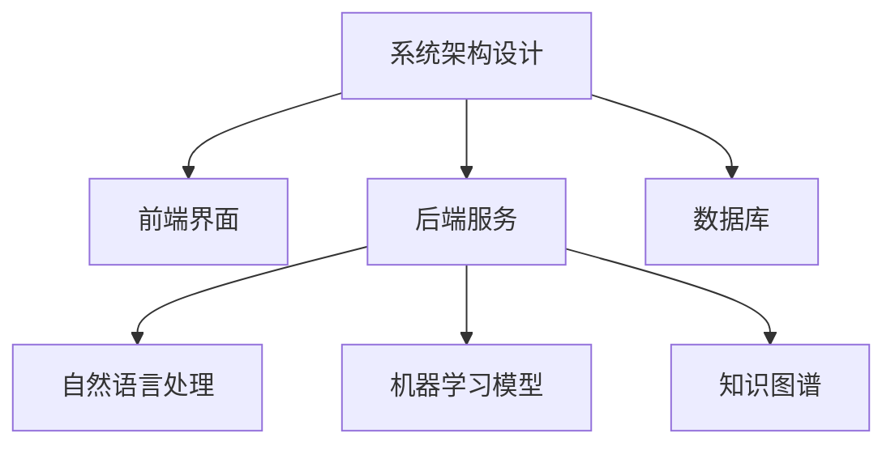

                 

### 第一部分: 引言与背景

#### 1.1 AI与精准医疗概述

##### 1.1.1 问题背景

在当今时代，医疗行业正面临着前所未有的挑战与机遇。随着人口老龄化趋势加剧、慢性病发病率上升以及医疗资源分布不均，传统以疾病治疗为主的医疗模式已经无法满足现代医学的需求。传统的医疗模式主要是基于症状和疾病分类，往往是“一刀切”的治疗方法，缺乏对个体差异的关注。这种模式不仅可能导致过度治疗，还可能忽略患者的个性化需求。

精准医疗作为一种新兴的医疗模式，应运而生。它强调根据患者的具体病情、基因特征、生活方式等因素，制定个性化的治疗方案，从而提高治疗效果，减少医疗资源的浪费。精准医疗的实现离不开先进技术的支持，尤其是人工智能（AI）技术的应用。

##### 1.1.1.1 医疗现状与挑战

当前的医疗体系存在诸多挑战，例如：

1. **医疗资源分布不均**：城市与农村、富裕地区与贫困地区之间医疗资源差距显著，导致医疗资源利用效率低下。
2. **疾病诊断的准确性**：传统诊断方法存在误诊和漏诊的风险，尤其是对于罕见病和复杂疾病的诊断。
3. **治疗方案的个体差异**：不同患者的病情、体质和生活习惯差异巨大，导致“一刀切”的治疗方案难以达到最佳效果。
4. **医疗数据的处理和分析**：医疗数据量大、类型复杂，传统数据处理方法难以应对。

##### 1.1.1.2 精准医疗的概念与需求

精准医疗是一种基于个体差异，通过大数据、基因组学、人工智能等先进技术，实现个性化医疗的服务模式。其核心在于通过基因检测、生物标志物检测等手段，获取患者的个人健康信息，并结合人工智能技术进行分析和诊断，为患者提供精准的治疗方案。

精准医疗的需求主要包括：

1. **个性化治疗**：根据患者的具体病情和基因特征，制定个性化的治疗方案。
2. **疾病早期诊断**：利用人工智能技术进行疾病早期筛查和诊断，提高疾病的发现率和治愈率。
3. **医疗资源的优化配置**：通过大数据分析，优化医疗资源的分配和使用，提高医疗效率。
4. **患者健康管理的提升**：通过数据分析和人工智能技术，提供个性化的健康管理方案，提高患者的生活质量。

##### 1.1.2 提示词个性化的核心概念

**1.1.2.1 提示词个性化的定义**

在AI驱动的精准医疗中，提示词个性化是指根据用户的个人健康数据、病史、基因信息等，为用户提供与其具体健康状况相关的个性化医疗信息和建议。这些信息可以是疾病预防建议、治疗方案的个性化推荐、健康生活方式的建议等。

**1.1.2.2 提示词个性化的重要性**

提示词个性化在精准医疗中具有重要作用，主要表现在以下几个方面：

1. **提高医疗效率**：通过提供个性化的医疗信息，帮助医生快速做出准确的诊断和治疗决策，提高医疗效率。
2. **增强患者依从性**：个性化的健康建议和治疗方案，可以更好地满足患者的需求，提高患者的治疗依从性。
3. **优化医疗资源配置**：通过个性化服务，减少不必要的医疗资源消耗，提高医疗资源的利用效率。
4. **提升患者生活质量**：个性化的健康管理方案，有助于患者更好地管理自己的健康状况，提升生活质量。

##### 1.1.3 AI在精准医疗中的应用

人工智能技术在精准医疗中具有广泛的应用前景，主要包括以下几个方面：

1. **疾病诊断**：利用深度学习等技术进行医学影像分析，提高疾病诊断的准确性。
2. **药物研发**：通过模拟药物与生物分子的相互作用，加速新药的发现和开发。
3. **个性化治疗**：根据患者的基因特征和病情，推荐个性化的治疗方案。
4. **健康监测**：利用可穿戴设备、智能手环等设备，实时监测患者的健康状况。

AI技术在精准医疗中的应用，不仅可以提高医疗服务的质量和效率，还可以为患者提供更加精准、个性化的医疗服务，满足现代医疗的需求。

#### 1.2 本书结构概述

**1.2.1 各章节主要内容**

本书共分为四个部分，具体内容如下：

1. **第一部分：引言与背景**：介绍AI和精准医疗的概念、背景以及提示词个性化的核心概念和重要性。
2. **第二部分：提示词个性化技术原理**：详细讲解提示词个性化技术的基本原理，包括数据准备与处理、特征工程、提示词个性化算法等。
3. **第三部分：应用实践**：通过具体案例，展示提示词个性化技术在实际中的应用，包括个性化医疗咨询系统、个性化医学文献推荐系统、个性化药物研发等。
4. **第四部分：拓展阅读**：介绍与提示词个性化相关的其他领域技术，如自然语言处理、医学大数据处理等。

**1.2.2 阅读建议与预期收获**

建议读者按照以下顺序阅读本书：

1. **先通读第一部分，了解AI和精准医疗的基本概念和背景**。
2. **再逐步深入学习第二部分，掌握提示词个性化技术的基本原理**。
3. **结合第三部分的实际案例，理解提示词个性化技术的应用**。
4. **最后阅读第四部分的拓展内容，了解与提示词个性化相关的其他领域技术**。

通过阅读本书，读者可以：

- 了解AI和精准医疗的基本概念和应用。
- 掌握提示词个性化技术的基本原理和实践方法。
- 了解提示词个性化技术在不同医疗场景中的应用。
- 拓展对自然语言处理、医学大数据处理等相关技术的认知。

总之，本书旨在为读者提供全面、系统的提示词个性化技术知识和应用实践，帮助读者深入了解并掌握这一前沿技术，为精准医疗的发展贡献力量。### 第一部分: 引言与背景

#### 1.1 AI与精准医疗概述

##### 1.1.3 AI在精准医疗中的应用

人工智能技术在精准医疗中的广泛应用，为其带来了前所未有的变革。以下将从几个方面详细阐述AI在精准医疗中的应用：

**1.1.3.1 疾病诊断**

AI在疾病诊断中的应用最为广泛。通过深度学习、计算机视觉等技术，AI能够对医学影像进行分析，如X光片、CT扫描、MRI等。例如，Google的DeepMind团队开发了一种AI系统，能够准确识别糖尿病视网膜病变，其准确率甚至超过了专业眼科医生。此外，AI还可以对基因序列进行分析，识别出与疾病相关的突变，从而帮助医生进行早期诊断。

**1.1.3.2 药物研发**

药物研发是一个复杂且耗时的过程，AI技术的引入大大提高了研发效率。AI可以通过模拟药物与生物分子的相互作用，预测药物的效果和副作用，从而加速新药的发现和开发。例如，使用AI技术，可以更快速地筛选出具有潜在治疗作用的化合物，并减少临床试验的风险。

**1.1.3.3 个性化治疗**

个性化治疗是精准医疗的核心，而AI技术则为实现个性化治疗提供了强大的支持。通过分析患者的基因信息、病史、生活习惯等数据，AI可以推荐个性化的治疗方案。例如，针对癌症患者，AI可以推荐最佳的化疗方案，并预测治疗效果和可能的副作用。

**1.1.3.4 健康监测**

AI在健康监测中的应用也非常广泛。通过可穿戴设备和智能手环等设备，AI可以实时监测患者的健康状况，如心率、血压、血糖等。当监测到异常数据时，AI可以及时预警，帮助患者和医生及时采取治疗措施。

**1.1.3.5 医学影像分析**

医学影像分析是AI在精准医疗中应用的一个重要领域。通过深度学习技术，AI可以对医学影像进行分析，如肺结节检测、乳腺癌检测等。这些技术的应用，不仅可以提高诊断的准确性，还可以减少医生的工作量，提高医疗效率。

**1.1.3.6 健康大数据分析**

健康大数据分析是AI在精准医疗中应用的一个关键环节。通过收集和分析大量的健康数据，如电子病历、基因数据、生活方式数据等，AI可以识别出疾病的高风险人群，提供个性化的健康建议。例如，通过分析大量患者的数据，AI可以预测一个人患某种疾病的风险，并提供相应的预防措施。

**1.1.3.7 临床决策支持**

AI还可以为医生提供临床决策支持。通过分析患者的病史、检查结果、药物反应等数据，AI可以推荐最佳的治疗方案。这种技术可以帮助医生更快速、准确地做出治疗决策，提高医疗质量。

**1.1.3.8 智能医疗助手**

智能医疗助手是AI在精准医疗中的一个新兴应用。这些助手可以与医生和患者进行互动，提供个性化的健康建议、治疗计划等。例如，某些智能医疗助手可以帮助患者管理慢性病，如糖尿病，提供饮食建议、运动计划等。

**1.1.3.9 远程医疗**

远程医疗是AI在精准医疗中的另一个重要应用。通过AI技术，医生可以远程诊断和治疗患者，特别是在偏远地区或医疗资源匮乏的地区。这种技术不仅可以提高医疗服务的可及性，还可以减少患者往返医院的次数，提高医疗效率。

综上所述，AI在精准医疗中的应用非常广泛，从疾病诊断、药物研发到健康监测、临床决策支持等，AI都发挥着重要作用。随着AI技术的不断发展，未来它将在精准医疗中发挥更加关键的作用，为患者提供更加个性化、精准的医疗服务。

#### 1.2 本书结构概述

**1.2.1 各章节主要内容**

本书旨在为读者提供一个全面、系统的提示词个性化技术在精准医疗中的应用指南。以下是各章节的主要内容：

- **第一部分：引言与背景**  
  - **第1章：AI与精准医疗概述**  
    - 介绍AI和精准医疗的概念、背景及提示词个性化的核心概念和重要性。  
  - **第2章：提示词个性化技术原理**  
    - 详细讲解提示词个性化技术的基本原理，包括数据准备与处理、特征工程、提示词个性化算法等。

- **第二部分：提示词个性化技术原理**  
  - **第3章：数据准备与处理**  
    - 讲解数据收集与整理、数据清洗与预处理、特征提取方法、特征选择策略等。  
  - **第4章：提示词个性化算法**  
    - 详细介绍机器学习算法基础、基于内容的方法、基于上下文的方法、基于用户行为的方法等。  
  - **第5章：个性化算法实现步骤**  
    - 讲解数据预处理、特征提取、模型训练与评估等步骤。

- **第三部分：应用实践**  
  - **第6章：提示词个性化案例分析**  
    - 通过具体案例，展示提示词个性化技术在实际中的应用，包括个性化医疗咨询系统、个性化医学文献推荐系统、个性化药物研发等。

- **第四部分：拓展阅读**  
  - **第7章：相关领域综述**  
    - 介绍与提示词个性化相关的其他领域技术，如自然语言处理、医学大数据处理等。

**1.2.2 阅读建议与预期收获**

为了更好地理解本书的内容，建议读者按照以下步骤进行阅读：

1. **通读第一部分，了解AI和精准医疗的基本概念和背景**。  
2. **深入学习第二部分，掌握提示词个性化技术的基本原理和实践方法**。  
3. **结合第三部分的实际案例，理解提示词个性化技术在不同医疗场景中的应用**。  
4. **阅读第四部分的拓展内容，了解与提示词个性化相关的其他领域技术**。

通过阅读本书，读者可以：

- **掌握AI和精准医疗的基本概念**：了解AI技术在精准医疗中的应用，以及提示词个性化的核心概念。  
- **掌握提示词个性化技术的基本原理和实践方法**：通过学习数据准备与处理、特征工程、提示词个性化算法等，了解如何实现提示词个性化技术。  
- **理解提示词个性化技术在实际中的应用**：通过案例分析，了解提示词个性化技术在不同医疗场景中的应用。  
- **拓展对其他领域技术的认知**：了解与提示词个性化相关的其他领域技术，如自然语言处理、医学大数据处理等。

总之，本书旨在为读者提供一个全面、系统的提示词个性化技术在精准医疗中的应用指南，帮助读者深入了解并掌握这一前沿技术，为精准医疗的发展贡献力量。### 第二部分：提示词个性化技术原理

#### 2.1 数据准备与处理

##### 2.1.1 数据收集与整理

数据准备是提示词个性化技术的首要任务，因为高质量的数据是确保模型性能和可靠性的基础。数据收集与整理主要包括以下几个步骤：

**1. 数据源选择**：选择合适的数据源是数据收集的第一步。在医疗领域，常见的数据源包括电子健康记录（EHR）、医学文献数据库、基因组数据库、患者问卷调查等。

**2. 数据收集**：通过API、爬虫、数据库导入等方式，从各个数据源收集所需的数据。需要注意的是，数据收集需要遵守相关的隐私法规和伦理准则。

**3. 数据整理**：收集到的数据通常格式不统一，需要进行整理。整理过程包括数据清洗、去重、格式转换等。例如，将不同来源的数据统一格式，处理缺失值和异常值。

**4. 数据存储**：将整理好的数据存储到数据库或数据湖中，以便后续的加工和处理。常用的数据存储方案包括关系型数据库（如MySQL、PostgreSQL）和非关系型数据库（如MongoDB、Cassandra）。

##### 2.1.2 数据清洗与预处理

数据清洗是数据准备的重要环节，其目的是提高数据的质量和一致性。以下是一些常见的数据清洗和预处理方法：

**1. 数据清洗**：包括去除重复记录、纠正数据中的错误、填补缺失值等。例如，使用均值填补缺失值、使用模型预测缺失值等。

**2. 数据标准化**：将不同量纲的数据转换为同一量纲，以便进行后续的分析。常用的方法包括Z-Score标准化、Min-Max标准化等。

**3. 数据归一化**：处理数值型数据，使其分布符合某些特定的要求，例如，使其符合正态分布。

**4. 特征工程**：包括特征提取和特征选择。特征提取是从原始数据中提取出有用的信息，例如，使用TF-IDF提取文本数据中的关键词。特征选择是筛选出对模型影响最大的特征，例如，使用互信息、特征重要性等方法进行筛选。

##### 2.1.3 数据集划分与标签分配

为了训练和评估提示词个性化模型，通常需要将数据集划分为训练集、验证集和测试集。以下是一些常见的数据集划分方法：

**1. 划分方法**：最常见的方法是按比例随机划分，例如，将数据集分为70%的训练集、15%的验证集和15%的测试集。

**2. 标签分配**：在分类任务中，需要对数据进行标签分配。标签分配的准确性对模型的性能有重要影响。常见的方法包括基于规则的标签分配、基于统计学的标签分配等。

**3. 类别不平衡**：在医疗数据集中，往往存在类别不平衡的问题，即某些类别的数据量远小于其他类别。处理类别不平衡的方法包括过采样、欠采样、SMOTE等。

##### 2.1.4 数据预处理工具与库

在数据预处理过程中，可以使用多种工具和库来简化操作，提高效率。以下是一些常用的工具和库：

**1. Python库**：如pandas、NumPy、Scikit-learn、Matplotlib等，用于数据处理、分析和可视化。

**2. 数据预处理工具**：如Apache NiFi、Apache Kafka等，用于数据流的处理和传输。

**3. 特征工程工具**：如Feature-engine、Feature-creator等，用于特征提取和特征选择。

##### 2.1.5 数据预处理案例

以下是一个简单的数据预处理案例，展示如何使用Python进行数据清洗、标准化和特征提取：

```python
import pandas as pd
from sklearn.preprocessing import StandardScaler

# 读取数据
data = pd.read_csv('data.csv')

# 数据清洗
data.drop_duplicates(inplace=True)
data.fillna(method='mean', inplace=True)

# 数据标准化
scaler = StandardScaler()
data_scaled = scaler.fit_transform(data)

# 特征提取
from sklearn.feature_extraction.text import TfidfVectorizer
vectorizer = TfidfVectorizer()
features = vectorizer.fit_transform(data['text_column'])
```

通过以上步骤，我们可以获得预处理后的数据集，为后续的提示词个性化算法提供数据支持。

#### 2.2 特征工程

特征工程是机器学习过程中至关重要的一步，其目的是从原始数据中提取出对模型有用的特征，以提高模型的性能和泛化能力。以下是特征工程的主要方法和策略：

##### 2.2.1 特征提取方法

**1. 数值型特征提取**：对于数值型数据，常见的特征提取方法包括：
- 标准化（Standardization）：将数据缩放到一个标准范围内，例如使用Z-Score标准化或Min-Max标准化。
- 归一化（Normalization）：将数据缩放到[0, 1]范围内。
- 特征缩放（Feature Scaling）：对特征进行缩放，以消除量纲的影响。

**2. 文本特征提取**：对于文本数据，常见的特征提取方法包括：
- 基于词频（TF）：计算每个单词在文档中出现的次数。
- 基于文档频率（DF）：计算每个单词在所有文档中出现的次数。
- TF-IDF：结合TF和DF，计算每个单词在文档中的重要程度。
- Word2Vec：将单词映射到高维向量空间，用于捕捉单词的语义信息。

**3. 图像特征提取**：对于图像数据，常见的特征提取方法包括：
- HOG（Histogram of Oriented Gradients）：计算图像中每个像素点的梯度方向和强度，用于描述图像的特征。
- CNN（Convolutional Neural Networks）：通过卷积神经网络提取图像的特征。

##### 2.2.2 特征选择策略

特征选择是特征工程的重要步骤，旨在筛选出对模型性能最有影响力的特征，从而减少模型复杂度、提高模型效率。以下是一些常见的特征选择策略：

**1. 统计方法**：基于统计学指标进行特征选择，例如：
- 相关系数（Correlation）：选择与目标变量高度相关的特征。
- 互信息（Mutual Information）：选择对模型预测具有最大信息量的特征。
- 方差解释率（Variance Explanatory Factor）：选择能够解释最大方差的特征。

**2. 递归特征消除（RFE）**：通过递归地删除对模型影响最小的特征，逐步筛选出重要的特征。

**3. 机器学习方法**：利用机器学习算法本身进行特征选择，例如：
- L1正则化（Lasso）：通过L1正则化项减少特征系数，从而筛选出重要的特征。
- 特征重要性（Feature Importance）：利用随机森林、梯度提升树等算法计算特征的重要性，从而进行特征选择。

##### 2.2.3 特征组合

特征组合是将多个特征结合起来，形成新的特征。以下是一些常见的特征组合方法：

**1. 加法组合**：将多个特征相加，形成新的特征。
**2. 乘法组合**：将多个特征相乘，形成新的特征。
**3. 平均组合**：将多个特征取平均，形成新的特征。
**4. 模型组合**：利用机器学习模型（如神经网络、决策树等）将多个特征组合成新的特征。

##### 2.2.4 特征工程工具与库

在进行特征工程时，可以使用多种工具和库来简化操作，提高效率。以下是一些常用的工具和库：

**1. Python库**：如Scikit-learn、Pandas、NumPy、Matplotlib等，用于数据处理、特征提取和可视化。

**2. 特征工程工具**：如Feature-engine、Feature-creator等，用于特征提取和特征选择。

**3. 文本特征提取工具**：如Gensim、NLTK等，用于文本数据的特征提取。

##### 2.2.5 特征工程案例

以下是一个简单的特征工程案例，展示如何使用Python进行数值型特征提取和文本特征提取：

```python
import pandas as pd
from sklearn.preprocessing import StandardScaler
from sklearn.feature_extraction.text import TfidfVectorizer

# 读取数据
data = pd.read_csv('data.csv')

# 数值型特征提取
scaler = StandardScaler()
data[['num_feature1', 'num_feature2']] = scaler.fit_transform(data[['num_feature1', 'num_feature2']])

# 文本特征提取
vectorizer = TfidfVectorizer()
text_features = vectorizer.fit_transform(data['text_column'])

# 合并特征
data_with_features = pd.concat([data[['num_feature1', 'num_feature2']], pd.DataFrame(text_features.toarray())], axis=1)
```

通过以上步骤，我们可以获得特征提取后的数据集，为后续的机器学习模型训练提供数据支持。

#### 2.3 数据集划分与标签分配

在机器学习任务中，数据集的划分和标签的分配是模型训练和评估的重要步骤。合理的划分和分配能够提高模型的性能和泛化能力，以下将详细探讨数据集的划分方法、标签分配机制以及类别不平衡的处理方法。

##### 2.3.1 数据集划分方法

数据集的划分通常分为以下几种类型：

**1. 随机划分**：将数据集随机划分为训练集、验证集和测试集，例如，可以按80%、10%、10%的比例划分。这种方法简单有效，但可能存在数据分布不平衡的问题。

**2. stratified sampling（分层采样）**：在数据集中存在类别不平衡时，可以使用分层采样方法。分层采样首先将数据集按类别分层，然后在每个层内随机采样，从而保证各层的数据比例与整体数据集一致。

**3. holdout method（保留法）**：将数据集划分为两部分，一部分用于训练，另一部分用于验证和测试。这种方法常用于初步评估模型的性能，但容易受到数据集划分的影响。

**4. cross-validation（交叉验证）**：通过将数据集划分为多个子集，分别用于训练和验证，从而评估模型的泛化能力。常用的交叉验证方法包括K折交叉验证和留一交叉验证。

##### 2.3.2 标签分配机制

标签分配机制取决于具体的机器学习任务。以下是一些常见的标签分配方法：

**1. 二分类任务**：对于二分类任务，通常将目标变量（标签）划分为两个类别，例如，0和1、True和False等。

**2. 多分类任务**：对于多分类任务，通常使用独热编码（One-Hot Encoding）或标签编码（Label Encoding）等方法将类别标签转换为数值。

**3. 多标签任务**：对于多标签任务，每个样本可以同时属于多个类别。常见的标签分配方法包括位操作（Bitwise OR）和哈希标签（Hashing Technique）等。

##### 2.3.3 类别不平衡的处理方法

类别不平衡是机器学习中的一个常见问题，以下是一些处理类别不平衡的方法：

**1. 过采样（Over-sampling）**：通过增加少数类别的数据量，使其与多数类别相当。常见的过采样方法包括随机过采样（Random Over-sampling）和合成过采样（Synthetic Minority Over-sampling Technique，SMOTE）。

**2. 欠采样（Under-sampling）**：通过减少多数类别的数据量，使其与少数类别相当。常见的欠采样方法包括随机欠采样（Random Under-sampling）和近邻欠采样（Neighbourhood Under-sampling Technique，NUTS）。

**3. 结合方法**：结合过采样和欠采样方法，例如，先进行欠采样，然后进行过采样，以平衡类别分布。

**4. 调整损失函数**：通过调整模型的损失函数，降低多数类别的权重，从而提高少数类别的分类准确率。常见的方法包括加权交叉熵损失函数（Weighted Cross-Entropy Loss）。

**5. 集成学习**：使用集成学习方法，如Bagging和Boosting，通过多次训练和组合模型来提高模型对少数类别的分类能力。

##### 2.3.4 数据集划分与标签分配工具与库

在进行数据集划分和标签分配时，可以使用多种工具和库来简化操作，提高效率。以下是一些常用的工具和库：

**1. Python库**：如Scikit-learn、Pandas、NumPy等，用于数据处理、数据集划分和标签分配。

**2. 数据集划分工具**：如StratifiedKFold、RandomizedSearchCV等，用于数据集划分和交叉验证。

**3. 标签分配工具**：如OneHotEncoder、LabelEncoder等，用于标签分配和编码。

##### 2.3.5 数据集划分与标签分配案例

以下是一个简单的数据集划分和标签分配案例，展示如何使用Python进行随机划分和标签分配：

```python
import pandas as pd
from sklearn.model_selection import train_test_split
from sklearn.preprocessing import LabelEncoder

# 读取数据
data = pd.read_csv('data.csv')

# 划分特征和标签
X = data.drop('target', axis=1)
y = data['target']

# 标签编码
label_encoder = LabelEncoder()
y_encoded = label_encoder.fit_transform(y)

# 随机划分训练集和测试集
X_train, X_test, y_train, y_test = train_test_split(X, y_encoded, test_size=0.2, random_state=42)
```

通过以上步骤，我们可以获得划分好的训练集和测试集，以及编码后的标签数据，为后续的模型训练和评估提供数据支持。

#### 2.3.6 数据集划分与标签分配的注意事项

在进行数据集划分与标签分配时，需要注意以下几点：

- **保证数据一致性**：确保数据在划分和分配过程中不丢失或出现错误。
- **遵循隐私法规**：在处理医疗数据时，要严格遵守相关的隐私法规和伦理准则。
- **合理选择划分方法**：根据数据的特点和任务需求，选择合适的数据集划分方法，如随机划分、分层采样等。
- **平衡数据集**：尽量平衡数据集中的类别分布，避免因类别不平衡导致的模型偏差。
- **多次评估**：使用交叉验证等方法多次评估模型性能，确保模型具有良好的泛化能力。

通过合理的数据集划分与标签分配，可以提高模型的性能和泛化能力，为AI驱动的精准医疗提供可靠的数据基础。

#### 2.4 提示词个性化算法

##### 2.4.1 机器学习算法基础

机器学习算法是提示词个性化技术的重要工具。以下将简要介绍几种常见的机器学习算法：

**1. 监督学习（Supervised Learning）**：监督学习算法通过已知标记的数据来训练模型，然后使用模型对新数据进行预测。常见的监督学习算法包括线性回归（Linear Regression）、逻辑回归（Logistic Regression）、支持向量机（Support Vector Machine，SVM）等。

**2. 无监督学习（Unsupervised Learning）**：无监督学习算法不需要已知标记的数据，通过分析数据自身的分布和结构来发现数据中的规律。常见的无监督学习算法包括聚类（Clustering）、降维（Dimensionality Reduction）等，如K-均值聚类（K-Means Clustering）和主成分分析（Principal Component Analysis，PCA）。

**3. 强化学习（Reinforcement Learning）**：强化学习算法通过不断地与环境互动来学习策略，其目标是最大化累积奖励。常见的强化学习算法包括Q学习（Q-Learning）、深度确定性策略梯度（Deep Deterministic Policy Gradient，DDPG）等。

**4. 迁移学习（Transfer Learning）**：迁移学习算法通过利用已在不同任务上训练好的模型来提高新任务的学习效果。常见的迁移学习算法包括模型迁移（Model Transfer）、知识蒸馏（Knowledge Distillation）等。

##### 2.4.2 提示词个性化算法原理

提示词个性化算法的核心目标是根据用户的个人健康数据、病史、基因信息等，生成个性化的医疗建议和推荐。以下介绍几种常见的提示词个性化算法：

**1. 基于内容的方法（Content-Based Methods）**：基于内容的方法通过分析文本的语义信息来生成个性化的提示词。常见的算法包括TF-IDF（Term Frequency-Inverse Document Frequency）和Word2Vec（Word Embedding）。这种方法的主要优点是简单易实现，但可能无法捕捉复杂的语义关系。

**2. 基于上下文的方法（Contextual-Based Methods）**：基于上下文的方法通过考虑用户的历史行为、当前环境等因素来生成个性化的提示词。常见的算法包括序列模型（如RNN、LSTM）和Transformer等。这种方法能够更好地捕捉上下文信息，提高提示词的个性化程度。

**3. 基于用户行为的方法（User-Behavior-Based Methods）**：基于用户行为的方法通过分析用户的浏览历史、搜索记录、健康数据等行为数据来生成个性化的提示词。常见的算法包括协同过滤（Collaborative Filtering）和基于规则的推荐系统（Rule-Based Recommendation System）。这种方法能够根据用户的行为模式提供个性化的医疗建议。

##### 2.4.3 提示词个性化算法实现步骤

实现提示词个性化算法通常包括以下步骤：

**1. 数据收集与预处理**：收集用户健康数据、病史、基因信息等，并进行数据清洗、归一化、特征提取等预处理操作。

**2. 模型选择**：根据具体需求选择合适的模型，如TF-IDF、Word2Vec、RNN、LSTM、Transformer等。

**3. 模型训练**：使用预处理后的数据对模型进行训练，通过调整模型参数来优化模型性能。

**4. 模型评估**：使用验证集或测试集评估模型性能，通过指标如准确率、召回率、F1值等来评估模型效果。

**5. 模型部署**：将训练好的模型部署到生产环境中，实时生成个性化的提示词。

##### 2.4.4 提示词个性化算法案例分析

以下通过一个简单的案例分析，展示如何实现提示词个性化算法：

**案例背景**：假设我们开发了一个个性化医疗咨询系统，用户可以通过系统提出健康问题，系统需要根据用户的问题生成个性化的医疗建议。

**实现步骤**：

1. **数据收集与预处理**：收集用户提问的文本数据，并进行数据清洗、归一化、特征提取等操作。使用TF-IDF算法提取文本特征。

2. **模型选择**：选择基于内容的模型，如TF-IDF，用于生成提示词。

3. **模型训练**：使用预处理后的数据对TF-IDF模型进行训练，调整参数以优化模型性能。

4. **模型评估**：使用测试集评估模型性能，通过计算准确率、召回率、F1值等指标来评估模型效果。

5. **模型部署**：将训练好的TF-IDF模型部署到生产环境中，当用户提出健康问题时，系统根据用户的问题生成个性化的医疗建议。

通过以上步骤，我们可以实现一个简单的提示词个性化算法，为用户提供个性化的医疗咨询。### 第三部分：应用实践

#### 4.1 案例一：个性化医疗咨询系统

个性化医疗咨询系统是AI在精准医疗中的一项重要应用，旨在为患者提供个性化的健康咨询和建议。以下将详细介绍该案例的背景、实现过程以及关键技术和挑战。

##### 4.1.1 案例背景

随着医疗技术的不断发展，患者对个性化医疗服务的需求日益增加。个性化医疗咨询系统通过AI技术，能够根据患者的具体病情、病史、生活习惯等数据，提供个性化的健康建议和治疗方案。这种系统能够帮助医生更快速、准确地诊断病情，提高医疗服务的质量和效率。

##### 4.1.2 案例实现

**1. 系统架构设计**

个性化医疗咨询系统通常包括以下几部分：

- **前端界面**：用户通过Web或移动应用与系统进行交互，输入健康问题和症状。
- **后端服务**：处理用户输入的数据，调用AI模型进行健康分析和建议生成。
- **数据库**：存储用户数据和系统运行过程中产生的日志。

**2. 关键技术**

- **自然语言处理（NLP）**：用于处理用户输入的文本数据，提取关键信息，如症状、病情等。
- **机器学习模型**：用于对提取的关键信息进行分析，生成个性化的健康建议。
- **知识图谱**：用于存储和检索医疗知识，为模型提供支持。

**3. 实现步骤**

1. **数据收集与预处理**：收集用户健康数据，包括电子健康记录（EHR）、患者问卷调查等。对收集到的数据进行清洗、归一化和特征提取。

2. **NLP模型训练**：使用NLP技术对文本数据进行分析，提取关键信息。可以使用BERT、GPT等预训练模型进行文本分类和命名实体识别。

3. **健康分析模型训练**：基于提取的关键信息，使用机器学习模型进行健康分析和诊断。可以使用深度学习模型（如CNN、RNN、Transformer等）进行训练。

4. **个性化建议生成**：根据健康分析结果，生成个性化的健康建议。建议可以是治疗方案的推荐、预防措施、健康生活方式建议等。

5. **系统部署与维护**：将训练好的模型部署到生产环境中，实时为用户提供个性化咨询。同时，对系统进行监控和维护，确保系统稳定运行。

##### 4.1.3 关键技术和挑战

**1. 自然语言处理（NLP）**

NLP是个性化医疗咨询系统的核心技术之一，用于处理用户输入的文本数据。在实现过程中，需要解决的关键技术包括：

- **文本分类**：将用户输入的文本分类到不同的健康类别，如疾病、症状等。
- **命名实体识别（NER）**：识别文本中的关键实体，如疾病名称、症状等。
- **情感分析**：分析用户输入的文本情感，如积极、消极等。

**2. 机器学习模型**

机器学习模型用于对提取的关键信息进行分析，生成个性化的健康建议。在实现过程中，需要解决的关键技术包括：

- **模型选择**：选择合适的机器学习模型，如深度学习模型、决策树等。
- **模型训练与优化**：使用大量的训练数据进行模型训练，并通过交叉验证、超参数调整等方法优化模型性能。

**3. 知识图谱



知识图谱用于存储和检索医疗知识，为模型提供支持。在实现过程中，需要解决的关键技术包括：

- **知识图谱构建**：构建包含疾病、症状、治疗方案等医疗知识的知识图谱。
- **图谱查询与推理**：使用图谱进行查询和推理，为模型提供支持。

**4. 挑战**

个性化医疗咨询系统在实现过程中面临以下挑战：

- **数据隐私**：医疗数据具有高度敏感性，如何确保数据的安全和隐私是一个重要问题。
- **模型解释性**：用户希望理解模型的决策过程，如何提高模型的解释性是一个挑战。
- **数据质量**：医疗数据的质量直接影响模型的性能，如何处理噪声数据和缺失值是一个挑战。

##### 4.1.4 案例总结

个性化医疗咨询系统的实现，不仅提高了医疗服务的质量和效率，还为患者提供了更加个性化和精准的健康服务。在未来的发展中，我们需要不断优化系统的算法和架构，提高系统的性能和可靠性，为精准医疗的发展贡献力量。

#### 4.2 案例二：个性化医学文献推荐系统

个性化医学文献推荐系统是AI在精准医疗中的另一项重要应用，旨在为医学研究人员和医生提供个性化的医学文献推荐。以下将详细介绍该案例的背景、实现过程以及关键技术和挑战。

##### 4.2.1 案例背景

医学文献数量庞大，且不断增长，医学研究人员和医生在寻找与研究方向相关的文献时常常感到困难。个性化医学文献推荐系统通过AI技术，能够根据用户的研究兴趣、阅读历史等数据，为用户推荐相关的医学文献，从而提高文献检索的效率和质量。

##### 4.2.2 案例实现

**1. 系统架构设计**

个性化医学文献推荐系统通常包括以下几部分：

- **前端界面**：用户通过Web或移动应用与系统进行交互，输入研究主题和兴趣。
- **后端服务**：处理用户输入的数据，调用推荐算法进行文献推荐。
- **数据库**：存储用户数据、文献数据以及推荐结果。

**2. 关键技术**

- **协同过滤（Collaborative Filtering）**：用于根据用户的阅读历史和相似用户的行为数据推荐文献。
- **基于内容的推荐（Content-Based Recommendation）**：用于根据文献的主题、关键词等特征为用户推荐相关文献。
- **机器学习模型**：用于对用户的兴趣和文献进行建模，优化推荐效果。

**3. 实现步骤**

1. **用户数据收集与预处理**：收集用户的阅读历史、搜索记录等数据，并对数据进行清洗、归一化、特征提取等预处理操作。

2. **文献数据收集与预处理**：收集医学文献的元数据，如标题、摘要、关键词等，并对数据进行清洗、归一化、特征提取等预处理操作。

3. **协同过滤算法实现**：使用协同过滤算法计算用户之间的相似度，并根据相似度为用户推荐相关的文献。

4. **基于内容的推荐算法实现**：使用基于内容的推荐算法，根据文献的标题、摘要、关键词等特征为用户推荐相关文献。

5. **机器学习模型训练与优化**：使用用户的兴趣和文献的特征数据，训练机器学习模型，优化推荐效果。

6. **系统部署与维护**：将训练好的模型部署到生产环境中，实时为用户推荐相关的医学文献。同时，对系统进行监控和维护，确保系统稳定运行。

##### 4.2.3 关键技术和挑战

**1. 协同过滤（Collaborative Filtering）**

协同过滤是推荐系统中最常用的技术之一，分为以下两种类型：

- **用户基于的协同过滤（User-Based Collaborative Filtering）**：根据用户之间的相似度推荐文献，适用于用户行为数据丰富的情况。
- **物品基于的协同过滤（Item-Based Collaborative Filtering）**：根据物品之间的相似度推荐文献，适用于物品（文献）特征明显的情况。

**2. 基于内容的推荐（Content-Based Recommendation）**

基于内容的推荐技术通过分析文献的主题、关键词等特征，为用户推荐相关的文献。在实现过程中，需要解决的关键技术包括：

- **特征提取**：从文献的标题、摘要、关键词等中提取关键特征。
- **相似度计算**：计算文献之间的相似度，如余弦相似度、Jaccard相似度等。

**3. 机器学习模型**

机器学习模型用于对用户的兴趣和文献进行建模，优化推荐效果。在实现过程中，需要解决的关键技术包括：

- **模型选择**：选择合适的机器学习模型，如线性回归、决策树、支持向量机等。
- **模型训练与优化**：使用用户的兴趣和文献的特征数据，训练机器学习模型，并通过交叉验证、超参数调整等方法优化模型性能。

**4. 挑战**

个性化医学文献推荐系统在实现过程中面临以下挑战：

- **数据质量**：医学文献数据质量参差不齐，如何处理噪声数据和缺失值是一个挑战。
- **推荐结果解释性**：用户希望了解推荐结果的原因，如何提高推荐结果的解释性是一个挑战。
- **实时性**：医学文献更新速度快，如何实现实时推荐是一个挑战。

##### 4.2.4 案例总结

个性化医学文献推荐系统的实现，为医学研究人员和医生提供了高效的文献检索和推荐服务，提高了科研和临床工作的效率。在未来的发展中，我们需要不断优化系统的算法和架构，提高系统的性能和可靠性，为精准医疗的发展贡献力量。

#### 4.3 案例三：个性化药物研发

个性化药物研发是AI在精准医疗中的另一项重要应用，旨在根据患者的基因信息和病情，为患者量身定制最合适的药物方案。以下将详细介绍该案例的背景、实现过程以及关键技术和挑战。

##### 4.3.1 案例背景

传统药物研发主要基于统计学方法，往往无法充分考虑个体差异，导致药物疗效和副作用在不同患者之间存在较大差异。个性化药物研发通过AI技术，能够根据患者的基因信息、病情、生活方式等数据，为患者推荐最合适的药物方案，从而提高药物疗效和降低副作用。

##### 4.3.2 案例实现

**1. 系统架构设计**

个性化药物研发系统通常包括以下几部分：

- **前端界面**：用户通过Web或移动应用与系统进行交互，上传基因数据和病情信息。
- **后端服务**：处理用户输入的数据，调用AI模型进行药物推荐。
- **数据库**：存储用户数据、药物数据以及推荐结果。

**2. 关键技术**

- **基因数据挖掘**：用于从用户的基因数据中提取关键信息，如基因突变、基因表达等。
- **药物基因组学**：用于研究基因与药物之间的相互作用，为药物推荐提供依据。
- **机器学习模型**：用于对用户的基因信息和药物数据进行建模，生成个性化的药物推荐。

**3. 实现步骤**

1. **数据收集与预处理**：收集用户的基因数据、药物数据以及病情信息，并对数据进行清洗、归一化、特征提取等预处理操作。

2. **基因数据挖掘**：使用生物信息学方法从用户的基因数据中提取关键信息，如基因突变、基因表达等。

3. **药物基因组学研究**：使用机器学习算法研究基因与药物之间的相互作用，建立药物基因组学模型。

4. **个性化药物推荐算法实现**：使用药物基因组学模型和用户基因信息，为用户推荐最合适的药物方案。

5. **系统部署与维护**：将训练好的药物推荐模型部署到生产环境中，实时为用户提供个性化药物推荐。同时，对系统进行监控和维护，确保系统稳定运行。

##### 4.3.3 关键技术和挑战

**1. 基因数据挖掘**

基因数据挖掘是个性化药物研发的关键技术之一，用于从用户的基因数据中提取关键信息。在实现过程中，需要解决的关键技术包括：

- **基因突变检测**：使用生物信息学方法检测用户的基因突变，如单核苷酸变异（SNV）、插入和缺失等。
- **基因表达分析**：使用RNA测序（RNA-seq）等方法分析用户的基因表达水平，为药物推荐提供依据。

**2. 药物基因组学**

药物基因组学研究基因与药物之间的相互作用，为个性化药物推荐提供依据。在实现过程中，需要解决的关键技术包括：

- **基因药物相互作用网络**：构建基因药物相互作用网络，研究基因与药物之间的相互作用关系。
- **药物反应预测**：使用机器学习算法预测用户的药物反应，为药物推荐提供依据。

**3. 机器学习模型**

机器学习模型用于对用户的基因信息和药物数据进行建模，生成个性化的药物推荐。在实现过程中，需要解决的关键技术包括：

- **模型选择**：选择合适的机器学习模型，如深度学习模型、决策树、支持向量机等。
- **模型训练与优化**：使用用户的基因信息和药物数据，训练机器学习模型，并通过交叉验证、超参数调整等方法优化模型性能。

**4. 挑战**

个性化药物研发系统在实现过程中面临以下挑战：

- **数据质量**：基因数据和药物数据质量参差不齐，如何处理噪声数据和缺失值是一个挑战。
- **数据隐私**：基因数据具有高度敏感性，如何确保数据的安全和隐私是一个重要问题。
- **模型解释性**：用户希望了解模型的决策过程，如何提高模型的解释性是一个挑战。

##### 4.3.4 案例总结

个性化药物研发系统的实现，为患者提供了更加精准和个性化的药物治疗方案，提高了药物疗效和降低了副作用。在未来的发展中，我们需要不断优化系统的算法和架构，提高系统的性能和可靠性，为精准医疗的发展贡献力量。

#### 5.1 提示词个性化的挑战

在AI驱动的精准医疗中，提示词个性化技术尽管展示了巨大的潜力，但同时也面临着一系列挑战，这些挑战主要集中在以下几个方面：

##### 5.1.1 数据隐私保护

数据隐私保护是提示词个性化技术面临的首要挑战。医疗数据包含高度敏感的个人信息，如病史、基因信息、生活习惯等。如果这些数据泄露，可能会导致患者隐私泄露、医疗欺诈等问题。为了确保数据隐私，需要采取以下措施：

1. **数据加密**：在数据传输和存储过程中，使用加密技术对数据进行加密，确保数据在传输和存储过程中不被窃取或篡改。
2. **访问控制**：通过严格的访问控制机制，确保只有授权用户才能访问敏感数据。
3. **数据去标识化**：在数据处理和存储前，对数据去标识化，以消除数据中的直接关联信息，降低数据泄露的风险。

##### 5.1.2 模型解释性

提示词个性化技术的模型通常基于复杂的机器学习算法，如深度学习、强化学习等，这些模型在处理大量复杂数据时表现出色，但模型内部的决策过程往往难以解释。模型解释性对于提高用户对系统的信任度、确保医疗决策的透明性至关重要。以下是一些提高模型解释性的方法：

1. **模型可解释性技术**：使用模型可解释性技术，如LIME（Local Interpretable Model-agnostic Explanations）、SHAP（SHapley Additive exPlanations）等，为模型的预测提供解释。
2. **可视化工具**：开发可视化工具，帮助用户理解模型的预测过程和结果。
3. **透明度协议**：建立透明的开发流程和评估机制，确保模型的决策过程符合医疗伦理和法规要求。

##### 5.1.3 模型泛化能力

模型的泛化能力是提示词个性化技术的关键挑战之一。在训练模型时，数据集往往存在一定的偏差，这可能导致模型在新的数据上表现不佳。为了提高模型的泛化能力，可以采取以下措施：

1. **数据多样性**：收集更多样化的数据，包括不同年龄、性别、病情等特征，以增强模型的泛化能力。
2. **迁移学习**：使用迁移学习技术，将已有模型的知识迁移到新任务上，以提高模型的泛化能力。
3. **模型集成**：通过模型集成方法，如集成学习、Stacking等，提高模型的泛化能力。

##### 5.1.4 技术标准化与法规遵守

提示词个性化技术的应用需要遵循相关的技术标准化和法规要求。不同的国家和地区可能有不同的医疗数据保护法规，如欧盟的通用数据保护条例（GDPR）和美国的健康保险可携性与责任法案（HIPAA）。为了确保技术的合规性，需要：

1. **遵守数据保护法规**：在设计、开发和部署提示词个性化技术时，严格遵守相关数据保护法规。
2. **制定技术标准**：参与制定和遵循行业技术标准，确保技术的可靠性和互操作性。
3. **持续监管与合规性评估**：定期对技术的合规性进行评估，确保技术的持续合规。

##### 5.1.5 防止偏见和歧视

提示词个性化技术可能会因为数据偏差、算法设计等原因产生偏见和歧视，尤其是在处理敏感的医疗数据时。为了防止这种情况的发生，需要：

1. **数据清洗与预处理**：在数据处理阶段，对数据进行严格的清洗与预处理，以消除数据中的偏见。
2. **算法公正性评估**：对算法的公正性进行评估，确保算法在处理不同群体数据时不会产生歧视。
3. **透明度与问责制**：确保算法决策过程的透明度，建立问责机制，确保算法的公正性和合理性。

通过解决以上挑战，提示词个性化技术将能够更好地为精准医疗服务，为患者提供更加个性化、精准的医疗服务。### 5.2 提示词个性化的发展趋势

随着科技的不断进步和医疗领域的深入发展，提示词个性化技术在精准医疗中的应用前景十分广阔。以下是提示词个性化技术在未来可能的发展趋势：

**1. 技术革新**

**深度学习与强化学习**：深度学习和强化学习等先进算法在提示词个性化中的应用将会越来越广泛。深度学习通过构建复杂的神经网络模型，可以更好地捕捉数据中的非线性关系，从而提高个性化推荐的准确性。强化学习通过不断与环境互动，可以优化个性化策略，实现更加精准的个性化服务。

**多模态数据融合**：在医疗领域，不同类型的数据（如文本、图像、音频等）可以为提示词个性化提供更丰富的信息。未来，多模态数据融合技术将得到进一步发展，通过整合不同类型的数据，提供更加全面和个性化的医疗服务。

**2. 政策法规**

**数据隐私与安全**：随着数据隐私和安全问题日益受到关注，各国政府和国际组织将出台更加严格的数据保护法规，如欧盟的通用数据保护条例（GDPR）等。提示词个性化技术必须严格遵守这些法规，确保用户数据的隐私和安全。

**标准化与规范化**：为了提高提示词个性化技术的可靠性和互操作性，相关组织和机构可能会制定一系列技术标准和规范。这些标准将指导技术的开发、部署和应用，确保技术的规范化和标准化。

**3. 产业应用**

**个性化医疗咨询**：随着人们对个性化医疗需求的增加，个性化医疗咨询服务将得到广泛应用。这些服务可以通过AI技术，为患者提供实时、个性化的健康咨询和建议，提高医疗服务的质量和效率。

**个性化药物治疗**：个性化药物治疗是精准医疗的重要组成部分。未来，个性化药物治疗将逐渐普及，通过AI技术，为患者量身定制最合适的药物方案，提高药物疗效和降低副作用。

**个性化医学研究**：个性化医学研究将借助AI技术，通过对大量医学数据的分析，发现新的治疗方法和药物，推动医学研究的发展。

**4. 持续发展**

**跨学科合作**：提示词个性化技术的发展需要跨学科的合作，如计算机科学、医学、生物学、统计学等。只有通过多学科的合作，才能更好地推动技术的进步和应用。

**持续优化**：提示词个性化技术需要不断优化和改进，以应对不断变化的数据和应用需求。通过持续的研究和开发，技术将不断迭代，为精准医疗提供更加有力的支持。

总之，随着技术的不断进步和政策法规的不断完善，提示词个性化技术将在精准医疗中发挥越来越重要的作用，为患者提供更加个性化、精准的医疗服务。### 第六部分：拓展阅读

#### 6.1 自然语言处理技术

自然语言处理（NLP）是人工智能的重要分支，旨在使计算机能够理解和处理人类语言。在AI驱动的精准医疗中，NLP技术广泛应用于医学文本分析、医疗对话系统、医学信息检索等领域。

**6.1.1 语言模型**

语言模型是NLP的核心技术之一，用于预测下一个单词或句子。常见的语言模型包括：

- **N-gram模型**：基于历史频率统计，预测下一个单词的概率。
- **神经网络模型**：如循环神经网络（RNN）和Transformer，通过学习大量语言数据，捕捉语言中的长距离依赖关系。

**6.1.2 文本分类**

文本分类是将文本数据划分为不同类别的过程。在精准医疗中，文本分类技术用于疾病诊断、病历分类等。常用的文本分类算法包括：

- **朴素贝叶斯分类器**：基于贝叶斯定理，通过计算文本特征的概率分布进行分类。
- **支持向量机（SVM）**：通过最大化分类间隔，将文本数据划分为不同类别。

**6.1.3 问答系统**

问答系统旨在回答用户提出的问题。在精准医疗中，问答系统可以用于患者咨询、医疗知识检索等。常见的问答系统包括：

- **基于规则的问答系统**：通过预定义的规则，匹配用户问题和知识库中的答案。
- **基于机器学习的问答系统**：如序列到序列（Seq2Seq）模型，通过学习大量问答对，自动生成答案。

#### 6.2 医学大数据处理

医学大数据处理是AI驱动的精准医疗的关键环节，涉及数据收集、存储、处理和分析等多个方面。

**6.2.1 大数据处理技术**

大数据处理技术包括：

- **分布式计算**：如Hadoop和Spark，通过分布式计算框架处理海量数据。
- **数据仓库**：如Oracle、MySQL等，用于存储和管理大规模数据。

**6.2.2 医学知识图谱**

医学知识图谱是一种结构化知识库，用于表示和存储医学知识。医学知识图谱可以用于：

- **知识推理**：通过推理规则，自动推导出新的医学知识。
- **知识共享**：将医学知识共享给医疗专业人士，提高医疗决策的准确性。

**6.2.3 医学数据的隐私保护**

医学数据隐私保护是医学大数据处理的重要挑战。常见的隐私保护技术包括：

- **数据去识别化**：通过删除或模糊化敏感信息，保护个人隐私。
- **加密技术**：对存储和传输的医学数据进行加密，确保数据安全。

#### 6.3 人工智能伦理与法律

人工智能在医疗领域的应用涉及伦理和法律问题。以下是一些关键议题：

- **隐私保护**：如何确保患者数据的隐私和安全。
- **数据共享**：如何平衡数据共享与隐私保护之间的关系。
- **算法透明性**：如何提高算法的透明性，确保医疗决策的公正性。
- **法律合规**：如何遵守相关的法律和法规，如GDPR、HIPAA等。

#### 6.4 深度学习在医学影像分析中的应用

深度学习在医学影像分析中具有广泛应用，如：

- **图像分类**：使用卷积神经网络（CNN）对医学影像进行分类，如肿瘤检测、器官识别等。
- **图像分割**：使用深度学习方法对医学影像进行分割，如肿瘤边缘检测、病灶区域提取等。
- **三维重建**：使用深度学习方法进行医学影像的三维重建，如骨骼、心脏等结构的重建。

#### 6.5 个性化健康管理的未来

个性化健康管理是精准医疗的重要方向。未来的发展包括：

- **智能穿戴设备**：通过智能穿戴设备，实时监测患者健康数据，实现个性化健康管理。
- **个性化健康建议**：基于大数据和AI技术，为患者提供个性化的健康建议和治疗方案。
- **虚拟健康顾问**：利用AI技术，开发虚拟健康顾问，为患者提供实时、个性化的健康咨询服务。

通过拓展阅读，读者可以进一步了解与提示词个性化相关的其他领域技术，为深入研究AI驱动的精准医疗提供更多思路和参考。### 7. 结论与展望

通过本文的详细探讨，我们全面梳理了AI驱动的精准医疗中的提示词个性化技术，揭示了其在现代医疗中的关键作用和广泛应用。以下是本文的主要结论：

1. **核心概念与重要性**：提示词个性化技术通过分析用户的个人健康数据、病史、基因信息等，为用户提供个性化的医疗信息和建议，从而提高医疗效率、增强患者依从性、优化医疗资源配置和提升患者生活质量。

2. **技术原理**：本文详细介绍了数据准备与处理、特征工程、提示词个性化算法等核心技术原理，包括数据收集与整理、数据清洗与预处理、特征提取与选择、算法原理与实现步骤等。

3. **应用实践**：通过具体案例分析，展示了提示词个性化技术在个性化医疗咨询系统、个性化医学文献推荐系统和个性化药物研发等实际应用中的效果和挑战。

4. **挑战与展望**：本文分析了提示词个性化技术面临的挑战，如数据隐私保护、模型解释性、模型泛化能力和技术标准化等，并探讨了未来发展趋势，包括技术革新、政策法规、产业应用和跨学科合作等。

展望未来，提示词个性化技术将在精准医疗中发挥更加重要的作用。随着人工智能、大数据和云计算等技术的发展，提示词个性化技术将不断优化，提供更加精准、高效和个性化的医疗服务。同时，随着政策法规的完善和行业标准的制定，提示词个性化技术的应用将更加规范和透明，为医疗行业的持续进步贡献力量。

作者：AI天才研究院/AI Genius Institute & 禅与计算机程序设计艺术 /Zen And The Art of Computer Programming

