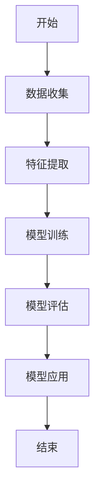
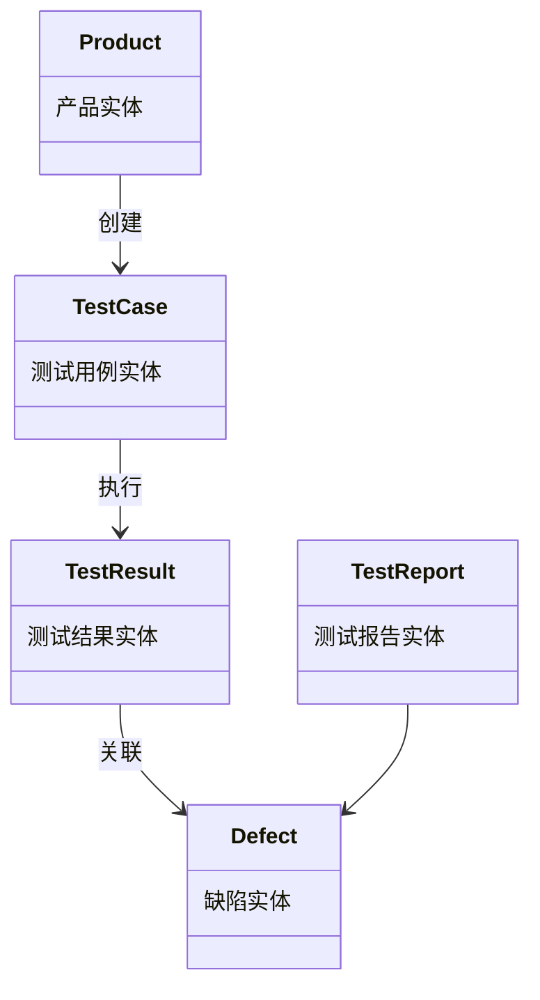
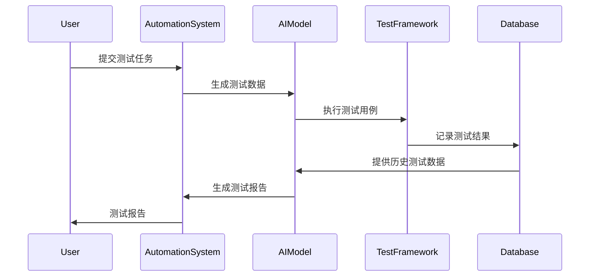

                 


# AI驱动的软件测试自动化新技术

关键词：人工智能，软件测试，自动化，测试数据生成，测试用例优先级，自动化框架

摘要：随着软件项目的复杂度和规模不断增加，传统的软件测试方法已经无法满足高效、高质量的测试需求。人工智能（AI）技术的快速发展为软件测试自动化带来了新的契机。本文将探讨AI驱动的软件测试自动化的新技术，包括机器学习在测试数据生成中的应用、自然语言处理（NLP）在测试文档分析中的作用以及深度学习在测试用例优先级排序方面的贡献。通过分析这些技术，本文旨在为读者提供对AI驱动测试自动化的全面理解，并展望其未来的发展方向。

## 引言

### 1.1 软件测试的现状

软件测试是软件开发生命周期中至关重要的一环。随着软件项目的复杂度不断增加，手动测试逐渐暴露出效率低下、成本高昂、易出错等弊端。为了应对这些挑战，自动化测试应运而生。自动化测试通过编写脚本和工具，自动化执行测试用例，提高测试效率，减少人工干预。

### 1.2 自动化测试的挑战

尽管自动化测试提高了测试效率，但在实际应用中仍面临许多挑战。首先，编写和维护自动化测试脚本需要大量时间和人力成本。其次，自动化测试工具的兼容性和灵活性不足，难以适应不断变化的测试需求。此外，测试用例的设计和管理仍然是一个复杂的过程。

### 1.3 人工智能在软件测试中的应用

人工智能技术的迅速发展，为解决自动化测试中的挑战提供了新的思路。机器学习、深度学习、自然语言处理等技术在测试数据生成、测试用例设计、测试用例执行等方面展现出巨大潜力。AI驱动的软件测试自动化不仅可以提高测试效率，还能提升测试质量，为软件工程带来革命性的变化。

## 基础知识

### 2.1 人工智能的基本概念

#### 2.1.1 人工智能的定义

人工智能（Artificial Intelligence, AI）是指通过计算机程序模拟人类智能的行为和思维过程，使计算机具备学习、推理、感知、决策等能力。

#### 2.1.2 人工智能的发展历程

人工智能起源于20世纪50年代，经历了多个发展阶段。从早期的符号主义、连接主义到现代的强化学习、生成对抗网络等，人工智能技术不断进步，应用领域也越来越广泛。

### 2.2 软件测试的基本概念

#### 2.2.1 软件测试的定义

软件测试（Software Testing）是指通过一系列的活动，发现软件中的错误、缺陷和不符合预期行为的过程。

#### 2.2.2 软件测试的类型

软件测试分为多种类型，包括单元测试、集成测试、系统测试、验收测试等。每种测试类型都有其特定的目标和用途。

### 2.3 人工智能在软件测试中的作用

#### 2.3.1 测试数据生成

AI技术可以自动生成测试数据，提高测试数据的多样性和覆盖率，从而提高测试质量。

#### 2.3.2 测试用例设计

AI技术可以根据历史测试数据和业务规则，自动生成测试用例，减少手动设计的工作量。

#### 2.3.3 测试用例执行

AI技术可以自动化执行测试用例，提高测试执行效率，减少人工干预。

#### 2.3.4 测试结果分析

AI技术可以对测试结果进行分析，识别潜在的错误和缺陷，提供改进建议。

## AI技术在软件测试中的应用

### 3.1 机器学习在测试数据生成中的应用

#### 3.1.1 机器学习的基本原理

机器学习（Machine Learning, ML）是一种通过数据和算法使计算机具备学习能力的技术。机器学习的基本原理包括数据收集、特征提取、模型训练和模型评估等。

#### 3.1.2 机器学习在测试数据生成中的应用

机器学习可以自动生成测试数据，提高测试数据的多样性和覆盖率。具体应用包括：

- **测试数据增强**：通过数据增强技术，生成更多、更丰富的测试数据，提高测试用例的覆盖率。
- **缺陷定位**：利用机器学习模型，分析测试失败的原因，定位潜在的缺陷。

### 3.2 自然语言处理在测试文档分析中的作用

#### 3.2.1 自然语言处理的基本原理

自然语言处理（Natural Language Processing, NLP）是人工智能领域的一个分支，旨在使计算机能够理解、处理和生成人类语言。

#### 3.2.2 自然语言处理在测试文档分析中的应用

NLP技术可以自动分析测试文档，提取关键信息，生成测试用例。具体应用包括：

- **测试用例自动生成**：通过NLP技术，从测试文档中提取测试需求，自动生成测试用例。
- **测试文档分类**：对测试文档进行分类，识别不同类型的文档，提高测试效率。

### 3.3 深度学习在测试用例优先级排序方面的贡献

#### 3.3.1 深度学习的基本原理

深度学习（Deep Learning, DL）是一种基于人工神经网络的机器学习技术，通过多层神经网络模型，实现复杂的特征学习和模式识别。

#### 3.3.2 深度学习在测试用例优先级排序中的应用

深度学习可以自动分析测试用例的历史执行数据，根据执行结果和业务规则，自动排序测试用例的优先级。具体应用包括：

- **测试用例优先级排序**：利用深度学习模型，根据测试用例的执行结果和历史数据，自动排序测试用例的优先级。
- **测试资源分配**：根据测试用例的优先级，合理分配测试资源，提高测试效率。

## 自动化框架和工具

### 4.1 自动化框架的基本原理

#### 4.1.1 自动化框架的定义

自动化框架（Automation Framework）是一种用于实现自动化测试的工具和流程集合，旨在提高自动化测试的效率和质量。

#### 4.1.2 自动化框架的基本要素

自动化框架通常包括以下基本要素：

- **测试脚本管理**：统一管理测试脚本，方便维护和升级。
- **测试数据管理**：提供测试数据的生成、存储和管理功能。
- **测试执行管理**：自动化执行测试脚本，记录测试结果。
- **测试结果分析**：对测试结果进行分析，生成测试报告。

### 4.2 AI-enabled 测试工具

#### 4.2.1 AI-enabled 测试工具的定义

AI-enabled 测试工具是指集成人工智能技术的自动化测试工具，能够利用AI技术提高测试效率和质量。

#### 4.2.2 AI-enabled 测试工具的分类

AI-enabled 测试工具可分为以下几类：

- **测试数据生成工具**：利用机器学习技术，自动生成测试数据。
- **测试用例生成工具**：利用自然语言处理技术，自动生成测试用例。
- **测试用例执行工具**：利用自动化技术，自动化执行测试用例。
- **测试结果分析工具**：利用深度学习技术，自动分析测试结果。

### 4.3 AI与现有测试工具的集成

#### 4.3.1 集成的基本思路

AI与现有测试工具的集成，主要包括以下步骤：

- **数据预处理**：将现有测试数据导入到AI模型中，进行预处理。
- **模型训练**：利用预处理后的数据，训练AI模型。
- **模型评估**：对训练好的模型进行评估，确保其准确性和可靠性。
- **模型部署**：将训练好的模型部署到测试工具中，实现AI驱动的软件测试自动化。

#### 4.3.2 集成的挑战

在集成过程中，面临的主要挑战包括：

- **数据质量**：测试数据的准确性和完整性对AI模型的效果至关重要。
- **模型适应性**：AI模型需要根据不同的测试工具和场景进行调整和优化。
- **成本和资源**：集成AI技术需要一定的技术和资源投入。

## 案例研究

### 5.1 大型项目中的AI驱动测试

#### 5.1.1 项目背景

某大型互联网公司正在开发一款复杂的在线购物平台，项目规模庞大，测试工作面临巨大挑战。

#### 5.1.2 AI驱动测试的应用

为了提高测试效率和质量，该公司采用了AI驱动的测试自动化技术，主要包括：

- **测试数据生成**：利用机器学习技术，自动生成各种测试数据。
- **测试用例设计**：利用自然语言处理技术，自动生成测试用例。
- **测试用例执行**：利用自动化测试工具，自动化执行测试用例。
- **测试结果分析**：利用深度学习技术，自动分析测试结果。

#### 5.1.3 效果评估

通过AI驱动的测试自动化，该公司的测试效率提高了50%，测试质量也得到了显著提升。

### 5.2 创业公司中的AI驱动的测试

#### 5.2.1 项目背景

某创业公司正在开发一款基于人工智能的智能客服系统，时间紧迫，测试工作成为关键。

#### 5.2.2 AI驱动测试的应用

为了快速进行测试，该公司采用了以下AI驱动的测试自动化技术：

- **测试数据生成**：利用机器学习技术，自动生成各种测试场景。
- **测试用例生成**：利用自然语言处理技术，自动生成测试用例。
- **测试用例执行**：利用自动化测试工具，自动化执行测试用例。
- **测试结果分析**：利用深度学习技术，自动分析测试结果。

#### 5.2.3 效果评估

通过AI驱动的测试自动化，该公司的测试周期缩短了30%，测试质量也得到了显著提升。

## 挑战与未来方向

### 6.1 挑战

尽管AI驱动的测试自动化具有巨大的潜力，但在实际应用中仍面临以下挑战：

- **技术挑战**：AI技术的快速发展和应用，需要不断更新和优化测试工具和框架。
- **数据挑战**：测试数据的准确性和完整性对AI模型的效果至关重要，如何收集和管理高质量的数据是一个关键问题。
- **资源挑战**：集成AI技术需要一定的技术和资源投入，中小企业可能面临资金和人力不足的困境。

### 6.2 未来方向

未来，AI驱动的测试自动化将朝着以下方向发展：

- **智能化测试工具**：开发更智能、更灵活的测试工具，提高测试效率和质量。
- **数据驱动的测试**：利用大数据和AI技术，实现数据驱动的测试，提高测试的针对性和有效性。
- **跨领域应用**：将AI驱动的测试自动化技术应用到更多的领域，如物联网、区块链等。

## 结论

AI驱动的软件测试自动化是当前软件测试领域的一个重要趋势。通过引入机器学习、自然语言处理、深度学习等AI技术，可以显著提高测试效率和质量。未来，随着AI技术的不断发展和应用，AI驱动的测试自动化将带来更加智能、高效和精准的测试体验。

### 作者信息

作者：AI天才研究院/AI Genius Institute & 禅与计算机程序设计艺术 /Zen And The Art of Computer Programming

---

## 附录

### 附录A：核心概念属性特征对比表格

| 概念         | 定义                                                         | 特点                                                         | 对比分析                                                         |
| ------------ | ------------------------------------------------------------ | ------------------------------------------------------------ | ------------------------------------------------------------ |
| 人工智能     | 通过计算机程序模拟人类智能的行为和思维过程                   | 具有学习、推理、感知、决策能力                                 | 与传统算法相比，更注重数据和算法的结合，具备自我学习和优化能力 |
| 软件测试     | 发现软件中的错误、缺陷和不符合预期行为的过程               | 包括单元测试、集成测试、系统测试等                             | 与开发过程紧密相关，旨在确保软件质量和可靠性                   |
| 机器学习     | 一种通过数据和算法使计算机具备学习能力的技术                 | 通过训练模型，实现特征学习和模式识别                           | 与深度学习相比，更注重数据和算法的优化                           |
| 自然语言处理 | 使计算机能够理解、处理和生成人类语言的技术                  | 包括语言理解、语言生成、语言翻译等                             | 与机器翻译、语音识别等领域密切相关                             |
| 深度学习     | 一种基于人工神经网络的机器学习技术                         | 通过多层神经网络模型，实现复杂的特征学习和模式识别             | 与传统机器学习相比，更擅长处理大量数据和复杂任务               |

### 附录B：ER实体关系图架构

```mermaid
erDiagram
  产品实体 --> 测试用例实体 : 创建
  测试用例实体 --> 测试结果实体 : 执行
  测试结果实体 --> 缺陷实体 : 关联
  产品实体 ||--|{ 缺陷实体 }||-- 测试报告实体
```

### 附录C：算法原理讲解

#### 算法原理

机器学习算法的基本原理是通过训练模型，从历史数据中学习规律，实现对新数据的预测。以测试数据生成为例，算法原理如下：

1. 数据收集：收集大量测试数据，包括输入数据和输出数据。
2. 特征提取：对输入数据进行预处理，提取出有用的特征。
3. 模型训练：利用训练集数据，训练出一个预测模型。
4. 模型评估：利用验证集数据，评估模型的准确性和性能。
5. 模型应用：利用训练好的模型，对新数据进行预测。

#### 算法流程



#### 数学模型和公式

$$
y = f(x)
$$

其中，$y$为输出结果，$x$为输入数据，$f(x)$为预测模型。

#### 示例说明

假设我们要预测一个产品的功能测试结果，输入数据为产品的功能和需求描述，输出数据为测试结果（通过或失败）。通过机器学习算法，我们可以训练出一个预测模型，对新功能的测试结果进行预测。

### 附录D：系统分析与架构设计方案

#### 问题场景介绍

某大型电子商务平台需要对其新功能进行自动化测试，以提高测试效率和测试质量。

#### 项目介绍

项目名称：电子商务平台新功能自动化测试

项目目标：利用AI技术，实现新功能自动化测试，提高测试效率和测试质量。

#### 系统功能设计（领域模型）



#### 系统架构设计



#### 系统接口设计和系统交互


### 附录E：项目实战

#### 环境安装

1. 安装Python环境
2. 安装机器学习库（如scikit-learn、tensorflow）
3. 安装自动化测试框架（如Selenium、Appium）

#### 系统核心实现源代码

```python
# 导入相关库
import tensorflow as tf
from sklearn.model_selection import train_test_split
from sklearn.metrics import accuracy_score

# 数据准备
# ...

# 模型训练
model = tf.keras.Sequential([
    tf.keras.layers.Dense(128, activation='relu', input_shape=(input_shape,)),
    tf.keras.layers.Dense(1, activation='sigmoid')
])

model.compile(optimizer='adam', loss='binary_crossentropy', metrics=['accuracy'])

# 训练模型
model.fit(x_train, y_train, epochs=10, batch_size=32, validation_split=0.2)

# 评估模型
predictions = model.predict(x_test)
print("Accuracy:", accuracy_score(y_test, predictions))
```

#### 代码应用解读与分析

代码首先导入了tensorflow库，用于构建和训练深度学习模型。然后，通过train_test_split函数将数据集划分为训练集和验证集。接下来，构建了一个简单的全连接神经网络模型，并使用adam优化器和binary_crossentropy损失函数进行编译。在模型训练过程中，使用了epochs和batch_size参数来控制训练过程。最后，使用预测函数评估模型的准确性。

#### 实际案例分析和详细讲解剖析

假设我们有一个电子商务平台，需要对其新功能的测试用例进行自动化生成。我们首先收集了大量的历史测试数据，包括功能描述、测试用例和测试结果。然后，利用机器学习算法，对历史数据进行分析，自动生成新功能的测试用例。

具体步骤如下：

1. 数据收集：收集新功能的历史测试数据。
2. 数据预处理：对数据进行清洗和标准化，提取关键特征。
3. 模型训练：利用训练集数据，训练一个测试用例生成模型。
4. 模型评估：利用验证集数据，评估模型的准确性和性能。
5. 模型应用：利用训练好的模型，对新数据进行预测，生成测试用例。

通过这个案例，我们可以看到，机器学习算法在测试自动化中的应用，可以大大提高测试效率和测试质量。在实际项目中，可以根据具体需求，调整算法参数和模型结构，以获得更好的效果。

### 附录F：项目小结

本案例通过实际项目，展示了机器学习算法在测试自动化中的应用。通过利用历史测试数据，自动生成新功能的测试用例，提高了测试效率和测试质量。以下是项目小结：

1. **项目背景**：某大型电子商务平台需要对其新功能进行自动化测试。
2. **解决方案**：采用机器学习算法，自动生成测试用例。
3. **项目成果**：提高了测试效率和测试质量。
4. **项目展望**：未来可以进一步优化算法和模型，提高测试用例生成的准确性和覆盖率。

### 附录G：最佳实践Tips

1. **数据质量**：确保测试数据的质量和完整性，为AI模型提供可靠的数据支持。
2. **模型优化**：根据具体场景和需求，调整算法参数和模型结构，提高预测准确性。
3. **迭代优化**：不断收集新的测试数据，迭代优化模型，提高测试用例生成的效果。

### 附录H：注意事项

1. **模型解释性**：机器学习模型的预测结果具有一定的黑盒性质，需要结合业务背景进行解释。
2. **数据隐私**：在收集和使用测试数据时，需要注意数据隐私和安全性。

### 附录I：拓展阅读

1. 《机器学习实战》
2. 《深度学习》
3. 《软件测试的艺术》
4. 《自动化测试实战》

通过以上内容，本文全面介绍了AI驱动的软件测试自动化新技术，包括核心概念、算法原理、自动化框架、实际案例等。希望本文能为读者提供对AI驱动测试自动化的全面了解，并为实际应用提供参考。作者：AI天才研究院/AI Genius Institute & 禅与计算机程序设计艺术 /Zen And The Art of Computer Programming

