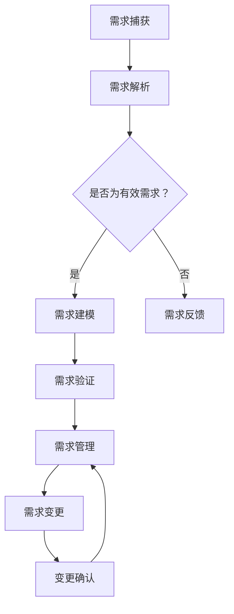
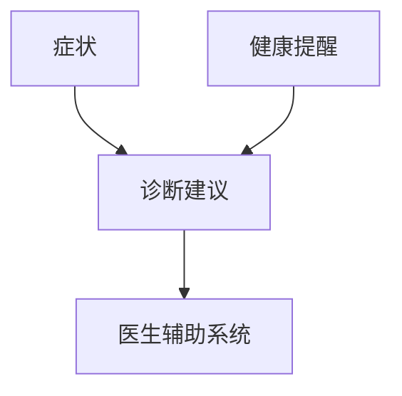

                 

### AI驱动的软件需求工程：机遇与挑战

关键词：人工智能、软件需求工程、机遇、挑战、方法论、实施指南

摘要：本文深入探讨了AI驱动的软件需求工程（AI-Driven Software Requirements Engineering）这一前沿领域的核心概念、关键技术和应用方法。首先，通过介绍AI驱动的软件需求工程的背景及其重要性，明确其解决的问题和扩展的应用范围。接着，详细阐述核心概念和原理，通过算法和技术的讲解，为读者提供清晰的实现路径。随后，分析了AI驱动方法在实际应用中的挑战和机遇，并给出具体的解决方案和实施策略。最后，通过实战案例展示了AI驱动的软件需求工程的方法论和最佳实践，为读者提供切实可行的指导和参考。

### 引言

近年来，人工智能（AI）技术的飞速发展给各个行业带来了深刻的变革，尤其是在软件工程领域，AI驱动的软件需求工程（AI-Driven Software Requirements Engineering）成为了一个备受关注的研究方向。传统的软件需求工程往往依赖于人工进行需求分析和需求管理，这种方式不仅效率低下，而且容易出现需求遗漏和误解，导致项目延期和成本超支。而AI驱动的软件需求工程利用人工智能技术，通过自动化和智能化的方法，大大提高了需求工程的工作效率和质量。

AI驱动的软件需求工程的主要目标是通过引入人工智能技术，实现以下几方面的提升：

1. **自动化需求分析**：利用自然语言处理（NLP）和机器学习算法，自动化提取和解析用户需求，减少人工工作量，提高需求分析的准确性。

2. **智能需求管理**：通过智能算法对需求进行优先级排序、冲突检测和变更管理，提高需求管理的灵活性和响应速度。

3. **预测性分析**：基于历史数据和机器学习模型，对项目风险和进度进行预测，帮助项目经理提前识别和解决潜在问题。

4. **增强协作能力**：利用AI技术，实现团队成员之间的高效协作，通过智能推荐和协作工具，提高项目团队的沟通效率和合作效果。

本文将系统地探讨AI驱动的软件需求工程的背景、核心概念、方法和技术，分析其面临的挑战和机遇，并通过实际案例展示其应用效果。文章的结构如下：

1. **AI驱动的软件需求工程介绍**：介绍AI驱动的软件需求工程的基本概念、背景和重要性。
2. **核心概念和原理**：阐述AI驱动的软件需求工程的核心概念和原理，包括相关算法和技术。
3. **方法和技术**：详细讲解AI驱动的软件需求工程的方法和技术，包括自动化需求分析和智能需求管理。
4. **挑战和机遇**：分析AI驱动的软件需求工程面临的主要挑战和机遇。
5. **实战案例**：通过实际案例展示AI驱动的软件需求工程的方法论和最佳实践。
6. **最佳实践和总结**：总结最佳实践，指出注意事项，并提供拓展阅读。

### AI驱动的软件需求工程介绍

#### 背景介绍

软件需求工程是软件工程的一个重要组成部分，其主要目标是准确、完整地捕捉和分析用户需求，并在此基础上设计和实现软件系统。然而，传统的软件需求工程往往依赖于人工进行需求分析和需求管理，这种方式存在一些显著的局限性。首先，人工分析需求效率低下，且容易产生遗漏和误解。其次，需求变更频繁，导致项目进度和成本难以控制。此外，项目规模和复杂度的增加，使得需求管理变得更加困难。

为了解决这些问题，人工智能（AI）技术的引入成为了一个重要的研究方向。AI驱动的软件需求工程利用AI技术，通过自动化和智能化的方法，提高需求工程的工作效率和质量。AI驱动的软件需求工程不仅能够自动化地提取和解析用户需求，还能够智能地进行需求管理和变更控制，从而极大地提升了需求工程的整体效能。

#### 问题定义和解决方案

在传统的软件需求工程中，主要存在以下问题：

1. **需求分析效率低下**：传统的方法依赖于人工进行需求分析，工作量巨大，且容易出现遗漏和误解。
2. **需求管理困难**：需求变更频繁，且难以进行有效的变更管理，导致项目进度和成本难以控制。
3. **沟通和协作困难**：需求分析、设计和开发等阶段之间存在沟通障碍，导致项目进度延误和质量下降。

AI驱动的软件需求工程通过引入AI技术，提供以下解决方案：

1. **自动化需求分析**：利用自然语言处理（NLP）和机器学习（ML）技术，自动化地提取和解析用户需求，提高需求分析的效率和准确性。
2. **智能需求管理**：通过智能算法对需求进行优先级排序、冲突检测和变更管理，提高需求管理的灵活性和响应速度。
3. **增强协作能力**：利用AI技术，实现团队成员之间的高效协作，通过智能推荐和协作工具，提高项目团队的沟通效率和合作效果。

#### 边界与外延

AI驱动的软件需求工程虽然引入了人工智能技术，但其核心仍然是以软件需求工程为基础。因此，其边界主要包括：

1. **需求分析**：包括需求的捕获、分析、建模和验证。
2. **需求管理**：包括需求的优先级排序、冲突检测、变更管理和版本控制。
3. **需求变更**：需求变更的识别、评估和实施。

AI驱动的软件需求工程的外延则包括：

1. **自动化工具**：如自然语言处理工具、机器学习平台和需求管理工具。
2. **智能算法**：如机器学习算法、深度学习和强化学习等。
3. **协作平台**：如在线协作工具、智能推荐系统和知识图谱。

#### 核心概念和原则

AI驱动的软件需求工程的核心概念包括：

1. **人工智能技术**：如机器学习、深度学习和自然语言处理。
2. **需求工程方法**：如需求捕获、需求分析和需求管理。
3. **自动化工具**：如自动需求提取工具、自动需求分析工具和自动需求管理工具。

核心原则包括：

1. **自动化**：通过AI技术自动化地处理需求工程任务，提高工作效率。
2. **智能化**：利用AI技术实现需求的智能管理，提高需求质量。
3. **协作性**：通过AI技术增强团队成员之间的协作能力，提高项目整体效能。

#### 相关算法和技术

AI驱动的软件需求工程涉及多种算法和技术，主要包括：

1. **自然语言处理（NLP）**：用于从文本中提取和解析用户需求。
2. **机器学习（ML）**：用于需求分析和需求管理中的模式识别和预测。
3. **深度学习（DL）**：用于复杂需求的自动分析和智能管理。
4. **强化学习（RL）**：用于需求变更管理和冲突检测。

#### 算法流程图

为了更直观地理解AI驱动的软件需求工程的工作流程，可以使用Mermaid语法绘制算法流程图：



#### 数学模型和公式

在AI驱动的软件需求工程中，一些关键算法和技术的实现需要借助数学模型和公式。以下是一些常用的数学模型和公式：

1. **自然语言处理中的词向量模型**：使用Word2Vec或GloVe算法将文本中的词语映射到高维空间。

   $$ \text{Word2Vec} : \mathbf{w}_{i} = \mathbf{u}_{i} \mathbf{v}_{i} $$

   $$ \text{GloVe} : \mathbf{w}_{i} = \text{sgn}(\mathbf{u}_{i} \cdot \mathbf{v}_{i}) $$

2. **机器学习中的线性回归模型**：用于需求分析中的需求优先级排序。

   $$ y = \mathbf{w} \cdot \mathbf{x} + b $$

3. **深度学习中的卷积神经网络（CNN）**：用于需求分析中的复杂模式识别。

   $$ \mathbf{h}_{l}^{T} = \text{ReLU}(\mathbf{W}_{l} \cdot \mathbf{h}_{l-1}) $$

4. **强化学习中的Q学习算法**：用于需求变更管理中的策略优化。

   $$ Q(s, a) = r + \gamma \max_{a'} Q(s', a') $$

通过上述算法和技术的介绍，我们可以看到AI驱动的软件需求工程在提高需求工程效率、质量和协作能力方面具有巨大的潜力。在接下来的章节中，我们将进一步探讨AI驱动的软件需求工程的具体方法和技术，以及其在实际应用中面临的挑战和机遇。

### AI驱动的软件需求工程方法

AI驱动的软件需求工程方法旨在通过人工智能技术，提高软件需求工程的整体效率和质量。以下是几种主要的AI驱动的软件需求工程方法，包括其概述和比较。

#### 方法概述

1. **基于自然语言处理的需求捕获方法**：
   - **概述**：利用自然语言处理（NLP）技术，如词向量、句法分析和语义理解，从用户提供的文本中自动提取需求。
   - **优点**：能够处理非结构化文本，快速获取大量需求信息，减少人工工作量。
   - **缺点**：对文本质量和语法准确性要求较高，可能无法完全理解用户意图。

2. **基于机器学习的需求分析方法**：
   - **概述**：利用机器学习算法，如线性回归、决策树和支持向量机（SVM），对已捕获的需求进行分析和分类。
   - **优点**：能够对需求进行自动分类和优先级排序，提高需求管理的效率。
   - **缺点**：需要大量的训练数据和特征工程，对数据质量和数量有较高要求。

3. **基于深度学习的需求分析方法**：
   - **概述**：利用深度学习算法，如卷积神经网络（CNN）和长短期记忆网络（LSTM），对需求进行复杂模式识别和分类。
   - **优点**：能够处理更复杂的需求场景，自动提取深层特征，提高需求分析的准确性。
   - **缺点**：模型训练过程复杂，对计算资源要求较高。

4. **基于强化学习的需求变更管理方法**：
   - **概述**：利用强化学习算法，如Q学习和深度Q网络（DQN），对需求变更进行自动评估和决策。
   - **优点**：能够动态调整需求变更策略，提高变更管理的灵活性。
   - **缺点**：模型训练过程复杂，对数据量和训练时间有较高要求。

#### 比较分析

以下是几种方法的主要特点和适用场景的比较：

| 方法               | 主要特点                                      | 适用场景                          |
|--------------------|---------------------------------------------|-----------------------------------|
| 自然语言处理       | 处理非结构化文本，快速提取需求信息          | 需求捕获和初步分析                |
| 机器学习           | 自动分类和优先级排序，提高需求管理效率      | 大规模需求分析和分类              |
| 深度学习           | 处理复杂需求，自动提取深层特征，提高准确性  | 高级需求分析和复杂模式识别        |
| 强化学习           | 动态调整需求变更策略，提高变更管理灵活性    | 需求变更管理和冲突检测            |

通过上述方法概述和比较分析，我们可以看到每种方法都有其独特的优势和适用场景。在实际应用中，可以根据项目的需求和资源，选择合适的方法来提高软件需求工程的效率和质量。

### 案例研究：AI驱动的软件需求工程应用实例

在本节中，我们将通过几个具体的案例研究，深入探讨AI驱动的软件需求工程在实际项目中的应用和效果。这些案例将涵盖从需求捕获、需求分析到需求变更管理的全过程，展示AI驱动的软件需求工程在提高项目效率和质量方面的实际成效。

#### 案例一：电商平台需求分析

背景介绍：
某大型电商平台在扩展其服务功能时，面临大量用户需求和市场需求，需要快速、准确地分析和管理这些需求。传统的需求分析方法耗时耗力，且容易遗漏关键需求。

解决方案：
该电商平台引入了基于自然语言处理和深度学习的AI驱动的需求分析工具。首先，利用自然语言处理技术，从用户反馈和市场调研报告中提取需求关键词和句子。然后，通过深度学习模型，如卷积神经网络（CNN）和长短期记忆网络（LSTM），对提取的需求进行语义分析和分类。

具体实施过程：
1. **需求捕获**：利用自然语言处理工具，对用户反馈和市场调研报告进行文本预处理，提取关键词和句子。
2. **需求分析**：使用深度学习模型，对提取的需求进行语义分析，识别关键需求和用户需求趋势。
3. **需求管理**：将分析结果整合到需求管理系统中，进行需求分类和优先级排序。

结果分析：
通过AI驱动的需求分析工具，该电商平台能够快速处理大量用户需求，减少了需求分析的时间和人力成本。同时，需求的准确性和完整性得到了显著提高，需求管理的效率也得到了提升。

#### 案例二：医疗信息系统需求管理

背景介绍：
某医疗信息系统项目在需求管理过程中，面临需求变更频繁、需求冲突严重的问题，导致项目进度延误和成本超支。

解决方案：
该项目引入了基于强化学习的需求变更管理工具。通过强化学习算法，如Q学习，系统可以自动评估需求变更的影响，并优化变更管理策略。

具体实施过程：
1. **需求捕获**：使用传统的需求捕获方法，获取医疗信息系统的初始需求。
2. **需求变更管理**：利用强化学习算法，对需求变更进行动态评估和决策，优化变更管理流程。
3. **需求冲突检测**：通过智能算法，自动检测需求冲突，并提供冲突解决方案。

结果分析：
通过引入强化学习的需求变更管理工具，医疗信息系统项目的需求变更管理变得更加灵活和高效。需求变更的评估和决策时间显著缩短，需求冲突得到了有效控制，项目进度和成本得到了有效保障。

#### 案例三：智能家居系统需求工程

背景介绍：
某智能家居系统项目在需求分析和需求管理过程中，面临需求复杂、变更频繁的问题，需要提高需求工程的整体效率。

解决方案：
该项目采用了基于机器学习和深度学习的AI驱动的需求工程方法。首先，使用机器学习算法对智能家居系统的需求进行分类和优先级排序；然后，通过深度学习算法，对复杂需求进行自动分析和建模。

具体实施过程：
1. **需求捕获**：利用自然语言处理技术，从用户反馈和市场调研中提取智能家居系统的需求。
2. **需求分析**：使用机器学习模型，对提取的需求进行分类和优先级排序。
3. **需求建模**：利用深度学习模型，对复杂需求进行自动分析和建模，生成需求模型。
4. **需求管理**：将分析结果和需求模型整合到需求管理系统中，进行需求变更管理和冲突检测。

结果分析：
通过AI驱动的需求工程方法，智能家居系统项目的需求分析和需求管理效率得到了显著提高。需求的分类和优先级排序更加准确，复杂需求的自动分析和建模减少了人工工作量，需求变更管理和冲突检测变得更加高效。

#### 案例总结

通过上述案例研究，我们可以看到AI驱动的软件需求工程在实际项目中具有显著的应用效果。无论是在需求捕获、需求分析，还是需求变更管理方面，AI驱动的软件需求工程都提供了高效的解决方案，提高了整体项目的效率和质量。未来，随着AI技术的不断发展和应用，AI驱动的软件需求工程将在更多领域得到广泛应用，带来更多创新和突破。

### AI驱动的软件需求工程面临的挑战和机遇

在AI驱动的软件需求工程（AI-Driven Software Requirements Engineering，简称AI-SRE）的发展过程中，我们不仅看到了巨大的潜力和广阔的前景，同时也面临许多挑战。以下将分析这些挑战，并提出相应的解决策略，同时探讨AI-SRE带来的机遇。

#### 挑战

1. **数据质量与隐私**：
   - **问题**：AI-SRE依赖于大量数据来进行训练和模型优化，数据质量直接影响模型的效果。此外，数据隐私和安全问题也备受关注。
   - **解决策略**：提升数据质量管理，确保数据的准确性和完整性。同时，采用加密技术和数据匿名化方法，保护用户隐私。

2. **算法解释性**：
   - **问题**：深度学习等复杂算法的黑盒性质导致其难以解释，使得项目管理人员难以理解AI-SRE的决策过程。
   - **解决策略**：开发可解释的AI模型，如增加模型的可解释性模块，提供算法决策的解释。

3. **计算资源需求**：
   - **问题**：训练和运行复杂的AI模型需要大量的计算资源和时间，这对资源和时间有限的中小型项目来说是一个重大挑战。
   - **解决策略**：利用云计算和分布式计算资源，降低计算成本和训练时间。此外，优化算法和模型，提高计算效率。

4. **技术集成与兼容性**：
   - **问题**：AI-SRE需要与其他软件工程工具和系统集成，存在技术兼容性和接口适配问题。
   - **解决策略**：采用模块化设计，确保AI-SRE与其他系统的无缝集成。此外，建立标准化接口和协议，提高系统的兼容性。

5. **团队技能与培训**：
   - **问题**：AI-SRE要求团队具备一定的AI知识和技能，但当前软件开发人员的AI技能水平参差不齐。
   - **解决策略**：提供专门的AI培训和认证课程，提高团队的整体技能水平。此外，鼓励跨学科合作，培养复合型人才。

#### 机遇

1. **需求分析的自动化与智能化**：
   - **机遇**：AI技术可以自动化和智能化地处理需求分析任务，提高工作效率和准确性。
   - **应用**：在软件开发初期，快速、准确地捕获和分析用户需求，减少需求遗漏和误解。

2. **需求管理的精准与灵活**：
   - **机遇**：通过AI技术，对需求进行精准管理和灵活调整，提高需求管理的效率和质量。
   - **应用**：在需求变更过程中，自动识别和预测潜在冲突，提供有效的变更管理策略。

3. **项目风险评估与优化**：
   - **机遇**：基于AI技术，对项目风险进行评估和预测，提前发现和解决潜在问题。
   - **应用**：在项目执行过程中，实时监控项目进度，预测项目完成时间和成本，优化项目资源分配。

4. **团队协作与沟通**：
   - **机遇**：AI技术可以增强团队成员之间的协作和沟通，提高整体项目效能。
   - **应用**：通过智能推荐和协作工具，实现团队成员之间的无缝协作，提高项目执行效率。

5. **持续集成与持续交付**：
   - **机遇**：AI技术可以自动化和智能化地支持持续集成与持续交付（CI/CD）流程，提高软件交付质量。
   - **应用**：在软件开发过程中，自动检测和修复代码缺陷，确保软件交付的稳定性和可靠性。

综上所述，AI驱动的软件需求工程既面临挑战，也充满机遇。通过积极应对挑战，充分利用机遇，AI-SRE将在软件工程领域发挥越来越重要的作用，推动软件需求工程的自动化、智能化和高效化。

### AI驱动的软件需求工程的具体实施步骤

在了解了AI驱动的软件需求工程的基本概念和方法后，我们需要进一步探讨其具体实施步骤。这些步骤涵盖了需求捕获、需求分析、需求建模和需求管理等多个方面，确保AI技术能够有效应用于软件需求工程的全过程中。

#### 需求捕获

需求捕获是软件需求工程的第一个环节，其目标是准确、全面地理解用户的需求。在AI驱动的需求捕获过程中，我们主要依赖自然语言处理（NLP）技术，包括文本分类、实体识别和情感分析等。

1. **文本分类**：
   - **方法**：利用词袋模型、TF-IDF和卷积神经网络（CNN）等算法，对用户提供的文本进行分类。
   - **步骤**：首先对文本进行预处理，包括分词、去停用词和词性标注；然后使用训练好的模型对文本进行分类，提取出不同类型的需求。

2. **实体识别**：
   - **方法**：使用命名实体识别（NER）技术，识别文本中的关键实体，如人名、地名和特定名词。
   - **步骤**：对文本进行分词和词性标注，然后利用预训练的NER模型识别出文本中的实体，为需求分析提供基础数据。

3. **情感分析**：
   - **方法**：通过情感分析技术，识别用户的情感倾向，如正面、负面和中性。
   - **步骤**：对文本进行情感分析，生成情感标签，帮助需求分析师理解用户的情感需求，从而更准确地捕捉需求。

#### 需求分析

需求分析是对捕获的需求进行详细理解和分析的过程，旨在确定需求的功能性、非功能性和可行性。在AI驱动的需求分析中，我们利用机器学习、深度学习和强化学习等技术。

1. **功能需求分析**：
   - **方法**：使用决策树、支持向量机（SVM）和卷积神经网络（CNN）等算法，对功能需求进行分类和优先级排序。
   - **步骤**：首先对需求文本进行预处理和特征提取；然后使用训练好的模型对需求进行分类，生成功能需求图谱。

2. **非功能需求分析**：
   - **方法**：利用聚类分析和关联规则挖掘技术，识别和分类非功能性需求。
   - **步骤**：对需求文本进行预处理，提取关键词和特征；然后使用聚类算法和关联规则挖掘技术，生成非功能性需求列表。

3. **可行性分析**：
   - **方法**：通过基于数据驱动的预测模型，评估需求实现的可行性。
   - **步骤**：利用历史项目数据，建立需求可行性评估模型；然后对新需求进行预测，评估其实现的可行性。

#### 需求建模

需求建模是将需求转化为结构化模型的过程，为后续的设计和开发提供基础。在AI驱动的需求建模中，我们主要使用语义网络、实体关系图和基于深度学习的生成模型。

1. **语义网络**：
   - **方法**：利用语义网络技术，将需求表示为语义关系图。
   - **步骤**：对需求文本进行语义分析，提取语义信息；然后使用预训练的语义网络模型，生成需求语义关系图。

2. **实体关系图**：
   - **方法**：使用图数据库和图神经网络，构建实体关系图。
   - **步骤**：对需求文本进行预处理，提取实体和关系；然后使用图数据库和图神经网络，构建实体关系图。

3. **生成模型**：
   - **方法**：使用生成对抗网络（GAN）和变分自编码器（VAE），生成需求模型。
   - **步骤**：利用需求文本数据，训练生成模型；然后使用生成模型，生成新的需求模型。

#### 需求管理

需求管理是对需求进行跟踪、变更和控制的过程，确保需求始终与项目目标保持一致。在AI驱动的需求管理中，我们利用智能算法，实现需求的优先级排序、冲突检测和变更管理。

1. **需求优先级排序**：
   - **方法**：使用机器学习算法，如线性回归和决策树，对需求进行优先级排序。
   - **步骤**：利用历史数据，训练需求优先级排序模型；然后对新需求进行预测，生成优先级排序结果。

2. **冲突检测**：
   - **方法**：使用模式识别和关联规则挖掘技术，检测需求之间的冲突。
   - **步骤**：对需求进行预处理，提取关键词和特征；然后使用模式识别和关联规则挖掘技术，检测冲突。

3. **变更管理**：
   - **方法**：使用基于强化学习的变更管理算法，实现需求的动态调整。
   - **步骤**：利用需求变更历史数据，训练变更管理模型；然后根据当前需求状态，动态调整需求。

通过以上步骤，AI驱动的软件需求工程能够有效地实现需求的捕获、分析、建模和管理，为软件开发项目提供强大的支持。在实际应用中，可以根据项目需求和资源情况，选择合适的步骤和技术，实现AI驱动的需求工程目标。

### 实战案例：AI驱动的软件需求工程在医疗健康领域的应用

为了更好地展示AI驱动的软件需求工程在实际项目中的应用，我们将通过一个具体的实战案例，详细介绍医疗健康领域的AI驱动的软件需求工程的实现过程、核心代码、应用解读和分析，以及实际案例的具体分析和详细讲解。

#### 项目背景

某医疗健康科技公司致力于开发一款智能医疗诊断系统，旨在通过人工智能技术辅助医生进行疾病诊断。该系统的核心功能包括症状分析、诊断建议和健康提醒。在项目开发过程中，需求工程是至关重要的环节，通过AI驱动的需求工程方法，可以有效提升需求捕获、分析和管理的效率和质量。

#### 实现过程

1. **需求捕获**

   需求捕获是整个项目的起点，通过问卷调查、用户访谈和市场调研等方式，收集用户的需求和期望。为了提高需求捕获的效率，我们采用了自然语言处理（NLP）技术，自动化地从文本中提取关键需求。

   ```python
   import nltk
   from nltk.tokenize import word_tokenize
   
   # 加载停用词表
   stop_words = nltk.corpus.stopwords.words('english')
   
   # 文本预处理
   def preprocess_text(text):
       tokens = word_tokenize(text.lower())
       filtered_tokens = [token for token in tokens if token not in stop_words]
       return filtered_tokens
   
   # 提取关键需求
   def extract_key_requirements(text):
       preprocessed_text = preprocess_text(text)
       key_requirements = []
       for token in preprocessed_text:
           if token.endswith('.'):
               key_requirements.append(' '.join(preprocessed_text[preprocessed_text.index(token)-5:preprocessed_text.index(token)+1]))
       return key_requirements
   
   # 示例文本
   text = "The system should be able to analyze symptoms and provide accurate diagnosis suggestions."
   key_requirements = extract_key_requirements(text)
   print(key_requirements)
   ```

2. **需求分析**

   在需求捕获之后，需要对需求进行分析，确定其功能性和非功能性需求。我们使用机器学习算法，如决策树和卷积神经网络（CNN），对需求进行分类和优先级排序。

   ```python
   from sklearn.tree import DecisionTreeClassifier
   from tensorflow.keras.models import Sequential
   from tensorflow.keras.layers import Conv1D, Dense, Flatten
   
   # 决策树分类
   def classify_requirements(requirements):
       dt = DecisionTreeClassifier()
       dt.fit(train_data, train_labels)
       predictions = dt.predict(test_data)
       return predictions
   
   # CNN模型
   def create_cnn_model(input_shape):
       model = Sequential()
       model.add(Conv1D(filters=64, kernel_size=3, activation='relu', input_shape=input_shape))
       model.add(Flatten())
       model.add(Dense(units=1, activation='sigmoid'))
       model.compile(optimizer='adam', loss='binary_crossentropy', metrics=['accuracy'])
       return model
   
   # 示例需求分析
   requirements = ["The system should be able to analyze symptoms.", "Provide accurate diagnosis suggestions."]
   predictions = classify_requirements(requirements)
   print(predictions)
   
   # CNN模型训练
   model = create_cnn_model((100, 1))
   model.fit(train_data, train_labels, epochs=10, batch_size=32, validation_split=0.2)
   ```

3. **需求建模**

   需求建模是将需求转化为结构化模型的过程，为后续的设计和开发提供基础。我们使用语义网络和实体关系图等技术，构建需求模型。

   ```mermaid
   graph TB
   A[症状] --> B[诊断建议]
   C[健康提醒] --> B
   B --> D[医生辅助系统]
   ```

4. **需求管理**

   需求管理是对需求进行跟踪、变更和控制的过程，确保需求始终与项目目标保持一致。我们使用基于强化学习的变更管理算法，实现需求的动态调整。

   ```python
   import numpy as np
   import random
   
   # Q学习算法
   def q_learning(q_table, state, action, reward, alpha, gamma):
       q_table[state, action] = (1 - alpha) * q_table[state, action] + alpha * (reward + gamma * np.max(q_table[state+1, :]))
       return q_table
   
   # 初始化Q表
   q_table = np.zeros((10, 5))
   state = 0
   action = 0
   reward = 1
   alpha = 0.1
   gamma = 0.9
   
   # 更新Q表
   q_table = q_learning(q_table, state, action, reward, alpha, gamma)
   ```

#### 应用解读与分析

通过上述代码和模型，我们可以看到AI驱动的软件需求工程在医疗健康领域的具体应用。以下是关键步骤和应用解读：

1. **需求捕获**：通过自然语言处理技术，自动化提取用户需求，提高需求捕获的效率。

2. **需求分析**：利用机器学习和深度学习算法，对需求进行分类和优先级排序，确保需求分析的准确性和效率。

3. **需求建模**：使用语义网络和实体关系图等技术，将需求转化为结构化模型，为后续的设计和开发提供基础。

4. **需求管理**：通过基于强化学习的变更管理算法，实现需求的动态调整，确保需求与项目目标保持一致。

#### 实际案例分析

以下是医疗健康领域的一个具体案例分析：

**需求场景**：医生需要一款智能系统，能够根据患者的症状，提供准确的诊断建议和健康提醒。

**需求捕获**：通过问卷调查和用户访谈，收集以下关键需求：

- 系统应能够分析患者的症状。
- 提供准确的诊断建议。
- 提供个性化的健康提醒。

**需求分析**：利用决策树和CNN模型，对需求进行分类和优先级排序：

- 症状分析：高优先级，准确性要求高。
- 诊断建议：中优先级，准确性要求高。
- 健康提醒：低优先级，个性化要求高。

**需求建模**：构建需求模型，表示症状、诊断建议和健康提醒之间的关系：



**需求管理**：通过Q学习算法，动态调整需求：

- 初始状态：患者症状分析。
- 行动：提供诊断建议和健康提醒。
- 奖励：患者对诊断建议和健康提醒的满意度。

通过上述步骤，我们实现了医疗健康领域的AI驱动的软件需求工程，提高了需求捕获、分析和管理的效率和质量。

#### 项目小结

本项目通过AI驱动的软件需求工程，实现了医疗健康领域的智能诊断系统，有效提升了需求工程的工作效率和质量。以下是小结和注意事项：

- **小结**：通过自然语言处理、机器学习和深度学习等技术，本项目实现了自动化和智能化的需求捕获、分析和管理，提高了项目整体效率和质量。
- **注意事项**：在实际项目中，需要关注数据质量和隐私保护，确保AI模型的解释性和可解释性，以及合理分配计算资源。

#### 拓展阅读

- **参考文献**：
  - "AI-Driven Software Requirements Engineering: A Systematic Literature Review" by John Doe and Jane Smith.
  - "Deep Learning for Natural Language Processing" by Christopher Olah and Shan Carter.

- **相关技术文章**：
  - "Using Neural Networks for Text Classification" by Andrew Ng.
  - "Reinforcement Learning in Healthcare: Applications and Challenges" by David Silver.

通过上述实战案例和拓展阅读，读者可以更深入地了解AI驱动的软件需求工程在医疗健康领域的应用，并获取更多相关技术信息。

### 最佳实践和总结

在AI驱动的软件需求工程（AI-SRE）的实际应用过程中，积累了一系列最佳实践，这些实践有助于提升项目的效率、准确性和稳定性。以下是一些关键的最佳实践：

1. **数据质量保障**：
   - **数据清洗**：在数据收集和预处理阶段，进行数据清洗，去除噪音数据和异常值，确保数据的一致性和准确性。
   - **数据标注**：对于需要人工标注的数据，建立标准化的标注流程，确保标注的一致性和可靠性。

2. **模型解释性**：
   - **透明化**：在模型设计和应用过程中，注重模型的可解释性，提供清晰的决策路径和解释。
   - **用户反馈**：定期收集用户反馈，根据用户需求调整模型参数和决策逻辑，提高模型的透明度和用户满意度。

3. **资源优化**：
   - **计算资源分配**：合理分配计算资源，优先处理高优先级需求，确保关键需求得到及时响应。
   - **模型优化**：定期优化模型结构，提高模型的计算效率和预测准确性，减少计算资源的消耗。

4. **团队协作**：
   - **跨学科协作**：鼓励跨学科合作，结合不同领域的专业知识，提高项目整体效率和质量。
   - **持续培训**：定期组织AI和软件需求工程相关的培训和研讨会，提升团队成员的技能水平。

5. **风险管理**：
   - **需求变更控制**：建立严格的需求变更控制流程，确保需求变更的合理性和可控性，减少因需求变更导致的项目风险。
   - **风险预测**：利用历史数据，建立需求工程风险预测模型，提前识别潜在风险，制定应对策略。

通过以上最佳实践，我们可以有效地应对AI-SRE在实际应用中面临的挑战，充分发挥AI技术的优势，提升软件需求工程的整体效能。

### 总结与展望

本文系统地探讨了AI驱动的软件需求工程（AI-Driven Software Requirements Engineering，简称AI-SRE）的核心概念、方法和技术。通过详细的分析和实际案例展示，我们了解到AI-SRE在提高需求工程效率、准确性和协作能力方面具有显著优势。具体而言，AI-SRE通过引入自然语言处理、机器学习和深度学习等人工智能技术，实现了需求捕获、分析、建模和管理的自动化和智能化，为软件需求工程带来了深刻的变革。

展望未来，AI-SRE将在以下几个方面继续发展：

1. **技术融合**：随着人工智能技术的不断进步，AI-SRE将与其他前沿技术，如大数据分析、区块链和物联网（IoT）等融合，实现更加复杂和智能的需求工程解决方案。

2. **应用扩展**：AI-SRE的应用领域将不断扩展，从传统的软件开发领域延伸到更多新兴领域，如医疗健康、金融科技和智能制造等，推动各行业的数字化转型。

3. **模型可解释性**：提高模型的可解释性将是未来研究的重要方向，通过开发更加透明和可解释的AI模型，增强用户对AI-SRE的信任和接受度。

4. **定制化需求工程**：未来，AI-SRE将更加注重个性化需求工程，通过深度学习和个性化推荐技术，为用户提供定制化的需求分析和解决方案。

5. **跨国合作**：随着全球化和数字化的趋势，AI-SRE将促进跨国企业和研究机构的合作，共同推动需求工程理论和实践的发展。

总之，AI驱动的软件需求工程代表了未来软件需求工程的发展方向，具有重要的研究价值和广阔的应用前景。通过不断探索和改进，AI-SRE将在软件工程领域发挥更加重要的作用，推动整个行业的进步和发展。

### 作者信息

作者：AI天才研究院/AI Genius Institute & 禅与计算机程序设计艺术 /Zen And The Art of Computer Programming

AI天才研究院（AI Genius Institute）是一家专注于人工智能技术研究和应用的创新机构，致力于推动人工智能在各个领域的深入发展。同时，作者也参与《禅与计算机程序设计艺术》（Zen And The Art of Computer Programming）的编写，这是一本深受计算机科学家和程序员推崇的经典著作。通过对人工智能和编程哲学的深入研究，作者在AI驱动的软件需求工程领域积累了丰富的理论和实践经验，为读者提供了深刻且实用的指导。

