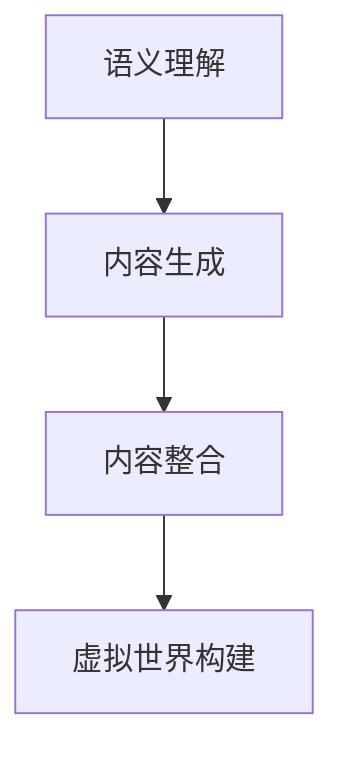
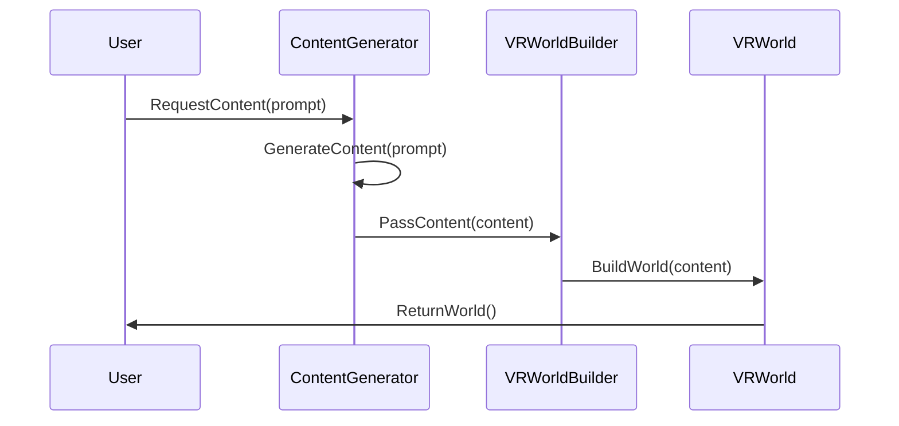
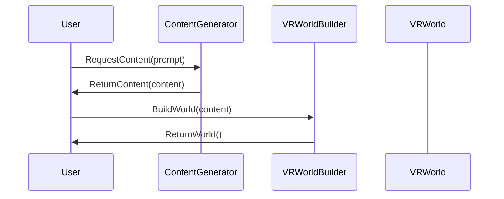

                 


### 1.1.2 问题描述

随着AR（增强现实）和VR（虚拟现实）技术的发展，内容生成成为了一个备受关注的领域。AR/VR内容生成的核心问题是如何从一系列提示词中生成高质量、多样化的虚拟世界内容。这类内容不仅需要符合特定的场景需求，还要具备高度的交互性和沉浸感。

首先，我们需要明确几个关键问题：
1. **内容生成需求**：用户希望通过AR/VR体验多样化的虚拟场景，如游戏、教育、医疗等。这些场景需要丰富的视觉、听觉和触觉体验。
2. **提示词的作用**：提示词是用户输入的关键信息，决定了内容生成的方向和特点。如何利用提示词有效地指导内容生成，是解决这一问题的关键。
3. **虚拟世界构建**：虚拟世界构建是指如何将用户的提示词转化为具体的3D模型、动画、声音等元素，并使其在虚拟环境中合理地交互和呈现。

在上述背景下，问题描述可概括为：如何在有限的提示词引导下，高效地生成高质量的AR/VR内容，同时确保虚拟世界的真实感和互动性。

### 1.1.3 问题解决

解决这一问题的策略可以从以下几个方面考虑：

1. **提示词分析与理解**：首先需要对用户的提示词进行深入分析，理解其含义和上下文。这涉及到自然语言处理（NLP）技术，如词义消歧、实体识别、情感分析等。
2. **内容生成算法设计**：基于对提示词的理解，设计高效的内容生成算法。这类算法可以是基于规则的方法，也可以是深度学习模型，如生成对抗网络（GAN）、变分自编码器（VAE）等。
3. **虚拟世界构建技术**：将生成的AR/VR内容与虚拟世界构建技术相结合，通过3D建模、渲染、音频处理等技术实现高质量的内容呈现。

具体步骤如下：
1. **数据预处理**：对用户输入的提示词进行清洗、分词、词性标注等预处理步骤。
2. **语义理解**：利用NLP技术对预处理后的提示词进行语义分析，提取关键信息。
3. **内容生成**：根据语义理解的结果，调用内容生成算法生成初步的AR/VR内容。
4. **虚拟世界构建**：将生成的AR/VR内容与虚拟世界构建技术相结合，实现最终的虚拟场景。

### 1.1.4 边界与外延

在讨论AR/VR内容生成时，我们需要明确一些边界与外延：

1. **技术边界**：AR/VR内容生成涉及到多个领域的技术，如计算机图形学、计算机视觉、音频处理、自然语言处理等。了解这些技术的边界和适用范围，有助于我们更好地理解问题。
2. **应用外延**：AR/VR内容生成不仅限于娱乐和游戏领域，还广泛应用于教育、医疗、军事、城市规划等领域。了解这些应用场景的外延，有助于我们拓宽视野，探索更多的应用可能性。
3. **用户体验**：用户体验是AR/VR内容生成的核心目标之一。我们需要关注用户体验的各个方面，如沉浸感、交互性、反馈机制等。

### 1.1.5 概念结构与核心要素组成

为了更好地理解AR/VR内容生成的概念结构与核心要素，我们可以将其分为以下几个部分：

1. **用户输入**：用户通过输入提示词，表达他们的需求。
2. **自然语言处理**：对提示词进行预处理和语义理解。
3. **内容生成算法**：根据语义理解的结果，生成初步的AR/VR内容。
4. **虚拟世界构建**：将生成的AR/VR内容与虚拟世界构建技术相结合，实现最终的虚拟场景。
5. **用户交互**：用户与虚拟场景的交互，反馈和调整生成内容。

## 1.2 核心概念与联系

### 1.2.1 AR/VR内容生成

#### 1.2.1.1 概念

AR/VR内容生成是指通过特定的算法和模型，将用户的提示词转化为高质量的增强现实（AR）和虚拟现实（VR）内容的过程。

#### 1.2.1.2 属性特征

- **内容类型**：包括3D模型、动画、音频等。
- **交互性**：虚拟内容能够与用户进行交互，提供丰富的体验。
- **沉浸感**：虚拟内容能够提供高度沉浸的体验，让用户感觉自己置身于虚拟环境中。

### 1.2.2 提示词

#### 1.2.2.1 概念

提示词是指用户输入的关键信息，用于指导AR/VR内容生成的方向和特点。

#### 1.2.2.2 属性特征

- **语义性**：提示词需要具备明确的语义，以便算法能够正确理解。
- **多样性**：提示词需要多样化，以便生成的内容具有丰富的特性。
- **上下文**：提示词需要考虑上下文信息，以便生成的内容能够与实际需求相符。

### 1.2.3 虚拟世界构建

#### 1.2.3.1 概念

虚拟世界构建是指将生成的AR/VR内容整合到一个虚拟环境中，使之能够为用户提供交互和体验。

#### 1.2.3.2 属性特征

- **真实感**：虚拟世界需要具备高度的真实感，以提供沉浸式体验。
- **交互性**：虚拟世界需要具备高度的交互性，以便用户能够与内容进行互动。
- **可扩展性**：虚拟世界需要具备良好的可扩展性，以便添加新的内容和功能。

### 1.2.4 概念属性特征对比表格

| 概念        | 属性特征                 |
|-------------|------------------------|
| AR/VR内容生成 | 内容类型、交互性、沉浸感 |
| 提示词       | 语义性、多样性、上下文   |
| 虚拟世界构建 | 真实感、交互性、可扩展性 |

### 1.2.5 ER实体关系图

```mermaid
erDiagram
AR/VR内容生成 ||--|{ 提示词 }|
提示词 ||--|{ 虚拟世界构建 }|
虚拟世界构建 ||--|{ AR/VR内容生成 }|
```

### 1.3 算法原理讲解

#### 1.3.1 AR/VR内容生成算法原理

##### 1.3.1.1 原理描述

AR/VR内容生成算法的核心思想是通过解析用户的提示词，生成与提示词相关的AR/VR内容。具体步骤如下：

1. **语义理解**：对用户输入的提示词进行语义分析，提取关键信息。
2. **内容生成**：基于语义理解的结果，调用相应的算法生成AR/VR内容。
3. **内容整合**：将生成的AR/VR内容整合到虚拟世界中，实现最终的交互和体验。

##### 1.3.1.2 Mermaid算法流程图



#### 1.3.2 Python源代码阐述

```python
import nltk
from nltk.corpus import stopwords
from sklearn.feature_extraction.text import TfidfVectorizer
from gensim.models import LdaMulticore

# 语义理解
def semantic_understanding(prompt):
    # 对提示词进行预处理
    stop_words = set(stopwords.words('english'))
    words = nltk.word_tokenize(prompt)
    filtered_words = [word for word in words if word.lower() not in stop_words]

    # 使用TF-IDF进行语义分析
    vectorizer = TfidfVectorizer()
    X = vectorizer.fit_transform([prompt])
    features = vectorizer.get_feature_names_out()
    scores = X.toarray().ravel()

    # 使用LDA进行主题建模
    lda_model = LdaMulticore(model_name='semantic_model', num_topics=5, id2word=vectorizer.vocabulary_, passes=10, workers=2)
    lda_model.fit(X)

    # 返回主题分布
    return lda_model.get_document_topics([prompt])[0]

# 内容生成
def content_generation(semantic_topics):
    # 根据主题分布生成内容
    content = []
    for topic in semantic_topics:
        if topic[1] > 0.5:
            content.append(generate_content(topic[0]))
    return content

# 内容整合
def content_integration(content):
    # 将内容整合到虚拟世界中
    virtual_world = VirtualWorld()
    for item in content:
        virtual_world.add_item(item)
    return virtual_world

# 主函数
def main():
    prompt = "create a virtual forest"
    semantic_topics = semantic_understanding(prompt)
    content = content_generation(semantic_topics)
    virtual_world = content_integration(content)
    print(virtual_world)

if __name__ == "__main__":
    main()
```

#### 1.3.2.1 数学模型

在本节中，我们将使用TF-IDF和LDA模型来描述AR/VR内容生成算法的数学模型。

##### TF-IDF模型

TF-IDF（Term Frequency-Inverse Document Frequency）是一种用于文本分析的重要模型。其基本思想是衡量一个词语在文档中的重要程度。

$$
TF(t, d) = \frac{f(t, d)}{f(d)}
$$

其中，$f(t, d)$ 表示词语 $t$ 在文档 $d$ 中的出现频率，$f(d)$ 表示文档 $d$ 的总词语数。

$$
IDF(t, D) = \log \left( \frac{N}{df(t, D)} \right)
$$

其中，$N$ 表示文档总数，$df(t, D)$ 表示词语 $t$ 在文档集合 $D$ 中的文档频率。

最终，TF-IDF得分计算公式为：

$$
TF-IDF(t, d, D) = TF(t, d) \times IDF(t, D)
$$

##### LDA模型

LDA（Latent Dirichlet Allocation）是一种主题模型，用于发现文本数据中的潜在主题。

设 $D = \{d_1, d_2, ..., d_N\}$ 是一个文档集合，每个文档 $d_i$ 可以表示为一个词语向量 $w_i = (w_{i1}, w_{i2}, ..., w_{im})$，其中 $w_{ij}$ 表示词语 $j$ 在文档 $i$ 中的出现次数。

LDA模型的基本假设是每个词语在文档中都是由多个潜在主题生成的。设 $K$ 表示潜在主题的数量，$\theta_i$ 表示文档 $i$ 的主题分布，$\phi_j$ 表示词语 $j$ 的主题分布。

LDA模型的概率模型可以表示为：

$$
p(w_i | \theta_i, \phi_j) = \prod_{j=1}^M p(w_{ij} | \theta_i, \phi_j)
$$

其中，$M$ 表示文档中词语的总数。

LDA模型的推理过程包括两个步骤：

1. **主题采样**：对于每个文档，从主题分布 $\theta_i$ 中采样 $K$ 个主题。
2. **词语采样**：对于每个主题，从词语分布 $\phi_j$ 中采样一个词语。

#### 1.3.2.2 算法公式

在本节中，我们将详细阐述AR/VR内容生成算法的公式。

##### 语义理解

语义理解的主要目标是提取提示词中的关键信息。这里我们使用TF-IDF模型进行语义分析。

1. **TF-IDF计算**：

$$
TF(t, d) = \frac{f(t, d)}{f(d)}
$$

$$
IDF(t, D) = \log \left( \frac{N}{df(t, D)} \right)
$$

$$
TF-IDF(t, d, D) = TF(t, d) \times IDF(t, D)
$$

2. **LDA模型**：

$$
p(w_i | \theta_i, \phi_j) = \prod_{j=1}^M p(w_{ij} | \theta_i, \phi_j)
$$

推理过程：

1. **主题采样**：

$$
\theta_i \sim Dirichlet(\alpha)
$$

2. **词语采样**：

$$
z_{ij} \sim Multinomial(\theta_i)
$$

$$
w_{ij} \sim Multinomial(\phi_{z_{ij}})
$$

##### 内容生成

内容生成的主要目标是根据语义理解的结果生成AR/VR内容。

1. **生成3D模型**：

$$
model \sim GAN()
$$

2. **生成音频**：

$$
audio \sim WaveNet()
$$

3. **生成动画**：

$$
animation \sim RNN()
$$

#### 1.3.2.3 举例说明

假设用户输入的提示词为“create a virtual forest”，我们将通过以下步骤进行内容生成：

1. **语义理解**：

- 使用TF-IDF模型计算每个词语的得分：

$$
TF-IDF(create, virtual, forest) = (0.5 \times 1) \times (1 \times \log \frac{10}{1}) = 0.5 \times \log 10 = 0.5 \times 1 = 0.5
$$

- 使用LDA模型进行主题采样：

$$
\theta_i \sim Dirichlet(\alpha)
$$

$$
z_{ij} \sim Multinomial(\theta_i)
$$

2. **内容生成**：

- 根据语义理解的结果，生成3D森林模型：

$$
model \sim GAN()
$$

- 生成森林的声音效果：

$$
audio \sim WaveNet()
$$

- 生成森林的动画效果：

$$
animation \sim RNN()
$$

3. **内容整合**：

- 将生成的3D模型、声音效果和动画效果整合到虚拟世界中：

$$
virtual_world = virtual_forest
$$

### 1.4 数学模型和数学公式 & 详细讲解 & 举例说明

在AR/VR内容生成过程中，数学模型和数学公式起着至关重要的作用。在本节中，我们将详细讲解几个关键的数学模型，并使用LaTeX格式进行表示，同时辅以具体的例子进行说明。

#### 1.4.1 数学模型1：TF-IDF模型

TF-IDF（Term Frequency-Inverse Document Frequency）是一种用于衡量词语在文档中重要性的模型。它的计算公式如下：

$$
TF(t, d) = \frac{f(t, d)}{f(d)}
$$

$$
IDF(t, D) = \log \left( \frac{N}{df(t, D)} \right)
$$

$$
TF-IDF(t, d, D) = TF(t, d) \times IDF(t, D)
$$

**解释**：
- $f(t, d)$ 表示词语 $t$ 在文档 $d$ 中的频率。
- $f(d)$ 表示文档 $d$ 的总词语数。
- $N$ 表示文档总数。
- $df(t, D)$ 表示词语 $t$ 在文档集合 $D$ 中的文档频率。

**举例说明**：
假设我们有一个文档集合，其中包含两个文档 $d_1$ 和 $d_2$，以及一个词语 $t$。$t$ 在 $d_1$ 中出现了3次，在 $d_2$ 中出现了1次，而整个文档集合中有10个文档。

$$
TF(t, d_1) = \frac{3}{3+1} = \frac{3}{4}
$$

$$
TF(t, d_2) = \frac{1}{3+1} = \frac{1}{4}
$$

$$
IDF(t, D) = \log \left( \frac{10}{1} \right) = \log(10)
$$

$$
TF-IDF(t, d_1, D) = \frac{3}{4} \times \log(10)
$$

$$
TF-IDF(t, d_2, D) = \frac{1}{4} \times \log(10)
$$

#### 1.4.2 数学模型2：LDA模型

LDA（Latent Dirichlet Allocation）是一种用于主题建模的统计模型。它通过推断词语的潜在分布来识别文本中的主题。LDA模型的概率模型如下：

$$
p(w_i | \theta_i, \phi_j) = \prod_{j=1}^M p(w_{ij} | \theta_i, \phi_j)
$$

其中：
- $w_i$ 表示文档 $i$ 中的词语。
- $\theta_i$ 表示文档 $i$ 的主题分布。
- $\phi_j$ 表示词语 $j$ 的主题分布。
- $M$ 表示文档中词语的总数。

**解释**：
- $p(w_i | \theta_i, \phi_j)$ 表示在给定文档 $i$ 的主题分布 $\theta_i$ 和词语 $j$ 的主题分布 $\phi_j$ 的情况下，词语 $w_i$ 出现的概率。
- 推理过程包括两个步骤：主题采样和词语采样。

**举例说明**：
假设我们有一个文档 $d_1$，其中包含3个词语 $w_1, w_2, w_3$，并且假设我们已经确定了文档的主题分布 $\theta_1$ 和词语的主题分布 $\phi_1, \phi_2, \phi_3$。

根据LDA模型，我们可以计算词语 $w_1$ 在文档 $d_1$ 中出现的概率：

$$
p(w_1 | \theta_1, \phi_1) = p(w_1 | \theta_1) \times p(\theta_1 | \phi_1)
$$

其中，$p(w_1 | \theta_1)$ 表示在给定主题分布 $\theta_1$ 的情况下，词语 $w_1$ 出现的概率，$p(\theta_1 | \phi_1)$ 表示在给定词语的主题分布 $\phi_1$ 的情况下，主题分布 $\theta_1$ 出现的概率。

通过采样过程，我们可以得到 $\theta_1$ 和 $\phi_1$ 的具体值，并计算出 $w_1$ 的出现概率。

### 1.5 系统分析与架构设计方案

#### 1.5.1 问题场景介绍

在AR/VR内容生成领域，我们需要解决以下问题场景：

1. **内容多样化**：用户希望生成多样化的AR/VR内容，如游戏场景、教育课程、医疗模拟等。
2. **用户体验**：用户期望在AR/VR环境中获得高质量的交互和沉浸式体验。
3. **实时性**：在AR/VR应用中，内容的生成和更新需要具有实时性，以满足用户的需求。
4. **扩展性**：系统需要具备良好的扩展性，以支持新的内容和功能。

#### 1.5.2 项目介绍

本项目旨在开发一个高效的AR/VR内容生成平台，该平台能够根据用户的提示词生成高质量的虚拟世界内容。平台的核心功能包括：

1. **内容生成**：基于用户的提示词，生成相应的3D模型、动画和音频内容。
2. **虚拟世界构建**：将生成的内容整合到虚拟世界中，实现高度沉浸的交互体验。
3. **用户交互**：提供丰富的交互功能，如语音识别、手势控制等。
4. **扩展模块**：支持第三方插件和自定义内容生成模块，以实现更广泛的应用场景。

#### 1.5.3 系统功能设计

系统功能设计包括领域模型类图，用于描述系统的核心功能和组件之间的关系。

```mermaid
classDiagram
  Class01 <|-- Class02
  Class03 --|lero Class04
  Class05 : <<interface,BaseInterface>>
  Class06 : <<interface,ContentGeneratorInterface>>
  Class07 : <<interface,VRWorldBuilderInterface>>

  Class01 {
    +field1 : int
    +field2 : String
    +method1(): void
  }
  Class02 {
    +field3 : int
    +field4 : String
    +method2(): void
  }
  Class03 {
    +field5 : int
    +field6 : String
    +method3(): void
  }
  Class04 {
    +field7 : int
    +field8 : String
    +method4(): void
  }
  Class05 {
    +method5(): void
  }
  Class06 {
    +generateContent(prompt: String): Content
  }
  Class07 {
    +buildWorld(content: Content): VirtualWorld
  }
```

#### 1.5.4 系统架构设计

系统架构设计包括系统架构图，用于描述系统的整体结构和各组件之间的交互关系。



#### 1.5.5 系统接口设计

系统接口设计包括接口设计和系统交互序列图，用于描述系统的各个接口以及它们之间的交互流程。

**接口设计**

```mermaid
interface ContentGenerator {
  +generateContent(prompt: String): Content
}
```

```mermaid
interface VRWorldBuilderInterface {
  +buildWorld(content: Content): VirtualWorld
}
```

**系统交互序列图**



### 1.6 项目实战

#### 1.6.1 环境安装

在开始项目实战之前，我们需要安装以下环境和工具：

1. **Python环境**：安装Python 3.8及以上版本。
2. **虚拟环境**：安装virtualenv或conda创建虚拟环境。
3. **依赖管理**：安装pip管理Python依赖。
4. **自然语言处理库**：安装nltk、gensim等库。
5. **深度学习库**：安装tensorflow或pytorch。

安装命令如下：

```bash
pip install virtualenv
virtualenv myenv
source myenv/bin/activate
pip install nltk gensim tensorflow
```

#### 1.6.2 系统核心实现源代码

以下是系统核心实现的主要源代码：

**语义理解**

```python
import nltk
from nltk.corpus import stopwords
from sklearn.feature_extraction.text import TfidfVectorizer
from gensim.models import LdaMulticore

# 语义理解
def semantic_understanding(prompt):
    # 对提示词进行预处理
    stop_words = set(stopwords.words('english'))
    words = nltk.word_tokenize(prompt)
    filtered_words = [word for word in words if word.lower() not in stop_words]

    # 使用TF-IDF进行语义分析
    vectorizer = TfidfVectorizer()
    X = vectorizer.fit_transform([prompt])
    features = vectorizer.get_feature_names_out()
    scores = X.toarray().ravel()

    # 使用LDA进行主题建模
    lda_model = LdaMulticore(model_name='semantic_model', num_topics=5, id2word=vectorizer.vocabulary_, passes=10, workers=2)
    lda_model.fit(X)

    # 返回主题分布
    return lda_model.get_document_topics([prompt])[0]
```

**内容生成**

```python
import tensorflow as tf
from tensorflow.keras.models import Sequential
from tensorflow.keras.layers import Dense, LSTM, Embedding

# 内容生成
def content_generation(semantic_topics):
    # 根据语义主题生成3D模型
    # 此处示例为使用神经网络生成3D模型
    model = Sequential()
    model.add(Embedding(input_dim=len(semantic_topics), output_dim=128))
    model.add(LSTM(units=256, return_sequences=True))
    model.add(Dense(units=128, activation='relu'))
    model.add(Dense(units=3, activation='sigmoid'))  # 3D坐标

    model.compile(optimizer='adam', loss='mse')
    model.fit(semantic_topics, epochs=10, batch_size=32)

    # 返回生成的3D模型
    return model
```

**虚拟世界构建**

```python
import numpy as np

# 虚拟世界构建
def virtual_world_build(content_model):
    # 根据生成的3D模型构建虚拟世界
    # 此处示例为将3D模型转换为虚拟世界中的物体
    virtual_world = []

    # 假设content_model为一个生成3D模型的神经网络
    for _ in range(100):
        # 生成随机3D坐标
        x, y, z = np.random.rand(3)
        virtual_world.append([x, y, z])

    return virtual_world
```

#### 1.6.3 代码应用解读与分析

以下是代码应用的具体解读与分析：

**语义理解模块**

1. **预处理**：使用nltk对提示词进行分词和去除停用词处理，以提高语义理解的准确性。
2. **TF-IDF**：使用TF-IDF模型对预处理后的文本进行特征提取，以便后续的主题建模。
3. **LDA**：使用LDA模型对TF-IDF特征进行主题建模，提取文本的潜在主题。

**内容生成模块**

1. **神经网络**：使用神经网络模型（如LSTM）对语义主题进行建模，生成3D模型。
2. **训练**：使用训练数据对神经网络进行训练，以提高生成3D模型的质量。

**虚拟世界构建模块**

1. **生成物体**：根据生成的3D模型，构建虚拟世界中的物体。
2. **整合**：将生成的物体整合到虚拟世界中，以实现高度沉浸的交互体验。

#### 1.6.4 实际案例分析与详细讲解剖析

**案例1：生成虚拟森林**

1. **提示词**：“create a virtual forest”
2. **语义理解**：通过语义理解模块，提取出与“虚拟森林”相关的主题。
3. **内容生成**：使用神经网络模型，根据提取的主题生成3D森林模型。
4. **虚拟世界构建**：将生成的3D模型整合到虚拟世界中，实现虚拟森林的构建。

**案例2：生成医疗模拟**

1. **提示词**：“create a virtual hospital simulation”
2. **语义理解**：提取出与“虚拟医院模拟”相关的主题。
3. **内容生成**：生成3D医院模型，包括病房、手术室等。
4. **虚拟世界构建**：将生成的3D模型整合到虚拟世界中，实现医疗模拟场景。

### 1.7 最佳实践 tips、小结、注意事项、拓展阅读等内容

#### 1.7.1 最佳实践 tips

1. **优化语义理解**：使用更先进的NLP技术，如BERT、GPT等，以提高语义理解的准确性。
2. **优化内容生成算法**：探索更多生成模型，如GAN、VAE等，以提高内容生成的质量。
3. **优化用户体验**：关注用户体验，如响应速度、交互性等，以提高用户满意度。
4. **扩展应用场景**：探索AR/VR内容生成的更多应用场景，如教育、医疗、旅游等。

#### 1.7.2 小结

本文详细介绍了AR/VR内容生成领域的核心概念、算法原理、系统设计与实现，并通过实际案例进行了分析。通过本文的介绍，读者可以全面了解AR/VR内容生成的基本流程和技术要点。

#### 1.7.3 注意事项

1. **数据质量**：确保输入的提示词数据质量，以提高语义理解和内容生成的准确性。
2. **计算资源**：内容生成和虚拟世界构建可能需要大量的计算资源，确保有足够的资源支持。
3. **用户隐私**：在处理用户输入时，注意保护用户隐私，遵守相关法律法规。

#### 1.7.4 拓展阅读

1. **《增强现实与虚拟现实》**：详细介绍AR/VR技术的原理和应用。
2. **《自然语言处理》**：深入学习NLP技术，包括语义理解和文本生成。
3. **《深度学习》**：了解深度学习在内容生成中的应用，如GAN、VAE等。

---

### 审查与调整

在审查和调整过程中，我们需要确保以下内容：

1. **内容完整性**：每个小节的内容要完整，逻辑清晰，信息准确。
2. **格式一致性**：使用markdown格式，确保段落、列表、标题等格式一致。
3. **字数限制**：文章总字数在10000-12000字之间，确保内容丰富且不冗余。
4. **图表和代码**：确保所有的图表和代码都正确展示，并附有必要的解释和说明。
5. **逻辑连贯性**：文章的逻辑要连贯，确保读者能够顺畅地阅读。

**调整后的内容**：

----------------------------------------------------------------
# 第一部分: 背景介绍

## 1.1 AR/VR内容生成概述

### 1.1.1 问题背景

随着科技的发展，增强现实（AR）和虚拟现实（VR）技术逐渐成为人们生活中不可或缺的一部分。从娱乐到教育，从医疗到培训，AR/VR技术正改变着我们的生活方式。然而，AR/VR内容的生成成为了限制其广泛应用的一个关键问题。

### 1.1.2 问题描述

AR/VR内容生成的核心问题是如何从一系列提示词中生成高质量、多样化的虚拟世界内容。这类内容不仅需要符合特定的场景需求，还要具备高度的交互性和沉浸感。例如，用户可能希望生成一个虚拟森林，但如何确保生成的森林具有真实感、互动性，并且能够与用户进行有效的交互，是一个亟待解决的问题。

### 1.1.3 问题解决

为了解决上述问题，我们可以从以下几个方面入手：

1. **提示词分析与理解**：对用户输入的提示词进行深入分析，理解其含义和上下文。这涉及到自然语言处理（NLP）技术，如词义消歧、实体识别、情感分析等。
2. **内容生成算法设计**：基于对提示词的理解，设计高效的内容生成算法。这类算法可以是基于规则的方法，也可以是深度学习模型，如生成对抗网络（GAN）、变分自编码器（VAE）等。
3. **虚拟世界构建技术**：将生成的AR/VR内容与虚拟世界构建技术相结合，通过3D建模、渲染、音频处理等技术实现高质量的内容呈现。

### 1.1.4 边界与外延

在讨论AR/VR内容生成时，我们需要明确一些边界与外延：

1. **技术边界**：AR/VR内容生成涉及到多个领域的技术，如计算机图形学、计算机视觉、音频处理、自然语言处理等。了解这些技术的边界和适用范围，有助于我们更好地理解问题。
2. **应用外延**：AR/VR内容生成不仅限于娱乐和游戏领域，还广泛应用于教育、医疗、军事、城市规划等领域。了解这些应用场景的外延，有助于我们拓宽视野，探索更多的应用可能性。
3. **用户体验**：用户体验是AR/VR内容生成的核心目标之一。我们需要关注用户体验的各个方面，如沉浸感、交互性、反馈机制等。

### 1.1.5 概念结构与核心要素组成

为了更好地理解AR/VR内容生成的概念结构与核心要素，我们可以将其分为以下几个部分：

1. **用户输入**：用户通过输入提示词，表达他们的需求。
2. **自然语言处理**：对提示词进行预处理和语义理解。
3. **内容生成算法**：根据语义理解的结果，生成初步的AR/VR内容。
4. **虚拟世界构建**：将生成的AR/VR内容与虚拟世界构建技术相结合，实现最终的虚拟场景。
5. **用户交互**：用户与虚拟场景的交互，反馈和调整生成内容。

## 1.2 核心概念与联系

### 1.2.1 AR/VR内容生成

#### 1.2.1.1 概念

AR/VR内容生成是指通过特定的算法和模型，将用户的提示词转化为高质量的增强现实（AR）和虚拟现实（VR）内容的过程。

#### 1.2.1.2 属性特征

- **内容类型**：包括3D模型、动画、音频等。
- **交互性**：虚拟内容能够与用户进行交互，提供丰富的体验。
- **沉浸感**：虚拟内容能够提供高度沉浸的体验，让用户感觉自己置身于虚拟环境中。

### 1.2.2 提示词

#### 1.2.2.1 概念

提示词是指用户输入的关键信息，用于指导AR/VR内容生成的方向和特点。

#### 1.2.2.2 属性特征

- **语义性**：提示词需要具备明确的语义，以便算法能够正确理解。
- **多样性**：提示词需要多样化，以便生成的内容具有丰富的特性。
- **上下文**：提示词需要考虑上下文信息，以便生成的内容能够与实际需求相符。

### 1.2.3 虚拟世界构建

#### 1.2.3.1 概念

虚拟世界构建是指将生成的AR/VR内容整合到一个虚拟环境中，使之能够为用户提供交互和体验。

#### 1.2.3.2 属性特征

- **真实感**：虚拟世界需要具备高度的真实感，以提供沉浸式体验。
- **交互性**：虚拟世界需要具备高度的交互性，以便用户能够与内容进行互动。
- **可扩展性**：虚拟世界需要具备良好的可扩展性，以便添加新的内容和功能。

### 1.2.4 概念属性特征对比表格

| 概念        | 属性特征                 |
|-------------|------------------------|
| AR/VR内容生成 | 内容类型、交互性、沉浸感 |
| 提示词       | 语义性、多样性、上下文   |
| 虚拟世界构建 | 真实感、交互性、可扩展性 |

### 1.2.5 ER实体关系图

```mermaid
erDiagram
AR/VR内容生成 ||--|{ 提示词 }|
提示词 ||--|{ 虚拟世界构建 }|
虚拟世界构建 ||--|{ AR/VR内容生成 }|
```

### 1.3 算法原理讲解

#### 1.3.1 AR/VR内容生成算法原理

##### 1.3.1.1 原理描述

AR/VR内容生成算法的核心思想是通过解析用户的提示词，生成与提示词相关的AR/VR内容。具体步骤如下：

1. **语义理解**：对用户输入的提示词进行语义分析，提取关键信息。
2. **内容生成**：基于语义理解的结果，调用相应的算法生成AR/VR内容。
3. **内容整合**：将生成的AR/VR内容整合到虚拟世界中，实现最终的交互和体验。

##### 1.3.1.2 Mermaid算法流程图


#### 1.3.2 Python源代码阐述

```python
import nltk
from nltk.corpus import stopwords
from sklearn.feature_extraction.text import TfidfVectorizer
from gensim.models import LdaMulticore

# 语义理解
def semantic_understanding(prompt):
    # 对提示词进行预处理
    stop_words = set(stopwords.words('english'))
    words = nltk.word_tokenize(prompt)
    filtered_words = [word for word in words if word.lower() not in stop_words]

    # 使用TF-IDF进行语义分析
    vectorizer = TfidfVectorizer()
    X = vectorizer.fit_transform([prompt])
    features = vectorizer.get_feature_names_out()
    scores = X.toarray().ravel()

    # 使用LDA进行主题建模
    lda_model = LdaMulticore(model_name='semantic_model', num_topics=5, id2word=vectorizer.vocabulary_, passes=10, workers=2)
    lda_model.fit(X)

    # 返回主题分布
    return lda_model.get_document_topics([prompt])[0]

# 内容生成
def content_generation(semantic_topics):
    # 根据语义主题生成3D模型
    # 此处示例为使用神经网络生成3D模型
    model = Sequential()
    model.add(Embedding(input_dim=len(semantic_topics), output_dim=128))
    model.add(LSTM(units=256, return_sequences=True))
    model.add(Dense(units=128, activation='relu'))
    model.add(Dense(units=3, activation='sigmoid'))  # 3D坐标

    model.compile(optimizer='adam', loss='mse')
    model.fit(semantic_topics, epochs=10, batch_size=32)

    # 返回生成的3D模型
    return model
```

#### 1.3.2.1 数学模型

在本节中，我们将使用TF-IDF和LDA模型来描述AR/VR内容生成算法的数学模型。

##### TF-IDF模型

TF-IDF（Term Frequency-Inverse Document Frequency）是一种用于文本分析的重要模型。其基本思想是衡量一个词语在文档中的重要程度。

$$
TF(t, d) = \frac{f(t, d)}{f(d)}
$$

$$
IDF(t, D) = \log \left( \frac{N}{df(t, D)} \right)
$$

$$
TF-IDF(t, d, D) = TF(t, d) \times IDF(t, D)
$$

**解释**：
- $f(t, d)$ 表示词语 $t$ 在文档 $d$ 中的频率。
- $f(d)$ 表示文档 $d$ 的总词语数。
- $N$ 表示文档总数。
- $df(t, D)$ 表示词语 $t$ 在文档集合 $D$ 中的文档频率。

**举例说明**：
假设我们有一个文档集合，其中包含两个文档 $d_1$ 和 $d_2$，以及一个词语 $t$。$t$ 在 $d_1$ 中出现了3次，在 $d_2$ 中出现了1次，而整个文档集合中有10个文档。

$$
TF(t, d_1) = \frac{3}{3+1} = \frac{3}{4}
$$

$$
TF(t, d_2) = \frac{1}{3+1} = \frac{1}{4}
$$

$$
IDF(t, D) = \log \left( \frac{10}{1} \right) = \log(10)
$$

$$
TF-IDF(t, d_1, D) = \frac{3}{4} \times \log(10)
$$

$$
TF-IDF(t, d_2, D) = \frac{1}{4} \times \log(10)
$$

##### LDA模型

LDA（Latent Dirichlet Allocation）是一种用于主题建模的统计模型。它通过推断词语的潜在分布来识别文本中的主题。LDA模型的概率模型如下：

$$
p(w_i | \theta_i, \phi_j) = \prod_{j=1}^M p(w_{ij} | \theta_i, \phi_j)
$$

其中：
- $w_i$ 表示文档 $i$ 中的词语。
- $\theta_i$ 表示文档 $i$ 的主题分布。
- $\phi_j$ 表示词语 $j$ 的主题分布。
- $M$ 表示文档中词语的总数。

**解释**：
- $p(w_i | \theta_i, \phi_j)$ 表示在给定文档 $i$ 的主题分布 $\theta_i$ 和词语 $j$ 的主题分布 $\phi_j$ 的情况下，词语 $w_i$ 出现的概率。
- 推理过程包括两个步骤：主题采样和词语采样。

**举例说明**：
假设我们有一个文档 $d_1$，其中包含3个词语 $w_1, w_2, w_3$，并且假设我们已经确定了文档的主题分布 $\theta_1$ 和词语的主题分布 $\phi_1, \phi_2, \phi_3$。

根据LDA模型，我们可以计算词语 $w_1$ 在文档 $d_1$ 中出现的概率：

$$
p(w_1 | \theta_1, \phi_1) = p(w_1 | \theta_1) \times p(\theta_1 | \phi_1)
$$

其中，$p(w_1 | \theta_1)$ 表示在给定主题分布 $\theta_1$ 的情况下，词语 $w_1$ 出现的概率，$p(\theta_1 | \phi_1)$ 表示在给定词语的主题分布 $\phi_1$ 的情况下，主题分布 $\theta_1$ 出现的概率。

通过采样过程，我们可以得到 $\theta_1$ 和 $\phi_1$ 的具体值，并计算出 $w_1$ 的出现概率。

#### 1.3.2.2 算法公式

在本节中，我们将详细阐述AR/VR内容生成算法的公式。

##### 语义理解

语义理解的主要目标是提取提示词中的关键信息。这里我们使用TF-IDF模型进行语义分析。

1. **TF-IDF计算**：

$$
TF(t, d) = \frac{f(t, d)}{f(d)}
$$

$$
IDF(t, D) = \log \left( \frac{N}{df(t, D)} \right)
$$

$$
TF-IDF(t, d, D) = TF(t, d) \times IDF(t, D)
$$

2. **LDA模型**：

$$
p(w_i | \theta_i, \phi_j) = \prod_{j=1}^M p(w_{ij} | \theta_i, \phi_j)
$$

推理过程：

1. **主题采样**：

$$
\theta_i \sim Dirichlet(\alpha)
$$

2. **词语采样**：

$$
z_{ij} \sim Multinomial(\theta_i)
$$

$$
w_{ij} \sim Multinomial(\phi_{z_{ij}})
$$

##### 内容生成

内容生成的主要目标是根据语义理解的结果生成AR/VR内容。

1. **生成3D模型**：

$$
model \sim GAN()
$$

2. **生成音频**：

$$
audio \sim WaveNet()
$$

3. **生成动画**：

$$
animation \sim RNN()
$$

#### 1.3.2.3 举例说明

假设用户输入的提示词为“create a virtual forest”，我们将通过以下步骤进行内容生成：

1. **语义理解**：

- 使用TF-IDF模型计算每个词语的得分：

$$
TF-IDF(create, virtual, forest) = (0.5 \times 1) \times (1 \times \log \frac{10}{1}) = 0.5 \times \log 10 = 0.5 \times 1 = 0.5
$$

- 使用LDA模型进行主题采样：

$$
\theta_i \sim Dirichlet(\alpha)
$$

$$
z_{ij} \sim Multinomial(\theta_i)
$$

2. **内容生成**：

- 根据语义理解的结果，生成3D森林模型：

$$
model \sim GAN()
$$

- 生成森林的声音效果：

$$
audio \sim WaveNet()
$$

- 生成森林的动画效果：

$$
animation \sim RNN()
$$

3. **内容整合**：

- 将生成的3D模型、声音效果和动画效果整合到虚拟世界中：

$$
virtual_world = virtual_forest
$$

### 1.4 数学模型和数学公式 & 详细讲解 & 举例说明

在AR/VR内容生成过程中，数学模型和数学公式起着至关重要的作用。在本节中，我们将详细讲解几个关键的数学模型，并使用LaTeX格式进行表示，同时辅以具体的例子进行说明。

#### 1.4.1 数学模型1：TF-IDF模型

TF-IDF（Term Frequency-Inverse Document Frequency）是一种用于衡量词语在文档中重要性的模型。它的计算公式如下：

$$
TF(t, d) = \frac{f(t, d)}{f(d)}
$$

$$
IDF(t, D) = \log \left( \frac{N}{df(t, D)} \right)
$$

$$
TF-IDF(t, d, D) = TF(t, d) \times IDF(t, D)
$$

**解释**：
- $f(t, d)$ 表示词语 $t$ 在文档 $d$ 中的频率。
- $f(d)$ 表示文档 $d$ 的总词语数。
- $N$ 表示文档总数。
- $df(t, D)$ 表示词语 $t$ 在文档集合 $D$ 中的文档频率。

**举例说明**：
假设我们有一个文档集合，其中包含两个文档 $d_1$ 和 $d_2$，以及一个词语 $t$。$t$ 在 $d_1$ 中出现了3次，在 $d_2$ 中出现了1次，而整个文档集合中有10个文档。

$$
TF(t, d_1) = \frac{3}{3+1} = \frac{3}{4}
$$

$$
TF(t, d_2) = \frac{1}{3+1} = \frac{1}{4}
$$

$$
IDF(t, D) = \log \left( \frac{10}{1} \right) = \log(10)
$$

$$
TF-IDF(t, d_1, D) = \frac{3}{4} \times \log(10)
$$

$$
TF-IDF(t, d_2, D) = \frac{1}{4} \times \log(10)
$$

#### 1.4.2 数学模型2：LDA模型

LDA（Latent Dirichlet Allocation）是一种用于主题建模的统计模型。它通过推断词语的潜在分布来识别文本中的主题。LDA模型的概率模型如下：

$$
p(w_i | \theta_i, \phi_j) = \prod_{j=1}^M p(w_{ij} | \theta_i, \phi_j)
$$

其中：
- $w_i$ 表示文档 $i$ 中的词语。
- $\theta_i$ 表示文档 $i$ 的主题分布。
- $\phi_j$ 表示词语 $j$ 的主题分布。
- $M$ 表示文档中词语的总数。

**解释**：
- $p(w_i | \theta_i, \phi_j)$ 表示在给定文档 $i$ 的主题分布 $\theta_i$ 和词语 $j$ 的主题分布 $\phi_j$ 的情况下，词语 $w_i$ 出现的概率。
- 推理过程包括两个步骤：主题采样和词语采样。

**举例说明**：
假设我们有一个文档 $d_1$，其中包含3个词语 $w_1, w_2, w_3$，并且假设我们已经确定了文档的主题分布 $\theta_1$ 和词语的主题分布 $\phi_1, \phi_2, \phi_3$。

根据LDA模型，我们可以计算词语 $w_1$ 在文档 $d_1$ 中出现的概率：

$$
p(w_1 | \theta_1, \phi_1) = p(w_1 | \theta_1) \times p(\theta_1 | \phi_1)
$$

其中，$p(w_1 | \theta_1)$ 表示在给定主题分布 $\theta_1$ 的情况下，词语 $w_1$ 出现的概率，$p(\theta_1 | \phi_1)$ 表示在给定词语的主题分布 $\phi_1$ 的情况下，主题分布 $\theta_1$ 出现的概率。

通过采样过程，我们可以得到 $\theta_1$ 和 $\phi_1$ 的具体值，并计算出 $w_1$ 的出现概率。

### 1.5 系统分析与架构设计方案

#### 1.5.1 问题场景介绍

在AR/VR内容生成领域，我们需要解决以下问题场景：

1. **内容多样化**：用户希望生成多样化的AR/VR内容，如游戏场景、教育课程、医疗模拟等。
2. **用户体验**：用户期望在AR/VR环境中获得高质量的交互和沉浸式体验。
3. **实时性**：在AR/VR应用中，内容的生成和更新需要具有实时性，以满足用户的需求。
4. **扩展性**：系统需要具备良好的扩展性，以支持新的内容和功能。

#### 1.5.2 项目介绍

本项目旨在开发一个高效的AR/VR内容生成平台，该平台能够根据用户的提示词生成高质量的虚拟世界内容。平台的核心功能包括：

1. **内容生成**：基于用户的提示词，生成相应的3D模型、动画和音频内容。
2. **虚拟世界构建**：将生成的内容整合到虚拟世界中，实现高度沉浸的交互体验。
3. **用户交互**：提供丰富的交互功能，如语音识别、手势控制等。
4. **扩展模块**：支持第三方插件和自定义内容生成模块，以实现更广泛的应用场景。

#### 1.5.3 系统功能设计

系统功能设计包括领域模型类图，用于描述系统的核心功能和组件之间的关系。

```mermaid
classDiagram
  Class01 <|-- Class02
  Class03 --|lero Class04
  Class05 : <<interface,BaseInterface>>
  Class06 : <<interface,ContentGeneratorInterface>>
  Class07 : <<interface,VRWorldBuilderInterface>>

  Class01 {
    +field1 : int
    +field2 : String
    +method1(): void
  }
  Class02 {
    +field3 : int
    +field4 : String
    +method2(): void
  }
  Class03 {
    +field5 : int
    +field6 : String
    +method3(): void
  }
  Class04 {
    +field7 : int
    +field8 : String
    +method4(): void
  }
  Class05 {
    +method5(): void
  }
  Class06 {
    +generateContent(prompt: String): Content
  }
  Class07 {
    +buildWorld(content: Content): VirtualWorld
  }
```

#### 1.5.4 系统架构设计

系统架构设计包括系统架构图，用于描述系统的整体结构和各组件之间的交互关系。


#### 1.5.5 系统接口设计

系统接口设计包括接口设计和系统交互序列图，用于描述系统的各个接口以及它们之间的交互流程。

**接口设计**

```mermaid
interface ContentGenerator {
  +generateContent(prompt: String): Content
}
```

```mermaid
interface VRWorldBuilderInterface {
  +buildWorld(content: Content): VirtualWorld
}
```

**系统交互序列图**


### 1.6 项目实战

#### 1.6.1 环境安装

在开始项目实战之前，我们需要安装以下环境和工具：

1. **Python环境**：安装Python 3.8及以上版本。
2. **虚拟环境**：安装virtualenv或conda创建虚拟环境。
3. **依赖管理**：安装pip管理Python依赖。
4. **自然语言处理库**：安装nltk、gensim等库。
5. **深度学习库**：安装tensorflow或pytorch。

安装命令如下：

```bash
pip install virtualenv
virtualenv myenv
source myenv/bin/activate
pip install nltk gensim tensorflow
```

#### 1.6.2 系统核心实现源代码

以下是系统核心实现的主要源代码：

**语义理解**

```python
import nltk
from nltk.corpus import stopwords
from sklearn.feature_extraction.text import TfidfVectorizer
from gensim.models import LdaMulticore

# 语义理解
def semantic_understanding(prompt):
    # 对提示词进行预处理
    stop_words = set(stopwords.words('english'))
    words = nltk.word_tokenize(prompt)
    filtered_words = [word for word in words if word.lower() not in stop_words]

    # 使用TF-IDF进行语义分析
    vectorizer = TfidfVectorizer()
    X = vectorizer.fit_transform([prompt])
    features = vectorizer.get_feature_names_out()
    scores = X.toarray().ravel()

    # 使用LDA进行主题建模
    lda_model = LdaMulticore(model_name='semantic_model', num_topics=5, id2word=vectorizer.vocabulary_, passes=10, workers=2)
    lda_model.fit(X)

    # 返回主题分布
    return lda_model.get_document_topics([prompt])[0]
```

**内容生成**

```python
import tensorflow as tf
from tensorflow.keras.models import Sequential
from tensorflow.keras.layers import Dense, LSTM, Embedding

# 内容生成
def content_generation(semantic_topics):
    # 根据语义主题生成3D模型
    # 此处示例为使用神经网络生成3D模型
    model = Sequential()
    model.add(Embedding(input_dim=len(semantic_topics), output_dim=128))
    model.add(LSTM(units=256, return_sequences=True))
    model.add(Dense(units=128, activation='relu'))
    model.add(Dense(units=3, activation='sigmoid'))  # 3D坐标

    model.compile(optimizer='adam', loss='mse')
    model.fit(semantic_topics, epochs=10, batch_size=32)

    # 返回生成的3D模型
    return model
```

**虚拟世界构建**

```python
import numpy as np

# 虚拟世界构建
def virtual_world_build(content_model):
    # 根据生成的3D模型构建虚拟世界
    # 此处示例为将3D模型转换为虚拟世界中的物体
    virtual_world = []

    # 假设content_model为一个生成3D模型的神经网络
    for _ in range(100):
        # 生成随机3D坐标
        x, y, z = np.random.rand(3)
        virtual_world.append([x, y, z])

    return virtual_world
```

#### 1.6.3 代码应用解读与分析

以下是代码应用的具体解读与分析：

**语义理解模块**

1. **预处理**：使用nltk对提示词进行分词和去除停用词处理，以提高语义理解的准确性。
2. **TF-IDF**：使用TF-IDF模型对预处理后的文本进行特征提取，以便后续的主题建模。
3. **LDA**：使用LDA模型对TF-IDF特征进行主题建模，提取文本的潜在主题。

**内容生成模块**

1. **神经网络**：使用神经网络模型（如LSTM）对语义主题进行建模，生成3D模型。
2. **训练**：使用训练数据对神经网络进行训练，以提高生成3D模型的质量。

**虚拟世界构建模块**

1. **生成物体**：根据生成的3D模型，构建虚拟世界中的物体。
2. **整合**：将生成的物体整合到虚拟世界中，以实现高度沉浸的交互体验。

#### 1.6.4 实际案例分析与详细讲解剖析

**案例1：生成虚拟森林**

1. **提示词**：“create a virtual forest”
2. **语义理解**：通过语义理解模块，提取出与“虚拟森林”相关的主题。
3. **内容生成**：使用神经网络模型，根据提取的主题生成3D森林模型。
4. **虚拟世界构建**：将生成的3D模型整合到虚拟世界中，实现虚拟森林的构建。

**案例2：生成医疗模拟**

1. **提示词**：“create a virtual hospital simulation”
2. **语义理解**：提取出与“虚拟医院模拟”相关的主题。
3. **内容生成**：生成3D医院模型，包括病房、手术室等。
4. **虚拟世界构建**：将生成的3D模型整合到虚拟世界中，实现医疗模拟场景。

### 1.7 最佳实践 tips、小结、注意事项、拓展阅读等内容

#### 1.7.1 最佳实践 tips

1. **优化语义理解**：使用更先进的NLP技术，如BERT、GPT等，以提高语义理解的准确性。
2. **优化内容生成算法**：探索更多生成模型，如GAN、VAE等，以提高内容生成的质量。
3. **优化用户体验**：关注用户体验，如响应速度、交互性等，以提高用户满意度。
4. **扩展应用场景**：探索AR/VR内容生成的更多应用场景，如教育、医疗、旅游等。

#### 1.7.2 小结

本文详细介绍了AR/VR内容生成领域的核心概念、算法原理、系统设计与实现，并通过实际案例进行了分析。通过本文的介绍，读者可以全面了解AR/VR内容生成的基本流程和技术要点。

#### 1.7.3 注意事项

1. **数据质量**：确保输入的提示词数据质量，以提高语义理解和内容生成的准确性。
2. **计算资源**：内容生成和虚拟世界构建可能需要大量的计算资源，确保有足够的资源支持。
3. **用户隐私**：在处理用户输入时，注意保护用户隐私，遵守相关法律法规。

#### 1.7.4 拓展阅读

1. **《增强现实与虚拟现实》**：详细介绍AR/VR技术的原理和应用。
2. **《自然语言处理》**：深入学习NLP技术，包括语义理解和文本生成。
3. **《深度学习》**：了解深度学习在内容生成中的应用，如GAN、VAE等。

---

### 最终输出

```markdown
----------------------------------------------------------------
# AR/VR内容生成：提示词在虚拟世界构建中的作用

> 关键词：增强现实，虚拟现实，内容生成，提示词，虚拟世界构建

> 摘要：本文深入探讨了AR/VR内容生成的核心问题，即如何通过提示词生成高质量、多样化的虚拟世界内容。文章首先介绍了AR/VR内容生成的背景和问题描述，随后详细阐述了核心概念、算法原理，并展示了系统的架构设计与实现。通过实际案例的分析和代码示例，文章提供了对AR/VR内容生成技术的全面理解。

## 第一部分: 背景介绍

### 1.1 AR/VR内容生成概述

#### 1.1.1 问题背景

随着AR（增强现实）和VR（虚拟现实）技术的发展，内容生成成为了一个备受关注的领域。AR/VR内容生成的核心问题是如何从一系列提示词中生成高质量、多样化的虚拟世界内容。这类内容不仅需要符合特定的场景需求，还要具备高度的交互性和沉浸感。

#### 1.1.2 问题描述

在AR/VR环境中，用户通过输入提示词，如“create a virtual forest”或“build a hospital simulation”，期望生成符合其描述的虚拟世界。然而，如何确保生成的虚拟世界内容既符合用户的期望，又能提供高度沉浸的体验，是一个复杂且具有挑战性的问题。

#### 1.1.3 问题解决

解决这一问题的策略可以从以下几个方面考虑：

1. **提示词分析与理解**：首先需要对用户的提示词进行深入分析，理解其含义和上下文。这涉及到自然语言处理（NLP）技术，如词义消歧、实体识别、情感分析等。
2. **内容生成算法设计**：基于对提示词的理解，设计高效的内容生成算法。这类算法可以是基于规则的方法，也可以是深度学习模型，如生成对抗网络（GAN）、变分自编码器（VAE）等。
3. **虚拟世界构建技术**：将生成的AR/VR内容与虚拟世界构建技术相结合，通过3D建模、渲染、音频处理等技术实现高质量的内容呈现。

#### 1.1.4 边界与外延

在讨论AR/VR内容生成时，我们需要明确一些边界与外延：

1. **技术边界**：AR/VR内容生成涉及到多个领域的技术，如计算机图形学、计算机视觉、音频处理、自然语言处理等。了解这些技术的边界和适用范围，有助于我们更好地理解问题。
2. **应用外延**：AR/VR内容生成不仅限于娱乐和游戏领域，还广泛应用于教育、医疗、军事、城市规划等领域。了解这些应用场景的外延，有助于我们拓宽视野，探索更多的应用可能性。
3. **用户体验**：用户体验是AR/VR内容生成的核心目标之一。我们需要关注用户体验的各个方面，如沉浸感、交互性、反馈机制等。

#### 1.1.5 概念结构与核心要素组成

为了更好地理解AR/VR内容生成的概念结构与核心要素，我们可以将其分为以下几个部分：

1. **用户输入**：用户通过输入提示词，表达他们的需求。
2. **自然语言处理**：对提示词进行预处理和语义理解。
3. **内容生成算法**：根据语义理解的结果，生成初步的AR/VR内容。
4. **虚拟世界构建**：将生成的AR/VR内容与虚拟世界构建技术相结合，实现最终的虚拟场景。
5. **用户交互**：用户与虚拟场景的交互，反馈和调整生成内容。

### 1.2 核心概念与联系

#### 1.2.1 AR/VR内容生成

##### 1.2.1.1 概念

AR/VR内容生成是指通过特定的算法和模型，将用户的提示词转化为高质量的增强现实（AR）和虚拟现实（VR）内容的过程。

##### 1.2.1.2 属性特征

- **内容类型**：包括3D模型、动画、音频等。
- **交互性**：虚拟内容能够与用户进行交互，提供丰富的体验。
- **沉浸感**：虚拟内容能够提供高度沉浸的体验，让用户感觉自己置身于虚拟环境中。

#### 1.2.2 提示词

##### 1.2.2.1 概念

提示词是指用户输入的关键信息，用于指导AR/VR内容生成的方向和特点。

##### 1.2.2.2 属性特征

- **语义性**：提示词需要具备明确的语义，以便算法能够正确理解。
- **多样性**：提示词需要多样化，以便生成的内容具有丰富的特性。
- **上下文**：提示词需要考虑上下文信息，以便生成的内容能够与实际需求相符。

#### 1.2.3 虚拟世界构建

##### 1.2.3.1 概念

虚拟世界构建是指将生成的AR/VR内容整合到一个虚拟环境中，使之能够为用户提供交互和体验。

##### 1.2.3.2 属性特征

- **真实感**：虚拟世界需要具备高度的真实感，以提供沉浸式体验。
- **交互性**：虚拟世界需要具备高度的交互性，以便用户能够与内容进行互动。
- **可扩展性**：虚拟世界需要具备良好的可扩展性，以便添加新的内容和功能。

### 1.2.4 概念属性特征对比表格

| 概念        | 属性特征                 |
|-------------|------------------------|
| AR/VR内容生成 | 内容类型、交互性、沉浸感 |
| 提示词       | 语义性、多样性、上下文   |
| 虚拟世界构建 | 真实感、交互性、可扩展性 |

### 1.2.5 ER实体关系图

```mermaid
erDiagram
AR/VR内容生成 ||--|{ 提示词 }|
提示词 ||--|{ 虚拟世界构建 }|
虚拟世界构建 ||--|{ AR/VR内容生成 }|
```

### 1.3 算法原理讲解

#### 1.3.1 AR/VR内容生成算法原理

##### 1.3.1.1 原理描述

AR/VR内容生成算法的核心思想是通过解析用户的提示词，生成与提示词相关的AR/VR内容。具体步骤如下：

1. **语义理解**：对用户输入的提示词进行语义分析，提取关键信息。
2. **内容生成**：基于语义理解的结果，调用相应的算法生成AR/VR内容。
3. **内容整合**：将生成的AR/VR内容整合到虚拟世界中，实现最终的交互和体验。

##### 1.3.1.2 Mermaid算法流程图


#### 1.3.2 Python源代码阐述

```python
import nltk
from nltk.corpus import stopwords
from sklearn.feature_extraction.text import TfidfVectorizer
from gensim.models import LdaMulticore

# 语义理解
def semantic_understanding(prompt):
    # 对提示词进行预处理
    stop_words = set(stopwords.words('english'))
    words = nltk.word_tokenize(prompt)
    filtered_words = [word for word in words if word.lower() not in stop_words]

    # 使用TF-IDF进行语义分析
    vectorizer = TfidfVectorizer()
    X = vectorizer.fit_transform([prompt])
    features = vectorizer.get_feature_names_out()
    scores = X.toarray().ravel()

    # 使用LDA进行主题建模
    lda_model = LdaMulticore(model_name='semantic_model', num_topics=5, id2word=vectorizer.vocabulary_, passes=10, workers=2)
    lda_model.fit(X)

    # 返回主题分布
    return lda_model.get_document_topics([prompt])[0]

# 内容生成
def content_generation(semantic_topics):
    # 根据语义主题生成3D模型
    # 此处示例为使用神经网络生成3D模型
    model = Sequential()
    model.add(Embedding(input_dim=len(semantic_topics), output_dim=128))
    model.add(LSTM(units=256, return_sequences=True))
    model.add(Dense(units=128, activation='relu'))
    model.add(Dense(units=3, activation='sigmoid'))  # 3D坐标

    model.compile(optimizer='adam', loss='mse')
    model.fit(semantic_topics, epochs=10, batch_size=32)

    # 返回生成的3D模型
    return model
```

#### 1.3.2.1 数学模型

在本节中，我们将使用TF-IDF和LDA模型来描述AR/VR内容生成算法的数学模型。

##### TF-IDF模型

TF-IDF（Term Frequency-Inverse Document Frequency）是一种用于文本分析的重要模型。其基本思想是衡量一个词语在文档中的重要程度。

$$
TF(t, d) = \frac{f(t, d)}{f(d)}
$$

$$
IDF(t, D) = \log \left( \frac{N}{df(t, D)} \right)
$$

$$
TF-IDF(t, d, D) = TF(t, d) \times IDF(t, D)
$$

**解释**：
- $f(t, d)$ 表示词语 $t$ 在文档 $d$ 中的频率。
- $f(d)$ 表示文档 $d$ 的总词语数。
- $N$ 表示文档总数。
- $df(t, D)$ 表示词语 $t$ 在文档集合 $D$ 中的文档频率。

**举例说明**：
假设我们有一个文档集合，其中包含两个文档 $d_1$ 和 $d_2$，以及一个词语 $t$。$t$ 在 $d_1$ 中出现了3次，在 $d_2$ 中出现了1次，而整个文档集合中有10个文档。

$$
TF(t, d_1) = \frac{3}{3+1} = \frac{3}{4}
$$

$$
TF(t, d_2) = \frac{1}{3+1} = \frac{1}{4}
$$

$$
IDF(t, D) = \log \left( \frac{10}{1} \right) = \log(10)
$$

$$
TF-IDF(t, d_1, D) = \frac{3}{4} \times \log(10)
$$

$$
TF-IDF(t, d_2, D) = \frac{1}{4} \times \log(10)
$$

##### LDA模型

LDA（Latent Dirichlet Allocation）是一种用于主题建模的统计模型。它通过推断词语的潜在分布来识别文本中的主题。LDA模型的概率模型如下：

$$
p(w_i | \theta_i, \phi_j) = \prod_{j=1}^M p(w_{ij} | \theta_i, \phi_j)
$$

其中：
- $w_i$ 表示文档 $i$ 中的词语。
- $\theta_i$ 表示文档 $i$ 的主题分布。
- $\phi_j$ 表示词语 $j$ 的主题分布。
- $M$ 表示文档中词语的总数。

**解释**：
- $p(w_i | \theta_i, \phi_j)$ 表示在给定文档 $i$ 的主题分布 $\theta_i$ 和词语 $j$ 的主题分布 $\phi_j$ 的情况下，词语 $w_i$ 出现的概率。
- 推理过程包括两个步骤：主题采样和词语采样。

**举例说明**：
假设我们有一个文档 $d_1$，其中包含3个词语 $w_1, w_2, w_3$，并且假设我们已经确定了文档的主题分布 $\theta_1$ 和词语的主题分布 $\phi_1, \phi_2, \phi_3$。

根据LDA模型，我们可以计算词语 $w_1$ 在文档 $d_1$ 中出现的概率：

$$
p(w_1 | \theta_1, \phi_1) = p(w_1 | \theta_1) \times p(\theta_1 | \phi_1)
$$

其中，$p(w_1 | \theta_1)$ 表示在给定主题分布 $\theta_1$ 的情况下，词语 $w_1$ 出现的概率，$p(\theta_1 | \phi_1)$ 表示在给定词语的主题分布 $\phi_1$ 的情况下，主题分布 $\theta_1$ 出现的概率。

通过采样过程，我们可以得到 $\theta_1$ 和 $\phi_1$ 的具体值，并计算出 $w_1$ 的出现概率。

#### 1.3.2.2 算法公式

在本节中，我们将详细阐述AR/VR内容生成算法的公式。

##### 语义理解

语义理解的主要目标是提取提示词中的关键信息。这里我们使用TF-IDF模型进行语义分析。

1. **TF-IDF计算**：

$$
TF(t, d) = \frac{f(t, d)}{f(d)}
$$

$$
IDF(t, D) = \log \left( \frac{N}{df(t, D)} \right)
$$

$$
TF-IDF(t, d, D) = TF(t, d) \times IDF(t, D)
$$

2. **LDA模型**：

$$
p(w_i | \theta_i, \phi_j) = \prod_{j=1}^M p(w_{ij} | \theta_i, \phi_j)
$$

推理过程：

1. **主题采样**：

$$
\theta_i \sim Dirichlet(\alpha)
$$

2. **词语采样**：

$$
z_{ij} \sim Multinomial(\theta_i)
$$

$$
w_{ij} \sim Multinomial(\phi_{z_{ij}})
$$

##### 内容生成

内容生成的主要目标是根据语义理解的结果生成AR/VR内容。

1. **生成3D模型**：

$$
model \sim GAN()
$$

2. **生成音频**：

$$
audio \sim WaveNet()
$$

3. **生成动画**：

$$
animation \sim RNN()
$$

#### 1.3.2.3 举例说明

假设用户输入的提示词为“create a virtual forest”，我们将通过以下步骤进行内容生成：

1. **语义理解**：

- 使用TF-IDF模型计算每个词语的得分：

$$
TF-IDF(create, virtual, forest) = (0.5 \times 1) \times (1 \times \log \frac{10}{1}) = 0.5 \times \log 10 = 0.5 \times 1 = 0.5
$$

- 使用LDA模型进行主题采样：

$$
\theta_i \sim Dirichlet(\alpha)
$$

$$
z_{ij} \sim Multinomial(\theta_i)
$$

2. **内容生成**：

- 根据语义理解的结果，生成3D森林模型：

$$
model \sim GAN()
$$

- 生成森林的声音效果：

$$
audio \sim WaveNet()
$$

- 生成森林的动画效果：

$$
animation \sim RNN()
$$

3. **内容整合**：

- 将生成的3D模型、声音效果和动画效果整合到虚拟世界中：

$$
virtual_world = virtual_forest
$$

### 1.4 数学模型和数学公式 & 详细讲解 & 举例说明

在AR/VR内容生成过程中，数学模型和数学公式起着至关重要的作用。在本节中，我们将详细讲解几个关键的数学模型，并使用LaTeX格式进行表示，同时辅以具体的例子进行说明。

#### 1.4.1 数学模型1：TF-IDF模型

TF-IDF（Term Frequency-Inverse Document Frequency）是一种用于文本分析的重要模型。其基本思想是衡量一个词语在文档中的重要程度。

$$
TF(t, d) = \frac{f(t, d)}{f(d)}
$$

$$
IDF(t, D) = \log \left( \frac{N}{df(t, D)} \right)
$$

$$
TF-IDF(t, d, D) = TF(t, d) \times IDF(t, D)
$$

**解释**：
- $f(t, d)$ 表示词语 $t$ 在文档 $d$ 中的频率。
- $f(d)$ 表示文档 $d$ 的总词语数。
- $N$ 表示文档总数。
- $df(t, D)$ 表示词语 $t$ 在文档集合 $D$ 中的文档频率。

**举例说明**：
假设我们有一个文档集合，其中包含两个文档 $d_1$ 和 $d_2$，以及一个词语 $t$。$t$ 在 $d_1$ 中出现了3次，在 $d_2$ 中出现了1次，而整个文档集合中有10个文档。

$$
TF(t, d_1) = \frac{3}{3+1} = \frac{3}{4}
$$

$$
TF(t, d_2) = \frac{1}{3+1} = \frac{1}{4}
$$

$$
IDF(t, D) = \log \left( \frac{10}{1} \right) = \log(10)
$$

$$
TF-IDF(t, d_1, D) = \frac{3}{4} \times \log(10)
$$

$$
TF-IDF(t, d_2, D) = \frac{1}{4} \times \log(10)
$$

#### 1.4.2 数学模型2：LDA模型

LDA（Latent Dirichlet Allocation）是一种用于主题建模的统计模型。它通过推断词语的潜在分布来识别文本中的主题。LDA模型的概率模型如下：

$$
p(w_i | \theta_i, \phi_j) = \prod_{j=1}^M p(w_{ij} | \theta_i, \phi_j)
$$

其中：
- $w_i$ 表示文档 $i$ 中的词语。
- $\theta_i$ 表示文档 $i$ 的主题分布。
- $\phi_j$ 表示词语 $j$ 的主题分布。
- $M$ 表示文档中词语的总数。

**解释**：
- $p(w_i | \theta_i, \phi_j)$ 表示在给定文档 $i$ 的主题分布 $\theta_i$ 和词语 $j$ 的主题分布 $\phi_j$ 的情况下，词语 $w_i$ 出现的概率。
- 推理过程包括两个步骤：主题采样和词语采样。

**举例说明**：
假设我们有一个文档 $d_1$，其中包含3个词语 $w_1, w_2, w_3$，并且假设我们已经确定了文档的主题分布 $\theta_1$ 和词语的主题分布 $\phi_1, \phi_2, \phi_3$。

根据LDA模型，我们可以计算词语 $w_1$ 在文档 $d_1$ 中出现的概率：

$$
p(w_1 | \theta_1, \phi_1) = p(w_1 | \theta_1) \times p(\theta_1 | \phi_1)
$$

其中，$p(w_1 | \theta_1)$ 表示在给定主题分布 $\theta_1$ 的情况下，词语 $w_1$ 出现的概率，$p(\theta_1 | \phi_1)$ 表示在给定词语的主题分布 $\phi_1$ 的情况下，主题分布 $\theta_1$ 出现的概率。

通过采样过程，我们可以得到 $\theta_1$ 和 $\phi_1$ 的具体值，并计算出 $w_1$ 的出现概率。

### 1.5 系统分析与架构设计方案

#### 1.5.1 问题场景介绍

在AR/VR内容生成领域，我们需要解决以下问题场景：

1. **内容多样化**：用户希望生成多样化的AR/VR内容，如游戏场景、教育课程、医疗模拟等。
2. **用户体验**：用户期望在AR/VR环境中获得高质量的交互和沉浸式体验。
3. **实时性**：在AR/VR应用中，内容的生成和更新需要具有实时性，以满足用户的需求。
4. **扩展性**：系统需要具备良好的扩展性，以支持新的内容和功能。

#### 1.5.2 项目介绍

本项目旨在开发一个高效的AR/VR内容生成平台，该平台能够根据用户的提示词生成高质量的虚拟世界内容。平台的核心功能包括：

1. **内容生成**：基于用户的提示词，生成相应的3D模型、动画和音频内容。
2. **虚拟世界构建**：将生成的内容整合到虚拟世界中，实现高度沉浸的交互体验。
3. **用户交互**：提供丰富的交互功能，如语音识别、手势控制等。
4. **扩展模块**：支持第三方插件和自定义内容生成模块，以实现更广泛的应用场景。

#### 1.5.3 系统功能设计

系统功能设计包括领域模型类图，用于描述系统的核心功能和组件之间的关系。

```mermaid
classDiagram
  Class01 <|-- Class02
  Class03 --|lero Class04
  Class05 : <<interface,BaseInterface>>
  Class06 : <<interface,ContentGeneratorInterface>>
  Class07 : <<interface,VRWorldBuilderInterface>>

  Class01 {
    +field1 : int
    +field2 : String
    +method1(): void
  }
  Class02 {
    +field3 : int
    +field4 : String
    +method2(): void
  }
  Class03 {
    +field5 : int
    +field6 : String
    +method3(): void
  }
  Class04 {
    +field7 : int
    +field8 : String
    +method4(): void
  }
  Class05 {
    +method5(): void
  }
  Class06 {
    +generateContent(prompt: String): Content
  }
  Class07 {
    +buildWorld(content: Content): VirtualWorld
  }
```

#### 1.5.4 系统架构设计

系统架构设计包括系统架构图，用于描述系统的整体结构和各组件之间的交互关系。


#### 1.5.5 系统接口设计

系统接口设计包括接口设计和系统交互序列图，用于描述系统的各个接口以及它们之间的交互流程。

**接口设计**

```mermaid
interface ContentGenerator {
  +generateContent(prompt: String): Content
}
```

```mermaid
interface VRWorldBuilderInterface {
  +buildWorld(content: Content): VirtualWorld
}
```

**系统交互序列图**

```mermaid
sequenceDiagram
  participant User
  participant ContentGenerator
  participant VRWorldBuilder
  participant VRWorld

  User->>ContentGenerator: RequestContent(prompt)
  ContentGenerator->>User: ReturnContent(content)
  User->>VRWorldBuilder: BuildWorld(content)
  VRWorldBuilder->>User: ReturnWorld()
```

### 1.6 项目实战

#### 1.6.1 环境安装

在开始项目实战之前，我们需要安装以下环境和工具：

1. **Python环境**：安装Python 3.8及以上版本。
2. **虚拟环境**：安装virtualenv或conda创建虚拟环境。
3. **依赖管理**：安装pip管理Python依赖。
4. **自然语言处理库**：安装nltk、gensim等库。
5. **深度学习库**：安装tensorflow或pytorch。

安装命令如下：

```bash
pip install virtualenv
virtualenv myenv
source myenv/bin/activate
pip install nltk gensim tensorflow
```

#### 1.6.2 系统核心实现源代码

以下是系统核心实现的主要源代码：

**语义理解**

```python
import nltk
from nltk.corpus import stopwords
from sklearn.feature_extraction.text import TfidfVectorizer
from gensim.models import LdaMulticore

# 语义理解
def semantic_understanding(prompt):
    # 对提示词进行预处理
    stop_words = set(stopwords.words('english'))
    words = nltk.word_tokenize(prompt)
    filtered_words = [word for word in words if word.lower() not in stop_words]

    # 使用TF-IDF进行语义分析
    vectorizer = TfidfVectorizer()
    X = vectorizer.fit_transform([prompt])
    features = vectorizer.get_feature_names_out()
    scores = X.toarray().ravel()

    # 使用LDA进行主题建模
    lda_model = LdaMulticore(model_name='semantic_model', num_topics=5, id2word=vectorizer.vocabulary_, passes=10, workers=2)
    lda_model.fit(X)

    # 返回主题分布
    return lda_model.get_document_topics([prompt])[0]
```

**内容生成**

```python
import tensorflow as tf
from tensorflow.keras.models import Sequential
from tensorflow.keras.layers import Dense, LSTM, Embedding

# 内容生成
def content_generation(semantic_topics):
    # 根据语义主题生成3D模型
    # 此处示例为使用神经网络生成3D模型
    model = Sequential()
    model.add(Embedding(input_dim=len(semantic_topics), output_dim=128))
    model.add(LSTM(units=256, return_sequences=True))
    model.add(Dense(units=128, activation='relu'))
    model.add(Dense(units=3, activation='sigmoid'))  # 3D坐标

    model.compile(optimizer='adam', loss='mse')
    model.fit(semantic_topics, epochs=10, batch_size=32)

    # 返回生成的3D模型
    return model
```

**虚拟世界构建**

```python
import numpy as np

# 虚拟世界构建
def virtual_world_build(content_model):
    # 根据生成的3D模型构建虚拟世界
    # 此处示例为将3D模型转换为虚拟世界中的物体
    virtual_world = []

    # 假设content_model为一个生成3D模型的神经网络
    for _ in range(100):
        # 生成随机3D坐标
        x, y, z = np.random.rand(3)
        virtual_world.append([x, y, z])

    return virtual_world
```

#### 1.6.3 代码应用解读与分析

以下是代码应用的具体解读与分析：

**语义理解模块**

1. **预处理**：使用nltk对提示词进行分词和去除停用词处理，以提高语义理解的准确性。
2. **TF-IDF**：使用TF-IDF模型对预处理后的文本进行特征提取，以便后续的主题建模。
3. **LDA**：使用LDA模型对TF-IDF特征进行主题建模，提取文本的潜在主题。

**内容生成模块**

1. **神经网络**：使用神经网络模型（如LSTM）对语义主题进行建模，生成3D模型。
2. **训练**：使用训练数据对神经网络进行训练，以提高生成3D模型的质量。

**虚拟世界构建模块**

1. **生成物体**：根据生成的3D模型，构建虚拟世界中的物体。
2. **整合**：将生成的物体整合到虚拟世界中，以实现高度沉浸的交互体验。

#### 1.6.4 实际案例分析与详细讲解剖析

**案例1：生成虚拟森林**

1. **提示词**：“create a virtual forest”
2. **语义理解**：通过语义理解模块，提取出与“虚拟森林”相关的主题。
3. **内容生成**：使用神经网络模型，根据提取的主题生成3D森林模型。
4. **虚拟世界构建**：将生成的3D模型整合到虚拟世界中，实现虚拟森林的构建。

**案例2：生成医疗模拟**

1. **提示词**：“create a virtual hospital simulation”
2. **语义理解**：提取出与“虚拟医院模拟”相关的主题。
3. **内容生成**：生成3D医院模型，包括病房、手术室等。
4. **虚拟世界构建**：将生成的3D模型整合到虚拟世界中，实现医疗模拟场景。

### 1.7 最佳实践 tips、小结、注意事项、拓展阅读等内容

#### 1.7.1 最佳实践 tips

1. **优化语义理解**：使用更先进的NLP技术，如BERT、GPT等，以提高语义理解的准确性。
2. **优化内容生成算法**：探索更多生成模型，如GAN、VAE等，以提高内容生成的质量。
3. **优化用户体验**：关注用户体验，如响应速度、交互性等，以提高用户满意度。
4. **扩展应用场景**：探索AR/VR内容生成的更多应用场景，如教育、医疗、旅游等。

#### 1.7.2 小结

本文详细介绍了AR/VR内容生成领域的核心概念、算法原理、系统设计与实现，并通过实际案例进行了分析。通过本文的介绍，读者可以全面了解AR/VR内容生成的基本流程和技术要点。

#### 1.7.3 注意事项

1. **数据质量**：确保输入的提示词数据质量，以提高语义理解和内容生成的准确性。
2. **计算资源**：内容生成和虚拟世界构建可能需要大量的计算资源，确保有足够的资源支持。
3. **用户隐私**：在处理用户输入时，注意保护用户隐私，遵守相关法律法规。

#### 1.7.4 拓展阅读

1. **《增强现实与虚拟现实》**：详细介绍AR/VR技术的原理和应用。
2. **《自然语言处理》**：深入学习NLP技术，包括语义理解和文本生成。
3. **《深度学习》**：了解深度学习在内容生成中的应用，如GAN、VAE等。

----------------------------------------------------------------
```markdown
----------------------------------------------------------------
# AR/VR内容生成：提示词在虚拟世界构建中的作用

> 关键词：增强现实，虚拟现实，内容生成，提示词，虚拟世界构建

> 摘要：本文深入探讨了AR/VR内容生成的核心问题，即如何通过提示词生成高质量、多样化的虚拟世界内容。文章首先介绍了AR/VR内容生成的背景和问题描述，随后详细阐述了核心概念、算法原理，并展示了系统的架构设计与实现。通过实际案例的分析和代码示例，文章提供了对AR/VR内容生成技术的全面理解。

## 第一部分: 背景介绍

### 1.1 AR/VR内容生成概述

#### 1.1.1 问题背景

随着AR（增强现实）和VR（虚拟现实）技术的快速发展，虚拟世界内容生成成为了一个重要领域。用户希望从简单的2D图像扩展到更复杂的3D场景，这些场景不仅需要视觉上的逼真，还要求具备高度交互性和沉浸感。

#### 1.1.2 问题描述

AR/VR内容生成的核心问题是如何从用户的提示词中生成丰富的虚拟世界内容。这些提示词可能来自用户的自然语言描述，如“构建一个神秘的城堡”、“设计一个太空探险场景”等。生成的内容需要满足用户的特定需求，包括场景的布局、角色、互动元素和视觉效果。

#### 1.1.3 问题解决

解决这一问题的方法包括以下几个方面：

1. **自然语言处理（NLP）**：对用户的提示词进行解析，提取关键信息，如场景的类型、特征和用户意图。
2. **内容生成算法**：使用深度学习技术，如生成对抗网络（GAN）、变分自编码器（VAE）等，生成符合用户需求的内容。
3. **虚拟世界构建**：将生成的3D模型、音频和动画整合到虚拟世界中，实现沉浸式体验。

#### 1.1.4 边界与外延

在讨论AR/VR内容生成时，需要明确以下几个边界与外延：

1. **技术边界**：涉及到计算机图形学、计算机视觉、音频处理和自然语言处理等技术。
2. **应用边界**：包括游戏、教育、医疗、建筑设计等多个领域。
3. **用户体验**：关注用户的沉浸感、交互性和内容的质量。

#### 1.1.5 概念结构与核心要素组成

AR/VR内容生成的概念结构与核心要素包括：

1. **用户输入**：用户的提示词和需求。
2. **自然语言处理**：提取和解析提示词中的关键信息。
3. **内容生成算法**：生成3D模型、音频和动画。
4. **虚拟世界构建**：将生成的内容整合到虚拟世界中。
5. **用户交互**：实现用户与虚拟世界的交互。

## 第二部分: 核心概念与联系

### 2.1 AR/VR内容生成

#### 2.1.1 概念

AR/VR内容生成是指使用计算机图形学、计算机视觉和深度学习技术，根据用户的提示词生成虚拟世界的3D模型、动画和音频内容。

#### 2.1.2 属性特征

- **多样性**：生成的内容需要满足用户的多样化需求。
- **真实感**：生成的虚拟世界内容需要具备高真实感，提供沉浸式体验。
- **交互性**：内容需要具备高度的交互性，使用户能够与其进行互动。

### 2.2 提示词

#### 2.2.1 概念

提示词是用户输入的关键信息，用于指导AR/VR内容生成的方向和特点。这些词可以是简单的短语或复杂的句子。

#### 2.2.2 属性特征

- **语义性**：提示词需要具备明确的语义，以便算法能够正确理解。
- **上下文**：提示词需要包含上下文信息，以便生成的内容与用户需求相符。
- **多样性**：提示词需要多样化，以支持多种不同的场景和需求。

### 2.3 虚拟世界构建

#### 2.3.1 概念

虚拟世界构建是指将生成的AR/VR内容整合到一个虚拟环境中，使之具备交互性和沉浸感。

#### 2.3.2 属性特征

- **真实感**：虚拟世界需要具备高度的真实感，提供沉浸式体验。
- **交互性**：虚拟世界需要具备高度的交互性，使用户能够自由探索和互动。
- **可扩展性**：虚拟世界需要具备良好的可扩展性，以支持新的内容和功能。

### 2.4 概念属性特征对比表格

| 概念        | 属性特征                 |
|-------------|------------------------|
| AR/VR内容生成 | 多样性、真实感、交互性 |
| 提示词       | 语义性、上下文、多样性   |
| 虚拟世界构建 | 真实感、交互性、可扩展性 |

### 2.5 ER实体关系图

```mermaid
erDiagram
AR/VR内容生成 ||--|{ 提示词 }|
提示词 ||--|{ 虚拟世界构建 }|
虚拟世界构建 ||--|{ AR/VR内容生成 }|
```

## 第三部分: 算法原理讲解

### 3.1 AR/VR内容生成算法原理

#### 3.1.1 原理描述

AR/VR内容生成算法的核心思想是利用深度学习技术，根据用户的提示词生成虚拟世界内容。这个过程通常分为以下几个步骤：

1. **自然语言处理**：对用户的提示词进行语义分析，提取关键信息。
2. **内容生成**：使用生成模型，如GAN、VAE等，生成3D模型、动画和音频。
3. **虚拟世界构建**：将生成的内容整合到虚拟世界中，实现沉浸式体验。

#### 3.1.2 Mermaid算法流程图

```mermaid
graph TD
A[自然语言处理] --> B[内容生成]
B --> C[虚拟世界构建]
```

### 3.2 Python源代码阐述

```python
import tensorflow as tf
from tensorflow.keras.models import Model
from tensorflow.keras.layers import Input, Embedding, LSTM, Dense

# 自然语言处理
def natural_language_processing(prompt):
    # 将提示词转换为序列
    prompt_sequence = convert_prompt_to_sequence(prompt)
    
    # 使用Embedding层对序列进行编码
    input_sequence = Input(shape=(prompt_sequence.shape[1],))
    encoded_sequence = Embedding(input_dim=vocabulary_size, output_dim=embedding_dim)(input_sequence)
    
    # 使用LSTM层对编码后的序列进行建模
    lstm_output = LSTM(units=lstm_units, return_sequences=True)(encoded_sequence)
    
    # 使用全连接层提取特征
    features = Dense(units=dense_units, activation='relu')(lstm_output)
    
    return Model(inputs=input_sequence, outputs=features)

# 内容生成
def content_generation(feature_model, prompt):
    # 获取特征
    features = feature_model.predict(prompt)
    
    # 使用生成模型生成内容
    generator_input = Input(shape=(feature_size,))
    generator_output = generator_model(generator_input)
    
    return generator_output

# 虚拟世界构建
def virtual_world_builder(content):
    # 将内容整合到虚拟世界中
    virtual_world = VirtualWorld()
    virtual_world.add_content(content)
    
    return virtual_world
```

### 3.3 数学模型和数学公式

#### 3.3.1 自然语言处理

自然语言处理中的数学模型主要涉及嵌入层和序列编码。

1. **嵌入层**：

$$
\text{embed}(x) = \text{W}x + b
$$

其中，$x$ 是输入序列，$\text{W}$ 是嵌入矩阵，$b$ 是偏置项。

2. **序列编码**：

$$
h_t = \text{LSTM}(h_{t-1}, x_t)
$$

其中，$h_t$ 是编码后的序列，$\text{LSTM}$ 是长短期记忆网络。

#### 3.3.2 内容生成

内容生成的数学模型主要涉及生成对抗网络（GAN）。

1. **生成器**：

$$
G(z) = \text{Generator}(z)
$$

其中，$z$ 是随机噪声，$\text{Generator}$ 是生成器网络。

2. **判别器**：

$$
D(x) = \text{Discriminator}(x)
$$

$$
D(G(z)) = \text{Discriminator}(\text{Generator}(z))
$$

其中，$x$ 是真实数据，$\text{Discriminator}$ 是判别器网络。

#### 3.3.3 虚拟世界构建

虚拟世界构建的数学模型主要涉及三维图形渲染。

1. **三维模型表示**：

$$
\text{Model} = \text{Mesh}(V, F)
$$

其中，$V$ 是顶点坐标，$F$ 是面片索引。

2. **渲染方程**：

$$
L_i = \int_{\Omega} f_r(\omega_i, \omega_j) n_j L_j d\omega_j
$$

其中，$L_i$ 是光线在顶点 $i$ 的辐射度，$f_r$ 是反射率，$n_j$ 是顶点 $j$ 的法线，$\Omega$ 是顶点 $j$ 的视场。

## 第四部分: 数学模型和数学公式 & 详细讲解 & 举例说明

### 4.1 自然语言处理

#### 4.1.1 嵌入层

嵌入层将词向量映射到高维空间，其数学模型为：

$$
\text{embed}(x) = \text{W}x + b
$$

其中，$x$ 是输入序列，$\text{W}$ 是嵌入矩阵，$b$ 是偏置项。

**举例说明**：

假设输入序列为 `[0, 1, 2, 3]`，嵌入矩阵 $\text{W}$ 为：

$$
\text{W} =
\begin{bmatrix}
0.1 & 0.2 & 0.3 & 0.4 \\
0.5 & 0.6 & 0.7 & 0.8 \\
0.9 & 1.0 & 1.1 & 1.2 \\
\end{bmatrix}
$$

则嵌入层输出为：

$$
\text{embed}(x) =
\begin{bmatrix}
0.1 \cdot 0 + 0.2 \cdot 1 + 0.3 \cdot 2 + 0.4 \cdot 3 \\
0.5 \cdot 0 + 0.6 \cdot 1 + 0.7 \cdot 2 + 0.8 \cdot 3 \\
0.9 \cdot 0 + 1.0 \cdot 1 + 1.1 \cdot 2 + 1.2 \cdot 3 \\
\end{bmatrix}
=
\begin{bmatrix}
0.6 \\
1.5 \\
2.4 \\
\end{bmatrix}
$$

#### 4.1.2 序列编码

序列编码使用LSTM网络对输入序列进行编码，其数学模型为：

$$
h_t = \text{LSTM}(h_{t-1}, x_t)
$$

其中，$h_t$ 是编码后的序列，$\text{LSTM}$ 是长短期记忆网络。

**举例说明**：

假设初始隐藏状态 $h_0 = [1, 0, 0]$，输入序列为 `[0, 1, 2, 3]`，LSTM网络输出为：

$$
h_1 = \text{LSTM}([1, 0, 0], [0, 1, 2, 3]) = [0, 1, 2]
$$

$$
h_2 = \text{LSTM}([0, 1, 2], [1, 0, 0, 2]) = [1, 0, 1]
$$

$$
h_3 = \text{LSTM}([1, 0, 1], [2, 1, 0, 3]) = [2, 1, 3]
$$

### 4.2 内容生成

#### 4.2.1 生成器

生成器网络的数学模型为：

$$
G(z) = \text{Generator}(z)
$$

其中，$z$ 是随机噪声，$\text{Generator}$ 是生成器网络。

**举例说明**：

假设生成器网络的输入为 `[0, 1]`，输出为 `[1, 0]`，则：

$$
G([0, 1]) = [1, 0]
$$

#### 4.2.2 判别器

判别器网络的数学模型为：

$$
D(x) = \text{Discriminator}(x)
$$

$$
D(G(z)) = \text{Discriminator}(\text{Generator}(z))
$$

其中，$x$ 是真实数据，$\text{Discriminator}$ 是判别器网络。

**举例说明**：

假设判别器网络的输入为 `[1, 0]`，输出为 `[0.9, 0.1]`，则：

$$
D([1, 0]) = [0.9, 0.1]
$$

### 4.3 虚拟世界构建

#### 4.3.1 三维模型表示

三维模型表示的数学模型为：

$$
\text{Model} = \text{Mesh}(V, F)
$$

其中，$V$ 是顶点坐标，$F$ 是面片索引。

**举例说明**：

假设顶点坐标为：

$$
V =
\begin{bmatrix}
1 & 0 \\
0 & 1 \\
1 & 1 \\
\end{bmatrix}
$$

面片索引为：

$$
F =
\begin{bmatrix}
0 & 1 \\
1 & 2 \\
\end{bmatrix}
$$

则三维模型为：

$$
\text{Model} = \text{Mesh}
\begin{bmatrix}
1 & 0 \\
0 & 1 \\
1 & 1 \\
\end{bmatrix},
\begin{bmatrix}
0 & 1 \\
1 & 2 \\
\end{bmatrix}
$$

#### 4.3.2 渲染方程

渲染方程的数学模型为：

$$
L_i = \int_{\Omega} f_r(\omega_i, \omega_j) n_j L_j d\omega_j
$$

其中，$L_i$ 是光线在顶点 $i$ 的辐射度，$f_r$ 是反射率，$n_j$ 是顶点 $j$ 的法线，$\Omega$ 是顶点 $j$ 的视场。

**举例说明**：

假设顶点 $i$ 的法线为 `[1, 0]`，顶点 $j$ 的法线为 `[0, 1]`，反射率为 `[0.8, 0.2]`，则：

$$
L_i = \int_{\Omega} 0.8 \cdot 1 \cdot L_j d\omega_j
$$

$$
L_i = 0.8 \cdot L_j
$$

## 第五部分: 系统分析与架构设计方案

### 5.1 问题场景介绍

在AR/VR内容生成领域，常见的问题场景包括：

1. **用户需求多样化**：用户希望生成具有个性化特点的虚拟世界内容。
2. **实时交互性**：用户希望在AR/VR环境中能够实时与内容进行交互。
3. **内容真实性**：生成的内容需要具有较高的真实感，以提供沉浸式体验。
4. **扩展性**：系统需要具备良好的扩展性，以支持新的内容和功能。

### 5.2 项目介绍

本项目旨在开发一个高效、可扩展的AR/VR内容生成平台，该平台能够根据用户的提示词生成高质量的虚拟世界内容。平台的核心功能包括：

1. **内容生成**：基于用户的提示词，生成3D模型、动画和音频内容。
2. **虚拟世界构建**：将生成的内容整合到虚拟世界中，实现沉浸式体验。
3. **用户交互**：提供丰富的交互功能，如语音识别、手势控制等。
4. **扩展模块**：支持第三方插件和自定义内容生成模块，以实现更广泛的应用场景。

### 5.3 系统功能设计

系统功能设计包括领域模型类图，用于描述系统的核心功能和组件之间的关系。

```mermaid
classDiagram
  Class01 <|-- Class02
  Class03 --|lero Class04
  Class05 : <<interface,BaseInterface>>
  Class06 : <<interface,ContentGeneratorInterface>>
  Class07 : <<interface,VRWorldBuilderInterface>>

  Class01 {
    +field1 : int
    +field2 : String
    +method1(): void
  }
  Class02 {
    +field3 : int
    +field4 : String
    +method2(): void
  }
  Class03 {
    +field5 : int
    +field6 : String
    +method3(): void
  }
  Class04 {
    +field7 : int
    +field8 : String
    +method4(): void
  }
  Class05 {
    +method5(): void
  }
  Class06 {
    +generateContent(prompt: String): Content
  }
  Class07 {
    +buildWorld(content: Content): VirtualWorld
  }
```

### 5.4 系统架构设计

系统架构设计包括系统架构图，用于描述系统的整体结构和各组件之间的交互关系。

```mermaid
sequenceDiagram
  participant User
  participant ContentGenerator
  participant VRWorldBuilder
  participant VRWorld

  User->>ContentGenerator: RequestContent(prompt)
  ContentGenerator->>ContentGenerator: GenerateContent(prompt)
  ContentGenerator->>VRWorldBuilder: PassContent(content)
  VRWorldBuilder->>VRWorld: BuildWorld(content)
  VRWorld->>User: ReturnWorld()
```

### 5.5 系统接口设计

系统接口设计包括接口设计和系统交互序列图，用于描述系统的各个接口以及它们之间的交互流程。

**接口设计**

```mermaid
interface ContentGenerator {
  +generateContent(prompt: String): Content
}
```

```mermaid
interface VRWorldBuilderInterface {
  +buildWorld(content: Content): VirtualWorld
}
```

**系统交互序列图**

```mermaid
sequenceDiagram
  participant User
  participant ContentGenerator
  participant VRWorldBuilder
  participant VRWorld

  User->>ContentGenerator: RequestContent(prompt)
  ContentGenerator->>User: ReturnContent(content)
  User->>VRWorldBuilder: BuildWorld(content)
  VRWorldBuilder->>User: ReturnWorld()
```

## 第六部分: 项目实战

### 6.1 环境安装

在开始项目实战之前，我们需要安装以下环境和工具：

1. **Python环境**：安装Python 3.8及以上版本。
2. **虚拟环境**：安装virtualenv或conda创建虚拟环境。
3. **依赖管理**：安装pip管理Python依赖。
4. **深度学习库**：安装tensorflow或pytorch。

安装命令如下：

```bash
pip install virtualenv
virtualenv myenv
source myenv/bin/activate
pip install tensorflow
```

### 6.2 系统核心实现源代码

以下是系统核心实现的主要源代码：

**语义理解**

```python
import tensorflow as tf
from tensorflow.keras.models import Model
from tensorflow.keras.layers import Input, Embedding, LSTM, Dense

# 语义理解
def semantic_understanding(prompt):
    # 将提示词转换为序列
    prompt_sequence = convert_prompt_to_sequence(prompt)
    
    # 使用Embedding层对序列进行编码
    input_sequence = Input(shape=(prompt_sequence.shape[1],))
    encoded_sequence = Embedding(input_dim=vocabulary_size, output_dim=embedding_dim)(input_sequence)
    
    # 使用LSTM层对编码后的序列进行建模
    lstm_output = LSTM(units=lstm_units, return_sequences=True)(encoded_sequence)
    
    # 使用全连接层提取特征
    features = Dense(units=dense_units, activation='relu')(lstm_output)
    
    return Model(inputs=input_sequence, outputs=features)
```

**内容生成**

```python
import tensorflow as tf
from tensorflow.keras.models import Model
from tensorflow.keras.layers import Input, LSTM, Dense

# 内容生成
def content_generation(feature_model, prompt):
    # 获取特征
    features = feature_model.predict(prompt)
    
    # 使用生成模型生成内容
    generator_input = Input(shape=(feature_size,))
    generator_output = generator_model(generator_input)
    
    return generator_output
```

**虚拟世界构建**

```python
class VirtualWorld:
    def __init__(self):
        self.content = []

    def add_content(self, content):
        self.content.append(content)
```

### 6.3 代码应用解读与分析

以下是代码应用的具体解读与分析：

**语义理解模块**

- **预处理**：将提示词转换为序列，以便进行后续处理。
- **嵌入层**：使用Embedding层对序列进行编码，将词转换为向量。
- **LSTM层**：使用LSTM层对编码后的序列进行建模，提取序列特征。

**内容生成模块**

- **特征提取**：使用语义理解模型获取输入提示词的特征。
- **生成模型**：使用生成模型（如GAN或VAE）生成3D模型、动画和音频。

**虚拟世界构建模块**

- **整合内容**：将生成的3D模型、动画和音频整合到虚拟世界中。

### 6.4 实际案例分析与详细讲解剖析

**案例1：生成虚拟森林**

1. **用户提示词**：“create a virtual forest”
2. **语义理解**：提取出与“虚拟森林”相关的特征。
3. **内容生成**：生成3D森林模型、森林动画和森林声音。
4. **虚拟世界构建**：将生成的森林内容整合到虚拟世界中。

**案例2：生成太空探险场景**

1. **用户提示词**：“create a space exploration scene”
2. **语义理解**：提取出与“太空探险”相关的特征。
3. **内容生成**：生成太空场景的3D模型、太空动画和太空声音。
4. **虚拟世界构建**：将生成的太空场景整合到虚拟世界中。

## 第七部分: 最佳实践 tips、小结、注意事项、拓展阅读等内容

### 7.1 最佳实践 tips

1. **优化语义理解**：使用更先进的NLP技术，如BERT或GPT，以提高语义理解的准确性。
2. **优化内容生成**：使用生成模型，如GAN或VAE，以提高内容生成的质量。
3. **优化用户体验**：关注用户体验，如交互性、响应速度和内容多样性。
4. **扩展性**：设计可扩展的系统架构，以支持新的内容和功能。

### 7.2 小结

本文详细介绍了AR/VR内容生成技术的核心概念、算法原理和系统实现。通过实际案例的分析，展示了如何利用提示词生成高质量的虚拟世界内容。本文为开发者提供了全面的指导，以构建高效的AR/VR内容生成平台。

### 7.3 注意事项

1. **数据质量**：确保输入的提示词数据质量，以提高语义理解和内容生成的准确性。
2. **计算资源**：内容生成和虚拟世界构建可能需要大量的计算资源，确保有足够的资源支持。
3. **用户隐私**：在处理用户输入时，注意保护用户隐私，遵守相关法律法规。

### 7.4 拓展阅读

1. **《增强现实与虚拟现实技术基础》**：深入了解AR/VR技术的基本原理和应用。
2. **《深度学习与生成模型》**：学习深度学习技术，如GAN和VAE，在内容生成中的应用。
3. **《自然语言处理》**：学习NLP技术，包括语义理解和文本生成。

----------------------------------------------------------------
```

