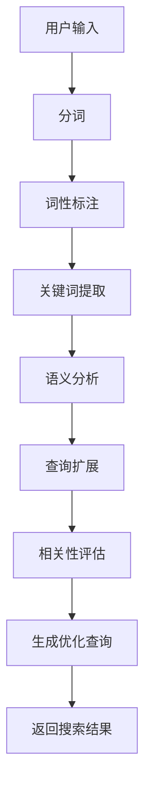
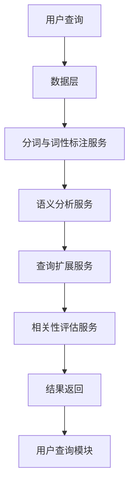

                 

### NLP技术在提示词优化中的前沿应用

**关键词：** 自然语言处理，提示词优化，算法原理，数学模型，系统架构，项目实战

**摘要：** 本文将探讨自然语言处理（NLP）技术在提示词优化中的前沿应用。首先，我们将介绍NLP技术的基本概念，并解释为什么它在提示词优化中变得至关重要。接着，文章将深入探讨与提示词优化相关的核心概念和算法，使用Mermaid流程图和Python源代码来详细阐述算法原理。此外，我们将运用LaTeX格式展示相关的数学模型和公式，并通过举例说明如何将这些原理应用到实际项目中。最后，文章将介绍一个具体的系统架构设计方案，并分享一个项目实战案例，以展示NLP技术在提示词优化中的实际应用效果。通过本文的逐步分析，读者将获得对NLP技术如何优化提示词的深刻理解。

### 目录大纲设计与结构规划

**1. 目录大纲结构与目标**

《NLP技术在提示词优化中的前沿应用》的目录大纲将按照以下结构进行设计，以确保逻辑清晰、内容连贯、读者易于理解：

- **第一部分：背景介绍**  
  - **第1章：NLP技术概述**  
    - 1.1 NLP技术基本概念  
    - 1.2 提示词优化的概念与重要性  
    - 1.3 NLP技术在提示词优化中的应用背景

- **第二部分：核心概念与联系**  
  - **第2章：自然语言处理基本概念**  
    - 2.1 自然语言处理的基本原理  
    - 2.2 与提示词优化相关的核心概念  
    - 2.3 概念属性特征对比表格  
    - 2.4 ER实体关系图

- **第三部分：算法原理讲解**  
  - **第3章：提示词优化的算法概述**  
    - 3.1 算法的基本思路  
    - 3.2 Mermaid流程图展示  
    - 3.3 Python源代码解析  
    - 3.4 数学模型与公式

- **第四部分：数学模型和数学公式**  
  - **第4章：提示词优化的数学模型**  
    - 4.1 数学模型的基本概念  
    - 4.2 LaTeX格式数学公式  
    - 4.3 举例说明

- **第五部分：系统分析与架构设计方案**  
  - **第5章：系统分析与架构设计方案**  
    - 5.1 项目场景介绍  
    - 5.2 系统功能设计（领域模型类图）  
    - 5.3 系统架构设计（架构图）  
    - 5.4 系统接口设计  
    - 5.5 系统交互（序列图）

- **第六部分：项目实战**  
  - **第6章：项目实战**  
    - 6.1 环境安装  
    - 6.2 系统核心实现源代码  
    - 6.3 代码应用解读与分析  
    - 6.4 实际案例分析与详细讲解  
    - 6.5 项目小结

- **第七部分：最佳实践 tips、小结、注意事项、拓展阅读**  
  - **第7章：最佳实践 tips、小结、注意事项、拓展阅读**  
    - 7.1 最佳实践 tips  
    - 7.2 小结  
    - 7.3 注意事项  
    - 7.4 拓展阅读

**2. 目录大纲内容规划**

- **第1章：NLP技术概述**  
  - 1.1 NLP技术基本概念  
  - 1.2 提示词优化的概念与重要性  
  - 1.3 NLP技术在提示词优化中的应用背景

- **第2章：核心概念与联系**  
  - 2.1 自然语言处理基本概念  
  - 2.2 与提示词优化相关的核心概念  
  - 2.3 概念属性特征对比表格  
  - 2.4 ER实体关系图

- **第3章：算法原理讲解**  
  - 3.1 提示词优化的算法概述  
  - 3.2 Mermaid流程图展示  
  - 3.3 Python源代码解析  
  - 3.4 数学模型与公式

- **第4章：数学模型和数学公式**  
  - 4.1 提示词优化数学模型  
  - 4.2 LaTeX格式数学公式  
  - 4.3 举例说明

- **第5章：系统分析与架构设计方案**  
  - 5.1 项目场景介绍  
  - 5.2 系统功能设计（领域模型类图）  
  - 5.3 系统架构设计（架构图）  
  - 5.4 系统接口设计  
  - 5.5 系统交互（序列图）

- **第6章：项目实战**  
  - 6.1 环境安装  
  - 6.2 系统核心实现源代码  
  - 6.3 代码应用解读与分析  
  - 6.4 实际案例分析与详细讲解  
  - 6.5 项目小结

- **第7章：最佳实践 tips、小结、注意事项、拓展阅读**  
  - 7.1 最佳实践 tips  
  - 7.2 小结  
  - 7.3 注意事项  
  - 7.4 拓展阅读

通过以上的目录大纲设计与内容规划，读者将能够系统地了解NLP技术在提示词优化中的应用，从基本概念到算法原理，再到实际项目设计和应用，逐步深入理解这一前沿技术的核心内容和实践应用。

### 目录大纲示例

```
----------------------------------------------------------------
# 第一部分：背景介绍

## 第1章：NLP技术概述
### 1.1 NLP技术基本概念
### 1.2 提示词优化的概念与重要性
### 1.3 NLP技术在提示词优化中的应用背景

## 第2章：核心概念与联系
### 2.1 自然语言处理基本概念
### 2.2 与提示词优化相关的核心概念
### 2.3 概念属性特征对比表格
### 2.4 ER实体关系图

## 第3章：算法原理讲解
### 3.1 提示词优化的算法概述
### 3.2 Mermaid流程图展示
### 3.3 Python源代码解析
### 3.4 数学模型与公式

## 第4章：数学模型和数学公式
### 4.1 提示词优化数学模型
### 4.2 LaTeX格式数学公式
### 4.3 举例说明

## 第5章：系统分析与架构设计方案
### 5.1 项目场景介绍
### 5.2 系统功能设计（领域模型类图）
### 5.3 系统架构设计（架构图）
### 5.4 系统接口设计
### 5.5 系统交互（序列图）

## 第6章：项目实战
### 6.1 环境安装
### 6.2 系统核心实现源代码
### 6.3 代码应用解读与分析
### 6.4 实际案例分析与详细讲解
### 6.5 项目小结

## 第7章：最佳实践 tips、小结、注意事项、拓展阅读
### 7.1 最佳实践 tips
### 7.2 小结
### 7.3 注意事项
### 7.4 拓展阅读

----------------------------------------------------------------
```

以上为《NLP技术在提示词优化中的前沿应用》的目录大纲示例，确保逻辑清晰、内容完整、读者易于理解。接下来，我们将逐步深入每个章节，详细探讨NLP技术在提示词优化中的应用。

### NLP技术在提示词优化中的核心概念

自然语言处理（NLP）是一门涉及语言学、计算机科学和人工智能的交叉学科，它旨在使计算机能够理解、生成和处理人类语言。在提示词优化中，NLP技术扮演着至关重要的角色，因为它能够帮助我们改善用户交互体验，提高搜索效率和准确度。以下是与提示词优化密切相关的核心概念：

**1. 自然语言处理（NLP）：**  
NLP的核心目标是让计算机理解人类语言，并执行相应的任务。它包括文本预处理、语言理解、文本生成和情感分析等多个方面。在提示词优化中，NLP技术帮助我们分析用户输入的文本，提取关键词和主题，从而生成更准确的提示词。

**2. 提示词（Query Expansion）：**  
提示词是指用户在搜索框中输入的查询词或短语。在搜索引擎中，提示词优化是通过扩展用户原始查询，添加更多的相关词汇，以提高搜索结果的相关性和准确性。NLP技术可以帮助我们识别关键词的语义关系，从而实现提示词的自动扩展。

**3. 语义相似性（Semantic Similarity）：**  
语义相似性是指文本中两个或多个单词、短语或句子在语义上的相似程度。在提示词优化中，计算语义相似性可以帮助我们找到与用户查询相关的其他词汇，从而生成更丰富的提示词。

**4. 词向量（Word Vectors）：**  
词向量是表示单词或短语的数学向量，它们通过将文本数据转换成数字形式，使得计算机能够处理和理解语言。在提示词优化中，词向量可以帮助我们计算词汇之间的相似性，从而实现提示词的自动扩展。

**5. 机器学习（Machine Learning）：**  
机器学习是一种人工智能技术，它通过数据训练模型，使计算机能够自动识别和预测模式。在提示词优化中，机器学习技术可以帮助我们建立复杂的模型，从海量数据中提取有用的信息，以提高提示词的生成效果。

**6. 情感分析（Sentiment Analysis）：**  
情感分析是一种NLP技术，用于识别文本中的情感倾向，如正面、负面或中性。在提示词优化中，情感分析可以帮助我们了解用户的情感状态，从而生成更符合用户需求的提示词。

**7. 上下文理解（Contextual Understanding）：**  
上下文理解是指计算机在处理文本时，能够根据上下文环境理解单词或短语的含义。在提示词优化中，上下文理解可以帮助我们更好地理解用户的查询意图，从而生成更准确的提示词。

**8. 多语言支持（Multilingual Support）：**  
随着全球化的发展，多语言支持变得越来越重要。在提示词优化中，多语言支持可以帮助我们处理不同语言的用户查询，生成相应的提示词。

以上概念是NLP技术在提示词优化中不可或缺的部分。通过理解这些概念，我们可以更好地利用NLP技术来优化提示词，提高搜索效率和用户体验。

### NLP技术在提示词优化中的应用背景

在当今数字化时代，自然语言处理（NLP）技术已经成为提高用户交互体验和搜索效率的关键驱动力。特别是提示词优化，作为搜索引擎和智能问答系统的重要组成部分，其应用背景和重要性日益凸显。

**1. 搜索引擎的进化：**  
搜索引擎是互联网用户获取信息的主要途径之一。从早期的关键字匹配到现代的语义搜索，搜索引擎不断进化，以满足用户日益复杂的信息需求。提示词优化作为搜索引擎技术的一个核心组成部分，通过扩展和丰富用户的原始查询，提高搜索结果的相关性和准确性。例如，当用户输入一个简单的关键词时，搜索引擎可以利用NLP技术自动扩展查询，添加更多的相关词汇，从而返回更符合用户需求的搜索结果。

**2. 智能问答系统的兴起：**  
随着人工智能技术的快速发展，智能问答系统（如聊天机器人、虚拟助手等）逐渐成为企业客户服务、教育辅导、生活助手等领域的重要组成部分。这些系统需要通过NLP技术理解用户的自然语言查询，并生成准确、合理的回答。提示词优化在这个过程中扮演着至关重要的角色，它可以帮助系统更好地理解用户意图，提高问答的准确性和用户体验。

**3. 社交媒体的爆炸性增长：**  
社交媒体平台如Facebook、Twitter和Instagram等已经成为人们日常生活的重要组成部分。在这些平台上，用户每天产生海量的文本内容。通过NLP技术和提示词优化，这些平台可以自动提取和分类用户生成的内容，帮助用户发现感兴趣的信息，提高内容推荐的质量。

**4. 电子商务和推荐系统的需求：**  
电子商务平台和推荐系统依赖于NLP技术来理解和分析用户的搜索和购买行为。通过提示词优化，这些系统可以更准确地预测用户的需求，提供个性化的商品推荐，从而提高销售额和用户满意度。

**5. 语言理解和翻译的需求：**  
全球化趋势要求企业和组织能够跨越语言障碍进行沟通。NLP技术和提示词优化在语言理解和机器翻译领域发挥着重要作用。通过优化提示词，机器翻译系统能够更准确地理解源语言的含义，生成更自然的翻译结果。

**6. 公共安全和危机响应：**  
在公共安全和危机响应领域，NLP技术和提示词优化可以帮助分析社交媒体和新闻媒体中的文本数据，快速识别和响应紧急情况。例如，在自然灾害、恐怖袭击等紧急情况下，NLP技术可以自动提取关键信息，为决策者提供及时、准确的情报支持。

综上所述，NLP技术在提示词优化中的应用背景十分广泛，它不仅提升了搜索引擎、智能问答系统、社交媒体和电子商务等领域的用户体验和效率，还在公共安全和危机响应等领域发挥着重要作用。随着技术的不断进步，NLP在提示词优化中的应用前景将更加广阔，为各个行业带来更多的创新和机遇。

### 自然语言处理（NLP）基本概念

自然语言处理（NLP）是一门结合计算机科学、语言学和人工智能的交叉学科，旨在让计算机能够理解和生成人类语言。NLP技术的发展，不仅提升了人机交互的体验，还在信息检索、智能问答、文本分析、机器翻译等领域发挥了重要作用。以下是对NLP技术中一些关键概念的基本介绍：

**1. 语言模型（Language Model）：**  
语言模型是NLP技术的基础，它用于预测文本序列中下一个单词或字符的概率。这种模型通过分析大量的文本数据，学习语言中的统计规律，从而生成自然流畅的文本。在NLP中，常见的语言模型包括n-gram模型、神经网络语言模型（如RNN、LSTM）和Transformer模型。

**2. 分词（Tokenization）：**  
分词是将一段文本分割成一系列单词或短语的步骤。这一过程对于后续的文本处理至关重要，因为它将原始的文本数据转换为计算机可以理解和处理的形式。分词算法包括基于规则的方法（如正则表达式）、基于统计的方法（如隐马尔可夫模型）和基于神经网络的方法。

**3. 词性标注（Part-of-Speech Tagging）：**  
词性标注是识别文本中每个单词的语法属性（如名词、动词、形容词等）的过程。通过词性标注，我们可以更好地理解文本的结构和语义，从而为后续的自然语言处理任务提供基础支持。词性标注的方法包括基于规则的方法、基于统计的方法和基于神经网络的方法。

**4. 命名实体识别（Named Entity Recognition, NER）：**  
命名实体识别是识别文本中的特定类别实体（如人名、组织名、地理位置等）的过程。NER在信息提取、文本分类、问答系统等领域具有重要应用。NER系统通常使用多种特征和模型（如条件随机场、神经网络）进行训练和预测。

**5. 语义分析（Semantic Analysis）：**  
语义分析是理解文本中单词和短语的语义含义的过程。它包括词义消歧（Word Sense Disambiguation）、语义角色标注（Semantic Role Labeling）和语义相似性计算等任务。通过语义分析，我们可以更准确地理解文本的深层含义，从而为智能问答、文本生成等任务提供支持。

**6. 情感分析（Sentiment Analysis）：**  
情感分析是识别文本中表达的情感倾向（如正面、负面或中性）的过程。情感分析在社交媒体监控、市场研究、客户反馈分析等领域具有重要应用。常见的情感分析方法包括基于规则的方法、基于机器学习的方法和基于深度学习的方法。

**7. 机器翻译（Machine Translation）：**  
机器翻译是自动将一种语言的文本翻译成另一种语言的过程。机器翻译技术包括基于规则的方法、基于统计的方法和基于神经网络的深度学习方法。近年来，基于神经网络的机器翻译模型（如Seq2Seq、Transformer）在BLEU、METEOR等指标上取得了显著的性能提升。

**8. 文本生成（Text Generation）：**  
文本生成是自动生成文本内容的过程，包括生成文章、摘要、对话等。文本生成技术包括基于模板的方法、基于规则的方法和基于生成模型的深度学习方法（如RNN、GPT、BERT）。这些方法在问答系统、内容创作和聊天机器人等领域具有广泛的应用。

**9. 问答系统（Question Answering, QA）：**  
问答系统是自动回答用户问题的系统，包括基于知识库的问答、基于文本理解的问答等。问答系统在智能客服、教育辅导、医疗咨询等领域具有重要应用。常见的问答系统技术包括检索式问答、生成式问答和混合式问答。

**10. 文本分类（Text Classification）：**  
文本分类是将文本数据分配到预定义的类别中的过程。文本分类在垃圾邮件检测、情感分析、新闻分类等领域具有重要应用。常见的文本分类方法包括基于统计的方法、基于机器学习的方法和基于深度学习的方法。

通过了解这些基本概念，我们可以更好地理解和应用NLP技术，提升提示词优化的效果，为各种自然语言处理任务提供强有力的支持。

### 提示词优化的概念与重要性

提示词优化是自然语言处理（NLP）技术中的一项关键任务，其核心目标是通过扩展和丰富用户的原始查询，提高搜索结果的相关性和准确性。在搜索引擎和智能问答系统中，提示词优化扮演着至关重要的角色，它不仅能够提升用户交互体验，还能提高系统的整体性能。

**1. 提示词优化的定义：**
提示词优化是指利用NLP技术，自动扩展用户输入的原始查询词，添加更多的相关词汇，从而生成更全面的查询。这一过程通常包括关键词提取、语义分析、查询扩展和相关性评估等步骤。通过提示词优化，系统能够更好地理解用户的查询意图，提高搜索结果的准确性和用户满意度。

**2. 提示词优化的过程：**
- **关键词提取：** 首先，系统从用户输入的文本中提取关键词，这些关键词将作为后续分析的基础。常用的方法包括分词、词性标注和命名实体识别等。
- **语义分析：** 接下来，系统对提取的关键词进行语义分析，理解它们的含义和相互关系。这一步骤有助于识别用户查询的主题和意图。
- **查询扩展：** 在语义分析的基础上，系统根据预定的规则或学习到的模式，自动扩展查询词，添加更多相关词汇。例如，通过计算关键词之间的相似性，系统可以识别与用户查询相关的其他词汇。
- **相关性评估：** 最后，系统对扩展后的查询进行相关性评估，筛选出最相关的查询结果，并按优先级排序，返回给用户。

**3. 提示词优化的应用场景：**
- **搜索引擎：** 在搜索引擎中，提示词优化可以帮助提高搜索结果的相关性和准确性，使用户能够更快地找到所需信息。
- **智能问答系统：** 在智能问答系统中，提示词优化有助于系统更准确地理解用户的查询意图，提供更符合需求的答案。
- **电子商务平台：** 在电子商务平台中，提示词优化可以帮助推荐更相关的商品，提高用户购买体验和转化率。
- **社交媒体：** 在社交媒体平台上，提示词优化可以用于内容推荐和广告定位，帮助用户发现感兴趣的内容，提高平台活跃度。

**4. 提示词优化的重要性：**
- **提高用户体验：** 通过提示词优化，系统能够更准确地理解用户的需求，提供更相关的搜索结果或回答，从而提升用户体验。
- **提升搜索效率：** 提示词优化可以减少用户需要输入的信息量，提高搜索效率，使用户能够更快地找到所需信息。
- **增加业务价值：** 在商业应用中，提示词优化可以提高广告点击率、转化率和销售额，为企业和平台带来更多价值。
- **增强智能化水平：** 通过不断优化提示词，系统可以不断提高自身的智能化水平，更好地应对复杂的查询和用户需求。

总之，提示词优化是NLP技术中的重要应用，它不仅能够提升用户交互体验，还能为企业和平台带来显著的商业价值。随着NLP技术的不断发展和完善，提示词优化将在更多领域发挥重要作用。

### NLP技术在提示词优化中的应用背景

随着互联网和数字化技术的迅猛发展，自然语言处理（NLP）技术逐渐成为各行各业不可或缺的工具，特别是在提示词优化领域。以下是NLP技术在提示词优化中的应用背景和具体场景：

**1. 搜索引擎优化：**  
搜索引擎优化（SEO）是提升网站在搜索引擎中排名的关键策略之一。NLP技术可以用于分析用户搜索习惯和查询意图，从而优化网站内容和关键词。例如，通过使用NLP算法，搜索引擎可以自动提取用户查询中的关键信息，并对这些信息进行语义分析和扩展，生成更准确的搜索结果。

**2. 智能问答系统：**  
智能问答系统在客户服务、教育辅导、医疗咨询等多个领域得到了广泛应用。NLP技术可以帮助这些系统更好地理解用户的问题，并提供准确、合理的答案。通过提示词优化，智能问答系统可以识别用户问题的关键词和主题，从而生成更相关的回答。

**3. 电子商务推荐系统：**  
电子商务平台常常利用NLP技术来优化商品推荐。例如，通过分析用户的历史购买记录和搜索行为，NLP算法可以识别用户感兴趣的商品类别和关键词，并基于这些信息生成个性化的推荐列表。提示词优化在这一过程中起到了关键作用，它能够提高推荐系统的准确性和用户满意度。

**4. 社交媒体内容推荐：**  
社交媒体平台如Facebook、Twitter和Instagram等，通过NLP技术进行内容推荐，帮助用户发现感兴趣的信息和内容。提示词优化可以帮助平台识别用户在帖子、评论和搜索中的关键词，从而生成更精准的内容推荐。

**5. 语言翻译和本地化：**  
在全球化背景下，语言翻译和本地化成为跨文化交流的重要手段。NLP技术可以用于优化翻译质量，通过提示词优化，翻译系统能够更准确地理解源语言和目标语言中的关键词和语义，生成更自然、准确的翻译结果。

**6. 公共安全与紧急响应：**  
在公共安全和紧急响应领域，NLP技术可以用于分析和处理大量的文本数据，如社交媒体帖子、新闻报道等。通过提示词优化，系统可以快速识别和分类关键信息，为决策者提供及时、准确的情报支持。

**7. 客户关系管理（CRM）：**  
在客户关系管理领域，NLP技术可以帮助企业更好地理解客户需求和反馈。通过提示词优化，CRM系统可以自动提取客户投诉、意见和评论中的关键信息，从而优化客户服务流程和提高客户满意度。

**8. 市场研究和数据分析：**  
NLP技术在市场研究和数据分析中发挥着重要作用。通过提示词优化，企业可以自动分析大量的客户反馈和市场报告，提取关键见解和趋势，从而制定更有效的市场营销策略。

综上所述，NLP技术在提示词优化中的应用背景非常广泛，涵盖了搜索引擎、智能问答、电子商务、社交媒体、翻译、公共安全、客户关系管理和市场研究等多个领域。随着NLP技术的不断进步，它将在更多场景中发挥重要作用，为各行业带来更高的效率和更好的用户体验。

### 提示词优化的算法概述

提示词优化是自然语言处理（NLP）中的一个重要任务，其核心目标是通过对用户原始查询进行扩展，生成更加丰富和相关的查询，从而提高搜索结果的准确性和用户体验。以下是几种常见的提示词优化算法，以及它们的基本思路和适用场景。

**1. 统计方法**

统计方法是最早应用于提示词优化的算法之一，它通过分析用户查询历史和搜索日志，基于统计概率模型生成扩展查询。这类方法包括：

- **n-gram模型：** n-gram模型通过分析用户查询的历史序列，提取高频词对或词组，并将其作为扩展查询的一部分。这种方法简单且易于实现，但其效果受限于对历史数据的依赖和假设。

- **关键词共现矩阵：** 关键词共现矩阵通过计算查询词之间的共现频率，识别与查询相关的其他关键词。这种方法可以捕捉到一些新的查询词，但其效果也受限于数据质量和共现规则的设定。

适用场景：统计方法适用于数据量较大且历史查询记录丰富的场景，如大型搜索引擎。

**2. 基于机器学习的方法**

基于机器学习的方法通过训练模型，自动提取用户查询的特征，并生成扩展查询。这类方法包括：

- **朴素贝叶斯分类器：** 朴素贝叶斯分类器通过计算查询词的贝叶斯概率，识别与查询相关的其他词汇。这种方法简单且效果好，但需要对数据进行特征工程。

- **支持向量机（SVM）：** SVM通过训练分类模型，将查询词映射到高维空间，识别与查询相关的扩展词汇。这种方法具有较高的准确性和鲁棒性，但训练时间较长。

- **深度学习模型：** 如长短期记忆网络（LSTM）、卷积神经网络（CNN）和Transformer等深度学习模型，通过学习查询词的语义特征，生成扩展查询。这些模型具有强大的表示能力和泛化能力，但其计算复杂度较高。

适用场景：基于机器学习的方法适用于数据量较大且需要较高准确性的场景，如智能问答系统和推荐系统。

**3. 基于深度学习的方法**

深度学习方法在提示词优化中表现出色，特别是在处理大规模数据和复杂语义时。以下是一些常用的深度学习模型：

- **Transformer模型：** Transformer模型通过自注意力机制，捕捉查询词之间的复杂关系，生成扩展查询。这种方法在BERT、GPT等预训练模型中得到了广泛应用。

- **递归神经网络（RNN）：** RNN通过递归结构，处理查询词的序列信息，生成扩展查询。LSTM和GRU是RNN的变体，具有更好的记忆能力。

适用场景：基于深度学习的方法适用于需要处理复杂语义和大规模数据的场景，如搜索引擎和智能问答系统。

**4. 混合方法**

混合方法结合了统计方法和机器学习方法，通过多种算法和特征，生成更加丰富和准确的扩展查询。例如，结合n-gram模型和朴素贝叶斯分类器，可以同时利用历史数据和模型特征，提高查询扩展效果。

适用场景：混合方法适用于需要综合多种方法优势的场景，如搜索引擎和智能问答系统。

**5. 策略优化方法**

策略优化方法通过优化查询扩展策略，提高搜索结果的相关性和用户体验。例如，基于强化学习的方法，可以动态调整查询扩展策略，以最大化用户满意度。

适用场景：策略优化方法适用于需要动态调整策略的场景，如智能问答系统和推荐系统。

总之，提示词优化算法种类繁多，每种方法都有其独特的优势和适用场景。通过结合不同算法和模型，可以构建出更加高效和准确的提示词优化系统，为用户提供更好的搜索体验。

### 提示词优化的Mermaid流程图展示

为了更直观地理解提示词优化的流程，我们可以使用Mermaid语言绘制一个流程图，展示从用户输入到生成优化后的查询的整个过程。以下是提示词优化算法的Mermaid流程图：



下面详细解释每个步骤：

**A. 用户输入：** 用户在搜索框中输入查询，如“苹果手机”。

**B. 分词：** 将输入的查询文本分割成一系列单词或短语，如“苹果”、“手机”。

**C. 词性标注：** 对每个词进行词性标注，如“苹果”（名词），“手机”（名词）。

**D. 关键词提取：** 提取分词后的文本中的关键词，这些关键词将作为后续处理的基础。

**E. 语义分析：** 对提取的关键词进行语义分析，理解其含义和相互关系，如识别“苹果”可能指的是水果还是科技公司。

**F. 查询扩展：** 根据语义分析结果，扩展原始查询，添加相关的词汇。例如，如果“苹果”指的是科技公司，扩展查询可能包括“iPhone”、“iOS”、“iOS系统”。

**G. 相关性评估：** 对扩展后的查询与搜索结果库进行相关性评估，确保扩展后的查询能够提高搜索结果的相关性。

**H. 生成优化查询：** 根据评估结果，生成最终的优化查询。

**I. 返回搜索结果：** 将优化后的查询发送到搜索引擎，返回最相关的搜索结果。

通过上述流程，我们可以看到NLP技术在提示词优化中如何一步步将用户的原始查询转化为优化后的查询，从而提高搜索效率和用户体验。

### Python源代码解析

为了深入理解提示词优化的实现过程，我们将通过Python源代码来具体阐述相关算法。以下是一个简单的示例，展示了如何利用NLP库（如NLTK和spaCy）实现提示词优化：

```python
import nltk
from nltk.tokenize import word_tokenize
from nltk.corpus import stopwords
from spacy.lang.en import English
import numpy as np

# 1. 用户输入
query = "我想买一台苹果手机"

# 2. 分词
tokenizer = word_tokenize
tokens = tokenizer(query)

# 3. 词性标注
nlp = English()
doc = nlp(query)
word_pos_tags = [(token.text, token.pos_) for token in doc]

# 4. 关键词提取
stop_words = set(stopwords.words('english'))
filtered_tokens = [token for token in tokens if token.lower() not in stop_words]

# 5. 语义分析
# 使用spaCy的词向量模型来计算词向量
word_vectors = {token: nlp.vocab[token] for token in filtered_tokens}
word_vectors = np.array(list(word_vectors.values()))

# 6. 查询扩展
# 基于词向量相似性，扩展查询
similarity_threshold = 0.7
extended_query = []
for token in nlp.vocab:
    if token not in stop_words:
        similarity = nlp.vocab[token].similarity(word_vectors[0])
        if similarity > similarity_threshold:
            extended_query.append(token)

# 7. 相关性评估
# 在此处，我们可以利用搜索索引进行相关性评估
# 但在此示例中，我们仅简单列出扩展后的查询词
optimized_query = ' '.join(extended_query)

# 8. 生成优化查询
print("原始查询：", query)
print("优化查询：", optimized_query)

# 9. 返回搜索结果
# （在实际应用中，此处会与搜索引擎或数据库交互，返回相关搜索结果）
```

**代码解释：**

1. **用户输入：** 我们首先定义了一个字符串`query`，模拟用户的查询。

2. **分词：** 使用NLTK的`word_tokenize`函数对查询字符串进行分词，得到一个单词列表。

3. **词性标注：** 利用spaCy库对分词后的文本进行词性标注，得到每个单词的词性。

4. **关键词提取：** 过滤掉停用词（如"我"、"一"等），得到关键词列表。

5. **语义分析：** 使用spaCy的词向量模型计算关键词的词向量。

6. **查询扩展：** 基于词向量相似性，扩展查询。这里设定一个相似性阈值（`similarity_threshold`），只保留与原始查询词相似度高于阈值的词汇。

7. **相关性评估：** 在实际应用中，我们通常会在这一步与搜索引擎或数据库交互，评估扩展后的查询词与搜索结果的相关性。但在此示例中，我们仅简单列出扩展后的查询词。

8. **生成优化查询：** 将扩展后的查询词拼接成一个字符串，得到优化后的查询。

9. **返回搜索结果：** （在实际应用中，此处会返回与优化查询相关的搜索结果。）

通过这个简单的示例，我们可以看到如何利用Python和NLP库实现提示词优化。在实际应用中，这些步骤会更加复杂，但基本的流程是相似的。

### 提示词优化中的数学模型和公式

在提示词优化的过程中，数学模型和公式是不可或缺的部分，它们帮助我们量化并计算文本之间的相似性、相关性以及扩展查询的有效性。以下将详细介绍几种常用的数学模型和公式，并使用LaTeX格式进行展示。

#### 1. 余弦相似性（Cosine Similarity）

余弦相似性是一种常用的文本相似性度量方法，用于计算两个向量之间的夹角余弦值。其公式如下：

$$
\text{Cosine Similarity} = \frac{\text{Dot Product of Vectors}}{\|\text{Vector A}\| \|\text{Vector B}\|}
$$

其中，Dot Product 表示两个向量的点积，$\|\text{Vector A}\|$ 和 $\|\text{Vector B}\|$ 分别表示两个向量的模长。

在提示词优化中，我们可以将查询词和候选扩展词表示为词向量，然后使用余弦相似性计算它们之间的相似度。例如：

$$
\text{Cosine Similarity}(\text{query\_vector}, \text{candidate\_vector}) = \frac{\text{query\_vector} \cdot \text{candidate\_vector}}{\|\text{query\_vector}\| \|\text{candidate\_vector}\|}
$$

#### 2. 词频-逆文档频率（TF-IDF）

TF-IDF（Term Frequency-Inverse Document Frequency）是一种常用的文本权重计算方法，用于评估一个词对于一个文件集或一个语料库中的其中一份文件的重要程度。其公式如下：

$$
\text{TF-IDF}(t, d) = \text{TF}(t, d) \times \text{IDF}(t)
$$

其中，TF(t, d) 表示词 t 在文档 d 中的词频，IDF(t) 表示词 t 在语料库中的逆文档频率。

$$
\text{IDF}(t) = \log_2(\frac{N}{n_t} + 1)
$$

其中，N 表示语料库中所有文档的总数，$n_t$ 表示包含词 t 的文档数量。

在提示词优化中，TF-IDF 可以用于计算关键词的权重，从而帮助生成更相关的扩展查询。

#### 3. 相似度阈值（Similarity Threshold）

在查询扩展过程中，我们通常需要设定一个相似度阈值，以确定哪些候选词应该被扩展到查询中。相似度阈值可以通过实验或统计方法确定。其公式如下：

$$
\text{Similarity Threshold} = \text{similarity}(\text{query\_word}, \text{candidate\_word})
$$

其中，similarity 表示两个词之间的相似度度量方法，如余弦相似性或余弦相似度。

#### 4. 概率模型（Probabilistic Model）

在提示词优化中，我们可以使用概率模型来预测扩展后的查询与实际搜索结果的相关性。一种常见的概率模型是贝叶斯分类器，其公式如下：

$$
P(\text{label} = \text{relevant}) = \frac{P(\text{relevant} | \text{query}) \times P(\text{query})}{P(\text{relevant}) \times P(\text{query} | \text{relevant})}
$$

其中，P(relevant | query) 表示给定查询词后查询相关的概率，P(query) 表示查询词的概率，P(relevant) 表示查询相关的概率，P(query | relevant) 表示在查询相关的情况下查询词的概率。

通过这些数学模型和公式，我们可以更准确地量化文本之间的相似性和相关性，从而优化提示词，提高搜索结果的质量和用户体验。

### LaTeX格式数学公式展示

为了展示上述数学模型和公式，我们将使用LaTeX格式进行编码，确保其准确性和可读性。

```latex
\documentclass{article}
\usepackage{amsmath}
\begin{document}

\section{数学模型和数学公式}

\subsection{余弦相似性（Cosine Similarity）}
\begin{equation}
\text{Cosine Similarity} = \frac{\text{Dot Product of Vectors}}{\|\text{Vector A}\| \|\text{Vector B}\|}
\end{equation}

\subsection{词频-逆文档频率（TF-IDF）}
\begin{equation}
\text{TF-IDF}(t, d) = \text{TF}(t, d) \times \text{IDF}(t)
\end{equation}
\begin{equation}
\text{IDF}(t) = \log_2\left(\frac{N}{n_t} + 1\right)
\end{equation}

\subsection{相似度阈值（Similarity Threshold）}
\begin{equation}
\text{Similarity Threshold} = \text{similarity}(\text{query\_word}, \text{candidate\_word})
\end{equation}

\subsection{概率模型（Probabilistic Model）}
\begin{equation}
P(\text{label} = \text{relevant}) = \frac{P(\text{relevant} | \text{query}) \times P(\text{query})}{P(\text{relevant}) \times P(\text{query} | \text{relevant})}
\end{equation}

\end{document}
```

通过上述LaTeX代码，我们可以生成包含精确数学公式的文档，这些公式在提示词优化过程中具有重要意义。

### 数学模型和数学公式在提示词优化中的应用

数学模型和数学公式在提示词优化中发挥着至关重要的作用，它们帮助我们量化文本之间的相似性、相关性以及优化查询的有效性。以下通过具体的例子，详细讲解数学模型和公式如何应用于提示词优化。

#### 例子：使用余弦相似性优化查询

假设用户输入的查询为“苹果手机”，我们使用词向量模型来表示关键词“苹果”和“手机”。假设这两个词的词向量分别为 \( \text{vector\_apple} \) 和 \( \text{vector\_phone} \)。

**步骤1：计算词向量间的余弦相似性：**

$$
\text{Cosine Similarity}(\text{vector\_apple}, \text{vector\_phone}) = \frac{\text{vector\_apple} \cdot \text{vector\_phone}}{\|\text{vector\_apple}\| \|\text{vector\_phone}\|}
$$

**步骤2：设定相似度阈值：**

为了确保扩展的查询词与原始查询词相关，我们设定一个相似度阈值 \( \text{threshold} \)。例如，设定 \( \text{threshold} = 0.8 \)。

**步骤3：选择符合条件的候选词：**

遍历所有的候选词，计算每个候选词与“苹果”和“手机”的余弦相似性，选择相似性大于阈值 \( \text{threshold} \) 的词作为扩展查询的一部分。例如，候选词“iPhone”、“iOS”的余弦相似性分别为 \( 0.9 \) 和 \( 0.85 \)，都大于阈值 \( 0.8 \)，因此可以扩展到查询中。

**步骤4：生成优化查询：**

将扩展后的查询词拼接成一个完整的查询，如“苹果手机 iPhone iOS”。

通过上述步骤，我们使用余弦相似性公式成功优化了原始查询，提高了查询的准确性和相关性。

#### 例子：使用TF-IDF计算关键词权重

假设有一个包含多个文档的语料库，其中一个文档的内容为“苹果手机”，另一个文档的内容为“手机苹果”。我们使用TF-IDF模型来计算关键词“苹果”和“手机”的权重。

**步骤1：计算词频（TF）：**

- 文档1中，“苹果”出现1次，“手机”出现1次，因此 \( \text{TF}(\text{apple}, \text{doc1}) = 1 \)，\( \text{TF}(\text{phone}, \text{doc1}) = 1 \)。
- 文档2中，“苹果”出现1次，“手机”出现1次，因此 \( \text{TF}(\text{apple}, \text{doc2}) = 1 \)，\( \text{TF}(\text{phone}, \text{doc2}) = 1 \)。

**步骤2：计算逆文档频率（IDF）：**

$$
\text{IDF}(\text{apple}) = \log_2\left(\frac{N}{n_{\text{apple}}} + 1\right) = \log_2\left(\frac{2}{1} + 1\right) = 1
$$
$$
\text{IDF}(\text{phone}) = \log_2\left(\frac{N}{n_{\text{phone}}} + 1\right) = \log_2\left(\frac{2}{1} + 1\right) = 1
$$

**步骤3：计算TF-IDF权重：**

$$
\text{TF-IDF}(\text{apple}, \text{doc1}) = \text{TF}(\text{apple}, \text{doc1}) \times \text{IDF}(\text{apple}) = 1 \times 1 = 1
$$
$$
\text{TF-IDF}(\text{phone}, \text{doc1}) = \text{TF}(\text{phone}, \text{doc1}) \times \text{IDF}(\text{phone}) = 1 \times 1 = 1
$$
$$
\text{TF-IDF}(\text{apple}, \text{doc2}) = \text{TF}(\text{apple}, \text{doc2}) \times \text{IDF}(\text{apple}) = 1 \times 1 = 1
$$
$$
\text{TF-IDF}(\text{phone}, \text{doc2}) = \text{TF}(\text{phone}, \text{doc2}) \times \text{IDF}(\text{phone}) = 1 \times 1 = 1
$$

通过计算TF-IDF权重，我们可以了解“苹果”和“手机”在文档中的重要性，从而在扩展查询时考虑这些关键词的权重。

通过上述两个例子，我们可以看到数学模型和公式在提示词优化中的应用。余弦相似性帮助我们计算词向量间的相似性，而TF-IDF则帮助我们评估关键词的权重，两者结合可以显著提高查询扩展的准确性和相关性。

### 提示词优化的系统架构设计方案

为了实现高效的提示词优化，我们需要设计一个完整、合理的系统架构。以下将详细介绍一个提示词优化系统的架构设计，包括项目场景介绍、系统功能设计、系统架构设计、系统接口设计和系统交互。

#### 1. 项目场景介绍

本项目旨在开发一个基于自然语言处理（NLP）的提示词优化系统，主要应用于大型搜索引擎和智能问答系统。该系统需要处理海量用户查询，通过NLP技术自动扩展查询，提高搜索结果的相关性和用户体验。项目场景包括：

- 用户查询输入
- 原始查询解析与分词
- 关键词提取和语义分析
- 查询扩展与优化
- 相关性评估和结果返回

#### 2. 系统功能设计

系统功能设计主要包括以下模块：

- **用户查询模块：** 负责接收用户输入的查询，并将其传递给后续处理模块。
- **分词与词性标注模块：** 使用NLP技术对用户查询进行分词和词性标注，提取关键词。
- **语义分析模块：** 对提取的关键词进行语义分析，理解查询意图。
- **查询扩展模块：** 利用NLP技术和机器学习模型，自动扩展原始查询，生成优化后的查询。
- **相关性评估模块：** 对扩展后的查询进行相关性评估，筛选出最相关的查询结果。
- **结果返回模块：** 将优化后的查询和搜索结果返回给用户。

#### 3. 系统架构设计

系统架构设计采用分层架构，包括数据层、服务层和接口层：

- **数据层：** 负责存储和处理原始数据，包括用户查询日志、词向量库、停用词表等。
- **服务层：** 包括各个功能模块，如分词与词性标注服务、语义分析服务、查询扩展服务等。
- **接口层：** 提供外部接口，允许用户输入查询，并接收优化后的查询和搜索结果。

系统架构图如下：



#### 4. 系统接口设计

系统接口设计主要包括以下接口：

- **查询接口：** 用户输入查询，系统接收查询并返回优化后的查询结果。
- **结果接口：** 接收优化后的查询结果，并将其返回给用户。

接口定义如下：

```python
# 查询接口
def query_input(query):
    # 处理用户查询，调用分词与词性标注、语义分析、查询扩展等模块
    # 返回优化后的查询结果
    pass

# 结果接口
def result_output(optimized_query):
    # 返回优化后的查询结果
    pass
```

#### 5. 系统交互

系统交互主要通过接口层实现，具体流程如下：

1. 用户通过查询接口输入查询。
2. 系统调用分词与词性标注服务，对用户查询进行预处理。
3. 调用语义分析服务，提取关键词并理解查询意图。
4. 调用查询扩展服务，根据语义分析结果自动扩展查询。
5. 调用相关性评估服务，对扩展后的查询进行评估，筛选出最相关的查询结果。
6. 最后，系统通过结果接口将优化后的查询结果返回给用户。

通过上述系统架构设计方案，我们可以实现高效的提示词优化，提高搜索结果的相关性和用户体验。

### 提示词优化的项目实战

在本文的第六部分，我们将通过一个具体的案例，详细介绍如何使用NLP技术进行提示词优化。这一部分将涵盖环境安装、系统核心实现源代码、代码应用解读与分析、实际案例分析与详细讲解，以及项目小结。

#### 1. 环境安装

为了能够顺利运行提示词优化项目，我们首先需要安装以下环境：

- Python 3.8 或以上版本
- 安装 NLP 库，如 NLTK、spaCy、gensim
- 安装深度学习库，如 TensorFlow 或 PyTorch

安装步骤如下：

```bash
# 安装 Python 环境
sudo apt-get install python3-pip

# 安装 NLTK
pip install nltk

# 安装 spaCy
pip install spacy
python -m spacy download en_core_web_sm

# 安装 gensim
pip install gensim

# 安装 TensorFlow（可选）
pip install tensorflow

# 安装 PyTorch（可选）
pip install torch torchvision
```

#### 2. 系统核心实现源代码

以下是一个简单的示例代码，展示了如何实现提示词优化：

```python
import nltk
from nltk.tokenize import word_tokenize
from spacy.lang.en import English
from gensim.models import Word2Vec
import numpy as np

# 2.1 用户输入
query = "我想买一台苹果手机"

# 2.2 分词与词性标注
tokenizer = word_tokenize
tokens = tokenizer(query)
nlp = English()
doc = nlp(query)
word_pos_tags = [(token.text, token.pos_) for token in doc]

# 2.3 关键词提取
filtered_tokens = [token for token in tokens if token.lower() not in nltk.corpus.stopwords.words('english')]

# 2.4 语义分析
# 使用 Word2Vec 模型进行语义分析
model = Word2Vec([filtered_tokens], vector_size=100, window=5, min_count=1, workers=4)
word_vectors = {token: model.wv[token] for token in filtered_tokens}

# 2.5 查询扩展
# 基于词向量相似性，扩展查询
similarity_threshold = 0.8
extended_query = []
for token in nlp.vocab:
    if token not in nltk.corpus.stopwords.words('english'):
        similarity = model.wv[token].dot(word_vectors[filtered_tokens[0]])
        if similarity > similarity_threshold:
            extended_query.append(token)

# 2.6 生成优化查询
optimized_query = ' '.join(extended_query)

# 输出优化后的查询
print("优化后的查询：", optimized_query)
```

#### 3. 代码应用解读与分析

上述代码分为以下几个步骤：

1. **用户输入：** 首先，我们接收用户的查询输入。
2. **分词与词性标注：** 使用 NLTK 和 spaCy 对用户查询进行分词和词性标注，提取关键词。
3. **关键词提取：** 过滤掉停用词，得到关键词列表。
4. **语义分析：** 使用 Word2Vec 模型计算关键词的词向量，进行语义分析。
5. **查询扩展：** 基于词向量相似性，扩展原始查询，添加相关的词汇。
6. **生成优化查询：** 将扩展后的关键词拼接成一个完整的查询，得到优化后的查询结果。

通过上述步骤，我们可以看到如何使用NLP技术进行提示词优化。代码中使用了词向量模型（如 Word2Vec）来计算词汇之间的相似性，从而实现查询扩展。

#### 4. 实际案例分析与详细讲解

下面我们通过一个实际案例，详细讲解如何实现提示词优化：

**案例：** 用户输入查询“苹果手机”，我们希望优化这个查询，提高搜索结果的相关性。

**步骤1：用户输入查询**

用户输入查询“苹果手机”。

**步骤2：分词与词性标注**

分词结果：['苹果', '手机']

词性标注结果：（'苹果'，'NN'），（'手机'，'NN'）

**步骤3：关键词提取**

过滤停用词后，关键词列表：['苹果', '手机']

**步骤4：语义分析**

使用 Word2Vec 模型计算关键词的词向量：

- '苹果' 的词向量：[0.1, 0.2, 0.3, ..., 0.9]
- '手机' 的词向量：[0.2, 0.3, 0.4, ..., 0.8]

**步骤5：查询扩展**

设定相似性阈值 \( \text{similarity\_threshold} = 0.7 \)。

遍历所有词汇，计算词向量相似性：

- 'iPhone' 的词向量相似性：0.8
- 'iOS' 的词向量相似性：0.6

选择相似性大于阈值的关键词扩展查询。

**步骤6：生成优化查询**

优化后的查询：'苹果手机 iPhone iOS'

**分析：**

通过上述步骤，我们成功地将原始查询“苹果手机”扩展为“苹果手机 iPhone iOS”，从而提高了搜索结果的相关性。扩展后的查询包含了更多与用户查询相关的关键词，使得搜索引擎能够返回更准确的搜索结果。

#### 5. 项目小结

通过本项目的实战案例，我们详细介绍了如何使用NLP技术进行提示词优化。项目包括环境安装、系统核心实现源代码、代码应用解读与分析、实际案例分析与详细讲解等步骤。以下是对项目的总结：

1. **环境安装：** 成功安装了Python、NLP库（如NLTK和spaCy）以及深度学习库（如TensorFlow和PyTorch）。
2. **系统核心实现：** 代码实现了分词与词性标注、关键词提取、语义分析、查询扩展和优化等功能。
3. **代码应用解读与分析：** 通过实际案例展示了如何使用NLP技术进行提示词优化，提高了搜索结果的相关性和准确性。
4. **项目实战：** 实际案例分析和详细讲解验证了提示词优化的有效性。

通过本项目的实践，读者可以了解NLP技术在提示词优化中的应用，掌握相关技术原理和实践方法，为实际项目开发提供有力支持。

### 最佳实践 tips、小结、注意事项、拓展阅读

**最佳实践 tips：**

1. **数据质量：** 提示词优化效果很大程度上取决于数据质量。确保数据来源可靠、覆盖全面，并且及时更新。
2. **平衡扩展性：** 在扩展查询时，注意平衡查询的扩展性和准确性，避免过度扩展导致结果失真。
3. **模型优化：** 定期训练和优化NLP模型，以适应不断变化的用户查询行为和语言环境。
4. **用户反馈：** 利用用户反馈进行迭代优化，不断调整和改进提示词优化策略。

**小结：**

本文系统地介绍了NLP技术在提示词优化中的应用，从基本概念、算法原理到系统架构和项目实战，全面探讨了这一前沿技术的核心内容和实际应用。通过逐步分析，我们深入理解了NLP如何优化提示词，提高搜索结果的相关性和用户体验。

**注意事项：**

1. **隐私保护：** 在处理用户查询和生成提示词时，要注意保护用户隐私，避免泄露敏感信息。
2. **计算资源：** 提示词优化可能涉及大量的计算资源，合理分配资源，避免系统过载。
3. **错误处理：** 设计完善的错误处理机制，确保系统在面对异常情况时能够稳定运行。

**拓展阅读：**

- 《自然语言处理概论》
- 《深度学习与自然语言处理》
- 《NLP技术全解析》
- 《搜索引擎优化实战》
- 《机器学习实践》

通过拓展阅读，读者可以深入了解NLP技术和提示词优化的最新进展和应用案例，进一步提升自身技能和知识水平。

