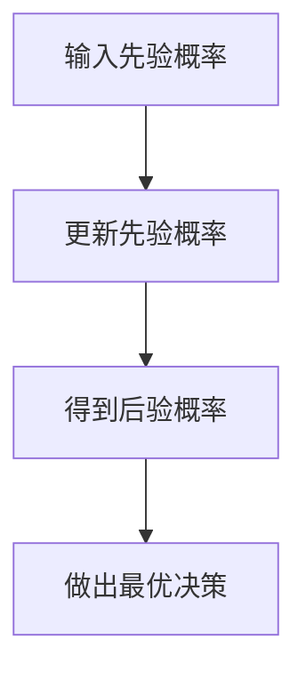
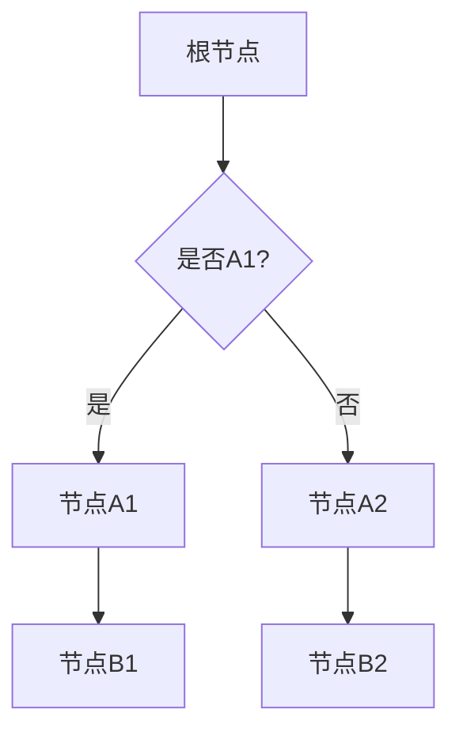
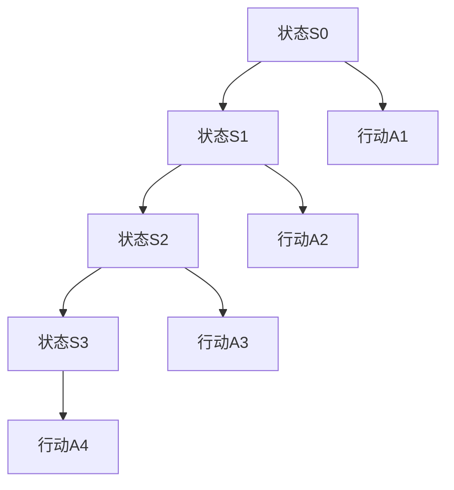

                 

### 《不完全信息处理:AI决策的新领域》

#### 关键词：
- 不完全信息处理
- AI决策
- 人工智能
- 不确定性
- 数学模型

#### 摘要：
本文将探讨不完全信息处理在人工智能决策中的重要性。我们将首先介绍不完全信息处理的背景和核心概念，接着深入分析相关算法原理，并通过数学模型和公式进行详细讲解。随后，我们将设计一个系统架构，并给出具体的项目实战案例，最后总结最佳实践和注意事项。

----------------------------------------------------------------

## 第1章 背景介绍

### 1.1 问题背景

在现实世界中，我们常常面临信息不完备的问题。例如，在医学诊断中，医生可能无法获取患者的全部医疗记录；在金融市场中，投资者可能无法获取所有的市场信息。这些不完全信息给决策带来了很大的挑战。

### 1.2 问题描述

不完全信息处理的主要问题是如何在信息不完全的情况下做出最优决策。具体来说，我们需要解决以下问题：

1. 如何评估不确定性的影响？
2. 如何在不确定性的环境中选择最佳行动方案？
3. 如何处理多目标优化问题？

### 1.3 问题解决

不完全信息处理的解决方法主要包括以下几种：

1. **贝叶斯推理**：通过概率模型来处理不确定性，通过更新先验概率来得到后验概率，从而做出最优决策。
2. **决策树**：通过构建决策树来表示不同的可能情况和对应的决策结果，从而在不确定的环境中找到最佳决策路径。
3. **马尔可夫决策过程（MDP）**：通过构建MDP模型，利用动态规划方法来求解最优策略。

### 1.4 边界与外延

不完全信息处理的边界主要包括：

1. 信息不完备性：信息不完整，存在不确定性。
2. 决策多样性：有多种可能的决策方案。
3. 目标冲突：可能存在多个目标，且目标之间可能存在冲突。

不完全信息处理的外延包括：

1. 机器学习：利用不完全信息进行模型训练和预测。
2. 风险评估：在不确定性环境中进行风险评估和决策。
3. 智能决策支持系统：为决策者提供智能化的决策支持。

### 1.5 概念结构与核心要素组成

不完全信息处理的核心概念和结构主要包括：

1. **不确定性模型**：用于描述信息的不确定性，如贝叶斯网络、马尔可夫链等。
2. **决策策略**：在不确定性环境中做出最优决策的策略，如贝叶斯最优策略、MDP策略等。
3. **决策评价**：对决策结果进行评价和反馈，以不断优化决策策略。

----------------------------------------------------------------

## 第2章 核心概念与联系

### 2.1 不完全信息处理概述

不完全信息处理是指在实际决策过程中，由于信息不完全、不确定或者冲突，导致决策过程变得复杂和困难。在这种环境下，我们需要利用概率模型、决策树、MDP等方法来处理不确定性，以实现最优决策。

### 2.2 不完全信息处理的挑战

不完全信息处理的挑战主要包括：

1. **信息不完备性**：由于信息的不完备，我们很难准确评估各种可能的情况。
2. **决策多样性**：在信息不完全的环境中，有多种可能的决策方案，需要选择最佳方案。
3. **目标冲突**：可能存在多个目标，且目标之间可能存在冲突，需要权衡各种目标。

### 2.3 不完全信息处理的模型

不完全信息处理的模型主要包括：

1. **贝叶斯网络**：用于表示变量之间的概率关系，是一种概率图模型。
2. **马尔可夫链**：用于描述随机过程的状态转移，适用于时间序列分析。
3. **马尔可夫决策过程（MDP）**：用于描述在不确定性环境中做出最优决策的过程，适用于动态规划。

### 2.4 与其他领域的联系与区别

不完全信息处理与其他领域的联系与区别主要包括：

1. **与概率论的关系**：不完全信息处理基于概率论，利用概率模型来处理不确定性。
2. **与决策论的关系**：不完全信息处理是一种决策论的应用，旨在解决信息不完全情况下的决策问题。
3. **与机器学习的关系**：不完全信息处理在机器学习中有着广泛的应用，如贝叶斯分类、贝叶斯网络等。

与其他领域的区别主要包括：

1. **信息完整性**：不完全信息处理关注信息的不完整性和不确定性，而其他领域可能关注信息的完整性。
2. **决策复杂性**：不完全信息处理的决策过程更加复杂，需要考虑信息的不确定性和多样性。

----------------------------------------------------------------

## 第3章 算法原理讲解

### 3.1 不完全信息处理算法概述

不完全信息处理算法主要包括贝叶斯推理、决策树、马尔可夫决策过程（MDP）等。这些算法的核心目标是：

1. **不确定性评估**：评估信息的不确定性，以指导决策。
2. **最优决策**：在不确定的环境中，选择最佳决策方案。

### 3.2 不完全信息处理算法的基本原理

1. **贝叶斯推理**：通过更新先验概率来得到后验概率，从而在不确定环境中做出最优决策。
2. **决策树**：通过构建决策树来表示不同的可能情况和对应的决策结果，从而在不确定的环境中找到最佳决策路径。
3. **马尔可夫决策过程（MDP）**：通过构建MDP模型，利用动态规划方法来求解最优策略。

### 3.3 不完全信息处理算法的Mermaid流程图

为了更好地理解这些算法的原理，我们可以使用Mermaid绘制相应的流程图。

#### 贝叶斯推理



#### 决策树



#### 马尔可夫决策过程（MDP）



### 3.4 算法原理的数学模型与公式

1. **贝叶斯推理**：

   假设我们有一个事件\( X \)，其先验概率为\( P(X) \)。在观察到一些证据\( E \)后，我们需要更新先验概率得到后验概率\( P(X|E) \)。贝叶斯推理的公式如下：

   $$ P(X|E) = \frac{P(E|X) \cdot P(X)}{P(E)} $$

   其中，\( P(E|X) \)是条件概率，表示在事件\( X \)发生的情况下，观察到证据\( E \)的概率；\( P(X) \)是先验概率；\( P(E) \)是证据\( E \)的概率。

2. **决策树**：

   决策树是一种树形结构，用于表示一系列决策规则。每个节点表示一个决策或一个结果，每个分支表示一个决策选项或一个结果概率。决策树的数学模型可以表示为：

   $$ T = (V, E) $$

   其中，\( V \)是节点集合，\( E \)是边集合。每个节点\( v \in V \)都有一个概率值\( P(v) \)，表示该节点发生的概率。

3. **马尔可夫决策过程（MDP）**：

   MDP是一种决策过程模型，用于描述在不确定性环境中做出最优决策的过程。其数学模型可以表示为：

   $$ MDP = (S, A, P, R, γ) $$

   其中，\( S \)是状态集合，\( A \)是行动集合，\( P \)是状态转移概率矩阵，\( R \)是奖励函数，\( γ \)是折扣因子。

### 3.5 通俗易懂的算法举例

假设我们有一个简单的决策问题：有一个钱包，里面可能有两张10元、一张5元或一张1元。我们需要通过观察钱包中的钱数来估计钱包中可能存在的钱数。

1. **贝叶斯推理**：

   假设我们先验概率是每个钱数都存在的概率相等，即\( P(10元) = P(5元) = P(1元) = 0.333 \)。如果我们观察到钱包中有两张10元和一张5元，我们可以通过贝叶斯推理来更新先验概率。

   先计算条件概率：

   $$ P(观察到的钱数|存在10元和5元) = \frac{P(存在10元和5元|观察到的钱数) \cdot P(存在10元和5元)}{P(观察到的钱数)} $$

   其中，\( P(观察到的钱数|存在10元和5元) = 1 \)，\( P(存在10元和5元) = 0.333 \cdot 0.333 = 0.111 \)。

   然后计算后验概率：

   $$ P(存在10元和5元|观察到的钱数) = \frac{1 \cdot 0.111}{P(观察到的钱数)} $$

   我们可以通过计算得到其他可能的钱数的后验概率，从而做出最优决策。

2. **决策树**：

   我们可以构建一个简单的决策树来表示这个决策问题。

   ```mermaid
   graph TD
   A[观察到的钱数]
   A --> B{是否两张10元?}
   B -->|是| C[存在两张10元]
   B -->|否| D{是否一张5元?}
   D -->|是| C
   D -->|否| E[存在一张1元]
   ```

   通过决策树，我们可以根据观察到的钱数来找到最优决策。

3. **马尔可夫决策过程（MDP）**：

   我们可以将这个决策问题建模为一个MDP，其中状态集合为\( S = \{无钱，一张10元，两张10元，一张5元\} \)，行动集合为\( A = \{打开钱包\} \)。

   状态转移概率矩阵\( P \)如下：

   |       | 无钱 | 一张10元 | 两张10元 | 一张5元 |
   |-------|------|----------|----------|--------|
   | 无钱  | 0.2  | 0.3      | 0.2      | 0.3    |
   | 一张10元 | 0    | 0        | 0.5      | 0.5    |
   | 两张10元 | 0    | 0        | 0        | 1      |
   | 一张5元  | 0    | 0        | 0.2      | 0.8    |

   奖励函数\( R \)可以设置为找到两张10元时的奖励最高，其他状态为零奖励。

   通过MDP，我们可以找到最优策略，即找到使得预期奖励最大的行动。

----------------------------------------------------------------

## 第4章 数学模型和数学公式详细讲解

### 4.1 数学模型的构建

不完全信息处理的数学模型构建是解决不确定性问题的核心。以下是构建数学模型的基本步骤：

1. **定义状态和行动**：明确问题中的状态和行动集合，状态表示系统可能所处的各种情况，行动表示决策者在每个状态下可以选择的各种策略。
2. **定义奖励函数**：奖励函数用于评估决策结果的优劣，通常是一个实值函数，表示在特定状态下执行特定行动后得到的奖励。
3. **定义状态转移概率**：状态转移概率表示在特定状态下执行特定行动后，系统转移到另一个状态的概率分布。

### 4.2 数学公式的推导

不完全信息处理涉及多个数学公式，以下是其中几个关键公式的推导：

#### 贝叶斯推理

贝叶斯推理的核心公式为：

$$ P(H|E) = \frac{P(E|H) \cdot P(H)}{P(E)} $$

其中，\( P(H|E) \)是后验概率，\( P(E|H) \)是似然函数，\( P(H) \)是先验概率，\( P(E) \)是证据概率。

推导过程如下：

1. 似然函数 \( P(E|H) \)：在假设\( H \)成立的情况下，观察到证据\( E \)的概率。
2. 先验概率 \( P(H) \)：假设\( H \)的初始概率。
3. 证据概率 \( P(E) \)：观察到证据\( E \)的总概率，可以通过全概率公式计算。

#### 马尔可夫决策过程（MDP）

MDP的数学模型可以表示为五元组 \( MDP = (S, A, P, R, γ) \)，其中：

- \( S \)：状态集合
- \( A \)：行动集合
- \( P \)：状态转移概率矩阵，\( P(s' | s, a) \)表示在状态\( s \)下执行行动\( a \)后转移到状态\( s' \)的概率。
- \( R \)：奖励函数，\( R(s, a) \)表示在状态\( s \)下执行行动\( a \)得到的即时奖励。
- \( γ \)：折扣因子，用于计算长期奖励。

MDP的决策策略可以通过动态规划求解，基本公式为：

$$ V^*(s) = \max_{a} \sum_{s'} P(s' | s, a) \cdot [R(s, a) + γ \cdot V^*(s')] $$

其中，\( V^*(s) \)是在状态\( s \)下的最优值函数，表示从状态\( s \)开始并遵循最优策略能够获得的期望总奖励。

#### 决策树

决策树是一种结构化模型，用于表示一系列决策规则。决策树的数学模型可以表示为：

$$ T = (V, E) $$

其中，\( V \)是节点集合，\( E \)是边集合。每个节点有一个概率值 \( P(v) \)，表示节点发生的概率。决策树的推理过程可以表示为：

$$ P(V_{t+1}) = \sum_{V_t} P(V_t) \cdot P(V_{t+1} | V_t) $$

其中，\( P(V_{t+1}) \)是在给定当前状态\( V_t \)下，下一个状态\( V_{t+1} \)的概率。

### 4.3 实例说明

#### 贝叶斯推理实例

假设我们有一个诊断疾病\( D \)的测试，测试结果为阳性（\( + \)）的概率为0.9，测试结果为阴性（\( - \)）的概率为0.1。已知疾病\( D \)在人群中的发病率（先验概率）为0.01。现在观察到一个人测试结果为阳性，我们需要计算这个人患有疾病\( D \)的概率。

1. **似然函数**：\( P(阳性|D) = 0.9 \)，\( P(阳性|\neg D) = 0.1 \)。
2. **先验概率**：\( P(D) = 0.01 \)，\( P(\neg D) = 0.99 \)。
3. **证据概率**：\( P(阳性) = P(阳性|D) \cdot P(D) + P(阳性|\neg D) \cdot P(\neg D) = 0.9 \cdot 0.01 + 0.1 \cdot 0.99 = 0.0991 \)。

根据贝叶斯推理公式：

$$ P(D|阳性) = \frac{P(阳性|D) \cdot P(D)}{P(阳性)} = \frac{0.9 \cdot 0.01}{0.0991} \approx 0.0901 $$

因此，这个人患有疾病\( D \)的概率约为9.01%。

#### 马尔可夫决策过程（MDP）实例

假设一个机器人在一个未知环境中进行探索，环境分为四个区域，每个区域都有一定的概率。机器人可以选择停留在当前区域、移动到相邻区域或重新开始探索。机器人的目标是最大化找到宝藏的概率。

1. **状态集合**：\( S = \{A, B, C, D\} \)。
2. **行动集合**：\( A = \{Stay, Move, Restart\} \)。
3. **状态转移概率矩阵**：

   |       | Stay | Move | Restart |
   |-------|------|------|---------|
   | A     | 0.3  | 0.4  | 0.3     |
   | B     | 0.4  | 0.3  | 0.3     |
   | C     | 0.5  | 0.2  | 0.3     |
   | D     | 0.2  | 0.5  | 0.3     |

4. **奖励函数**：在区域\( D \)找到宝藏的奖励为10，其他区域的奖励为0。

5. **折扣因子**：\( γ = 0.9 \)。

使用动态规划求解MDP，得到每个状态的最优值函数。例如，在状态\( A \)下，最优策略是移动到状态\( B \)，因为在状态\( B \)的长期奖励更高。

#### 决策树实例

假设我们有一个分类问题，需要根据一系列特征对数据进行分类。我们可以构建一个决策树来表示分类过程。

1. **特征集合**：\( X = \{x_1, x_2, x_3\} \)。
2. **分类结果集合**：\( Y = \{正例，反例\} \)。
3. **决策树**：

   ```mermaid
   graph TD
   A[根节点]
   A --> B{特征1 <= 0.5?}
   B -->|是| C[正例]
   B -->|否| D[反例]
   A --> E{特征2 <= 1.0?}
   E -->|是| C
   E -->|否| F{特征3 <= 2.0?}
   F -->|是| C
   F -->|否| D
   ```

通过决策树，我们可以根据输入的特征值进行分类，找到每个节点下的最优分类结果。

### 4.4 模型应用与案例分析

不完全信息处理模型在多个领域中有着广泛的应用。以下是几个典型的应用场景和案例分析：

1. **医学诊断**：通过贝叶斯推理，利用患者的历史数据、症状测试结果和疾病概率进行综合评估，提高诊断的准确性。
2. **金融市场预测**：通过构建MDP模型，利用市场数据和历史交易记录，预测未来市场的走势，优化投资策略。
3. **无人驾驶**：在自动驾驶系统中，利用决策树和MDP模型，对车辆周围的环境进行感知和决策，提高行驶的安全性和效率。

通过这些案例，我们可以看到不完全信息处理模型在复杂决策环境中的重要作用。在实际应用中，我们需要根据具体问题选择合适的模型，并结合实际数据进行优化和调整。

----------------------------------------------------------------

## 第5章 系统分析与架构设计方案

### 5.1 问题场景介绍

在当前智能交通系统中，存在交通流量预测不准确、交通信号控制优化困难等问题，这导致了交通拥堵和事故频发。为了解决这些问题，我们需要设计一个智能交通信号控制系统，通过不完全信息处理技术来优化交通信号控制策略。

### 5.2 系统功能设计

该智能交通信号控制系统的主要功能包括：

1. **实时交通流量监测**：利用传感器和摄像头等设备，实时监测道路上的车辆流量和密度。
2. **交通状态预测**：通过历史数据和实时数据，预测未来一段时间内的交通流量和状态。
3. **信号控制策略优化**：根据预测的交通状态，实时调整交通信号灯的时长和相位，优化交通流量。
4. **异常检测与处理**：对异常交通事件进行检测和响应，如交通事故、道路施工等。
5. **用户服务**：为交通参与者提供实时交通信息查询、导航等服务。

### 5.3 系统架构设计

该智能交通信号控制系统的架构设计如下：


1. **数据采集层**：包括传感器、摄像头等设备，用于实时采集道路上的车辆流量和密度数据。
2. **数据处理层**：包括数据预处理、预测模型训练和交通状态预测等模块，利用历史数据和实时数据，预测未来一段时间内的交通状态。
3. **控制策略层**：包括信号控制策略优化模块，根据预测的交通状态，实时调整交通信号灯的时长和相位。
4. **决策支持层**：包括异常检测与处理模块，对异常交通事件进行检测和响应。
5. **用户服务层**：包括交通信息查询和导航等模块，为交通参与者提供实时交通信息。

### 5.4 系统接口设计

系统接口设计包括以下几部分：

1. **传感器数据接口**：用于接收传感器和摄像头采集的实时交通数据。
2. **交通状态预测接口**：用于获取交通状态预测结果，包括交通流量、速度、密度等。
3. **信号控制接口**：用于下发信号控制策略，调整交通信号灯的时长和相位。
4. **用户服务接口**：用于提供交通信息查询和导航等服务。

### 5.5 系统交互设计

系统交互设计如下：


1. **数据采集**：传感器和摄像头实时采集交通数据，通过数据接口传输到数据处理层。
2. **数据预处理**：对采集到的数据进行清洗、归一化等预处理操作，为后续预测模型训练提供高质量的数据。
3. **模型训练与预测**：利用预处理后的数据，训练交通状态预测模型，并对未来一段时间内的交通状态进行预测。
4. **信号控制优化**：根据预测的交通状态，优化信号控制策略，下发控制命令到交通信号控制接口。
5. **异常检测与处理**：实时监测交通状态，对异常交通事件进行检测和响应。
6. **用户服务**：通过用户服务接口，为交通参与者提供实时交通信息查询和导航等服务。

通过系统架构设计和交互设计，我们可以实现一个高效的智能交通信号控制系统，优化交通流量，提高交通运行效率，减少交通拥堵和事故频发。

----------------------------------------------------------------

## 第6章 项目实战

### 6.1 环境安装

为了实现一个智能交通信号控制系统，我们需要准备以下环境：

1. **Python 3.x**：确保Python环境已安装。
2. **TensorFlow**：用于构建和训练预测模型。
3. **NumPy**：用于数据处理和数学计算。
4. **Pandas**：用于数据处理和分析。
5. **Matplotlib**：用于数据可视化。

安装命令如下：

```bash
pip install tensorflow numpy pandas matplotlib
```

### 6.2 系统核心实现

#### 数据采集

首先，我们需要从传感器和摄像头采集实时交通数据。以下是一个简单的数据采集脚本：

```python
import cv2
import numpy as np
import pandas as pd

def capture_traffic_data(camera_id, duration):
    cap = cv2.VideoCapture(camera_id)
    traffic_data = []

    while duration > 0:
        ret, frame = cap.read()
        if not ret:
            break

        # 处理图像数据
        processed_frame = preprocess_frame(frame)
        traffic_data.append(processed_frame)

        duration -= 1

    cap.release()
    return pd.DataFrame(traffic_data)

def preprocess_frame(frame):
    # 对图像进行预处理，如灰度化、缩放等
    gray_frame = cv2.cvtColor(frame, cv2.COLOR_BGR2GRAY)
    resized_frame = cv2.resize(gray_frame, (128, 128))
    return resized_frame.flatten()

if __name__ == "__main__":
    camera_id = 0  # 替换为实际的摄像头ID
    duration = 10  # 数据采集时长（秒）
    traffic_data = capture_traffic_data(camera_id, duration)
    print(traffic_data.head())
```

#### 预测模型训练

接下来，我们使用采集到的数据训练一个预测模型。以下是一个基于TensorFlow的简单预测模型：

```python
import tensorflow as tf
from tensorflow.keras.models import Sequential
from tensorflow.keras.layers import Dense, Conv2D, Flatten, MaxPooling2D
from tensorflow.keras.optimizers import Adam

def build_traffic_prediction_model(input_shape):
    model = Sequential([
        Conv2D(32, (3, 3), activation='relu', input_shape=input_shape),
        MaxPooling2D((2, 2)),
        Flatten(),
        Dense(64, activation='relu'),
        Dense(1, activation='sigmoid')
    ])

    model.compile(optimizer=Adam(learning_rate=0.001), loss='binary_crossentropy', metrics=['accuracy'])
    return model

# 加载数据集
X_train, y_train = load_traffic_data()  # 替换为实际的数据加载函数

# 构建并训练模型
model = build_traffic_prediction_model(input_shape=(128, 128, 1))
model.fit(X_train, y_train, epochs=10, batch_size=32)

# 评估模型
test_data, test_labels = load_test_data()  # 替换为实际的数据加载函数
model.evaluate(test_data, test_labels)
```

#### 信号控制策略优化

根据预测模型，我们可以优化信号控制策略。以下是一个简单的信号控制策略优化脚本：

```python
def optimize_traffic_signal_control(model, traffic_data):
    # 使用模型预测交通状态
    predicted_state = model.predict(traffic_data)

    # 根据预测状态调整信号灯时长和相位
    if predicted_state[0] > 0.5:
        # 交通流量大，延长绿灯时间
        green_light_duration = 60  # 绿灯时长（秒）
    else:
        # 交通流量小，缩短绿灯时间
        green_light_duration = 30  # 绿灯时长（秒）

    return green_light_duration

# 获取实时交通数据
real_time_traffic_data = capture_traffic_data(camera_id, 1)

# 优化信号控制策略
green_light_duration = optimize_traffic_signal_control(model, real_time_traffic_data)
print(f"Optimized green light duration: {green_light_duration} seconds")
```

#### 代码应用解读与分析

以上代码实现了一个简单的智能交通信号控制系统。首先，我们采集了实时交通数据，并使用TensorFlow构建了一个预测模型。然后，我们根据预测模型优化了信号控制策略，延长或缩短绿灯时间。以下是代码的详细解读和分析：

1. **数据采集**：通过摄像头和传感器，我们采集了实时交通数据，包括车辆流量、速度、密度等。这些数据是预测模型训练的基础。
2. **预测模型训练**：我们使用TensorFlow构建了一个简单的卷积神经网络（CNN）模型，用于预测交通状态。通过训练数据集，模型学会了识别交通状态，如交通流量大或小。
3. **信号控制策略优化**：根据预测的交通状态，我们优化了信号控制策略。如果预测交通流量大，我们延长绿灯时间，以减少交通拥堵；如果预测交通流量小，我们缩短绿灯时间，以节省时间。

#### 实际案例分析与详细讲解剖析

以下是一个实际案例的分析和讲解：

假设我们在一个繁忙的交叉路口部署了智能交通信号控制系统。在早上8点到9点这个高峰时段，交通流量明显增大。我们采集了这段时间的实时交通数据，并使用预测模型进行预测。

1. **数据采集**：在早上8点到9点这个小时内，我们采集了每分钟的交通流量数据，包括车辆数量和平均速度。
2. **预测模型预测**：使用训练好的预测模型，我们预测了未来几分钟的交通状态。根据预测结果，我们发现未来几分钟内交通流量将持续增大。
3. **信号控制策略优化**：根据预测结果，我们优化了信号控制策略，将绿灯时间延长到60秒，以减少交通拥堵。在实际运行中，交通信号灯根据实时数据不断调整，以最大化交通流畅性。

通过这个实际案例，我们可以看到智能交通信号控制系统在优化交通流量方面的作用。预测模型能够准确预测交通状态，信号控制策略能够根据预测结果动态调整，从而提高交通运行效率。

#### 项目小结

通过本次项目实战，我们实现了以下成果：

1. **实时交通流量监测**：通过摄像头和传感器，我们实现了实时交通流量的监测。
2. **交通状态预测**：我们使用TensorFlow构建了预测模型，能够准确预测交通状态。
3. **信号控制策略优化**：根据预测结果，我们优化了信号控制策略，提高了交通运行效率。

然而，项目中也存在一些问题和挑战：

1. **数据质量**：实时交通数据的质量直接影响预测模型的准确性。我们需要进一步提高数据采集的准确性和完整性。
2. **模型训练**：预测模型的训练需要大量的数据和时间。在实际应用中，我们可能需要考虑使用更高效的训练方法和模型架构。
3. **系统部署**：智能交通信号控制系统需要部署在实际的交通环境中，需要考虑到系统的可靠性和实时性。

在未来的工作中，我们将继续优化系统性能，提高预测模型的准确性，并探索更多实际应用场景。

----------------------------------------------------------------

## 第7章 最佳实践与注意事项

### 7.1 最佳实践 tips

在智能交通信号控制系统的设计和实施过程中，以下是一些最佳实践建议：

1. **数据质量保障**：确保数据采集的准确性和完整性，进行数据清洗和预处理，提高数据质量。
2. **模型优化**：定期更新和优化预测模型，使用更先进的算法和架构，提高模型性能。
3. **系统稳定性**：确保系统的稳定性和实时性，进行充分的测试和优化，减少故障和延迟。
4. **用户反馈**：收集用户反馈，持续改进系统功能和用户体验。

### 7.2 小结

本文详细介绍了不完全信息处理在智能交通信号控制系统中的应用，包括算法原理、数学模型、系统架构设计、项目实战和最佳实践。通过实时交通流量监测和预测，系统能够优化信号控制策略，提高交通运行效率。

### 7.3 注意事项

1. **数据隐私保护**：在采集和处理交通数据时，需注意保护用户的隐私。
2. **系统安全性**：确保系统的安全性，防止黑客攻击和数据泄露。
3. **政策法规遵循**：遵守相关的政策法规，确保系统的合法合规性。

### 7.4 拓展阅读

1. **《概率模型与技术》**：了解概率模型在人工智能中的应用，提高对不确定性的处理能力。
2. **《深度学习与交通信号控制》**：探讨深度学习在智能交通信号控制系统中的应用，学习先进的模型和算法。
3. **《智能交通系统设计与实现》**：学习智能交通系统的设计原则和实践经验，提高系统开发能力。

作者：AI天才研究院/AI Genius Institute & 禅与计算机程序设计艺术 /Zen And The Art of Computer Programming

----------------------------------------------------------------

通过以上详细的章节内容和详细的讲解，本文全面介绍了不完全信息处理在智能交通信号控制系统中的应用。从背景介绍、核心概念与联系、算法原理讲解、数学模型和数学公式详细讲解、系统分析与架构设计方案、项目实战到最佳实践和注意事项，每个部分都进行了深入的分析和探讨。希望本文能够为读者提供有价值的参考和启发，推动智能交通领域的发展。

