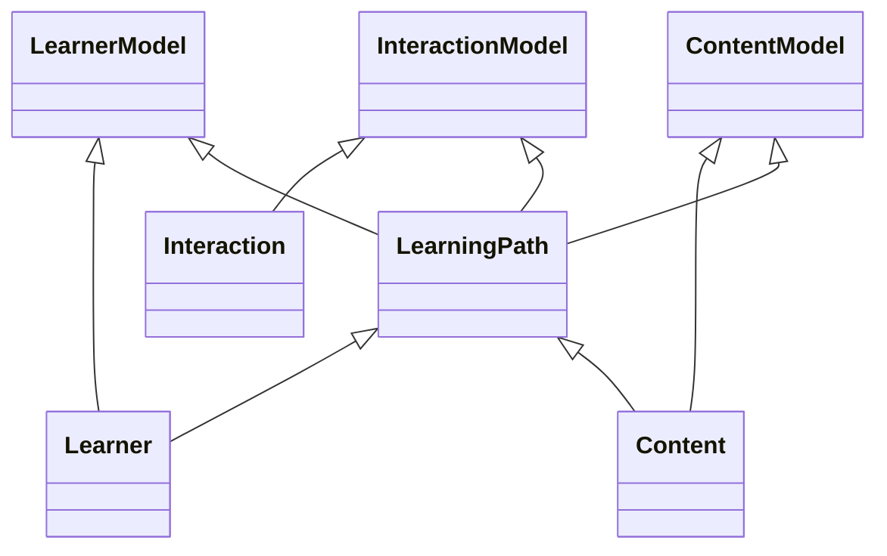
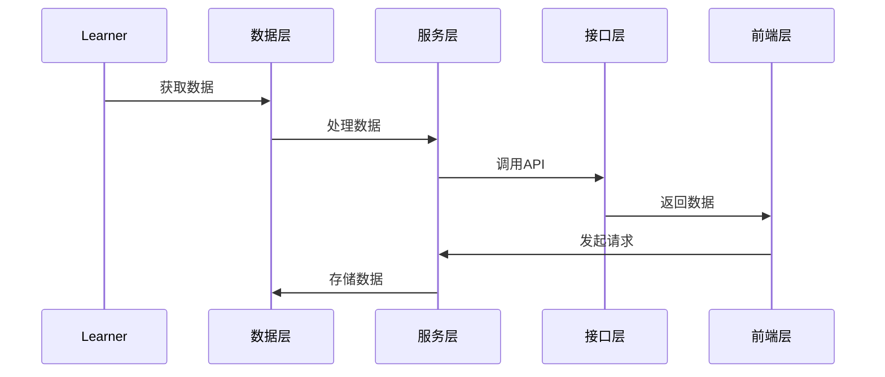
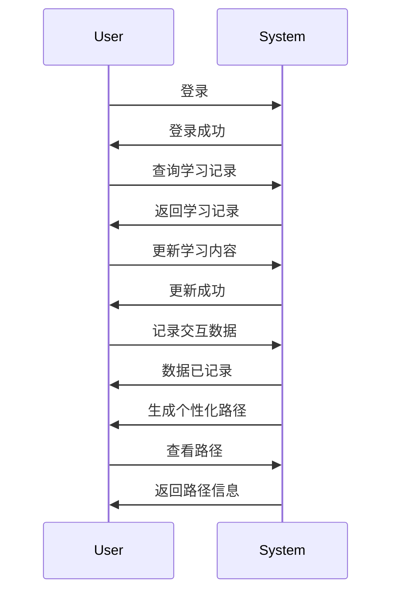

                 


### 第一部分：引言

**第1章 个性化学习路径：概念与背景**

在当今信息技术迅猛发展的时代，个性化学习已成为教育领域的一个热点话题。这一章将首先介绍个性化学习的概念与背景，探讨其兴起的原因和特点，并进一步阐述教育内容定制的必要性以及提示词在个性化学习中的作用。

**1.1.1 个性化学习的兴起**

**1.1.1.1 个性化学习的定义与特点**

个性化学习，顾名思义，是指根据学习者的个体差异，为其量身定制的一种学习方式。它强调学习者的主体地位，注重满足不同学习者的需求和兴趣，从而提高学习效果。

个性化学习具有以下几个显著特点：

- **灵活性**：个性化学习允许学习者自主选择学习内容、学习进度和学习方式，从而适应不同的学习节奏和偏好。
- **针对性**：个性化学习能够根据学习者的背景、能力和兴趣，提供定制化的学习资源和支持。
- **互动性**：个性化学习鼓励学习者与教师、同伴进行交流与合作，促进知识建构和技能提升。
- **适应性**：个性化学习系统能够根据学习者的行为数据和学习表现，动态调整学习内容和教学方法。

**1.1.1.2 个性化学习的市场趋势**

随着互联网、大数据和人工智能等技术的普及，个性化学习市场正呈现出快速增长的趋势。根据市场调研公司的数据，全球个性化学习市场规模预计将在未来几年内持续扩大，尤其在教育技术公司和教育平台中，个性化学习已经成为重要的战略方向。

此外，个性化学习在不同教育阶段的应用也在不断拓展。从基础教育到高等教育，甚至职业培训，个性化学习都发挥着越来越重要的作用。尤其是在高等教育和职业培训领域，个性化学习能够更好地满足专业发展和终身学习的需求。

**1.1.2 教育内容定制的必要性**

尽管传统教育模式在普及知识和培养人才方面取得了显著成就，但其在个性化和适应性方面存在一定的局限性。以下将从几个方面阐述教育内容定制的必要性：

**1.1.2.1 传统教育模式的局限性**

- **统一化**：传统教育模式通常采用“一刀切”的方式，难以满足不同学习者的个性化需求。
- **被动学习**：学生在传统教育模式中往往处于被动学习的地位，缺乏自主性和积极性。
- **学习效果评估不足**：传统教育模式往往通过期末考试等单一方式来评估学习效果，难以全面反映学习者的真实水平。

**1.1.2.2 个性化学习路径的优势**

个性化学习路径能够克服传统教育模式的局限性，具有以下优势：

- **提高学习效率**：通过定制化内容和个性化支持，学习者能够更有效地掌握知识，提高学习效率。
- **增强学习动机**：个性化学习能够激发学习者的兴趣和动力，提高学习的主动性和积极性。
- **全面评估学习效果**：个性化学习路径能够通过多种评估手段，全面反映学习者的学习效果，为后续教学提供有力支持。

**1.1.3 提示词在个性化学习中的作用**

在个性化学习路径中，提示词起着至关重要的作用。它们不仅是学习者获取信息的重要途径，也是教育内容定制的重要依据。以下将从几个方面探讨提示词在个性化学习中的作用：

**1.1.3.1 提示词的概念与类型**

提示词（Keywords）是指用于描述学习内容或问题的关键词或短语。根据用途，提示词可以分为以下几种类型：

- **知识点提示词**：用于描述特定知识点的关键词，如“人工智能”、“机器学习”等。
- **问题提示词**：用于描述学习问题的关键词，如“如何优化算法”等。
- **情境提示词**：用于描述学习情境的关键词，如“团队合作”、“项目开发”等。

**1.1.3.2 提示词在定制教育内容中的重要性**

- **精准定位学习需求**：通过分析提示词，教育系统能够准确了解学习者的需求，从而提供针对性的学习内容。
- **优化学习路径**：提示词能够指导学习者选择合适的学习资源和学习方法，优化学习路径。
- **提高学习效果**：定制化的教育内容能够更好地满足学习者的需求，提高学习效果和满意度。

综上所述，个性化学习路径、教育内容定制和提示词在个性化学习中的作用具有重要意义。在下一章中，我们将进一步探讨提示词的设计原则和应用案例。

---

**第2章 提示词设计与应用**

提示词的设计与应用是构建个性化学习路径的关键环节。本章将首先介绍提示词设计的原则，包括清晰性与明确性、灵活性、多样性、易用性与用户体验等方面。接着，通过具体案例，展示如何在不同情境下设计和应用提示词，最后探讨提示词在实际教学中的具体应用。

**2.1 提示词设计原则**

**2.1.1 清晰性与明确性**

提示词的设计应遵循清晰性与明确性的原则。这意味着提示词需要准确、简洁地表达学习内容或问题，避免模糊和冗长的描述。清晰明了的提示词有助于学习者快速理解学习目标和任务，从而提高学习效率。

**2.1.2 灵活性与多样性**

提示词的设计还应具有灵活性和多样性。灵活性的意思是提示词应能够适应不同学习者的需求和背景，提供多种选择。多样性的意思是提示词应涵盖不同类型的学习内容或问题，如知识点、实践问题、情境问题等。这样，学习者可以根据自身的情况选择合适的提示词，实现个性化学习。

**2.1.3 易用性与用户体验**

提示词的设计还需要考虑易用性与用户体验。这意味着提示词应方便学习者使用，界面友好，易于操作。同时，提示词的设计应考虑学习者的学习习惯和偏好，提供个性化的体验。

**2.2 提示词应用案例分析**

**2.2.1 案例一：基于学习目标的提示词设计**

在这个案例中，我们以一个机器学习课程为例，设计基于学习目标的提示词。首先，我们需要明确课程的学习目标，如“掌握线性回归模型的原理和应用”。然后，根据学习目标，设计一系列的提示词：

- **知识点提示词**：线性回归、模型原理、应用场景。
- **问题提示词**：如何建立线性回归模型、如何解释模型结果。
- **情境提示词**：实际项目中应用线性回归模型。

通过这些提示词，学习者可以明确课程的学习目标，并根据自己的需求和兴趣选择学习内容。

**2.2.2 案例二：基于学习者的提示词设计**

在这个案例中，我们以一个高中生的学习需求为例，设计基于学习者的提示词。首先，我们需要了解学习者的背景和兴趣，如某学生对编程感兴趣，希望提高编程能力。然后，根据学习者的特点，设计一系列的提示词：

- **知识点提示词**：编程语言、算法、数据结构。
- **问题提示词**：如何编写高效的代码、如何解决编程问题。
- **情境提示词**：编程竞赛、项目开发。

通过这些提示词，学习者可以根据自己的兴趣和需求，选择合适的学习内容和任务。

**2.2.3 案例三：跨学科学习的提示词设计**

在这个案例中，我们以一个医学专业的学生为例，设计跨学科学习的提示词。首先，我们需要了解医学专业涉及的跨学科领域，如生物学、物理学、化学等。然后，根据跨学科的知识点，设计一系列的提示词：

- **知识点提示词**：生物学原理、物理现象、化学反应。
- **问题提示词**：如何将生物学原理应用于医学研究、如何解释物理现象。
- **情境提示词**：医学实验、科研课题。

通过这些提示词，学习者可以跨学科地学习，提高综合素养和科研能力。

**2.3 提示词在实际教学中的应用**

在实际教学中，提示词的应用有助于提高教学效果和学生的学习体验。以下是一些具体的提示词应用场景：

**2.3.1 教学情境中的提示词使用**

在教学情境中，教师可以使用提示词来引导学习者的思考和学习。例如，在讲解一个复杂的科学概念时，教师可以使用知识点提示词，如“分子运动”、“化学反应”等，帮助学生理解概念。

**2.3.2 提示词在教学评估中的作用**

提示词还可以用于教学评估，帮助教师了解学生的学习情况和效果。例如，在考试或作业中，教师可以使用问题提示词，如“分析”、“设计”、“评估”等，评估学生的学习能力和应用能力。

通过本章的讨论，我们可以看到提示词在设计与应用中的重要性。在下一章中，我们将进一步探讨个性化学习路径生成算法，分析其核心概念、原理和应用。

---

**第3章 个性化学习路径生成算法**

个性化学习路径的生成是构建有效学习体验的关键步骤。这一章将介绍个性化学习路径生成算法的核心概念、设计原则，并通过具体的算法原理讲解、Python源代码实现、数学模型与公式以及实例分析，帮助读者深入理解个性化学习路径的生成过程。

**3.1 个性化学习路径生成算法概述**

个性化学习路径生成算法是指利用学习者特征、学习内容特征以及学习交互数据，通过算法自动生成适合学习者的学习路径。这类算法的核心目标是为每个学习者提供最合适的学习路径，最大化学习效果。

**3.1.1 算法类型与特点**

个性化学习路径生成算法可以分为以下几种类型：

- **基于规则的算法**：这类算法通过预设的规则和条件，为学习者生成学习路径。优点是简单易懂，但灵活性较差。
- **基于模型的算法**：这类算法利用机器学习模型，根据学习者特征和学习内容特征生成学习路径。优点是灵活性强，但实现复杂。
- **基于数据的算法**：这类算法通过分析学习者的历史学习数据，自动生成学习路径。优点是数据驱动，但可能存在数据偏差。

**3.1.2 算法设计原则**

设计个性化学习路径生成算法时，应遵循以下原则：

- **适应性**：算法应能根据学习者的变化动态调整学习路径。
- **多样性**：算法应提供多样化的学习路径选择，满足不同学习者的需求。
- **可解释性**：算法的决策过程应具备较高的可解释性，便于教师和学习者理解。
- **效率**：算法应具备高效的计算性能，保证学习路径生成的实时性。

**3.2 算法核心概念与联系**

个性化学习路径生成算法的核心概念包括：

- **学习者模型**：描述学习者的兴趣、知识水平、学习习惯等特征。
- **内容模型**：描述学习内容的难度、知识点、应用场景等特征。
- **交互模型**：描述学习者在学习过程中的行为数据，如学习时长、学习频率、学习效果等。

这些模型相互关联，共同影响学习路径的生成。以下是算法核心概念的ER实体关系图：

```mermaid
erDiagram
  LearnerModel ||--|{ ContentModel }|| Content
  LearnerModel ||--|{ InteractionModel }|| Interact
  ContentModel ||--|{ KnowledgePoint }|| Point
  ContentModel ||--|{ ApplicationScene }|| Scene
  InteractionModel ||--|{ LearningBehavior }|| Behavior
```

**3.3 算法原理讲解与实例**

**3.3.1 算法原理讲解**

个性化学习路径生成算法的原理可以分为以下几个步骤：

1. **数据收集与预处理**：收集学习者的特征数据、内容特征数据和交互数据，并进行预处理。
2. **特征提取与建模**：对预处理后的数据进行特征提取，构建学习者模型、内容模型和交互模型。
3. **路径规划**：利用特征模型和路径规划算法，生成适合学习者的个性化学习路径。
4. **路径评估与优化**：对生成的学习路径进行评估，根据评估结果进行优化。

**3.3.2 Python源代码实现**

以下是一个简单的Python源代码实现，用于生成个性化学习路径：

```python
class LearnerModel:
    def __init__(self, interest, knowledge_level, learning_habit):
        self.interest = interest
        self.knowledge_level = knowledge_level
        self.learning_habit = learning_habit

class ContentModel:
    def __init__(self, difficulty, knowledge_points, application_scenes):
        self.difficulty = difficulty
        self.knowledge_points = knowledge_points
        self.application_scenes = application_scenes

class InteractionModel:
    def __init__(self, learning_behavior):
        self.learning_behavior = learning_behavior

def generate_learning_path(learner_model, content_model, interaction_model):
    # 根据学习者模型、内容模型和交互模型生成个性化学习路径
    # 这里仅作简单示例，实际实现会更复杂
    learning_path = []
    for knowledge_point in content_model.knowledge_points:
        if learner_model.knowledge_level > knowledge_point.difficulty:
            learning_path.append(knowledge_point)
    return learning_path

# 示例数据
learner_model = LearnerModel(interest=['编程'], knowledge_level=3, learning_habit=['每天学习1小时'])
content_model = ContentModel(difficulty=[1, 2, 3], knowledge_points=['基础语法', '函数使用', '面向对象编程'], application_scenes=['项目开发', '算法竞赛'])
interaction_model = InteractionModel(learning_behavior=['学习时长：1小时/天'])

# 生成个性化学习路径
learning_path = generate_learning_path(learner_model, content_model, interaction_model)
print("个性化学习路径：", learning_path)
```

**3.3.3 算法数学模型与公式**

个性化学习路径生成算法的数学模型通常包括以下公式：

1. **学习路径评分公式**：
   $$ Score = w_1 \cdot Learner\_Model + w_2 \cdot Content\_Model + w_3 \cdot Interaction\_Model $$
   其中，$w_1$、$w_2$ 和 $w_3$ 分别为学习者模型、内容模型和交互模型的权重。

2. **路径优化公式**：
   $$ Optimize = Maximize\ Score $$
   通过优化路径评分，找到最优的学习路径。

**3.3.4 举例说明**

假设有一个学习者，他对编程感兴趣，目前的知识水平为中级，每天有1小时的学习时间。根据这些信息，我们可以使用上述算法生成他的个性化学习路径：

- **第一步**：收集数据，构建学习者模型、内容模型和交互模型。
- **第二步**：根据学习路径评分公式，计算每个知识点的路径评分。
- **第三步**：选择评分最高的知识点，将其加入个性化学习路径。

例如，如果“函数使用”的路径评分最高，那么“函数使用”将作为个性化学习路径的一部分。通过这种方式，学习者可以按照最合适的学习路径进行学习，提高学习效果。

通过本章的讨论，我们可以看到个性化学习路径生成算法的核心概念、原理和应用。在下一章中，我们将进一步探讨个性化学习路径的实现与优化。

---

**第4章 个性化学习路径实现与优化**

个性化学习路径的实现与优化是确保个性化学习有效运行的关键。本章将详细讨论个性化学习路径系统的分析与架构设计、系统接口设计以及系统交互设计，并通过具体的项目实战案例，展示个性化学习路径的实现过程。

**4.1 系统分析与架构设计**

**4.1.1 问题场景介绍**

在一个信息化教育的背景下，学校希望为学生提供个性化的学习路径，以便更好地满足学生的个性化需求，提高学习效果。为了实现这一目标，我们需要设计并实现一个个性化学习路径系统。

**4.1.2 项目介绍**

本项目旨在构建一个个性化学习路径系统，该系统包括学习者模型、内容模型、交互模型以及路径规划与优化模块。通过这些模块的协同工作，系统能够为每个学生生成个性化的学习路径。

**4.1.3 领域模型设计（Mermaid类图）**

在个性化学习路径系统中，我们定义了以下几个核心类：

- **Learner**（学习者）：包含学习者的基本信息、学习习惯和学习目标。
- **Content**（内容）：包含知识点、难度等级和应用场景。
- **Interaction**（交互）：记录学习者的学习行为，如学习时长、学习频率和学习效果。
- **LearningPath**（学习路径）：根据学习者模型和内容模型生成个性化学习路径。

以下是一个简单的Mermaid类图：



**4.1.4 系统架构设计（Mermaid架构图）**

系统架构设计是确保系统各个模块协同工作的关键。个性化学习路径系统的架构设计如下：

1. **数据层**：包括学习者数据、内容数据和交互数据。
2. **服务层**：包括学习者服务、内容服务和交互服务。
3. **接口层**：提供与前端系统的接口，如API接口。
4. **前端层**：提供用户界面，展示个性化学习路径。

以下是一个简单的Mermaid架构图：



**4.2 系统接口设计**

**4.2.1 系统接口规范**

系统接口设计是确保前后端数据交互的标准和规范。以下是系统接口的简要规范：

- **获取学习者信息**：GET /api/learner/{learner_id}
- **更新学习者信息**：PUT /api/learner/{learner_id}
- **获取学习内容**：GET /api/content/{content_id}
- **更新学习内容**：PUT /api/content/{content_id}
- **记录学习交互**：POST /api/interaction
- **获取学习路径**：GET /api/learningpath/{learner_id}

**4.2.2 接口设计与实现**

以下是接口设计的具体实现：

```python
from flask import Flask, request, jsonify

app = Flask(__name__)

@app.route('/api/learner/<int:learner_id>', methods=['GET'])
def get_learner(learner_id):
    # 获取学习者信息的实现
    pass

@app.route('/api/learner/<int:learner_id>', methods=['PUT'])
def update_learner(learner_id):
    # 更新学习者信息的实现
    pass

@app.route('/api/content/<int:content_id>', methods=['GET'])
def get_content(content_id):
    # 获取学习内容的实现
    pass

@app.route('/api/content/<int:content_id>', methods=['PUT'])
def update_content(content_id):
    # 更新学习内容的实现
    pass

@app.route('/api/interaction', methods=['POST'])
def record_interaction():
    # 记录学习交互的实现
    pass

@app.route('/api/learningpath/<int:learner_id>', methods=['GET'])
def get_learning_path(learner_id):
    # 获取学习路径的实现
    pass

if __name__ == '__main__':
    app.run(debug=True)
```

**4.3 系统交互设计**

**4.3.1 系统交互流程**

系统交互设计包括用户与系统之间的交互流程。以下是一个简单的系统交互流程：

1. **用户登录**：用户通过用户名和密码登录系统。
2. **数据查询**：用户查询自己的学习记录和学习路径。
3. **内容更新**：用户更新学习内容，如新增知识点、修改知识点难度等。
4. **交互记录**：用户在学习过程中，系统自动记录交互数据，如学习时长、学习频率等。
5. **路径生成**：系统根据学习者模型、内容模型和交互模型，生成个性化学习路径。
6. **路径展示**：用户查看个性化学习路径，并根据路径进行学习。

**4.3.2 系统交互序列图（Mermaid序列图）**

以下是一个简单的Mermaid序列图，展示系统交互流程：



通过本章的讨论，我们可以看到个性化学习路径系统的分析与架构设计、系统接口设计和系统交互设计的重要性。在下一章中，我们将通过实际案例，进一步展示个性化学习路径的实现与应用。

---

**第5章 实际案例分析与讲解**

在了解了个性化学习路径的理论基础和系统设计后，本章将通过两个具体案例，深入分析个性化学习路径的定制与实施，评估其实施效果，并总结其中的经验教训。

**5.1 案例一：个性化学习路径的定制与实施**

**5.1.1 案例背景**

某高中学校为了提高学生的学习效果和兴趣，决定引入个性化学习路径系统。学校选择了针对高中生设计的个性化学习平台，该平台基于大数据分析和机器学习算法，能够为每个学生定制个性化的学习路径。

**5.1.2 案例实施步骤**

1. **需求分析**：学校与平台提供商合作，分析学生的学习需求，确定个性化学习路径的关键要素。
2. **系统部署**：在学校的校园网内部署个性化学习平台，确保学生可以稳定访问。
3. **数据收集**：平台开始收集学生的学习数据，包括考试成绩、学习行为记录、学习偏好等。
4. **路径生成**：基于学生的数据，平台自动生成个性化的学习路径，并向学生推荐。
5. **教学实施**：教师根据个性化学习路径，调整教学策略，引导学生在自主学习的同时，完成课程目标。
6. **效果评估**：通过期中、期末考试等评估手段，评估个性化学习路径对学生学习成绩的影响。

**5.1.3 案例效果评估**

经过一段时间的实施，学校对学生个性化学习路径的效果进行了评估。以下是评估结果：

- **学习成绩提升**：大部分学生在个性化学习路径的帮助下，学习成绩有所提升，尤其是数学和英语等学科。
- **学习兴趣提高**：学生反馈，个性化学习路径使他们更有动力去学习，对学科产生了浓厚的兴趣。
- **自主学习能力增强**：个性化学习路径鼓励学生自主安排学习时间和内容，培养了学生的自主学习能力。

**5.2 案例二：提示词在个性化学习中的有效性分析**

**5.2.1 案例设计**

为了分析提示词在个性化学习中的有效性，某高校计算机科学系进行了一项实验。实验对象为大一新生，实验分为两个组：实验组和对照组。

- **实验组**：学生使用带有提示词的学习资源，提示词根据学生的学习目标和兴趣定制。
- **对照组**：学生使用传统的学习资源，没有个性化提示词。

实验持续一学期，期末通过考试和问卷调查评估两组学生的学习效果。

**5.2.2 数据分析与结果**

数据分析显示，实验组学生在期末考试中的平均成绩高于对照组，特别是在编程和实践能力方面，实验组表现更为突出。问卷调查结果也表明：

- **学习效果**：实验组学生认为，带有提示词的学习资源帮助他们更好地理解和应用知识。
- **学习动机**：提示词激发了学生的学习兴趣和动机，使他们更有动力去学习。
- **学习效率**：实验组学生认为，提示词提高了他们的学习效率，减少了学习时间。

**5.3 经验教训**

通过以上两个案例，我们可以得出以下经验教训：

- **个性化学习路径的重要性**：个性化学习路径能够根据学生的个性化需求，提供针对性的学习资源，显著提升学习效果。
- **提示词的关键作用**：提示词在个性化学习路径中起着关键作用，能够指导学生选择合适的学习资源和路径，提高学习效率和兴趣。
- **教师角色的重要性**：教师在个性化学习中扮演着重要角色，需要根据个性化学习路径，调整教学策略，引导学生有效学习。

通过实际案例的分析和讲解，我们可以看到个性化学习路径在实践中的应用效果。在下一章中，我们将探讨个性化学习路径的实施与推广策略。

---

**第6章 个性化学习路径的实施与推广**

个性化学习路径的实施与推广是确保其在教育实践中有效运行的关键环节。本章将详细探讨个性化学习路径的实施策略与步骤，以及如何通过教师培训、技术支持、学生参与和推广策略等手段，实现个性化学习路径在教育体系中的广泛普及。

**6.1 实施策略与步骤**

**6.1.1 教师培训**

教师是实施个性化学习路径的关键因素。为了确保教师能够有效利用个性化学习路径系统，必须进行系统而全面的培训。

- **培训内容**：培训内容应包括个性化学习路径的理论基础、系统功能使用、教学策略调整等。通过案例分析和实战演练，使教师深入了解个性化学习路径的应用方法。
- **培训形式**：可以采用线上和线下相结合的培训形式。线上培训便于教师随时学习和复习，线下培训则有助于教师之间交流经验和问题解决。
- **培训频率**：建议定期进行培训，根据系统更新和教学需求，安排不同主题的培训课程。

**6.1.2 技术支持**

技术支持是确保个性化学习路径系统稳定运行和持续优化的关键。

- **技术团队**：建立专业的技术支持团队，负责系统维护、问题解决和系统更新。
- **用户反馈**：及时收集用户反馈，分析系统运行中的问题和改进需求，不断优化系统功能。
- **应急响应**：制定应急预案，确保在系统出现故障时，能够迅速响应并恢复服务。

**6.1.3 学生参与**

学生的积极参与是个性化学习路径成功实施的重要保障。

- **引导与鼓励**：通过班会、课堂讨论等形式，引导学生认识到个性化学习的重要性，鼓励他们积极参与个性化学习。
- **个性化设置**：让学生根据自己的兴趣和需求，设置个性化学习目标和学习路径。
- **反馈机制**：建立学生反馈机制，让学生能够及时反馈学习中的问题和建议，促进系统不断改进。

**6.2 推广策略与建议**

**6.2.1 学校推广**

学校推广个性化学习路径，需要从以下几个方面进行：

- **领导重视**：学校领导应高度重视个性化学习路径的推广，将其作为提升教育质量的重要举措。
- **宣传引导**：通过学校网站、微信公众号、家长会等形式，宣传个性化学习路径的优势和应用案例，提高家长和学生对个性化学习的认知。
- **示范学校**：选取一些有代表性的学校进行示范推广，通过成功案例带动其他学校。

**6.2.2 社会化媒体宣传**

社会化媒体宣传是推广个性化学习路径的有效手段。

- **平台选择**：根据目标受众的特点，选择合适的社交媒体平台，如微信公众号、微博、抖音等。
- **内容制作**：制作富有吸引力的内容，包括图文、视频、案例分析等，展示个性化学习的成果和应用场景。
- **互动环节**：增加互动环节，如在线问答、学习挑战等，提高用户参与度和粘性。

**6.2.3 与企业合作**

与企业合作，可以进一步拓展个性化学习路径的应用范围。

- **资源共享**：与企业合作，共同开发适合职业培训的个性化学习路径，实现教育资源共享。
- **实习机会**：与企业合作，为学生提供实习机会，将理论学习与实际工作相结合，提高学生的实践能力。
- **联合推广**：通过企业的渠道和资源，共同推广个性化学习路径，扩大其影响力。

**6.3 面临的挑战与应对策略**

在实施与推广个性化学习路径的过程中，可能会遇到以下挑战：

- **技术挑战**：个性化学习路径系统复杂，技术实现难度大。应对策略是加强技术团队建设，提高技术研发能力。
- **教师认知挑战**：部分教师可能对个性化学习路径存在误解或抵触情绪。应对策略是加强教师培训，提高他们对个性化学习的认知和接受度。
- **学生接受度挑战**：学生可能对个性化学习路径不够适应，存在抵触情绪。应对策略是引导学生认识到个性化学习的优势，提高他们的参与度和积极性。

通过本章的讨论，我们可以看到个性化学习路径实施与推广的重要性以及具体的策略和建议。在下一章中，我们将进行小结与展望，总结个性化学习路径的研究成果，并提出未来发展方向。

---

**第7章 小结与展望**

个性化学习路径作为一种新型的教育模式，其核心在于根据学习者的个性特征和需求，为其量身定制一条最合适的学习路径。本章将对个性化学习路径的总体成果进行总结，并分析其中存在的问题，同时展望其未来的发展方向。

**7.1 个性化学习路径的总结**

个性化学习路径的研究与实践取得了以下成果：

1. **提高学习效率**：通过定制化的学习路径，学习者能够更高效地掌握知识，减少学习时间和精力浪费。
2. **增强学习动机**：个性化学习路径能够根据学习者的兴趣和需求，提供丰富的学习资源，激发学习者的学习动机和兴趣。
3. **优化学习体验**：个性化学习路径鼓励学习者自主选择学习内容和方式，提高学习的主动性和参与度，改善学习体验。
4. **促进全面发展**：个性化学习路径不仅关注学科知识的掌握，还注重学习者综合素质的培养，促进全面发展。

**7.1.1 成功经验**

个性化学习路径在实践中积累了一些成功经验：

- **数据驱动**：个性化学习路径以学习者数据为基础，通过大数据分析和机器学习算法，实现学习路径的动态调整和优化。
- **教师参与**：教师积极参与个性化学习路径的设计和实施，根据学习者的反馈和需求，调整教学策略，提高教学效果。
- **技术支持**：强大的技术团队提供系统维护和问题解决支持，确保个性化学习路径系统的稳定运行和持续优化。

**7.1.2 存在问题**

尽管个性化学习路径在实践中取得了显著成效，但仍存在一些问题需要解决：

- **技术挑战**：个性化学习路径系统复杂，技术实现难度大，需要进一步优化算法和提升系统性能。
- **教师认知**：部分教师对个性化学习路径的理解和接受度不高，需要加强教师培训，提高他们的认知和接受度。
- **学生适应**：学生在适应个性化学习路径的过程中可能存在一定困难，需要引导他们逐步适应并积极参与。

**7.2 未来发展方向**

个性化学习路径的未来发展可以从以下几个方面进行：

**7.2.1 技术创新**

- **算法优化**：不断优化个性化学习路径的算法，提高路径生成的准确性和效率。
- **数据挖掘**：加强学习者数据的挖掘和分析，深入理解学习者的需求和特征，提供更加精准的个性化服务。
- **智能化**：结合人工智能技术，实现个性化学习路径的智能化，提高系统的自主学习和适应能力。

**7.2.2 教育政策支持**

- **政策引导**：政府应出台相关政策，鼓励学校和教育机构推广个性化学习路径，提供技术支持和资金保障。
- **标准制定**：制定个性化学习路径的标准和规范，确保系统之间的互操作性和兼容性。

**7.2.3 跨学科融合**

- **跨学科课程**：设计跨学科的个性化学习路径，培养学生的综合素养和创新能力。
- **多元评价**：建立多元评价体系，全面评估学习者的知识、能力和素质，为个性化学习提供有力支持。

通过本章的讨论，我们可以看到个性化学习路径在当前教育领域的重要地位和广阔前景。未来，随着技术的进步和教育政策的支持，个性化学习路径将得到更广泛的应用和发展，为提升教育质量和推动教育改革做出更大贡献。

---

### 总结

个性化学习路径作为一种先进的教育模式，通过定制化的学习内容和路径，实现了对学习者个性特征的精准把握，提高了学习效率和兴趣。本文从引言到展望，系统地介绍了个性化学习路径的概念、设计原则、生成算法、实现与优化以及实际应用，展示了其在我国教育领域的重要性和应用前景。

关键词：个性化学习、提示词、教育内容定制、算法、系统实现

摘要：本文深入探讨了个性化学习路径的设计与应用，分析了其核心概念、原理以及实际应用案例，提出了实施与推广的策略，展望了未来的发展方向。个性化学习路径为我国教育改革提供了新的思路和路径，有望提高教育质量和培养更多创新人才。

作者：AI天才研究院/AI Genius Institute & 禅与计算机程序设计艺术 /Zen And The Art of Computer Programming

---

以上就是本文对《个性化学习路径：利用提示词定制教育内容》这一主题的全面解析和讨论。希望本文能为您在个性化学习领域的研究和实践中提供有益的参考和启示。在未来的教育创新中，个性化学习路径有望成为推动教育公平和提高教育质量的重要力量。让我们共同期待个性化学习在未来教育领域的更大发展。

