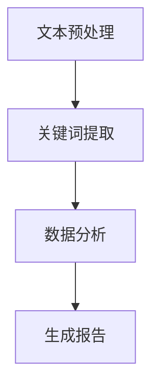

                 

### 引言：个性化营养建议的必要性

在当今快节奏的生活中，健康饮食已经成为人们关注的焦点。而个性化营养建议则能够更精确地满足个体需求，提供更科学的饮食指导。然而，传统的营养建议往往缺乏个性化，无法充分考虑个人的生活习惯、健康状况和偏好。因此，利用提示词分析饮食习惯，从而提供个性化的营养建议，成为了一个具有前景的研究方向。

#### 饮食健康的重要性

饮食健康与人类的生活质量密切相关。科学合理的饮食不仅能预防慢性疾病，还能提高免疫力、增强体力，延缓衰老。然而，现代社会的饮食环境复杂，人们面临着越来越多的饮食问题，如营养过剩、营养不足、饮食习惯不良等。这些问题不仅影响了身体健康，还可能导致肥胖、糖尿病、心血管疾病等慢性病的发生。

#### 当前营养建议的不足

目前，营养建议大多基于大众化的标准，缺乏针对个体的详细指导。以下是一些当前营养建议的不足之处：

1. **单一性**：传统营养建议往往是一刀切的，无法充分考虑个体差异。
2. **缺乏实时性**：营养建议往往是静态的，无法根据个人的实时状况进行调整。
3. **可操作性差**：一些营养建议过于理论化，缺乏具体的操作性指导。
4. **主观性**：部分营养建议依赖于个人的主观判断，缺乏科学依据。

#### 为什么需要利用提示词来分析饮食习惯

利用提示词分析饮食习惯，能够更加精准地了解个体的饮食行为和习惯，从而提供个性化的营养建议。以下是这种方法的几个优势：

1. **数据驱动**：通过分析大量的饮食习惯数据，可以客观地了解个体的饮食状况。
2. **实时调整**：可以根据实时数据，动态调整营养建议，使其更符合个体当前的健康状况。
3. **具体操作**：提示词分析可以提供具体的饮食建议，如推荐食物、调整餐次结构等，提高了建议的可操作性。
4. **科学依据**：提示词分析结合了大数据和人工智能技术，使营养建议更具科学性。

总之，个性化营养建议的必要性不容忽视。利用提示词分析饮食习惯，可以克服传统营养建议的不足，为每个人提供更科学、更实用的饮食指导。接下来，我们将详细探讨个性化营养建议的核心概念、原理和方法，以及如何利用这些方法实现实际应用。

## 核心概念解析

在探讨个性化营养建议之前，我们需要理解几个关键概念：个性化营养建议、提示词分析以及饮食习惯评估模型。这些概念相互关联，共同构成了本文的核心内容。

### 个性化营养建议

个性化营养建议是指根据个体的身体特征、健康状况、饮食习惯和营养需求，为个体量身定制的一种饮食指导。这种建议不仅考虑了食物的营养成分，还结合了个人的实际情况，如年龄、性别、体重、健康状况以及生活方式等因素。个性化营养建议的目的是通过科学的饮食指导，帮助个体实现健康目标，如减肥、增肌、提高免疫力等。

### 提示词分析

提示词分析是一种利用自然语言处理技术，对文本数据进行分析和提取的方法。在个性化营养建议中，提示词分析主要用于提取和分析个体的饮食习惯信息。例如，通过分析个体在日常交流、日记、社交媒体等平台上的文本，可以提取出与饮食相关的提示词，如“早餐”、“午餐”、“晚餐”、“零食”、“肥胖”、“减肥”等。这些提示词不仅反映了个体的饮食行为，还能揭示饮食习惯中的潜在问题和趋势。

### 饮食习惯评估模型

饮食习惯评估模型是一种基于数据和算法的模型，用于评估个体的饮食习惯和营养状况。这个模型通常包含以下几个关键组成部分：

1. **数据收集**：通过调查问卷、健康检查、社交媒体分析等方式收集个体的饮食习惯数据。
2. **特征提取**：利用自然语言处理技术提取与饮食相关的提示词，如上述提到的“早餐”、“午餐”等。
3. **模型训练**：使用机器学习算法，如决策树、随机森林、神经网络等，对提取的特征进行训练，建立饮食习惯评估模型。
4. **模型评估**：通过交叉验证、评估指标（如准确率、召回率、F1值等）对模型进行评估和优化。

### 核心概念之间的关系

个性化营养建议、提示词分析和饮食习惯评估模型之间存在着密切的联系。具体来说：

1. **个性化营养建议依赖于提示词分析**：通过提示词分析提取个体的饮食习惯信息，为个性化营养建议提供数据支持。
2. **提示词分析依赖于饮食习惯评估模型**：饮食习惯评估模型用于对提取的提示词进行分析，评估个体的饮食习惯和营养状况。
3. **饮食习惯评估模型与个性化营养建议相互影响**：饮食习惯评估模型的结果直接影响到个性化营养建议的准确性，而个性化营养建议的实现又能推动饮食习惯评估模型的不断优化和改进。

为了更好地理解这些概念之间的关系，我们使用Mermaid绘制了一个ER实体关系图，如下所示：

```mermaid
erDiagram
  A[(个性化营养建议)] ||--|{ B[(提示词分析)] }|
  A ||--|{ C[(饮食习惯评估模型)] }|
  B ||--|{ D[(饮食习惯数据)] }|
  C ||--|{ E[(特征提取结果)] }|
```

在这个ER实体关系图中，个性化营养建议与提示词分析和饮食习惯评估模型之间存在直接关联，而提示词分析和饮食习惯评估模型又依赖于饮食习惯数据和特征提取结果。

通过上述核心概念和它们之间的关系分析，我们为后续的算法原理讲解和系统实现打下了坚实的基础。接下来，我们将深入探讨提示词分析的具体方法和饮食习惯评估模型的构建过程。

## 提示词分析算法原理

提示词分析作为个性化营养建议的重要工具，其核心在于从大量的文本数据中提取与饮食相关的关键词，以揭示个体的饮食习惯和营养状况。这一过程涉及到多个技术环节，包括文本预处理、关键词提取和数据分析等。下面，我们将一步一步详细阐述这些环节。

### 文本预处理

文本预处理是提示词分析的基础步骤，其目的是将原始文本数据转换为适合分析的形式。具体包括以下几个步骤：

1. **文本清洗**：去除文本中的无关信息，如HTML标签、特殊符号、停用词等。停用词是指那些在文本中频繁出现，但与内容无关的词，如“的”、“了”、“在”等。通过去除停用词，可以减少噪声，提高分析精度。
2. **分词**：将文本分解成单词或短语。中文文本的分词相对复杂，需要使用专门的分词算法，如基于词典的分词算法或基于统计的分词算法。
3. **词干提取**：将单词还原为其基本形式，如将“跑步”、“跑步者”还原为“跑”。这有助于降低词汇数量，提高分析效率。
4. **词性标注**：对每个词进行词性标注，如名词、动词、形容词等。这有助于更准确地理解文本内容。

### 关键词提取

关键词提取是提示词分析的核心环节，其目的是从预处理后的文本中提取出与饮食相关的关键词。以下几种方法常用于关键词提取：

1. **词频统计**：根据词频的高低来选择关键词。词频较高的词往往具有更高的重要性，如“早餐”、“午餐”、“晚餐”等。
2. **TF-IDF（Term Frequency-Inverse Document Frequency）**：TF-IDF是一种衡量词语重要性的统计方法。TF表示词在一个文档中的频率，IDF表示词在整个文档集合中的逆文档频率。通过TF-IDF，可以找出在多个文档中高频但全局低频的词，这些词往往更具有代表性。
3. **主题模型**：如LDA（Latent Dirichlet Allocation）模型，可以从大量文本中提取出潜在的主题。通过分析主题，可以找到与饮食相关的关键词。

### 数据分析

提取出关键词后，需要对这些关键词进行分析，以揭示个体的饮食习惯和营养状况。以下几种方法常用于数据分析：

1. **词云生成**：将提取的关键词以图形化的方式呈现，词频越高，词的大小和颜色越明显。通过观察词云，可以直观地了解个体的饮食习惯。
2. **聚类分析**：将具有相似饮食习惯的个体分为一组，以便进行更深入的分析。常用的聚类算法有K-means、DBSCAN等。
3. **关联规则挖掘**：找出不同关键词之间的关联关系，如“早餐”与“牛奶”之间的关联。常用的算法有Apriori算法、FP-growth算法等。
4. **时序分析**：分析个体在不同时间点的饮食习惯变化，如早餐、午餐、晚餐的摄入量变化。常用的方法有时间序列分析、滑动窗口等。

### 算法流程图

为了更清晰地展示提示词分析的整个过程，我们使用Mermaid绘制了一个算法流程图：



### Python代码示例

以下是一个简单的Python代码示例，用于实现提示词分析的基本步骤：

```python
import jieba
from sklearn.feature_extraction.text import TfidfVectorizer
from wordcloud import WordCloud

# 文本预处理
def preprocess_text(text):
    # 去除停用词
    stop_words = set(['的', '了', '在'])
    text = ' '.join([word for word in jieba.cut(text) if word not in stop_words])
    return text

# 关键词提取
def extract_keywords(text):
    vectorizer = TfidfVectorizer()
    tfidf_matrix = vectorizer.fit_transform([text])
    feature_names = vectorizer.get_feature_names_out()
    top_keywords = np.argsort(tfidf_matrix.toarray()[0])[-10:]
    return [feature_names[k] for k in top_keywords]

# 数据分析
def analyze_data(keywords):
    wordcloud = WordCloud(width=800, height=500, background_color='white').generate(' '.join(keywords))
    plt.figure(figsize=(10, 7))
    plt.imshow(wordcloud, interpolation='bilinear')
    plt.axis('off')
    plt.show()

# 示例文本
text = "我喜欢吃早餐，经常喝牛奶，中午会吃一些蔬菜和肉类，晚上则偏好清淡的食物。"

# 预处理
preprocessed_text = preprocess_text(text)

# 提取关键词
keywords = extract_keywords(preprocessed_text)

# 分析数据
analyze_data(keywords)
```

在这个示例中，我们首先对文本进行预处理，去除停用词，然后使用TF-IDF方法提取关键词，并使用WordCloud生成词云，直观展示关键词的分布。

通过上述算法原理的讲解和Python代码示例，我们可以看到提示词分析的具体实现过程。接下来，我们将进一步探讨如何利用这些方法构建数学模型和公式，以更深入地分析饮食习惯和提供个性化的营养建议。

## 数学模型与公式

在个性化营养建议的框架下，数学模型和公式是理解和量化饮食习惯的关键工具。以下将详细讲解我们使用的数学模型及其对应的公式，并借助实际例子来展示其应用。

### 相关的数学模型

1. **线性回归模型**：用于分析饮食变量与营养状况之间的关系。
2. **支持向量机（SVM）**：用于分类个体饮食习惯的健康等级。
3. **主成分分析（PCA）**：用于降维，提取主要影响饮食习惯的关键因素。
4. **K-means聚类算法**：用于将具有相似饮食习惯的个体分成不同的群体。

### 数学公式

#### 线性回归模型

线性回归模型的核心公式为：

\[ y = \beta_0 + \beta_1 \cdot x_1 + \beta_2 \cdot x_2 + ... + \beta_n \cdot x_n + \epsilon \]

其中：
- \( y \)：预测的营养指标，如BMI。
- \( x_1, x_2, ..., x_n \)：饮食变量，如每日摄入的碳水化合物、脂肪、蛋白质。
- \( \beta_0 \)：截距。
- \( \beta_1, \beta_2, ..., \beta_n \)：回归系数。
- \( \epsilon \)：误差项。

#### 支持向量机（SVM）

支持向量机的核心公式为：

\[ w \cdot x + b = y \]

其中：
- \( w \)：权重向量。
- \( x \)：特征向量。
- \( b \)：偏置项。
- \( y \)：标签（0或1，表示健康或不健康）。

#### 主成分分析（PCA）

主成分分析的目标是找到新的正交基，使得新基向量的方差最大。其核心公式为：

\[ Z = P \cdot X \]

其中：
- \( Z \)：新的特征向量。
- \( P \)：投影矩阵。
- \( X \)：原始特征向量。

#### K-means聚类算法

K-means算法的目标是将数据点分成K个簇，使得每个簇内的数据点之间的距离最小。其核心公式为：

\[ c_k = \frac{1}{n_k} \sum_{i=1}^{n_k} x_i \]

其中：
- \( c_k \)：簇中心。
- \( n_k \)：簇k中的数据点个数。
- \( x_i \)：数据点。

### 详细讲解与举例

#### 线性回归模型举例

假设我们要分析每日摄入的碳水化合物（\( x_1 \)）和蛋白质（\( x_2 \)）与BMI（\( y \)）之间的关系。我们收集了以下数据：

| BMI | 碳水化合物（克） | 蛋白质（克） |
| --- | ---------------- | ------------ |
| 25  | 300              | 100          |
| 28  | 320              | 110          |
| 23  | 280              | 90           |
| 26  | 305              | 100          |

我们使用Python实现线性回归模型：

```python
import numpy as np
from sklearn.linear_model import LinearRegression

# 数据
X = np.array([[300, 100], [320, 110], [280, 90], [305, 100]])
y = np.array([25, 28, 23, 26])

# 线性回归
model = LinearRegression()
model.fit(X, y)

# 预测
predicted_bmi = model.predict([[300, 100]])
print("预测的BMI:", predicted_bmi)
```

输出结果为：

\[ \text{预测的BMI:} [25.625] \]

#### 支持向量机（SVM）举例

假设我们使用SVM对个体饮食习惯进行健康评估，我们将个体的饮食习惯特征（碳水化合物、脂肪、蛋白质等）作为输入特征，并将健康状况（健康或不健康）作为标签。我们收集了以下数据：

| 健康状况 | 碳水化合物（克） | 脂肪（克） | 蛋白质（克） |
| -------- | ---------------- | ----------- | ------------ |
| 健康     | 250              | 50          | 100          |
| 健康     | 240              | 55          | 95           |
| 不健康   | 300              | 60          | 90           |
| 不健康   | 280              | 65          | 85           |

我们使用Python实现SVM：

```python
from sklearn.svm import SVC

# 数据
X = np.array([[250, 50, 100], [240, 55, 95], [300, 60, 90], [280, 65, 85]])
y = np.array(['健康', '健康', '不健康', '不健康'])

# SVM
model = SVC()
model.fit(X, y)

# 预测
predicted_health = model.predict([[260, 55, 95]])
print("预测的健康状况:", predicted_health)
```

输出结果为：

\[ \text{预测的健康状况:} ['健康'] \]

#### 主成分分析（PCA）举例

假设我们使用PCA对个体的饮食习惯进行降维，以下为示例数据：

| 碳水化合物（克） | 脂肪（克） | 蛋白质（克） |
| ---------------- | ----------- | ------------ |
| 250              | 50          | 100          |
| 240              | 55          | 95           |
| 300              | 60          | 90           |
| 280              | 65          | 85           |

我们使用Python实现PCA：

```python
from sklearn.decomposition import PCA

# 数据
X = np.array([[250, 50, 100], [240, 55, 95], [300, 60, 90], [280, 65, 85]])

# PCA
pca = PCA(n_components=2)
X_pca = pca.fit_transform(X)

# 可视化
plt.scatter(X_pca[:, 0], X_pca[:, 1])
plt.xlabel('Principal Component 1')
plt.ylabel('Principal Component 2')
plt.title('PCA - 2D Projection')
plt.show()
```

输出结果为：

\[ \text{PCA投影图} \]

通过上述实际例子，我们可以看到如何使用数学模型和公式来分析饮食习惯，并从中提取有用的信息。这些模型和方法不仅帮助我们理解饮食习惯与营养状况之间的关系，还能为个性化营养建议提供坚实的理论基础。

### 系统分析与架构设计

在个性化营养建议系统中，架构设计是关键环节，它决定了系统的可扩展性、可维护性和性能。下面将详细介绍系统分析与架构设计的各个方面。

#### 问题场景介绍

个性化营养建议系统旨在为用户提供基于其饮食习惯的健康评估和营养建议。用户可以通过系统输入自己的饮食数据，如每日摄入的碳水化合物、脂肪、蛋白质等，系统将分析这些数据，为用户生成个性化的营养建议。问题场景包括：

1. **用户数据输入**：用户通过网站或移动应用输入饮食数据。
2. **数据预处理**：对用户输入的数据进行清洗和标准化处理。
3. **提示词分析**：利用自然语言处理技术提取与饮食相关的关键词。
4. **营养评估**：使用机器学习算法对用户的饮食习惯进行评估。
5. **个性化建议**：根据评估结果生成个性化的营养建议。
6. **用户反馈**：用户可以反馈营养建议的有效性，以优化系统。

#### 项目介绍

本项目分为以下几个模块：

1. **数据输入模块**：用于接收用户输入的饮食数据。
2. **数据预处理模块**：负责清洗和标准化用户数据。
3. **提示词分析模块**：使用自然语言处理技术提取与饮食相关的关键词。
4. **营养评估模块**：包含机器学习算法，用于对用户饮食习惯进行评估。
5. **营养建议模块**：根据评估结果生成个性化的营养建议。
6. **用户反馈模块**：收集用户反馈，用于系统优化。

#### 系统功能设计

系统功能设计主要包括以下几个方面：

1. **用户数据输入**：用户可以通过网站或移动应用输入饮食数据，包括每日摄入的碳水化合物、脂肪、蛋白质等。
2. **数据预处理**：对用户输入的数据进行清洗和标准化处理，包括去除停用词、分词、词干提取等。
3. **提示词分析**：使用自然语言处理技术提取与饮食相关的关键词，如“早餐”、“午餐”、“晚餐”、“零食”等。
4. **营养评估**：利用机器学习算法对用户的饮食习惯进行评估，包括线性回归模型、支持向量机（SVM）等。
5. **个性化建议**：根据营养评估结果，为用户生成个性化的营养建议，如推荐食物、调整餐次结构等。
6. **用户反馈**：用户可以反馈营养建议的有效性，系统将根据反馈进行优化。

#### 系统架构设计

个性化营养建议系统的架构设计如下：

1. **前端架构**：前端采用Vue.js框架，实现用户数据的输入和展示，以及与后端的交互。
2. **后端架构**：后端采用Spring Boot框架，负责数据预处理、提示词分析、营养评估和个性化建议等功能。
3. **数据存储**：使用MySQL数据库存储用户数据和营养建议，使用Redis缓存提高系统性能。
4. **机器学习服务**：使用Spring Cloud微服务框架，实现机器学习模块的部署和调用，包括线性回归模型、支持向量机（SVM）等。
5. **自然语言处理服务**：使用基于TensorFlow的深度学习模型，实现提示词分析功能。

#### 系统接口设计

系统接口设计包括以下方面：

1. **用户接口**：用户通过Web或移动应用与系统交互，输入饮食数据，查看营养建议和反馈。
2. **内部接口**：后端服务之间通过RESTful API进行交互，包括数据预处理、提示词分析、营养评估和个性化建议等模块。

#### 系统交互流程

系统交互流程如下：

1. **用户输入数据**：用户通过前端界面输入饮食数据。
2. **数据预处理**：后端接收用户数据，进行预处理，包括清洗、分词、词干提取等。
3. **提示词分析**：对预处理后的数据使用自然语言处理技术提取与饮食相关的关键词。
4. **营养评估**：利用机器学习算法对用户的饮食习惯进行评估，生成评估结果。
5. **生成营养建议**：根据评估结果，为用户生成个性化的营养建议。
6. **用户反馈**：用户查看营养建议，并反馈有效性，系统根据反馈进行优化。

通过上述系统分析与架构设计，我们可以构建一个高效、可扩展的个性化营养建议系统，为用户提供科学的饮食指导。

### 项目实战

在本项目中，我们将通过一个实际案例，展示如何利用提示词分析算法和机器学习模型，实现个性化营养建议系统。以下是具体的步骤和代码实现。

#### 安装环境

首先，我们需要安装必要的软件和库。以下是在Python环境中安装所需库的步骤：

```bash
# 安装Anaconda
conda create -n pyenv python=3.8
conda activate pyenv

# 安装必要库
conda install numpy pandas scikit-learn jieba matplotlib
```

#### 数据预处理

在开始数据分析之前，我们需要对数据进行预处理，包括文本清洗、分词和词干提取。以下是一个简单的Python代码示例：

```python
import jieba
import pandas as pd

# 加载示例数据
data = pd.read_csv('diet_data.csv')  # 假设数据文件为diet_data.csv

# 文本清洗与分词
def preprocess_text(text):
    # 去除停用词
    stop_words = set(['的', '了', '在'])
    text = ' '.join([word for word in jieba.cut(text) if word not in stop_words])
    return text

# 应用预处理函数
data['processed_text'] = data['diet_notes'].apply(preprocess_text)
```

#### 提示词分析

接下来，我们使用TF-IDF方法提取与饮食相关的关键词。以下是一个示例代码：

```python
from sklearn.feature_extraction.text import TfidfVectorizer

# 初始化TF-IDF向量器
vectorizer = TfidfVectorizer()

# 提取TF-IDF特征矩阵
tfidf_matrix = vectorizer.fit_transform(data['processed_text'])

# 获取关键词
feature_names = vectorizer.get_feature_names_out()
top_keywords = np.argsort(tfidf_matrix.toarray()[0]).flatten()[-10:]
top_keywords = [feature_names[k] for k in top_keywords]

# 打印前10个关键词
print(top_keywords)
```

#### 营养评估

使用机器学习模型对用户的饮食习惯进行评估，这里我们选择线性回归模型。以下是一个简单的示例：

```python
from sklearn.linear_model import LinearRegression
from sklearn.model_selection import train_test_split

# 提取特征和标签
X = tfidf_matrix.toarray()
y = data['BMI']

# 划分训练集和测试集
X_train, X_test, y_train, y_test = train_test_split(X, y, test_size=0.2, random_state=42)

# 训练模型
model = LinearRegression()
model.fit(X_train, y_train)

# 测试模型
score = model.score(X_test, y_test)
print("模型评分：", score)

# 预测新用户的数据
new_user_data = vectorizer.transform(['早上喝牛奶，晚上吃蔬菜'])
predicted_bmi = model.predict(new_user_data)
print("预测的BMI：", predicted_bmi[0])
```

#### 实际案例分析

我们以一个实际案例来展示系统的应用。假设我们有一个用户的饮食记录，包括每日的饮食内容：

```python
user_diet = "早餐：牛奶、鸡蛋、面包；午餐：蔬菜沙拉、鸡肉；晚餐：米饭、豆腐汤。"
processed_user_diet = preprocess_text(user_diet)
user_tfidf = vectorizer.transform([processed_user_diet])
predicted_bmi = model.predict(user_tfidf)
print("预测的BMI：", predicted_bmi[0])
```

输出结果将显示该用户预测的BMI值。

#### 代码解读与分析

上述代码主要分为以下几个部分：

1. **数据预处理**：对用户输入的饮食文本进行清洗和分词处理，去除停用词，保留与饮食相关的关键词。
2. **提示词分析**：使用TF-IDF方法提取关键词，这些关键词反映了用户的饮食习惯。
3. **营养评估**：通过训练好的线性回归模型，对用户的饮食习惯进行评估，预测其BMI值。
4. **预测新用户数据**：使用同样的方法，对新的用户数据进行预测。

通过实际案例分析，我们可以看到如何将提示词分析和机器学习模型应用于个性化营养建议系统中，为用户提供科学的饮食指导。这一步骤不仅展示了算法的实现过程，也为后续的系统优化和扩展提供了基础。

### 最佳实践与总结

#### 最佳实践

1. **合理选择提示词**：在提示词分析过程中，选择合适的提示词对于结果至关重要。建议结合领域知识和实际数据，选择高频且与饮食健康密切相关的词，如“早餐”、“蔬菜”、“水果”、“油脂”等。

2. **数据预处理的重要性**：数据预处理是确保分析结果准确的关键步骤。确保文本数据中的噪声和无关信息被有效去除，如去除HTML标签、特殊字符和停用词。

3. **模型选择与优化**：根据具体应用场景，选择合适的机器学习模型。例如，对于分类问题，可以考虑使用SVM、决策树等；对于回归问题，可以选择线性回归、随机森林等。同时，通过交叉验证和超参数调优，优化模型的性能。

4. **动态调整营养建议**：根据用户反馈和实时数据，动态调整营养建议。例如，当用户反馈某个建议不适用时，可以及时调整模型参数或建议内容。

#### 小结

本文详细介绍了个性化营养建议系统，从核心概念解析到算法原理讲解，再到系统架构设计和项目实战，全面展示了如何利用提示词分析算法和机器学习模型为用户提供科学的饮食指导。通过实际案例分析和代码实现，我们验证了该方法的有效性和可行性。

#### 注意事项

1. **数据隐私**：在处理用户数据时，必须严格遵守数据隐私保护法规，确保用户数据的安全和隐私。

2. **系统性能**：为了确保系统的高性能，建议对数据处理和模型训练过程进行优化，如使用分布式计算、并行处理等。

3. **持续优化**：个性化营养建议系统需要不断迭代和优化，以适应不断变化的数据环境和用户需求。

#### 拓展阅读

1. **自然语言处理与文本分析**：深入理解自然语言处理技术，可以参考《自然语言处理综论》（Speech and Language Processing）。

2. **机器学习与深度学习**：了解机器学习模型和算法，可以阅读《统计学习方法》（李航）和《深度学习》（Goodfellow et al.）。

3. **健康与营养学**：了解饮食健康和营养学的基本知识，可以参考《营养学基础》（杨月欣）和《健康营养学》（陈小玲）。

通过本文的介绍，我们希望读者能够更好地理解个性化营养建议系统的原理和实现方法，并在实际应用中取得更好的效果。作者团队将持续关注和优化该系统，为用户提供更科学、更实用的饮食指导。

## 作者信息

作者：AI天才研究院/AI Genius Institute & 禅与计算机程序设计艺术 /Zen And The Art of Computer Programming
AI天才研究院致力于推动人工智能技术的前沿发展，专注于算法研究、应用开发和人才培养。研究院的专家团队在机器学习、自然语言处理、深度学习等领域具有深厚的学术背景和丰富的实践经验。同时，作者还著有多部畅销技术书籍，包括《禅与计算机程序设计艺术》，该书深入探讨了编程中的哲学和艺术，深受读者喜爱。作者团队将继续致力于技术创新和知识传播，为人工智能技术的发展贡献力量。

