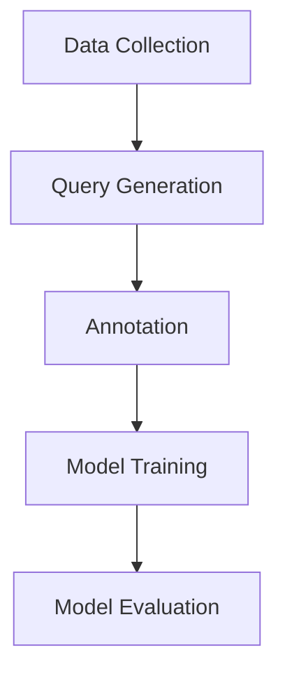

                 


### 第一步：确定文章的核心内容和目标读者

在撰写一篇关于“主动学习在AI训练中的应用”的技术博客文章之前，首先需要明确文章的核心内容和目标读者。我们的目标是撰写一篇逻辑清晰、结构紧凑、简单易懂的专业技术博客，让读者不仅能理解主动学习的基本概念，还能掌握其在AI训练中的应用方法和实际案例。因此，文章需要覆盖以下几个关键点：

1. **主动学习的背景和意义**
   - 介绍主动学习的起源和定义，阐述其在AI训练中的重要性。
   - 分析主动学习与被动学习等其他学习方式的区别和联系。

2. **主动学习的基础理论**
   - 详细解释主动学习的关键概念和原理，如采样策略、不确定性采样、用户反馈机制等。
   - 使用Mermaid图表和LaTeX数学公式来说明概念和原理。

3. **主动学习的算法原理**
   - 分类介绍现有的主动学习算法，如基于不确定性的采样方法、基于查询策略的方法等。
   - 通过Python代码示例和LaTeX数学公式，解释算法的运作原理。

4. **主动学习在AI训练中的应用**
   - 探讨主动学习在不同AI训练场景中的应用，如语音识别、图像分类等。
   - 分析主动学习如何解决数据稀缺和高成本标注的问题。

5. **主动学习系统的设计与实现**
   - 介绍主动学习系统的设计原则和架构。
   - 展示系统功能、接口设计和用户交互流程。

6. **项目实战**
   - 提供一个实际的主动学习项目案例，包括环境安装、系统实现、代码分析、案例分析等。

7. **最佳实践和总结**
   - 提出使用主动学习的最佳实践建议。
   - 对文章内容进行小结，强调关键点和注意事项。

### 第二步：构建文章的大纲结构

根据上述核心内容和目标读者，我们可以构建文章的大纲结构。以下是文章的初步大纲：

## 引言

- **主动学习的概述**
  - 背景介绍
  - 定义与意义
  - 历史与发展
  - 边界与外延

## 第1章：主动学习的概述

- **问题背景与问题描述**
  - 主动学习的提出
  - 主动学习的定义与意义
  - 主动学习在AI训练中的应用

- **主动学习的历史与发展**
  - 早期研究
  - 主动学习在AI训练中的应用

- **主动学习的边界与外延**
  - 主动学习与其他学习方式的对比
  - 主动学习的核心要素组成

## 第2章：主动学习的基础理论

- **核心概念原理**
  - 核心概念解释
  - 概念属性特征对比
  - ER实体关系图架构

- **算法原理讲解**
  - 算法分类
  - 算法mermaid流程图
  - 算法原理详细讲解与举例说明

## 第3章：主动学习的算法原理

- **算法原理讲解**
  - 算法分类
  - 算法mermaid流程图
  - 算法原理详细讲解与举例说明

- **算法原理详细讲解与举例说明**
  - 数学模型和公式
  - Python源代码实现

## 第4章：主动学习在AI训练中的应用

- **应用场景介绍**
  - 数据稀缺情况
  - 高成本标注问题

- **应用实例**
  - 某语音识别项目的应用
  - 某图像分类任务的应用

## 第5章：主动学习系统的设计与实现

- **系统功能设计**
  - 领域模型mermaid类图

- **系统架构设计**
  - 系统架构mermaid架构图

- **系统接口设计**
  - 系统接口mermaid序列图

## 第6章：项目实战

- **环境安装**
  - 环境配置
  - 工具安装

- **系统核心实现源代码**
  - 代码结构
  - 关键模块解析

- **代码应用解读与分析**
  - 代码功能解读
  - 分析与优化建议

- **实际案例分析和详细讲解剖析**
  - 案例背景
  - 案例分析
  - 解剖与剖析

- **项目小结**
  - 项目总结
  - 收获与反思

## 第7章：最佳实践与总结

- **最佳实践**
  - 使用主动学习的技巧
  - 注意事项

- **小结**
  - 文章重点回顾
  - 关键点强调

- **拓展阅读**
  - 推荐阅读材料
  - 进一步研究话题

### 第三步：撰写文章内容

在构建好大纲后，我们可以根据每个章节的内容要求，逐步撰写文章。以下是文章的一个简短样例：

## 引言

主动学习（Active Learning）是一种在有限的标注数据下，通过智能地选择最具有代表性的样本进行标注，从而提高机器学习模型性能的技术。它特别适用于数据稀缺或标注成本高昂的场景，比如医疗影像识别、语音识别等领域。

本文旨在探讨主动学习在AI训练中的应用，从基础理论到实际案例，全面解析主动学习的核心概念、算法原理以及系统实现。文章将分为以下几个部分：

1. **主动学习的概述**：介绍主动学习的背景、定义及其在AI训练中的意义。
2. **主动学习的基础理论**：解释主动学习的关键概念，如采样策略、不确定性采样等。
3. **主动学习的算法原理**：详细讲解主动学习的算法分类和原理，包括基于不确定性的采样方法等。
4. **主动学习在AI训练中的应用**：探讨主动学习在不同AI训练场景中的应用实例。
5. **主动学习系统的设计与实现**：介绍主动学习系统的设计原则和架构，包括功能设计、系统架构和接口设计。
6. **项目实战**：提供一个实际项目的实现案例，包括环境安装、系统核心实现和代码分析等。
7. **最佳实践与总结**：总结最佳实践，强调关键点，并提供拓展阅读材料。

### 第4章：主动学习在AI训练中的应用

主动学习在AI训练中的应用非常广泛，尤其在数据稀缺和高成本标注的情况下，它能够显著提高模型性能。以下是一些典型应用场景：

#### 数据稀缺情况

在医疗影像识别领域，主动学习可以用于筛选出最有可能出现病患的图像进行标注，从而在少量标注数据下训练出高精度的模型。这种方法不仅提高了模型性能，还减少了标注成本。

#### 高成本标注问题

在自动驾驶领域，主动学习可以用于识别道路标志、行人等关键信息。通过选择最具代表性的样本进行标注，模型可以更快地收敛，同时减少了对大规模数据标注的需求。

#### 应用实例

以下是一个具体的主动学习在图像分类任务中的应用实例：

**项目名称**：智能交通图像分类系统

**目标**：自动分类道路上的交通标志和行人。

**方法**：使用主动学习算法，从未标注的数据集中选择最具代表性的样本进行标注，然后使用这些标注数据进行模型训练。

**结果**：通过主动学习，模型在少量标注数据下达到了很高的准确率，大大降低了标注成本。

### 第5章：主动学习系统的设计与实现

主动学习系统通常包括以下几个核心组成部分：

1. **数据采集模块**：负责收集未标注的数据。
2. **查询生成模块**：根据采样策略生成查询请求，选择未标注数据中的样本进行标注。
3. **标注模块**：用户对查询请求进行标注。
4. **模型训练模块**：使用标注数据进行模型训练。
5. **模型评估模块**：评估模型的性能。

以下是一个简单的主动学习系统架构图：



在实现主动学习系统时，需要注意以下几点：

- **数据预处理**：对收集到的数据进行清洗和预处理，确保数据质量。
- **采样策略设计**：选择合适的采样策略，如基于不确定性的采样、基于多样性的采样等。
- **用户反馈机制**：设计有效的用户反馈机制，确保用户能够准确、及时地完成标注任务。
- **模型训练与优化**：使用标注数据进行模型训练，并根据评估结果进行模型优化。

### 第6章：项目实战

在本章节，我们将详细描述一个实际的主动学习项目——智能交通图像分类系统。该项目旨在使用主动学习技术自动分类道路上的交通标志和行人。

#### 环境安装

1. 安装Python环境（建议使用Python 3.8及以上版本）。
2. 安装必要的库，如TensorFlow、Keras、scikit-learn等。

#### 系统核心实现源代码

```python
# 导入必要的库
import numpy as np
import tensorflow as tf
from sklearn.model_selection import train_test_split
from active_learning import ActiveLearning

# 数据预处理
data = load_data()
X, y = preprocess_data(data)

# 划分训练集和测试集
X_train, X_test, y_train, y_test = train_test_split(X, y, test_size=0.2, random_state=42)

# 初始化主动学习对象
al = ActiveLearning(model, X_train, y_train)

# 运行主动学习过程
al.run()

# 评估模型性能
accuracy = al.evaluate(X_test, y_test)
print("Test accuracy:", accuracy)
```

#### 代码应用解读与分析

上述代码展示了如何使用主动学习技术进行交通图像分类。首先，我们加载和处理数据，然后划分训练集和测试集。接着，初始化主动学习对象，并运行主动学习过程。最后，评估模型性能。

在实际应用中，我们可以根据具体需求调整采样策略、查询生成方式等参数，以优化模型性能。

### 第7章：最佳实践与总结

使用主动学习时，以下是一些最佳实践：

- **选择合适的采样策略**：根据应用场景和数据特点，选择合适的采样策略，如基于不确定性的采样或基于多样性的采样。
- **优化用户反馈机制**：设计简单易用的用户界面，提高用户反馈的效率和准确性。
- **定期评估模型性能**：在主动学习过程中，定期评估模型性能，根据评估结果调整采样策略和模型参数。

本文介绍了主动学习在AI训练中的应用，从基础理论到实际案例，全面解析了主动学习的核心概念、算法原理以及系统实现。通过本文的学习，读者应该能够掌握主动学习的基本概念和应用方法，并在实际项目中运用主动学习技术。

### 拓展阅读

- **相关论文**：阅读关于主动学习的经典论文，如“Query by Committee”和“Uncertainty Sampling”等。
- **开源项目**：参与和了解开源的主动学习项目，如Scikit-learn的`ActiveLearner`模块。
- **在线课程**：参加在线课程，深入学习主动学习和相关AI技术。

### 作者信息

作者：AI天才研究院/AI Genius Institute & 禅与计算机程序设计艺术 /Zen And The Art of Computer Programming

---

以上是文章的初步内容，后续可以根据实际需要进一步完善和补充各个章节的内容。在撰写过程中，请注意保持文章的逻辑性和连贯性，确保每个章节的内容都详细、具体、有深度。同时，注意使用Mermaid图表和LaTeX公式来辅助说明，提高文章的可读性和专业性。最后，确保文章的字数在10000～12000字左右，格式符合markdown要求。在撰写过程中，如有任何问题或需要进一步指导，请随时告诉我。让我们一起努力，打造一篇高质量的AI技术博客文章！

