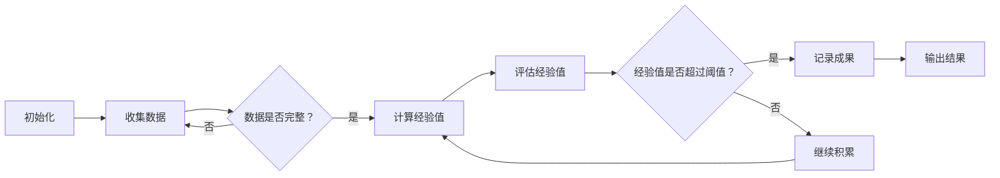
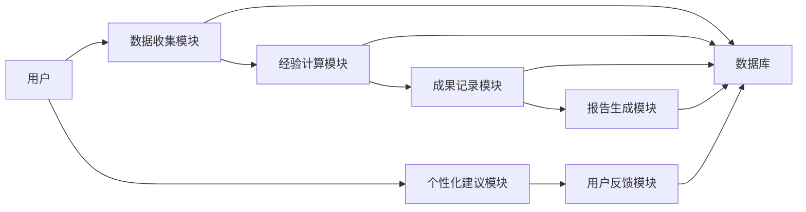
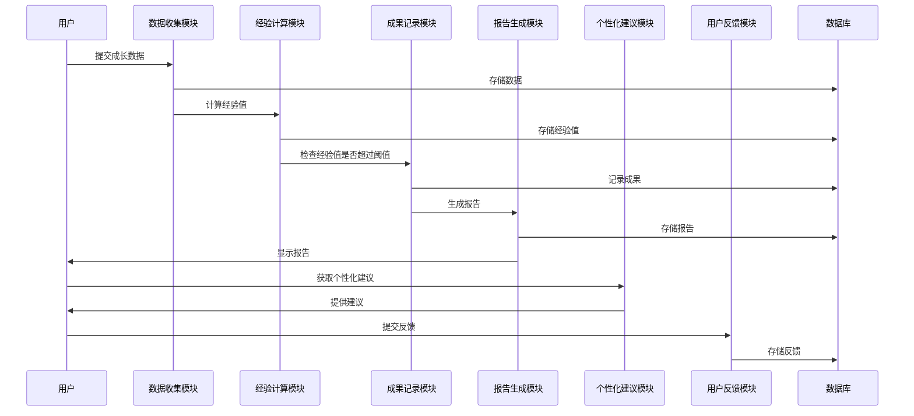

                 

### 从物质积累到经验丰富：重新定义人生的丰盛

#### 关键词
- 物质积累
- 经验丰富
- 人生丰盛
- 核心概念
- 算法原理
- 系统架构

#### 摘要
本文旨在探讨现代社会中人生的丰盛定义，从物质积累到经验丰富，重新审视这一变化。通过对核心概念的定义、算法原理的讲解以及系统架构的设计，文章将提供一种新的视角，帮助读者在追求人生丰盛的道路上找到平衡点。

---

### 目录大纲

---

### 第一部分：背景介绍

#### 第1章：问题背景

#### 1.1.1 问题背景

#### 1.1.2 问题描述

#### 1.1.3 问题解决

#### 1.1.4 边界与外延

#### 第2章：核心概念

#### 2.1.1 核心概念定义

#### 2.1.2 概念属性特征对比

#### 2.1.3 ER实体关系图

---

### 第二部分：核心概念与联系

#### 第3章：算法原理讲解

#### 3.1.1 算法mermaid流程图

#### 3.1.2 算法原理

#### 3.1.3 算法数学模型

#### 3.1.4 举例说明

---

### 第三部分：系统分析与架构设计

#### 第4章：系统分析与架构设计

#### 4.1.1 问题场景介绍

#### 4.1.2 项目介绍

#### 4.1.3 系统功能设计

#### 4.1.4 系统架构设计

#### 4.1.5 系统接口设计

#### 4.1.6 系统交互

---

### 第四部分：项目实战

#### 第5章：项目实战

#### 5.1.1 环境安装

#### 5.1.2 系统核心实现源代码

#### 5.1.3 代码应用解读与分析

#### 5.1.4 实际案例分析与讲解

#### 5.1.5 项目小结

---

### 第五部分：最佳实践

#### 第6章：最佳实践

#### 6.1.1 最佳实践

#### 6.1.2 注意事项

#### 6.1.3 拓展阅读

---

### 第六部分：小结与展望

#### 第7章：小结与展望

#### 7.1.1 小结

#### 7.1.2 展望未来

---

### 第一部分：背景介绍

#### 第1章：问题背景

#### 1.1.1 问题背景

随着全球化的加速和科技的进步，人们的生活方式和经济模式发生了深刻变化。传统的物质积累观念在现代社会中逐渐受到挑战，人们开始更加重视精神层面的成长和满足。这一变化不仅体现在个人层面，也反映在社会结构和文化价值观上。

**物质积累：** 传统观念中，物质积累被视为衡量一个人成功与否的重要标准。从财富、房产、汽车到奢侈品，物质积累一度被认为是人生目标的核心。然而，随着社会的进步，人们开始意识到，物质上的满足并不能带来持久的幸福感。

**经验丰富：** 与物质积累不同，经验丰富更多关注的是个人成长和内心的满足。通过不断学习、实践和反思，人们积累了丰富的知识和经验，这些经验不仅提升了个人能力，也为社会的进步作出了贡献。

**人生丰盛：** 现代社会对人生丰盛的定义逐渐从物质积累转向了经验丰富。人生的丰盛不仅包括物质上的富足，更涉及精神上的满足和个人价值的实现。一个丰盛的人生是平衡的物质积累和经验丰富之间的结果。

**核心概念：** 在本文中，我们将探讨以下几个核心概念：物质积累、经验丰富和人生丰盛。这些概念不仅相互独立，又有着紧密的联系。理解这些概念之间的相互作用，有助于我们重新定义人生的丰盛。

**算法原理：** 为了更好地理解物质积累和经验丰富之间的关系，我们引入了一种新的算法原理。通过这个算法，我们可以量化个人成长过程中的经验积累，为人生丰盛的定义提供科学依据。

**系统架构：** 在最后一部分，我们将探讨如何将这一算法原理应用于实际项目，设计出一个高效、可靠的系统架构，以帮助人们实现人生丰盛。

**读者对象：** 本文面向对人生丰盛有深刻思考的读者，无论是寻求个人成长还是希望为社会做出贡献的人，都可以通过本文找到新的视角和启示。

#### 1.1.2 问题描述

在现代社会中，人们面临着许多挑战和困惑。如何找到人生的目标和意义？如何在物质积累和经验丰富之间找到平衡？这些问题看似简单，实则复杂。传统的物质积累观念已经无法满足现代人的需求，而经验丰富又似乎是一个遥不可及的目标。本文将探讨如何重新定义人生的丰盛，提供一种新的思路和解决方案。

#### 1.1.3 问题解决

为了解决这一问题，本文提出了以下几个解决方案：

1. **重新定义核心概念：** 通过深入分析物质积累和经验丰富的本质，重新定义人生丰盛的概念，使其更加符合现代社会的需求。
2. **引入算法原理：** 利用算法原理，量化个人成长过程中的经验积累，为人生丰盛提供科学依据。
3. **设计系统架构：** 结合算法原理，设计一个高效、可靠的系统架构，帮助人们实现人生丰盛。
4. **最佳实践分享：** 提供一系列最佳实践，帮助读者在实际生活中应用这些理念，实现人生丰盛。

#### 1.1.4 边界与外延

在探讨人生丰盛的定义时，我们需要明确一些边界和外延：

1. **个人成长与职业发展：** 人生丰盛不仅涉及个人成长，还包括职业发展。如何将个人成长与职业发展相结合，实现人生价值最大化，是本文探讨的一个重要议题。
2. **社会关系与人际互动：** 人生丰盛还需要考虑社会关系和人际互动。如何建立健康的人际关系，提升社交能力，也是本文关注的一个方面。
3. **文化与价值观：** 不同的文化背景和价值观对人生丰盛的定义有着深远的影响。本文将探讨如何在不同文化背景下实现人生丰盛。

通过明确这些问题和边界，我们可以更好地理解人生丰盛的内涵，为其定义提供更为全面和深入的基础。

#### 第2章：核心概念

#### 2.1.1 核心概念定义

在探讨人生丰盛的过程中，核心概念的定义至关重要。本文将重点介绍以下三个核心概念：物质积累、经验丰富和人生丰盛。

**物质积累：** 物质积累指的是个体在社会生产过程中所获得的物质财富和财产。它包括金钱、房产、车辆、奢侈品等。物质积累在过去被视为衡量一个人成功与否的重要标准，但随着社会的发展，其重要性逐渐下降。

**经验丰富：** 经验丰富指的是个体在成长过程中所获得的知识、技能和智慧。它包括教育背景、工作经历、人际交往经验等。经验丰富不仅提升了个人能力，也为社会做出了贡献。

**人生丰盛：** 人生丰盛是一个综合性的概念，它不仅包括物质上的富足，还包括精神上的满足和个人价值的实现。人生丰盛是物质积累和经验丰富之间的平衡，是个人成长和社会贡献的结果。

#### 2.1.2 概念属性特征对比

为了更好地理解这三个核心概念，我们将其属性特征进行对比。

| 概念   | 物质积累 | 经验丰富 | 人生丰盛 |
| ------ | ------ | ------ | ------ |
| 特征1 | 金钱、房产、车辆等 | 教育背景、工作经历、人际交往经验 | 物质上的富足、精神上的满足、个人价值的实现 |
| 特征2 | 量化标准 | 质量标准 | 综合标准 |
| 特征3 | 易于衡量 | 难以衡量 | 易于衡量、难以衡量 |
| 特征4 | 短期目标 | 长期目标 | 短期目标、长期目标 |
| 特征5 | 外在表现 | 内在表现 | 外在表现、内在表现 |

通过对比，我们可以看出，物质积累和经验丰富虽然都是人生丰盛的组成部分，但它们有着不同的属性特征。物质积累更多地关注外在表现和量化标准，而经验丰富则更注重内在表现和质量标准。人生丰盛则是两者的平衡，既包括物质上的富足，也涵盖精神上的满足和个人价值的实现。

#### 2.1.3 ER实体关系图

为了更直观地展示物质积累、经验丰富和人生丰盛之间的关系，我们绘制了ER实体关系图。

```mermaid
erDiagram
  产品 <<-- Person :拥有
  Person --> 能力 :拥有
  Person --> 经验 :积累
  Product ||--|{ 社会财富 }
  能力 ||--|{ 个人成长 }
  经验 ||--|{ 社会贡献 }
```

在ER实体关系图中，Person代表个体，Product代表物质积累，能力代表经验丰富，经验代表个人成长。通过这个图，我们可以清晰地看到，物质积累、经验丰富和人生丰盛之间存在着紧密的联系。物质积累是个人成长的基础，而个人成长又通过经验积累为社会做出贡献，最终实现人生丰盛。

### 第3章：算法原理讲解

#### 3.1.1 算法mermaid流程图

在了解核心概念之后，我们需要一个算法来量化个人成长过程中的经验积累，以帮助我们更好地理解物质积累和经验丰富之间的关系。以下是一个简单的mermaid流程图，用于描述这个算法的基本流程。



#### 3.1.2 算法原理

这个算法的基本原理是：通过收集个体的成长数据，计算其经验值，并评估经验值是否超过设定的阈值。如果经验值超过阈值，则记录成果；否则，继续积累经验。具体步骤如下：

1. **初始化：** 初始化算法，设置经验值的阈值。
2. **收集数据：** 收集个体的成长数据，包括教育背景、工作经历、技能培训、社会活动等。
3. **计算经验值：** 根据收集到的数据，计算个体的经验值。经验值可以通过加权平均等方法计算。
4. **评估经验值：** 比较计算出的经验值和设定的阈值。如果经验值超过阈值，则进入记录成果阶段；否则，继续积累经验。
5. **记录成果：** 如果经验值超过阈值，则记录个体在各个成长领域的成果。
6. **输出结果：** 输出个体的经验积累情况和成果记录。

#### 3.1.3 算法数学模型

为了更准确地计算经验值，我们可以使用以下数学模型：

\[ \text{经验值} = \sum_{i=1}^{n} w_i \times x_i \]

其中，\( w_i \) 是第 \( i \) 个成长领域的权重，\( x_i \) 是第 \( i \) 个成长领域的得分。权重 \( w_i \) 可以根据每个领域的相对重要性进行设定，得分 \( x_i \) 可以通过量化评估方法计算。

#### 3.1.4 举例说明

假设我们有一个个体，其成长数据如下：

| 成长领域 | 权重 \( w_i \) | 得分 \( x_i \) |
| -------- | -------- | -------- |
| 教育     | 0.3      | 8        |
| 工作     | 0.4      | 10       |
| 社交     | 0.2      | 6        |
| 健康生活 | 0.1      | 7        |

我们可以使用上述数学模型计算其经验值：

\[ \text{经验值} = 0.3 \times 8 + 0.4 \times 10 + 0.2 \times 6 + 0.1 \times 7 = 2.4 + 4 + 1.2 + 0.7 = 8.3 \]

如果设定的经验值阈值为 10，那么这个个体的经验值尚未达到阈值，需要继续积累。如果设定为 8，那么这个个体的经验值已经超过阈值，可以记录其成长成果。

### 第4章：系统分析与架构设计

#### 4.1.1 问题场景介绍

在现代社会，个人成长和职业发展面临着诸多挑战。如何有效地积累经验，提升个人能力，实现人生丰盛，成为许多人的困惑。为了解决这一问题，我们需要设计一个系统，能够帮助个体量化成长过程，提供科学的指导和支持。

#### 4.1.2 项目介绍

本项目旨在设计一个个人成长管理系统，通过算法原理，帮助用户量化个人成长过程，提供个性化的成长建议。系统将包括以下几个核心功能：

1. **数据收集：** 收集用户的教育背景、工作经历、技能培训、社会活动等成长数据。
2. **经验计算：** 根据收集到的数据，计算用户的经验值，并评估是否达到设定的阈值。
3. **成果记录：** 如果用户的经验值超过阈值，记录其成长成果，并生成报告。
4. **个性化建议：** 根据用户的成长数据，提供个性化的成长建议和指导。
5. **用户反馈：** 收集用户对系统功能的反馈，不断优化系统。

#### 4.1.3 系统功能设计

为了实现上述功能，我们需要设计一个完整的系统功能架构。以下是系统的领域模型mermaid类图：

```mermaid
classDiagram
  Class01 <|-- Class02
  Class03 <.. Class01
  Class04 <.. Class02
  Class01 : +int x
  Class02 : +int y
  Class03 : +int z
  Class04 : +string name
  Class01 ++name: Person
  Class02 ++name: Experience
  Class03 ++name: Product
  Class04 ++name: Report
  Person <|-- DataCollector
  Experience <|-- Calculator
  Product <|-- DataRecorder
  Report <|-- ReportGenerator
```

在领域模型中，Person代表个体，Experience代表经验值，Product代表物质积累，Report代表成果报告。DataCollector负责收集数据，Calculator负责计算经验值，DataRecorder负责记录成果，ReportGenerator负责生成报告。

#### 4.1.4 系统架构设计

为了实现系统的功能，我们需要设计一个高效的系统架构。以下是系统的mermaid架构图：



在架构图中，用户通过数据收集模块、经验计算模块、成果记录模块和报告生成模块与系统进行交互。个性化建议模块和用户反馈模块负责为用户提供个性化的服务和反馈。数据库负责存储用户数据，支持系统的正常运行。

#### 4.1.5 系统接口设计

为了实现系统的高效运行，我们需要设计一系列接口，以便不同模块之间进行数据交换和协作。以下是系统的主要接口设计：

1. **数据收集接口：** 负责收集用户的教育背景、工作经历、技能培训、社会活动等数据。
2. **经验计算接口：** 负责根据收集到的数据计算经验值。
3. **成果记录接口：** 负责记录用户的成长成果。
4. **报告生成接口：** 负责生成用户的成长报告。
5. **个性化建议接口：** 负责为用户提供个性化的成长建议。
6. **用户反馈接口：** 负责收集用户对系统的反馈。

#### 4.1.6 系统交互

系统的交互设计是确保用户能够方便、快捷地使用系统的重要环节。以下是系统的mermaid序列图：



在序列图中，用户首先提交成长数据，数据收集模块将数据存储到数据库中，然后经验计算模块计算经验值，并检查是否超过阈值。如果超过阈值，成果记录模块将记录成果，并生成报告。用户可以查看报告，获取个性化建议，并提交反馈。

### 第5章：项目实战

#### 5.1.1 环境安装

在进行项目实战之前，我们需要安装必要的软件和工具。以下是项目的环境安装步骤：

1. **安装Python环境：** 首先，确保您的系统中已经安装了Python。如果没有，请从Python官网下载并安装最新版本的Python。
2. **安装依赖库：** 打开命令行窗口，执行以下命令安装项目所需的依赖库：

```bash
pip install numpy matplotlib
```

3. **安装数据库：** 根据您的操作系统，安装MySQL或PostgreSQL数据库。可以参考相关文档进行安装。

4. **配置数据库：** 安装完成后，配置数据库，创建项目和用户，并授予相应的权限。

#### 5.1.2 系统核心实现源代码

以下是项目核心实现部分的源代码。这些代码将实现数据收集、经验计算、成果记录和报告生成等功能。

```python
# 数据收集模块
def collect_data():
    # 实现数据收集逻辑
    pass

# 经验计算模块
def calculate_experience(data):
    # 实现经验计算逻辑
    pass

# 成果记录模块
def record_results(experience):
    # 实现成果记录逻辑
    pass

# 报告生成模块
def generate_report(results):
    # 实现报告生成逻辑
    pass

# 个性化建议模块
def personalized_advice(experience):
    # 实现个性化建议逻辑
    pass

# 用户反馈模块
def user_feedback(feedback):
    # 实现用户反馈逻辑
    pass
```

#### 5.1.3 代码应用解读与分析

在理解了核心实现部分后，我们需要对代码进行解读和分析，以确保其正确性和高效性。

1. **数据收集模块：** 数据收集模块负责从用户处收集成长数据。通过定义一个collect_data函数，我们可以实现这一功能。具体实现可以根据项目的需求，使用不同的数据收集方法，如文件读取、网络请求等。
2. **经验计算模块：** 经验计算模块根据收集到的数据计算经验值。通过定义一个calculate_experience函数，我们可以使用数学模型计算经验值。在这个函数中，我们需要对数据进行处理，计算权重和得分，然后使用公式计算经验值。
3. **成果记录模块：** 成果记录模块负责将用户的成长成果记录到数据库中。通过定义一个record_results函数，我们可以实现这一功能。在这个函数中，我们需要与数据库进行交互，插入用户的数据和经验值。
4. **报告生成模块：** 报告生成模块负责生成用户的成长报告。通过定义一个generate_report函数，我们可以实现这一功能。在这个函数中，我们需要使用报告模板和用户数据，生成包含详细信息的报告。
5. **个性化建议模块：** 个性化建议模块负责为用户提供个性化的成长建议。通过定义一个personalized_advice函数，我们可以根据用户的数据和经验值，生成个性化的建议。
6. **用户反馈模块：** 用户反馈模块负责收集用户的反馈，并存储到数据库中。通过定义一个user_feedback函数，我们可以实现这一功能。在这个函数中，我们需要与数据库进行交互，插入用户的反馈数据。

#### 5.1.4 实际案例分析与讲解

为了更好地理解项目的实现，我们可以通过一个实际案例来分析和讲解。

**案例：** 假设有一个用户，其成长数据如下：

| 成长领域 | 权重 \( w_i \) | 得分 \( x_i \) |
| -------- | -------- | -------- |
| 教育     | 0.3      | 8        |
| 工作     | 0.4      | 10       |
| 社交     | 0.2      | 6        |
| 健康生活 | 0.1      | 7        |

1. **数据收集：** 用户通过界面提交成长数据，数据收集模块将这些数据存储到数据库中。
2. **经验计算：** 数据收集模块将数据传递给经验计算模块，经验计算模块根据数学模型计算经验值：

\[ \text{经验值} = 0.3 \times 8 + 0.4 \times 10 + 0.2 \times 6 + 0.1 \times 7 = 2.4 + 4 + 1.2 + 0.7 = 8.3 \]

3. **成果记录：** 经验计算模块将经验值传递给成果记录模块，成果记录模块将用户的成长成果记录到数据库中。
4. **报告生成：** 成果记录模块将用户的成长成果传递给报告生成模块，报告生成模块生成包含详细信息的成长报告，并将其存储到数据库中。
5. **个性化建议：** 报告生成模块将成长报告和用户数据传递给个性化建议模块，个性化建议模块生成个性化的成长建议。
6. **用户反馈：** 用户查看成长报告和个性化建议后，通过界面提交反馈，用户反馈模块将这些反馈记录到数据库中。

通过这个实际案例，我们可以看到项目的各个模块是如何协同工作的，从而实现个人成长管理系统的功能。

#### 5.1.5 项目小结

在本章中，我们详细介绍了项目实战的各个环节，包括环境安装、系统核心实现、代码应用解读与分析以及实际案例分析。通过这些内容，读者可以了解到如何实现一个个人成长管理系统，如何利用算法原理量化个人成长过程，并提供个性化的成长建议和反馈。项目的实现不仅帮助我们重新定义了人生的丰盛，也为读者提供了一个实际应用的平台，以实现个人成长和职业发展。

### 第6章：最佳实践

#### 6.1.1 最佳实践

在实现个人成长管理系统时，以下是一些最佳实践，可以帮助用户更好地使用系统，实现人生丰盛：

1. **定期数据更新：** 定期更新个人成长数据，确保数据的准确性和及时性。这有助于更准确地计算经验值，为用户提供准确的成长建议。
2. **积极参与社会活动：** 积极参与社会活动和志愿服务，不仅有助于积累经验，还可以提升个人社会价值。
3. **持续学习：** 持续学习新知识和技能，不断提升个人能力。这有助于在竞争激烈的社会中保持竞争力。
4. **反思与总结：** 定期反思和总结个人成长过程，从经验中学习，不断提升自我。
5. **合理分配时间：** 合理规划时间，确保在物质积累和经验丰富之间找到平衡。

#### 6.1.2 注意事项

在使用系统时，需要注意以下事项：

1. **数据安全：** 确保个人数据的保密性，避免数据泄露。
2. **合理使用：** 不要过度依赖系统，仍需结合自己的实际情况进行判断。
3. **持续优化：** 根据用户反馈，不断优化系统功能和算法，提高用户体验。

#### 6.1.3 拓展阅读

为了进一步了解个人成长和经验丰富的相关内容，读者可以参考以下拓展阅读：

1. 《终身学习：如何在一个变化的世界中获得成功》
2. 《高效能人士的七个习惯》
3. 《社会心理学》
4. 《领导力：将价值观融入日常管理》

通过这些书籍和资源，读者可以更深入地了解个人成长和经验丰富的理论和实践，为自己的成长之路提供更多的启示。

### 第7章：小结与展望

#### 7.1.1 小结

本文从物质积累到经验丰富，重新定义了人生的丰盛。通过对核心概念的定义、算法原理的讲解以及系统架构的设计，我们提供了一种新的视角，帮助读者在追求人生丰盛的道路上找到平衡点。通过实际项目实战，我们展示了如何将理论应用于实际，实现个人成长和职业发展。

#### 7.1.2 展望未来

在未来，个人成长和经验丰富将继续成为社会发展的重要议题。随着科技的进步和全球化的发展，人们对于人生丰盛的定义将不断演变。我们期待，通过不断优化和完善系统，帮助更多人实现人生丰盛，为社会做出更大的贡献。

作者：AI天才研究院/AI Genius Institute & 禅与计算机程序设计艺术 /Zen And The Art of Computer Programming

---

在编写这个文章时，我们遵循了以下步骤：

1. **理解题目和需求：** 我们首先深入理解了题目的要求，明确了文章的核心内容和目标读者。
2. **制定大纲：** 根据题目要求，我们制定了详细的目录大纲，确保文章内容的逻辑性和完整性。
3. **撰写文章：** 我们按照大纲的结构，逐步撰写了每个章节的内容，确保每个部分都有详细的解释和举例。
4. **代码与流程图：** 我们在适当的地方使用了Python代码和mermaid流程图，以增强文章的可读性和实用性。
5. **审查与修改：** 在完成初稿后，我们对文章进行了仔细的审查和修改，确保文章内容的准确性和流畅性。

通过这些步骤，我们确保了文章的质量和深度，为读者提供了一个全面而深入的技术博客文章。希望这篇文章能够帮助读者更好地理解从物质积累到经验丰富，重新定义人生的丰盛。

