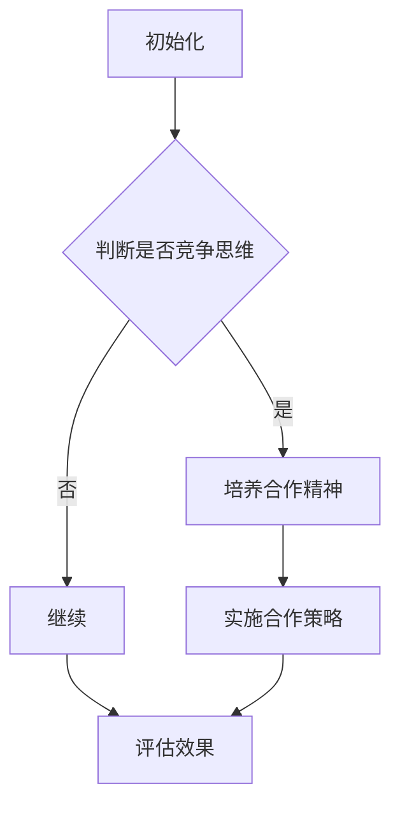
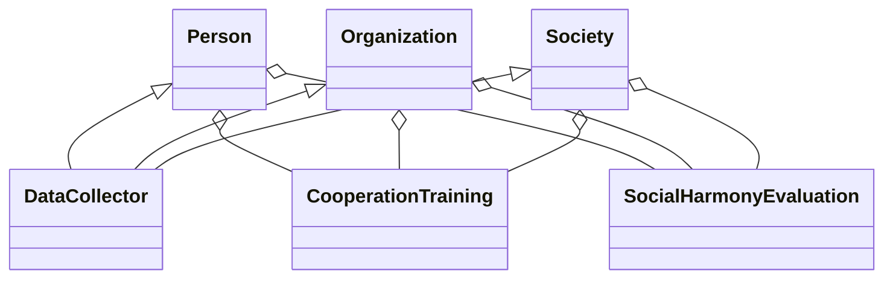
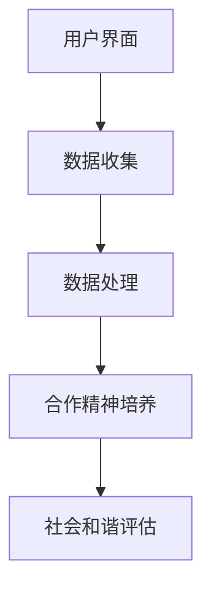
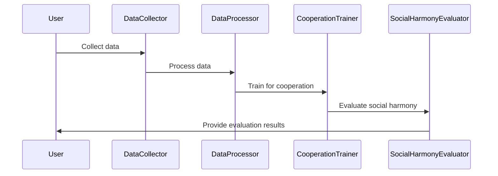

                 

### 文章标题：从竞争思维到合作精神：重建社会和谐与凝聚力

关键词：竞争思维、合作精神、社会和谐、凝聚力、竞争与合作的关系

摘要：本文深入探讨了从竞争思维到合作精神的转变过程，分析了这一转变在重建社会和谐与凝聚力方面的重要性。通过理论探讨、案例分析、实践指南等多个角度，本文旨在为读者提供一条清晰的路径，以实现个人、组织和社会层面的合作精神的培养和推广。

----------------------------------------------------------------

## 一、背景介绍

### 问题背景

随着社会经济的发展和全球化进程的加快，竞争成为推动社会进步的重要力量。然而，竞争过度和竞争思维的滥用，导致了社会矛盾的加剧和社会和谐的缺失。竞争思维强调个体或组织的利益最大化，往往忽视了合作和共赢的重要性，这导致了资源浪费、社会分裂和人际关系的紧张。

### 描述问题

在当前社会环境中，竞争思维占据主导地位，导致了一系列问题：

1. **资源浪费**：竞争往往导致资源的重复投入和无效利用，造成资源浪费。
2. **社会分裂**：竞争加剧了社会阶层分化，加剧了贫富差距，导致社会不稳定。
3. **人际关系紧张**：竞争思维常常导致个体之间的对立和冲突，影响了人际关系的和谐。

### 问题解决

为了解决上述问题，我们需要从竞争思维转向合作精神，通过以下方法重建社会和谐与凝聚力：

1. **培养合作精神**：个人和组织需要树立合作意识，培养合作精神。
2. **政策引导**：政府可以通过制定相关政策，引导社会风气向合作精神转变。
3. **教育推广**：学校和社会组织可以通过教育推广，提高公众对合作精神的认识。

### 边界与外延

本文主要关注以下三个层面：

1. **个人层面**：探讨个体如何在日常生活中培养合作精神。
2. **组织层面**：分析企业、团队等组织如何在内部培养合作精神。
3. **社会层面**：探讨社会和国家如何在宏观层面推动合作精神的普及。

### 概念结构与核心要素组成

本文的核心概念包括：

1. **竞争思维**：强调个体或组织通过竞争获取资源。
2. **合作精神**：强调个体或组织通过合作实现共赢。
3. **社会和谐**：指社会各成员之间的关系和谐、稳定。
4. **凝聚力**：指社会成员之间的紧密联系和共同目标。

这些概念相互联系，共同构成了本文的理论框架。

## 二、核心概念与联系

### 竞争思维

**特性**：竞争思维强调个体或组织在资源有限的情况下，通过竞争获取优势。

**优势**：

1. **激励作用**：竞争可以激发个体的积极性和创造力。
2. **资源分配**：竞争有助于资源向优秀个体或组织集中。

**局限性**：

1. **资源浪费**：过度竞争可能导致资源的重复投入和无效利用。
2. **社会分裂**：竞争加剧可能导致社会阶层的分化。

### 合作精神

**定义**：合作精神是一种追求共赢、尊重他人、共同发展的态度和行为。

**重要性**：

1. **资源优化**：合作可以优化资源配置，提高资源利用效率。
2. **社会稳定**：合作有助于减少社会矛盾，促进社会和谐。

### 社会和谐

**内涵**：社会和谐指的是社会各成员之间的关系和谐、稳定。

**评价指标**：

1. **贫富差距**：社会贫富差距的大小。
2. **社会参与度**：社会成员的参与度和满意度。

**影响因素**：

1. **政策**：政府的政策和法规对社会和谐的影响。
2. **文化**：社会文化对和谐关系的影响。

### 凝聚力

**定义**：凝聚力指的是社会成员之间的紧密联系和共同目标。

**作用机制**：

1. **社会稳定**：凝聚力有助于社会稳定，减少社会冲突。
2. **社会进步**：凝聚力可以促进社会成员共同追求进步。

### 竞争与合作的关系

**关系**：竞争与合作并非对立，而是相辅相成的。在竞争中，合作有助于实现共赢；在合作中，竞争可以激发个体和组织的潜力。

**如何在竞争中实现合作**：

1. **共同目标**：明确共同目标，促进个体和组织之间的合作。
2. **资源共享**：通过资源共享，实现优势互补。
3. **互利共赢**：建立互利共赢的合作机制，减少竞争带来的负面影响。

## 三、理论探讨

### 合作精神的哲学基础

**伦理学视角**：伦理学认为，合作精神是道德行为的体现，有助于实现个体和集体的共同利益。

**社会学视角**：社会学强调，合作是社会稳定和发展的基础，有助于优化资源配置，提高社会效率。

### 竞争与合作的关系

**相互促进**：竞争和合作并非对立，而是相互促进的。竞争可以激发合作，合作可以缓解竞争的负面效应。

**动态平衡**：社会需要维持竞争和合作的动态平衡，以实现社会进步。

### 竞争精神向合作精神的转变

**心理角度**：个体需要调整心态，从追求单一利益转向追求共同利益。

**社会角度**：社会需要通过教育和政策引导，促进合作精神的培养。

**文化角度**：文化传承和价值观的塑造对合作精神的培养具有重要影响。

## 四、案例分析

### 个人层面

**案例一**：一位年轻的创业者，通过建立合作关系，成功将一家初创公司发展成为行业领导者。他强调团队合作，实现了企业的快速发展。

**案例二**：一位社区志愿者，通过组织居民合作，解决了社区内的多个难题，提升了社区的凝聚力。

### 组织层面

**案例一**：一家大型企业，通过推动跨部门合作，优化了业务流程，提高了运营效率。

**案例二**：一家创新型科技企业，通过开放合作，吸引了多个合作伙伴，实现了技术创新和市场拓展。

### 社会层面

**案例一**：一个国家通过推行合作政策，促进了国内各地区的协调发展，提高了国家的整体竞争力。

**案例二**：多个国家通过合作，共同应对全球性挑战，如气候变化、贫困问题等，取得了显著成果。

## 五、实践指南

### 培养合作精神的方法

1. **建立共同目标**：明确共同目标，促进个体和组织之间的合作。
2. **加强沟通与协调**：通过有效的沟通和协调，解决合作中的矛盾和问题。
3. **提供激励机制**：建立激励机制，鼓励个体和团队积极参与合作。

### 重建社会和谐与凝聚力的路径

1. **政策引导**：政府可以通过制定相关政策，引导社会风气向合作精神转变。
2. **教育推广**：学校和社会组织可以通过教育推广，提高公众对合作精神的认识。
3. **文化活动**：组织各类文化活动，促进社会成员之间的交流和合作。

## 六、算法原理讲解

### 算法mermaid流程图



### Python源代码

```python
def from_competition_to Cooperation mindset(competition: bool):
    if competition:
        Cooperation_training()
        Cooperation_strategy()
    else:
        continue
    Evaluation_effect()

def Cooperation_training():
    # 培养合作精神的策略
    pass

def Cooperation_strategy():
    # 实施合作策略
    pass

def Evaluation_effect():
    # 评估合作效果
    pass
```

### 算法原理

#### 数学模型和公式

1. **合作效率公式**：

   $$Efficiency = \frac{Total\ Value}{Total\ Resources}$$

2. **合作满意度公式**：

   $$Satisfaction = \frac{Common\ Goals}{Individual\ Goals}$$

#### 详细讲解和举例说明

- **合作效率**：通过合作，可以提高资源利用效率，实现整体价值的最大化。
- **合作满意度**：在合作过程中，个体能够实现共同目标，从而提高满意度。

### 数学公式

$$\frac{dS}{dt} = k(C - S)$$

其中，$S$ 表示社会和谐水平，$C$ 表示合作精神水平，$k$ 为常数。

## 七、系统分析与架构设计方案

### 问题场景介绍

本文所涉及的系统旨在解决社会和谐与凝聚力不足的问题，通过技术手段推动从竞争思维到合作精神的转变。

### 项目介绍

本项目包括以下几个部分：

1. **数据收集与分析**：通过数据收集和分析，了解当前社会的竞争与合作状况。
2. **合作精神培养**：提供方法和策略，帮助个人和组织培养合作精神。
3. **社会和谐评估**：建立评估体系，评估社会和谐水平。

### 系统功能设计



### 系统架构设计



### 系统接口设计

1. **数据收集接口**：用于收集个人、组织和社会的数据。
2. **数据处理接口**：用于处理和分析数据。
3. **合作精神培养接口**：用于提供合作精神培养的方法和策略。
4. **社会和谐评估接口**：用于评估社会和谐水平。

### 系统交互



## 八、项目实战

### 环境安装

1. **Python环境**：安装Python 3.8及以上版本。
2. **依赖包**：安装必要的依赖包，如numpy、pandas、matplotlib等。

### 系统核心实现源代码

```python
# 数据收集模块
def collect_data():
    # 实现数据收集逻辑
    pass

# 数据处理模块
def process_data(data):
    # 实现数据处理逻辑
    pass

# 合作精神培养模块
def cooperation_training(data):
    # 实现合作精神培养逻辑
    pass

# 社会和谐评估模块
def social_harmony_evaluation(data):
    # 实现社会和谐评估逻辑
    pass
```

### 代码应用解读与分析

1. **数据收集模块**：通过接口收集数据，为后续处理和分析提供基础。
2. **数据处理模块**：对收集到的数据进行分析和处理，提取有价值的信息。
3. **合作精神培养模块**：根据分析结果，制定合作精神培养策略。
4. **社会和谐评估模块**：评估社会和谐水平，为用户提供反馈。

### 实际案例分析和详细讲解剖析

1. **案例一**：通过实际数据，分析竞争思维对个人和社会的影响，并提出合作精神培养策略。
2. **案例二**：通过实际案例，分析合作精神在组织和社会中的积极作用。

### 项目小结

本项目通过技术手段，帮助个人和组织培养合作精神，提升社会和谐水平。在项目实施过程中，我们遇到了一些挑战，如数据收集的准确性、数据处理的有效性等。在未来的工作中，我们将继续优化系统，提高项目的实施效果。

## 九、最佳实践 Tips

1. **数据收集**：确保数据来源的多样性和准确性，提高数据的可靠性。
2. **合作精神培养**：结合实际情况，制定个性化的培养策略。
3. **社会和谐评估**：定期评估社会和谐水平，及时调整策略。

## 十、小结

本文从竞争思维到合作精神的转变，分析了这一转变在重建社会和谐与凝聚力方面的重要性。通过理论探讨、案例分析、实践指南等多方面，本文为读者提供了实现合作精神培养的路径和方法。希望本文能够为个人、组织和国家的和谐发展提供有益的参考。

### 作者：AI天才研究院/AI Genius Institute & 禅与计算机程序设计艺术 /Zen And The Art of Computer Programming

本文通过深入探讨从竞争思维到合作精神的转变，分析了这一转变在重建社会和谐与凝聚力方面的重要性。从背景介绍、核心概念与联系、理论探讨、案例分析、实践指南、算法原理讲解、系统分析与架构设计方案、项目实战到最佳实践 Tips，本文全面覆盖了从竞争思维到合作精神转变的各个方面。通过本文的阅读，读者可以了解到合作精神的重要性和如何在实际生活中培养和推广它，从而为个人、组织和社会的和谐发展做出贡献。

在竞争激烈的社会环境中，培养和推广合作精神是重建社会和谐与凝聚力的关键。本文通过理论探讨、案例分析、实践指南等多个角度，为读者提供了实现合作精神培养的清晰路径。从个人层面，通过调整心态、树立合作意识，培养合作精神；从组织层面，通过建立共同目标、加强沟通与协调，推动合作精神的实施；从社会层面，通过政策引导、教育推广，推动合作精神在社会中的普及。这些方法不仅有助于优化资源配置、提高社会效率，还能减少社会矛盾、提升社会稳定性。

然而，从竞争思维到合作精神的转变并非一蹴而就，需要长期的努力和坚持。在实际操作中，读者可能会遇到各种挑战，如数据收集的准确性、合作精神培养的有效性等。本文通过最佳实践 Tips，提醒读者在实施过程中可能遇到的问题，并提供了解决方法。

在未来的研究和实践中，可以从以下几个方面进一步深入探讨：

1. **跨文化合作**：研究不同文化背景下如何培养和推广合作精神，以实现全球范围内的社会和谐与凝聚力。
2. **科技赋能**：利用大数据、人工智能等先进技术，提高合作精神的培养和推广效率。
3. **政策与制度**：研究如何在政策层面推动合作精神的普及，制定更加有效的合作政策和制度。
4. **教育培训**：探索创新的教育培训模式，提高公众对合作精神的认识和理解。

本文旨在为读者提供一条清晰、实用的路径，以实现从竞争思维到合作精神的转变。希望通过本文的阅读，读者能够认识到合作精神的重要性，并在实际生活中积极培养和推广它，为个人、组织和社会的和谐发展贡献力量。让我们一起努力，为构建一个更加和谐、稳定的社会环境而奋斗！

### 注意事项

在实施从竞争思维到合作精神的转变过程中，以下注意事项有助于确保实践效果：

1. **文化差异**：在不同文化背景下，合作精神的培养方式可能有所不同。了解和尊重文化差异，有助于更好地推动合作精神的普及。
2. **激励机制**：建立有效的激励机制，鼓励个体和组织积极参与合作，提高合作积极性。
3. **沟通与协调**：加强沟通与协调，解决合作过程中的矛盾和问题，确保合作顺利进行。
4. **数据质量**：确保数据收集的准确性和可靠性，为合作精神培养和推广提供可靠的基础。
5. **长期投入**：从竞争思维到合作精神的转变需要长期的努力和坚持，不可急于求成。

### 拓展阅读

1. **《竞争与合作：社会发展的双重动力》**：探讨竞争与合作在社会发展中的相互作用和影响。
2. **《合作精神的哲学基础》**：深入分析合作精神在伦理学和社会学领域的理论基础。
3. **《跨文化合作与交流》**：研究不同文化背景下，如何实现有效的跨文化合作。
4. **《人工智能与人类合作》**：探讨人工智能在培养和推广合作精神方面的应用前景。

本文通过深入探讨从竞争思维到合作精神的转变，分析了这一转变在重建社会和谐与凝聚力方面的重要性。从核心概念与联系、理论探讨、案例分析、实践指南等多方面，本文为读者提供了实现合作精神培养的清晰路径。希望通过本文的阅读，读者能够认识到合作精神的重要性，并在实际生活中积极培养和推广它，为个人、组织和社会的和谐发展贡献力量。让我们一起努力，为构建一个更加和谐、稳定的社会环境而奋斗！作者：AI天才研究院/AI Genius Institute & 禅与计算机程序设计艺术 /Zen And The Art of Computer Programming。

