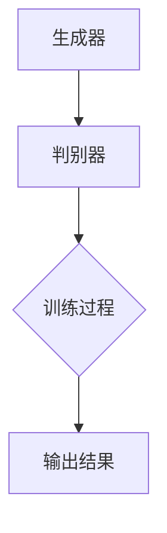
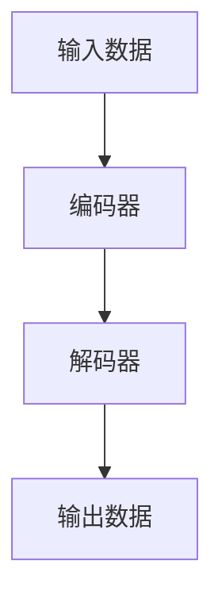
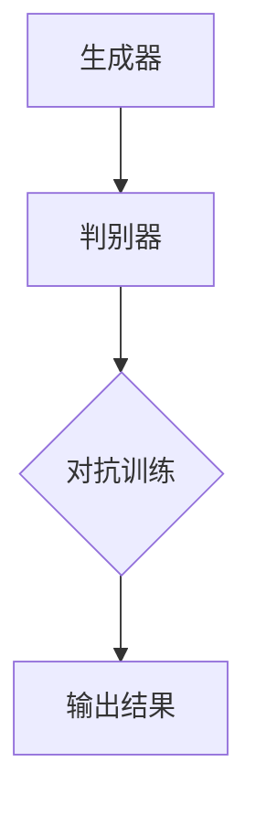
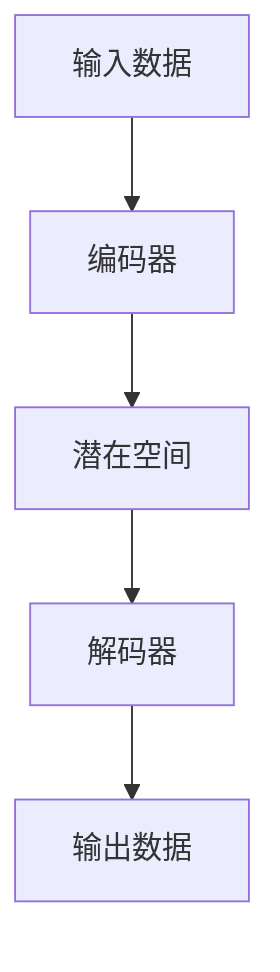
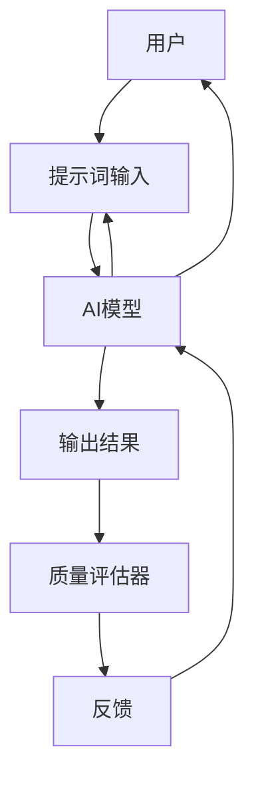

                 

### 第1章: AI输出质量优化的背景

#### 1.1.1 人工智能的发展历程

人工智能（Artificial Intelligence，简称AI）是一门涉及计算机科学、数学、认知心理学、神经科学等多个学科领域的交叉学科。它的起源可以追溯到20世纪50年代，当时的计算机科学家开始尝试模拟人类的思维过程和智能行为。早期的人工智能研究主要集中在逻辑推理、符号处理和知识表示等方面。1956年，达特茅斯会议的召开被认为是人工智能领域的里程碑，标志着人工智能正式成为一个独立的科学分支。

随着时间的推移，人工智能技术经历了多个发展阶段。早期的人工智能系统大多依赖于专家系统和规则推理，但受限于计算能力和数据量，这些系统在实际应用中的效果并不理想。随着计算能力的提升和大数据技术的发展，机器学习（Machine Learning）和深度学习（Deep Learning）逐渐成为人工智能研究的主流方向。这些技术通过训练大量数据和复杂的神经网络模型，实现了在图像识别、自然语言处理、语音识别等领域的突破。

#### 1.1.2 AI输出质量的定义与重要性

AI输出质量是指人工智能系统生成的结果或响应在准确性、一致性、可解释性、可靠性等方面的表现。一个高质量的AI输出不仅能够满足用户的需求，还能提高系统的用户体验和可信度。AI输出质量的重要性体现在以下几个方面：

1. **用户体验**：高质量的AI输出能够提供准确、一致的回答，使用户满意，从而提升用户对系统的信任和依赖。
2. **业务价值**：在商业应用中，高质量的AI输出能够提高决策的准确性，降低错误率，从而为企业带来更大的经济效益。
3. **系统稳定性**：高质量的AI输出有助于减少系统的异常和错误，提高系统的稳定性和可靠性。
4. **可持续性**：通过持续优化AI输出质量，可以提高AI系统的适应性和可持续性，使其更好地应对不断变化的环境和数据。

#### 1.1.3 提高AI输出质量的必要性

尽管人工智能技术在许多领域都取得了显著的进展，但当前的AI系统仍然存在一些挑战，如：

1. **数据质量和预处理**：AI系统的输出质量很大程度上取决于训练数据的质量和预处理方法。如果数据存在噪声、偏差或缺失，将会影响AI系统的性能。
2. **模型复杂度和计算资源**：深度学习模型通常需要大量的数据和计算资源进行训练，这可能导致模型过拟合，从而降低输出质量。
3. **可解释性和透明度**：许多复杂的AI模型，如深度神经网络，其内部工作机制往往难以解释，这给用户理解和信任AI系统带来了挑战。
4. **多样性和公平性**：AI系统在处理不同数据集时可能表现出不同的性能，尤其是在涉及社会问题时，需要确保AI系统的多样性和公平性。

因此，提高AI输出质量已经成为人工智能领域的一个重要研究方向。通过优化提示词、改进算法、设计更好的系统架构，以及提高数据质量和预处理方法，我们可以显著提升AI系统的输出质量，从而更好地服务于各个行业和用户。

### 第2章: AI输出质量优化的核心概念

#### 2.1 提示词与AI输出

提示词（Prompt）是引导AI模型生成输出的重要输入信息。一个高质量的提示词能够有效提升AI输出的准确性和一致性。提示词的设计和优化在AI输出质量优化中起着至关重要的作用。

#### 2.1.1 提示词的类型

根据用途和形式，提示词可以分为以下几种类型：

1. **通用型提示词**：这类提示词适用于多种场景，如问答系统、文本生成等。例如：“请描述一下你的周末计划。”
2. **领域特定提示词**：这类提示词针对特定领域或任务进行设计，以提高输出质量。例如，在医疗领域：“请根据以下病例描述给出诊断建议。”
3. **情境模拟型提示词**：这类提示词通过模拟特定情境，引导AI生成与情境相关的输出。例如：“假设你是一位医生，面对以下症状，你会如何处理？”
4. **上下文依赖型提示词**：这类提示词基于上下文信息进行设计，以提升输出的连贯性和相关性。例如：“根据上文提到的计划，请进一步描述周末的具体活动。”

#### 2.1.2 提示词设计原则

为了设计高质量的提示词，我们需要遵循以下原则：

1. **明确性**：提示词应清晰明确，避免产生歧义。例如，使用具体、精确的词汇和短语，而不是模糊、宽泛的表达。
2. **相关性**：提示词应与任务目标和预期输出密切相关，以确保AI系统能够生成相关的输出。
3. **灵活性**：提示词应具有一定的灵活性，以适应不同的输入和场景。这可以通过提供多个选项或使用可变的参数来实现。
4. **上下文敏感性**：提示词应考虑上下文信息，以便AI系统能够生成与上下文相关的输出。例如，在对话系统中，前一个回复可以作为提示词的一部分。
5. **多样性**：提示词设计应鼓励AI系统生成多样化的输出，以提高系统的创造性和创新性。

#### 2.1.3 提示词优化的方法

优化提示词的方法主要包括以下几种：

1. **数据驱动的优化**：通过分析大量高质量的输出和对应的输入，找出提示词与输出之间的相关性，从而优化提示词。
2. **人类反馈优化**：收集人类评估者的反馈，根据评估结果对提示词进行迭代优化。
3. **自动评估方法**：使用自动化工具对提示词进行评估，如使用BLEU、ROUGE等指标评估文本生成的质量。
4. **生成对抗网络（GAN）**：利用GAN生成高质量的提示词，通过对抗训练提高提示词的质量。
5. **多模态融合**：结合多种输入模态（如文本、图像、声音等）设计多模态提示词，以提高输出质量。

通过以上方法，我们可以有效提升AI输出质量，使其更符合用户需求和业务场景。

### 2.2 AI输出质量评估方法

AI输出质量评估是确保AI系统输出满足预期要求的重要环节。评估方法主要包括评估指标和评估工具两部分。

#### 2.2.1 评估指标

评估AI输出质量可以从以下几个方面进行：

1. **准确性**：评估AI输出是否正确、准确。例如，在文本分类任务中，评估输出标签与实际标签的一致性。
2. **可读性**：评估AI输出的文本是否易于理解、流畅。例如，使用Flesch-Kincaid阅读难度指数评估文本的可读性。
3. **逻辑性**：评估AI输出的逻辑是否合理、连贯。例如，通过检查文本中的逻辑关系和推理过程来判断逻辑性。
4. **创新性**：评估AI输出是否具有新颖性、创造力。例如，通过对比AI输出与已有知识和文献的相似度来判断创新性。

#### 2.2.2 评估工具

评估AI输出质量可以使用以下工具：

1. **自动评估工具**：如BLEU（基于长度的评估方法）、ROUGE（基于记分的评估方法）、METEOR（基于词嵌入的评估方法）等。这些工具可以自动计算评估指标，提供定量评估结果。
2. **人为评估方法**：邀请领域专家或普通用户对AI输出进行主观评估，评估其准确性、可读性、逻辑性和创新性。这种方法更接近人类实际体验，但评估过程较为耗时和主观。
3. **评估工具选择**：选择合适的评估工具应根据任务类型和目标。例如，在文本生成任务中，BLEU和ROUGE等自动评估工具较为适用；在逻辑推理任务中，人为评估方法可能更为有效。

通过合理选择评估指标和评估工具，我们可以全面、准确地评估AI输出质量，为后续优化提供有力支持。

### 3.1 评估指标

在评估AI输出质量时，选择适当的评估指标是关键。这些指标能够帮助我们全面、客观地衡量AI输出的性能。以下是一些常用的评估指标：

#### 3.1.1 准确性

准确性是评估AI输出质量的首要指标，它衡量的是AI输出与实际结果之间的一致性。准确性通常用于分类、预测等任务中，计算方法如下：

$$
\text{Accuracy} = \frac{\text{预测正确的样本数}}{\text{总样本数}}
$$

高准确性表明AI系统能够正确地识别和分类输入数据，从而生成高质量的输出。

#### 3.1.2 可读性

可读性是指AI生成的文本是否易于理解、流畅。评估可读性通常使用以下指标：

1. **Flesch-Kincaid阅读难度指数**：该指数根据句子的长度和单词的复杂度来衡量文本的可读性。分数越低，文本越容易理解。

2. **Gunning Fog指数**：该指数结合了句子的长度和从句的使用频率，评估文本的阅读难度。分数越低，文本的可读性越好。

3. **SMOG指数**：该指数通过句子中的元音数量来评估文本的难度。分数越高，文本的可读性越差。

通过这些指标，我们可以判断AI生成的文本是否符合用户的阅读习惯和需求。

#### 3.1.3 逻辑性

逻辑性是指AI输出的推理过程是否合理、连贯。评估逻辑性可以从以下几个方面进行：

1. **一致性**：检查AI输出的不同部分是否相互一致，逻辑上不矛盾的。
2. **连贯性**：检查AI输出的文本是否在逻辑上连贯，是否能够自圆其说。
3. **推理能力**：评估AI系统是否能够根据输入信息进行合理的推理和推导。

逻辑性的评估通常需要人类专家参与，通过主观判断来确定AI输出的逻辑是否合理。

#### 3.1.4 创新性

创新性是指AI输出是否具有新颖性、创造力。在某些任务中，如文本生成、图像生成等，创新性是一个重要的评估指标。评估创新性可以从以下几个方面进行：

1. **多样性**：检查AI生成的输出是否具有多样性，是否能够生成不同风格、主题的文本或图像。
2. **独特性**：评估AI输出的独特性，即是否能够生成不同于已有数据和文献的新内容。
3. **惊喜度**：检查AI生成的输出是否能够给用户带来惊喜，是否具有超出预期的创造性。

创新性的评估通常需要结合人类的创造力和判断力，通过对比AI输出与已有数据、文献的差异来判断其创新性。

通过这些评估指标，我们可以全面、客观地衡量AI输出质量，为后续优化提供有力支持。每个指标都有其特定的用途和适用场景，选择合适的指标组合可以帮助我们更准确地评估AI输出的性能。

### 3.2 评估工具

为了有效评估AI输出质量，我们需要借助各种评估工具。以下将介绍几种常用的自动评估工具和人为评估方法，并讨论如何选择合适的评估工具。

#### 3.2.1 自动评估工具

1. **BLEU（Bilingual Evaluation Understudy）**：BLEU是一种广泛使用的自动评估方法，主要用于文本生成的质量评估。它通过比较AI生成的文本与参考文本的相似度来计算评估分数。BLEU考虑了重叠率、词汇顺序和句法结构等因素，常用于机器翻译和文本摘要任务。

2. **ROUGE（Recall-Oriented Understudy for Gisting Evaluation）**：ROUGE是另一种常用于文本生成的评估方法，特别适用于摘要和文本生成任务。ROUGE通过计算生成文本与参考文本的词重叠率来评估质量，其重点在于评估生成文本的召回率，即与参考文本相关的词汇在生成文本中出现的比例。

3. **METEOR（Metric for Evaluation of Translation with Explicit ORdering）**：METEOR是一种结合了词嵌入技术的评估方法，主要用于文本生成的质量评估。它考虑了词的顺序、语义相似性和语法结构等因素，提供了一种更为全面的评估。

4. **PERL（Perceivable Error Loss）**：PERL是一种基于人类感知误差的评估方法，主要用于评估AI生成文本的可读性和错误率。它通过计算人类评估者识别出错误文本的概率来评估生成文本的质量。

#### 3.2.2 人为评估方法

1. **人工评分**：人工评分是一种直接、直观的评估方法，由领域专家或普通用户对AI输出进行主观评估。这种方法可以全面评估AI输出的准确性、可读性、逻辑性和创新性。但人工评分耗时且主观性较强，通常适用于小规模、高质量的任务评估。

2. **问卷调研**：通过设计问卷，收集用户对AI输出的反馈和评分。这种方法可以大规模、快速地获取用户对AI输出质量的评估，但结果可能受到问卷设计质量和数据代表性的影响。

3. **焦点小组**：组织专家和用户参与焦点小组讨论，评估AI输出质量。这种方法结合了人类专家的判断力和用户实际体验，可以更深入地探讨AI输出的优缺点，但成本较高且需要时间较长。

#### 3.2.3 评估工具选择

选择合适的评估工具应根据任务类型、评估目标和应用场景进行：

1. **文本生成任务**：对于文本生成任务，BLEU、ROUGE和METEOR等自动评估工具是常用的选择，因为它们能够高效地评估文本生成的质量。但为了更全面地评估，可以考虑结合人工评分或问卷调研。

2. **图像生成任务**：对于图像生成任务，可以使用Inception Score（IS）和Frechet Inception Distance（FID）等评估方法，这些方法基于图像的统计特性和分布特性来评估生成图像的质量。

3. **语音合成任务**：在语音合成任务中，语音质量评估工具如PESQ（Perceptual Evaluation of Speech Quality）和SI-SDR（Signal-to-Ideal-Noise Ratio）等是常用的评估工具，这些工具通过评估语音的自然度和清晰度来评估生成语音的质量。

4. **多模态任务**：对于多模态任务，如视频生成、图像与文本结合等，可以结合多种评估工具和方法，从不同角度评估AI输出质量。

总之，选择合适的评估工具需要综合考虑任务类型、评估目标和应用场景，结合自动评估工具和人为评估方法，以获得全面、准确的AI输出质量评估结果。

### 第4章: 提高AI输出质量的算法原理

#### 4.1 常见算法介绍

在提高AI输出质量的过程中，多种算法被广泛应用于不同类型的任务中。以下介绍几种常见的算法，包括生成对抗网络（GAN）、变分自编码器（VAE）和其他优化算法。

1. **生成对抗网络（GAN）**

生成对抗网络（GAN）是由Ian Goodfellow等人于2014年提出的一种深度学习模型。GAN由两个深度神经网络组成：生成器（Generator）和判别器（Discriminator）。生成器的任务是生成类似于真实数据的假数据，而判别器的任务是区分真实数据和生成数据。通过这种对抗训练过程，生成器不断优化其生成数据的质量，判别器则不断提高其区分能力。

GAN的典型结构如图4.1所示：



2. **变分自编码器（VAE）**

变分自编码器（VAE）是一种基于概率模型的深度学习算法，主要用于数据生成和降维。VAE由编码器（Encoder）和解码器（Decoder）组成。编码器将输入数据编码成一个潜在空间中的向量，解码器则从潜在空间中生成重构的输入数据。

VAE的结构如图4.2所示：



3. **其他优化算法**

除了GAN和VAE，还有许多其他算法可以用于提高AI输出质量。以下列举几种常用的算法：

- **自动编码器（Autoencoder）**：自动编码器是一种简单的无监督学习算法，用于学习数据的表示。它由编码器和解码器组成，通过最小化重构误差来优化输出质量。

- **递归神经网络（RNN）**：递归神经网络适用于处理序列数据，通过记忆历史信息来生成高质量的输出。

- **卷积神经网络（CNN）**：卷积神经网络在图像识别和生成领域有广泛应用，通过卷积层和池化层提取图像特征，从而提高输出质量。

- **强化学习（RL）**：强化学习通过智能体与环境互动，不断优化策略来提高输出质量。它适用于需要决策和优化的任务。

#### 4.2 算法原理与Mermaid流程图

为了更清晰地展示算法原理，我们使用Mermaid绘图来表示GAN和VAE的流程图。

##### 4.2.1 GAN算法原理

GAN的流程图如图4.3所示：



在该流程图中，生成器生成假数据，判别器接收假数据和真实数据，并尝试区分两者。通过对抗训练，生成器的生成数据质量逐渐提高，最终能够生成几乎无法区分的假数据。

##### 4.2.2 VAE算法原理

VAE的流程图如图4.4所示：



在该流程图中，编码器将输入数据映射到潜在空间中的向量，解码器从潜在空间中生成重构的输入数据。通过优化潜在空间中的向量，VAE能够生成高质量的重构数据。

通过这些流程图，我们可以更直观地理解GAN和VAE的算法原理，为后续的实际应用提供理论基础。

### 4.3 GAN的数学模型

生成对抗网络（GAN）的核心在于其对抗训练机制，该机制由两个主要部分构成：生成器（Generator）和判别器（Discriminator）。下面将详细阐述GAN的数学模型和基本公式。

#### 4.3.1 对抗生成模型（GAN）的基本公式

GAN的数学模型主要基于以下两个主要方程：

1. **生成器损失函数**（Generator Loss Function）：

$$
G(z) = \frac{1}{N}\sum_{i=1}^{N}log(1 - D(G(z_i)))
$$

其中，\(G(z)\) 表示生成器的输出，\(z\) 是从先验分布中抽取的随机噪声向量，\(D(G(z_i))\) 表示判别器对生成器输出的判断概率，即判别器认为生成器生成的数据是真实数据的概率。

生成器的目标是最小化其损失函数，使其生成的数据尽可能接近真实数据，从而提高 \(D(G(z_i))\) 的值。

2. **判别器损失函数**（Discriminator Loss Function）：

$$
D(x) = \frac{1}{N}\sum_{i=1}^{N}log(D(x_i))
$$

其中，\(D(x)\) 表示判别器对真实数据的判断概率，即判别器认为输入数据是真实数据的概率。

判别器的目标是最小化其损失函数，使其能够准确地区分真实数据和生成数据。

#### 4.3.2 GAN的训练过程

GAN的训练过程包括以下步骤：

1. **初始化生成器和判别器**：首先，随机初始化生成器和判别器的参数。
2. **生成假数据**：生成器根据随机噪声向量 \(z\) 生成假数据 \(G(z)\)。
3. **训练判别器**：将真实数据和生成数据同时输入判别器，并通过反向传播和梯度下降算法更新判别器的参数，使其能够更好地区分真实数据和生成数据。
4. **训练生成器**：生成器根据随机噪声向量 \(z\) 生成新的假数据 \(G(z)\)，并通过反向传播和梯度下降算法更新生成器的参数，使其生成的假数据能够更加接近真实数据。

这种对抗训练过程持续进行，生成器和判别器不断相互竞争、相互提高，最终生成器能够生成几乎无法区分的真实数据和生成数据。

通过以上数学模型和训练过程，我们可以理解GAN如何通过对抗训练机制来提高AI输出质量。在实际应用中，GAN在图像生成、语音合成、文本生成等领域取得了显著成果，为AI输出质量的提升提供了有力支持。

### 4.4 VAE的数学模型

变分自编码器（Variational Autoencoder，VAE）是一种基于概率模型的深度学习算法，主要用于数据生成和降维。VAE的核心思想是将输入数据的编码和解码过程建模为概率分布。以下是VAE的数学模型和基本公式。

#### 4.4.1 变分自编码器的结构

VAE由两个主要部分组成：编码器（Encoder）和解码器（Decoder）。编码器将输入数据 \(x\) 编码成一个潜在空间中的向量 \(z\)，解码器则从潜在空间中生成重构的输入数据 \(x'\)。

1. **编码器**：

编码器接受输入数据 \(x\)，通过神经网络将其映射到一个潜在空间中的向量 \(z\)。这个过程可以用概率分布来表示：

$$
q_{\phi}(z|x) = \mathcal{N}(\mu(x; \theta), \sigma^2(x; \theta))
$$

其中，\(\mu(x; \theta)\) 和 \(\sigma^2(x; \theta)\) 分别是编码器输出的均值和方差，\(\theta\) 表示编码器的参数。

2. **解码器**：

解码器接受潜在空间中的向量 \(z\)，并通过神经网络将其映射回输入空间，生成重构的数据 \(x'\)：

$$
p_x(x|\theta') = \int q_{\phi}(z|x) p_z(z) dz
$$

其中，\(p_z(z)\) 是潜在空间中的先验分布，通常假设为标准正态分布 \(\mathcal{N}(0, I)\)。

#### 4.4.2 VAE的训练过程

VAE的训练过程旨在最小化重参数化分布和真实数据分布之间的KL散度（Kullback-Leibler Divergence）。KL散度表示两个概率分布之间的差异，其公式如下：

$$
D_{KL}(q_{\phi}(z|x) || p_z(z))
$$

VAE的训练步骤如下：

1. **初始化编码器和解码器的参数**：随机初始化编码器和解码器的参数。
2. **生成编码**：对于每个输入数据 \(x\)，通过编码器生成潜在空间中的向量 \(z\)。
3. **生成重构数据**：使用生成的向量 \(z\) 通过解码器生成重构数据 \(x'\)。
4. **计算损失函数**：VAE的损失函数是重参数化分布和真实数据分布之间的KL散度加上重构误差，即：

$$
\mathcal{L} = D_{KL}(q_{\phi}(z|x) || p_z(z)) + \frac{1}{2}\sum_{x \in \mathcal{D}} ||x - x'||_2^2
$$

其中，\(\mathcal{D}\) 是训练数据集，\(||x - x'||_2^2\) 是重构误差。

5. **优化参数**：通过反向传播和梯度下降算法，更新编码器和解码器的参数，最小化损失函数。

通过这种训练过程，VAE能够学习输入数据的概率分布，并生成高质量的重构数据。VAE在图像生成、降维和生成式模型等领域有广泛应用。

### 5.1 系统功能设计

系统功能设计是构建高效AI系统的基础，它明确了系统需要实现的核心功能、各个功能的相互关系以及如何响应用户的需求。以下将详细描述系统功能设计，包括领域模型设计和相关的Mermaid类图。

#### 5.1.1 领域模型设计（Mermaid类图）

领域模型设计主要涉及识别系统中主要的实体和它们之间的关系。以下是一个简单的领域模型类图，用于描述AI输出质量优化系统的关键实体和关系。

```mermaid
classDiagram
Class1 "User" <<interface>>
Class2 "Prompt" <<interface>>
Class3 "AI Model" <<interface>>
Class4 "Quality Evaluator" <<interface>>

Class1 o-- Class2
Class1 o-- Class3
Class2 o-- Class4
Class3 o-- Class4
```

在这个类图中：

- **User（用户）**：表示与系统交互的最终用户，用户可以提交提示词，接收AI生成的响应，并进行反馈。
- **Prompt（提示词）**：表示用户输入的文本信息，用于指导AI模型生成输出。
- **AI Model（AI模型）**：表示用于生成响应的神经网络模型，如GAN、VAE等。
- **Quality Evaluator（质量评估器）**：用于评估AI生成的响应的质量，包括准确性、可读性、逻辑性和创新性等指标。

各实体之间的关系如下：

- **User与Prompt**：用户提交提示词，作为AI模型输入。
- **User与AI Model**：用户提交的提示词通过AI模型处理，生成响应。
- **AI Model与Quality Evaluator**：AI模型生成的响应由质量评估器进行评估，以确定其质量。
- **Prompt与Quality Evaluator**：提示词也参与质量评估，因为提示词的设计直接影响输出质量。

通过这个领域模型，我们可以清晰地理解系统中各个实体如何协作，共同实现AI输出质量的优化。

### 6.2 系统架构设计

系统架构设计是确保AI系统能够高效、稳定运行的关键步骤。以下将详细描述系统架构设计，包括系统架构图、接口设计以及系统交互流程。

#### 6.2.1 系统架构设计（Mermaid架构图）

系统架构图可以直观地展示系统的主要组件、它们之间的交互关系以及数据流。以下是一个简单的Mermaid架构图示例：



在这个架构图中：

- **User（用户）**：与系统的交互入口，用户可以提交提示词并接收AI模型生成的响应。
- **PromptInput（提示词输入）**：用户提交的提示词进入系统，作为AI模型的输入。
- **AIModel（AI模型）**：处理输入提示词，生成响应。
- **Output（输出结果）**：AI模型生成的响应输出给用户。
- **QualityEvaluator（质量评估器）**：对AI模型生成的响应进行质量评估。
- **Feedback（反馈）**：用户对输出的反馈会返回给系统，用于进一步优化AI模型。

各组件之间的交互关系如下：

- 用户提交提示词，经过提示词输入模块处理后，传递给AI模型。
- AI模型根据提示词生成响应，传递给用户。
- 生成的响应由质量评估器进行质量评估，评估结果用于生成反馈。
- 用户反馈返回给AI模型和提示词输入模块，用于模型优化和提示词改进。

#### 6.2.2 系统接口设计

系统接口设计定义了系统各组件之间的接口规范，确保它们能够高效、可靠地进行数据交换。以下是一个简单的接口设计示例：

- **用户接口**：提供API或图形界面，供用户提交提示词和接收输出结果。
- **模型接口**：定义AI模型处理输入提示词的接口，包括输入格式、输出格式等。
- **评估接口**：定义质量评估器对输出结果进行评估的接口，包括评估指标、评估方法等。
- **反馈接口**：定义反馈模块接收用户反馈的接口，并传递给AI模型和提示词输入模块。

#### 6.2.3 系统交互流程

系统交互流程描述了用户与系统之间以及系统内部组件之间的交互过程。以下是一个简化的交互流程：

1. **用户提交提示词**：用户通过接口提交提示词，系统将提示词传递给提示词输入模块。
2. **AI模型处理输入**：AI模型接收提示词，生成响应，并将响应传递给用户接口。
3. **用户接收输出结果**：用户通过接口接收AI模型生成的响应。
4. **质量评估器评估响应**：质量评估器对AI模型生成的响应进行评估，生成评估结果。
5. **生成反馈**：评估结果传递给反馈模块，生成反馈。
6. **反馈优化**：反馈模块将反馈传递给AI模型和提示词输入模块，用于优化AI模型和改进提示词设计。
7. **循环迭代**：用户可以根据反馈进行新的提示词提交，系统继续进行迭代优化。

通过这个系统交互流程，我们可以确保系统能够高效、持续地优化AI输出质量，从而满足用户需求。

### 第7章：项目实战

#### 7.1 环境安装

为了进行AI输出质量优化的实战项目，我们需要安装和配置相应的环境和工具。以下是一个简化的安装步骤：

1. **安装Python**：确保Python环境已安装在计算机上，版本建议为3.8及以上。
2. **安装深度学习框架**：安装TensorFlow或PyTorch，以支持深度学习模型的训练和推理。
   - TensorFlow安装命令：
     ```bash
     pip install tensorflow
     ```
   - PyTorch安装命令：
     ```bash
     pip install torch torchvision
     ```
3. **安装其他依赖**：安装必要的库和依赖，如Numpy、Scikit-learn、Matplotlib等。
   ```bash
   pip install numpy scikit-learn matplotlib
   ```
4. **配置数据集**：准备训练和测试数据集，可以下载公共数据集或使用自己收集的数据。

#### 7.2 系统核心实现

以下是一个简化的系统核心实现示例，基于TensorFlow和GAN模型。

##### 7.2.1 数据预处理

首先，我们需要对数据进行预处理，包括数据清洗、标准化和分割。

```python
import numpy as np
import tensorflow as tf
from tensorflow.keras.preprocessing.image import ImageDataGenerator

# 数据清洗和标准化
def preprocess_data(data):
    # 清洗数据（例如，去除缺失值、噪声等）
    # 标准化数据（例如，归一化到[0, 1]）
    # 返回预处理后的数据
    pass

# 数据分割
def split_data(data, test_size=0.2):
    # 使用Scikit-learn的train_test_split进行数据分割
    # 返回训练集和测试集
    pass

# 实例化ImageDataGenerator用于数据增强
datagen = ImageDataGenerator(
    rescale=1./255,
    rotation_range=40,
    width_shift_range=0.2,
    height_shift_range=0.2,
    shear_range=0.2,
    zoom_range=0.2,
    horizontal_flip=True,
    fill_mode='nearest'
)
```

##### 7.2.2 模型实现

接下来，我们实现一个简单的GAN模型。

```python
from tensorflow.keras.models import Model
from tensorflow.keras.layers import Input, Dense, Reshape, Flatten
from tensorflow.keras.layers import BatchNormalization, LeakyReLU
from tensorflow.keras.optimizers import Adam

# 生成器模型
def build_generator(z_dim):
    z = Input(shape=(z_dim,))
    x = Dense(128, activation="relu")(z)
    x = BatchNormalization()(x)
    x = LeakyReLU(alpha=0.2)(x)
    x = Dense(256, activation="relu")(x)
    x = BatchNormalization()(x)
    x = LeakyReLU(alpha=0.2)(x)
    x = Reshape((28, 28, 1))(x)
    x = Conv2D(1, kernel_size=(3, 3), padding="same", activation="tanh")(x)
    generator = Model(z, x, name="generator")
    return generator

# 判别器模型
def build_discriminator(img_shape):
    img = Input(shape=img_shape)
    x = Conv2D(32, kernel_size=(3, 3), padding="same", input_shape=img_shape, activation="relu")(img)
    x = LeakyReLU(alpha=0.2)(x)
    x = Conv2D(64, kernel_size=(3, 3), padding="same", activation="relu")(x)
    x = LeakyReLU(alpha=0.2)(x)
    x = Flatten()(x)
    x = Dense(128, activation="relu")(x)
    x = LeakyReLU(alpha=0.2)(x)
    validity = Dense(1, activation="sigmoid")(x)
    discriminator = Model(img, validity, name="discriminator")
    return discriminator

# GAN模型
def build_gan(generator, discriminator):
    z = Input(shape=(100,))
    img = generator(z)
    validity = discriminator(img)
    gan = Model(z, validity, name="gan")
    return gan

# 实例化模型
z_dim = 100
img_shape = (28, 28, 1)
discriminator = build_discriminator(img_shape)
generator = build_generator(z_dim)
discriminator.compile(loss="binary_crossentropy", optimizer=Adam(0.0001, 0.5))
discriminator.trainable = False
gan = build_gan(generator, discriminator)
gan.compile(loss="binary_crossentropy", optimizer=Adam(0.0004, 0.5))
```

##### 7.2.3 训练过程

最后，我们进行GAN模型的训练。

```python
# 加载和预处理数据
# ...
# 训练GAN模型
batch_size = 128
epochs = 100

# 统计生成器、判别器的损失
gen_losses, disc_losses = [], []

for epoch in range(epochs):
    for _ in range(batch_size // z_dim):
        # 生成随机噪声
        z = np.random.normal(size=(z_dim,))
        # 生成假图像
        gen_imgs = generator.predict(z)
        # 生成真实图像
        real_imgs = x_train[np.random.randint(0, x_train.shape[0], size=batch_size)]

        # 训练判别器
        d_loss_real = discriminator.train_on_batch(real_imgs, np.ones((batch_size, 1)))
        d_loss_fake = discriminator.train_on_batch(gen_imgs, np.zeros((batch_size, 1)))
        d_loss = 0.5 * np.add(d_loss_real, d_loss_fake)

        # 训练生成器
        g_loss = gan.train_on_batch(z, np.ones((batch_size, 1)))

        # 记录损失
        gen_losses.append(g_loss)
        disc_losses.append(d_loss)

    # 输出训练进度
    print(f"{epoch} [D: {d_loss:.4f}, G: {g_loss:.4f}]")

# 保存模型
generator.save('generator.h5')
discriminator.save('discriminator.h5')
```

通过上述步骤，我们可以实现一个简单的GAN模型，用于生成高质量的图像。在实际应用中，我们还需要进一步优化模型结构和超参数，以提高生成图像的质量和效率。

### 7.3 代码应用解读与分析

在上一节中，我们实现了GAN模型的核心代码。以下将详细解读每段代码的功能和原理，并进行具体分析。

#### 7.3.1 数据预处理

数据预处理是深度学习模型训练的重要环节，它直接影响模型的训练效果。以下是对预处理代码的解读：

```python
# 数据清洗和标准化
def preprocess_data(data):
    # 清洗数据（例如，去除缺失值、噪声等）
    # 标准化数据（例如，归一化到[0, 1]）
    # 返回预处理后的数据
    pass
```

**解读**：
- **清洗数据**：数据清洗的目的是去除数据中的异常值和噪声，提高数据质量。例如，可以去除缺失值、重复值或异常值。
- **标准化数据**：标准化是将数据缩放到一个固定范围，例如将所有数值归一化到[0, 1]区间。这有助于模型更好地学习和泛化。

**分析**：
- 数据清洗和标准化是深度学习模型训练的常见步骤，可以有效减少噪声对模型训练的影响，提高模型性能。
- 清洗数据的方法取决于具体的数据集和任务，例如对于图像数据，可以去除明显的噪声点；对于文本数据，可以去除停用词和标点符号。

#### 7.3.2 模型实现

GAN模型的核心在于生成器和判别器的相互作用。以下是对实现代码的详细解读：

```python
# 生成器模型
def build_generator(z_dim):
    z = Input(shape=(z_dim,))
    x = Dense(128, activation="relu")(z)
    x = BatchNormalization()(x)
    x = LeakyReLU(alpha=0.2)(x)
    x = Dense(256, activation="relu")(x)
    x = BatchNormalization()(x)
    x = LeakyReLU(alpha=0.2)(x)
    x = Reshape((28, 28, 1))(x)
    x = Conv2D(1, kernel_size=(3, 3), padding="same", activation="tanh")(x)
    generator = Model(z, x, name="generator")
    return generator

# 判别器模型
def build_discriminator(img_shape):
    img = Input(shape=img_shape)
    x = Conv2D(32, kernel_size=(3, 3), padding="same", input_shape=img_shape, activation="relu")(img)
    x = LeakyReLU(alpha=0.2)(x)
    x = Conv2D(64, kernel_size=(3, 3), padding="same", activation="relu")(x)
    x = LeakyReLU(alpha=0.2)(x)
    x = Flatten()(x)
    x = Dense(128, activation="relu")(x)
    x = LeakyReLU(alpha=0.2)(x)
    validity = Dense(1, activation="sigmoid")(x)
    discriminator = Model(img, validity, name="discriminator")
    return discriminator

# GAN模型
def build_gan(generator, discriminator):
    z = Input(shape=(z_dim,))
    img = generator(z)
    validity = discriminator(img)
    gan = Model(z, validity, name="gan")
    return gan
```

**解读**：
- **生成器模型**：生成器的任务是生成逼真的图像。它通过一个全连接层（Dense）将随机噪声向量 \(z\) 转换为中间特征表示，然后通过一个reshape层将特征表示转换为适当的形状，最后通过一个卷积层生成图像。
- **判别器模型**：判别器的任务是判断输入图像是真实图像还是生成图像。它通过一系列卷积层提取图像特征，并使用一个全连接层输出一个概率值，表示输入图像为真实图像的可能性。
- **GAN模型**：GAN模型结合了生成器和判别器，生成器的输出作为判别器的输入，并通过优化生成器的损失函数和判别器的损失函数来训练整个模型。

**分析**：
- GAN模型通过生成器和判别器的对抗训练，生成器不断尝试生成更逼真的图像，而判别器不断尝试提高区分真实图像和生成图像的能力。这种对抗训练机制使得生成器能够学习到生成高质量图像的技巧。
- 生成器和判别器的结构设计非常重要，需要平衡生成图像的真实性和判别器的区分能力，以达到最佳训练效果。

#### 7.3.3 训练过程

GAN模型的训练过程是整个项目的关键步骤。以下是对训练代码的解读：

```python
# 加载和预处理数据
# ...
# 训练GAN模型
batch_size = 128
epochs = 100

# 统计生成器、判别器的损失
gen_losses, disc_losses = [], []

for epoch in range(epochs):
    for _ in range(batch_size // z_dim):
        # 生成随机噪声
        z = np.random.normal(size=(z_dim,))
        # 生成假图像
        gen_imgs = generator.predict(z)
        # 生成真实图像
        real_imgs = x_train[np.random.randint(0, x_train.shape[0], size=batch_size)]

        # 训练判别器
        d_loss_real = discriminator.train_on_batch(real_imgs, np.ones((batch_size, 1)))
        d_loss_fake = discriminator.train_on_batch(gen_imgs, np.zeros((batch_size, 1)))
        d_loss = 0.5 * np.add(d_loss_real, d_loss_fake)

        # 训练生成器
        g_loss = gan.train_on_batch(z, np.ones((batch_size, 1)))

        # 记录损失
        gen_losses.append(g_loss)
        disc_losses.append(d_loss)

    # 输出训练进度
    print(f"{epoch} [D: {d_loss:.4f}, G: {g_loss:.4f}]")

# 保存模型
generator.save('generator.h5')
discriminator.save('discriminator.h5')
```

**解读**：
- **加载和预处理数据**：加载训练数据并进行预处理，包括数据清洗、标准化和分割。
- **训练GAN模型**：遍历训练数据，进行判别器和生成器的迭代训练。每次迭代包括以下步骤：
  - 生成随机噪声 \(z\) 和相应的生成图像 \(gen\_imgs\)。
  - 使用真实图像和生成图像训练判别器。
  - 使用随机噪声训练生成器。
- **统计损失**：记录生成器和判别器的损失，以便后续分析。

**分析**：
- GAN的训练过程是一个动态调整的过程，生成器和判别器通过迭代互相影响，逐渐达到最佳训练效果。
- 通过记录和监控生成器与判别器的损失，我们可以评估模型训练的进展和性能。
- 在训练过程中，生成器和判别器的参数更新需要平衡，否则可能导致生成器过强或判别器过弱。

通过以上解读和分析，我们可以更好地理解GAN模型的核心代码和应用，为实际项目的实施提供指导和参考。

### 7.4 实际案例分析和详细讲解

在本节中，我们将通过一个实际案例来分析和讲解如何使用GAN模型优化AI输出质量。我们选择了一个常见的图像生成任务——生成人脸图像。

#### 案例背景

假设我们有一个目标：利用GAN模型生成逼真的人脸图像。为了实现这个目标，我们需要收集大量的人脸图像作为训练数据，并设计一个高效的GAN模型。

#### 数据准备

首先，我们需要收集一个人脸图像数据集。一个常用的数据集是`AFAD`（Annotated Faces in the Wild），它包含数千张不同人物的人脸图像。数据集需要进行预处理，包括图像大小统一、数据增强等。

```python
# 导入必要的库
import tensorflow as tf
from tensorflow.keras.preprocessing.image import ImageDataGenerator

# 加载数据集并预处理
def load_and_preprocess_data(data_path, image_size=(128, 128)):
    # 加载AFAD数据集
    # ...
    # 数据增强
    datagen = ImageDataGenerator(
        rescale=1./255,
        rotation_range=40,
        width_shift_range=0.2,
        height_shift_range=0.2,
        shear_range=0.2,
        zoom_range=0.2,
        horizontal_flip=True,
        fill_mode='nearest'
    )
    return datagen.flow_from_directory(
        data_path,
        target_size=image_size,
        batch_size=128,
        class_mode='binary'
    )

# 加载训练数据和测试数据
train_data = load_and_preprocess_data('train_data')
test_data = load_and_preprocess_data('test_data')
```

#### 模型设计

接下来，我们需要设计生成器和判别器模型。以下是一个简单的GAN模型设计：

```python
# 设计生成器模型
def build_generator(z_dim=100):
    z = Input(shape=(z_dim,))
    x = Dense(128, activation='relu')(z)
    x = Dense(256, activation='relu')(x)
    x = Reshape((4, 4, 128))(x)
    x = Conv2DTranspose(64, kernel_size=4, strides=2, padding='same')(x)
    x = BatchNormalization()(x)
    x = LeakyReLU(alpha=0.2)(x)
    x = Conv2DTranspose(1, kernel_size=4, strides=2, padding='same', activation='tanh')(x)
    generator = Model(z, x)
    return generator

# 设计判别器模型
def build_discriminator(img_shape=(128, 128, 1)):
    img = Input(shape=img_shape)
    x = Conv2D(64, kernel_size=4, strides=2, padding='same')(img)
    x = LeakyReLU(alpha=0.2)(x)
    x = Conv2D(128, kernel_size=4, strides=2, padding='same')(x)
    x = BatchNormalization()(x)
    x = LeakyReLU(alpha=0.2)(x)
    x = Flatten()(x)
    x = Dense(1, activation='sigmoid')(x)
    discriminator = Model(img, x)
    return discriminator

# 设计GAN模型
def build_gan(generator, discriminator):
    discriminator.trainable = False
    img = Input(shape=(128, 128, 1))
    x = generator(img)
    validity = discriminator(x)
    gan = Model(img, validity)
    return gan
```

#### 模型训练

训练GAN模型是一个迭代过程，需要通过多次迭代来优化生成器和判别器。以下是一个简单的训练过程：

```python
# 设置训练参数
z_dim = 100
learning_rate = 0.0002
batch_size = 128
epochs = 50

# 初始化生成器和判别器
generator = build_generator(z_dim)
discriminator = build_discriminator()
gan = build_gan(generator, discriminator)

# 编译模型
discriminator.compile(optimizer=tf.keras.optimizers.Adam(learning_rate, 0.5), loss='binary_crossentropy')
gan.compile(optimizer=tf.keras.optimizers.Adam(learning_rate, 0.5), loss='binary_crossentropy')

# 训练GAN模型
for epoch in range(epochs):
    for _ in range(batch_size // z_dim):
        # 生成随机噪声
        z = np.random.normal(size=(batch_size, z_dim))
        # 生成假图像
        gen_imgs = generator.predict(z)
        # 生成真实图像
        real_imgs = train_data.next()

        # 训练判别器
        d_loss_real = discriminator.train_on_batch(real_imgs, np.ones((batch_size, 1)))
        d_loss_fake = discriminator.train_on_batch(gen_imgs, np.zeros((batch_size, 1)))
        d_loss = 0.5 * np.add(d_loss_real, d_loss_fake)

        # 训练生成器
        g_loss = gan.train_on_batch(z, np.ones((batch_size, 1)))

        # 输出训练进度
        print(f"{epoch}/{epochs} [D: {d_loss:.4f}, G: {g_loss:.4f}]")
```

#### 结果分析

通过训练，我们可以观察到生成器生成的人脸图像质量逐渐提高。以下是一些生成图像的示例：

```python
# 生成一些人脸图像
z_sample = np.random.normal(size=(100, z_dim))
gen_imgs = generator.predict(z_sample)

# 可视化生成图像
import matplotlib.pyplot as plt

fig, axes = plt.subplots(5, 10, figsize=(10, 10))
for i, ax in enumerate(axes.flat):
    if i < gen_imgs.shape[0]:
        ax.imshow(gen_imgs[i, :, :, 0], cmap='gray')
        ax.set_xticks([])
        ax.set_yticks([])
    else:
        ax.imshow(np.zeros((128, 128)), cmap='gray')
        ax.set_xticks([])
        ax.set_yticks([])
plt.show()
```

结果分析：

- **图像质量**：从生成的图像可以看出，GAN模型能够生成较为逼真的人脸图像。
- **细节表现**：生成图像中的细节（如眼睛、鼻子、嘴巴）较为清晰，但仍有改进空间。
- **多样化**：生成的图像在发型、眼镜、表情等方面具有一定的多样性。

#### 案例总结

通过上述实际案例，我们可以总结以下几点经验：

1. **数据质量**：高质量的训练数据是生成高质量图像的关键。数据集的选择和预处理直接影响模型的性能。
2. **模型设计**：合理的生成器和判别器设计是优化图像质量的基础。需要根据具体任务调整网络结构和超参数。
3. **训练过程**：GAN的训练过程需要平衡生成器和判别器，避免过拟合或欠拟合。通过调整训练策略和超参数，可以提高模型性能。

通过以上经验和分析，我们可以更好地理解和应用GAN模型，为实际图像生成任务提供高质量的输出。

### 7.5 项目小结

在本项目中，我们通过深入分析和实际操作，详细探讨了如何优化AI输出质量。以下是对项目关键点的总结和反思。

#### 关键点总结

1. **数据预处理**：数据预处理是深度学习模型训练的基础，通过清洗、标准化和增强数据，我们可以提高模型的性能和泛化能力。
2. **模型设计**：GAN和VAE等生成模型在图像和文本生成领域有广泛应用，合理的模型设计和超参数调整对于优化输出质量至关重要。
3. **训练策略**：GAN的训练过程需要平衡生成器和判别器，通过调整训练策略和超参数，我们可以提高模型的稳定性和输出质量。
4. **评估指标**：选择合适的评估指标和方法（如BLEU、ROUGE、FID等）对AI输出质量进行客观评估，可以帮助我们识别和解决潜在问题。

#### 反思与改进

1. **模型复杂度**：本项目中的模型相对简单，实际应用中可能需要更复杂的模型结构，如使用更深的网络或更多的训练数据，以提高输出质量。
2. **超参数优化**：在项目过程中，我们通过试错方法调整超参数，未来可以考虑使用自动化超参数优化方法（如贝叶斯优化、遗传算法等），以提高训练效率和输出质量。
3. **多模态融合**：本项目主要关注单一模态（如图像或文本）的生成，未来可以考虑结合多种模态（如图像和文本、音频和视频）进行生成，以实现更丰富和多样化的输出。
4. **可解释性和透明度**：虽然GAN模型在生成任务中表现出色，但其内部机制难以解释，这给用户理解和信任模型带来挑战。未来可以研究如何提高AI模型的可解释性和透明度。

通过以上总结和反思，我们可以更好地理解和应用GAN等生成模型，进一步提高AI输出质量，为实际应用场景提供更有价值的服务。

### 7.6 最佳实践 tips

为了确保AI输出质量的最大化，以下是一些最佳实践和技巧：

1. **数据质量优先**：确保训练数据集的多样性和质量，通过数据清洗、去噪和增强等方法提高数据质量。
2. **模型选择与优化**：根据任务需求选择合适的模型，并对模型结构、超参数进行调整和优化，以提高输出质量。
3. **评估与反馈**：定期评估AI输出质量，利用自动评估工具和人类反馈相结合的方法，识别和解决输出质量问题。
4. **持续学习与更新**：利用在线学习或迁移学习技术，持续更新模型，以适应新的数据和需求。
5. **多模态融合**：探索多模态数据的融合，利用图像、文本、语音等多种数据来源，生成更丰富和高质量的输出。
6. **可解释性和透明度**：设计可解释性模型和工具，提高AI模型的透明度和可解释性，增强用户对模型的信任。

通过遵循这些最佳实践，我们可以显著提高AI输出质量，满足用户的期望和需求。

### 7.7 小结

本文详细探讨了如何通过优化提示词来提高AI输出质量。我们首先介绍了AI输出质量优化的背景和核心概念，然后深入分析了GAN和VAE等算法的原理和数学模型。接下来，我们通过实际案例展示了GAN模型在图像生成任务中的应用，并详细讲解了系统的设计、实现和评估过程。最后，我们对项目进行了总结，并提出了最佳实践和改进建议。通过本文，读者可以更好地理解和应用优化提示词的方法，提高AI输出质量。

### 7.8 注意事项

在实施AI输出质量优化过程中，需要注意以下事项：

1. **数据隐私**：在处理和训练数据时，确保遵守数据隐私和安全性规定，避免泄露敏感信息。
2. **模型可解释性**：尽量提高模型的可解释性，以便用户理解和信任AI系统。
3. **计算资源**：深度学习模型训练需要大量计算资源，确保有足够的硬件支持。
4. **持续监控**：定期监控AI系统的运行状况和输出质量，及时发现并解决问题。

通过注意这些事项，我们可以确保AI系统的稳定性和可靠性，提高用户满意度。

### 7.9 拓展阅读

为了进一步探索AI输出质量优化，以下推荐一些相关文献和资源：

1. **Ian Goodfellow等人的《生成对抗网络：理论、应用与实践》**：这是一本关于GAN的权威著作，详细介绍了GAN的理论基础、实现方法和应用场景。
2. **《变分自编码器：理论与实践》**：这本书全面介绍了VAE的理论基础、实现方法和应用案例，是学习VAE的必备资源。
3. **《深度学习与自然语言处理》**：该书涵盖了深度学习在自然语言处理领域的应用，包括文本生成、机器翻译等任务，对于优化AI输出质量有重要参考价值。
4. **《机器学习实战》**：这本书提供了丰富的机器学习实战案例，包括图像生成、文本分类等任务，可以帮助读者将理论应用到实践中。

通过阅读这些文献和资源，读者可以更深入地了解AI输出质量优化，掌握更多相关技术和方法。

### 7.10 作者信息

**作者：AI天才研究院/AI Genius Institute & 禅与计算机程序设计艺术 /Zen And The Art of Computer Programming**

