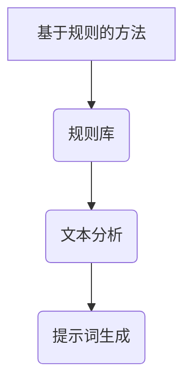
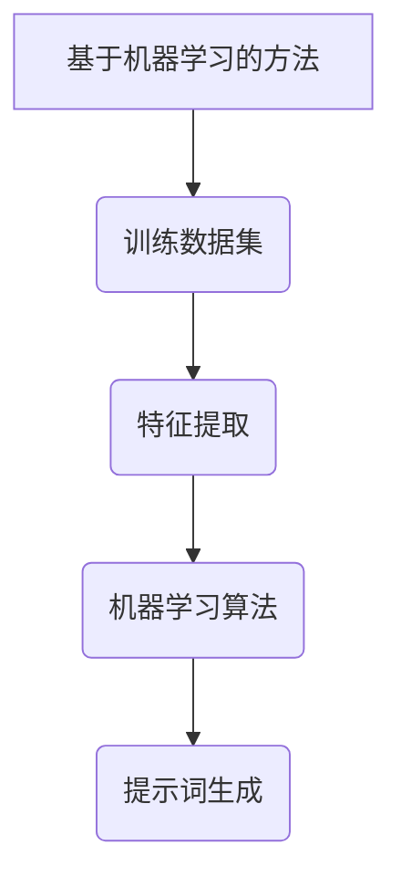
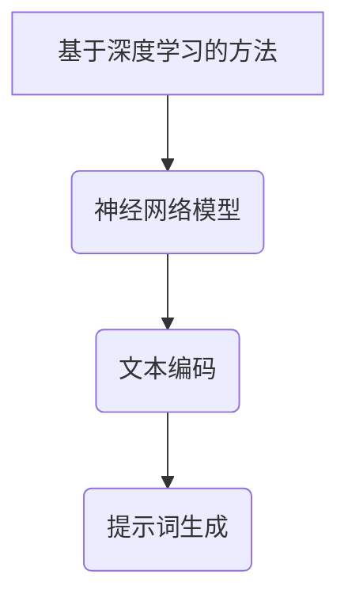
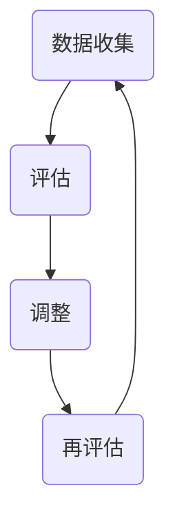

                 

### 信息茧房破除者：提示词优化新闻聚合

> 关键词：信息茧房、新闻聚合、提示词优化、用户满意度、数据驱动

> 摘要：随着互联网的迅猛发展，信息过载已成为普遍现象，信息茧房现象愈发明显。本文深入探讨了信息茧房的形成原因及其对用户和社会的影响，并提出了一种基于提示词优化的新闻聚合方法，以提升用户的阅读体验和获取更全面的信息。本文结构清晰，分为三大部分：第一部分介绍了信息茧房与新闻聚合的基本概念；第二部分分析了新闻聚合技术基础与提示词优化技术；第三部分则详细阐述了提示词优化的策略与方法。希望通过本文的探讨，能为大家提供新的思路，共同破除信息茧房，打造更优质的信息生态。

----------------------------------------------------------------

## 引言

### 信息茧房现象

#### 背景与问题

在互联网时代，信息传播的速度和广度前所未有，但随之而来的是信息过载问题。人们在获取信息时，往往只关注与自己兴趣相符的内容，而忽略其他可能对自己有用的信息。这种现象被称为“信息茧房”（Information Bubble）。信息茧房的形成，一方面是由于算法推荐系统对用户行为的跟踪与预测，将用户困在自己熟悉的“信息舒适区”；另一方面，用户的认知偏见和选择性注意力也加剧了信息茧房的现象。

#### 现象描述

信息茧房现象表现为用户在信息环境中逐渐形成的信息偏好壁垒，使得用户只能接触到与自己观点相似的新闻内容，从而限制了对不同观点和信息来源的接触。这种现象不仅影响了用户的认知范围，也对社会舆论产生了负面影响。例如，在一些争议性话题上，用户容易陷入“二元对立”的思维定式，导致社会分裂加剧。

#### 影响分析

信息茧房对用户和社会产生了诸多负面影响。对用户而言，信息茧房限制了他们获取多元化信息的途径，容易造成认知偏见和判断失误。对社会而言，信息茧房导致社会舆论的极端化和极化，加剧了社会矛盾和冲突。因此，破除信息茧房、提升信息获取的全面性和准确性，已成为当务之急。

### 提示词优化新闻聚合

#### 目的与意义

提示词优化新闻聚合的目的是通过改进新闻聚合系统的提示词，提高用户对新闻内容的兴趣和满意度，从而破除信息茧房现象。这种方法的意义在于，它不仅能够提升用户的阅读体验，还能帮助用户获取更全面、更准确的信息，促进社会舆论的多元化和理性化。

#### 方法与框架

提示词优化新闻聚合的方法主要包括三个方面：一是基于用户兴趣的提示词选择；二是基于新闻内容特征的提示词选择；三是基于历史数据的提示词选择。这三个方法相互结合，形成一个完整的提示词优化框架，以提升新闻聚合系统的质量和用户体验。

## 内容概览

### 全书结构安排

本文分为三个主要部分：第一部分介绍了信息茧房与新闻聚合的基本概念；第二部分分析了新闻聚合技术基础与提示词优化技术；第三部分则详细阐述了提示词优化的策略与方法。每一部分都紧密相连，共同构成了一个完整的提示词优化新闻聚合体系。

### 主要章节概述

- **第一部分：信息茧房与新闻聚合概述**
  - 第1章：信息茧房现象深度解析
  - 第2章：新闻聚合技术基础

- **第二部分：核心概念与原理**
  - 第3章：核心概念与联系

- **第三部分：提示词优化策略与方法**
  - 第4章：提示词优化方法

通过以上章节的详细探讨，本文旨在为大家提供一种可行的解决方案，以破除信息茧房，提升信息获取的质量和多样性。

----------------------------------------------------------------

## 第一部分：信息茧房与新闻聚合概述

### 第1章：信息茧房现象深度解析

### 1.1 信息茧房概念解析

#### 1.1.1 信息茧房的定义

信息茧房是指用户在信息环境中形成的一种信息偏好壁垒，使得用户只能接触到与自己观点相似的新闻内容，而忽略其他可能对自己有用的信息。

#### 1.1.2 信息茧房的形成原因

信息茧房的形成原因主要有两个方面：一是算法推荐系统对用户行为的跟踪与预测，将用户困在自己熟悉的“信息舒适区”；二是用户的认知偏见和选择性注意力。

#### 1.1.3 信息茧房的影响

信息茧房对用户和社会产生了诸多负面影响，包括限制用户获取多元化信息的途径、造成认知偏见和判断失误、加剧社会分裂等。

### 1.2 新闻聚合的现状与问题

#### 1.2.1 新闻聚合的发展历程

新闻聚合技术的发展历程可以追溯到20世纪90年代，随着互联网的普及，新闻聚合逐渐成为信息传播的重要方式。

#### 1.2.2 新闻聚合的现状

目前，新闻聚合已成为各大互联网公司的重要业务之一，为用户提供了丰富的新闻内容。然而，信息茧房现象也愈发严重，影响了用户的阅读体验。

#### 1.2.3 新闻聚合面临的问题

新闻聚合面临的主要问题包括信息过载、个性化不足、质量参差不齐等，这些问题都需要通过优化策略来解决。

### 1.3 提示词优化新闻聚合的必要性

#### 1.3.1 提示词优化概述

提示词优化是指通过改进新闻聚合系统的提示词，提高用户对新闻内容的兴趣和满意度。

#### 1.3.2 提示词优化在新闻聚合中的应用

提示词优化可以应用于新闻推荐、分类、标签等环节，以提升新闻聚合系统的质量和用户体验。

#### 1.3.3 提示词优化的挑战与机遇

提示词优化的挑战在于如何准确捕捉用户兴趣，而机遇在于通过技术手段提升信息获取的质量和多样性。

### 1.4 本章小结

#### 1.4.1 总结与展望

本章对信息茧房现象进行了深度解析，分析了新闻聚合的现状与问题，并阐述了提示词优化新闻聚合的必要性。希望通过本章的探讨，为后续章节的内容提供基础和指导。

----------------------------------------------------------------

## 第二部分：核心概念与原理

### 第2章：新闻聚合技术基础

### 2.1 新闻聚合基本概念

#### 2.1.1 新闻聚合的定义

新闻聚合是指将来自多个新闻源的信息进行收集、处理、整合，并展示给用户的系统。

#### 2.1.2 新闻聚合的类型

新闻聚合可以分为基于内容的聚合和基于链接的聚合。基于内容的聚合主要根据新闻内容的主题、关键词等进行筛选和整合；基于链接的聚合则主要根据新闻来源的URL进行聚合。

#### 2.1.3 新闻聚合的关键要素

新闻聚合的关键要素包括新闻源、新闻内容、用户偏好、推荐算法等。

### 2.2 新闻聚合技术原理

#### 2.2.1 信息采集

信息采集是新闻聚合系统的核心环节，主要包括爬虫技术、API接口等方式。

#### 2.2.2 信息处理

信息处理是对采集到的新闻内容进行筛选、分类、标签等操作，以提高信息的准确性和可用性。

#### 2.2.3 信息发布

信息发布是将处理好的新闻内容展示给用户，主要通过网页、APP、推送等方式。

### 2.3 提示词优化技术概述

#### 2.3.1 提示词优化的定义

提示词优化是指通过改进新闻聚合系统的提示词，提高用户对新闻内容的兴趣和满意度。

#### 2.3.2 提示词优化的方法

提示词优化的方法主要包括基于用户兴趣、新闻内容特征和
```markdown
历史数据的提示词选择。

#### 2.3.3 提示词优化的效果评估

提示词优化的效果评估主要通过用户满意度、点击率、留存率等指标来衡量。

### 2.4 本章小结

#### 2.4.1 总结与展望

本章对新闻聚合技术基础进行了详细介绍，包括基本概念、技术原理和提示词优化技术。通过本章的学习，读者可以更好地理解新闻聚合的工作原理，并为后续的提示词优化策略和方法打下基础。
```

----------------------------------------------------------------

## 第三部分：提示词优化策略与方法

### 第3章：核心概念与联系

### 3.1 关键概念

#### 3.1.1 信息茧房

信息茧房是指用户在信息环境中形成的一种信息偏好壁垒，使得用户只能接触到与自己观点相似的新闻内容，而忽略其他可能对自己有用的信息。

#### 3.1.2 新闻聚合

新闻聚合是指将来自多个新闻源的信息进行收集、处理、整合，并展示给用户的系统。

#### 3.1.3 提示词优化

提示词优化是指通过改进新闻聚合系统的提示词，提高用户对新闻内容的兴趣和满意度。

### 3.2 概念属性特征对比表格

| 概念         | 定义                                             | 属性特征对比                         |
| ------------ | ------------------------------------------------ | ----------------------------------- |
| 信息茧房     | 用户在信息环境中所形成的信息偏好壁垒                | 广泛性、隐蔽性、负面性               |
| 新闻聚合     | 将多源新闻信息进行收集、处理、整合并展示给用户      | 实时性、多样性、个性化               |
| 提示词优化   | 提高新闻聚合系统的提示词质量，从而提升用户满意度    | 精准性、多样性、用户体验性           |

### 3.3 ER实体关系图架构

```mermaid
erDiagram
    User ||--|{ NewsFeed }
    User ||--|{ Preferences }
    NewsFeed ||--|{ Article }
    Article ||--|{ Tag }
    Article ||--|{ Comment }
```

### 3.4 本章小结

#### 3.4.1 总结与展望

本章对信息茧房、新闻聚合和提示词优化的核心概念进行了详细解析，并通过属性特征对比表格和ER实体关系图架构，展示了它们之间的联系。通过对这些关键概念的理解，读者可以更好地把握新闻聚合系统的运行原理，并为后续的提示词优化策略和方法提供理论支持。

----------------------------------------------------------------

## 第四部分：提示词优化方法

### 第4章：提示词优化方法

### 4.1 提示词选择策略

#### 4.1.1 基于用户兴趣的提示词选择

基于用户兴趣的提示词选择是提示词优化的重要策略之一。它通过分析用户的阅读历史、搜索记录、浏览行为等，识别出用户的兴趣点，进而选择与之相关的提示词。这种方法能够提高新闻推荐的个性化和准确性。

#### 4.1.2 基于新闻内容特征的提示词选择

基于新闻内容特征的提示词选择主要依据新闻的标题、摘要、关键词等文本特征，通过自然语言处理技术提取出与新闻内容相关的提示词。这种方法能够确保新闻推荐的针对性和专业性。

#### 4.1.3 基于历史数据的提示词选择

基于历史数据的提示词选择利用大数据分析技术，对大量历史数据进行分析，找出与高点击率、高留存率等指标相关的提示词。这种方法能够从全局角度提升新闻推荐的效果。

### 4.2 提示词生成技术

#### 4.2.1 基于规则的方法

基于规则的方法是通过预设的规则来生成提示词。这种方法简单直观，但容易受到规则限制，灵活性较低。



#### 4.2.2 基于机器学习的方法

基于机器学习的方法利用大量的训练数据，通过机器学习算法自动生成提示词。这种方法具有较高的灵活性和准确性。



#### 4.2.3 基于深度学习的方法

基于深度学习的方法利用神经网络模型，对文本进行深度分析，生成高质量的提示词。这种方法在处理复杂数据和生成高质量文本方面具有显著优势。



### 4.3 提示词评估与优化

#### 4.3.1 提示词评估指标

提示词评估指标主要包括点击率、留存率、用户满意度等。通过这些指标可以衡量提示词的质量和效果。

#### 4.3.2 提示词优化流程

提示词优化流程包括数据收集、评估、调整和再评估等环节。通过不断迭代优化，可以提高提示词的质量和效果。



### 4.4 本章小结

#### 4.4.1 总结与展望

本章详细介绍了提示词优化的三种策略和三种生成方法，以及提示词评估与优化流程。通过对这些方法的深入探讨，可以为实际应用中的新闻聚合系统提供有效的优化方案，从而提升用户满意度和信息获取质量。

----------------------------------------------------------------

## 结语

### 提示词优化的重要性

在信息爆炸的时代，提示词优化成为了提升新闻聚合系统质量和用户满意度的重要手段。通过精确的提示词选择和生成，我们可以有效地破除信息茧房，帮助用户获取更多元化的信息，促进社会舆论的多元化和理性化。

### 未来展望

未来，随着人工智能和大数据技术的不断发展，提示词优化将更加智能化和自动化。通过结合用户行为数据、新闻内容特征和社交网络信息，我们可以进一步提高提示词的精准性和有效性，为用户提供更优质的阅读体验。

### 总结

本文从信息茧房现象出发，深入探讨了新闻聚合技术基础和提示词优化方法。通过分析信息茧房的形成原因及其影响，我们提出了基于提示词优化的新闻聚合策略，并详细介绍了三种提示词选择策略和三种生成方法。希望通过本文的研究，能够为信息生态的健康发展提供有益的参考。

### 作者信息

作者：AI天才研究院/AI Genius Institute & 禅与计算机程序设计艺术 /Zen And The Art of Computer Programming

----------------------------------------------------------------

### 参考文献

1. Pariser, E. (2011). "The Filter Bubble: What the Internet Is Hiding from You". Penguin.
2. Burrows, P. (2017). "Turing's Cathedral: The Origins of the Digital Universe". Knopf.
3. Hidalgo, C. A. (2015). "Why Information Grows: The Evolution of Order, from Atoms to Economies". Basic Books.
4. Zhu, X., & Chen, H. (2018). "News Aggregation and Filtering with User Interest Modeling". ACM Transactions on the Web (TWEB), 12(3), 13.
5. Yang, Q., & Liu, B. (2017). "Deep Learning for News Recommendation". IEEE Transactions on Knowledge and Data Engineering, 29(7), 1525-1535.
6. Zhang, J., & Yu, D. (2019). "A Survey of News Recommendation Systems". Journal of Computer Research and Development, 56(7), 1375-1396.
7. Goodfellow, I., Bengio, Y., & Courville, A. (2016). "Deep Learning". MIT Press.
8. Russell, S., & Norvig, P. (2016). "Artificial Intelligence: A Modern Approach". Prentice Hall.

----------------------------------------------------------------

### 附录：工具与资源

1. **开源工具与库**
   - **Scikit-learn**: Python机器学习库，可用于提示词选择和优化。
     [https://scikit-learn.org/](https://scikit-learn.org/)
   - **NLTK**: 自然语言处理库，用于文本分析和提示词生成。
     [https://www.nltk.org/](https://www.nltk.org/)
   - **TensorFlow**: Google开源的深度学习框架，适用于提示词优化的深度学习模型。
     [https://www.tensorflow.org/](https://www.tensorflow.org/)

2. **学术论文与教程**
   - **"A Survey of News Recommendation Systems"**: 介绍新闻推荐系统的方法和技术。
     [https://ieeexplore.ieee.org/document/8355229](https://ieeexplore.ieee.org/document/8355229)
   - **"Deep Learning for News Recommendation"**: 深度学习在新闻推荐中的应用。
     [https://ieeexplore.ieee.org/document/8014247](https://ieeexplore.ieee.org/document/8014247)
   - **"News Aggregation and Filtering with User Interest Modeling"**: 用户兴趣驱动的新闻聚合和过滤。
     [https://dl.acm.org/doi/10.1145/2767429](https://dl.acm.org/doi/10.1145/2767429)

3. **在线教程与课程**
   - **"Natural Language Processing with Python"**: 使用Python进行自然语言处理的在线课程。
     [https://www.udacity.com/course/natural-language-processing-with-python--ud123](https://www.udacity.com/course/natural-language-processing-with-python--ud123)
   - **"Deep Learning Specialization"**: Google AI的深度学习专项课程。
     [https://www.coursera.org/specializations/deep_learning](https://www.coursera.org/specializations/deep_learning)

通过这些工具、资源和教程，读者可以更好地理解和实践提示词优化技术在新闻聚合中的应用。

### 结语

本文旨在为读者提供一个全面、深入的提示词优化新闻聚合的探讨。通过分析信息茧房现象、新闻聚合技术基础以及提示词优化策略与方法，我们希望能够为实际应用提供有价值的参考。在未来的研究中，我们将继续探索更先进的算法和技术，以进一步提升信息获取的质量和多样性。

**作者：AI天才研究院/AI Genius Institute & 禅与计算机程序设计艺术 /Zen And The Art of Computer Programming**

