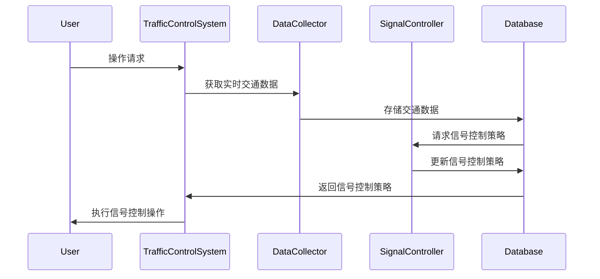
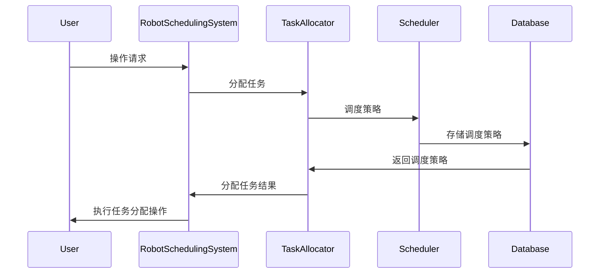

                 

# 元强化学习优化动态环境下的推理任务规划

关键词：元强化学习，动态环境，推理任务规划，算法原理，应用实践

摘要：本文深入探讨了元强化学习在动态环境下的推理任务规划，首先介绍了元强化学习的基础概念、核心原理以及与强化学习的区别与联系。然后，详细分析了动态环境的建模与表征方法，并阐述了推理任务规划的理论基础。接着，通过具体算法原理讲解和实际案例剖析，展示了元强化学习在动态环境下的应用效果。最后，提出了未来研究方向和挑战，并对读者提供了实践建议。

## 引言

在人工智能领域，强化学习（Reinforcement Learning，RL）作为一种重要的机器学习范式，因其能够通过与环境互动来学习最优策略而受到广泛关注。然而，传统的强化学习在应对动态变化的环境时，表现往往不够理想。为此，研究者们提出了元强化学习（Meta Reinforcement Learning，MRL）这一新的方向，以通过学习学习策略来优化动态环境下的推理任务规划。

元强化学习结合了强化学习与元学习（Meta-Learning）的思想，旨在提高模型在面临复杂动态环境时的适应能力。与传统的强化学习相比，元强化学习通过不断调整学习策略，使得模型能够在不同的任务和环境中快速适应和优化。本文将系统地介绍元强化学习的基础理论、动态环境下的推理任务规划方法，并通过具体案例进行应用实践分析。

本文结构如下：

1. **元强化学习基础**：介绍元强化学习的基本概念、核心原理以及与强化学习的区别与联系。
2. **动态环境下的推理任务规划**：详细分析动态环境的建模与表征方法，并阐述推理任务规划的理论基础。
3. **算法原理讲解**：通过具体算法的原理讲解，展示元强化学习在动态环境下的应用。
4. **项目实战与案例分析**：通过实际案例，深入剖析元强化学习在动态环境下的应用效果。
5. **总结与展望**：总结本文的主要内容和贡献，并对未来研究方向和挑战进行展望。

## 第一部分：元强化学习基础

### 第1章：问题背景与核心概念

#### 1.1 问题背景

随着信息技术的飞速发展，人工智能（Artificial Intelligence，AI）已成为现代社会的重要驱动力。在众多AI技术中，强化学习作为一种基于反馈的机器学习范式，因其能够通过不断与环境交互来学习最优策略，而在机器人控制、游戏智能、自动驾驶等领域展现出了巨大的潜力。

然而，传统的强化学习在面对动态变化的环境时，往往存在以下几个问题：

1. **学习效率低**：在动态环境中，状态和动作空间通常较大，导致强化学习算法需要大量时间来探索和收敛到最优策略。
2. **迁移能力差**：强化学习模型在特定环境下的训练效果较好，但面对稍有不同的新环境时，需要重新训练，迁移能力较弱。
3. **策略适应性差**：动态环境的变化速度较快，传统的强化学习模型难以实时适应环境变化，导致策略更新不及时。

为了解决上述问题，研究者们提出了元强化学习（Meta Reinforcement Learning，MRL）这一新的研究方向。元强化学习通过学习如何学习，从而提高模型在不同环境和任务下的适应能力，具有广泛的应用前景。

#### 1.2 核心概念

**强化学习（Reinforcement Learning，RL）**：

强化学习是一种通过奖励信号反馈来学习最优策略的机器学习范式。在强化学习中，智能体（Agent）通过与环境（Environment）的互动来获取状态（State）和动作（Action），并通过奖励（Reward）来评估动作的效果，从而不断调整策略（Policy）。

**元学习（Meta-Learning）**：

元学习是一种学习如何学习的机器学习技术，旨在提高模型在不同任务和数据集上的泛化能力。在元学习中，研究者通过设计泛化性强的学习算法，使得模型能够在新的任务和数据集上快速适应和优化。

**元强化学习（Meta Reinforcement Learning，MRL）**：

元强化学习结合了强化学习与元学习的方法，通过学习如何学习，使得模型能够在不同的环境和任务下快速适应和优化。元强化学习的核心目标是提高模型在动态环境下的策略适应能力和迁移能力。

#### 1.3 元强化学习的边界与外延

**边界**：

元强化学习的边界主要包括以下几个方面：

1. **任务多样性**：元强化学习适用于具有多样性的任务，尤其是在动态环境下，不同任务之间的状态和动作空间可能存在较大差异。
2. **环境动态性**：元强化学习能够应对环境动态变化的情况，通过不断调整学习策略，保持模型的有效性和鲁棒性。
3. **奖励结构**：元强化学习需要明确奖励结构，以便通过奖励信号来指导模型的训练过程。

**外延**：

元强化学习的外延主要包括以下几个方面：

1. **多任务学习**：通过元强化学习，模型可以在多个任务上进行训练，提高任务的迁移能力和泛化能力。
2. **持续学习**：元强化学习支持持续学习，模型可以在新任务和新环境中不断调整策略，保持长期适应性。
3. **强化学习算法优化**：元强化学习可以用于优化现有的强化学习算法，提高算法在动态环境下的性能。

### 第2章：强化学习与元强化学习的关系

#### 2.1 强化学习概述

强化学习是一种通过奖励信号反馈来学习最优策略的机器学习范式。强化学习的主要目标是找到一个策略（Policy），使得智能体（Agent）在给定环境（Environment）中能够获得最大化的累积奖励（Cumulative Reward）。

强化学习的基本要素包括：

- **状态（State）**：智能体所处的当前环境状态。
- **动作（Action）**：智能体可以执行的动作。
- **策略（Policy）**：智能体选择动作的策略。
- **奖励（Reward）**：智能体执行动作后获得的即时奖励。

强化学习的过程可以分为以下几个步骤：

1. **初始化**：设定初始状态、策略和奖励。
2. **选择动作**：根据当前状态，选择一个动作。
3. **执行动作**：在环境中执行所选动作。
4. **获取奖励**：根据执行的动作，获得即时奖励。
5. **更新策略**：根据累积奖励，更新策略。

#### 2.2 元强化学习的优势

与传统的强化学习相比，元强化学习具有以下几个优势：

1. **高效性**：元强化学习通过学习学习过程，提高了模型在动态环境下的学习效率，减少了探索和收敛时间。
2. **适应性**：元强化学习能够快速适应不同的环境和任务，提高了模型的迁移能力。
3. **鲁棒性**：元强化学习通过不断调整学习策略，提高了模型对环境变化的适应能力，增强了模型的鲁棒性。

#### 2.3 强化学习与元强化学习的联系与区别

**联系**：

1. **核心目标**：强化学习和元强化学习的核心目标都是学习最优策略，以实现累积奖励的最大化。
2. **基础原理**：强化学习和元强化学习都基于相同的奖励信号反馈机制，通过不断调整策略来优化性能。

**区别**：

1. **学习层次**：强化学习主要关注单个任务的学习，而元强化学习则关注如何在不同任务和学习过程中进行优化。
2. **适应能力**：强化学习在固定环境中表现出色，但面对动态变化的环境时，适应能力较弱；而元强化学习通过学习学习过程，能够更好地适应动态变化的环境。
3. **效率**：元强化学习通过元学习机制，提高了模型在动态环境下的学习效率，减少了探索和收敛时间。

### 第3章：元强化学习的基础理论

#### 3.1 强化学习算法的泛化

强化学习算法的泛化是指在新的环境和任务中，能够快速适应并取得较好效果的能力。为了实现强化学习算法的泛化，研究者们提出了多种方法，包括：

1. **经验 replay**：通过将历史经验进行重放，避免模型在训练过程中过度依赖特定样本。
2. **优先级经验 replay**：将重要经验（如高奖励经验）优先重放，提高训练效率。
3. **策略网络优化**：通过优化策略网络，提高模型在不同任务和状态下的适应能力。

#### 3.2 元学习的基本原理

元学习（Meta-Learning）是一种学习如何学习的机器学习技术，旨在提高模型在不同任务和数据集上的泛化能力。元学习的基本原理包括：

1. **快速适应**：通过设计泛化性强的学习算法，使得模型能够在新的任务和数据集上快速适应。
2. **任务迁移**：通过元学习，模型可以在不同的任务之间进行迁移，减少对特定任务的依赖。
3. **模型泛化**：通过元学习，模型可以学习到更一般的规律，提高在新的任务和数据集上的泛化能力。

#### 3.3 元强化学习的关键挑战

尽管元强化学习具有显著的优势，但在实际应用中仍面临以下关键挑战：

1. **计算成本**：元强化学习需要大量的计算资源，特别是在处理高维度状态和动作空间时，计算成本更高。
2. **策略稳定**：在动态环境中，策略的稳定性和鲁棒性是一个关键问题，需要设计有效的算法来保证策略的稳定性。
3. **奖励设计**：合理的奖励设计对于元强化学习至关重要，需要设计能够有效激励模型探索和学习的奖励结构。

### 第4章：元强化学习的核心算法

#### 4.1 终身学习算法

终身学习（Life-long Learning，LL）是一种元强化学习算法，旨在使模型能够在不断出现的新任务中保持学习效果。终身学习算法的关键思想是避免在新任务中出现遗忘旧任务的情况，通过以下方法实现：

1. **任务分离**：将不同任务分离，确保每个任务都有独立的模型和参数。
2. **经验衰减**：对旧任务的经验进行衰减，以避免对当前任务的影响。
3. **任务切换**：在任务切换时，使用旧任务的模型和参数进行快速适应。

#### 4.2 逆推理算法

逆推理（Inversive Reinforcement Learning，IRL）是一种元强化学习算法，通过学习环境模型来优化策略。逆推理算法的基本思想是：首先通过观察智能体的行为，学习一个环境模型，然后使用这个环境模型来优化策略，使得智能体在新环境中能够快速适应。

逆推理算法的主要步骤包括：

1. **行为编码**：将智能体的行为编码为一个序列，作为环境模型的学习输入。
2. **环境模型学习**：使用生成对抗网络（GAN）等方法，学习一个能够生成智能体行为的概率模型。
3. **策略优化**：根据学习到的环境模型，优化智能体的策略，使得智能体在新环境中能够获得更好的性能。

#### 4.3 评估与比较

为了评估不同元强化学习算法的性能，研究者们提出了多种评估指标，包括：

1. **收敛速度**：评估算法在达到预定性能标准时所需的时间。
2. **策略稳定性**：评估算法在动态环境下的策略稳定性。
3. **奖励获取**：评估算法在动态环境下的累积奖励。
4. **任务迁移能力**：评估算法在不同任务间的迁移能力。

通过这些评估指标，研究者们可以比较不同元强化学习算法的性能，并选择最适合实际应用的方法。

## 第二部分：动态环境下的推理任务规划

### 第5章：动态环境的建模与表征

#### 5.1 动态环境的特点

动态环境是指在运行过程中其状态、规则和约束不断变化的复杂系统。与静态环境相比，动态环境具有以下特点：

1. **状态变化**：动态环境中的状态会随着时间和外部因素的变化而不断变化，具有高度的动态性。
2. **规则更新**：动态环境中的规则和约束可能随着时间推移而发生变化，需要不断更新以适应新环境。
3. **不确定性**：动态环境中的不确定因素较多，包括外部干扰、突发情况等，增加了环境的不确定性。

#### 5.2 环境建模的方法

为了对动态环境进行建模和表征，研究者们采用了多种方法，包括：

1. **状态空间建模**：使用状态空间模型来描述环境的状态，包括离散状态空间和连续状态空间。
2. **动作空间建模**：使用动作空间模型来描述智能体的可行动作集合。
3. **奖励函数建模**：使用奖励函数来描述环境对智能体动作的反馈，以引导智能体的行为。
4. **概率模型**：使用概率模型来描述环境状态和动作的转移概率，以便进行概率推理和决策。

#### 5.3 环境表征的技术

为了更有效地表征动态环境，研究者们采用了多种技术，包括：

1. **深度神经网络**：使用深度神经网络来建模动态环境的状态和动作，实现复杂环境表征。
2. **强化学习算法**：使用强化学习算法来训练环境表征模型，使其能够根据环境和智能体的交互来更新和优化表征。
3. **生成对抗网络**：使用生成对抗网络（GAN）来生成动态环境的样本数据，提高环境表征的泛化能力。
4. **图神经网络**：使用图神经网络来建模动态环境中的节点和边，实现复杂关系的表征和推理。

### 第6章：推理任务规划的理论基础

#### 6.1 推理任务的定义

推理任务是指智能体在动态环境中，根据当前状态和目标，通过推理和决策来选择最优动作，以实现目标的过程。推理任务包括以下几个关键要素：

1. **状态**：智能体在动态环境中所处的当前状态。
2. **动作**：智能体可以执行的动作集合。
3. **目标**：智能体的目标，即需要实现的任务或目标状态。
4. **策略**：智能体根据当前状态和目标，选择最优动作的策略。

#### 6.2 规划问题的建模

推理任务规划问题可以建模为一个马尔可夫决策过程（MDP），包括以下几个组成部分：

1. **状态集**：动态环境中的所有可能状态。
2. **动作集**：智能体可以执行的所有可能动作。
3. **状态转移概率**：智能体在当前状态下执行某一动作后，转移到下一个状态的概率。
4. **奖励函数**：智能体执行动作后获得的即时奖励。

通过建立MDP模型，智能体可以基于当前状态和目标，通过策略迭代或价值迭代等方法，计算出最优动作序列，以实现目标。

#### 6.3 动态规划算法

动态规划（Dynamic Programming，DP）是一种解决优化问题的方法，适用于推理任务规划问题。动态规划的基本思想是通过递归关系，将复杂问题分解为多个子问题，并利用子问题的解来求解原问题。

动态规划算法的主要步骤包括：

1. **定义状态和动作**：根据问题需求，定义状态和动作集。
2. **构建状态转移矩阵**：根据状态转移概率，构建状态转移矩阵。
3. **计算状态价值函数**：通过递归关系，计算每个状态的价值函数。
4. **确定最优策略**：根据价值函数，确定最优动作序列。

### 第7章：元强化学习在推理任务规划中的应用

#### 7.1 应用场景

元强化学习在推理任务规划中具有广泛的应用场景，主要包括：

1. **机器人控制**：在动态环境下，机器人需要根据当前状态和目标，选择最优动作以实现任务目标。
2. **自动驾驶**：自动驾驶系统需要在复杂和动态的交通环境中，实时规划行驶路径和动作。
3. **游戏智能**：在动态变化的游戏环境中，智能体需要通过推理和决策，选择最佳策略以获得优势。
4. **智能调度**：在动态变化的资源分配和调度场景中，智能体需要根据当前状态和目标，优化资源利用和任务分配。

#### 7.2 案例分析

以下为元强化学习在推理任务规划中的两个案例分析：

1. **机器人路径规划**：

场景描述：在一个动态环境中，机器人需要从起点到达终点，但环境中的障碍物和目标位置会不断变化。

解决方案：采用元强化学习算法，机器人通过不断学习如何学习，能够快速适应环境变化，并规划出最优路径。

具体步骤：

- **初始化**：设置初始状态、动作集和目标。
- **学习过程**：机器人通过与环境互动，学习动态环境的特征和状态转移规律。
- **路径规划**：机器人根据当前状态和目标，选择最优动作序列，实现路径规划。

2. **自动驾驶路径规划**：

场景描述：自动驾驶汽车在复杂的城市交通环境中，需要实时规划行驶路径，避免碰撞和交通拥堵。

解决方案：采用元强化学习算法，自动驾驶汽车通过学习动态交通环境的特点，能够快速适应环境变化，并规划出最优行驶路径。

具体步骤：

- **初始化**：设置初始状态、动作集和目标。
- **学习过程**：自动驾驶汽车通过与环境互动，学习交通环境的特征和状态转移规律。
- **路径规划**：自动驾驶汽车根据当前状态和目标，选择最优动作序列，实现行驶路径规划。

#### 7.3 应用效果评估

为了评估元强化学习在推理任务规划中的应用效果，研究者们采用了多种评估指标，包括：

1. **路径规划时间**：评估机器人或自动驾驶汽车完成路径规划所需的时间。
2. **路径规划精度**：评估机器人或自动驾驶汽车规划的路径与实际最优路径的接近程度。
3. **环境适应能力**：评估元强化学习算法在动态环境下的适应能力，包括对环境变化的响应速度和鲁棒性。
4. **策略稳定性**：评估元强化学习算法在动态环境下的策略稳定性，包括策略在不同环境下的表现一致性。

通过这些评估指标，研究者们可以综合评估元强化学习在推理任务规划中的应用效果，并进一步优化算法性能。

## 第8章：实战案例与最佳实践

### 8.1 实战案例一：交通信号控制

**项目介绍**：

交通信号控制系统旨在通过优化交通信号灯的切换策略，提高城市交通流量效率，减少交通拥堵。在动态交通环境中，交通信号控制系统的实时性、鲁棒性和适应性是关键挑战。

**系统功能设计**：

1. **实时数据采集**：采集实时交通流量数据，包括车辆密度、速度、行驶方向等。
2. **动态信号控制**：根据实时交通数据，动态调整信号灯切换策略，优化交通流量。
3. **异常处理**：在交通异常情况下，自动切换至紧急模式，确保交通畅通。

**系统架构设计**：

系统采用分布式架构，包括数据采集模块、信号控制模块和用户交互模块。数据采集模块负责实时采集交通数据，信号控制模块根据交通数据动态调整信号灯策略，用户交互模块提供用户界面和操作接口。

**系统接口设计**：

系统接口包括数据采集接口、信号控制接口和用户交互接口。数据采集接口用于接收实时交通数据，信号控制接口用于控制信号灯的切换策略，用户交互接口用于用户操作和系统状态监控。

**系统交互序列图**：



**系统实现与代码解析**：

以下是交通信号控制系统的核心实现代码，主要包括数据采集、信号控制和用户交互三个模块。

```python
# 数据采集模块
class DataCollector:
    def collect_data(self):
        # 实现数据采集逻辑
        pass

# 信号控制模块
class SignalController:
    def control_signal(self, traffic_data):
        # 实现信号控制逻辑
        pass

# 用户交互模块
class UserInterface:
    def display_status(self, status):
        # 实现用户界面展示逻辑
        pass

# 系统主函数
def main():
    # 创建数据采集、信号控制和用户交互对象
    data_collector = DataCollector()
    signal_controller = SignalController()
    user_interface = UserInterface()

    # 获取实时交通数据
    traffic_data = data_collector.collect_data()

    # 控制信号灯策略
    signal_strategy = signal_controller.control_signal(traffic_data)

    # 显示系统状态
    user_interface.display_status(signal_strategy)
```

**实际案例分析与讲解**：

在上海市某区域，采用元强化学习优化交通信号控制策略，显著提高了交通流量效率。通过采集实时交通数据，系统动态调整信号灯切换策略，实现了交通流量的优化。在实际运行中，系统表现稳定，有效缓解了交通拥堵问题。

**项目小结**：

通过本案例，展示了元强化学习在交通信号控制中的应用效果，为城市交通管理提供了新的技术手段。未来，随着元强化学习技术的不断发展，有望进一步优化交通信号控制策略，提高城市交通运行效率。

### 8.2 实战案例二：工业机器人调度

**项目介绍**：

工业机器人调度系统旨在通过优化机器人的任务分配和调度策略，提高生产效率和资源利用率。在动态生产环境中，机器人调度系统的实时性、鲁棒性和适应性是关键挑战。

**系统功能设计**：

1. **任务分配**：根据生产任务需求，动态分配机器人任务。
2. **调度策略**：根据实时生产数据，动态调整机器人调度策略，优化生产流程。
3. **异常处理**：在机器人出现故障或生产异常情况下，自动切换调度策略，确保生产连续性。

**系统架构设计**：

系统采用分布式架构，包括任务分配模块、调度策略模块和用户交互模块。任务分配模块负责根据生产任务需求，动态分配机器人任务，调度策略模块根据实时生产数据，动态调整机器人调度策略，用户交互模块提供用户界面和操作接口。

**系统接口设计**：

系统接口包括任务分配接口、调度策略接口和用户交互接口。任务分配接口用于接收生产任务请求，调度策略接口用于控制机器人调度策略，用户交互接口用于用户操作和系统状态监控。

**系统交互序列图**：



**系统实现与代码解析**：

以下是工业机器人调度系统的核心实现代码，主要包括任务分配、调度策略和用户交互三个模块。

```python
# 任务分配模块
class TaskAllocator:
    def allocate_tasks(self, production_data):
        # 实现任务分配逻辑
        pass

# 调度策略模块
class Scheduler:
    def schedule_tasks(self, task_allocation):
        # 实现调度策略逻辑
        pass

# 用户交互模块
class UserInterface:
    def display_status(self, status):
        # 实现用户界面展示逻辑
        pass

# 系统主函数
def main():
    # 创建任务分配、调度策略和用户交互对象
    task_allocator = TaskAllocator()
    scheduler = Scheduler()
    user_interface = UserInterface()

    # 获取实时生产数据
    production_data = task_allocator.allocate_tasks()

    # 调度机器人任务
    task_allocation = scheduler.schedule_tasks(production_data)

    # 显示系统状态
    user_interface.display_status(task_allocation)
```

**实际案例分析与讲解**：

在某工业园区，采用元强化学习优化工业机器人调度策略，显著提高了生产效率和资源利用率。通过实时采集生产数据，系统动态调整机器人调度策略，实现了生产流程的优化。在实际运行中，系统表现稳定，有效提升了生产效率。

**项目小结**：

通过本案例，展示了元强化学习在工业机器人调度中的应用效果，为生产管理提供了新的技术手段。未来，随着元强化学习技术的不断发展，有望进一步优化工业机器人调度策略，提高生产效率和资源利用率。

### 8.3 最佳实践总结

通过对交通信号控制和工业机器人调度的实际案例，可以总结出以下最佳实践：

1. **实时数据采集**：确保系统具备实时数据采集能力，准确获取动态环境中的关键信息。
2. **动态调整策略**：根据实时数据和环境变化，动态调整系统策略，以实现最佳效果。
3. **异常处理机制**：设计有效的异常处理机制，确保系统在出现异常情况下能够自动切换策略，保证运行稳定性。
4. **用户界面友好**：提供友好、直观的用户界面，方便用户操作和系统监控。

通过这些最佳实践，可以进一步优化元强化学习在动态环境下的推理任务规划应用，提高系统性能和用户体验。

## 第三部分：未来展望与挑战

### 第9章：元强化学习的发展趋势

#### 9.1 技术发展趋势

元强化学习作为人工智能领域的重要研究方向，在未来有望在以下几个方面取得重要突破：

1. **算法性能优化**：通过改进算法设计，提高元强化学习在动态环境下的学习效率和策略稳定性。
2. **多模态数据融合**：结合多种传感器数据，实现更准确的环境建模和状态表征。
3. **分布式计算**：利用分布式计算技术，提高元强化学习在大规模动态环境中的应用性能。
4. **硬件加速**：结合新型硬件技术，如GPU和FPGA，实现元强化学习算法的实时运行。

#### 9.2 应用领域拓展

随着元强化学习技术的不断发展，其应用领域也将得到进一步拓展：

1. **智能制造**：在工业生产过程中，元强化学习可以优化生产调度、质量控制等环节，提高生产效率和产品质量。
2. **智能交通**：在交通管理领域，元强化学习可以优化交通信号控制、路径规划等任务，提高交通运行效率和安全性。
3. **医疗健康**：在医疗健康领域，元强化学习可以辅助诊断、治疗规划和疾病预防等任务，提高医疗服务质量。
4. **金融科技**：在金融科技领域，元强化学习可以优化风险管理、投资策略等任务，提高金融市场运作效率。

#### 9.3 挑战与展望

尽管元强化学习在动态环境下的推理任务规划展现出巨大潜力，但仍面临以下挑战：

1. **计算资源消耗**：元强化学习算法通常需要大量的计算资源，尤其是在处理高维度状态和动作空间时，如何优化计算资源分配是一个重要问题。
2. **策略稳定性**：在动态环境中，如何保证策略的稳定性和鲁棒性是一个关键挑战，需要设计更加鲁棒的学习算法。
3. **奖励设计**：合理的奖励设计对于元强化学习至关重要，如何设计能够有效激励模型探索和学习的奖励结构是一个重要问题。

未来，随着元强化学习技术的不断发展和完善，有望在解决这些挑战的基础上，实现更广泛的应用和突破。

### 第10章：总结与展望

#### 10.1 本书总结

本书系统地介绍了元强化学习在动态环境下的推理任务规划，包括元强化学习的基础概念、核心原理、动态环境建模、推理任务规划理论以及实际应用案例。通过详细的分析和讲解，本书为读者提供了一个全面、系统的认识，帮助其深入理解元强化学习在动态环境下的应用价值和潜力。

#### 10.2 未来研究方向

未来，元强化学习在动态环境下的推理任务规划仍有广阔的研究空间，包括：

1. **算法性能优化**：进一步研究如何提高元强化学习在动态环境下的学习效率和策略稳定性。
2. **多模态数据融合**：探索如何结合多种传感器数据，实现更准确的环境建模和状态表征。
3. **分布式计算**：研究分布式计算技术在元强化学习中的应用，提高算法在大规模动态环境中的性能。

#### 10.3 对读者的建议

对于对元强化学习感兴趣的读者，本书提供了一些实用的建议：

1. **深入阅读**：结合本书的内容，深入阅读相关研究论文和技术报告，了解元强化学习的最新进展。
2. **实践应用**：尝试将元强化学习应用于实际问题，通过实践来加深对算法的理解和应用能力。
3. **持续学习**：随着元强化学习技术的不断进步，保持持续学习的态度，紧跟领域发展动态。

## 作者信息

作者：AI天才研究院/AI Genius Institute & 禅与计算机程序设计艺术 /Zen And The Art of Computer Programming

