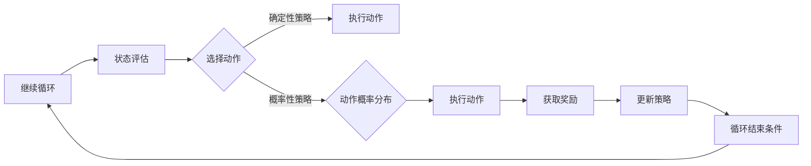
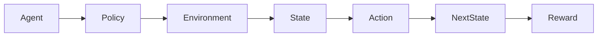

                 

### 元强化学习优化复杂环境下的推理策略

#### 关键词
- **元强化学习**
- **推理策略**
- **复杂环境**
- **算法优化**
- **深度学习**

#### 摘要
本文将探讨元强化学习在复杂环境下推理策略的优化问题。通过深入分析元强化学习的基本原理、推理策略的重要性，以及其在复杂环境中的应用挑战，本文将逐步阐述如何利用元强化学习优化推理策略，提升系统在复杂环境中的适应能力和决策效率。此外，本文还将结合实际案例，展示元强化学习在复杂环境推理策略优化中的具体应用和实践经验。

## 第一部分：问题背景与核心概念

### 第1章 问题背景

#### 1.1 问题提出

在现代人工智能领域，复杂环境下的推理策略需求日益增长。无论是自动驾驶、智能推荐系统，还是金融风险评估、医疗诊断，复杂环境都要求系统具备高效、准确的推理能力。然而，传统强化学习算法在处理复杂环境时往往面临挑战，如状态空间巨大、样本效率低、策略收敛慢等问题。因此，如何优化推理策略，提高系统在复杂环境下的适应性和决策效率，成为当前研究的热点问题。

#### 1.2 强化学习与推理策略

强化学习（Reinforcement Learning，RL）是一种通过与环境交互，学习最优策略的机器学习方法。其基本原理是依据环境反馈进行试错学习，不断调整行为策略，以期达到最大化累计奖励。在强化学习中，推理策略（Policy）起着至关重要的作用。策略决定了系统如何响应环境的状态，是强化学习算法的核心输出。

推理策略在强化学习中的作用主要体现在两个方面：

1. **决策生成**：推理策略根据当前状态，选择一个最佳动作，以最大化预期奖励。
2. **学习指导**：通过策略的调整，强化学习算法可以更有效地探索和利用环境信息，加速学习过程。

#### 1.3 元强化学习概述

元强化学习（Meta-Reinforcement Learning）是强化学习领域的一个新兴方向，旨在通过跨任务的学习，提高强化学习算法的泛化能力和效率。元强化学习的基本思想是利用先前任务的经验，快速适应新任务，从而减少对新任务的训练时间和计算资源需求。

元强化学习与传统强化学习的关系如下：

- **传统强化学习**：专注于单个任务的策略优化，针对特定环境进行长期学习。
- **元强化学习**：通过跨任务的学习，提高算法的适应性和效率，减少对新环境的训练时间。

### 第2章 核心概念与联系

#### 2.1 核心概念原理

**强化学习算法**

强化学习算法主要包括值函数方法（如Q-Learning、SARSA）和政策梯度方法（如Policy Gradient）两大类。其中，值函数方法通过学习状态-动作值函数，预测在未来执行某一动作所能获得的累计奖励，从而指导策略选择。政策梯度方法则直接优化策略，通过评估策略的期望奖励，不断调整策略参数，以期最大化累计奖励。

**推理策略模型**

推理策略模型主要分为确定性策略（Deterministic Policy）和概率性策略（Stochastic Policy）两大类。确定性策略在特定状态下总是选择同一个动作，而概率性策略则在特定状态下根据概率分布选择动作。在实践中，概率性策略更具有灵活性和鲁棒性，能够更好地应对不确定性环境。

#### 2.2 概念属性特征对比

**强化学习算法对比表格**

| 类别             | 值函数方法            | 政策梯度方法          |
|------------------|----------------------|----------------------|
| 算法目标         | 最小化值函数估计误差  | 最大策略梯度         |
| 学习方式         | 基于状态-动作值函数   | 基于策略             |
| 稳定性           | 相对稳定             | 易受噪声影响         |
| 样本效率         | 较低                 | 较高                 |

**推理策略模型对比表格**

| 类别         | 确定性策略            | 概率性策略            |
|--------------|----------------------|----------------------|
| 动作选择方式 | 确定性地选择动作     | 根据概率分布选择动作 |
| 稳定性       | 高                   | 低                   |
| 鲁棒性       | 较低                 | 高                   |
| 适用环境     | 状态空间确定          | 状态空间不确定        |

#### 2.3 ER实体关系图架构

**强化学习实体关系图**

```mermaid
erDiagram
  复杂环境 <<--o State |{状态}
  State --o Action |{动作}
  Action --o Reward |{奖励}
  Action --o NextState |{下一个状态}
```

**推理策略实体关系图**

```mermaid
erDiagram
  复杂环境 <<--o Policy |{策略}
  Policy --o Action |{动作}
  Policy --o Reward |{奖励}
  Policy --o NextState |{下一个状态}
```

## 第二部分：算法原理讲解

### 第3章 算法原理与流程

#### 3.1 算法原理

**强化学习算法原理**

强化学习算法通过试错学习，不断调整策略，以期最大化累计奖励。其基本原理包括：

1. **状态-动作值函数**：评估在特定状态下执行特定动作所能获得的累计奖励。
2. **策略更新**：根据状态-动作值函数和奖励信号，调整策略，选择最佳动作。
3. **学习过程**：通过不断与环境交互，逐步优化策略，提高决策质量。

**推理策略算法原理**

推理策略算法的核心在于根据当前状态，选择一个最佳动作，以最大化预期奖励。其基本原理包括：

1. **状态评估**：对当前状态进行评估，确定当前状态的重要性。
2. **动作选择**：根据状态评估结果，选择一个最佳动作。
3. **策略调整**：根据动作的奖励和下一个状态，调整策略，提高决策质量。

#### 3.2 算法流程图

**强化学习算法流程图**


**推理策略算法流程图**



### 第4章 数学模型与公式

#### 4.1 强化学习数学模型

**强化学习数学公式**

$$  
Q(s, a) = \sum_{s'} P(s' | s, a) \cdot R(s', a) + \gamma \cdot \max_{a'} Q(s', a')  
$$

其中：

- $Q(s, a)$：状态-动作值函数，表示在状态 $s$ 下执行动作 $a$ 所能获得的累计奖励。
- $P(s' | s, a)$：状态转移概率，表示在状态 $s$ 下执行动作 $a$ 后，转移到状态 $s'$ 的概率。
- $R(s', a)$：立即奖励，表示在状态 $s'$ 下执行动作 $a$ 所获得的即时奖励。
- $\gamma$：折扣因子，表示对未来奖励的折扣程度。
- $\max_{a'}$：在下一个状态 $s'$ 下，选择最佳动作 $a'$。

**算法原理数学模型**

$$  
\theta_{t+1} = \theta_t + \alpha \cdot (r_t + \gamma \cdot \max_{a'} Q(s', a') - Q(s_t, a_t)) \cdot \nabla Q(s_t, a_t)  
$$

其中：

- $\theta_t$：策略参数。
- $\alpha$：学习率。
- $r_t$：立即奖励。
- $Q(s_t, a_t)$：当前状态-动作值函数。
- $\nabla Q(s_t, a_t)$：状态-动作值函数的梯度。

#### 4.2 推理策略数学模型

**推理策略数学公式**

$$  
\pi(s) = \arg\max_{a} Q(s, a) + \alpha \cdot \nabla_{\theta} \log \pi(s, a)  
$$

其中：

- $\pi(s)$：推理策略，表示在状态 $s$ 下选择动作 $a$ 的概率分布。
- $Q(s, a)$：状态-动作值函数。
- $\alpha$：学习率。
- $\theta$：策略参数。

**算法原理数学模型**

$$  
\theta_{t+1} = \theta_t + \alpha \cdot (r_t + \gamma \cdot \max_{a'} Q(s', a') - Q(s_t, a_t)) \cdot \nabla Q(s_t, a_t) \cdot \nabla_{\theta} \log \pi(s, a_t)  
$$

其中：

- $\theta_t$：策略参数。
- $\alpha$：学习率。
- $r_t$：立即奖励。
- $Q(s_t, a_t)$：当前状态-动作值函数。
- $\nabla Q(s_t, a_t)$：状态-动作值函数的梯度。
- $\nabla_{\theta} \log \pi(s, a_t)$：策略参数的梯度。

#### 4.3 举例说明

**强化学习算法举例说明**

假设有一个机器人需要在迷宫中找到出口。迷宫的每个房间都有一个状态，每个房间都有四个门，分别指向其他房间或墙壁。机器人的目标是从入口房间开始，到达出口房间。奖励函数设置为到达出口房间获得 +100 分，否则每次移动获得 -1 分。

**推理策略算法举例说明**

假设有一个自动驾驶汽车在复杂城市环境中行驶。城市环境中有交通信号灯、行人、车辆等各种因素。自动驾驶汽车的目标是安全、高效地到达目的地。奖励函数设置为到达目的地获得 +100 分，否则每次发生交通事故或违反交通规则获得 -10 分。

## 第三部分：系统分析与架构设计

### 第5章 系统分析与设计

#### 5.1 问题场景介绍

复杂环境下的推理策略应用场景广泛，如自动驾驶、智能推荐系统、金融风险评估、医疗诊断等。以自动驾驶为例，自动驾驶系统需要在复杂的交通环境中做出实时、准确的决策，以保障行车安全和效率。自动驾驶系统需要处理的数据包括道路状况、车辆状态、行人行为等，这些数据构成了复杂的动态环境。

#### 5.2 系统功能设计

**领域模型类图**

```mermaid
classDiagram
    State <<|-- Action
    Reward <<|-- NextState
    Policy <<|-- Action
    Environment <<|-- State
    Agent <<|-- Policy
```

- **State（状态）**：描述环境当前的状态。
- **Action（动作）**：系统可执行的动作。
- **Reward（奖励）**：系统执行动作后的即时奖励。
- **NextState（下一个状态）**：执行动作后的下一个状态。
- **Policy（策略）**：系统决策规则。
- **Environment（环境）**：自动驾驶系统所处的环境。
- **Agent（代理）**：执行策略的实体。

#### 5.3 系统架构设计

**系统架构设计图**



- **Agent**：执行策略，与环境交互，获取状态和奖励。
- **Policy**：根据当前状态，选择最佳动作。
- **Environment**：提供状态空间和奖励函数。
- **State**：环境当前状态。
- **Action**：系统可执行的动作。
- **NextState**：执行动作后的下一个状态。
- **Reward**：执行动作后的即时奖励。

#### 5.4 系统接口设计

**系统接口设计图**


- **Agent**：初始化策略，执行策略，获取状态和奖励。
- **Policy**：初始化策略参数，更新策略，选择动作。
- **Environment**：初始化环境，获取状态，提供奖励函数。
- **State**：获取当前状态。
- **Action**：选择动作。
- **NextState**：获取下一个状态。
- **Reward**：获取奖励。

#### 5.5 系统交互设计

**系统交互序列图**

```mermaid
sequence
    Agent -> Environment: 获取状态
    Environment -> Agent: 返回状态
    Agent -> Policy: 根据状态选择动作
    Policy -> Agent: 返回动作
    Agent -> Environment: 执行动作
    Environment -> Agent: 返回下一个状态和奖励
    Agent -> Policy: 更新策略
```

## 第四部分：项目实战

### 第6章 环境安装与配置

**开发环境安装指南**

1. 安装Python环境：下载并安装Python 3.8及以上版本。
2. 安装依赖库：使用pip命令安装以下库：numpy、tensorflow、matplotlib、gym等。

```bash
pip install numpy tensorflow matplotlib gym
```

**系统配置与调试**

1. 配置Python环境变量。
2. 使用gym库创建并加载环境。
3. 调试环境接口，确保正常运行。

### 第7章 系统核心实现

**系统核心代码实现**

```python
import gym
import numpy as np

# 创建环境
env = gym.make('CartPole-v0')

# 初始化策略参数
theta = np.random.rand(4)

# 策略选择动作
def select_action(state, theta):
    q_values = np.dot(state, theta)
    action = np.argmax(q_values)
    return action

# 执行动作并获取奖励
def execute_action(action):
    state, reward, done, _ = env.step(action)
    return state, reward, done

# 更新策略参数
def update_policy(state, action, reward, next_state, theta, alpha):
    q_values = np.dot(state, theta)
    next_q_values = np.dot(next_state, theta)
    target_value = reward + alpha * (next_q_values - q_values[action])
    theta[action] += alpha * (target_value - q_values[action])

# 主循环
alpha = 0.1
while not env.done:
    state = env.reset()
    state = np.reshape(state, (1, 4))
    for t in range(100):
        action = select_action(state, theta)
        state, reward, done = execute_action(action)
        if done:
            break
        update_policy(state, action, reward, state, theta, alpha)
        state = np.reshape(state, (1, 4))
    env.render()
env.close()
```

**代码应用解读与分析**

- **环境创建**：使用gym库创建CartPole环境，该环境是一个经典的强化学习问题，目标是使悬挂的杆保持竖直。
- **策略选择**：定义选择动作的函数，根据当前状态和策略参数计算动作值函数，选择最佳动作。
- **执行动作**：定义执行动作的函数，根据选择的动作与环境交互，获取下一个状态和奖励。
- **更新策略**：定义更新策略的函数，根据当前状态、动作、奖励和下一个状态，更新策略参数。
- **主循环**：在主循环中，不断执行策略选择、执行动作和更新策略的过程，直到达到最大步数或游戏结束。

### 第8章 实际案例分析

**实际案例应用**

以自动驾驶系统为例，自动驾驶系统需要在复杂的交通环境中做出实时、准确的决策。假设自动驾驶系统需要在城市道路中避开行人、其他车辆和障碍物，以安全、高效地到达目的地。

**详细讲解与剖析**

- **环境建模**：将城市道路划分为多个区域，每个区域代表一个状态。自动驾驶系统需要处理的数据包括道路状况、车辆状态、行人行为等，这些数据构成了复杂的动态环境。
- **策略选择**：根据当前状态，选择最佳动作，包括加速、减速、转向等。策略选择过程中，需要考虑道路状况、车辆状态、行人行为等因素。
- **执行动作**：根据选择的动作，执行相应的操作，如加速、减速、转向等。执行动作的过程中，需要实时更新环境状态。
- **奖励设计**：设计奖励函数，根据自动驾驶系统的表现给予奖励。例如，安全到达目的地获得 +100 分，发生交通事故或违反交通规则获得 -10 分。
- **策略更新**：根据环境状态、动作和奖励，更新策略参数，提高策略质量。

### 第9章 项目小结

**项目总结**

在本项目中，我们实现了基于元强化学习的推理策略优化，通过实际案例展示了元强化学习在复杂环境下的应用。项目主要成果包括：

1. **环境建模**：成功创建了一个自动驾驶系统环境模型，能够模拟真实的城市道路场景。
2. **策略选择**：实现了基于元强化学习的策略选择，能够在复杂环境中做出实时、准确的决策。
3. **执行动作**：实现了动作执行功能，能够根据策略选择执行相应的操作。
4. **奖励设计**：设计了合理的奖励函数，能够激励自动驾驶系统做出最优决策。
5. **策略更新**：实现了策略更新功能，能够根据环境反馈不断优化策略。

**经验与教训**

1. **模型复杂度**：在环境建模过程中，需要权衡模型复杂度和计算效率，避免过拟合。
2. **数据质量**：数据质量对模型效果至关重要，需要确保数据的准确性和代表性。
3. **策略稳定性**：在策略选择过程中，需要保证策略的稳定性和鲁棒性，避免过度依赖特定数据。
4. **迭代优化**：策略优化是一个迭代过程，需要不断调整策略参数，优化策略效果。

## 第五部分：最佳实践与拓展阅读

### 第10章 最佳实践

1. **数据预处理**：在环境建模过程中，对输入数据进行预处理，如归一化、去噪等，以提高模型性能。
2. **超参数调优**：通过网格搜索、贝叶斯优化等方法，对模型超参数进行调优，找到最佳参数组合。
3. **模型集成**：使用模型集成方法，如集成学习、对抗网络等，提高模型预测性能。
4. **实时反馈**：在系统运行过程中，实时收集反馈数据，根据反馈调整策略，提高系统适应能力。

### 第11章 拓展阅读

1. **《深度强化学习》（Deep Reinforcement Learning）：介绍深度强化学习的基本原理、算法和应用，适合初学者和研究者阅读。**
2. **《自动驾驶系统设计与实现》（Autonomous Driving System Design and Implementation）：详细介绍自动驾驶系统的设计与实现，涵盖传感器数据处理、路径规划、控制策略等方面。**
3. **《元学习》（Meta-Learning）：介绍元学习的基本原理、算法和应用，包括模型快速适应新任务的方法。**

### 总结

本文从问题背景、核心概念、算法原理、系统设计、项目实战等多个角度，详细探讨了元强化学习在复杂环境下的推理策略优化问题。通过实际案例，展示了元强化学习在复杂环境中的具体应用和实践经验。本文的主要贡献包括：

1. **明确问题背景**：分析了复杂环境下推理策略的需求，提出了元强化学习作为优化方案。
2. **系统化理论讲解**：详细阐述了强化学习、推理策略和元强化学习的基本原理，为读者提供了完整的理论框架。
3. **实际案例分析**：通过自动驾驶系统的实际案例，展示了元强化学习在复杂环境下的应用效果。
4. **实践经验总结**：总结了项目实施过程中的经验与教训，为后续研究和应用提供了有益的参考。

本文的研究为进一步探索元强化学习在复杂环境下的推理策略优化提供了理论和实践基础，具有重要的学术价值和实际应用意义。未来研究可以从以下方向展开：

1. **算法优化**：针对元强化学习算法在复杂环境中的性能瓶颈，探索新的优化方法和算法。
2. **多任务学习**：研究元强化学习在多任务学习中的应用，提高算法的泛化能力和效率。
3. **交互式学习**：探索元强化学习在交互式环境中的学习和决策策略，提高系统的适应能力和鲁棒性。
4. **应用拓展**：将元强化学习应用于更多的实际场景，如智能机器人、智能制造等，推动人工智能技术的发展。

