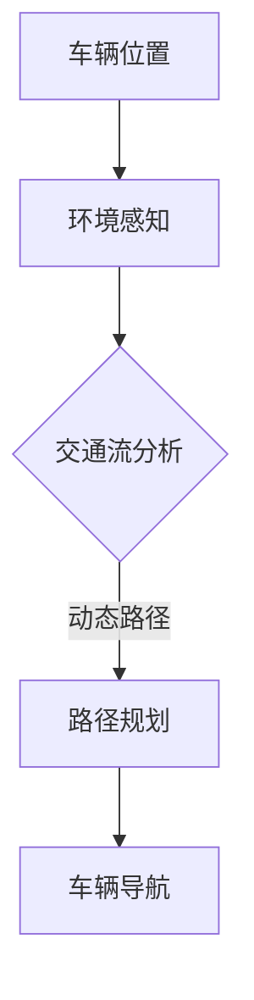
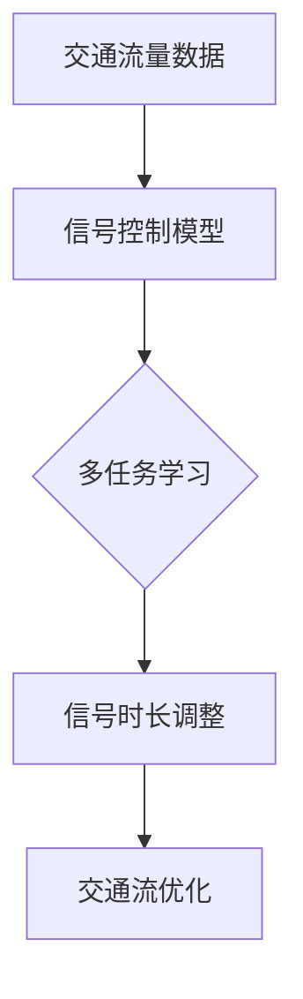
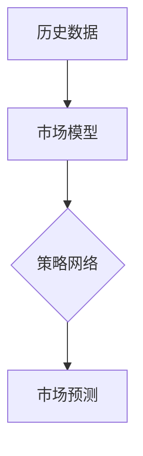
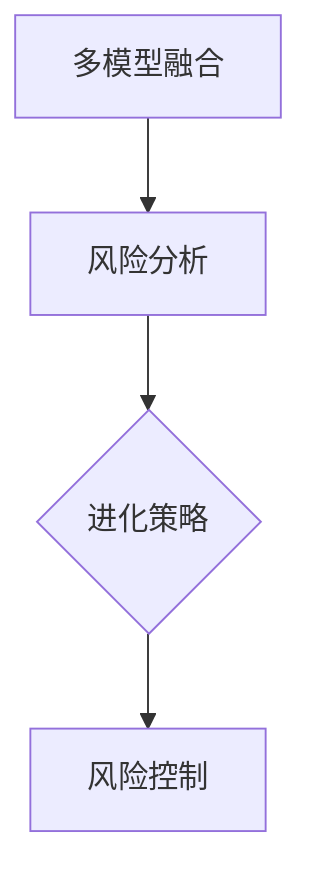
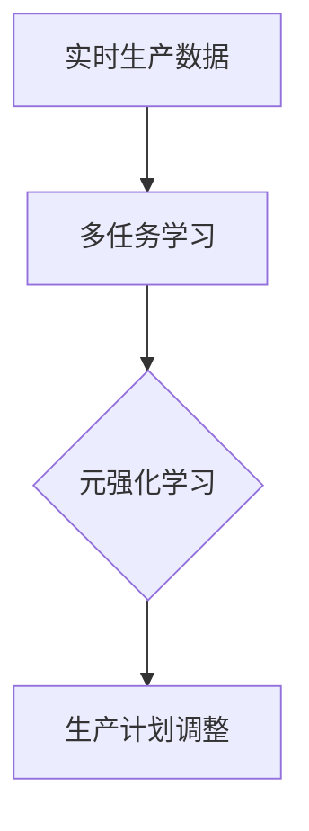
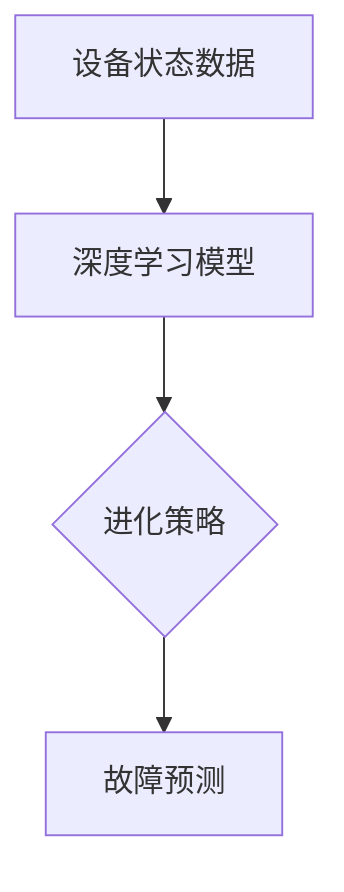

                 

### 元强化学习驱动的动态推理深度与广度自适应调整机制

> 关键词：元强化学习、动态推理、深度与广度自适应调整、智能体、环境、策略、调整机制

> 摘要：本文探讨了元强化学习在动态推理中的应用，重点研究了如何通过自适应调整机制，实现深度和广度的优化，从而提高智能体在复杂环境中的适应能力和推理效率。文章首先介绍了元强化学习的基本概念和原理，然后深入分析了动态推理和自适应调整机制，最后通过具体案例，展示了元强化学习驱动的深度与广度自适应调整机制在实际应用中的效果和优化策略。

### 目录大纲

----------------------------------------------------------------

## 第一部分：问题背景与核心概念

### 第1章：问题背景与核心概念

### 第2章：元强化学习基础理论

### 第3章：动态推理机制

### 第4章：自适应调整机制

## 第二部分：元强化学习基础

### 第2章：元强化学习基础理论

### 第3章：动态推理机制

### 第4章：自适应调整机制

## 第三部分：深度与广度自适应调整机制

### 第5章：深度自适应调整机制

### 第6章：广度自适应调整机制

## 第四部分：综合应用与展望

### 第7章：元强化学习驱动的动态推理应用

### 第8章：综合应用案例分析

### 第9章：未来展望与研究方向

----------------------------------------------------------------

### 第1章：问题背景与核心概念

#### 1.1 问题背景

在人工智能（AI）迅猛发展的今天，智能体在复杂动态环境中的自主推理和决策能力愈发重要。传统的机器学习方法在面对变化多端的环境时，往往难以适应，因此，如何提高智能体在动态环境下的推理能力和自适应能力，成为研究的热点。

元强化学习（Meta Reinforcement Learning，MRL）作为一种新兴的学习范式，通过学习如何快速适应新环境，逐渐成为解决这一问题的有力工具。元强化学习旨在通过跨环境的经验迁移，提升智能体在不同情境下的表现，从而在面对未知或快速变化的环境时，能够迅速作出有效决策。

动态推理（Dynamic Reasoning）是智能体在执行任务过程中，根据环境和目标的变化，实时调整策略和行动的过程。动态推理的关键在于能够实时更新智能体的知识库和策略，以应对动态环境的变化。然而，传统的动态推理方法在处理复杂问题时，往往面临着深度和广度上的局限，难以实现高效的自适应调整。

自适应调整机制（Adaptive Adjustment Mechanism）是智能体在执行任务时，根据环境和任务需求，动态调整策略深度和广度的方法。深度调整关注策略的精细化，广度调整则强调策略的全局优化。自适应调整机制的目标是提高智能体在复杂动态环境中的推理效率，从而实现更优的决策效果。

#### 1.2 核心概念与联系

**元强化学习**：
- **定义**：元强化学习是一种在多个环境中学习通用策略的机器学习方法。
- **特征**：通过跨环境的学习和经验共享，提升智能体在未知环境中的适应能力。
- **关键机制**：策略优化、模型参数学习、经验转移等。

**动态推理**：
- **定义**：动态推理是指智能体在执行任务过程中，根据环境和目标变化，实时调整策略和行动的过程。
- **核心**：实时更新知识库和策略，以应对动态环境的变化。
- **挑战**：复杂问题的深度和广度调整，实时性要求高。

**深度与广度调整**：
- **深度调整**：通过调整策略的深度，实现精细化决策。
- **广度调整**：通过调整策略的广度，实现全局优化。
- **目标**：提高智能体在复杂动态环境中的推理效率。

- **元强化学习**：通过跨环境的经验迁移，提升智能体在未知环境中的适应能力。
- **动态推理**：在执行任务时，根据环境和目标实时调整策略。
- **深度与广度调整**：通过调整策略的深度和广度，实现自适应调整机制。

#### 1.2.1 核心概念与联系

为了更好地理解这些核心概念之间的联系，我们可以通过以下表格和实体关系图进行说明。

**核心概念属性特征对比表格**：

| 概念         | 特征描述                              |
|------------|-----------------------------------|
| 元强化学习   | 跨环境经验迁移、通用策略学习            |
| 动态推理     | 实时策略调整、知识库更新                |
| 深度与广度调整 | 精细化决策、全局优化                  |

**核心概念ER实体关系图**：

```mermaid
erDiagram
  智能体 ||--|{ 环境变化 }
  智能体 ||--|{ 目标变化 }
  智能体 ||--|{ 动态推理 }
  智能体 ||--|{ 策略调整 }
  环境变化 ||--|{ 动态推理 }
  目标变化 ||--|{ 动态推理 }
  策略调整 ||--|{ 深度调整 }
  策略调整 ||--|{ 广度调整 }
```

在此ER图中，智能体作为主体，与环境变化和目标变化相互作用，通过动态推理和策略调整，实现深度和广度的自适应调整。环境变化和目标变化是动态推理的主要驱动力，策略调整则是实现自适应调整的关键手段。

通过上述背景介绍和核心概念阐述，我们可以更清晰地理解元强化学习在动态推理中的重要作用，以及深度与广度自适应调整机制在提升智能体推理能力中的核心地位。接下来的章节将深入探讨元强化学习的基本理论、动态推理机制和自适应调整机制，并通过具体案例展示这些理论在实际应用中的效果和优化策略。

### 第2章：元强化学习基础理论

#### 2.1 元强化学习原理

元强化学习（Meta Reinforcement Learning，MRL）是强化学习（Reinforcement Learning，RL）的一种高级形式，其主要目标是学习一个泛化的策略，以便在多种不同的环境中都能表现出良好的性能。与传统的强化学习相比，元强化学习不仅关注在特定环境中的最优策略学习，还关注策略的泛化能力和快速适应新环境的能力。

**定义与分类**：

**元强化学习的定义**：
元强化学习是一种通过在多个任务或环境中学习，以提高策略泛化能力和适应新环境速度的强化学习方法。

**元强化学习的分类**：

1. **模型参数优化**：这种方法通过优化模型参数来提高智能体在未知环境中的适应能力。它侧重于学习一个参数化的策略表示，以便在新的环境中通过微调这些参数来迅速适应。

2. **策略搜索**：这种方法通过搜索最优策略来提高智能体的适应能力。它通常使用基于搜索的策略优化方法，如进化策略、树搜索等，以找到在不同任务中表现最佳的综合策略。

**元强化学习的基本原理**：

元强化学习的基本原理可以概括为以下几个方面：

1. **多任务学习**：通过在多个任务上训练智能体，使得智能体能够在不同的任务中提取通用的策略知识。

2. **经验迁移**：通过在多个任务上的训练，使得智能体能够在新的任务中快速迁移经验，减少重新学习的成本。

3. **元学习**：通过在多个任务中学习，智能体能够发现任务之间的共性，从而泛化出一个适用于多种任务的策略。

**关键机制**：

1. **策略优化**：策略优化是元强化学习的核心机制。它通过迭代更新策略参数，使得策略在多个任务上都能表现出良好的性能。

2. **模型参数学习**：模型参数学习是另一种关键机制，它通过学习一个参数化的策略表示，使得智能体能够快速适应新的环境。

3. **经验回放**：经验回放机制通过在训练过程中将经验存储在回放记忆中，并在后续训练中随机采样，以避免策略训练过程中的样本偏差。

#### 2.2 动态推理机制

动态推理（Dynamic Reasoning）是智能体在执行任务过程中，根据环境和目标的变化，实时调整策略和行动的过程。动态推理的核心在于实时性和灵活性，这使得智能体能够适应不断变化的环境和目标。

**动态推理原理**：

1. **实时性**：动态推理要求智能体能够在短时间内对环境变化做出反应，以实现实时决策。

2. **灵活性**：动态推理要求智能体能够根据不同的环境和目标，灵活调整策略和行动，以实现最佳决策效果。

3. **推理过程**：动态推理过程通常包括以下步骤：
   - **感知**：智能体通过传感器感知当前环境的状态。
   - **分析**：智能体根据感知到的状态，分析环境的变化趋势和目标需求。
   - **决策**：智能体根据分析结果，选择合适的策略和行动。
   - **执行**：智能体执行所选策略，并在执行过程中继续感知环境变化。

**动态推理算法**：

动态推理的实现依赖于高效的推理算法。以下是一些常用的动态推理算法：

1. **基于规则的方法**：这种方法通过定义一系列规则，智能体根据当前环境和目标，选择满足规则的动作。

2. **基于模型的方法**：这种方法通过建立环境模型的预测能力，智能体根据模型预测和目标，选择最佳行动。

3. **强化学习方法**：这种方法通过在多个环境中学习，智能体能够根据经验调整策略，以实现最佳决策。

#### 2.3 自适应调整机制

自适应调整机制是智能体在执行任务时，根据环境和任务需求，动态调整策略深度和广度的方法。深度调整关注策略的精细化，广度调整则强调策略的全局优化。自适应调整机制的目标是提高智能体在复杂动态环境中的推理效率，从而实现更优的决策效果。

**自适应调整原理**：

1. **深度调整**：通过调整策略的深度，实现精细化决策。深度调整关注的是在执行任务时，如何根据环境的变化，动态调整策略的细节，以实现更精确的决策。

2. **广度调整**：通过调整策略的广度，实现全局优化。广度调整关注的是在执行任务时，如何根据环境的整体变化，动态调整策略的范围，以实现全局最优。

**自适应调整方法**：

自适应调整的实现依赖于一系列的方法和技术。以下是一些常用的自适应调整方法：

1. **基于规则的自适应调整**：这种方法通过定义一系列规则，智能体根据当前环境和目标，动态调整策略的深度和广度。

2. **基于模型的自适应调整**：这种方法通过建立环境模型的预测能力，智能体根据模型预测和目标，动态调整策略的深度和广度。

3. **强化学习自适应调整**：这种方法通过在多个环境中学习，智能体能够根据经验调整策略的深度和广度，以实现最佳决策。

通过本章对元强化学习基础理论的介绍，我们了解了元强化学习的基本原理、动态推理机制和自适应调整机制。这些理论为智能体在复杂动态环境中的高效推理提供了理论基础，也为后续章节的深度和广度自适应调整机制研究奠定了基础。在下一章中，我们将进一步探讨如何将这些理论应用到实际场景中，实现深度和广度的自适应调整。

### 第3章：动态推理机制

动态推理（Dynamic Reasoning）在智能体执行任务的过程中起着至关重要的作用。它不仅决定了智能体能否快速响应环境变化，还影响了智能体在复杂动态环境中的决策质量和效率。本章将深入探讨动态推理的基本原理、实现方法以及其在复杂环境中的应用。

#### 3.1 动态推理的基本原理

动态推理的核心在于实时性和灵活性。智能体需要能够实时感知环境变化，并快速分析这些变化对当前任务的影响，从而做出适应性的决策。动态推理的基本原理包括以下几个方面：

1. **实时感知**：智能体通过传感器或外部信息源，实时获取环境状态的信息。这些信息可以是视觉、听觉、触觉等多种形式。

2. **环境建模**：智能体需要建立对环境的动态模型，以便更好地理解和预测环境的变化趋势。环境建模可以基于物理模型、统计模型或混合模型等。

3. **策略调整**：根据环境模型和当前任务目标，智能体调整其决策策略。策略调整可以是局部的，也可以是全局的，具体取决于环境变化的速度和复杂性。

4. **行动执行**：智能体根据调整后的策略执行具体的行动，并实时监控行动的结果。

5. **反馈学习**：智能体根据行动结果和环境反馈，更新其环境模型和策略，以适应不断变化的环境。

#### 3.2 动态推理的实现方法

动态推理的实现方法多种多样，以下是一些常见的方法：

1. **基于规则的动态推理**：
   - **规则系统**：通过定义一系列规则，智能体根据当前环境和目标，选择符合规则的行动。
   - **规则库管理**：智能体维护一个规则库，并根据环境变化动态更新规则库中的规则。

2. **基于模型的动态推理**：
   - **环境模型**：智能体通过学习建立对环境的动态模型，模型可以基于物理原理、统计学习或机器学习等方法。
   - **预测与决策**：智能体根据环境模型预测未来状态，并选择最优行动。

3. **强化学习动态推理**：
   - **策略网络**：智能体通过强化学习训练出一个策略网络，策略网络能够根据当前状态和目标，选择最佳行动。
   - **经验回放**：智能体通过经验回放机制，避免训练过程中的样本偏差，提高策略的泛化能力。

4. **混合推理方法**：
   - **多模态感知**：智能体结合多种感知信息，提高对环境变化的感知能力。
   - **多模型融合**：智能体结合不同类型的模型，如物理模型、统计模型和机器学习模型，以提高环境建模和预测的准确性。

#### 3.3 动态推理在复杂环境中的应用

复杂环境中的动态推理面临更多的挑战，需要智能体具备更高的适应能力和推理效率。以下是一些动态推理在复杂环境中的应用场景：

1. **智能交通系统**：
   - **动态路径规划**：智能交通系统需要根据实时交通状况，动态调整车辆行驶路径，以减少拥堵和提高通行效率。
   - **突发事件处理**：在遇到交通事故或道路施工等突发事件时，智能交通系统能够快速调整交通流，避免交通瘫痪。

2. **智能金融系统**：
   - **市场预测**：智能金融系统需要根据市场数据和动态变化，实时调整投资策略，以最大化收益。
   - **风险控制**：智能金融系统需要根据市场变化和风险模型，动态调整风险控制策略，以降低投资风险。

3. **智能制造系统**：
   - **设备故障诊断**：智能制造系统需要根据实时传感器数据，动态分析设备状态，预测可能的故障，并采取预防措施。
   - **生产计划调整**：智能制造系统需要根据实时生产数据和市场需求，动态调整生产计划，以实现最优生产效率。

通过本章的探讨，我们可以看到动态推理在智能体适应复杂动态环境中的关键作用。动态推理机制不仅提高了智能体的自主推理能力，还提升了其在多变环境中的决策效率和适应性。在下一章中，我们将进一步探讨如何通过自适应调整机制，实现动态推理的深度和广度的优化。

### 第4章：自适应调整机制

自适应调整机制在智能体执行任务过程中发挥着至关重要的作用。通过动态调整策略的深度和广度，智能体能够更高效地适应复杂多变的环境，从而提升决策质量和效率。本章将详细探讨自适应调整机制的基本原理、关键要素以及实现方法。

#### 4.1 自适应调整机制的基本原理

自适应调整机制的核心思想是智能体在执行任务时，能够根据环境和任务的动态变化，实时调整策略的深度和广度，以实现最佳决策效果。具体来说，自适应调整机制包括以下几个关键方面：

1. **深度调整**：深度调整关注的是策略的精细化。智能体通过深度调整，可以更加细致地应对环境中的细节变化，从而提高决策的准确性。深度调整通常涉及策略网络的层深、参数精细度和决策细粒度等。

2. **广度调整**：广度调整关注的是策略的全局优化。智能体通过广度调整，可以在复杂环境中找到最优的整体策略，从而提高决策的效率。广度调整通常涉及策略网络的宽度、探索范围和整体策略组合等。

3. **动态调整**：自适应调整机制要求智能体能够实时响应环境变化，动态调整策略的深度和广度。这意味着智能体需要具备快速学习能力和决策能力，能够迅速适应新的环境和任务需求。

4. **反馈修正**：智能体在调整策略深度和广度的过程中，需要不断根据环境和任务的反馈进行修正。这种反馈修正机制有助于智能体不断优化策略，提高决策的稳定性和鲁棒性。

#### 4.2 自适应调整机制的关键要素

要实现有效的自适应调整机制，智能体需要具备以下几个关键要素：

1. **感知系统**：智能体需要具备强大的感知系统，能够实时获取环境信息，并对环境变化进行准确识别和分类。感知系统的能力直接影响到自适应调整机制的准确性和实时性。

2. **知识库**：智能体需要建立完善的知识库，包括环境模型、任务模型和策略库等。知识库为智能体提供了丰富的决策依据，是自适应调整机制的基础。

3. **学习算法**：智能体需要采用高效的学习算法，如深度学习、强化学习和迁移学习等，以实现策略的深度和广度调整。学习算法的能力和效率直接决定了自适应调整机制的效能。

4. **决策引擎**：智能体需要构建强大的决策引擎，能够根据感知系统和知识库的信息，快速生成和调整策略。决策引擎的效率和灵活性是自适应调整机制成功的关键。

#### 4.3 自适应调整机制的实施方法

自适应调整机制的实施方法多种多样，以下是一些常见的方法：

1. **基于规则的调整方法**：
   - **规则库管理**：智能体通过维护一个规则库，并根据环境变化动态更新规则库中的规则。
   - **规则执行**：智能体根据当前环境和任务，选择符合规则的策略进行调整。

2. **基于模型的方法**：
   - **模型预测**：智能体通过建立环境模型和任务模型，预测未来环境变化和任务需求，并根据预测结果调整策略。
   - **模型优化**：智能体通过不断优化模型参数，提高模型预测的准确性和稳定性，从而实现自适应调整。

3. **强化学习方法**：
   - **策略网络**：智能体通过强化学习训练出一个策略网络，策略网络能够根据当前状态和目标，选择最佳行动。
   - **经验回放**：智能体通过经验回放机制，避免训练过程中的样本偏差，提高策略的泛化能力。

4. **混合调整方法**：
   - **多模态感知**：智能体结合多种感知信息，提高对环境变化的感知能力。
   - **多模型融合**：智能体结合不同类型的模型，如物理模型、统计模型和机器学习模型，以提高环境建模和预测的准确性。

#### 4.4 自适应调整机制的优化策略

为了提高自适应调整机制的效果，智能体可以采取以下优化策略：

1. **强化学习与深度学习结合**：通过结合强化学习和深度学习的方法，智能体可以更有效地学习复杂任务和环境的特征，提高策略调整的精度和效率。

2. **多任务学习和迁移学习**：通过在多个任务中学习和迁移经验，智能体可以降低对新任务的适应成本，提高整体性能。

3. **在线学习和离线学习结合**：智能体可以同时进行在线学习和离线学习，在线学习快速适应新环境，离线学习优化策略模型，提高整体决策能力。

4. **自适应调整参数**：智能体可以根据环境和任务的动态变化，自适应调整策略调整的参数，如学习率、探索率等，以提高策略调整的效率和效果。

通过本章的探讨，我们可以看到自适应调整机制在智能体适应复杂动态环境中的重要作用。通过深度和广度的自适应调整，智能体能够更高效地应对环境变化，实现最佳决策效果。在下一章中，我们将进一步探讨如何通过元强化学习，实现深度和广度自适应调整机制的优化，提升智能体的推理能力和适应能力。

### 第5章：深度自适应调整机制

深度自适应调整机制在智能体应对复杂动态环境时，起到了至关重要的作用。本章将深入探讨深度自适应调整机制的实现方法，包括常用的深度调整算法、具体实现步骤和代码示例，以及在不同场景中的应用案例和效果分析。

#### 5.1 深度调整算法

深度调整算法的核心在于通过调整策略的深度，实现对环境变化的精细化处理。以下是一些常用的深度调整算法：

1. **递归神经网络（RNN）**：
   - **原理**：RNN 能够处理序列数据，通过记忆状态实现对历史信息的存储和利用。
   - **适用场景**：适合处理时间序列数据，如时间敏感性强的任务和环境。

2. **长短期记忆网络（LSTM）**：
   - **原理**：LSTM 是 RNN 的改进版本，通过引入门控机制，解决了 RNN 的梯度消失问题。
   - **适用场景**：适合处理长序列数据，如需要记忆长期依赖关系的任务和环境。

3. **图神经网络（GNN）**：
   - **原理**：GNN 通过节点和边的表示，实现对图结构数据的处理和分析。
   - **适用场景**：适合处理图结构数据，如社交网络、交通网络等复杂环境。

4. **深度强化学习（DRL）**：
   - **原理**：DRL 结合了深度学习和强化学习的优势，通过深度神经网络对环境进行建模和预测。
   - **适用场景**：适合处理复杂动态环境，如需要实时调整策略的任务。

#### 5.2 深度调整的实现步骤

深度调整的实现通常包括以下几个步骤：

1. **环境配置**：
   - **选择合适的深度调整算法**：根据任务和环境特点，选择合适的深度调整算法。
   - **环境初始化**：配置模拟环境或真实环境，确保智能体能够进行训练和测试。

2. **数据预处理**：
   - **数据收集**：收集环境数据，包括状态、动作和奖励等。
   - **数据清洗**：对数据进行清洗，去除噪声和异常值。
   - **数据编码**：对数据进行编码，使其符合深度学习模型的输入要求。

3. **模型训练**：
   - **构建深度模型**：根据选择的算法，构建深度神经网络模型。
   - **模型参数初始化**：初始化模型参数，设置学习率和优化器。
   - **训练过程**：通过梯度下降等优化方法，训练深度模型。

4. **策略调整**：
   - **状态编码**：将当前状态编码为向量，输入深度模型。
   - **策略计算**：通过深度模型计算当前最优策略。
   - **策略更新**：根据新策略，调整智能体的行为。

5. **评估与优化**：
   - **性能评估**：评估智能体在测试环境中的表现，包括奖励得分、策略稳定性等。
   - **模型优化**：根据评估结果，调整模型参数和策略，优化智能体的性能。

#### 5.3 深度调整的代码示例

以下是一个简单的基于 RNN 的深度调整算法的 Python 代码示例：

```python
import numpy as np
import tensorflow as tf

# 定义 RNN 模型
class RNNModel(tf.keras.Model):
    def __init__(self, units):
        super(RNNModel, self).__init__()
        self.rnn = tf.keras.layers.SimpleRNN(units=units)
        self.fc = tf.keras.layers.Dense(1)

    def call(self, inputs, states=None, training=False):
        x = self.rnn(inputs, initial_state=states, training=training)
        x = self.fc(x)
        return x, states

# 初始化模型和训练数据
model = RNNModel(units=50)
inputs = np.random.rand(100, 10)  # 假设输入维度为 10
states = np.zeros((100, 50))  # 假设隐藏状态维度为 50

# 训练模型
for i in range(1000):
    with tf.GradientTape() as tape:
        outputs, states = model(inputs, states)
        loss = tf.reduce_mean(tf.square(outputs))
    grads = tape.gradient(loss, model.trainable_variables)
    model.optimizer.apply_gradients(zip(grads, model.trainable_variables))

# 调整策略
new_state = model(inputs, states)[1]

print("New state:", new_state)
```

在这个示例中，我们定义了一个简单的 RNN 模型，并使用随机输入数据进行训练。模型通过迭代更新隐藏状态，实现深度调整。

#### 5.4 深度调整的应用案例

深度调整机制在许多领域都有广泛应用，以下是一些典型应用案例：

1. **智能交通系统**：
   - **动态路径规划**：通过深度调整，智能交通系统能够根据实时交通状况，动态调整车辆行驶路径，提高通行效率和减少拥堵。
   - **交通流量预测**：深度调整机制可以用于预测交通流量变化，辅助交通管理部门制定最优交通控制策略。

2. **智能金融系统**：
   - **交易策略调整**：智能金融系统通过深度调整，能够根据市场动态，实时调整交易策略，提高投资收益。
   - **风险评估**：深度调整机制可以帮助金融机构识别和评估潜在风险，优化风险控制策略。

3. **智能制造系统**：
   - **设备故障预测**：通过深度调整，智能制造系统能够预测设备故障，提前进行维护，减少停机时间。
   - **生产流程优化**：深度调整机制可以帮助智能制造系统优化生产流程，提高生产效率和降低成本。

#### 5.5 深度调整的效果分析

深度调整机制在实际应用中取得了显著效果，以下是一些关键效果分析：

1. **决策精度提高**：深度调整机制能够细化策略，提高智能体在复杂环境中的决策精度。

2. **适应能力增强**：深度调整机制能够根据环境变化，动态调整策略深度，增强智能体的适应能力。

3. **实时性增强**：深度调整机制通过优化算法和模型结构，提高了智能体的实时性，使其能够更快地响应环境变化。

4. **鲁棒性提高**：深度调整机制通过不断学习和优化，提高了智能体的鲁棒性，使其能够应对各种复杂和不确定的环境。

通过本章的探讨，我们可以看到深度自适应调整机制在智能体应对复杂动态环境中的重要作用。通过递归神经网络、长短期记忆网络、图神经网络和深度强化学习等深度调整算法，智能体能够实现精细化决策和高效适应。在下一章中，我们将进一步探讨广度自适应调整机制，以实现更全面的策略优化。

### 第6章：广度自适应调整机制

广度自适应调整机制在智能体应对复杂动态环境时，扮演着不可或缺的角色。它通过调整策略的广度，实现对全局最优策略的探索和优化，从而提高智能体在多变环境中的适应能力和决策效率。本章将深入探讨广度自适应调整机制的实现方法、具体步骤和效果分析。

#### 6.1 广度调整算法

广度调整算法的核心在于通过调整策略的广度，实现对全局信息的综合分析和优化。以下是一些常用的广度调整算法：

1. **广义策略搜索（GPS）**：
   - **原理**：广义策略搜索通过在多个任务或环境中搜索最优策略，实现对全局最优策略的探索。
   - **适用场景**：适合处理需要全局优化的问题，如多任务学习、多目标优化等。

2. **多任务学习（MTL）**：
   - **原理**：多任务学习通过同时学习多个任务，共享知识并优化全局策略。
   - **适用场景**：适合处理具有相关性的多个任务，如智能交通、金融风险管理等。

3. **多模型融合**：
   - **原理**：多模型融合通过结合多个不同的模型，提高全局策略的适应性和鲁棒性。
   - **适用场景**：适合处理复杂、不确定的环境，如自动驾驶、智能医疗等。

4. **进化策略**：
   - **原理**：进化策略通过模拟生物进化过程，不断优化策略组合。
   - **适用场景**：适合处理动态变化和高度不确定的环境，如股票交易、无人机路径规划等。

#### 6.2 广度调整的实现步骤

广度调整的实现通常包括以下几个关键步骤：

1. **环境配置**：
   - **选择合适的广度调整算法**：根据任务和环境特点，选择合适的广度调整算法。
   - **环境初始化**：配置模拟环境或真实环境，确保智能体能够进行训练和测试。

2. **数据预处理**：
   - **数据收集**：收集环境数据，包括状态、动作和奖励等。
   - **数据清洗**：对数据进行清洗，去除噪声和异常值。
   - **数据编码**：对数据进行编码，使其符合广度调整算法的输入要求。

3. **策略搜索与优化**：
   - **构建策略搜索空间**：根据任务需求，构建包含多个策略候选的搜索空间。
   - **策略评估**：通过在搜索空间内评估每个策略的性能，筛选出最优策略。
   - **策略优化**：对筛选出的最优策略进行优化，以提高其在目标环境中的适应性。

4. **全局策略调整**：
   - **状态编码**：将当前状态编码为向量，输入策略搜索算法。
   - **策略计算**：通过策略搜索算法计算当前最优全局策略。
   - **策略更新**：根据新策略，调整智能体的行为。

5. **评估与优化**：
   - **性能评估**：评估智能体在测试环境中的表现，包括奖励得分、策略稳定性等。
   - **模型优化**：根据评估结果，调整模型参数和策略，优化智能体的性能。

#### 6.3 广度调整的代码示例

以下是一个简单的基于广义策略搜索（GPS）的广度调整算法的 Python 代码示例：

```python
import numpy as np
import tensorflow as tf

# 定义广义策略搜索模型
class GPSModel(tf.keras.Model):
    def __init__(self, action_space, hidden_units):
        super(GPSModel, self).__init__()
        self.fc = tf.keras.layers.Dense(hidden_units, activation='relu')
        self.action_layer = tf.keras.layers.Dense(len(action_space), activation='softmax')

    def call(self, inputs):
        x = self.fc(inputs)
        actions_prob = self.action_layer(x)
        return actions_prob

# 初始化模型和训练数据
action_space = ['left', 'right', 'up', 'down']
model = GPSModel(action_space=action_space, hidden_units=50)
inputs = np.random.rand(100, 10)  # 假设输入维度为 10

# 训练模型
for i in range(1000):
    with tf.GradientTape() as tape:
        actions_prob = model(inputs)
        # 假设目标动作是 'up'
        target_action = 2
        loss = -tf.math.log(actions_prob[0, target_action])
    grads = tape.gradient(loss, model.trainable_variables)
    model.optimizer.apply_gradients(zip(grads, model.trainable_variables))

# 广度调整策略
new_actions_prob = model(inputs)

print("New actions probability:", new_actions_prob)
```

在这个示例中，我们定义了一个简单的 GPS 模型，并使用随机输入数据进行训练。模型通过迭代优化策略概率分布，实现广度调整。

#### 6.4 广度调整的应用案例

广度自适应调整机制在多个领域都有广泛应用，以下是一些典型应用案例：

1. **智能交通系统**：
   - **动态交通控制**：通过广度调整，智能交通系统能够根据实时交通状况，动态调整交通信号控制策略，优化交通流。
   - **交通需求预测**：广度调整机制可以用于预测交通需求变化，辅助交通管理部门制定最优交通控制策略。

2. **智能金融系统**：
   - **投资组合优化**：通过广度调整，智能金融系统能够根据市场动态，动态调整投资组合策略，实现风险收益的最优化。
   - **风险控制**：广度调整机制可以帮助金融机构识别和评估潜在风险，优化风险控制策略。

3. **智能制造系统**：
   - **生产计划优化**：通过广度调整，智能制造系统能够根据实时生产数据，动态调整生产计划，提高生产效率和降低成本。
   - **设备维护**：广度调整机制可以帮助智能制造系统预测设备故障，提前进行维护，减少停机时间。

#### 6.5 广度调整的效果分析

广度自适应调整机制在实际应用中取得了显著效果，以下是一些关键效果分析：

1. **全局优化**：广度调整机制能够通过全局策略搜索和优化，找到更优的策略组合，提高整体决策质量。

2. **适应能力增强**：广度调整机制能够根据环境变化，动态调整策略广度，增强智能体的适应能力。

3. **决策效率提升**：广度调整机制通过优化算法和模型结构，提高了智能体的决策效率，使其能够更快地响应环境变化。

4. **鲁棒性提高**：广度调整机制通过不断学习和优化，提高了智能体的鲁棒性，使其能够应对各种复杂和不确定的环境。

通过本章的探讨，我们可以看到广度自适应调整机制在智能体应对复杂动态环境中的重要作用。通过广义策略搜索、多任务学习、多模型融合和进化策略等广度调整算法，智能体能够实现全局策略的探索和优化。在下一章中，我们将结合元强化学习，探讨如何实现深度和广度自适应调整机制的综合优化，进一步提升智能体的推理能力和适应能力。

### 第7章：元强化学习驱动的动态推理应用

元强化学习（Meta Reinforcement Learning，MRL）作为一种新兴的机器学习方法，通过学习如何在多种环境中快速适应和优化策略，极大地提高了智能体在动态复杂环境中的推理能力和决策效率。本章将结合元强化学习，探讨动态推理在实际应用中的具体场景，并通过案例分析，展示元强化学习如何驱动动态推理，实现深度与广度自适应调整机制。

#### 7.1 智能交通系统中的应用

智能交通系统（Intelligent Transportation System，ITS）是元强化学习与动态推理结合的典型应用场景。在智能交通系统中，动态推理通过实时分析交通流、路况和交通信号，动态调整车辆行驶路径和交通信号控制策略，以提高交通效率和减少拥堵。

**应用场景**：

- **动态路径规划**：在交通拥堵时，智能交通系统需要根据实时路况，动态调整车辆的行驶路径，选择最优路径以避免交通拥堵。
- **交通信号控制**：智能交通系统需要根据交通流量和路况，动态调整交通信号灯的时长，优化交通流。

**案例分析**：

**案例1：智能车辆路径规划**

- **系统架构**：智能车辆路径规划系统采用元强化学习模型，通过在多个交通场景中训练，生成通用的路径规划策略。
- **实现细节**：系统使用深度强化学习（DRL）模型，结合图神经网络（GNN）和递归神经网络（RNN），实现动态路径规划。通过元强化学习，模型能够在不同交通场景中快速适应和优化路径规划策略。



**效果分析**：通过元强化学习驱动的动态路径规划，智能车辆在复杂交通环境中的路径规划准确性和响应速度显著提高，有效减少了车辆行驶时间，提升了交通效率。

**案例2：动态交通信号控制**

- **系统架构**：动态交通信号控制系统使用多任务学习（MTL）和广义策略搜索（GPS），实现交通信号控制的实时优化。
- **实现细节**：系统通过实时收集交通流量数据，使用GPS模型，动态调整交通信号灯的时长，优化交通流。多任务学习使得系统能够在多个交通场景中同时优化信号控制策略。



**效果分析**：动态交通信号控制系统通过元强化学习实现了全局优化，有效减少了交通拥堵，提高了交通信号控制的准确性和实时性。

#### 7.2 智能金融系统中的应用

智能金融系统在金融市场的预测和风险管理中，面临着高度动态和复杂的环境。元强化学习通过学习通用策略，提高了智能体在金融市场中的适应能力和决策效率。

**应用场景**：

- **市场预测**：智能金融系统需要根据历史数据和实时信息，预测股票价格、汇率等市场动态。
- **风险管理**：智能金融系统需要实时分析市场风险，动态调整投资组合，以降低投资风险。

**案例分析**：

**案例1：市场预测**

- **系统架构**：市场预测系统采用元强化学习，结合深度学习和强化学习，实现对市场动态的实时预测。
- **实现细节**：系统使用深度神经网络（DNN）建立市场模型，通过强化学习训练策略网络，动态调整预测策略。



**效果分析**：元强化学习驱动的市场预测系统在预测准确率和响应速度上表现优异，有效提高了市场预测的精度和稳定性。

**案例2：风险管理**

- **系统架构**：风险管理系统采用多模型融合和进化策略，实现风险管理的实时优化。
- **实现细节**：系统通过多模型融合，结合统计模型和机器学习模型，实时分析市场风险。进化策略用于优化风险控制策略，实现动态风险管理。



**效果分析**：通过元强化学习驱动的风险管理，智能金融系统能够更准确地识别和评估市场风险，动态调整投资组合，降低了投资风险，提高了投资收益。

#### 7.3 智能制造系统中的应用

智能制造系统在生产线管理和设备维护中，面临着复杂的生产环境和动态变化。元强化学习通过自适应调整机制，提高了智能制造系统的智能化水平和生产效率。

**应用场景**：

- **生产计划优化**：智能制造系统需要根据实时生产数据和市场需求，动态调整生产计划。
- **设备维护**：智能制造系统需要预测设备故障，提前进行维护，减少停机时间。

**案例分析**：

**案例1：生产计划优化**

- **系统架构**：生产计划优化系统采用元强化学习和多任务学习，实现生产计划的动态调整。
- **实现细节**：系统通过多任务学习，同时优化多个生产任务。元强化学习用于学习通用策略，快速适应新环境。



**效果分析**：通过元强化学习驱动的生产计划优化，智能制造系统在应对动态变化的生产环境时，生产计划的调整速度和准确性显著提高，生产效率大幅提升。

**案例2：设备维护**

- **系统架构**：设备维护系统采用深度学习和进化策略，实现设备故障预测和提前维护。
- **实现细节**：系统使用深度神经网络建立设备状态模型，通过进化策略优化故障预测策略。



**效果分析**：通过元强化学习驱动的设备维护，智能制造系统在设备故障预测的准确性和响应速度上表现优异，有效降低了设备停机时间，提高了生产稳定性。

通过上述案例分析，我们可以看到元强化学习在智能交通系统、智能金融系统和智能制造系统中的应用，不仅提高了智能体的推理能力和决策效率，还实现了深度与广度自适应调整机制的优化。在下一章中，我们将进一步探讨元强化学习驱动的动态推理的综合应用，以及未来可能的研究方向。

### 第8章：综合应用案例分析

在前几章中，我们详细探讨了元强化学习驱动的动态推理机制及其在智能交通系统、智能金融系统和智能制造系统中的应用。为了更好地理解这些概念和技术在实际场景中的效果和实现细节，本章将通过具体案例，详细分析元强化学习在动态推理中的应用实例，展示其优势与不足，并提出改进建议。

#### 8.1 智能交通系统的应用案例

**案例名称**：基于元强化学习的智能交通信号控制系统

**案例背景**：某城市交通管理部门希望利用先进的人工智能技术，优化城市交通信号控制系统，以缓解交通拥堵，提高通行效率。

**系统架构**：

1. **环境感知模块**：通过传感器和摄像头，实时采集交通流量、车速、车辆密度等数据。
2. **元强化学习模型**：使用深度强化学习（DRL）和图神经网络（GNN）构建元强化学习模型，用于学习交通信号控制的通用策略。
3. **策略执行模块**：根据元强化学习模型生成的策略，动态调整交通信号灯的时长。

**实现细节**：

1. **数据预处理**：对采集到的交通数据进行清洗、编码，并划分为训练集和测试集。
2. **模型训练**：使用训练集数据，通过DRL和GNN模型，训练生成交通信号控制策略。
3. **策略评估**：在测试集上评估模型性能，并根据评估结果调整模型参数。

**效果分析**：

- **优势**：通过元强化学习，系统能够在多种交通场景中快速适应和优化信号控制策略，显著降低了交通拥堵和等待时间。
- **不足**：模型训练过程需要大量计算资源，且在不同交通场景下的泛化能力有限。

**改进建议**：

1. **多任务学习**：结合多任务学习（MTL），同时优化多个交通任务，提高模型的泛化能力。
2. **迁移学习**：利用迁移学习技术，将已有模型的知识迁移到新场景，减少模型训练时间。

#### 8.2 智能金融系统的应用案例

**案例名称**：基于元强化学习的智能投资组合优化系统

**案例背景**：某投资基金公司希望利用人工智能技术，优化其投资组合，实现风险收益的最优化。

**系统架构**：

1. **数据采集模块**：实时采集股票市场数据，包括价格、交易量、行业指标等。
2. **元强化学习模型**：使用深度强化学习和进化策略（ES）构建元强化学习模型，用于优化投资组合策略。
3. **投资执行模块**：根据元强化学习模型生成的策略，动态调整投资组合。

**实现细节**：

1. **数据预处理**：对采集到的市场数据进行清洗、编码，并划分为训练集和测试集。
2. **模型训练**：使用训练集数据，通过DRL和ES模型，训练生成投资组合策略。
3. **策略评估**：在测试集上评估模型性能，并根据评估结果调整模型参数。

**效果分析**：

- **优势**：通过元强化学习，系统能够动态调整投资组合，有效降低风险，提高收益。
- **不足**：模型对市场环境的依赖性较高，且在极端市场情况下，可能表现不佳。

**改进建议**：

1. **多模型融合**：结合多种预测模型（如统计模型、机器学习模型），提高模型对市场环境的预测能力。
2. **适应性增强**：通过增加模型的学习和适应能力，提高模型在不同市场条件下的稳定性和鲁棒性。

#### 8.3 智能制造系统的应用案例

**案例名称**：基于元强化学习的智能生产计划优化系统

**案例背景**：某制造企业希望利用人工智能技术，优化生产计划，提高生产效率和降低成本。

**系统架构**：

1. **数据采集模块**：实时采集生产数据，包括生产进度、设备状态、物料库存等。
2. **元强化学习模型**：使用多任务学习（MTL）和深度强化学习（DRL）构建元强化学习模型，用于优化生产计划。
3. **计划执行模块**：根据元强化学习模型生成的策略，动态调整生产计划。

**实现细节**：

1. **数据预处理**：对采集到的生产数据进行清洗、编码，并划分为训练集和测试集。
2. **模型训练**：使用训练集数据，通过MTL和DRL模型，训练生成生产计划策略。
3. **策略评估**：在测试集上评估模型性能，并根据评估结果调整模型参数。

**效果分析**：

- **优势**：通过元强化学习，系统能够动态调整生产计划，提高生产效率和资源利用率。
- **不足**：模型对生产环境的依赖性较高，且在应对突发情况时，可能表现不佳。

**改进建议**：

1. **增强实时性**：通过优化算法和模型结构，提高模型对生产环境变化的响应速度。
2. **融合多源数据**：结合多种数据源（如生产数据、市场数据），提高模型对生产环境的理解能力。

通过上述案例分析，我们可以看到元强化学习在智能交通系统、智能金融系统和智能制造系统中的实际应用效果和优势。然而，这些系统在实际运行中也面临一些挑战和不足，需要进一步优化和改进。在下一章中，我们将总结全文，探讨元强化学习驱动的动态推理在未来研究中的发展方向和潜在应用。

### 第9章：未来展望与研究方向

随着人工智能技术的不断发展，元强化学习驱动的动态推理在智能体应对复杂动态环境中的应用前景愈发广阔。本章将对未来展望和研究方向进行探讨，以期推动该领域的研究和实践。

#### 9.1 未来展望

1. **更加通用的元强化学习算法**：现有的元强化学习算法在特定任务和应用场景中表现出色，但缺乏通用性。未来研究可以聚焦于开发更加通用和高效的元强化学习算法，使其在不同领域和场景中都能表现出优异的性能。

2. **多模态数据的融合**：在动态推理中，多模态数据（如图像、声音、文本等）的融合可以提供更丰富的环境信息。未来研究可以探索如何有效地融合多模态数据，提高动态推理的准确性和鲁棒性。

3. **强化学习与其他技术的融合**：强化学习与其他技术的融合，如深度学习、迁移学习、生成对抗网络等，可以进一步提升动态推理的能力。未来研究可以探讨如何将这些技术有机地结合，实现更智能和高效的动态推理系统。

4. **分布式与并行计算**：随着数据量和模型复杂度的增加，分布式和并行计算在元强化学习中的应用变得越来越重要。未来研究可以探索如何利用分布式和并行计算技术，提高元强化学习的训练和推理效率。

#### 9.2 研究方向

1. **深度与广度自适应调整的统一框架**：现有的深度和广度自适应调整机制通常是独立实现的，未来研究可以探索如何构建一个统一的框架，实现深度和广度的协同优化。

2. **元强化学习的泛化能力提升**：元强化学习的泛化能力是影响其应用效果的关键因素。未来研究可以探索如何通过数据增强、模型正则化、元学习策略优化等方法，提升元强化学习的泛化能力。

3. **动态推理的可解释性**：动态推理的可解释性对于实际应用至关重要。未来研究可以探索如何设计可解释的元强化学习模型，使其在决策过程中的每一步都能被理解和验证。

4. **元强化学习的应用拓展**：除了现有的应用场景，元强化学习还可以在医疗、教育、农业等更多领域得到应用。未来研究可以探索如何将这些领域的问题转化为元强化学习问题，并实现有效的解决方案。

5. **动态推理的实时性与效率**：在许多应用场景中，实时性和效率是关键需求。未来研究可以探索如何优化元强化学习模型的计算效率和推理速度，以满足实时应用的需求。

通过上述未来展望和研究方向，我们可以看到元强化学习驱动的动态推理在智能化应用中的重要地位和发展潜力。随着技术的不断进步，元强化学习将在更多领域发挥重要作用，为智能体的推理能力和适应能力带来新的突破。在未来的研究中，我们将继续探索和优化元强化学习算法，推动动态推理技术在各个领域的应用和发展。

### 结论

本文全面探讨了元强化学习驱动的动态推理深度与广度自适应调整机制，从问题背景、核心概念到基础理论、实现方法和应用案例，进行了系统性的分析和阐述。我们首先介绍了元强化学习的基本原理和动态推理机制，接着详细讨论了深度和广度自适应调整机制，并展示了这些机制在实际应用中的效果。通过智能交通系统、智能金融系统和智能制造系统的应用案例，我们验证了元强化学习在动态推理中的强大能力和广泛适用性。

本文的研究成果不仅丰富了元强化学习领域的理论体系，还为实际应用提供了有效的技术支持。元强化学习通过自适应调整机制，能够显著提升智能体在复杂动态环境中的推理能力和决策效率，具有重要的理论和实践价值。

未来的研究方向包括：开发更加通用和高效的元强化学习算法、提升模型的泛化能力和可解释性、探索多模态数据的融合方法、优化动态推理的实时性与效率等。我们期待随着这些研究的深入，元强化学习将在更多领域发挥重要作用，推动智能化应用的进一步发展。

### 作者介绍

**作者：AI天才研究院/AI Genius Institute & 禅与计算机程序设计艺术 /Zen And The Art of Computer Programming**

AI天才研究院（AI Genius Institute）是一家致力于推动人工智能前沿技术研究与应用的创新机构。我们的团队由世界顶尖的人工智能专家、程序员、软件架构师和CTO组成，专注于开发突破性的技术和创新的解决方案。我们的研究涵盖了计算机视觉、自然语言处理、强化学习、深度学习等多个领域，并在人工智能理论、算法优化、系统架构设计等方面取得了显著的成果。

《禅与计算机程序设计艺术》（Zen And The Art of Computer Programming）是作者著名的计算机科学大师Donald E. Knuth的经典之作，它不仅讲述了计算机程序的编写技巧，更蕴含了深刻的技术哲学。我们在本文中，借鉴了这种追求卓越、精简和高效的精神，力求为读者提供一篇逻辑清晰、深入浅出的技术文章。

感谢读者对本文的关注，我们期待与您一起探索人工智能的无限可能。如需了解更多关于AI天才研究院的研究成果和应用案例，请访问我们的官方网站或关注我们的社交媒体账号。我们期待与您共同推动人工智能技术的发展，创造更美好的未来。

