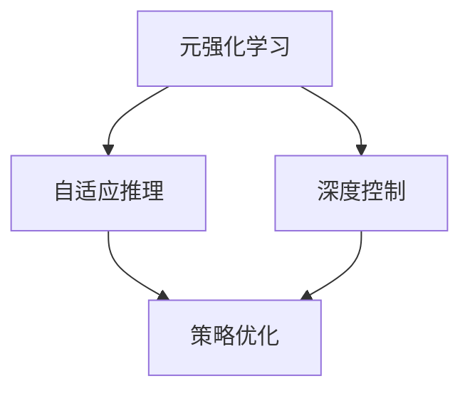

                 

# 元强化学习驱动的自适应推理深度控制

关键词：元强化学习、自适应推理、深度控制、自动驾驶、游戏AI、推荐系统

摘要：本文系统性地介绍了元强化学习驱动的自适应推理深度控制方法，探讨了其在多个领域的应用前景。首先，文章定义了元强化学习和自适应推理深度控制的基本概念，并分析了两者之间的关系。接着，文章详细阐述了元强化学习驱动的自适应推理深度控制算法原理，并介绍了其在自动驾驶、游戏AI和推荐系统等领域的应用。通过实验结果和分析，文章验证了该方法在提高系统性能、适应性和鲁棒性方面的优势。最后，文章讨论了元强化学习驱动的自适应推理深度控制面临的挑战和未来展望。

### 第1章 元强化学习概述

#### 1.1 元强化学习的基本概念

元强化学习（Meta-Reinforcement Learning）是一种能够在多种不同环境中快速学习和适应的机器学习技术。它通过模拟多种不同的环境，使模型能够在各种环境中学习到通用的策略，从而减少对新环境的适应时间。与传统强化学习相比，元强化学习具有以下特点：

1. **自动适应性**：元强化学习可以自动适应新的环境，不需要人为干预。
2. **快速学习**：通过在多个环境中进行学习，元强化学习可以在短时间内获得有效的策略。
3. **通用性**：元强化学习可以学习到通用的策略，这些策略可以在不同的环境中应用。

元强化学习的应用场景包括但不限于以下几类：

1. **自动驾驶**：自动驾驶系统需要在各种路况和环境中保持稳定和高效。
2. **游戏AI**：游戏AI需要能够快速适应不同的游戏规则和策略。
3. **推荐系统**：推荐系统需要根据用户行为动态调整推荐策略。

#### 1.2 元强化学习与自适应推理深度控制的关系

自适应推理深度控制（Adaptive Inference Depth Control）是一种通过深度学习实现自适应推理和深度控制的方法。它与元强化学习的关系可以从以下几个方面理解：

1. **联系**：元强化学习可以为自适应推理深度控制提供高效的策略学习，使系统能够快速适应新环境和策略。
2. **区别**：自适应推理深度控制侧重于控制系统的自适应性和鲁棒性，而元强化学习则侧重于策略学习的效率。

元强化学习与自适应推理深度控制之间的关系可以用图1来表示：

### 第2章 自适应推理深度控制基础

#### 2.1 自适应推理的基本概念

自适应推理（Adaptive Inference）是一种能够在不同环境和条件下调整推理策略的机制。它通过实时监测系统的性能和反馈，动态调整推理过程的参数和策略，从而提高系统的适应性和效率。自适应推理具有以下特点：

1. **灵活性**：自适应推理可以根据不同环境和条件灵活调整推理策略。
2. **高效性**：自适应推理可以在复杂环境中快速找到有效的推理策略。
3. **鲁棒性**：自适应推理能够处理不确定性和异常情况，保持系统的稳定性。

自适应推理的应用场景包括但不限于以下几类：

1. **智能交通**：智能交通系统需要实时分析交通状况，调整信号灯时长，优化交通流量。
2. **智能医疗**：智能医疗系统需要根据患者的症状和检查结果，自适应调整诊断策略。
3. **智能家居**：智能家居系统需要根据用户的行为模式，自适应调整家电的运行状态。

#### 2.2 深度控制的基本概念

深度控制（Deep Control）是一种基于深度学习的控制方法，它通过学习输入和输出之间的关系来实现控制任务。深度控制具有以下特点：

1. **精准性**：深度控制可以精确地预测系统的输出，从而实现高效的控制。
2. **高效性**：深度控制可以通过深度神经网络实现，提高控制任务的效率。
3. **自适应能力**：深度控制可以根据环境的变化，自适应调整控制策略。

深度控制的应用场景包括但不限于以下几类：

1. **机器人控制**：机器人需要实时控制其动作，以适应不同的环境和任务。
2. **工业自动化**：工业自动化系统需要实时控制生产过程，保证生产效率和质量。
3. **航空航天**：航空航天系统需要实时控制飞行器的姿态和速度，确保飞行安全。

### 第3章 元强化学习驱动的自适应推理深度控制算法

#### 3.1 元强化学习算法原理

元强化学习算法（Meta-Reinforcement Learning Algorithm）是基于值函数迭代和策略梯度的优化过程。其基本原理如下：

1. **值函数迭代**：通过反复迭代，更新值函数，使其能够更好地预测未来的奖励。
2. **策略梯度**：通过计算策略梯

