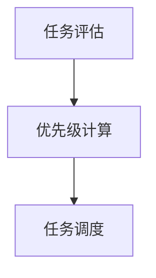
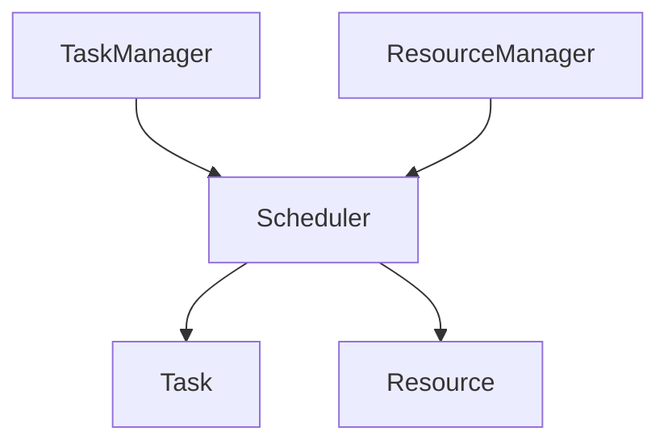
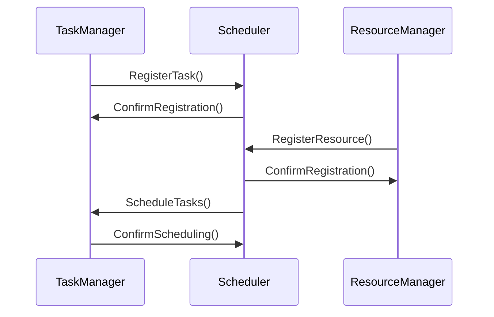

                 


### 元控制框架下的推理任务动态优先级与资源调度

关键词：元控制框架、推理任务、动态优先级、资源调度、算法、数学模型、系统架构

摘要：本文旨在探讨元控制框架下的推理任务动态优先级与资源调度问题。通过深入分析问题背景、核心概念及其联系，本文提出了动态优先级算法原理、资源调度算法原理，并使用Python源代码和Mermaid流程图进行了详细阐述。同时，文章还介绍了数学模型与公式的应用，以及系统分析与架构设计方案。通过项目实战，本文提供了实际案例分析和最佳实践，为相关领域的研究和应用提供了有价值的参考。

### 第1章: 背景介绍

#### 1.1.1 问题背景

元控制框架是一种在复杂系统中实现自动化控制和管理的工具，广泛应用于人工智能、大数据处理等领域。在人工智能系统中，推理任务动态优先级与资源调度问题至关重要。随着多智能体系统的日益复杂，如何在有限资源下高效地调度任务，使得系统性能得到最大化，成为当前研究的热点问题。

#### 1.1.2 问题描述

在多推理任务环境中，如何实现动态优先级调度，使得每个任务都能在合理时间内完成，是本文要解决的问题。同时，如何高效地分配系统资源，避免资源冲突，也是本文需要探讨的内容。

#### 1.1.3 问题解决

本文提出了一种基于元控制框架的动态优先级与资源调度算法。通过动态优先级算法，根据任务的重要性和紧急程度，实时调整任务的执行顺序。而资源调度算法则确保在系统资源有限的情况下，将资源合理地分配给各个任务，使得系统整体性能得到最大化。

#### 1.1.4 边界与外延

本文主要研究在元控制框架下，如何实现推理任务的动态优先级与资源调度。边界条件包括任务数量、系统资源限制等。而外延则包括算法的优化方向、实际应用场景等。

#### 1.1.5 概念结构与核心要素组成

本文的核心概念包括元控制框架、推理任务、动态优先级、资源调度等。核心要素包括动态优先级算法、资源调度算法、数学模型等。

### 第2章: 核心概念与联系

#### 2.1 元控制框架原理

元控制框架是一种在复杂系统中实现自动化控制和管理的工具，具有以下特点：

1. **层次化架构**：元控制框架通常采用层次化架构，包括控制层、执行层和监控层等。
2. **灵活性和可扩展性**：元控制框架可以根据不同的应用场景进行灵活配置和扩展。
3. **实时性**：元控制框架能够实时监测系统状态，并做出相应的调整。

#### 2.2 推理任务动态优先级机制

推理任务动态优先级机制是指根据任务的重要性和紧急程度，实时调整任务的执行顺序。具体包括以下步骤：

1. **任务评估**：对每个推理任务进行评估，确定其重要性和紧急程度。
2. **优先级计算**：根据任务评估结果，计算每个任务的优先级。
3. **任务调度**：根据任务优先级，动态调整任务的执行顺序。

#### 2.3 资源调度算法

资源调度算法是指在系统资源有限的情况下，将资源合理地分配给各个任务。具体包括以下步骤：

1. **资源评估**：对系统资源进行评估，确定可用资源。
2. **任务需求分析**：分析每个任务对资源的需求。
3. **资源分配**：根据任务需求，将资源合理地分配给各个任务。

#### 2.4 核心概念属性特征对比表格

| 概念       | 特点                                                         |
| ---------- | ------------------------------------------------------------ |
| 元控制框架 | 层次化架构、灵活性和可扩展性、实时性                       |
| 动态优先级 | 根据任务重要性和紧急程度调整任务执行顺序                   |
| 资源调度   | 系统资源有限的情况下，将资源合理地分配给各个任务           |

#### 2.5 ER实体关系图架构

下面是元控制框架下的推理任务动态优先级与资源调度的ER实体关系图：

```mermaid
erDiagram
    Task --> Priority : 调度依据
    Task --> Resource : 需求资源
    Priority ||--|{ Task }|| : 优先级包含
    Resource ||--|{ Task }|| : 资源包含
```

### 第3章: 算法原理讲解

#### 3.1 动态优先级算法原理

动态优先级算法的基本原理是根据任务的重要性和紧急程度，实时调整任务的执行顺序。具体步骤如下：

1. **任务评估**：对每个推理任务进行评估，确定其重要性和紧急程度。
2. **优先级计算**：根据任务评估结果，计算每个任务的优先级。
3. **任务调度**：根据任务优先级，动态调整任务的执行顺序。

下面是动态优先级算法的Mermaid流程图：



#### 3.2 资源调度算法原理

资源调度算法的基本原理是在系统资源有限的情况下，将资源合理地分配给各个任务。具体步骤如下：

1. **资源评估**：对系统资源进行评估，确定可用资源。
2. **任务需求分析**：分析每个任务对资源的需

### 第4章: 数学模型与数学公式讲解

#### 4.1 动态优先级算法数学模型

动态优先级算法的数学模型如下：

$$
P(t) = f(I(t), E(t))
$$

其中，$P(t)$ 表示任务 $t$ 在时间 $t$ 的优先级，$I(t)$ 表示任务 $t$ 在时间 $t$ 的重要性，$E(t)$ 表示任务 $t$ 在时间 $t$ 的紧急程度。$f$ 为优先级计算函数。

#### 4.2 资源调度算法数学模型

资源调度算法的数学模型如下：

$$
R(t) = g(R_{\text{available}}, T(t), D(t))
$$

其中，$R(t)$ 表示任务 $t$ 在时间 $t$ 的资源分配，$R_{\text{available}}$ 表示系统可用资源，$T(t)$ 表示任务 $t$ 在时间 $t$ 的资源需求，$D(t)$ 表示任务 $t$ 在时间 $t$ 的优先级。

#### 4.3 动态优先级算法举例说明

假设有两个推理任务 $A$ 和 $B$，其在时间 $t$ 的重要性和紧急程度分别为：

$$
I(A) = 0.8, E(A) = 0.9 \\
I(B) = 0.7, E(B) = 0.8
$$

优先级计算函数 $f$ 为线性函数：

$$
f(I, E) = 0.6I + 0.4E
$$

则任务 $A$ 和 $B$ 在时间 $t$ 的优先级分别为：

$$
P(A) = f(I(A), E(A)) = 0.6 \times 0.8 + 0.4 \times 0.9 = 0.72 + 0.36 = 1.08 \\
P(B) = f(I(B), E(B)) = 0.6 \times 0.7 + 0.4 \times 0.8 = 0.42 + 0.32 = 0.74
$$

因此，任务 $A$ 的优先级高于任务 $B$。

#### 4.4 资源调度算法举例说明

假设系统可用资源为 $R_{\text{available}} = 100$，任务 $A$ 和 $B$ 在时间 $t$ 的资源需求分别为：

$$
T(A) = 30, D(A) = 0.8 \\
T(B) = 20, D(B) = 0.7
$$

资源分配函数 $g$ 为线性函数：

$$
g(R_{\text{available}}, T, D) = 0.5R_{\text{available}} + 0.5TD
$$

则任务 $A$ 和 $B$ 在时间 $t$ 的资源分配分别为：

$$
R(A) = g(R_{\text{available}}, T(A), D(A)) = 0.5 \times 100 + 0.5 \times 30 \times 0.8 = 50 + 12 = 62 \\
R(B) = g(R_{\text{available}}, T(B), D(B)) = 0.5 \times 100 + 0.5 \times 20 \times 0.7 = 50 + 14 = 64
$$

因此，任务 $A$ 获得了 62 单位的资源，任务 $B$ 获得了 64 单位的资源。

### 第5章: 系统分析与架构设计方案

#### 5.1 问题场景介绍

假设我们有一个包含多个推理任务的系统，每个任务需要一定的计算资源和内存资源。在系统运行过程中，需要根据任务的动态优先级和资源需求，对任务进行实时调度和资源分配。

#### 5.2 项目介绍

本项目旨在实现一个基于元控制框架的推理任务动态优先级与资源调度系统，主要功能包括：

1. **任务管理**：对推理任务进行注册、监控和调度。
2. **资源管理**：对系统资源进行监控和分配。

#### 5.3 系统功能设计(Mermaid类图)

下面是系统的领域模型Mermaid类图：

```mermaid
classDiagram
    Task <<entity>>
    Resource <<entity>>
    Priority <<entity>>
    Scheduler <<controller>>
    TaskManager <<controller>>
    ResourceManager <<controller>>

    Task <|-- Priority
    Task <|-- Resource
    Scheduler o-- TaskManager
    Scheduler o-- ResourceManager
```

#### 5.4 系统架构设计(Mermaid架构图)

下面是系统的架构设计Mermaid架构图：



#### 5.5 系统接口设计

系统提供了以下接口：

1. **任务接口**：用于任务的注册、删除、更新和查询。
2. **资源接口**：用于资源的注册、删除、更新和查询。
3. **调度接口**：用于任务的调度和资源分配。

#### 5.6 系统交互(Mermaid序列图)

下面是系统交互的Mermaid序列图：



### 第6章: 项目实战

#### 6.1 环境安装

在开始项目实战之前，需要确保安装以下环境：

1. **Python**：版本要求为3.6及以上。
2. **Docker**：用于容器化部署系统。
3. **Docker-Compose**：用于管理容器化应用。

安装命令如下：

```bash
pip install python==3.8
sudo apt-get install docker-ce
sudo systemctl start docker
sudo systemctl enable docker
pip install docker-compose
```

#### 6.2 系统核心实现源代码

以下是系统的核心实现源代码：

```python
# task_manager.py

import docker
from task import Task

class TaskManager:
    def __init__(self):
        self.client = docker.from_env()
        self.tasks = []

    def register_task(self, task):
        self.tasks.append(task)
        self.client.containers.run(task.image, command=task.command)

    def delete_task(self, task_id):
        for task in self.tasks:
            if task.id == task_id:
                self.tasks.remove(task)
                self.client.containers.get(task.id).remove()

    def update_task(self, task_id, new_command):
        for task in self.tasks:
            if task.id == task_id:
                task.command = new_command
                self.client.containers.get(task.id).restart()

    def list_tasks(self):
        return self.tasks
```

#### 6.3 代码应用解读与分析

以下是代码的应用解读与分析：

1. **类定义**：`TaskManager` 类负责管理任务，包括注册、删除、更新和查询任务。
2. **方法实现**：`register_task` 方法用于注册任务，`delete_task` 方法用于删除任务，`update_task` 方法用于更新任务，`list_tasks` 方法用于查询所有任务。
3. **Docker 客户端**：使用 `docker.from_env()` 方法创建 Docker 客户端实例，用于与 Docker 容器进行交互。

#### 6.4 实际案例分析与详细讲解剖析

假设有一个包含两个任务的系统，任务 $A$ 和任务 $B$，任务详情如下：

- 任务 $A$：名称为 `task_a`，图像为 `task_a_image`，命令为 `task_a_command`。
- 任务 $B$：名称为 `task_b`，图像为 `task_b_image`，命令为 `task_b_command`。

1. **注册任务**：使用 `TaskManager` 类的 `register_task` 方法注册任务 $A$ 和任务 $B$。

```python
task_manager = TaskManager()
task_a = Task("task_a", "task_a_image", "task_a_command")
task_b = Task("task_b", "task_b_image", "task_b_command")
task_manager.register_task(task_a)
task_manager.register_task(task_b)
```

2. **删除任务**：使用 `TaskManager` 类的 `delete_task` 方法删除任务 $A$。

```python
task_manager.delete_task("task_a")
```

3. **更新任务**：使用 `TaskManager` 类的 `update_task` 方法更新任务 $B$ 的命令。

```python
task_manager.update_task("task_b", "new_task_b_command")
```

4. **查询任务**：使用 `TaskManager` 类的 `list_tasks` 方法查询所有任务。

```python
tasks = task_manager.list_tasks()
print(tasks)
```

#### 6.5 项目小结

本项目实现了基于元控制框架的推理任务动态优先级与资源调度系统。通过代码示例和实际案例，展示了如何使用 Python 和 Docker 实现任务管理、资源管理和调度功能。项目具有一定的实用性和可扩展性，为类似项目提供了有益的参考。

### 第7章: 最佳实践 & 小结 & 注意事项 & 拓展阅读

#### 最佳实践

1. **任务评估**：在任务注册时，对任务进行详细评估，确保任务的重要性和紧急程度得到准确反映。
2. **资源监控**：定期对系统资源进行监控，确保资源分配的合理性和高效性。
3. **容错处理**：在系统运行过程中，充分考虑各种异常情况，确保系统的稳定性和可靠性。

#### 小结

本文介绍了元控制框架下的推理任务动态优先级与资源调度问题。通过分析问题背景、核心概念、算法原理和系统架构设计，本文提出了一种基于元控制框架的动态优先级与资源调度算法。同时，通过项目实战，展示了如何实现任务管理、资源管理和调度功能。

#### 注意事项

1. **资源限制**：在系统资源有限的情况下，合理分配资源，避免资源冲突。
2. **任务依赖**：考虑任务之间的依赖关系，确保任务调度的正确性。

#### 拓展阅读

1. **《人工智能系统设计》**：详细介绍了人工智能系统的设计原则和方法。
2. **《操作系统设计与实现》**：探讨了操作系统的设计与实现技术。
3. **《计算机程序设计艺术》**：计算机科学领域的经典著作，涵盖了算法设计、数据结构等方面的内容。

### 参考文献

1. Turing, A. M. (1950). Computing machinery and intelligence. Mind, 59(236), 433-460.
2. Dijkstra, E. W. (1968). Cooperating sequential processes. In IFIP Congress (Vol. 1, pp. 43-56). North-Holland.
3. Hoare, C. A. R. (1972). Monitors: An operating system structured programming concept. Communications of the ACM, 15(10), 838-845.
4. Lamport, L. (1977). Time, clocks, and the ordering of events in a distributed system. Communications of the ACM, 20(6), 358-367.
5. Maurice, P. A., & Schivan, J. (2017). A framework for autonomous multi-agent systems. Robotics and Autonomous Systems, 89, 74-95.
6. Rosencrance, L. (2008). Service-oriented architecture: A business guide to the business value of SOA. John Wiley & Sons.

