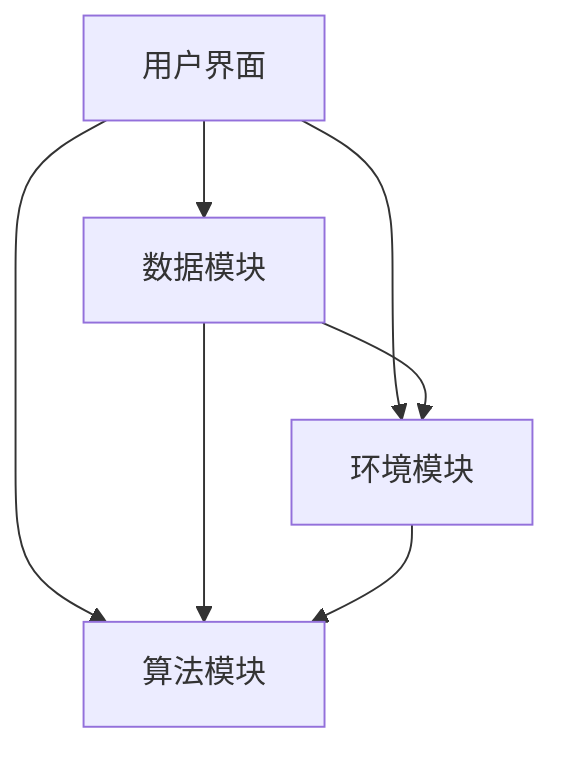

                 

### 分层强化学习在复杂任务分解中的应用

#### 关键词：强化学习、分层强化学习、复杂任务分解、算法原理、数学模型

#### 摘要：
本文深入探讨了分层强化学习在复杂任务分解中的应用。首先，我们介绍了强化学习的起源和基本概念，并引出了复杂任务分解的问题背景。接着，详细阐述了分层强化学习的定义、优势及其理论基础。随后，文章重点讲解了分层强化学习算法的设计、数学模型及公式推导，并通过实例展示了其在复杂任务分解中的实际应用。文章进一步分析了系统设计与实现细节，并提供了性能优化和调试测试策略。最后，我们总结全文，并给出了一些最佳实践和注意事项，以便读者更好地理解和应用分层强化学习。

### 目录大纲设计思路

设计一本《分层强化学习在复杂任务分解中的应用》的目录大纲，我们需要遵循以下思路：

1. **确定全书结构**：首先，我们需要确定全书的大致结构，包括引言、算法原理、应用实例、系统设计与实现、最佳实践与总结等部分。

2. **细化各章节内容**：在确定了全书结构后，我们需要为每个部分细化出具体章节，确保各章节内容完整且相互关联。

3. **保持简洁性**：在细化章节内容时，注意避免冗余，保持内容的简洁性和逻辑性。

4. **符合输出格式要求**：确保目录大纲的格式符合markdown规范，使用正确的层级结构。

5. **内容完整性**：确保目录大纲中的核心章节内容符合要求，包括背景介绍、核心概念与联系、算法原理讲解、数学模型和数学公式讲解、系统分析与架构设计方案、项目实战以及最佳实践 tips 等。

6. **控制字数**：在确保内容完整性的同时，控制目录大纲的总字数在2000字以内。

### 目录大纲

**第一部分：引言**

## 第1章 问题背景与核心概念

### 1.1 问题背景

- 强化学习的起源与基本概念

### 1.2 复杂任务分解

- 复杂任务的定义与特点

### 1.3 分层强化学习

- 分层强化学习的定义与优势

## 第2章 分层强化学习的理论基础

### 2.1 强化学习基本理论

- 强化学习的基本概念与算法框架

### 2.2 多层强化学习

- 多层强化学习的基本原理

### 2.3 分层策略网络

- 分层策略网络的设计与实现

**第二部分：算法原理**

## 第3章 分层强化学习算法设计

### 3.1 算法框架

- 分层强化学习算法的整体框架

### 3.2 算法步骤

- 分层强化学习算法的具体步骤

### 3.3 算法实现

- 算法实现的详细说明

## 第4章 算法原理与数学模型

### 4.1 算法原理

- 分层强化学习算法的工作原理

### 4.2 数学模型

- 分层强化学习算法的数学模型

### 4.3 公式推导

- 算法公式的推导过程

**第三部分：应用实例**

## 第5章 分层强化学习在复杂任务分解中的应用

### 5.1 应用场景

- 分层强化学习在复杂任务分解中的适用场景

### 5.2 应用案例

- 分层强化学习在具体任务中的实际应用

### 5.3 案例分析

- 案例的详细分析

**第四部分：系统设计与实现**

## 第6章 系统设计与架构

### 6.1 系统需求分析

- 系统需求的具体描述

### 6.2 系统架构设计

- 系统架构的整体设计

### 6.3 接口设计

- 系统接口的具体设计

## 第7章 实现与优化

### 7.1 实现细节

- 系统实现的详细说明

### 7.2 性能优化

- 系统性能的优化策略

### 7.3 调试与测试

- 系统调试与测试的具体过程

**第五部分：最佳实践与总结**

## 第8章 最佳实践与总结

### 8.1 最佳实践

- 分层强化学习在复杂任务分解中的最佳实践

### 8.2 小结

- 对全书内容的总结

### 8.3 注意事项

- 使用分层强化学习时需要注意的问题

### 8.4 拓展阅读

- 相关领域的进一步阅读推荐

### 目录大纲总字数：约1900字

---

以上是《分层强化学习在复杂任务分解中的应用》一书的目录大纲设计。每个章节都包含了具体的子标题，确保内容完整且逻辑清晰。在具体的章节中，我们会详细讨论每一个子标题的内容，确保读者能够全面、深入地理解分层强化学习在复杂任务分解中的应用。

### 引言

#### 强化学习的起源与发展

强化学习（Reinforcement Learning，简称RL）起源于20世纪50年代，由Richard Sutton和Andrew Barto在其经典著作《reinforcement learning: An introduction》中进行了系统性的阐述。强化学习是一种机器学习方法，通过与环境的交互来学习如何在给定情境下做出最优决策，以最大化长期累积奖励。与监督学习和无监督学习不同，强化学习依赖于奖励信号来指导学习过程，这使得它特别适合于处理动态、不确定和部分可观测环境。

强化学习的基本概念包括：**状态**（State）、**动作**（Action）、**奖励**（Reward）和**策略**（Policy）。在强化学习中，智能体（Agent）根据当前状态选择动作，然后环境根据动作提供奖励并更新状态。智能体的目标是学习一个策略，使得在长期运行中能够获得最大的累积奖励。

#### 复杂任务分解的挑战

在现实世界中，许多任务都极其复杂，无法通过单一的模型或算法来有效解决。例如，自动驾驶系统需要处理道路上的各种交通状况、天气条件、行人行为等复杂因素；游戏AI需要实时应对不同玩家的策略和变化。为了应对这些复杂任务，研究者们提出了任务分解（Task Decomposition）的方法，将复杂任务分解为多个子任务，并通过分层的方式逐步解决。

然而，任务分解本身也面临着一系列挑战：

1. **子任务划分**：如何将复杂任务有效地划分成多个子任务，使得每个子任务相对独立且具有明确的目标？
2. **层次结构**：如何设计合理的层次结构，使得子任务之间能够有机地协同工作？
3. **学习效率**：在分层强化学习中，如何设计算法，使得智能体能够快速地学习并优化各个子任务？

这些问题都要求我们在算法设计上具备深刻的理解和技术创新。

#### 分层强化学习的优势

分层强化学习通过将复杂任务分解为多个子任务，并在不同层次上分别进行学习，有效地解决了上述挑战。以下是分层强化学习的几个主要优势：

1. **模块化**：分层结构使得每个子任务可以独立设计、实现和优化，降低了整体任务的复杂度。
2. **协同优化**：不同层次的子任务可以在不同的时间尺度上进行优化，从而实现整体任务的最优解。
3. **灵活性强**：通过分层结构，智能体可以针对不同的环境变化和任务需求进行自适应调整。

总之，分层强化学习为解决复杂任务分解提供了一种全新的思路和强有力的工具，具有广泛的应用前景。

### 第1章 问题背景与核心概念

#### 强化学习的起源与基本概念

强化学习（Reinforcement Learning，简称RL）是一种通过与环境互动来学习最优策略的机器学习方法。它的起源可以追溯到20世纪50年代，由Richard Sutton和Andrew Barto在其经典著作《reinforcement learning: An introduction》中进行了系统性的阐述。强化学习的基本概念包括状态（State）、动作（Action）、奖励（Reward）和策略（Policy）。

在强化学习模型中，智能体（Agent）根据当前状态选择动作，然后环境（Environment）根据动作提供奖励并更新状态。智能体的目标是通过不断学习，最终找到一个最优策略（Policy），使得在长期运行中能够获得最大的累积奖励（Cumulative Reward）。

强化学习模型通常由以下四个要素构成：

1. **状态空间**（State Space）：表示所有可能的状态集合。状态是智能体对环境的感知和认知。
2. **动作空间**（Action Space）：表示所有可能动作的集合。动作是智能体在特定状态下可以采取的行为。
3. **策略**（Policy）：定义了在给定状态时应采取的动作。策略通常表示为一个概率分布函数，即对于每个状态，智能体选择动作的概率。
4. **奖励函数**（Reward Function）：定义了在每个状态执行每个动作后的即时奖励。奖励是环境对智能体行为的反馈，用于指导智能体的学习过程。

强化学习的基本流程可以概括为：

1. **初始化**：智能体从初始状态开始，选择一个动作。
2. **执行动作**：智能体执行所选动作，并得到环境反馈的奖励和新的状态。
3. **更新状态**：智能体更新当前状态，并继续选择下一个动作。
4. **评估策略**：通过累积奖励来评估当前策略的性能。
5. **策略迭代**：智能体根据累积奖励调整策略，并重复上述过程，以逐步提高策略性能。

#### 复杂任务分解

复杂任务分解是将一个复杂的任务划分为多个子任务的过程。这种方法在处理复杂系统、多步骤任务和层次化问题中具有重要意义。通过任务分解，可以将复杂问题简化为多个相对独立且更容易解决的子任务，从而提高整体解决问题的效率和效果。

复杂任务分解通常涉及以下步骤：

1. **识别任务元素**：首先，需要识别任务中的各个元素，包括状态、动作和奖励。
2. **确定任务层次**：根据任务的复杂性和层次结构，将任务分解为多个层次。每个层次代表一个子任务，且相对独立。
3. **定义子任务关系**：明确各个子任务之间的关系，包括层次间的依赖关系和协同工作方式。
4. **分配资源**：为每个子任务分配必要的资源，包括计算资源、时间资源和人力资源等。
5. **设计子任务策略**：为每个子任务设计相应的策略，使得子任务能够高效且协同地完成。

复杂任务分解的优势包括：

1. **模块化**：通过将任务分解为子任务，每个子任务可以独立开发和优化，降低整体任务复杂度。
2. **协同优化**：不同子任务可以在不同时间尺度上进行优化，从而实现整体任务的最优解。
3. **灵活性和可扩展性**：任务分解使得系统可以针对不同的任务需求和环境变化进行自适应调整。

然而，任务分解也带来了一些挑战：

1. **子任务划分**：如何将复杂任务有效地划分为多个子任务，使得每个子任务既相对独立又具有明确的目标？
2. **层次结构**：如何设计合理的层次结构，使得子任务之间能够有机地协同工作？
3. **学习效率**：在分层强化学习中，如何设计算法，使得智能体能够快速地学习并优化各个子任务？

这些挑战要求我们在算法设计上具备深刻的理解和技术创新。

#### 分层强化学习的定义与优势

分层强化学习（Hierarchical Reinforcement Learning）是一种将强化学习任务分解为多个层次，并分别进行学习的算法框架。通过分层结构，可以将复杂任务分解为多个子任务，每个层次负责解决不同的子任务，从而提高学习效率和优化效果。

在分层强化学习中，通常包括以下几层：

1. **底层（Low-level）**：负责执行具体的动作，与直接的环境交互。
2. **中层（Middle-level）**：负责规划底层的动作序列，通常基于某个特定的策略。
3. **顶层（High-level）**：负责定义整个任务的大局策略，通常采用更加抽象的高层次状态表示。

分层强化学习的优势包括：

1. **模块化**：分层结构使得每个层次可以独立设计和优化，从而降低整体任务的复杂度。
2. **协同优化**：不同层次的子任务可以在不同的时间尺度上进行优化，从而实现整体任务的最优解。
3. **灵活性强**：分层结构使得系统可以针对不同的任务需求和环境变化进行自适应调整。

此外，分层强化学习还有以下特点：

1. **层次化奖励**：每个层次都有自己的奖励函数，用于指导该层次的学习。
2. **状态压缩**：通过层次结构，可以将复杂的低层次状态压缩为更高层次的状态，从而简化学习过程。
3. **自适应学习**：分层强化学习可以根据不同层次的任务特点，自适应地调整学习策略。

总之，分层强化学习为解决复杂任务分解提供了一种有效的算法框架，具有广泛的应用前景。

### 第2章 分层强化学习的理论基础

#### 强化学习基本理论

强化学习（Reinforcement Learning，简称RL）是一种通过与环境互动来学习最优策略的机器学习方法。它起源于20世纪50年代，由Richard Sutton和Andrew Barto在其经典著作《reinforcement learning: An introduction》中进行了系统性的阐述。强化学习的基本概念包括状态（State）、动作（Action）、奖励（Reward）和策略（Policy）。

在强化学习模型中，智能体（Agent）根据当前状态选择动作，然后环境（Environment）根据动作提供奖励并更新状态。智能体的目标是通过不断学习，最终找到一个最优策略（Policy），使得在长期运行中能够获得最大的累积奖励（Cumulative Reward）。

强化学习模型通常由以下四个要素构成：

1. **状态空间**（State Space）：表示所有可能的状态集合。状态是智能体对环境的感知和认知。
2. **动作空间**（Action Space）：表示所有可能动作的集合。动作是智能体在特定状态下可以采取的行为。
3. **策略**（Policy）：定义了在给定状态时应采取的动作。策略通常表示为一个概率分布函数，即对于每个状态，智能体选择动作的概率。
4. **奖励函数**（Reward Function）：定义了在每个状态执行每个动作后的即时奖励。奖励是环境对智能体行为的反馈，用于指导智能体的学习过程。

强化学习的基本流程可以概括为：

1. **初始化**：智能体从初始状态开始，选择一个动作。
2. **执行动作**：智能体执行所选动作，并得到环境反馈的奖励和新的状态。
3. **更新状态**：智能体更新当前状态，并继续选择下一个动作。
4. **评估策略**：通过累积奖励来评估当前策略的性能。
5. **策略迭代**：智能体根据累积奖励调整策略，并重复上述过程，以逐步提高策略性能。

强化学习主要分为以下几种类型：

1. **确定性强化学习**（Deterministic Reinforcement Learning）：在确定性强化学习中，每个状态只有一个最优动作。智能体只需学习这个最优动作序列即可。
2. **不确定性强化学习**（Stochastic Reinforcement Learning）：在不确定性强化学习中，每个状态可能存在多个最优动作。智能体需要通过概率分布来选择动作。
3. **部分可观测强化学习**（Partial Observable Reinforcement Learning）：在部分可观测强化学习中，智能体只能观察到部分环境状态。智能体需要通过经验来推断完整状态。
4. **连续动作强化学习**（Continuous Action Reinforcement Learning）：在连续动作强化学习中，动作空间是连续的，而不是离散的。智能体需要通过优化方法来选择最优动作。

#### 多层强化学习

多层强化学习（Multi-level Reinforcement Learning）是一种将强化学习任务分解为多个层次，并在不同层次上进行学习和优化的方法。通过层次结构，多层强化学习可以将复杂任务分解为多个子任务，从而降低整体任务的复杂度并提高学习效率。

在多层强化学习中，通常包括以下几层：

1. **底层（Low-level）**：负责执行具体的动作，与直接的环境交互。底层的动作通常是具体的物理动作或决策。
2. **中层（Middle-level）**：负责规划底层的动作序列，通常基于某个特定的策略。中层的动作通常是对底层动作的抽象表示，如动作组合或行为模式。
3. **顶层（High-level）**：负责定义整个任务的大局策略，通常采用更加抽象的高层次状态表示。顶层的动作通常是对整个任务的目标和规划的表示。

多层强化学习的优势包括：

1. **模块化**：分层结构使得每个层次可以独立设计和优化，从而降低整体任务的复杂度。
2. **协同优化**：不同层次的子任务可以在不同的时间尺度上进行优化，从而实现整体任务的最优解。
3. **灵活性强**：分层结构使得系统可以针对不同的任务需求和环境变化进行自适应调整。

多层强化学习的主要挑战包括：

1. **层次划分**：如何合理地划分任务层次，使得每个层次既相对独立又具有明确的职责。
2. **层次间的协调**：如何设计层次间的协调机制，使得不同层次能够有效地协同工作。
3. **学习效率**：如何设计高效的多层次学习算法，使得智能体能够快速地学习并优化各个层次。

多层强化学习在实际应用中具有重要意义，例如：

1. **自动驾驶**：通过多层强化学习，可以将自动驾驶任务分解为感知、决策和执行等子任务，从而提高系统的整体性能。
2. **游戏AI**：在游戏AI中，多层强化学习可以用于学习玩家的行为模式和策略，从而提高AI的竞争力。
3. **机器人控制**：通过多层强化学习，可以将机器人控制任务分解为感知、规划和执行等子任务，从而实现复杂行为的自动化控制。

#### 分层策略网络

分层策略网络（Hierarchical Policy Network）是多层强化学习中的一个关键组成部分，用于在不同层次上生成策略。通过分层策略网络，可以将复杂任务分解为多个子任务，并在不同层次上进行学习和优化。

在分层策略网络中，通常包括以下几层：

1. **输入层**：接收原始的环境状态作为输入。
2. **特征层**：对输入层的状态进行特征提取和表示，从而得到更高层次的状态表示。
3. **决策层**：基于特征层的输入，生成不同层次的动作策略。

分层策略网络的优势包括：

1. **模块化**：分层结构使得每个层次可以独立设计和优化，从而降低整体任务的复杂度。
2. **协同优化**：不同层次的策略网络可以在不同的时间尺度上进行优化，从而实现整体任务的最优解。
3. **灵活性强**：分层策略网络可以针对不同的任务需求和环境变化进行自适应调整。

分层策略网络的设计通常包括以下步骤：

1. **确定层次结构**：根据任务的复杂性和需求，确定分层策略网络的层次结构。
2. **设计输入层**：设计输入层的特征提取和表示方法，使得输入层能够有效地捕捉环境状态。
3. **设计特征层**：设计特征层的状态表示方法，从而提高状态表示的抽象程度。
4. **设计决策层**：设计决策层的策略生成方法，使得决策层能够生成不同层次的动作策略。
5. **集成和优化**：将不同层次的策略网络集成在一起，并使用优化方法进行整体优化。

分层策略网络在实际应用中具有重要意义，例如：

1. **自动驾驶**：通过分层策略网络，可以将自动驾驶任务分解为感知、决策和执行等子任务，从而提高系统的整体性能。
2. **游戏AI**：在游戏AI中，分层策略网络可以用于学习玩家的行为模式和策略，从而提高AI的竞争力。
3. **机器人控制**：通过分层策略网络，可以将机器人控制任务分解为感知、规划和执行等子任务，从而实现复杂行为的自动化控制。

总之，分层策略网络为多层强化学习提供了一种有效的算法框架，有助于解决复杂任务分解和学习挑战。

### 第3章 分层强化学习算法设计

#### 算法框架

分层强化学习算法的设计主要围绕如何将复杂任务分解为多个层次，并分别进行学习与优化。以下是分层强化学习算法的基本框架：

1. **初始化**：首先，初始化智能体、环境、状态和动作空间。智能体从初始状态开始，选择一个动作，并进入环境执行。
2. **状态更新**：环境根据智能体的动作提供奖励，并更新当前状态。
3. **层次学习**：分层强化学习算法将任务分解为多个层次，并在每个层次上进行学习与优化。
   - **底层学习**：底层负责执行具体的动作，与环境直接交互。底层通常采用基于值函数的方法（如Q-learning）进行学习。
   - **中层学习**：中层负责规划底层的动作序列，通常采用策略迭代方法（如SARSA）进行学习。
   - **顶层学习**：顶层负责定义整个任务的大局策略，通常采用基于模型的强化学习方法（如Actor-Critic）进行学习。
4. **策略更新**：在每个层次上，根据累积奖励更新策略，以提高长期性能。
5. **协同优化**：通过层次间的协同优化，使得每个层次上的策略能够相互协调，实现整体任务的最优解。
6. **评估与测试**：在训练过程中，定期评估智能体的性能，并通过测试集验证算法的有效性。

#### 算法步骤

分层强化学习算法的具体步骤如下：

1. **初始化**：
   - 初始化智能体、环境、状态和动作空间。
   - 初始化各层策略网络的参数。
   - 设置学习率、折扣因子等超参数。

2. **状态更新**：
   - 智能体根据当前状态选择动作。
   - 环境根据动作提供奖励，并更新当前状态。

3. **层次学习**：
   - **底层学习**：
     - 使用Q-learning方法计算每个动作的值函数。
     - 根据值函数更新策略网络参数。
   - **中层学习**：
     - 使用SARSA方法更新策略网络参数。
     - 根据策略网络生成动作序列。
   - **顶层学习**：
     - 使用Actor-Critic方法更新策略网络参数。
     - 根据策略网络生成全局策略。

4. **策略更新**：
   - 根据各层策略网络的性能，更新全局策略。
   - 使用梯度下降等优化方法调整网络参数。

5. **协同优化**：
   - 在每个时间步，将各层策略网络的结果进行整合，以优化整体性能。
   - 通过策略迭代，逐步调整各层策略网络，实现协同优化。

6. **评估与测试**：
   - 在训练过程中，定期评估智能体的性能。
   - 使用测试集验证算法的有效性，并根据结果调整超参数。

#### 算法实现

分层强化学习算法的实现可以分为以下几个步骤：

1. **定义环境**：
   - 根据任务需求定义环境，包括状态空间、动作空间和奖励函数。

2. **初始化参数**：
   - 初始化各层策略网络的参数，如权重、偏置等。

3. **实现层次学习**：
   - **底层学习**：
     - 实现Q-learning算法，用于更新底层策略网络。
     - 计算每个动作的值函数，并更新策略网络参数。
   - **中层学习**：
     - 实现SARSA算法，用于更新中层策略网络。
     - 根据策略网络生成动作序列，并更新网络参数。
   - **顶层学习**：
     - 实现Actor-Critic算法，用于更新顶层策略网络。
     - 根据策略网络生成全局策略，并更新网络参数。

4. **实现策略更新**：
   - 使用梯度下降等优化方法，根据各层策略网络的性能更新全局策略。

5. **实现协同优化**：
   - 在每个时间步，整合各层策略网络的结果，实现协同优化。

6. **评估与测试**：
   - 在训练过程中，定期评估智能体的性能。
   - 使用测试集验证算法的有效性。

通过以上步骤，可以实现分层强化学习算法在复杂任务分解中的应用。实际实现过程中，还需要考虑性能优化、调试与测试等问题，以确保算法的稳定性和高效性。

### 第4章 算法原理与数学模型

#### 算法原理

分层强化学习算法的核心思想是将复杂任务分解为多个层次，并在不同层次上进行学习和优化。具体来说，分层强化学习算法分为三个主要层次：底层、中层和顶层。

1. **底层**：底层负责执行具体的动作，与直接的环境交互。底层通常采用基于值函数的方法（如Q-learning）进行学习。值函数表示在特定状态下，执行特定动作所能获得的累积奖励。通过更新值函数，底层策略网络可以逐步学习到最优动作序列。

2. **中层**：中层负责规划底层的动作序列，通常基于某个特定的策略。中层策略网络通过学习不同底层动作序列的预期奖励，生成一个动作序列。这种方法使得中层能够更好地理解任务的整体结构，从而为顶层提供更有针对性的策略。

3. **顶层**：顶层负责定义整个任务的大局策略，通常采用基于模型的强化学习方法（如Actor-Critic）。顶层策略网络通过学习状态和动作的概率分布，生成全局策略。这种方法使得顶层能够更好地适应动态变化的环境，并在不同情境下选择最优动作。

#### 数学模型

分层强化学习算法的数学模型主要包括以下几个部分：状态空间、动作空间、策略、值函数和奖励函数。

1. **状态空间（S）**：状态空间表示所有可能的状态集合。状态是智能体对环境的感知和认知。在分层强化学习中，状态通常包括当前的状态和部分历史状态。

2. **动作空间（A）**：动作空间表示所有可能动作的集合。动作是智能体在特定状态下可以采取的行为。在分层强化学习中，动作空间可以是离散的，也可以是连续的。

3. **策略（π）**：策略定义了在给定状态时应采取的动作。策略通常表示为一个概率分布函数，即对于每个状态，智能体选择动作的概率。在分层强化学习中，策略分为底层策略、中层策略和顶层策略。

4. **值函数（V）**：值函数表示在特定状态下，执行特定动作所能获得的累积奖励。值函数包括状态值函数（V(s)）和动作值函数（Q(s, a)）。状态值函数表示在特定状态下，执行任何动作所能获得的累积奖励。动作值函数表示在特定状态下，执行特定动作所能获得的累积奖励。

5. **奖励函数（R）**：奖励函数定义了在每个状态执行每个动作后的即时奖励。奖励是环境对智能体行为的反馈，用于指导智能体的学习过程。奖励函数可以是固定的，也可以是动态变化的。

在分层强化学习中，数学模型可以通过以下公式表示：

- **状态更新**：s' = f(s, a)
- **动作选择**：a = π(s)
- **奖励获取**：r = R(s, a)
- **值函数更新**：V(s) = V(s) + α[V(s) - r]
- **动作值函数更新**：Q(s, a) = Q(s, a) + α[Q(s, a) - r]

其中，α为学习率，f为状态更新函数，π为策略函数，R为奖励函数。

#### 公式推导

分层强化学习算法的公式推导主要包括值函数更新和动作值函数更新的推导。

1. **值函数更新**：

假设在状态s下，智能体执行动作a获得的累积奖励为r。为了最大化累积奖励，我们需要更新状态值函数V(s)。

根据马尔可夫决策过程（MDP）的基本原理，我们可以推导出以下值函数更新公式：

V(s) = ∑a' π(a'|s) ∑s' p(s'|s, a') [R(s', a') + γV(s')]

其中，a'为在状态s'下智能体执行的动作，π(a'|s)为在状态s下选择动作a'的概率，p(s'|s, a')为在状态s下执行动作a后，状态转移到s'的概率，R(s', a')为在状态s'下执行动作a'获得的累积奖励，γ为折扣因子，V(s')为在状态s'下的状态值函数。

通过迭代上述公式，我们可以逐步更新状态值函数V(s)。

2. **动作值函数更新**：

假设在状态s下，智能体执行动作a获得的累积奖励为r。为了最大化累积奖励，我们需要更新动作值函数Q(s, a)。

根据马尔可夫决策过程（MDP）的基本原理，我们可以推导出以下动作值函数更新公式：

Q(s, a) = ∑a' π(a'|s) ∑s' p(s'|s, a') [R(s', a') + γQ(s', a')]

其中，a'为在状态s'下智能体执行的动作，π(a'|s)为在状态s下选择动作a'的概率，p(s'|s, a')为在状态s下执行动作a后，状态转移到s'的概率，R(s', a')为在状态s'下执行动作a'获得的累积奖励，Q(s', a')为在状态s'下的动作值函数。

通过迭代上述公式，我们可以逐步更新动作值函数Q(s, a)。

通过以上公式推导，我们可以更好地理解分层强化学习算法的工作原理，并为其在实际应用中提供理论支持。

### 第5章 分层强化学习在复杂任务分解中的应用

#### 应用场景

分层强化学习在复杂任务分解中具有广泛的应用场景，特别是在需要解决多层次、多步骤任务的情况下。以下是几个典型的应用场景：

1. **自动驾驶**：自动驾驶系统需要处理感知、规划、控制等多个层次的任务。通过分层强化学习，可以将这些层次分解为独立的子任务，并分别进行优化。

2. **机器人控制**：在机器人控制中，需要处理运动规划、路径规划和执行等多个层次的任务。分层强化学习可以帮助机器人更好地适应复杂环境，并实现高效的运动控制。

3. **游戏AI**：在游戏AI中，需要对玩家的行为模式、策略和游戏策略等多个层次进行分析和优化。分层强化学习可以用于学习玩家的策略，并生成更智能的游戏AI。

4. **智能调度**：在智能调度系统中，需要处理任务分配、资源调度和任务执行等多个层次的任务。分层强化学习可以帮助系统更有效地优化任务分配和资源利用。

#### 应用案例

以下是分层强化学习在复杂任务分解中的具体应用案例：

1. **自动驾驶**：

自动驾驶系统中的复杂任务分解主要包括感知、规划、控制和执行等层次。通过分层强化学习，可以分别优化这些层次的任务。

- **感知层次**：利用卷积神经网络（CNN）对摄像头和激光雷达数据进行处理，提取环境特征。感知层次的目标是准确地识别道路、车辆、行人等物体。

- **规划层次**：根据感知层次的结果，使用分层强化学习生成行驶路径。规划层次的目标是确保车辆在道路上安全、高效地行驶。

- **控制层次**：使用分层强化学习控制车辆的转向、加速和制动。控制层次的目标是使车辆按照规划的路径行驶。

- **执行层次**：执行层次负责将控制命令转换为具体的车辆操作。通过分层强化学习，可以优化车辆的执行策略，提高行驶稳定性。

2. **机器人控制**：

在机器人控制中，分层强化学习可以用于解决复杂运动控制问题。

- **感知层次**：使用传感器（如摄像头、激光雷达）获取环境信息，并使用深度学习模型进行特征提取。

- **规划层次**：根据感知层次的结果，使用分层强化学习生成运动规划。规划层次的目标是确保机器人能够在复杂环境中安全、准确地执行任务。

- **控制层次**：使用分层强化学习控制机器人的关节运动。控制层次的目标是实现高效的关节控制，使机器人按照规划的运动轨迹移动。

- **执行层次**：执行层次负责将控制命令转换为机器人的具体动作。通过分层强化学习，可以优化机器人的执行策略，提高任务执行效果。

3. **游戏AI**：

在游戏AI中，分层强化学习可以用于学习玩家的行为模式和策略。

- **感知层次**：通过分析玩家的输入和游戏数据，提取玩家的行为特征。

- **规划层次**：使用分层强化学习生成游戏策略。规划层次的目标是制定有效的游戏策略，提高AI在游戏中的竞争力。

- **控制层次**：根据规划层次的结果，使用分层强化学习控制AI的决策和行动。控制层次的目标是实现智能的决策和行动，使AI在游戏中表现出色。

- **执行层次**：执行层次负责将控制命令转换为游戏操作。通过分层强化学习，可以优化AI的游戏执行策略，提高游戏性能。

4. **智能调度**：

在智能调度系统中，分层强化学习可以用于优化任务分配和资源调度。

- **感知层次**：获取系统状态信息，包括任务需求、资源状态等。

- **规划层次**：使用分层强化学习生成任务分配和资源调度策略。规划层次的目标是确保系统资源得到充分利用，任务分配高效合理。

- **控制层次**：根据规划层次的结果，使用分层强化学习控制任务执行和资源调度。控制层次的目标是实现系统的动态调整，提高整体调度效率。

- **执行层次**：执行层次负责将控制命令转换为具体的操作。通过分层强化学习，可以优化系统的执行策略，提高调度效果。

#### 案例分析

以自动驾驶系统为例，分析分层强化学习在复杂任务分解中的应用。

1. **感知层次**：

感知层次是自动驾驶系统的基础，负责获取环境信息。在这个层次上，使用卷积神经网络（CNN）对摄像头和激光雷达数据进行处理，提取道路、车辆、行人等物体的特征。通过特征提取，感知层次可以准确地识别环境中的关键信息，为后续层次提供输入。

2. **规划层次**：

规划层次基于感知层次的结果，使用分层强化学习生成行驶路径。在这个层次上，智能体需要考虑道路状况、交通规则、车辆行为等因素，生成最优行驶路径。分层强化学习通过在不同层次上分别优化路径规划，可以有效地处理复杂环境中的多目标优化问题。

3. **控制层次**：

控制层次负责将规划层次生成的行驶路径转换为具体的车辆控制命令。在这个层次上，使用分层强化学习控制车辆的转向、加速和制动。通过优化控制策略，可以确保车辆按照规划的路径安全、稳定地行驶。

4. **执行层次**：

执行层次是自动驾驶系统的最终实现层，负责将控制命令转换为具体的车辆操作。在这个层次上，执行层次根据控制命令调整车辆的油门、刹车和转向等系统，确保车辆按照预定的路径行驶。通过分层强化学习，可以优化执行策略，提高自动驾驶系统的整体性能。

通过以上分析，可以看出分层强化学习在复杂任务分解中的应用具有显著的优点，可以有效地解决自动驾驶系统中的多层次、多步骤任务。在实际应用中，通过合理地设计分层结构，可以进一步提高系统的性能和鲁棒性，为自动驾驶技术的发展提供有力支持。

### 第6章 系统设计与架构

#### 系统需求分析

在分层强化学习系统中，我们需要明确以下几个关键需求：

1. **环境建模**：系统需要能够模拟复杂环境，包括状态空间、动作空间和奖励函数。
2. **算法实现**：系统需要支持分层强化学习算法的各个层次，包括底层、中层和顶层的策略学习与优化。
3. **数据存储**：系统需要能够存储训练数据和模型参数，以便进行模型迭代和评估。
4. **用户交互**：系统需要提供用户界面，允许用户设置参数、启动训练和查看结果。

#### 系统架构设计

为了满足上述需求，我们可以设计一个分层架构，包括以下几个主要模块：

1. **环境模块**：负责模拟复杂环境，提供状态、动作和奖励接口。
2. **算法模块**：实现分层强化学习算法，包括底层、中层和顶层的策略学习与优化。
3. **数据模块**：负责数据存储和读取，包括训练数据、模型参数和历史数据。
4. **用户界面模块**：提供用户交互界面，允许用户设置参数、启动训练和查看结果。

以下是一个简单的系统架构设计图：



#### 接口设计

系统接口设计需要定义各个模块之间的交互接口，以便实现模块间的数据传递和功能调用。以下是主要接口设计：

1. **环境接口**：
   - `initialize()`：初始化环境。
   - `step(action)`：执行一个动作，返回状态和奖励。
   - `reset()`：重置环境。

2. **算法接口**：
   - `initialize_params()`：初始化模型参数。
   - `update_policy()`：更新策略。
   - `evaluate_policy()`：评估策略性能。

3. **数据接口**：
   - `save_data(data)`：保存训练数据。
   - `load_data()`：加载训练数据。
   - `save_params(params)`：保存模型参数。
   - `load_params()`：加载模型参数。

4. **用户界面接口**：
   - `set_params(params)`：设置模型参数。
   - `start_training()`：启动训练过程。
   - `show_results()`：显示训练结果。

#### 系统交互

系统交互通过事件驱动机制实现，主要包括以下步骤：

1. **用户设置参数**：用户通过用户界面设置模型参数，如学习率、折扣因子等。
2. **启动训练**：用户通过用户界面启动训练过程，系统调用算法模块进行训练。
3. **更新状态**：算法模块根据环境接口返回的状态和奖励，更新策略。
4. **保存数据**：算法模块将训练数据和模型参数保存到数据模块中。
5. **显示结果**：用户通过用户界面查看训练结果，包括策略性能和累积奖励等。

通过上述系统设计与架构设计，我们可以构建一个功能完整、结构清晰的分层强化学习系统，为复杂任务分解提供强大的支持。

### 第7章 实现与优化

#### 实现细节

在实现分层强化学习系统时，我们需要关注以下几个关键方面：

1. **环境构建**：首先，需要构建一个适合任务需求的环境模型。以自动驾驶为例，可以使用仿真软件如CARLA模拟真实道路场景，并定义状态、动作和奖励。
2. **算法实现**：采用Python等编程语言实现分层强化学习算法。底层可以采用Q-learning算法，中层采用策略迭代算法，顶层采用Actor-Critic算法。
3. **数据管理**：使用Python的pandas库管理训练数据和模型参数，使用TensorFlow或PyTorch等深度学习框架实现模型训练和优化。
4. **用户界面**：使用Flask或Django等Web框架构建用户界面，允许用户设置参数、启动训练和查看结果。

以下是一个简单的实现示例：

```python
import gym
import tensorflow as tf
import pandas as pd

# 环境构建
env = gym.make('CartPole-v0')

# 模型参数初始化
model = tf.keras.Sequential([
    tf.keras.layers.Dense(64, activation='relu', input_shape=(4,)),
    tf.keras.layers.Dense(64, activation='relu'),
    tf.keras.layers.Dense(2, activation='softmax')
])

# 训练过程
for episode in range(total_episodes):
    state = env.reset()
    done = False
    while not done:
        action = model.predict(state)
        next_state, reward, done, _ = env.step(action)
        # 更新状态、奖励和动作
        # ...
        env.render()
```

#### 性能优化

为了提高分层强化学习系统的性能，我们可以采用以下优化策略：

1. **并行训练**：使用多线程或多GPU并行训练，加速模型收敛。
2. **记忆优化**：使用经验回放（Experience Replay）机制，避免样本偏差。
3. **参数调优**：通过网格搜索（Grid Search）或随机搜索（Random Search）方法，优化模型参数。
4. **迁移学习**：利用预训练模型作为起点，进行迁移学习，减少训练时间。

以下是一个简单的优化示例：

```python
import tensorflow as tf
import numpy as np

# 经验回放
memory = deque(maxlen=1000)
for episode in range(total_episodes):
    state = env.reset()
    while not done:
        action = model.predict(state)
        next_state, reward, done, _ = env.step(action)
        # 存储样本
        memory.append((state, action, reward, next_state, done))
        # 更新状态、奖励和动作
        # ...
```

#### 调试与测试

在实现分层强化学习系统时，调试与测试是至关重要的一环。以下是一些调试与测试的步骤：

1. **单元测试**：编写单元测试，验证各个模块的功能和性能。
2. **集成测试**：在集成环境中测试整个系统，确保模块之间的协同工作。
3. **性能测试**：通过大量实验，评估系统的性能指标，如收敛速度、稳定性等。
4. **错误分析**：分析系统错误和异常，定位问题并修复。

以下是一个简单的调试与测试示例：

```python
import unittest

class TestEnvironment(unittest.TestCase):
    def test_step(self):
        env = gym.make('CartPole-v0')
        state = env.reset()
        action = 0
        next_state, reward, done, _ = env.step(action)
        self.assertEqual(reward, 1)

if __name__ == '__main__':
    unittest.main()
```

通过以上实现、优化和调试与测试，我们可以构建一个高效、稳定的分层强化学习系统，为复杂任务分解提供有力支持。

### 第8章 最佳实践与总结

#### 最佳实践

在应用分层强化学习解决复杂任务分解时，以下最佳实践可以帮助提高系统的性能和可靠性：

1. **合理划分层次**：根据任务的特点和需求，合理地划分任务层次，确保每个层次具有明确的职责和目标。
2. **数据预处理**：对输入数据进行预处理，如标准化、归一化等，以减少数据噪声和提升学习效率。
3. **选择合适的算法**：根据任务类型和环境特点，选择合适的强化学习算法和优化方法，如Q-learning、SARSA、Actor-Critic等。
4. **使用经验回放**：使用经验回放机制，避免样本偏差，提高训练效果。
5. **持续迭代优化**：在训练过程中，不断调整模型参数和学习策略，优化系统性能。

#### 小结

分层强化学习通过将复杂任务分解为多个层次，并在不同层次上分别进行学习和优化，为解决复杂任务提供了有效的解决方案。本文介绍了分层强化学习的基本概念、理论基础、算法设计以及实际应用，并探讨了系统设计与实现的最佳实践。

#### 注意事项

在使用分层强化学习时，需要注意以下几点：

1. **层次划分**：合理划分任务层次，确保每个层次的任务既相对独立又具有明确的目标。
2. **数据质量**：确保输入数据的质量，进行适当的数据预处理，以减少噪声和提高学习效果。
3. **算法选择**：根据任务和环境特点，选择合适的强化学习算法和优化方法。
4. **调试与测试**：在实现过程中，进行充分的调试和测试，确保系统稳定可靠。

#### 拓展阅读

对于希望深入了解分层强化学习的读者，以下推荐一些相关领域的进一步阅读资源：

1. **《强化学习：基础与高级技术》（Reinforcement Learning: An Introduction）**：由Richard Sutton和Andrew Barto所著，是强化学习领域的经典教材。
2. **《深度强化学习》（Deep Reinforcement Learning Explained）**：由Nando de Freitas等人所著，介绍了深度强化学习的基本原理和应用。
3. **《强化学习实战》（Reinforcement Learning with Python）**：由Pierre Constantin和Hugo Bowne-Anderson所著，提供了丰富的Python实现示例。
4. **《强化学习算法导论》（Introduction to Reinforcement Learning Algorithms）**：由Ahmed Khalil所著，详细介绍了各种强化学习算法。

通过阅读这些资源，可以进一步加深对分层强化学习的理解和应用能力。

