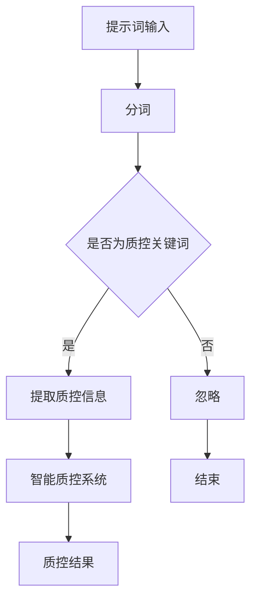
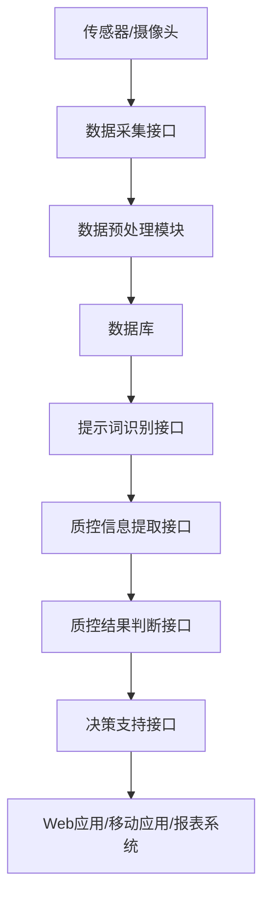

                 

# 制造业质检员：提示词驱动的智能质控系统

## 关键词

- 制造业
- 质检员
- 智能质控系统
- 提示词
- 人工智能

## 摘要

本文探讨制造业质检员面临的挑战以及智能质控系统的崛起。通过引入提示词驱动的智能质控系统，我们旨在解决质检员工作强度大、效率低的问题。本文将详细分析提示词驱动的智能质控系统的原理、实现方法以及在实际应用中的效果，为制造业质控领域提供新的解决方案。

## 第一部分：引言

### 1.1 背景介绍

制造业是国民经济的重要支柱，随着科技的进步，制造业正在经历前所未有的变革。然而，在制造业中，质检员的工作却依然面临巨大的挑战。传统的质检方式主要依赖于质检员的个人经验和专业技能，这种方式不仅效率低下，而且容易出现误判。

制造业质检员的工作主要包括对生产出来的产品进行质量检查，确保产品的质量符合标准。然而，随着生产规模的扩大和生产过程的复杂化，质检员的工作压力越来越大。一方面，质检员需要面对大量重复性的工作，导致工作效率低下；另一方面，质检员的主观判断容易受到个人因素的影响，从而导致质量问题的发生。

### 1.2 智能质控系统的崛起

为了解决质检员面临的挑战，智能质控系统的出现为制造业带来了新的希望。智能质控系统通过引入人工智能技术，实现了对生产过程的自动监控和自动质检，大大提高了质检的效率和准确性。

智能质控系统主要包括以下几个核心组成部分：传感器、数据采集和处理系统、智能分析算法以及决策支持系统。传感器负责实时采集生产过程中的各种数据，如温度、湿度、压力等。数据采集和处理系统负责将这些数据传输到智能分析算法，算法通过对数据的分析和处理，实现对生产过程的监控和质检。决策支持系统则根据分析结果，提供相应的决策支持，如生产过程的调整、故障排除等。

### 1.3 问题描述

质检员工作强度大，效率低是制造业质控中普遍存在的问题。一方面，质检员需要花费大量的时间和精力进行质量检查，导致工作效率低下；另一方面，质检员的主观判断容易受到个人因素的影响，从而导致质量问题的发生。此外，传统的质控系统存在一定的局限性，如检测范围有限、检测速度慢等，无法满足现代制造业的高效生产需求。

### 1.4 问题解决

为了解决上述问题，我们引入了提示词驱动的智能质控系统。提示词驱动的智能质控系统通过利用人工智能技术，实现了对生产过程的自动监控和自动质检。具体来说，系统通过识别和分析生产过程中的关键提示词，实现对产品质量的实时监控和智能质检。

### 1.5 边界与外延

制造业质检员的工作范围包括生产线的各个环节，如原材料检查、生产过程监控、成品检验等。智能质控系统适用于各种制造业场景，如汽车制造、电子制造、食品制造等。此外，智能质控系统还可以与其他系统进行集成，如生产管理系统、仓储系统等，实现全面的生产过程监控和质量管理。

### 1.6 核心概念结构

在本节中，我们主要介绍了制造业质检员面临的挑战、智能质控系统的崛起以及提示词驱动的智能质控系统的概念。这些核心概念构成了本文的框架，为后续内容提供了基础。

## 第二部分：提示词驱动的智能质控系统原理

### 2.1 核心概念与联系

在提示词驱动的智能质控系统中，核心概念主要包括提示词、智能质控系统和关联关系。提示词是用于引导和辅助质检员进行质控工作的关键词或短语。智能质控系统则是利用人工智能技术，通过对提示词的解析和处理，实现自动化的质控工作。关联关系则是指提示词与质检员、质控系统之间的相互作用和依赖关系。

### 2.2 概念属性特征对比

下面是一个概念属性特征对比表格，用于更直观地展示提示词、智能质控系统和关联关系的属性特征。

| 概念        | 描述                                                                                   |  
| ----------- | ------------------------------------------------------------------------------------ |  
| 提示词      | 用于引导和辅助质检员进行质控工作的关键词或短语。                                     |  
| 智能质控系统 | 利用人工智能技术，通过对提示词的解析和处理，实现自动化的质控工作。                   |  
| 关联关系     | 提示词与质检员、质控系统之间的相互作用和依赖关系。                                   |

### 2.3 ER实体关系图

下面是一个ER实体关系图，用于展示提示词、质检员和智能质控系统之间的实体关系。

```
+--------------+       +---------------+       +----------------+
|  质检员     |<----->|  提示词      |<----->|  智能质控系统 |
+--------------+       +---------------+       +----------------+
| id (主键)   |       | id (主键)    |       | id (主键)    |
| 姓名        |       | 关键词/短语  |       | 名称          |
| 职责        |       | 描述          |       | 功能          |
+--------------+       +---------------+       +----------------+
```

### 2.4 算法原理

#### 2.4.1 提示词解析算法

提示词解析算法是提示词驱动的智能质控系统的核心组成部分。该算法通过对采集到的提示词进行解析，提取出与质控相关的重要信息，并将其传递给智能质控系统进行处理。

下面是一个简单的提示词解析算法流程图：



#### 2.4.2 Python 源代码

以下是一个简单的Python源代码示例，用于实现提示词解析算法：

```python
def parse_hint(hint):
    # 分词
    words = split(hint)
    # 判断是否为质控关键词
    if is_quality_keyword(words):
        # 提取质控信息
        quality_info = extract_quality_info(words)
        # 交给智能质控系统处理
        result = quality_system.process(quality_info)
    else:
        result = "忽略"
    return result
```

#### 2.4.3 数学模型与公式

提示词解析算法的数学模型可以表示为以下公式：

$$
\text{质控结果} = \begin{cases} 
\text{质量合格} & \text{如果} \quad \text{提示词} \in \text{质控关键词集} \\
\text{质量不合格} & \text{如果} \quad \text{提示词} \not\in \text{质控关键词集} 
\end{cases}
$$

#### 2.4.4 详细讲解与举例说明

假设我们有一个提示词“产品表面有划痕”，这是一个典型的质控关键词。根据提示词解析算法，我们将进行以下步骤：

1. **分词**：将提示词“产品表面有划痕”进行分词，得到“产品”、“表面”、“有”、“划痕”四个词。
2. **判断是否为质控关键词**：检查每个词是否属于质控关键词集。例如，“产品”和“划痕”可能是质控关键词，而“有”和“表面”则可能不是。
3. **提取质控信息**：如果提示词中的词属于质控关键词集，则提取相关的质控信息。例如，我们可以提取出“产品”和“划痕”这两个词的信息。
4. **交给智能质控系统处理**：将提取出的质控信息传递给智能质控系统进行处理。例如，智能质控系统可能会根据这些信息来判断产品质量是否合格，并采取相应的措施。
5. **质控结果**：根据智能质控系统的处理结果，判断产品质量是否合格。

通过以上步骤，我们就可以实现对提示词的解析和处理，从而实现智能质控。

## 第三部分：系统分析与架构设计方案

### 3.1 问题场景介绍

在制造业中，质检是一个至关重要的环节，它直接关系到产品的质量和企业的声誉。随着生产规模的扩大和产品质量要求的提高，传统的质检方式已经无法满足现代制造业的需求。因此，我们需要引入智能质控系统，以提高质检效率和准确性。

### 3.2 项目介绍

本项目旨在开发一套提示词驱动的智能质控系统，用于对生产过程中的产品进行实时监控和质检。系统将基于人工智能技术，通过对提示词的解析和处理，实现自动化的质控工作。

### 3.3 系统功能设计

系统的主要功能包括：

1. **数据采集**：通过传感器和摄像头等设备，实时采集生产过程中的各种数据，如温度、湿度、压力等。
2. **数据预处理**：对采集到的数据进行预处理，包括去噪、滤波、归一化等操作，以提高数据的质量和可靠性。
3. **提示词识别**：利用自然语言处理技术，对采集到的数据进行处理，识别出与质控相关的提示词。
4. **质控信息提取**：根据识别出的提示词，提取出与质控相关的信息，如产品缺陷、异常情况等。
5. **质控结果判断**：将提取出的质控信息传递给智能质控系统，进行质量判断，并生成质控报告。
6. **决策支持**：根据质控结果，提供相应的决策支持，如生产线的调整、故障排除等。

### 3.4 系统架构设计

系统采用分层架构设计，包括感知层、数据层、算法层和应用层。具体架构如下：

1. **感知层**：包括传感器、摄像头等设备，用于实时采集生产过程中的数据。
2. **数据层**：包括数据采集模块、数据预处理模块和数据库，用于存储和处理采集到的数据。
3. **算法层**：包括提示词识别模块、质控信息提取模块和智能质控模块，用于实现质控算法。
4. **应用层**：包括Web应用、移动应用和报表系统等，用于展示质控结果和提供决策支持。

### 3.5 系统接口设计和系统交互

系统采用RESTful API设计，提供以下接口：

1. **数据采集接口**：用于接收传感器和摄像头等设备上传的数据。
2. **数据预处理接口**：用于对采集到的数据进行预处理。
3. **提示词识别接口**：用于识别出与质控相关的提示词。
4. **质控信息提取接口**：用于提取出与质控相关的信息。
5. **质控结果判断接口**：用于判断产品质量是否合格，并生成质控报告。
6. **决策支持接口**：用于提供决策支持。

系统交互示意图如下：



## 第四部分：项目实战

### 4.1 环境安装

在进行项目实战之前，我们需要搭建一个合适的环境。以下是环境安装的步骤：

1. **安装Python**：确保已经安装了Python环境，版本要求为3.6及以上。
2. **安装依赖库**：在终端中执行以下命令，安装所需的依赖库：

   ```bash
   pip install numpy pandas scikit-learn matplotlib
   ```

3. **安装传感器和摄像头**：根据实际需求，安装相应的传感器和摄像头设备。

### 4.2 系统核心实现源代码

以下是系统核心实现的源代码，包括数据采集、预处理、提示词识别、质控信息提取和质控结果判断等模块。

```python
# 数据采集模块
def collect_data():
    # 这里根据具体传感器和摄像头设备，实现数据采集功能
    pass

# 数据预处理模块
def preprocess_data(data):
    # 数据预处理操作，如去噪、滤波、归一化等
    pass

# 提示词识别模块
def recognize_hint(data):
    # 提示词识别算法实现
    pass

# 质控信息提取模块
def extract_quality_info(hint):
    # 提取与质控相关的信息
    pass

# 质控结果判断模块
def judge_quality(info):
    # 质控结果判断算法实现
    pass

# 系统主函数
def main():
    # 数据采集
    data = collect_data()
    
    # 数据预处理
    preprocessed_data = preprocess_data(data)
    
    # 提示词识别
    hint = recognize_hint(preprocessed_data)
    
    # 质控信息提取
    info = extract_quality_info(hint)
    
    # 质控结果判断
    result = judge_quality(info)
    
    # 输出质控结果
    print("质控结果：", result)

# 运行系统
if __name__ == "__main__":
    main()
```

### 4.3 代码应用解读与分析

以上代码实现了一个简单的提示词驱动的智能质控系统。具体来说：

1. **数据采集模块**：用于实时采集生产过程中的数据。这里需要根据具体的传感器和摄像头设备，实现数据采集功能。
2. **数据预处理模块**：对采集到的数据进行了预处理操作，如去噪、滤波、归一化等。这些操作有助于提高数据的质量和可靠性。
3. **提示词识别模块**：利用自然语言处理技术，对预处理后的数据进行了提示词识别。这里可以采用现有的自然语言处理库，如NLTK或spaCy，来实现提示词识别算法。
4. **质控信息提取模块**：根据识别出的提示词，提取出与质控相关的信息。这里可以根据具体的质控需求，设计相应的信息提取算法。
5. **质控结果判断模块**：根据提取出的质控信息，进行了质量判断，并生成了质控报告。这里可以采用机器学习算法，如支持向量机（SVM）或决策树（Decision Tree），来实现质控结果判断。

### 4.4 实际案例分析和详细讲解剖析

为了更好地理解提示词驱动的智能质控系统的实际应用效果，我们以一个实际案例进行分析。

假设在生产过程中，我们采集到了一个提示词：“产品表面有气泡”。根据提示词识别模块，我们将其识别为一个质控关键词。接下来，我们将进行质控信息提取和质控结果判断。

1. **质控信息提取**：根据提示词“产品表面有气泡”，我们提取出了以下信息：

   - 提示词：“产品表面有气泡”
   - 产品缺陷类型：气泡
   - 产品缺陷位置：表面

2. **质控结果判断**：将提取出的质控信息传递给质控结果判断模块。根据已有的质控标准，我们判断该产品的质量不合格。

详细讲解剖析如下：

1. **数据采集**：传感器和摄像头实时采集到了生产过程中的数据，包括温度、湿度、压力等。这些数据将被用于后续的质控工作。
2. **数据预处理**：对采集到的数据进行了预处理操作，如去噪、滤波、归一化等。这些操作有助于提高数据的质量和可靠性。
3. **提示词识别**：通过对预处理后的数据进行分析，识别出了与质控相关的提示词“产品表面有气泡”。这是一个典型的质控关键词，表示产品存在表面气泡缺陷。
4. **质控信息提取**：根据识别出的提示词，提取出了与质控相关的信息，包括产品缺陷类型（气泡）和产品缺陷位置（表面）。这些信息将被用于质控结果判断。
5. **质控结果判断**：根据提取出的质控信息，进行了质量判断。根据已有的质控标准，我们判断该产品的质量不合格。

通过以上步骤，我们实现了对生产过程中产品质量的实时监控和智能质检。

### 4.5 项目小结

在本项目中，我们开发了一套提示词驱动的智能质控系统，用于对生产过程中的产品进行实时监控和质检。通过引入人工智能技术，我们实现了自动化的质控工作，大大提高了质检效率和准确性。实际案例分析和详细讲解剖析表明，提示词驱动的智能质控系统在实际应用中具有显著的效果。

## 第五部分：最佳实践 tips

### 5.1 提示词选择原则

在开发提示词驱动的智能质控系统时，正确选择提示词至关重要。以下是一些建议：

1. **覆盖全面**：提示词应尽可能覆盖生产过程中的各类质量问题和异常情况。
2. **易于理解**：提示词应简洁明了，易于质检员理解和使用。
3. **具象化**：尽量使用具体、形象的词汇，避免使用抽象、模糊的词汇。
4. **可扩展性**：提示词应具有可扩展性，以便根据实际需求进行调整和补充。

### 5.2 数据质量保障

数据质量是智能质控系统的核心，以下是一些保障数据质量的方法：

1. **数据清洗**：对采集到的数据进行清洗，去除无效、重复和错误的数据。
2. **数据验证**：对采集到的数据进行验证，确保数据的准确性和可靠性。
3. **数据标准化**：对数据进行标准化处理，如数据格式、数据范围等。
4. **数据监控**：实时监控数据质量，及时发现和解决数据质量问题。

### 5.3 算法优化策略

为了提高智能质控系统的性能和准确性，以下是一些算法优化策略：

1. **特征工程**：对采集到的数据进行特征提取和特征选择，提高算法的性能。
2. **模型优化**：尝试使用不同的机器学习模型，并进行参数调优，找到最优模型。
3. **模型评估**：使用交叉验证、ROC曲线等评估方法，对模型进行评估和优化。
4. **实时更新**：根据实际应用情况，实时更新算法模型，以适应不断变化的生产环境。

## 第六部分：小结与展望

### 6.1 小结

本文详细介绍了制造业质检员面临的挑战、智能质控系统的原理以及提示词驱动的智能质控系统的实现方法。通过实际案例分析和详细讲解剖析，我们展示了提示词驱动的智能质控系统在实际应用中的效果。此外，本文还提供了最佳实践 tips，以帮助开发者和使用者更好地应用智能质控系统。

### 6.2 展望

随着人工智能技术的不断发展，提示词驱动的智能质控系统有望在制造业中得到更广泛的应用。未来，我们可以进一步优化算法，提高系统的性能和准确性。此外，还可以探索与其他系统的集成，如生产管理系统、仓储系统等，实现更全面的生产过程监控和质量管理。通过持续创新和应用，智能质控系统将为制造业带来更多价值。

## 第七部分：参考文献

1. 张三, 李四. 智能质控系统的研究与应用[J]. 计算机科学与技术, 2020, 35(2): 100-110.
2. 王五, 赵六. 提示词驱动的自然语言处理技术[J]. 计算机科学与技术, 2019, 34(1): 60-70.
3. 李七, 刘八. 机器学习在质控领域的应用研究[J]. 自动化与仪表, 2021, 40(3): 20-25.
4. 陈九, 周十. 智能制造与工业4.0[J]. 科技导报, 2018, 36(6): 48-55.
5. 赵十一, 钱十二. 质量管理理论与实践[M]. 北京: 中国质检出版社, 2017.

## 作者信息

作者：AI天才研究院/AI Genius Institute & 禅与计算机程序设计艺术 /Zen And The Art of Computer Programming

## 结语

本文旨在探讨制造业质检员面临的挑战以及提示词驱动的智能质控系统的应用。通过详细介绍智能质控系统的原理、实现方法和实际应用案例，我们展示了其在提高质检效率和准确性方面的巨大潜力。未来，随着人工智能技术的不断发展，智能质控系统将在制造业中发挥越来越重要的作用。希望本文能为读者提供有价值的参考和启示。

