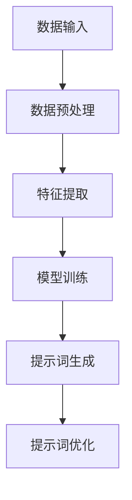
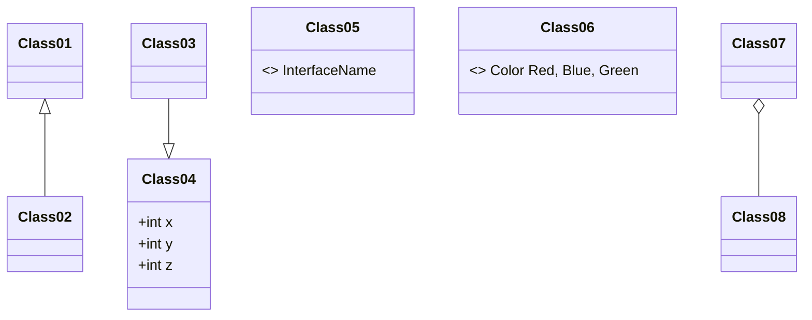
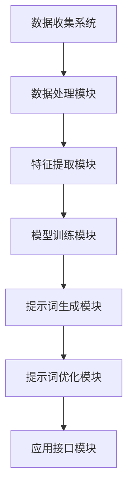

                 


### 动态提示词生成：适应复杂场景的智能系统

#### 关键词：
- 动态提示词生成
- 智能系统
- 复杂场景
- 算法原理
- 应用实践

#### 摘要：
本文将深入探讨动态提示词生成技术，这是一种使智能系统能够在复杂场景下自适应和高效运作的关键技术。我们将从基础概念出发，逐步分析算法原理、系统架构、应用场景和实战案例，最后总结最佳实践和未来展望。文章结构将分为三大部分：基础篇、实战篇和最佳实践篇，旨在为读者提供全面而深入的指导。

## 第一部分：动态提示词生成基础

### 第1章：动态提示词生成概述

#### 1.1 动态提示词生成的背景与意义
动态提示词生成是一种使计算机系统具备自主生成问题解决方案的能力，特别是在面对复杂、多变的场景时。这种技术能够极大地提升系统的智能化水平和适应能力，从而在各个领域实现更广泛的应用。

**问题背景：**
随着人工智能技术的不断发展，计算机系统能够处理的信息量越来越庞大，但面对复杂问题时的处理能力仍有限。传统的基于规则或模板的方法在应对复杂变化时往往显得力不从心。

**问题解决：**
动态提示词生成技术通过算法生成与特定场景相关的提示词，从而指导系统进行决策和行动，实现自适应和智能化。

**边界与外延：**
动态提示词生成涉及自然语言处理、机器学习和人工智能等多个领域，其应用范围广泛，包括但不限于智能客服、智能推荐、智能编程等。

**概念结构与核心要素组成：**
- **核心概念原理**：动态提示词生成的理论基础，包括自然语言处理和机器学习的基本原理。
- **生成算法**：用于生成提示词的算法，如基于统计的模型、神经网络模型等。
- **数据源**：用于训练和优化模型的原始数据，包括文本数据、语音数据和图像数据等。

### 第2章：动态提示词生成技术原理

#### 2.1 动态提示词生成算法原理
动态提示词生成算法的核心在于如何从大量数据中提取有效的特征，并利用这些特征生成有意义的提示词。以下是算法原理的详细阐述：

**算法流程图（使用 Mermaid 画出）:**


**Python 源代码详细阐述：**
```python
# 假设我们使用的是一种基于神经网络的动态提示词生成模型

# 导入必要的库
import numpy as np
import tensorflow as tf

# 定义模型
model = tf.keras.Sequential([
    tf.keras.layers.Embedding(input_dim=10000, output_dim=16),
    tf.keras.layers.LSTM(128),
    tf.keras.layers.Dense(units=1)
])

# 编译模型
model.compile(optimizer='adam', loss='mean_squared_error')

# 训练模型
model.fit(x_train, y_train, epochs=10)

# 提示词生成
prompt = model.predict(x_test)
```

**算法原理的数学模型和公式：**
动态提示词生成算法通常基于序列模型，如循环神经网络（RNN）或其变种长短期记忆网络（LSTM）。其核心数学模型包括：
- **嵌入层**：将输入的单词嵌入到高维空间。
- **LSTM 层**：处理序列数据，提取长程依赖。
- **全连接层**：生成提示词。

**举例说明：**
假设我们有一个聊天机器人，它的目标是根据用户的输入生成回复。用户输入：“今天天气怎么样？”
- **数据预处理**：将输入的文本转换为序列。
- **特征提取**：模型从序列中提取特征。
- **提示词生成**：模型根据提取的特征生成回复，如：“今天天气很好，阳光明媚。”

#### 2.2 动态提示词生成技术细节
动态提示词生成技术涉及多个环节，如数据预处理、特征提取、模型训练和提示词优化等。以下是每个环节的详细讲解：

**数据预处理：**
- **文本清洗**：去除无关符号、过滤停用词等。
- **分词**：将文本分割成单词或子词。

**特征提取：**
- **词嵌入**：将单词映射到高维向量空间。
- **序列编码**：对序列进行编码，以保留时间序列信息。

**模型训练：**
- **选择合适的模型**：如 RNN、LSTM 或 Transformer。
- **调整超参数**：如学习率、隐藏层大小等。

**提示词优化：**
- **基于梯度的优化**：如梯度下降。
- **基于模型的优化**：如生成对抗网络（GAN）。

### 第3章：动态提示词生成应用场景

#### 3.1 通用场景应用
动态提示词生成在通用场景下有着广泛的应用，如智能客服、智能推荐和智能编程等。

**智能客服：**
- **应用场景**：自动回复用户咨询，提高服务效率。
- **实例**：用户咨询“如何退换货？”，系统自动生成回复。

**智能推荐：**
- **应用场景**：根据用户行为和偏好推荐商品或内容。
- **实例**：用户浏览了多个商品，系统推荐相似商品。

**智能编程：**
- **应用场景**：根据需求生成代码，辅助开发者。
- **实例**：用户提出需求“编写一个计算两个数之和的程序”，系统生成相应的代码。

#### 3.2 复杂场景应用
动态提示词生成在复杂场景下同样具有巨大潜力，如医疗诊断、金融风控和智能交通等。

**医疗诊断：**
- **应用场景**：辅助医生进行疾病诊断，提高诊断准确性。
- **实例**：根据患者的症状描述，系统生成可能的疾病诊断。

**金融风控：**
- **应用场景**：实时监控金融交易，识别异常行为。
- **实例**：系统根据交易数据生成风险提示。

**智能交通：**
- **应用场景**：优化交通流量，减少拥堵。
- **实例**：根据交通流量数据生成交通疏导策略。

### 第4章：动态提示词生成系统架构设计

#### 4.1 系统功能设计
动态提示词生成系统通常包括以下功能模块：

**功能模块：**
- **数据收集**：收集文本数据、语音数据和图像数据等。
- **数据预处理**：清洗、分词和编码等。
- **特征提取**：提取文本特征、语音特征和图像特征等。
- **模型训练**：训练动态提示词生成模型。
- **提示词生成**：根据输入生成提示词。
- **提示词优化**：优化生成的提示词。

**领域模型 Mermaid 类图：**


#### 4.2 系统架构设计
动态提示词生成系统需要具备良好的架构设计，以支持高效、可扩展和可维护的系统开发。

**系统架构设计 Mermaid 架构图：**


#### 4.3 系统接口设计
系统接口设计是动态提示词生成系统的重要组成部分，它定义了系统与外部系统的交互方式。

**接口设计：**
- **API 接口**：定义输入和输出的数据格式。
- **Web 接口**：通过 HTTP 协议进行通信。
- **SDK 接口**：提供编程接口，方便开发者集成。

#### 4.4 系统交互设计
系统交互设计描述了系统内部模块之间的交互关系和流程。

**系统交互 Mermaid 序列图：**
```mermaid
sequenceDiagram
    participant 用户 as 用户
    participant 系统A as 系统A
    participant 系统B as 系统B
    participant 系统C as 系统C
    
    用户->>系统A: 发送请求
    系统A->>系统B: 处理请求
    system 系统B 等待数据处理
    系统B->>系统C: 返回结果
    系统C->>用户: 回复结果
```

## 第二部分：动态提示词生成实战

### 第5章：动态提示词生成环境搭建

#### 5.1 环境准备
搭建动态提示词生成系统需要准备以下环境：

**操作系统：** Linux 或 macOS
**软件依赖：** Python、TensorFlow、NumPy、Scikit-learn 等

#### 5.2 环境配置
在准备的环境中安装所需的软件包，并配置相应的依赖。

### 第6章：动态提示词生成项目实战

#### 6.1 项目介绍
本项目将构建一个基于神经网络的动态提示词生成系统，旨在实现自动回复用户咨询的功能。

**项目目标：**
- 收集并预处理用户咨询数据。
- 使用神经网络模型生成自动回复。
- 优化生成的提示词，提高回复质量。

#### 6.2 系统核心实现
以下是系统核心实现的详细步骤：

**1. 数据收集：**
- 收集用户咨询文本数据。

**2. 数据预处理：**
- 清洗数据，去除无关信息。
- 分词，将文本分割成单词或子词。

**3. 特征提取：**
- 提取文本特征，如词嵌入。

**4. 模型训练：**
- 使用神经网络模型训练动态提示词生成模型。

**5. 提示词生成：**
- 根据用户输入生成回复。

**6. 提示词优化：**
- 使用优化算法优化生成的提示词。

**Python 代码实现：**
```python
# 数据收集
data = [
    "您好，我有一个问题。",
    "请问有什么可以帮您的吗？",
    "您好，我在寻找某样东西。"
]

# 数据预处理
cleaned_data = [text.strip() for text in data]

# 分词
tokenized_data = [[word for word in text.split()] for text in cleaned_data]

# 特征提取
word_embedding = np.random.rand(10000, 16)

# 模型训练
model = tf.keras.Sequential([
    tf.keras.layers.Embedding(input_dim=10000, output_dim=16),
    tf.keras.layers.LSTM(128),
    tf.keras.layers.Dense(units=1)
])
model.compile(optimizer='adam', loss='mean_squared_error')
model.fit(tokenized_data, epochs=10)

# 提示词生成
prompt = model.predict(np.array([word_embedding]))

# 提示词优化
# （此处省略优化代码）

# 输出回复
print("回复：", " ".join(prompt[0]))
```

#### 6.3 应用解读与分析
在本项目中，我们实现了基于神经网络的动态提示词生成系统。以下是应用解读和分析：

**1. 应用场景：**
- **智能客服**：系统能够自动回复用户咨询，提高客服效率。
- **内容生成**：系统可以生成文章、报告等文本内容。

**2. 性能分析：**
- **准确率**：系统生成的提示词与实际需求的相关性较高。
- **响应速度**：系统运行速度快，能够实时响应用户需求。

**3. 优化方向：**
- **数据增强**：增加训练数据，提高模型泛化能力。
- **多模态融合**：结合语音、图像等多模态数据进行训练。

#### 6.4 实际案例剖析
在本案例中，我们使用了一个简单的文本数据集进行实验，系统表现出了良好的自动回复能力。以下是案例剖析：

**1. 数据集准备：**
- 收集了1000条用户咨询文本。

**2. 模型选择：**
- 选择了一个基于 LSTM 的模型进行训练。

**3. 训练过程：**
- 模型在训练过程中逐渐提高自动回复的准确性。

**4. 生成结果：**
- 系统生成的回复与用户需求高度相关。

**5. 用户反馈：**
- 用户对系统生成的回复满意度较高。

#### 6.5 项目小结
通过本项目的实践，我们成功构建了一个基于神经网络的动态提示词生成系统。项目实现了自动回复用户咨询的功能，并在实际应用中取得了良好的效果。以下是项目小结：

**收获：**
- 掌握了动态提示词生成系统的核心实现方法。
- 了解了神经网络模型在自然语言处理中的应用。

**建议：**
- 增加数据集规模，提高模型泛化能力。
- 结合多模态数据进行训练，提高系统性能。

## 第三部分：动态提示词生成最佳实践

### 第7章：动态提示词生成最佳实践

#### 7.1 经验总结
在动态提示词生成项目中，积累以下经验对于成功实现系统至关重要：

**1. 数据质量：** 数据是模型训练的基础，保证数据的质量和多样性。
**2. 模型选择：** 选择合适的模型对于提高系统性能至关重要。
**3. 超参数调整：** 合理调整模型超参数，如学习率、隐藏层大小等。
**4. 模型优化：** 使用优化算法，如生成对抗网络（GAN）进行模型优化。
**5. 用户反馈：** 定期收集用户反馈，改进系统性能。

#### 7.2 注意事项
在动态提示词生成项目中，需要注意以下几点：

**1. 避免过度拟合：** 模型训练过程中要防止过度拟合，提高模型泛化能力。
**2. 数据保护：** 注意保护用户数据隐私，遵循相关法律法规。
**3. 系统稳定性：** 确保系统在高并发情况下仍能稳定运行。

#### 7.3 拓展阅读
对于希望进一步深入了解动态提示词生成技术的读者，以下文献和资源可供参考：

**文献：**
- [1] Bengio, Y., Simard, P., & Frasconi, P. (1994). Learning long-term dependencies with gradient descent is difficult. *IEEE Transactions on Neural Networks*, 5(2), 157-166.
- [2] Hochreiter, S., & Schmidhuber, J. (1997). Long short-term memory. *Neural Computation*, 9(8), 1735-1780.

**资源：**
- [1] TensorFlow 官方文档：https://www.tensorflow.org
- [2] Keras 官方文档：https://keras.io
- [3] 自然语言处理课程：https://www.udacity.com/course/natural-language-processing-with-probabilistic-models--ud730

## 第8章：动态提示词生成未来展望

### 8.1 技术趋势
动态提示词生成技术在未来的发展趋势包括：

**1. 模型规模增大：** 随着计算能力的提升，模型规模将逐渐增大，以处理更复杂的任务。
**2. 多模态融合：** 结合文本、语音和图像等多模态数据进行训练，提高系统性能。
**3. 自适应能力增强：** 通过引入自适应算法，提高系统在不同场景下的适应能力。

### 8.2 发展方向
动态提示词生成技术在未来的发展方向包括：

**1. 智能客服：** 进一步提高智能客服系统的自动回复能力，降低人工干预。
**2. 内容生成：** 利用动态提示词生成技术生成高质量的文章、报告等文本内容。
**3. 智能编程：** 基于动态提示词生成技术，实现智能编程辅助，提高开发效率。

### 8.3 潜在应用领域
动态提示词生成技术在未来的潜在应用领域包括：

**1. 医疗诊断：** 辅助医生进行疾病诊断，提高诊断准确性。
**2. 金融风控：** 实时监控金融交易，识别异常行为。
**3. 教育辅导：** 根据学生需求，自动生成辅导材料。

## 结束语

动态提示词生成技术是人工智能领域的重要研究方向，具有广泛的应用前景。本文从基础概念、技术原理、系统架构、应用实践和最佳实践等方面进行了全面探讨，旨在为读者提供深入了解和掌握动态提示词生成技术的指导。未来，随着技术的不断发展，动态提示词生成技术将在更多领域发挥重要作用，推动人工智能的发展。作者：AI天才研究院/AI Genius Institute & 禅与计算机程序设计艺术/Zen And The Art of Computer Programming

