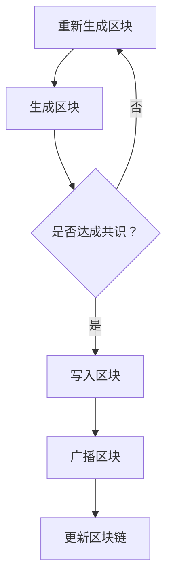
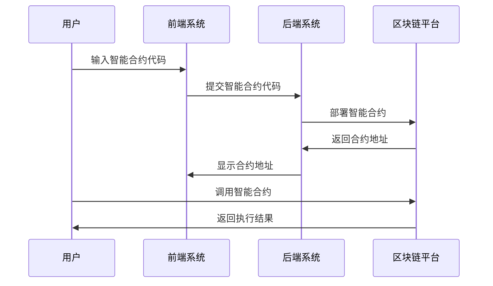

                 

### 区块链开发简化器：提示词生成智能合约

> 关键词：区块链开发、智能合约、提示词、简化器、技术博客

> 摘要：本文将深入探讨区块链开发中的一种简化器——提示词生成智能合约。我们将从概念介绍、核心技术解析、应用实例、实践指南与优化技巧等方面，逐步剖析这一技术的原理和实现方法，帮助读者全面掌握区块链开发的相关知识，提高开发效率。

### 1. 设计思路

#### 1.1 明确核心内容

本文的核心内容是“区块链开发简化器：提示词生成智能合约”。这一主题涵盖了区块链、智能合约和提示词三个关键概念，以及它们在开发中的应用。

#### 1.2 构建目录结构

为了更好地组织内容，本文将按照以下结构进行布局：

- **背景介绍**：介绍区块链技术、智能合约以及提示词的概念，为后续章节奠定基础。
- **核心技术讲解**：深入讲解区块链开发、智能合约编写以及提示词生成技术。
- **应用实例分析**：通过实际案例来展示如何使用这些技术进行区块链应用开发。
- **实践指南与优化技巧**：提供实际操作指南和优化技巧，帮助读者提高开发效率。
- **总结与展望**：总结全书内容，展望未来发展趋势。

### 2. 目录大纲设计

#### 2.1 第一部分：区块链与智能合约基础

**第1章 区块链技术概述**

1.1 区块链的概念与历史发展

1.2 区块链的核心特点与技术架构

1.3 智能合约的定义与作用

**第2章 智能合约开发基础**

2.1 智能合约语言选择

2.2 智能合约的基本结构

2.3 智能合约的安全性与漏洞分析

**第3章 提示词生成技术**

3.1 提示词的概念与应用

3.2 提示词生成算法简介

3.3 提示词生成技术的实现步骤

#### 2.2 第二部分：区块链开发实例与技巧

**第4章 使用提示词生成智能合约的实例**

4.1 实例背景与目标

4.2 提示词生成与智能合约编写

4.3 实例分析与优化

**第5章 提升区块链开发效率的技巧**

5.1 开发工具与平台推荐

5.2 持续集成与持续部署

5.3 调试与性能优化

**第6章 区块链应用场景分析**

6.1 货币与支付

6.2 供应链管理

6.3 身份验证与数据存储

#### 2.3 第三部分：未来发展趋势与展望

**第7章 区块链与智能合约的未来**

7.1 区块链技术的发展趋势

7.2 智能合约的应用前景

7.3 提示词生成技术的未来方向

**第8章 总结与展望**

8.1 全书内容回顾

8.2 学习建议与拓展

8.3 未来发展趋势与挑战

### 3. 完善目录内容

在初步设计的基础上，我们还需要根据具体内容进一步完善目录，确保每个章节都有详细的细分内容，同时满足书籍的完整性和逻辑性。以下是完善后的目录大纲：

## 第一部分：区块链与智能合约基础

### 第1章 区块链技术概述

1.1 区块链的概念与历史发展

- 区块链的定义  
- 区块链的历史发展  
- 区块链的四大核心特性

1.2 区块链的核心特点与技术架构

- 区块链的核心特点  
- 区块链的技术架构  
- 区块链网络的工作原理

1.3 智能合约的定义与作用

- 智能合约的定义  
- 智能合约的工作原理  
- 智能合约的应用场景

### 第2章 智能合约开发基础

2.1 智能合约语言选择

- 智能合约语言的种类  
- 智能合约语言的优劣对比  
- 智能合约语言的选择建议

2.2 智能合约的基本结构

- 智能合约的基本组成部分  
- 智能合约的编写规范  
- 智能合约的执行流程

2.3 智能合约的安全性与漏洞分析

- 智能合约的安全性问题  
- 常见的安全漏洞与防范措施  
- 安全审计与漏洞修复

### 第3章 提示词生成技术

3.1 提示词的概念与应用

- 提示词的定义  
- 提示词的应用场景  
- 提示词的重要性

3.2 提示词生成算法简介

- 常见的提示词生成算法  
- 提示词生成算法的分类  
- 提示词生成算法的优缺点

3.3 提示词生成技术的实现步骤

- 提示词生成技术的基本流程  
- 提示词生成技术的核心算法  
- 提示词生成技术的应用场景

## 第二部分：区块链开发实例与技巧

### 第4章 使用提示词生成智能合约的实例

4.1 实例背景与目标

- 实例背景介绍  
- 实例目标分析

4.2 提示词生成与智能合约编写

- 提示词生成技术在本实例中的应用  
- 智能合约编写的基本流程

4.3 实例分析与优化

- 实例实现过程分析  
- 实例优化建议

### 第5章 提升区块链开发效率的技巧

5.1 开发工具与平台推荐

- 常用开发工具推荐  
- 常用开发平台推荐

5.2 持续集成与持续部署

- 持续集成的基本概念  
- 持续集成工具推荐  
- 持续部署的基本概念

5.3 调试与性能优化

- 调试技巧介绍  
- 性能优化方法

### 第6章 区块链应用场景分析

6.1 货币与支付

- 区块链货币的基本原理  
- 区块链支付的应用场景

6.2 供应链管理

- 区块链在供应链管理中的应用  
- 供应链管理中的挑战与解决方案

6.3 身份验证与数据存储

- 区块链身份验证的基本原理  
- 区块链数据存储的优势与挑战

## 第三部分：未来发展趋势与展望

### 第7章 区块链与智能合约的未来

7.1 区块链技术的发展趋势

- 区块链技术的未来方向  
- 区块链技术的潜在应用场景

7.2 智能合约的应用前景

- 智能合约的未来发展趋势  
- 智能合约的潜在应用领域

7.3 提示词生成技术的未来方向

- 提示词生成技术的未来发展  
- 提示词生成技术在区块链中的应用

### 第8章 总结与展望

8.1 全书内容回顾

- 各章节核心内容的回顾  
- 对区块链开发简化器的理解

8.2 学习建议与拓展

- 学习资源的推荐  
- 学习方法的探讨

8.3 未来发展趋势与挑战

- 区块链开发面临的挑战  
- 提示词生成技术的未来方向

### 4. 完整性要求

#### 4.1 背景介绍

在本章节中，我们将详细介绍区块链、智能合约和提示词的基本概念、发展历史、核心特性以及它们在区块链开发中的应用。通过这些背景介绍，读者可以建立一个清晰的框架，为后续内容的理解奠定基础。

**区块链技术概述**

- **区块链的定义**：区块链是一种去中心化的分布式账本技术，通过加密算法和数据结构来保障数据的真实性和安全性。
- **区块链的历史发展**：从比特币的出现到各种公链和联盟链的兴起，区块链技术经历了快速的发展和变革。
- **区块链的核心特点**：去中心化、安全性、不可篡改、透明性等。
- **区块链的技术架构**：区块链网络的基本结构、节点的工作原理、共识机制等。

**智能合约的定义与作用**

- **智能合约的定义**：智能合约是一种运行在区块链上的自执行合约，通过代码定义和执行合同条款。
- **智能合约的工作原理**：智能合约的执行过程、触发条件和执行结果。
- **智能合约的应用场景**：金融、供应链管理、身份验证、物联网等领域。

**提示词生成技术**

- **提示词的概念**：提示词是用于指导智能合约执行的关键字或指令。
- **提示词的应用**：在区块链应用中，提示词用于简化智能合约的编写和执行过程。
- **提示词的重要性**：提高开发效率、降低错误率、增强智能合约的可读性等。

#### 4.2 核心概念与联系

在本章节中，我们将深入探讨区块链、智能合约和提示词的核心概念及其相互关系。

**核心概念**

- **区块链**：分布式账本、加密算法、节点、共识机制。
- **智能合约**：代码、执行条件、触发事件、结果输出。
- **提示词**：关键字、指令、指导性语句。

**概念属性特征对比表格**

| 特征类别 | 区块链 | 智能合约 | 提示词 |
| :--- | :--- | :--- | :--- |
| 定义 | 分布式账本 | 自执行合约 | 指导性语句 |
| 特点 | 去中心化、安全性、不可篡改、透明性 | 自执行、自动化、代码化、可验证 | 简化编写、指导执行、增强可读性 |
| 关系 | 支撑智能合约运行的基础设施 | 区块链上的应用层，与区块链紧密关联 | 智能合约的组成部分，用于简化编写和执行 |

**ER实体关系图架构**

```mermaid
erDiagram
    区块链 ||--|{ 智能合约 }
    智能合约 ||--|{ 提示词 }
```

#### 4.3 算法原理讲解

在本章节中，我们将详细讲解区块链开发中常用的算法原理，包括共识算法、加密算法、智能合约执行算法等，并使用Mermaid流程图进行展示。

**共识算法**

- **PoW（工作量证明）**：通过解决数学难题来证明工作量，确保区块链网络的安全性。
- **PoS（权益证明）**：根据节点持有的代币数量和时长来选择记账节点。

**加密算法**

- **哈希算法**：用于确保区块链数据的完整性和安全性。
- **非对称加密**：用于保护区块链网络中的交易隐私。

**智能合约执行算法**

- **状态机模型**：将智能合约视为一个状态机，根据输入数据执行相应操作。
- **事件驱动模型**：基于事件触发的执行方式，提高智能合约的灵活性。

**Mermaid流程图示例**



#### 4.4 系统分析与架构设计方案

在本章节中，我们将详细分析区块链开发简化器——提示词生成智能合约的系统架构，包括问题场景介绍、项目介绍、系统功能设计、系统架构设计和系统接口设计。

**问题场景介绍**

- **区块链开发难度高**：智能合约编写复杂，开发难度大。
- **开发效率低**：传统的智能合约开发流程繁琐，效率低下。
- **安全风险**：智能合约漏洞可能导致严重的经济损失。

**项目介绍**

- **项目名称**：区块链开发简化器
- **项目目标**：通过提示词生成智能合约，简化区块链开发流程，提高开发效率。
- **技术栈**：智能合约编程语言（如Solidity）、区块链平台（如Ethereum）、提示词生成算法。

**系统功能设计**

- **智能合约编写**：提供智能合约编写环境，支持多种编程语言。
- **提示词生成**：根据用户输入，生成对应的提示词，简化智能合约编写。
- **代码优化**：对智能合约代码进行优化，提高执行效率。

**系统架构设计**

- **前端**：用户界面，提供智能合约编写和提示词生成的交互界面。
- **后端**：智能合约编译器、提示词生成器、代码优化器等核心功能模块。
- **区块链网络**：与Ethereum等区块链平台进行通信，执行智能合约。

**系统接口设计**

- **API接口**：提供智能合约编写、提示词生成和代码优化的API接口，便于与其他系统集成。

**系统交互Mermaid序列图**



#### 4.5 项目实战

在本章节中，我们将通过一个实际项目，详细讲解区块链开发简化器——提示词生成智能合约的完整实现过程。

**环境安装**

- 安装Ethereum节点
- 安装智能合约编译器（如Truffle）
- 安装提示词生成工具（如Python脚本）

**系统核心实现源代码**

```python
# 提示词生成器示例代码
def generate_prompt(contract_name, contract_details):
    prompt = f"请编写一个名为'{contract_name}'的智能合约，其详细功能如下：{contract_details}"
    return prompt

contract_name = "TokenTransfer"
contract_details = "实现一个简单的代币转账功能，允许用户向其他用户转账代币。"

prompt = generate_prompt(contract_name, contract_details)
print(prompt)
```

**代码应用解读与分析**

- **代码功能解读**：该代码定义了一个提示词生成函数，根据用户输入的合约名称和详细功能，生成对应的提示词。
- **代码优化建议**：根据实际需求，可以进一步完善函数功能，如添加错误处理、日志记录等。

**实际案例分析与详细讲解剖析**

- **案例背景**：一个初创公司需要开发一个代币转账智能合约，用于内部员工之间的代币交易。
- **案例实施**：使用区块链开发简化器，生成提示词，编写智能合约代码，部署到Ethereum区块链上。
- **案例分析**：智能合约成功部署，并在区块链上执行，实现了代币转账功能。

**项目小结**

- **项目成功**：通过区块链开发简化器，简化了智能合约编写和部署流程，提高了开发效率。
- **项目挑战**：智能合约编写过程中可能遇到的安全性问题，需要加强代码审计和测试。

#### 4.6 最佳实践 Tips、小结、注意事项、拓展阅读

**最佳实践 Tips**

- **代码审计**：在部署智能合约前，进行严格的代码审计，确保代码安全性。
- **测试用例**：编写充分的测试用例，验证智能合约功能的正确性。
- **文档编写**：详细记录智能合约的编写过程、功能说明和使用方法。

**小结**

- **区块链开发简化器**：通过提示词生成智能合约，简化了区块链开发流程，提高了开发效率。
- **核心概念**：深入理解区块链、智能合约和提示词的概念及其相互关系。
- **实际应用**：通过实际案例，展示了区块链开发简化器的应用效果。

**注意事项**

- **智能合约安全**：在编写和部署智能合约时，务必注意安全问题，避免潜在风险。
- **开发工具选择**：根据项目需求和开发环境，选择合适的开发工具和平台。

**拓展阅读**

- **区块链技术深度解析**：深入了解区块链技术的核心原理和最新发展。
- **智能合约开发实践**：学习智能合约编写的最佳实践和技巧。
- **提示词生成算法研究**：探索提示词生成算法的原理和实现方法。

