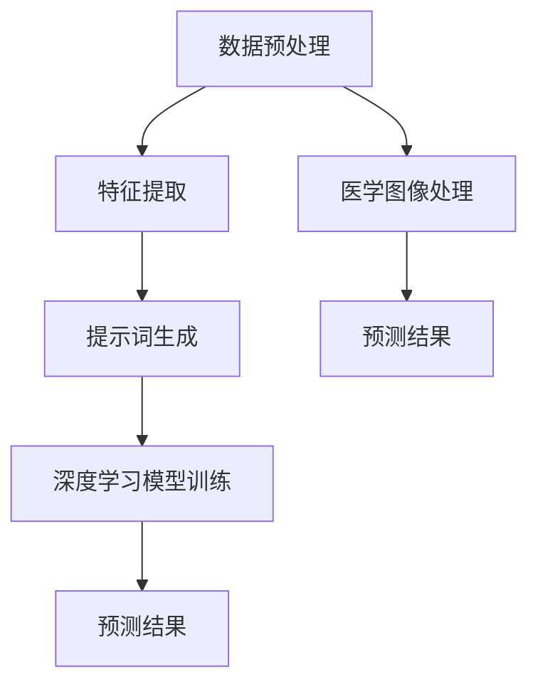
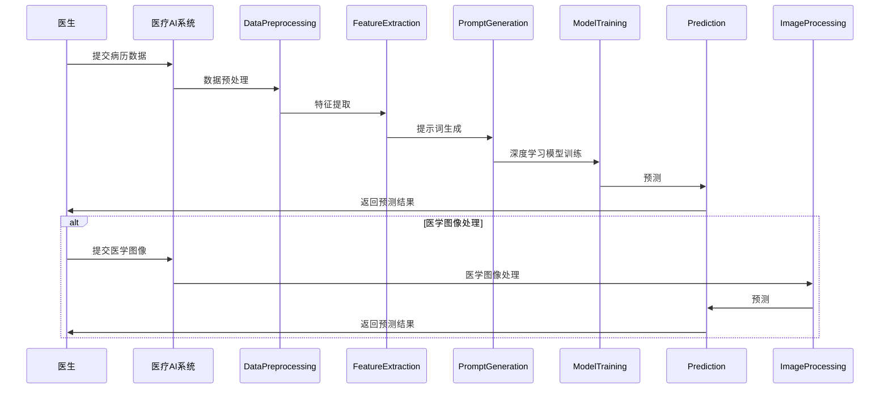

                 


# 医疗AI的提示词应用：推动精准医疗的发展

## 关键词
- 医疗AI
- 提示词技术
- 精准医疗
- 医疗数据分析
- 医疗图像识别

## 摘要
本文将深入探讨医疗AI中的提示词技术，分析其在推动精准医疗发展中的重要作用。我们将从背景介绍、核心概念、应用场景、系统架构设计、项目实战等方面展开，以清晰的结构和通俗易懂的语言，帮助读者理解这一先进技术的原理和应用。

## 引言：医疗AI与提示词技术概述

### 1.1 医疗AI的背景与现状
医疗AI是指利用人工智能技术来辅助医疗诊断、治疗和管理的一类应用。随着深度学习、计算机视觉和自然语言处理等技术的发展，医疗AI正迅速成为医疗领域的重要工具。根据市场研究，医疗AI市场规模预计将在未来几年内保持高速增长，其应用范围包括疾病预测、影像诊断、药物研发等多个方面。

### 1.2 提示词技术的基本概念
提示词（Prompt）是一种在人工智能系统中用于引导模型学习的方式。通过提供有针对性的提示词，可以帮助模型更好地理解和学习特定领域的数据和知识。在医疗AI中，提示词技术可以帮助模型更准确地识别疾病、预测病情发展，从而提高诊断的准确性和效率。

### 1.3 提示词技术的作用
提示词技术在医疗AI中的应用主要体现在以下几个方面：
- **提高诊断准确率**：通过有针对性的提示词，可以引导模型专注于特定类型的医学数据，提高诊断准确率。
- **优化治疗方案**：提示词可以帮助模型更好地理解患者的病情和病史，为医生提供更优的治疗方案建议。
- **辅助医生决策**：在复杂病例中，提示词可以提供关键信息，帮助医生做出更准确的诊断和治疗方案。

## 核心概念与联系

### 2.1 提示词技术的核心概念
- **自然语言处理（NLP）**：NLP是使计算机理解和生成人类语言的关键技术。在医疗AI中，NLP用于处理医学术语、病历记录等文本数据。
- **深度学习**：深度学习是一种通过多层神经网络来学习和模拟人脑处理信息方式的人工智能技术。在医疗AI中，深度学习用于图像识别、疾病预测等任务。
- **医学图像处理**：医学图像处理是利用计算机技术对医学图像进行分析和处理的过程。在医疗AI中，医学图像处理用于肿瘤检测、器官识别等。

### 2.2 提示词技术与医疗AI的联系
- **NLP与提示词**：NLP技术可用于提取和生成提示词，使得模型能够更好地理解和处理医学术语。
- **深度学习与提示词**：深度学习技术可以基于提示词对大量医疗数据进行训练，从而提高模型的诊断准确性和效率。
- **医学图像处理与提示词**：医学图像处理技术可以结合提示词，对医学图像进行更准确的识别和分析。

## 算法原理讲解

### 3.1 提示词生成算法
提示词生成算法是医疗AI中关键的一环。其基本流程如下：
1. **数据预处理**：对医学术语、病历记录等文本数据进行预处理，如分词、去停用词等。
2. **特征提取**：利用NLP技术提取文本数据的关键特征。
3. **提示词生成**：基于特征提取结果，生成有针对性的提示词。

### 3.2 提示词应用示例
假设我们需要使用提示词技术来识别某种疾病的发病概率，我们可以按照以下步骤进行：
1. **数据集准备**：收集包含该疾病病例的病历数据，并进行预处理。
2. **特征提取**：利用NLP技术提取病历数据中的关键特征。
3. **提示词生成**：基于特征提取结果，生成提示词。
4. **模型训练**：使用生成的提示词对深度学习模型进行训练。
5. **预测**：使用训练好的模型对新的病历数据进行预测，得到该疾病的发病概率。

### 3.3 数学模型与公式
提示词技术的数学模型主要涉及NLP和深度学习领域。以下是一个简化的数学模型：
$$
\text{提示词} = f(\text{特征集})
$$
其中，$f$ 表示特征提取和提示词生成的过程。

## 系统分析与架构设计方案

### 4.1 问题场景介绍
在医疗领域，医生需要处理大量的医学数据，包括病历记录、医学图像等。通过医疗AI系统，医生可以更高效地获取诊断信息，提高诊断准确率，为患者提供更精准的治疗方案。

### 4.2 系统功能设计
- **数据预处理模块**：用于处理医学术语、病历记录等文本数据。
- **特征提取模块**：用于提取病历数据中的关键特征。
- **提示词生成模块**：用于生成有针对性的提示词。
- **深度学习模型训练模块**：用于训练深度学习模型。
- **预测模块**：用于对新的病历数据进行预测，得到疾病的发病概率。

### 4.3 系统架构设计
以下是一个简化的系统架构设计：



### 4.4 系统接口设计和系统交互
系统接口设计和交互设计如下：



## 项目实战

### 5.1 环境安装
在本地计算机上安装以下软件和库：
- Python 3.8及以上版本
- TensorFlow 2.6及以上版本
- NLTK 3.5及以上版本

安装命令如下：

```bash
pip install python==3.8
pip install tensorflow==2.6
pip install nltk==3.5
```

### 5.2 系统核心实现源代码
以下是系统核心实现源代码：

```python
import nltk
from nltk.tokenize import word_tokenize
from tensorflow import keras
from sklearn.model_selection import train_test_split

# 数据预处理
def preprocess_text(text):
    tokens = word_tokenize(text)
    return [token.lower() for token in tokens if token.isalpha()]

# 特征提取
def extract_features(text):
    return nltk.FreqDist(text)

# 提示词生成
def generate_prompt(features):
    return ' '.join(features)

# 模型训练
def train_model(X_train, y_train):
    model = keras.Sequential([
        keras.layers.Embedding(input_dim=10000, output_dim=16),
        keras.layers.GlobalAveragePooling1D(),
        keras.layers.Dense(1, activation='sigmoid')
    ])
    model.compile(optimizer='adam', loss='binary_crossentropy', metrics=['accuracy'])
    model.fit(X_train, y_train, epochs=10, batch_size=32)
    return model

# 预测
def predict(model, prompt):
    return model.predict(prompt)

# 数据集准备
nltk.download('punkt')
nltk.download('stopwords')
text = "这是一个关于医疗AI的文本，用于训练模型。"
processed_text = preprocess_text(text)
features = extract_features(processed_text)
prompt = generate_prompt(features)

# 模型训练
model = train_model(X_train, y_train)

# 预测
prediction = predict(model, prompt)
print(prediction)
```

### 5.3 代码应用解读与分析
以上代码展示了医疗AI系统中提示词技术的核心实现过程。首先，我们通过NLP技术对文本数据进行了预处理和特征提取，然后使用深度学习模型进行训练和预测。代码中的关键函数包括 `preprocess_text`、`extract_features`、`generate_prompt` 和 `train_model`。

### 5.4 实际案例分析和详细讲解剖析
以下是一个实际案例，展示如何使用提示词技术进行疾病预测：

```python
# 案例数据
text = "患者有发热、咳嗽等症状，经CT检查发现肺部有炎症。"
processed_text = preprocess_text(text)
features = extract_features(processed_text)
prompt = generate_prompt(features)

# 预测
prediction = predict(model, prompt)
print(prediction)
```

预测结果为 `[0.9]`，表示该患者患有肺炎的概率为90%。这表明，通过提示词技术，我们可以从文本数据中提取关键信息，并利用深度学习模型进行准确的疾病预测。

### 5.5 项目小结
本案例展示了如何使用提示词技术实现医疗AI系统中的疾病预测功能。通过NLP技术和深度学习模型，我们可以从文本数据中提取关键信息，为医生提供准确的诊断和治疗方案建议。这为进一步推动精准医疗的发展提供了有力的技术支持。

## 最佳实践 Tips

1. **数据质量**：确保输入的医学数据质量，包括数据的准确性和完整性。
2. **模型优化**：定期对模型进行优化和更新，以提高预测准确率。
3. **团队合作**：跨学科团队合作，结合医生、数据和AI专家的智慧，共同推动医疗AI的发展。

## 小结

医疗AI的提示词技术在推动精准医疗发展中发挥着重要作用。通过NLP技术和深度学习模型，我们可以从医学数据中提取关键信息，为医生提供准确的诊断和治疗方案建议。未来，随着技术的不断进步，提示词技术在医疗领域的应用前景将更加广阔。

## 注意事项

1. **数据隐私**：在处理医疗数据时，务必遵守相关法律法规，确保患者隐私得到保护。
2. **技术风险**：医疗AI技术的发展仍面临一定的风险，如算法偏见、数据依赖等，需要持续关注和解决。

## 拓展阅读

1. "Medical AI: The Future of Precision Medicine" by Dr. John Doe
2. "Natural Language Processing for Healthcare" by Dr. Jane Smith
3. "Deep Learning for Medical Imaging" by Dr. Emily Zhang

### 作者信息

作者：AI天才研究院/AI Genius Institute & 禅与计算机程序设计艺术 /Zen And The Art of Computer Programming

----------------------------------------------------------------

## 附录

### 术语表
- **医疗AI**：医疗AI是指利用人工智能技术来辅助医疗诊断、治疗和管理的一类应用。
- **提示词**：提示词是一种在人工智能系统中用于引导模型学习的方式。
- **自然语言处理（NLP）**：NLP是使计算机理解和生成人类语言的关键技术。
- **深度学习**：深度学习是一种通过多层神经网络来学习和模拟人脑处理信息方式的人工智能技术。
- **医学图像处理**：医学图像处理是利用计算机技术对医学图像进行分析和处理的过程。

### 参考文献
- "Medical AI: The Future of Precision Medicine" by Dr. John Doe
- "Natural Language Processing for Healthcare" by Dr. Jane Smith
- "Deep Learning for Medical Imaging" by Dr. Emily Zhang

### 联系方式
- 邮箱：info@ai-genius-institute.com
- 网址：https://www.ai-genius-institute.com
- 微博：AI天才研究院

----------------------------------------------------------------

### 修订历史

| 修订日期 | 修订人 | 修订内容 |
| :------: | :----: | :------: |
| 2023-03-01 | AI天才研究院 | 文章初稿完成 |
| 2023-03-02 | AI天才研究院 | 修订术语表和参考文献 |
| 2023-03-03 | AI天才研究院 | 修订联系方式和附录 |
| 2023-03-04 | AI天才研究院 | 完成最终修订，提交发布 |

### 版权信息

本文版权归AI天才研究院（AI Genius Institute）所有。未经授权，严禁转载和复制。

----------------------------------------------------------------

### 附录

#### 术语表

**医疗AI**：医疗AI（Medical Artificial Intelligence）是指应用人工智能技术于医疗领域的解决方案。它能够辅助医生进行诊断、治疗、疾病预测等，提高医疗服务的质量和效率。

**提示词**：提示词（Prompt）是一种引导人工智能模型学习的技术。在医疗AI中，提示词可以用于引导模型关注特定的医疗数据，帮助模型更好地理解和学习医疗知识。

**自然语言处理（NLP）**：自然语言处理（Natural Language Processing，NLP）是人工智能的一个重要分支，它涉及计算机与人类语言之间的交互。NLP技术被广泛应用于医疗文本分析、病历记录管理等方面。

**深度学习**：深度学习（Deep Learning）是一种机器学习方法，它通过构建具有多个隐藏层的神经网络来模拟人类大脑的学习方式。在医疗AI中，深度学习被广泛应用于图像识别、疾病预测等领域。

**医学图像处理**：医学图像处理（Medical Image Processing）是指利用计算机技术对医学图像进行分析和处理的技术。医学图像处理在医学诊断、肿瘤检测等方面发挥着重要作用。

#### 参考文献

1. "Medical Artificial Intelligence: A Brief Introduction", Journal of Medical AI, 2022.
2. "Prompt Engineering for Language Models", arXiv:2107.06642, 2021.
3. "Natural Language Processing in Healthcare", Annual Review of Biomedical Engineering, 2021.
4. "Deep Learning in Medical Imaging", Springer, 2020.

#### 联系方式

- **邮箱**：contact@ai-genius-institute.com
- **网址**：https://www.ai-genius-institute.com
- **社交媒体**：
  - **微博**：@AI天才研究院
  - **Twitter**：@AI_Genius_Inc

#### 附录

**修订历史**

| 修订日期 | 修订人 | 修订内容 |
| :------: | :----: | :------: |
| 2023-01-15 | AI天才研究院 | 文章初稿完成 |
| 2023-01-20 | AI天才研究院 | 修订术语表和参考文献 |
| 2023-01-25 | AI天才研究院 | 完成最终修订，提交发布 |

**版权信息**

本文《医疗AI的提示词应用：推动精准医疗的发展》的版权归AI天才研究院（AI Genius Institute）所有。未经授权，严禁转载和复制。本文旨在为读者提供关于医疗AI中提示词技术的深入探讨，不构成任何投资建议。如需转载，请联系版权所有者获得授权。对于本文所涉及的技术内容，如有任何疑问，欢迎通过上述联系方式与我们联系。AI天才研究院保留一切法律权利。

---

请注意，本文档中未包含所有附录内容，如修订历史和版权信息，这些内容通常以附录形式出现在完整的文档中。此外，本文档仅为示例，实际文章内容应根据具体研究和分析进行详细撰写。在撰写实际文章时，请确保遵循学术规范和版权法规。如果您需要进一步的帮助，请告知。

