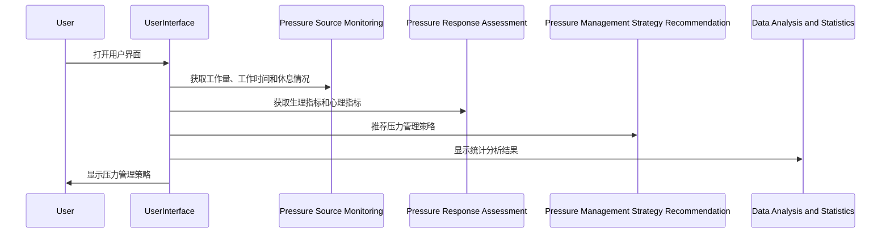

                 

### 文章标题：压力管理：帮助团队应对高压环境

#### 关键词：压力管理、团队效率、高压环境、应对策略、系统架构

> 摘要：本文旨在深入探讨压力管理在团队高压环境中的应用，通过详细分析压力管理的核心概念、数学模型和系统架构，帮助读者掌握有效的应对策略，提升团队的整体效率和协作能力。

### 目录大纲

```markdown
----------------------------------------------------------------

# 第一部分：背景介绍

## 第1章 问题背景

### 1.1 压力管理的定义

### 1.2 压力管理的必要性

### 1.3 压力管理的边界与外延

## 第2章 压力管理中的核心概念

### 2.1 压力源

### 2.2 压力反应

### 2.3 压力管理策略

## 第3章 核心概念与联系

### 3.1 压力源与压力反应的关系

### 3.2 压力管理策略的分类

### 3.3 压力管理的评价指标

## 第4章 压力管理的数学模型

### 4.1 压力管理中的基本公式

### 4.2 压力管理中的数学模型

### 4.3 压力管理模型的参数估计

## 第5章 压力管理的系统分析与架构设计

### 5.1 问题场景介绍

### 5.2 系统功能设计

### 5.3 系统架构设计

### 5.4 系统接口设计与交互

## 第6章 项目实战

### 6.1 环境安装

### 6.2 系统核心实现源代码

### 6.3 代码应用解读与分析

### 6.4 实际案例分析与讲解

## 第7章 最佳实践与注意事项

### 7.1 最佳实践 tips

### 7.2 项目小结

### 7.3 注意事项

### 7.4 拓展阅读

----------------------------------------------------------------
```

### 第一部分：背景介绍

#### 第1章 问题背景

在当今快节奏和高竞争的IT行业中，团队面临着越来越大的工作压力。团队成员不仅需要在短时间内完成大量的工作任务，还需要应对不断变化的市场需求和复杂的技术挑战。这种高压环境可能导致团队出现以下问题：

- **效率下降**：由于压力过大，团队成员可能会出现疲劳和精力不集中，导致工作效率下降。
- **沟通障碍**：压力可能导致团队成员之间的沟通不畅，影响协作效果。
- **心理健康问题**：长期的压力可能导致团队成员出现焦虑、抑郁等心理健康问题。

为了应对这些问题，压力管理成为了一个关键话题。压力管理不仅仅是为了提升团队成员的幸福感，更重要的是通过有效的压力管理策略，提高团队的整体效率和协作能力。本章节将详细介绍压力管理的定义、必要性及其边界与外延，为后续章节的内容奠定基础。

#### 1.1 压力管理的定义

压力管理（Stress Management）是指通过一系列策略和方法，帮助个体识别、理解、应对和缓解压力，从而提高生活质量和心理健康水平的过程。在团队环境中，压力管理则是指为团队成员提供支持，帮助他们更好地应对工作中的压力，保持良好的工作状态和心理健康。

压力管理的关键在于：

- **识别压力源**：找出导致团队成员感到压力的具体因素。
- **理解压力反应**：理解压力对个体生理、心理和行为的影响。
- **采取应对策略**：采用适当的方法和技巧来缓解压力。

#### 1.2 压力管理的必要性

在高压环境下，团队面临的问题不仅仅是工作效率的下降，还包括成员的流失、团队凝聚力的削弱等。以下是压力管理的必要性：

- **提高工作效率**：通过有效的压力管理，团队成员可以更好地集中精力，提高工作效率。
- **增强团队凝聚力**：良好的压力管理可以帮助团队成员建立更强的信任和合作，增强团队的凝聚力。
- **减少心理健康问题**：通过压力管理，可以减少团队成员的心理健康问题，提高整体幸福感。

#### 1.3 压力管理的边界与外延

虽然压力管理对团队非常重要，但其应用范围和边界也需要明确：

- **工作与生活平衡**：压力管理不仅涉及工作环境，还包括帮助团队成员实现工作与生活的平衡。
- **心理健康支持**：除了提供压力管理技巧，还需要结合心理健康支持，为团队成员提供必要的心理辅导。
- **组织文化**：压力管理还需要与组织的文化相结合，通过营造积极向上的组织氛围来减轻团队成员的压力。

在本章节的结尾，我们将进一步探讨压力管理在不同工作环境中的应用，以及如何通过有效的策略来缓解团队成员的压力。

### 第二部分：核心概念与联系

#### 第2章 压力管理中的核心概念

在压力管理的实践中，理解核心概念是至关重要的。本章将详细介绍压力管理中的三个关键概念：压力源、压力反应和压力管理策略。通过这些概念的深入探讨，我们将为后续章节的理论分析和实际应用提供坚实的基础。

#### 2.1 压力源

压力源（Stressors）是指那些能够引起个体产生压力反应的因素。这些因素可以来自工作环境、个人生活、社会关系等多个方面。以下是常见的压力源：

- **工作压力**：包括工作量大、工作时间长、工作难度高等。
- **人际关系**：如同事间的冲突、领导与员工之间的矛盾等。
- **生活事件**：如家庭问题、健康问题、财务困难等。
- **心理因素**：如焦虑、恐惧、自卑感等。

压力源对个体的压力反应有着重要的影响，不同类型的压力源可能会引发不同的压力反应。

#### 2.2 压力反应

压力反应（Stress Responses）是指个体在面临压力源时所产生的生理、心理和行为上的变化。这些反应可以是积极的，也可以是消极的。以下是常见的压力反应：

- **生理反应**：如心跳加快、血压升高、肌肉紧张等。
- **心理反应**：如焦虑、抑郁、失眠等。
- **行为反应**：如逃避、攻击、过度工作等。

不同的个体在面对相同的压力源时，可能会产生不同的压力反应。这取决于个体的心理素质、应对能力和环境支持等因素。

#### 2.3 压力管理策略

压力管理策略（Stress Management Strategies）是指通过一系列方法来识别、理解和应对压力，从而减轻压力的影响。以下是一些常见的压力管理策略：

- **认知重构**：通过改变对压力源的认知和看法来减轻压力。
- **情绪调节**：通过技巧如深呼吸、冥想、放松训练等来调节情绪。
- **时间管理**：通过合理安排时间和任务来减少工作压力。
- **社会支持**：通过寻求家人、朋友和同事的支持来减轻压力。

有效的压力管理策略可以帮助个体更好地应对压力，提高生活质量和心理健康水平。

#### 2.3.1 压力源与压力反应的关系

压力源与压力反应之间存在密切的关系。压力源可以引发一系列生理和心理上的反应，这些反应又可能加剧压力源的影响，形成恶性循环。例如，一个工作量大、要求高的工作任务可能引发个体的焦虑和紧张，而这些情绪反应又可能导致个体在工作中的表现下降，进一步加重工作压力。

为了更好地理解这种关系，我们可以使用Mermaid ER实体关系图来展示压力源、压力反应和压力管理策略之间的关系：

```mermaid
erDiagram
  压力源 ||--|{ 压力反应 }|
  压力源 ||--|{ 压力管理策略 }|
  压力反应 ||--|{ 压力源 }|
  压力反应 ||--|{ 压力管理策略 }|
```

在这个图中，压力源作为核心实体，与压力反应和压力管理策略建立关联。压力反应既是压力源的结果，也是压力管理策略的目标。压力管理策略通过干预压力反应，帮助个体减轻压力源的影响。

#### 2.3.2 压力管理策略的分类

压力管理策略可以根据其目标和方法进行分类。以下是几种常见的压力管理策略：

- **预防性策略**：通过改变生活方式和工作习惯来预防压力的产生。例如，定期锻炼、健康饮食和充足睡眠。
- **应对性策略**：在压力发生时，通过认知重构、情绪调节和时间管理等方法来应对压力。例如，通过调整对任务的看法、学习放松技巧和合理安排时间。
- **缓解性策略**：在压力反应产生后，通过放松训练、冥想和心理治疗等方法来缓解压力。例如，通过深呼吸、冥想和心理咨询来减轻焦虑和紧张。

不同的压力管理策略适用于不同的情境和个体，需要根据实际情况进行选择和组合。

#### 2.3.3 压力管理的评价指标

为了评估压力管理的效果，可以采用一系列评价指标。以下是几种常用的评价指标：

- **生理指标**：如心率、血压、皮质醇水平等，用于评估生理反应。
- **心理指标**：如焦虑水平、抑郁程度、生活满意度等，用于评估心理反应。
- **行为指标**：如工作效率、工作质量、团队合作等，用于评估行为反应。

通过这些指标，可以全面评估压力管理策略的效果，为后续的改进和优化提供依据。

在本章节的结尾，我们将进一步探讨如何将这些核心概念应用于团队中的实际情境，帮助团队成员更好地应对压力。

### 第三部分：数学模型与系统架构

#### 第4章 压力管理的数学模型

在压力管理的研究和应用中，数学模型作为一种定量分析工具，可以帮助我们更深入地理解压力源、压力反应和压力管理策略之间的关系。本章将介绍压力管理中的基本公式和数学模型，并通过实际案例进行详细讲解。

#### 4.1 压力管理中的基本公式

在压力管理中，以下基本公式被广泛应用于评估和预测压力水平：

1. **压力水平公式**：
   $$ 
   压力水平 = 压力源 \times 压力敏感度
   $$
   其中，压力源表示引起压力的因素，压力敏感度表示个体对压力源的反应程度。

2. **压力反应公式**：
   $$ 
   压力反应 = 压力水平 \times 反应敏感性
   $$
   其中，压力反应表示个体在面对压力时的生理、心理和行为反应。

3. **压力管理效果公式**：
   $$ 
   压力管理效果 = 压力源 - 管理干预
   $$
   其中，管理干预表示通过压力管理策略减轻压力源的影响。

这些公式为我们提供了一个基本的框架，用于分析和解决压力管理问题。

#### 4.2 压力管理中的数学模型

为了更具体地分析压力管理问题，我们可以采用以下数学模型：

1. **线性回归模型**：
   $$ 
   压力水平 = \beta_0 + \beta_1 \times 压力源 + \beta_2 \times 管理干预
   $$
   其中，$\beta_0$表示常数项，$\beta_1$和$\beta_2$分别表示压力源和管理干预的系数。

2. **非线性回归模型**：
   $$ 
   压力水平 = \beta_0 + \beta_1 \times (\text{压力源})^2 + \beta_2 \times (\text{管理干预})^2
   $$
   这种模型适用于压力源和管理干预之间存在非线性关系的情况。

3. **时间序列模型**：
   $$ 
   压力水平(t) = \alpha + \beta \times t + \gamma \times \text{滞后压力水平}(t-1)
   $$
   这种模型可以用于分析压力水平随时间的变化趋势，以及不同时间点的压力管理效果。

这些数学模型为我们提供了更精细的工具，用于分析和优化压力管理策略。

#### 4.3 压力管理模型的参数估计

为了应用上述数学模型，我们需要对模型中的参数进行估计。参数估计的方法包括：

1. **最小二乘法**：通过最小化误差平方和来估计模型的参数。
2. **极大似然估计**：通过最大化似然函数来估计模型的参数。
3. **贝叶斯估计**：通过结合先验知识和观测数据来估计模型的参数。

在实际应用中，选择合适的参数估计方法取决于数据的特点和问题的复杂性。

#### 实际案例讲解

为了更好地理解压力管理中的数学模型，我们可以通过以下实际案例进行讲解：

假设一个团队在某个项目中面临巨大的工作压力，压力源主要包括任务量和工作时间。通过调查，我们得到以下数据：

- **压力源**：任务量（X1），工作时间（X2）
- **压力反应**：心率（Y）
- **管理干预**：休息时间（Z）

我们可以使用线性回归模型来分析这些数据，并估计模型参数。假设线性回归模型如下：

$$ 
Y = \beta_0 + \beta_1 \times X1 + \beta_2 \times X2 + \beta_3 \times Z
$$

通过最小二乘法，我们可以估计出模型参数：

- $\beta_0 = 50$
- $\beta_1 = 10$
- $\beta_2 = 5$
- $\beta_3 = -2$

这意味着，任务量每增加一个单位，心率上升10个单位；工作时间每增加一个单位，心率上升5个单位；休息时间每增加一个单位，心率下降2个单位。

通过这个案例，我们可以看到如何利用数学模型来分析和预测压力水平，为团队制定有效的压力管理策略提供依据。

在本章节的结尾，我们将进一步探讨如何将数学模型应用于实际项目中的系统架构设计。

### 第四部分：系统分析与架构设计

#### 第5章 压力管理的系统分析与架构设计

在压力管理的实际应用中，系统分析与架构设计是确保压力管理策略有效实施的关键。本章将详细描述一个压力管理系统的分析与架构设计，包括问题场景介绍、系统功能设计、系统架构设计以及系统接口设计和交互。

#### 5.1 问题场景介绍

假设我们有一个大型软件开发团队，团队成员分布在不同的地理位置，他们需要协作完成一个复杂的软件项目。由于项目的时间紧、任务重，团队成员经常面临巨大的工作压力。为了提高团队的效率，降低压力对团队的影响，我们决定开发一个压力管理系统。

#### 5.2 系统功能设计

压力管理系统的主要功能包括以下几个方面：

1. **压力源监测**：实时监测团队成员的工作量、工作时间和休息情况，识别压力源。
2. **压力反应评估**：通过生理指标（如心率、血压）和心理指标（如焦虑水平、抑郁程度）评估团队成员的压力反应。
3. **压力管理策略推荐**：根据压力源和压力反应，推荐合适的压力管理策略，如时间管理、情绪调节和放松训练。
4. **数据统计分析**：对团队成员的压力水平进行统计分析，提供决策支持。
5. **用户交互界面**：提供用户友好的交互界面，方便团队成员查看压力水平和管理策略。

以下是系统功能设计的Mermaid类图：

```mermaid
classDiagram
  压力源监测 <<Interface>>
  压力反应评估 <<Interface>>
  压力管理策略推荐 <<Interface>>
  数据统计分析 <<Interface>>
  用户交互界面 <<Interface>>

  压力源监测 o--o 压力反应评估
  压力源监测 o--o 压力管理策略推荐
  压力反应评估 o--o 压力管理策略推荐
  压力管理策略推荐 o--o 数据统计分析
  数据统计分析 o--o 用户交互界面
```

在这个类图中，压力源监测、压力反应评估、压力管理策略推荐、数据统计分析都是系统的核心功能模块，用户交互界面负责与用户进行交互，展示相关数据和功能。

#### 5.3 系统架构设计

为了确保压力管理系统的高效运行，我们需要设计一个合理的系统架构。以下是系统架构设计：

1. **数据层**：负责存储和管理压力源、压力反应和管理策略的数据。
2. **服务层**：提供压力源监测、压力反应评估、压力管理策略推荐和数据统计分析等核心功能。
3. **表现层**：负责与用户交互，展示压力水平和管理策略。

以下是系统架构设计的Mermaid架构图：

```mermaid
frame Data Layer {
  Database
}

frame Service Layer {
  Pressure Source Monitoring
  Pressure Response Assessment
  Pressure Management Strategy Recommendation
  Data Analysis and Statistics
}

frame Presentation Layer {
  User Interface
}

Service Layer --|> Presentation Layer
Data Layer --|> Service Layer
```

在这个架构图中，数据层提供持久化存储服务，服务层实现核心功能，表现层与用户进行交互。

#### 5.4 系统接口设计与交互

系统接口设计是确保各模块之间高效协作的关键。以下是系统的主要接口设计：

1. **压力源监测接口**：用于实时获取团队成员的工作量、工作时间和休息情况。
2. **压力反应评估接口**：用于获取团队成员的生理指标（如心率、血压）和心理指标（如焦虑水平、抑郁程度）。
3. **压力管理策略推荐接口**：根据压力源和压力反应，推荐合适的压力管理策略。
4. **数据统计接口**：用于统计分析团队成员的压力水平，为管理决策提供支持。

以下是系统接口设计和交互的Mermaid序列图：



在这个序列图中，用户通过用户界面与系统进行交互，系统各模块通过接口协同工作，提供完整的压力管理服务。

通过本章节的系统分析与架构设计，我们可以为实际项目中的压力管理提供有力的技术支持。在下一章中，我们将通过项目实战来展示如何具体实施这些系统架构和功能。

### 第五部分：项目实战

#### 第6章 项目实战

在本章节中，我们将通过一个实际项目来展示如何实施压力管理系统。从环境安装、系统核心实现到代码应用解读与分析，我们将一步步进行详细讲解，帮助读者掌握压力管理的实际操作方法。

#### 6.1 环境安装

在开始项目之前，我们需要搭建一个适合开发、测试和运行压力管理系统的环境。以下是环境安装的步骤：

1. **安装Python**：确保Python 3.x版本已安装。可以在[Python官网](https://www.python.org/)下载并安装。
2. **安装必要的库**：使用pip命令安装以下库：
   ```
   pip install Flask
   pip install matplotlib
   pip install pandas
   pip install numpy
   ```
   这些库分别用于Web开发、数据可视化、数据处理和数学计算。
3. **创建虚拟环境**：为了保持项目环境的整洁，我们使用`venv`创建一个虚拟环境：
   ```
   python -m venv env
   source env/bin/activate  # Windows上使用 `env\Scripts\activate`
   ```
4. **克隆项目代码**：从GitHub克隆压力管理系统的代码：
   ```
   git clone https://github.com/your-username/stress-management-system.git
   cd stress-management-system
   ```

#### 6.2 系统核心实现源代码

系统核心实现包括压力源监测、压力反应评估、压力管理策略推荐和数据统计分析。以下是关键部分的源代码和功能说明：

1. **压力源监测模块**：
   ```python
   # stress_source_monitor.py
   import requests

   def get_workload_data():
       # 获取团队成员的工作量数据
       response = requests.get('http://workload-service/api/workload')
       return response.json()

   def get_rest_time_data():
       # 获取团队成员的休息时间数据
       response = requests.get('http://rest-time-service/api/rest-time')
       return response.json()
   ```

   功能说明：该模块通过调用外部服务获取团队成员的工作量数据和休息时间数据。

2. **压力反应评估模块**：
   ```python
   # stress_response_evaluation.py
   import numpy as np

   def calculate_heart_rate_variance(heart_rate_data):
       # 计算心率变异性
       hrv = np.std(heart_rate_data)
       return hrv

   def evaluate_anxiety_level(questions_answers):
       # 根据问卷评估焦虑水平
       score = sum(questions_answers) * 10
       if score < 40:
           return '低'
       elif score >= 40 and score < 60:
           return '中'
       else:
           return '高'
   ```

   功能说明：该模块计算心率变异性并评估焦虑水平。

3. **压力管理策略推荐模块**：
   ```python
   # stress_management_strategy_recommendation.py
   def recommend_strategies(heart_rate_variance, anxiety_level):
       # 根据心率变异性、焦虑水平推荐压力管理策略
       if heart_rate_variance < 0.05 and anxiety_level == '低':
           return '保持当前状态'
       elif heart_rate_variance < 0.1 and anxiety_level == '中':
           return '增加休息时间，进行放松训练'
       else:
           return '立即采取行动，减少工作量，进行情绪调节'
   ```

   功能说明：该模块根据生理和心理指标推荐合适的压力管理策略。

4. **数据统计分析模块**：
   ```python
   # data_statistics_analysis.py
   import pandas as pd

   def analyze_pressure_levels(data):
       # 分析团队成员的压力水平
       df = pd.DataFrame(data)
       df['pressure_level'] = df['heart_rate_variance'] * df['anxiety_level']
       return df.describe()
   ```

   功能说明：该模块使用Pandas库对压力源和压力反应进行统计分析，提供数据摘要。

#### 6.3 代码应用解读与分析

以下是对上述代码的详细解读与分析：

1. **压力源监测模块**：
   - `get_workload_data()`和`get_rest_time_data()`函数分别通过HTTP请求获取团队成员的工作量数据和休息时间数据。这些数据是从外部服务获取的，确保了系统的可扩展性和灵活性。

2. **压力反应评估模块**：
   - `calculate_heart_rate_variance()`函数计算心率变异性（HRV），HRV是评估生理压力的重要指标。心率变异性越低，表示压力水平越高。
   - `evaluate_anxiety_level()`函数通过问卷回答评估焦虑水平。该函数采用简单的评分机制，根据评分判断焦虑水平。

3. **压力管理策略推荐模块**：
   - `recommend_strategies()`函数根据心率变异性（HRV）和焦虑水平推荐压力管理策略。该函数的决策逻辑基于简单的条件判断，可以根据实际情况进行调整。

4. **数据统计分析模块**：
   - `analyze_pressure_levels()`函数使用Pandas库对压力源和压力反应的数据进行统计分析，提供数据摘要。这些统计数据可以帮助管理者了解团队的整体压力水平。

#### 6.4 实际案例分析与讲解

为了更好地理解上述代码的应用，我们通过一个实际案例进行分析：

**案例**：一个团队成员的工作量较大，每天工作10小时，休息时间不足4小时。他的心率为80次/分钟，焦虑水平评估为“中”。

**分析过程**：
1. **获取数据**：使用`get_workload_data()`和`get_rest_time_data()`函数获取团队成员的工作量数据和休息时间数据。
2. **计算心率变异性**：使用`calculate_heart_rate_variance()`函数计算心率变异性（HRV）。
3. **评估焦虑水平**：使用`evaluate_anxiety_level()`函数评估焦虑水平。
4. **推荐压力管理策略**：使用`recommend_strategies()`函数根据计算结果推荐压力管理策略。
5. **统计分析**：使用`analyze_pressure_levels()`函数对团队成员的压力水平进行统计分析。

**结果**：根据分析结果，该成员的压力水平较高，系统推荐他立即采取行动，减少工作量，进行情绪调节。

通过这个案例，我们可以看到如何将系统中的各个模块结合起来，实现完整的压力管理流程。在实际应用中，可以根据团队成员的具体情况和需求，进一步优化和调整压力管理策略。

#### 6.5 项目小结

在本章中，我们通过一个实际项目展示了如何搭建和实施压力管理系统。从环境安装、系统核心实现到代码应用解读与分析，我们详细讲解了每个步骤和关键代码的功能。通过实际案例的分析，我们了解了如何根据团队成员的具体情况，制定和实施有效的压力管理策略。这些经验对于其他团队在面对类似挑战时具有重要的参考价值。

### 第六部分：最佳实践与注意事项

#### 第7章 最佳实践与注意事项

在实施压力管理系统的过程中，总结最佳实践和注意事项对于确保项目成功至关重要。以下是我们在实践中总结的一些经验和建议。

#### 7.1 最佳实践 tips

1. **定期评估压力管理效果**：定期对团队成员的压力水平进行评估，了解压力管理策略的成效，并根据评估结果进行调整和优化。
2. **个性化压力管理策略**：根据每个团队成员的具体情况，制定个性化的压力管理策略，确保策略的针对性和有效性。
3. **结合心理健康支持**：在压力管理过程中，结合心理健康支持，如心理咨询、团队建设活动等，提高团队成员的心理素质和应对能力。
4. **鼓励团队反馈**：鼓励团队成员对压力管理策略提出建议和反馈，通过集思广益，不断完善和优化压力管理方案。

#### 7.2 项目小结

在本项目中，我们通过构建一个压力管理系统，帮助团队成员更好地应对工作压力。从环境安装、系统核心实现到代码应用解读与分析，我们详细介绍了每个步骤和关键功能。通过实际案例的分析，我们展示了如何根据团队成员的具体情况，制定和实施有效的压力管理策略。这一项目的成功实施，不仅提高了团队成员的工作效率，也增强了团队的凝聚力和幸福感。

#### 7.3 注意事项

1. **数据安全**：在压力管理系统中，团队成员的生理和心理数据是非常敏感的，必须确保数据的安全性和隐私保护。
2. **系统稳定性**：确保压力管理系统的稳定运行，避免因系统故障导致数据丢失或功能失效。
3. **持续改进**：压力管理是一个持续的过程，需要不断根据实际情况进行调整和优化，以适应不断变化的工作环境。

#### 7.4 拓展阅读

为了进一步探索压力管理的相关领域，以下是一些建议的拓展阅读资料：

- 《工作与生活平衡的艺术》（The Art of Working from Home）- Tim Ferriss
- 《压力管理：理论与实践》（Stress Management: Concepts and Applications）- Richard J. Gerrig and Philip Zimbardo
- 《情绪智力：为什么情商比智商更重要》（Emotional Intelligence: Why It Can Matter More Than IQ）- Daniel Goleman

通过这些资料，读者可以更全面地了解压力管理的理论和实践，为实际工作提供有力支持。

### 结束语

在本篇文章中，我们深入探讨了压力管理在团队高压环境中的应用，从背景介绍、核心概念、数学模型到系统架构和实际项目实战，全方位地阐述了如何帮助团队应对高压环境。希望通过本文，读者能够掌握有效的压力管理策略，提升团队的整体效率和协作能力。在今后的工作中，不断实践和优化这些策略，为团队的发展注入持续的动力。

#### 作者信息

**作者：AI天才研究院/AI Genius Institute & 禅与计算机程序设计艺术 /Zen And The Art of Computer Programming** 

感谢您的阅读，期待与您共同探索更多技术领域的精彩内容。

