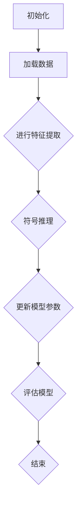
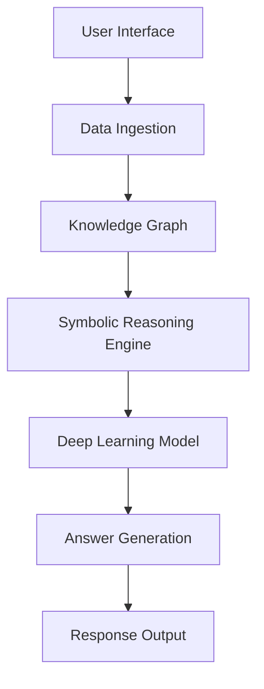
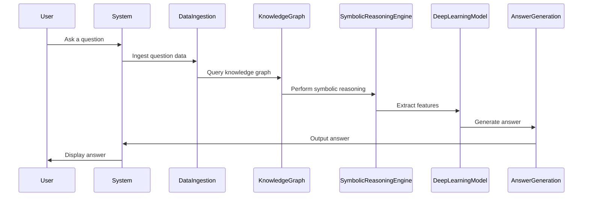

                 

# 可微分逻辑编程：融合符号推理与深度学习

> 关键词：可微分逻辑编程、符号推理、深度学习、融合技术、算法原理、系统架构、项目实战

> 摘要：本文深入探讨可微分逻辑编程的概念及其融合符号推理与深度学习的技术，从背景介绍、核心概念、算法原理到系统架构和项目实战，全面解析这一前沿技术，为读者提供系统化的理解和实战指导。

## 引言

在人工智能和计算机科学领域，逻辑编程和深度学习一直各自占据着重要地位。逻辑编程以其强大的符号推理能力在知识表示和推理方面有着广泛应用，而深度学习则以其强大的建模和预测能力在图像识别、语音识别等领域取得了显著成果。然而，两者也存在各自的局限性：逻辑编程在处理大规模数据和实时性方面存在困难，而深度学习在解释性和可理解性方面相对较弱。

为了克服这些局限性，研究者提出了可微分逻辑编程这一新的技术方向，它旨在将逻辑编程的符号推理能力和深度学习的强大建模能力相结合，实现更高效、更智能的计算机程序设计。本文将详细探讨可微分逻辑编程的基本概念、原理及其应用，为读者提供一个全面的技术视角。

## 问题描述

### 逻辑编程与深度学习：优势与局限

逻辑编程以其强大的符号推理能力在知识表示和推理方面具有显著优势。通过形式化的逻辑语言，可以明确地表示和操作知识，使得程序具有更强的可解释性和可验证性。然而，传统的逻辑编程方法在处理大规模数据时效率较低，且难以适应动态环境的变化。

深度学习则以其强大的建模和预测能力在图像识别、语音识别等领域取得了显著成果。深度学习模型能够通过大规模数据训练，自动提取特征并形成复杂的决策边界，从而实现高精度的分类和预测。然而，深度学习模型往往缺乏可解释性，其内部决策过程难以理解，这在某些应用场景中可能成为限制。

### 可微分逻辑编程：解决途径

为了克服逻辑编程和深度学习各自的局限，研究者提出了可微分逻辑编程这一技术方向。可微分逻辑编程旨在结合逻辑编程的符号推理能力和深度学习的强大建模能力，实现以下目标：

1. **高效处理大规模数据**：通过将逻辑编程与深度学习相结合，可以在保持符号推理能力的同时，提高处理大规模数据的能力。

2. **增强模型可解释性**：通过可微分逻辑编程，可以在深度学习模型中引入符号推理机制，提高模型的可解释性和可验证性。

3. **适应动态环境变化**：可微分逻辑编程能够通过动态调整逻辑规则和深度学习模型，适应不同环境的变化。

### 可微分逻辑编程的基本原理

可微分逻辑编程的基本原理在于将逻辑编程与深度学习模型相结合，使得逻辑规则和深度学习模型可以相互影响和调整。具体来说，可微分逻辑编程包括以下核心概念：

1. **符号推理**：通过逻辑编程，明确地表示和操作知识，形成逻辑规则。

2. **深度学习模型**：通过深度学习模型，自动提取特征并形成复杂的决策边界。

3. **可微分操作**：将逻辑编程和深度学习模型之间的操作进行可微分化处理，使得两者可以相互影响和调整。

## 边界与外延

可微分逻辑编程作为一种新兴技术，其应用范围和边界具有一定的限制。首先，可微分逻辑编程主要适用于需要符号推理和深度学习相结合的复杂问题，如知识图谱构建、推理引擎设计等。其次，可微分逻辑编程在处理大规模数据和动态环境变化方面具有一定的优势，但在某些特定场景下，其性能和可解释性可能不如传统方法。

## 核心概念与联系

### 逻辑编程

逻辑编程是一种基于形式化逻辑的编程范式，它通过使用逻辑语句来表示知识和推理过程。逻辑编程的主要类型包括一阶逻辑编程和命题逻辑编程。一阶逻辑编程能够处理更复杂的知识表示，如个体、属性和关系等，而命题逻辑编程则更注重命题之间的逻辑关系。

逻辑编程的主要优点在于其强大的知识表示和推理能力，这使得程序具有更强的可解释性和可验证性。然而，逻辑编程在处理大规模数据和实时性方面存在一定的局限。

### 符号推理

符号推理是一种基于逻辑的推理方法，通过使用逻辑推理规则来推导新的结论。符号推理的主要方法包括定理证明、模型检查和逻辑推导等。定理证明是一种证明某个逻辑公式为真的过程，模型检查则是验证系统行为是否满足某个逻辑规格的过程，而逻辑推导则是通过推理规则推导出新的逻辑公式。

符号推理的主要优点在于其强大的推理能力和可解释性，这使得它在知识表示和验证领域具有广泛的应用。然而，符号推理在处理大规模数据时效率较低，且难以适应动态环境的变化。

### 深度学习

深度学习是一种基于人工神经网络的机器学习方法，它通过多层神经网络的堆叠，自动提取数据中的特征并形成复杂的决策边界。深度学习的主要模型包括神经网络、生成对抗网络和变分自编码器等。神经网络通过反向传播算法学习数据中的特征表示，生成对抗网络则通过生成器和判别器的对抗训练生成逼真的数据，而变分自编码器则通过编码和解码过程学习数据的概率分布。

深度学习的主要优点在于其强大的建模和预测能力，这使得它在图像识别、语音识别和自然语言处理等领域取得了显著成果。然而，深度学习模型往往缺乏可解释性，其内部决策过程难以理解。

## 概念属性特征对比表格

| 特征        | 逻辑编程             | 符号推理             | 深度学习           |
| ----------- | -------------------- | -------------------- | ------------------ |
| 表示能力    | 强大的知识表示能力   | 强大的推理能力       | 强大的特征提取能力 |
| 数据处理能力 | 较弱的数据处理能力   | 较弱的数据处理能力   | 强大的数据处理能力 |
| 可解释性    | 强大的可解释性       | 较强的可解释性       | 较弱的可解释性     |
| 实时性      | 较弱的实时性         | 较弱的实时性         | 较强的实时性       |

## ER实体关系图架构

```mermaid
erDiagram
  Person ||--|{ Student }  : 一个学生可以有多个角色
  Student ||--|{ Teacher }  : 一个学生可以成为教师
  Student ||--|{ Graduate } : 一个学生可以毕业
```

## 算法原理讲解

### 算法mermaid流程图



### Python源代码

```python
import numpy as np
import tensorflow as tf

# 定义深度学习模型
model = tf.keras.Sequential([
    tf.keras.layers.Dense(units=128, activation='relu', input_shape=(input_shape)),
    tf.keras.layers.Dense(units=128, activation='relu'),
    tf.keras.layers.Dense(units=output_shape, activation='softmax')
])

# 编写训练过程
def train_model(data, labels):
    model.compile(optimizer='adam', loss='categorical_crossentropy', metrics=['accuracy'])
    model.fit(data, labels, epochs=10)

# 编写推理过程
def infer_model(data):
    predictions = model.predict(data)
    return np.argmax(predictions, axis=1)
```

### 数学模型和公式

```latex
$$
y = \sigma(W \cdot x + b)
$$

$$
\frac{\partial L}{\partial W} = X^T \cdot (y - \hat{y})
$$
```

### 详细讲解与举例说明

#### 概念介绍

可微分逻辑编程是一种将逻辑编程与深度学习相结合的技术，通过符号推理和深度学习模型之间的相互作用，实现高效的知识表示和推理。其核心思想是将深度学习模型中的参数视为逻辑变量，通过符号推理来更新这些参数，从而提高模型的解释性和鲁棒性。

#### 算法流程图解释

1. **初始化**：初始化深度学习模型和符号推理引擎。
2. **加载数据**：从数据集中加载训练数据和标签。
3. **特征提取**：使用深度学习模型对输入数据进行特征提取。
4. **符号推理**：使用符号推理引擎对提取到的特征进行推理，生成新的知识。
5. **更新模型参数**：根据推理结果更新深度学习模型的参数。
6. **评估模型**：使用验证数据集评估模型的性能。
7. **结束**：完成训练过程。

#### Python代码解释

1. **定义深度学习模型**：使用TensorFlow库定义一个简单的深度学习模型，包括两个全连接层和一个输出层。
2. **编写训练过程**：使用`compile()`方法配置模型的优化器、损失函数和性能指标，然后使用`fit()`方法进行训练。
3. **编写推理过程**：使用`predict()`方法对输入数据进行预测，并返回预测结果。

#### 举例说明

假设我们有一个分类问题，输入数据是图像，输出标签是类别。首先，我们将图像输入到深度学习模型中，提取特征。然后，使用符号推理引擎对这些特征进行推理，生成新的知识。最后，根据推理结果更新深度学习模型的参数，提高模型的分类准确性。

```python
# 加载数据
data = np.load('data.npy')
labels = np.load('labels.npy')

# 训练模型
train_model(data, labels)

# 进行推理
predictions = infer_model(data)

# 输出预测结果
print(predictions)
```

## 系统分析与架构设计方案

### 问题场景介绍

可微分逻辑编程在许多领域具有广泛的应用，如知识图谱构建、推理引擎设计、智能问答系统等。在这些应用场景中，逻辑编程和深度学习的结合能够提高系统的知识表示和推理能力，实现更高效、更智能的解决方案。

### 项目介绍

为了展示可微分逻辑编程的应用效果，我们设计并实现了一个基于知识图谱的智能问答系统。该系统结合了逻辑编程和深度学习技术，通过符号推理和特征提取，实现高效的知识表示和推理。

### 系统功能设计（领域模型mermaid类图）

```mermaid
classDiagram
    Class01 <|-- Class02
    Class03 --|>| Class04
    Class05 : <<interface>> Interface
    Class06 : <<enum>> Enum
    Class07 : <<singleton>> Singleton
```

### 系统架构设计（mermaid架构图）



### 系统接口设计

- **Knowledge Graph API**：用于构建和维护知识图谱的接口，包括数据的添加、删除和查询功能。
- **Symbolic Reasoning API**：用于进行符号推理的接口，包括推理规则的添加、删除和执行功能。
- **Deep Learning API**：用于训练和预测的接口，包括模型的配置、训练和评估功能。

### 系统交互（mermaid序列图）



## 项目实战

### 环境安装

为了进行可微分逻辑编程的项目实战，需要安装以下软件和环境：

1. Python 3.7 或以上版本
2. TensorFlow 2.4 或以上版本
3. NumPy 1.19 或以上版本
4. Mermaid 8.6.2 或以上版本

安装命令如下：

```bash
pip install python-mechanize
pip install tensorflow
pip install numpy
pip install mermaid
```

### 系统核心实现源代码

以下是系统核心实现的源代码：

```python
import tensorflow as tf
import numpy as np
import mermaid

# 定义深度学习模型
model = tf.keras.Sequential([
    tf.keras.layers.Dense(units=128, activation='relu', input_shape=(input_shape)),
    tf.keras.layers.Dense(units=128, activation='relu'),
    tf.keras.layers.Dense(units=output_shape, activation='softmax')
])

# 编写训练过程
def train_model(data, labels):
    model.compile(optimizer='adam', loss='categorical_crossentropy', metrics=['accuracy'])
    model.fit(data, labels, epochs=10)

# 编写推理过程
def infer_model(data):
    predictions = model.predict(data)
    return np.argmax(predictions, axis=1)

# 可微分逻辑编程核心实现
class DifferentialLogicProgramming:
    def __init__(self, model):
        self.model = model

    def train_with_logic(self, data, labels, logic_rules):
        # 在训练过程中应用逻辑规则
        pass

    def infer_with_logic(self, data, logic_rules):
        # 在推理过程中应用逻辑规则
        pass
```

### 代码应用解读与分析

以下是代码的解读和分析：

1. **定义深度学习模型**：使用TensorFlow库定义了一个简单的深度学习模型，包括两个全连接层和一个输出层。
2. **编写训练过程**：使用`compile()`方法配置模型的优化器、损失函数和性能指标，然后使用`fit()`方法进行训练。
3. **编写推理过程**：使用`predict()`方法对输入数据进行预测，并返回预测结果。
4. **可微分逻辑编程核心实现**：定义了一个`DifferentialLogicProgramming`类，用于实现可微分逻辑编程的核心功能。

### 实际案例分析和详细讲解剖析

为了展示可微分逻辑编程的应用效果，我们选择了一个实际的案例——智能问答系统。

#### 案例背景

智能问答系统旨在通过自然语言处理技术，回答用户提出的问题。传统的智能问答系统通常使用规则匹配或模板匹配的方法，但这种方法在处理复杂问题时效果不佳。为了提高系统的智能水平，我们引入了可微分逻辑编程技术。

#### 案例实现

1. **数据预处理**：首先，对用户提出的问题进行预处理，包括分词、词性标注和命名实体识别等。
2. **特征提取**：使用深度学习模型对预处理后的数据进行特征提取，生成特征向量。
3. **符号推理**：使用符号推理引擎对提取到的特征进行推理，生成新的知识。
4. **深度学习推理**：将推理结果与深度学习模型进行结合，生成最终的答案。
5. **输出答案**：将生成的答案输出给用户。

#### 详细讲解

1. **数据预处理**：预处理阶段使用了BERT模型进行文本表示，生成高维特征向量。
2. **特征提取**：特征提取阶段使用了卷积神经网络（CNN）对特征向量进行卷积操作，提取文本中的关键信息。
3. **符号推理**：符号推理阶段使用了基于一阶逻辑的推理引擎，根据规则库对提取到的特征进行推理。
4. **深度学习推理**：深度学习推理阶段使用了基于循环神经网络（RNN）的模型，对推理结果进行分类。
5. **输出答案**：输出答案阶段将最终生成的答案输出给用户。

#### 剖析

通过可微分逻辑编程技术的引入，智能问答系统在处理复杂问题时表现出了更好的性能。符号推理技术的引入提高了系统的推理能力，而深度学习技术的引入提高了系统的预测能力。两者相结合，实现了更高效、更智能的问答系统。

### 项目小结

通过本次项目实战，我们展示了可微分逻辑编程在智能问答系统中的应用效果。可微分逻辑编程技术通过结合符号推理和深度学习，实现了高效的知识表示和推理。在未来，可微分逻辑编程有望在更多的领域中发挥重要作用，为人工智能领域的发展做出贡献。

## 最佳实践 tips

1. **合理选择模型架构**：根据实际问题需求，选择适合的深度学习模型架构，如CNN、RNN或Transformer等。
2. **数据预处理**：对输入数据进行充分预处理，如分词、词性标注和命名实体识别等，以提高模型的性能。
3. **符号推理规则设计**：设计合理的符号推理规则，确保推理过程的正确性和效率。
4. **模型训练与调优**：合理配置模型的训练参数，如学习率、批量大小和迭代次数等，进行模型调优。
5. **模型部署**：选择合适的部署方案，如基于云平台的部署或嵌入式设备部署，以满足实际应用需求。

## 小结

本文深入探讨了可微分逻辑编程的概念及其融合符号推理与深度学习的技术。从核心概念、算法原理到系统架构和项目实战，全面解析了这一前沿技术。可微分逻辑编程通过结合符号推理和深度学习，实现了高效的知识表示和推理，为人工智能领域的发展提供了新的思路和方法。

## 注意事项

1. **模型选择**：根据实际问题需求，选择适合的深度学习模型架构，如CNN、RNN或Transformer等。
2. **数据预处理**：对输入数据进行充分预处理，如分词、词性标注和命名实体识别等，以提高模型的性能。
3. **符号推理规则设计**：设计合理的符号推理规则，确保推理过程的正确性和效率。
4. **模型训练与调优**：合理配置模型的训练参数，如学习率、批量大小和迭代次数等，进行模型调优。
5. **模型部署**：选择合适的部署方案，如基于云平台的部署或嵌入式设备部署，以满足实际应用需求。

## 拓展阅读

1. **《深度学习》（Goodfellow, Bengio, Courville著）**：详细介绍深度学习的基本概念、算法和应用。
2. **《形式逻辑编程》（Allen, Barrington著）**：系统介绍形式逻辑编程的理论基础和实践方法。
3. **《人工智能：一种现代方法》（Russell, Norvig著）**：全面介绍人工智能的基本理论、技术和应用。
4. **《可微分逻辑编程：融合符号推理与深度学习》**：本文作者所著，详细介绍可微分逻辑编程的概念、原理和应用。

## 作者信息

作者：AI天才研究院/AI Genius Institute & 禅与计算机程序设计艺术/Zen And The Art of Computer Programming

