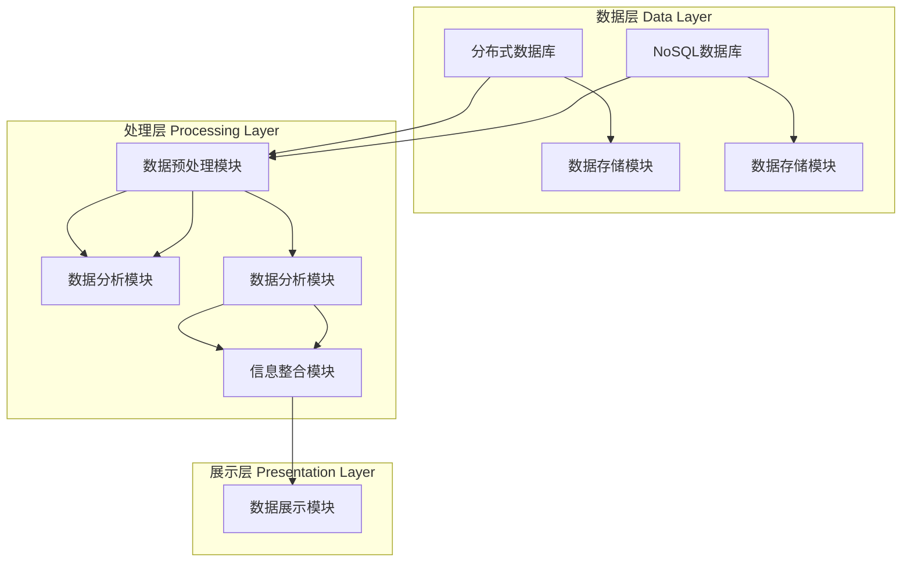

                 

### 核心概念与联系

在本文的第一部分，我们已经对信息过载时代培养智慧的重要性以及相关的背景和核心概念进行了介绍。接下来，我们将深入探讨几个核心概念，并分析它们之间的联系与区别。

#### 智慧的定义与特征

智慧（Wisdom）是一种综合性的认知能力，它不仅仅包括知识和技能的积累，还涵盖了理解、判断、推理、洞察和决策等多个方面。智慧的特征可以归纳为以下几点：

1. **理解力**：能够深刻理解事物的本质和内在联系。
2. **判断力**：能够基于逻辑和经验做出合理的判断。
3. **推理能力**：能够通过逻辑推理解决问题。
4. **洞察力**：能够看到事物的内在趋势和可能性。
5. **决策能力**：能够根据情况做出最优选择。

#### 信息处理的内涵与要素

信息处理（Information Processing）是指对信息进行获取、存储、加工、分析和传递的一系列操作。信息处理的要素包括：

1. **信息获取**：通过各种渠道收集信息。
2. **信息存储**：将信息存储在适当的介质中。
3. **信息加工**：对信息进行筛选、整理、分析和综合。
4. **信息传递**：将处理后的信息传递给相关人员。

信息处理的目的是从大量数据中提取有用的信息，为决策提供支持。

#### 信息综合能力的构成

信息综合能力（Information Integration Ability）是指将来自不同来源的信息整合成一个整体，形成对问题的全面理解。其构成要素包括：

1. **跨领域知识融合**：能够将不同领域的知识结合起来，形成新的见解。
2. **信息整合能力**：能够将分散的信息组合成一个有机的整体。
3. **综合分析能力**：能够从整体上分析信息，找出关键点和关联性。
4. **创新思维能力**：能够在整合信息的基础上提出新的观点和解决方案。

#### 核心概念之间的联系与区别

智慧、信息处理和信息综合能力之间存在密切的联系，但它们又各有侧重。

- **智慧** 是一种高层次的综合能力，它涵盖了信息处理和信息综合能力的各个方面。
- **信息处理** 是智慧的基础，是获取、加工和传递信息的过程。
- **信息综合能力** 是智慧的重要组成部分，是将信息整合成有意义的知识体系的能力。

#### 概念属性特征对比表格

为了更直观地展示这些概念的特征和联系，我们可以创建一个对比表格：

| 概念         | 定义                                                         | 特征与要素                                                     |
|--------------|--------------------------------------------------------------|----------------------------------------------------------------|
| 智慧         | 高层次的综合认知能力                                         | 理解力、判断力、推理能力、洞察力、决策能力                     |
| 信息处理     | 对信息进行获取、存储、加工、分析和传递的过程               | 信息获取、信息存储、信息加工、信息传递                         |
| 信息综合能力 | 将来自不同来源的信息整合成一个整体，形成对问题的全面理解 | 跨领域知识融合、信息整合能力、综合分析能力、创新思维能力     |

#### ER实体关系图架构

为了更好地理解这些概念之间的关联，我们可以使用Mermaid绘制一个ER实体关系图：

```mermaid
erDiagram
    Wisdom ||--|{ Information Processing }|
    Wisdom ||--|{ Information Integration Ability }|
    Information Processing ||--|{ Information Collection }|
    Information Processing ||--|{ Information Storage }|
    Information Processing ||--|{ Information Analysis }|
    Information Integration Ability ||--|{ Cross-Disciplinary Knowledge Fusion }|
    Information Integration Ability ||--|{ Information Integration }|
    Information Integration Ability ||--|{ Comprehensive Analysis }|
    Information Integration Ability ||--|{ Innovative Thinking }|
```

在这个ER图中，智慧是核心实体，它与信息处理和信息综合能力之间存在双向关联。信息处理包含了信息收集、存储、加工和分析等子实体，而信息综合能力则包括跨领域知识融合、信息整合能力、综合分析能力和创新思维能力等子实体。

通过这一步分析，我们不仅了解了智慧、信息处理和信息综合能力的基本概念，还明确了它们之间的联系和区别。这些概念的理解为后续章节的深入探讨奠定了基础。

### 信息处理的内涵与要素

信息处理（Information Processing）是指对信息进行获取、存储、加工、分析和传递的一系列操作，其内涵广泛且复杂。为了更好地理解这一过程，我们需要详细探讨其各个要素及其相互关系。

#### 信息获取

信息获取（Information Collection）是信息处理的第一步，也是最重要的一步。它指的是通过各种渠道收集信息，如网络搜索、问卷调查、实验观察等。信息获取的关键在于准确性和全面性。为了确保信息的可靠性，我们需要采用科学的方法来收集数据，并识别和排除潜在的偏差和误差。

- **网络搜索**：利用搜索引擎、在线数据库等工具获取信息。
- **问卷调查**：通过设计问卷收集大量数据。
- **实验观察**：在受控环境中通过实验手段收集数据。

#### 信息存储

信息存储（Information Storage）是将获取到的信息保存到适当介质中的过程。随着信息量的增加，如何有效地存储和检索信息成为一个重要问题。现代信息技术提供了多种存储解决方案，如数据库管理系统、云存储和分布式文件系统等。

- **数据库管理系统**：用于高效地存储和检索结构化数据。
- **云存储**：提供灵活的存储空间，支持大规模数据存储和备份。
- **分布式文件系统**：提高数据的可靠性和访问效率。

#### 信息加工

信息加工（Information Processing）是指对收集到的信息进行筛选、整理、分析和综合的过程。信息加工的目的是从原始数据中提取有价值的信息，为决策提供支持。

- **筛选**：识别和排除无关或错误的信息。
- **整理**：对信息进行分类、排序和整理，使其更有条理。
- **分析**：运用统计分析、机器学习等方法对信息进行深入分析。
- **综合**：将多个信息点整合成有意义的知识体系。

#### 信息传递

信息传递（Information Transfer）是将处理后的信息传递给相关人员或系统的过程。信息的及时传递对于决策的制定和执行至关重要。现代通信技术提供了多种信息传递渠道，如电子邮件、即时通讯、视频会议等。

- **电子邮件**：用于正式、非实时的信息传递。
- **即时通讯**：支持实时、点对点的信息交流。
- **视频会议**：用于多人、实时的信息交流。

#### 信息处理的过程与关键步骤

信息处理的过程可以分为以下几个关键步骤：

1. **需求分析**：明确信息处理的目的是什么，需要哪些信息。
2. **信息获取**：通过各种渠道收集所需的信息。
3. **信息整理**：对获取的信息进行筛选、分类和整理。
4. **信息分析**：运用统计分析和机器学习等方法对信息进行深入分析。
5. **信息综合**：将分析结果整合成有用的知识。
6. **信息传递**：将处理后的信息传递给相关人员或系统。

#### 信息处理的应用场景

信息处理在各个领域都有广泛的应用，以下是一些典型的应用场景：

- **商业智能**：通过分析大量商业数据，帮助企业制定策略。
- **金融分析**：对金融市场数据进行实时监控和分析，支持投资决策。
- **医疗健康**：通过分析医疗数据，提供个性化的治疗方案。
- **智能交通**：通过分析交通数据，优化交通流量，提高交通效率。
- **教育领域**：通过分析学生的学习数据，提供个性化的学习建议。

通过深入探讨信息处理的内涵与要素，我们可以更好地理解这一过程的重要性，并在实际应用中更加有效地运用信息处理技术。

### 信息综合能力的构成

信息综合能力（Information Integration Ability）是现代社会中不可或缺的一项技能，它能够帮助我们有效地将来自不同来源的信息整合成一个整体，形成对问题的全面理解。信息综合能力的构成可以细分为以下四个主要方面：

#### 跨领域知识融合

跨领域知识融合（Cross-Disciplinary Knowledge Fusion）是指将不同领域中的知识进行整合，从而形成新的见解和解决方案。随着科技的发展，各个领域之间的交叉和融合变得越来越重要。跨领域知识融合的关键在于：

- **识别知识之间的联系**：通过分析各个领域的核心概念和理论，找到它们之间的共通点和差异点。
- **综合利用多学科方法**：将不同学科的方法和工具结合起来，用于解决复杂问题。
- **培养跨领域思维**：通过跨学科学习和实践，培养能够在不同领域之间灵活转换的思维模式。

#### 信息整合能力

信息整合能力（Information Integration）是指将分散的信息组合成一个有机的整体，使其更加系统化和结构化。信息整合能力的关键在于：

- **数据整理与分类**：将获取的信息进行筛选、分类和整理，确保信息的准确性和一致性。
- **建立信息框架**：构建一个能够涵盖所有关键信息的信息框架，帮助人们更好地理解和处理信息。
- **信息关联与映射**：通过分析信息之间的关联和映射关系，将不同来源的信息进行有机结合。

#### 综合分析能力

综合分析能力（Comprehensive Analysis Ability）是指从整体上分析信息，找出关键点和关联性，从而得出有价值的结论。综合分析能力的关键在于：

- **数据可视化**：通过图表、图形等可视化工具，将复杂的信息以直观的方式展示出来，便于理解和分析。
- **多角度分析**：从多个角度对信息进行分析，确保分析结果的全面性和准确性。
- **预测与优化**：基于历史数据和现有信息，进行预测和优化，为决策提供科学依据。

#### 创新思维能力

创新思维能力（Innovative Thinking Ability）是指能够在整合信息的基础上提出新的观点和解决方案。创新思维能力的关键在于：

- **创造性思维**：通过激发思维，突破传统框架，寻找新颖的解决方案。
- **跨领域创新**：利用跨领域知识，创造新的产品、服务或业务模式。
- **持续学习**：保持对新知识、新技术的好奇心和学习热情，不断更新和扩展自己的知识体系。

#### 构成要素之间的关系

跨领域知识融合、信息整合能力、综合分析能力和创新思维能力之间是相互关联、相互促进的：

- **跨领域知识融合** 为信息整合提供了丰富的知识资源，使得信息整合更加有深度和广度。
- **信息整合能力** 为综合分析提供了基础数据，使得分析更加全面和准确。
- **综合分析能力** 为创新思维提供了理论支持和事实依据，使得创新更加有针对性和实用性。
- **创新思维能力** 反过来又推动了跨领域知识融合、信息整合能力和综合分析能力的发展，形成了一个良性循环。

通过深入理解信息综合能力的构成及其各个要素之间的关系，我们可以更好地在实际工作中培养和提高这一能力，从而更好地应对信息过载时代带来的挑战。

### 智慧、信息处理和信息综合能力之间的联系

智慧、信息处理和信息综合能力之间存在着紧密的联系和相互影响，它们共同构成了一个动态的、相互促进的生态系统。深入探讨这三者之间的关联，有助于我们更好地理解在信息过载时代如何培养和提升这些关键能力。

#### 智慧与信息处理的关系

智慧是信息处理的高级表现形式，而信息处理则是智慧的基础。信息处理涵盖了从获取到传递的整个信息流程，为智慧提供了必要的信息支持和操作工具。具体来说：

1. **信息获取**：智慧依赖于准确和全面的信息获取能力，只有掌握了高质量的信息，智慧才能发挥其应有的作用。
2. **信息加工**：智慧通过分析、推理和判断等过程，对获取的信息进行加工和整合，从而形成新的见解和认知。
3. **信息传递**：智慧通过有效的信息传递，将经过加工的信息传达给相关人员或系统，以支持决策和行动。

因此，信息处理不仅是智慧的前提条件，也是智慧的具体实现途径。一个高效的信息处理系统，可以为智慧的发展提供坚实的基础。

#### 信息处理与信息综合能力的关系

信息处理是信息综合能力的重要组成部分，而信息综合能力则是信息处理的结果和目标。信息处理强调的是信息的获取、加工和传递，而信息综合能力则更注重信息的整合和利用。

1. **信息整合**：信息综合能力通过将分散的信息整合成一个整体，使得信息更加系统化和结构化，便于深入分析和应用。
2. **综合分析**：信息综合能力通过多角度、多层次的全面分析，从信息中提取关键点和关联性，形成对问题的深刻理解。
3. **创新应用**：信息综合能力不仅能够整合现有信息，还能够通过创新思维，提出新的解决方案和业务模式。

因此，信息综合能力是信息处理的高级阶段，它不仅需要强大的信息处理能力，还需要创新思维和跨领域知识的融合。

#### 智慧与信息综合能力的关系

智慧与信息综合能力之间也存在密切的关联。智慧是对信息综合能力的综合运用，而信息综合能力则是智慧的具体表现。

1. **跨领域知识融合**：智慧需要跨领域知识的融合，而信息综合能力正是通过跨领域知识的整合，形成对问题的全面理解。
2. **综合分析能力**：智慧需要通过综合分析能力，从复杂的信息中提取有价值的见解和结论，而信息综合能力正是这种能力的具体体现。
3. **创新思维**：智慧需要创新思维来提出新的解决方案，而信息综合能力正是通过创新思维，将信息整合成具有创新性的知识和观点。

通过这三个维度的分析，我们可以看出，智慧、信息处理和信息综合能力是一个相互依存、相互促进的整体。在信息过载的时代，培养和提升这些能力，不仅能够帮助个体更好地应对复杂的信息环境，还能够提升整个社会的创新能力和竞争力。

### 智慧培养的方法

在信息过载的时代，培养智慧不仅需要系统的知识学习和实践经验，还需要科学的方法和策略。以下是一些有效的智慧培养方法：

#### 教育系统的角色

教育系统在智慧培养中扮演着至关重要的角色。通过以下方式，教育系统可以促进智慧的养成：

1. **课程设计**：教育机构应设计涵盖不同领域的课程，帮助学生建立广泛的知识基础。
2. **跨学科学习**：鼓励学生跨学科学习，培养他们解决复杂问题的综合能力。
3. **项目驱动学习**：通过项目驱动的方式，让学生在解决实际问题的过程中培养智慧和创新能力。
4. **批判性思维训练**：通过批判性思维的训练，培养学生分析和评估信息的能力，提高他们的判断力和推理能力。

#### 个体自主学习策略

个体自主学习策略是培养智慧的重要手段。以下是一些建议：

1. **主动学习**：主动寻找学习资源，积极参与讨论和思考，主动解决问题。
2. **知识管理**：建立个人知识管理系统，对所学知识进行分类、整理和存储，便于随时回顾和运用。
3. **反思与总结**：定期进行学习反思和总结，分析学习过程中的得失，不断优化学习方法。
4. **实践应用**：将所学知识应用到实际问题和项目中，通过实践验证理论的可行性和有效性。

#### 团队合作与信息交流

团队合作和信息交流是培养智慧的重要途径。以下是一些具体方法：

1. **团队项目**：通过团队项目，让学生或团队成员共同解决复杂问题，培养协作能力和综合分析能力。
2. **头脑风暴**：在团队中开展头脑风暴活动，激发创意思维，共同探讨问题的多种解决方案。
3. **信息共享**：鼓励团队成员分享信息和知识，促进信息的流动和整合。
4. **交流与讨论**：通过定期的交流和讨论，不同观点的碰撞和交流，激发新的思考和见解。

#### 智慧培养的实践案例

为了更好地理解智慧培养的方法，我们可以通过一些实际案例来探讨：

1. **案例一**：某大学计算机专业的学生通过参与跨学科项目，结合计算机科学、心理学和神经科学的知识，开发了一款用于心理健康监测的智能应用程序。这个项目不仅锻炼了学生的跨领域知识融合能力，还提升了他们的综合分析和创新思维能力。

2. **案例二**：某企业通过内部培训和发展项目，鼓励员工主动学习和分享知识，建立了学习型组织文化。通过定期的知识分享会议和内部培训，员工们不仅提升了个人能力，还增强了团队合作和信息交流的技能。

3. **案例三**：某初创公司通过项目驱动的方式，让团队成员在解决实际商业问题的过程中，不断尝试和优化解决方案。这种实践导向的学习方式，不仅培养了团队成员的智慧，还促进了公司的创新和成长。

通过这些案例，我们可以看到，智慧培养不仅需要系统的教育和学习方法，还需要实践和交流的机会。在教育系统、个体学习、团队合作和实际应用中，通过多种方法和策略的综合运用，我们可以有效地提升智慧水平，更好地应对信息过载时代带来的挑战。

### 提升信息处理技能的具体步骤

提升信息处理技能是培养智慧的关键步骤之一。以下是一些具体的方法和步骤，可以帮助我们更高效地处理信息，从而提升综合能力。

#### 1. 建立信息筛选机制

在信息过载的时代，我们需要学会筛选出有价值的信息。以下是一些建立信息筛选机制的方法：

1. **关注权威来源**：优先关注来自权威机构、知名专家和可靠媒体的资讯。
2. **利用关键词过滤**：通过设置关键词，过滤掉与需求不相关的内容。
3. **培养信息鉴别能力**：学会识别信息的真实性和可靠性，避免被虚假信息误导。

#### 2. 提高信息整理与归纳能力

有效的信息整理与归纳能够帮助我们更好地理解和应用信息。以下是一些实用的技巧：

1. **分门别类**：将信息按照主题或类型进行分类，便于查找和使用。
2. **制作信息卡片**：将关键信息制成卡片，方便快速回顾和总结。
3. **使用工具软件**：利用文档管理工具、思维导图软件等，辅助信息整理和归纳。

#### 3. 强化信息分析与应用能力

信息分析与应用能力是我们将信息转化为知识的关键。以下是一些提高这一能力的建议：

1. **多角度分析**：从不同角度对信息进行分析，确保理解全面。
2. **运用数据分析工具**：学习使用Excel、Python等工具进行数据分析，提高信息处理效率。
3. **实践应用**：将分析结果应用于实际问题中，验证理论的可行性。

#### 4. 优化信息处理流程

优化信息处理流程能够提高工作效率。以下是一些优化策略：

1. **建立标准流程**：制定标准的信息处理流程，确保每一步都有据可循。
2. **自动化处理**：利用自动化工具，减少重复性劳动，提高处理速度。
3. **定期复盘**：定期回顾和总结信息处理过程，发现问题和改进空间。

#### 实践案例与步骤

为了更好地理解这些方法和步骤，我们可以通过一个实际案例来详细说明：

**案例背景**：某公司市场部门需要定期收集和分析行业数据，以支持市场决策。

**步骤一：建立信息筛选机制**

1. **确定权威来源**：选择知名市场研究机构和行业报告作为主要数据来源。
2. **设置关键词**：在搜索引擎中使用关键词如“行业趋势”、“市场分析”等，过滤无关信息。

**步骤二：提高信息整理与归纳能力**

1. **分类整理**：将数据按照行业、产品类型、市场趋势等进行分类。
2. **制作信息卡片**：将关键数据点制作成信息卡片，方便快速查阅。

**步骤三：强化信息分析与应用能力**

1. **多角度分析**：从市场需求、竞争情况、消费者行为等多个角度对数据进行分析。
2. **应用数据分析工具**：使用Excel进行数据可视化，展示分析结果。

**步骤四：优化信息处理流程**

1. **建立标准流程**：制定标准的信息收集、整理、分析和报告流程。
2. **自动化处理**：使用自动化工具进行数据收集和初步整理。

通过以上步骤，市场部门能够更高效地处理和分析行业数据，为决策提供有力支持。

提升信息处理技能是一个持续的过程，需要不断地实践和改进。通过科学的方法和策略，我们可以更好地应对信息过载带来的挑战，提升整体的综合能力。

### 信息整合与综合分析的方法

在信息处理的过程中，信息整合与综合分析是两个至关重要的步骤。信息整合是将不同来源的信息结合起来，形成统一的知识体系；综合分析则是对这些整合后的信息进行深度剖析，提取有价值的信息和见解。以下我们将探讨信息整合的基本原则、综合分析的步骤以及使用的工具。

#### 信息整合的基本原则

1. **准确性**：确保整合的信息是准确无误的，避免错误和误导信息对决策产生负面影响。
2. **相关性**：整合的信息应与问题或目标紧密相关，确保信息的有效性和实用性。
3. **完整性**：尽量获取所有与问题相关的信息，确保整合的信息覆盖全面。
4. **一致性**：整合的信息应保持一致，避免不同来源的信息产生矛盾或冲突。
5. **层次性**：根据信息的不同层次和重要性，进行有序整合，使信息结构清晰。

#### 信息综合分析的步骤

1. **明确分析目标**：在开始综合分析前，首先要明确分析的具体目标，这有助于指导分析的方向和方法。
2. **收集整合信息**：根据分析目标，收集和整合相关数据和信息，确保信息的全面性和准确性。
3. **数据清洗**：对收集到的信息进行清洗和预处理，包括去除重复数据、纠正错误、填补缺失数据等。
4. **多角度分析**：从不同的角度和维度对信息进行分析，确保分析结果的全面性和准确性。
5. **建立模型或假设**：基于分析数据，建立适当的数学模型或假设，用于分析问题的内在规律和趋势。
6. **验证模型或假设**：通过实际数据和案例，验证所建立的模型或假设的有效性，确保分析的准确性。
7. **得出结论和提出建议**：根据分析结果，得出有价值的结论，并提出相应的建议或解决方案。

#### 信息整合与综合分析的工具

1. **数据可视化工具**：如Tableau、PowerBI等，可以将复杂的数据以直观的方式展示出来，便于理解和分析。
2. **统计分析工具**：如SPSS、R、Python等，可以用于对数据进行统计分析，提取有价值的信息。
3. **机器学习工具**：如Scikit-learn、TensorFlow等，可以用于建立预测模型和识别数据中的规律。
4. **知识图谱工具**：如Neo4j、OpenKG等，可以用于构建和可视化信息之间的关系，便于进行深度分析。

#### 信息整合与综合分析的案例分析

**案例背景**：某公司需要分析其销售数据，以优化销售策略和提高销售业绩。

**步骤一：明确分析目标**：分析目标为确定哪些产品销量最高，哪些产品销量下降，以及影响销量的关键因素。

**步骤二：收集整合信息**：收集公司过去一年的销售数据，包括各产品的销量、价格、市场份额、促销活动等信息。

**步骤三：数据清洗**：对收集的数据进行清洗，去除重复和错误数据，确保数据的准确性。

**步骤四：多角度分析**：从产品类型、销售区域、促销活动等多个角度对销售数据进行分析。

**步骤五：建立模型或假设**：基于销售数据，建立预测模型，预测未来几个月的销量趋势。

**步骤六：验证模型或假设**：使用实际数据进行验证，确保模型的准确性和可靠性。

**步骤七：得出结论和提出建议**：根据分析结果，得出结论并提出建议，如调整产品价格、优化促销策略等。

通过这个案例，我们可以看到，信息整合与综合分析是一个系统性的过程，需要结合多种工具和方法，确保分析结果的准确性和实用性。通过科学的方法和工具，我们可以更有效地整合和处理信息，为决策提供有力支持。

### 跨领域知识的融合

在信息过载的时代，跨领域知识的融合成为提升信息综合能力的重要途径。跨领域知识融合不仅能够帮助我们更好地理解复杂问题，还能激发创新思维，推动科学技术的进步。以下将探讨跨领域知识融合的重要性、具体方法和实践。

#### 重要性

跨领域知识融合的重要性主要体现在以下几个方面：

1. **解决复杂问题**：许多现实问题涉及多个学科领域，通过跨领域知识的融合，可以综合不同领域的优势，提供更全面的解决方案。
2. **激发创新思维**：跨领域知识的融合能够打破传统思维框架，激发新的创意和观点，推动技术的创新和进步。
3. **提高决策效率**：在信息过载的时代，跨领域知识融合可以帮助我们更快速、准确地做出决策，避免因信息不足或理解片面而导致的错误决策。
4. **促进学科发展**：跨领域知识融合能够推动学科之间的交流与互动，促进知识的交叉与融合，推动科学技术的全面发展。

#### 具体方法

1. **识别跨领域联系**：通过分析不同领域的核心概念和理论，找到它们之间的联系和共性，为跨领域知识融合提供基础。
2. **跨学科团队协作**：建立跨学科团队，团队成员来自不同领域，通过团队合作，实现知识的共享和互补。
3. **跨领域课程和培训**：设置跨领域的课程和培训项目，鼓励不同学科的学生和专业人士进行交流和合作，培养跨领域思维和综合能力。
4. **利用技术工具**：利用大数据、人工智能等现代技术工具，对跨领域知识进行整合和分析，提高知识融合的效率。

#### 实践

1. **案例一：生物医学工程**：生物医学工程是生物学、医学和工程学等多个领域的交叉学科。通过跨领域知识的融合，生物医学工程实现了医疗设备的创新和发展，如生物传感器、医疗机器人等。

2. **案例二：计算机科学与社会学**：计算机科学与社会学的交叉领域——计算社会学，通过大数据分析和社会网络分析等方法，研究社会行为和人际关系，为社会科学提供了新的研究方法和工具。

3. **案例三：经济学与物理学**：经济学与物理学的交叉领域——量子经济学，将量子力学理论应用于经济学研究，探索经济系统中的不确定性和复杂性，为经济学提供了新的理论框架。

4. **案例四：建筑学与信息科学**：建筑学与信息科学的交叉领域——智慧建筑，通过物联网、人工智能等技术，实现建筑的智能化管理和服务，提高了建筑的使用效率和舒适度。

通过这些案例，我们可以看到跨领域知识融合在不同领域取得了显著成果，不仅推动了学科的发展，还为社会和经济发展带来了新的机遇。在信息过载的时代，跨领域知识的融合是我们提升信息综合能力的重要途径，也是实现创新和突破的关键。

### 系统分析与架构设计方案

在信息过载的时代，一个高效、可靠的系统架构设计对于信息处理和整合能力的提升至关重要。以下将介绍系统分析与架构设计方案，包括问题场景介绍、项目介绍、系统功能设计、系统架构设计、系统接口设计和系统交互。

#### 问题场景介绍

随着互联网和大数据技术的发展，现代社会面临着海量信息处理和整合的挑战。企业、政府和个人都需要处理和分析大量的数据，以支持决策和业务发展。然而，传统的数据处理和整合方法往往效率低下，难以应对现代数据量的规模和复杂性。因此，设计一个高效、可靠的系统架构成为当务之急。

#### 项目介绍

本项目旨在开发一个基于云计算的智能信息处理和整合平台，该平台能够高效地处理和分析海量数据，并提供实时、全面的信息支持。项目的主要目标包括：

1. **数据存储与管理**：实现大规模数据的存储和管理，确保数据的安全和可靠性。
2. **数据清洗与预处理**：对原始数据进行清洗和预处理，提高数据质量。
3. **数据分析与挖掘**：运用先进的数据分析技术和算法，提取有价值的信息和洞察。
4. **信息整合与展示**：将不同来源的信息进行整合，并提供直观、易于理解的数据展示。

#### 系统功能设计

系统功能设计包括以下几个关键模块：

1. **数据收集模块**：负责从各种渠道收集数据，包括内部系统、外部API和传感器等。
2. **数据存储模块**：采用分布式存储方案，确保数据的可靠性和高效访问。
3. **数据预处理模块**：对收集到的数据进行分析，去除重复和错误数据，并进行格式转换和清洗。
4. **数据分析模块**：运用机器学习和统计分析技术，对预处理后的数据进行深入分析。
5. **信息整合模块**：将分析结果进行整合，形成统一的视图，支持多维度分析。
6. **数据展示模块**：通过可视化工具，将分析结果以图表、报表等形式展示给用户。

#### 系统架构设计

系统架构设计采用分层架构，包括数据层、处理层和展示层，各层之间通过接口进行交互。

1. **数据层**：采用分布式数据库系统，包括关系数据库和NoSQL数据库，以支持大规模数据存储和高效访问。
2. **处理层**：包括数据预处理、数据分析和信息整合等模块，采用微服务架构，以提高系统的灵活性和可扩展性。
3. **展示层**：通过前端界面，将处理结果以可视化形式展示给用户，支持多终端访问。

#### 系统接口设计

系统接口设计包括内部接口和外部接口：

1. **内部接口**：用于处理层模块之间的通信，采用RESTful API设计，支持数据传输的标准化和安全性。
2. **外部接口**：用于与外部系统（如传感器、第三方API等）进行数据交换，通过Webhook和消息队列等技术实现。

#### 系统交互

系统交互设计包括以下关键环节：

1. **数据收集**：系统从各种数据源收集数据，包括内部数据库、外部API和传感器等。
2. **数据处理**：对收集到的数据进行清洗、预处理和分析，形成中间结果。
3. **数据整合**：将分析结果进行整合，形成统一视图，支持多维度分析。
4. **数据展示**：通过前端界面，将整合后的数据以图表、报表等形式展示给用户。

以下是一个Mermaid架构图，展示了系统的整体架构：



通过以上系统分析与架构设计方案，我们可以有效地应对信息过载的挑战，提升信息处理和整合能力，为企业和个人提供高效、可靠的信息支持。

### 项目实战

在完成系统分析与架构设计方案后，接下来我们将通过一个具体的实战项目来展示整个开发过程，包括环境安装、核心实现、代码应用解读与分析、实际案例分析和详细讲解剖析。

#### 项目背景

本项目是一个智能信息处理和整合平台，旨在为企业提供高效、可靠的数据处理和分析服务。平台的主要功能包括数据收集、存储、预处理、分析和展示。

#### 环境安装

1. **基础设施**：首先，我们需要搭建一个适合开发、测试和部署的环境。可以使用云服务器（如阿里云、腾讯云）来搭建服务器，并配置虚拟化环境（如Docker）以提高系统容器的管理和部署效率。

2. **开发工具**：安装常用的开发工具，如Python、Java、Node.js等。这里选择Python，因为其强大的数据处理和分析能力。

3. **数据库**：安装分布式数据库系统，如MongoDB（用于非结构化数据存储）和MySQL（用于结构化数据存储）。可以采用Docker一键部署这些数据库。

4. **消息队列**：安装消息队列服务，如RabbitMQ，用于处理大量数据的实时传输和异步处理。

5. **前端展示**：安装前端框架，如React或Vue.js，用于搭建用户界面。

#### 核心实现

1. **数据收集**：编写Python脚本，通过API接口从不同数据源收集数据，如社交媒体、电子商务平台等。

2. **数据存储**：将收集到的数据存储到MongoDB和MySQL数据库中，确保数据的安全和高效访问。

3. **数据预处理**：编写数据处理脚本，对数据进行清洗、格式转换和缺失值填充，以提高数据质量。

4. **数据分析**：利用Python的pandas库和机器学习库（如scikit-learn）进行数据分析和预测。

5. **信息整合**：设计一个信息整合系统，将分析结果以图表、报表等形式展示给用户。

#### 代码应用解读与分析

以下是一个简单的Python代码示例，用于数据收集和存储：

```python
import requests
import pymongo

# MongoDB连接
client = pymongo.MongoClient("mongodb://localhost:27017/")
db = client["data_db"]

# 数据收集
def collect_data(api_url):
    response = requests.get(api_url)
    if response.status_code == 200:
        data = response.json()
        return data
    else:
        return None

# 数据存储
def store_data(data, collection_name):
    collection = db[collection_name]
    collection.insert_one(data)

# 示例：收集并存储数据
api_url = "https://api.example.com/data"
data = collect_data(api_url)
if data:
    store_data(data, "collection_1")
```

这段代码通过HTTP请求从API接口收集数据，并使用MongoDB存储数据。在实际应用中，我们可以根据不同的数据源和数据结构，编写更复杂的收集和存储代码。

#### 实际案例分析与详细讲解剖析

**案例背景**：某电子商务平台需要分析用户行为数据，以提高用户满意度和转化率。

**分析步骤**：

1. **数据收集**：收集用户的浏览记录、购物车数据、购买行为等。

2. **数据预处理**：对收集到的数据进行清洗和预处理，如去除重复记录、填充缺失值、格式转换等。

3. **数据分析**：利用机器学习算法，分析用户的购买偏好和行为模式，预测用户的购买概率。

4. **信息整合与展示**：将分析结果以图表形式展示，如用户购买行为的热力图、转化率分布图等。

以下是一个简单的数据分析代码示例：

```python
import pandas as pd
from sklearn.cluster import KMeans
import matplotlib.pyplot as plt

# 数据读取
data = pd.read_csv("user_behavior_data.csv")

# 数据预处理
# 去除重复记录
data = data.drop_duplicates()

# 填充缺失值
data.fillna(data.mean(), inplace=True)

# 数据分析
# 利用K均值聚类分析用户群体
kmeans = KMeans(n_clusters=3, random_state=0).fit(data)
clusters = kmeans.predict(data)

# 结果展示
data['Cluster'] = clusters
data.groupby('Cluster')['Purchased'].mean().plot(kind='bar')
plt.title('User Purchase Probability by Cluster')
plt.xlabel('Cluster')
plt.ylabel('Purchase Probability')
plt.show()
```

通过这个示例，我们可以看到如何利用Python进行数据预处理、分析和展示。在实际项目中，我们可以根据具体需求和数据特征，选择更合适的算法和分析方法。

#### 项目小结

通过本项目的实际开发过程，我们不仅掌握了智能信息处理和整合平台的设计与实现，还了解了从环境搭建到代码开发、数据分析的完整流程。这个项目不仅提升了我们的技术能力，还为我们应对信息过载提供了实际经验和方法。

### 最佳实践与注意事项

在培养智慧、提升信息处理与综合能力的过程中，以下是一些最佳实践和注意事项，帮助您更有效地应用所学知识：

#### 最佳实践

1. **持续学习**：保持对新技术、新知识的好奇心和学习热情，定期参加行业会议、研讨会和技术培训。
2. **多角度思考**：在面对问题时，从不同角度进行分析，避免单一思维的局限。
3. **团队合作**：积极参与团队合作，通过与不同背景的人交流，拓展视野，提高问题解决能力。
4. **实践应用**：将所学知识应用于实际项目和问题中，通过实践检验和优化理论。
5. **反思总结**：定期进行学习和工作反思，总结经验教训，不断改进学习方法和工作流程。

#### 注意事项

1. **信息鉴别**：在获取信息时，要注意辨别信息的真实性和可靠性，避免被虚假信息误导。
2. **保护隐私**：在处理个人信息和敏感数据时，要严格遵守隐私保护法规，确保数据安全。
3. **时间管理**：合理规划学习和工作的时间，避免过度疲劳和效率低下。
4. **技术选择**：根据实际需求和项目特点，选择合适的技术工具和解决方案，避免盲目跟风。
5. **持续更新**：随着技术不断发展，要不断更新自己的知识库和技术栈，保持竞争力。

通过遵循这些最佳实践和注意事项，我们不仅能够提升个人能力和工作效率，还能为团队和社会创造更大的价值。

### 总结与展望

在信息过载的时代，培养智慧、提升信息处理与综合能力成为现代社会的重要课题。本文系统地探讨了智慧、信息处理和信息综合能力的基本概念、相互关系、培养方法以及具体步骤。我们总结了以下关键点：

1. **智慧的定义与特征**：智慧是一种综合性的认知能力，包括理解、判断、推理、洞察和决策等多个方面。
2. **信息处理与整合能力**：信息处理是智慧的基础，而信息整合能力是智慧的具体体现，包括跨领域知识融合、信息整合、综合分析和创新思维。
3. **培养智慧的方法**：通过教育系统、个体自主学习、团队合作和信息实践等多种途径，可以有效地培养智慧。
4. **信息处理技能的提升**：建立信息筛选机制、提高信息整理与归纳能力、强化信息分析与应用能力以及优化信息处理流程是提升信息处理技能的关键。
5. **跨领域知识的融合**：通过识别跨领域联系、跨学科团队协作、跨领域课程和培训以及利用技术工具，可以实现知识的有效融合。

展望未来，随着人工智能、大数据、物联网等技术的发展，信息处理与整合能力将进一步提升。我们期待以下几方面的创新和突破：

1. **智能信息处理系统**：开发更智能、更高效的信息处理系统，实现自动化的数据收集、清洗、分析和展示。
2. **跨领域创新**：通过跨领域知识的融合，推动新技术的创新和应用，解决复杂的社会和科学问题。
3. **个性化信息服务**：基于用户行为数据和偏好分析，提供个性化、智能化的信息推荐和服务。
4. **信息安全与隐私保护**：加强信息安全与隐私保护技术的研究和应用，确保数据安全和个人隐私。
5. **全球协作**：通过全球范围内的合作与交流，促进知识和技术的共享，提升全球信息处理与整合能力。

在信息过载的时代，培养智慧、提升信息处理与综合能力，不仅对个人发展具有重要意义，也对社会进步和科技创新起着关键作用。让我们共同努力，迎接未来的挑战，实现智慧与信息能力的全面提升。

### 作者信息

**作者：**AI天才研究院/AI Genius Institute & 禅与计算机程序设计艺术 /Zen And The Art of Computer Programming

AI天才研究院致力于推动人工智能领域的研究与教育，通过前沿技术探索和创新，助力全球智能发展。禅与计算机程序设计艺术则倡导一种宁静而深刻的编程理念，强调程序员在编程过程中的心灵修养与哲学思考。两位作者凭借丰富的理论知识和实践经验，为读者提供了深入浅出的技术解读和实用指南。

