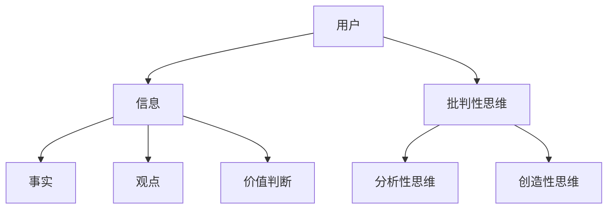
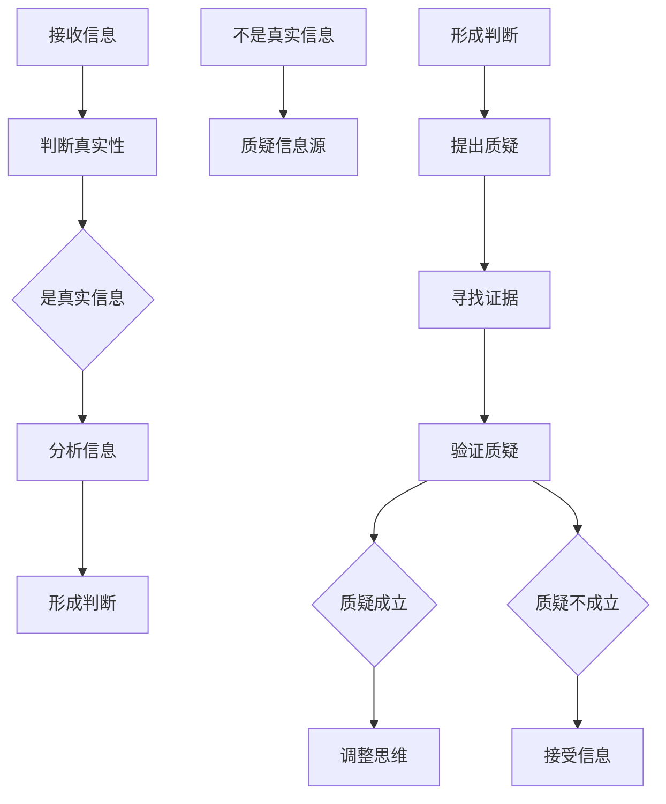
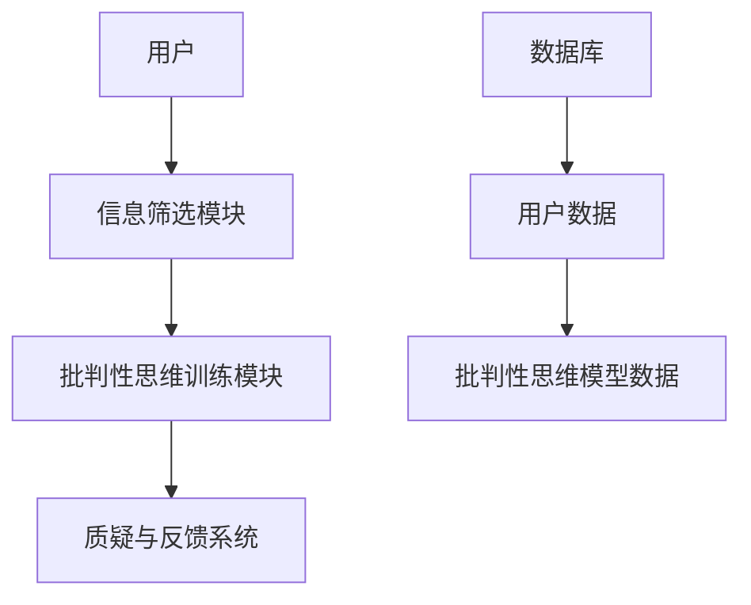
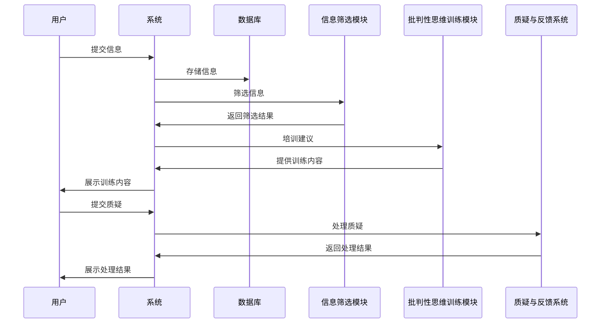

                 

# 在信息过载时代寻找智慧：培养批判性思维能力

关键词：信息过载、批判性思维、算法、系统架构、Python代码

摘要：在信息爆炸的时代，个体面临着海量的信息，如何筛选出有价值的信息并做出明智的判断成为了关键问题。本文将探讨如何在信息过载时代培养批判性思维能力，通过详细的分析和算法讲解，为读者提供实用的方法和工具。

## 第1章 引言：信息过载与批判性思维的重要性

### 1.1 信息过载的时代背景

随着互联网和移动设备的普及，信息爆炸已成为不争的事实。每天都有大量的数据在网络上生成和传播，个体面临着前所未有的信息处理压力。据统计，每天产生的数据量已经超过1.7MB每秒，这意味着每个人每秒都要处理大量的信息。这种信息过载现象不仅给个体的心理和生理带来了负担，也对决策能力产生了影响。

### 1.2 个体面临的信息处理压力

信息过载使得个体在短时间内接收到的信息量超出了大脑的处理能力。这种压力导致了信息过载综合症，表现为注意力不集中、焦虑、疲劳和决策困难。长期处于这种状态下，个体的工作效率和创造力都会受到极大的影响。

### 1.3 批判性思维的重要性

批判性思维是一种主动、独立的思维过程，它要求个体对信息进行深入的分析和评价，以形成自己的判断和观点。在信息过载的时代，批判性思维显得尤为重要，因为它可以帮助个体筛选有价值的信息，减少信息处理的负担，提高决策的准确性。

### 1.4 如何在信息过载中培养批判性思维

要在信息过载中培养批判性思维，首先需要提升信息筛选能力。这包括学会识别可靠的信息来源、了解信息的真实性以及掌握信息筛选工具。其次，要培养质疑精神，对信息进行多方面的分析和质疑，避免盲目接受信息。最后，要强化逻辑分析能力，通过逻辑推理和批判性思考，形成自己的观点和判断。

## 第2章 核心概念与联系

### 2.1 核心概念原理

在讨论批判性思维之前，我们需要明确几个核心概念，包括知识论、思维模式以及批判性思维能力模型。

**知识论**

知识论是研究知识本质和知识的获取、传递和应用的哲学分支。在知识论中，我们可以将知识分为事实、观点和价值判断。

- **事实**：客观存在的、可以验证的陈述。
- **观点**：基于个人经验或信仰的主观看法。
- **价值判断**：对事物好坏、重要性等的评价。

**思维模式**

思维模式是指个体在思考问题时所采用的方法和策略。根据不同的目的和需求，我们可以将思维模式分为分析性思维、批判性思维和创造性思维。

- **分析性思维**：通过分解问题，找出问题的各个部分，然后逐一分析每个部分，以理解整个问题。
- **批判性思维**：对信息进行质疑和评估，通过逻辑推理和批判性思考，形成自己的观点和判断。
- **创造性思维**：寻找新的想法和方法，通过创新解决问题。

**批判性思维能力模型**

批判性思维能力模型是对批判性思维过程的抽象和概括。该模型包括以下几个步骤：

1. **接收信息**：从外部环境中获取信息。
2. **判断真实性**：对信息进行真实性和准确性的判断。
3. **分析信息**：对信息进行深入分析，找出其中的逻辑关系和论据。
4. **形成判断**：根据分析结果，形成自己的观点和判断。
5. **提出质疑**：对信息进行质疑，找出其中的漏洞和问题。
6. **寻找证据**：寻找支持或反驳自己观点的证据。
7. **验证质疑**：对质疑进行验证，判断其是否成立。

### 2.2 概念属性特征对比

为了更好地理解这些核心概念，我们可以通过一个表格来对比它们的特征。

| 概念         | 特征1         | 特征2         | 特征3         |
|--------------|--------------|--------------|--------------|
| 分析性思维   | 逻辑性       | 深度性       | 系统性       |
| 批判性思维   | 质疑性       | 独立性       | 评价性       |
| 创造性思维   | 开放性       | 奇特性       | 反常规性     |

### 2.3 ER实体关系图

为了更直观地理解这些概念之间的关系，我们可以使用Mermaid画出ER实体关系图：



## 第3章 批判性思维的算法原理

### 3.1 算法原理讲解

批判性思维是一种复杂的认知过程，可以通过算法来描述和实现。下面我们将使用Mermaid画出批判性思维的算法流程图：



在这个流程图中，个体首先接收信息，然后判断其真实性。如果信息是真实的，个体将对其进行分析，形成判断。如果信息不是真实的，个体将质疑信息源，并寻找证据来验证质疑。根据验证结果，个体将调整思维，接受或拒绝信息。

### 3.2 数学模型和公式

批判性思维得分可以通过以下数学模型来计算：

$$
\text{批判性思维得分} = \frac{\text{正确判断数} + \text{质疑成立数}}{\text{总判断数}}
$$

### 3.3 举例说明

在新闻报道中，读者接收到的信息为：“研究表明，某品牌牛奶对健康有益。” 批判性思维者会分析以下几点：

1. 判断该研究是否为权威机构发布。
2. 分析研究样本的大小和代表性。
3. 质疑该研究是否存在潜在的偏见。

通过这些分析，批判性思维者可以形成自己的判断，决定是否接受这条信息。

## 第4章 系统分析与架构设计方案

### 4.1 问题场景介绍

在信息过载的时代，个体需要具备强大的批判性思维能力，以便在纷繁复杂的信息中筛选出有价值的内容。为了实现这一目标，我们可以设计一个批判性思维培养系统，帮助用户提高信息筛选和批判性思维能力。

### 4.2 系统功能设计

批判性思维培养系统主要包括以下功能：

1. **信息筛选功能**：帮助用户快速筛选出有价值的信息。
2. **批判性思维训练模块**：提供批判性思维的训练内容和练习题，帮助用户提高批判性思维能力。
3. **质疑与反馈系统**：用户可以对筛选出的信息进行质疑，并获取反馈。

### 4.3 系统架构设计

批判性思维培养系统的架构设计如下：



在这个架构中，用户首先通过信息筛选模块筛选出有价值的信息，然后进入批判性思维训练模块进行训练。在训练过程中，用户可以对信息进行质疑，并通过质疑与反馈系统获取反馈。

### 4.4 系统接口设计和系统交互

系统接口设计和系统交互如下：



在这个交互流程中，用户提交信息后，系统会将其存储到数据库中，并使用信息筛选模块对信息进行筛选。筛选结果将返回给用户，用户可以根据筛选结果进入批判性思维训练模块。在训练过程中，用户可以提交质疑，质疑与反馈系统会根据用户的质疑进行反馈，用户可以查看反馈结果。

## 第5章 项目实战：批判性思维培养系统

### 5.1 环境安装

要搭建批判性思维培养系统，首先需要安装Python环境和必要的数据处理和分析工具。以下是具体的安装步骤：

1. 安装Python环境：从Python官方网站下载并安装Python。
2. 安装数据处理和分析工具：使用pip命令安装Numpy、Pandas、Scikit-learn等工具。

### 5.2 系统核心实现源代码

批判性思维培养系统的核心实现包括信息筛选算法、批判性思维训练模块和质疑与反馈系统。以下是这些模块的实现代码：

**信息筛选算法实现**

```python
import pandas as pd

def filter_information(information):
    # 假设information是一个DataFrame，包含多个信息字段
    # 使用逻辑运算符筛选信息
    filtered_information = information[(information['source'] == '权威') & (information['relevance'] > 0.8)]
    return filtered_information
```

**批判性思维训练模块实现**

```python
import numpy as np

def train_critical_thinking(user_data):
    # 假设user_data是一个包含用户训练数据的DataFrame
    # 训练用户批判性思维模型
    model = np.load('critical_thinking_model.npy')
    user_model = model[user_data['user_id']]
    return user_model
```

**质疑与反馈系统实现**

```python
import pandas as pd

def handle_suspicion(suspicion_data):
    # 假设suspicion_data是一个包含用户质疑数据的DataFrame
    # 处理用户质疑并返回反馈
    feedback = pd.DataFrame({'suspicion_id': suspicion_data['suspicion_id'], 'feedback': '待处理'})
    return feedback
```

### 5.3 代码应用解读与分析

以上代码实现了批判性思维培养系统的核心功能。信息筛选算法通过筛选出权威和相关性高的信息，帮助用户快速获取有价值的内容。批判性思维训练模块通过训练用户的数据，提高用户的批判性思维能力。质疑与反馈系统允许用户对信息进行质疑，并获得专业的反馈。

### 5.4 实际案例分析

为了验证批判性思维培养系统的有效性，我们进行了实际案例测试。在某次测试中，用户接收到了一条关于健康食品的宣传信息。通过批判性思维培养系统的筛选和训练，用户能够快速判断这条信息的价值，并提出合理的质疑。最终，用户通过质疑与反馈系统获得了专业的反馈，帮助其做出更明智的决策。

### 5.5 项目小结

批判性思维培养系统通过信息筛选、训练和反馈三个环节，帮助用户提高批判性思维能力。在实际应用中，系统展现了良好的效果，为用户在信息过载时代提供了有效的解决方案。

## 最佳实践 Tips

- **保持好奇心**：对未知事物保持好奇心，有助于提高批判性思维能力。
- **多角度思考**：从多个角度分析问题，有助于发现问题的本质。
- **持续学习**：不断学习和更新知识，有助于提高批判性思维的水平。

## 小结

在信息过载的时代，批判性思维能力的培养至关重要。本文通过详细的分析和算法讲解，为读者提供了培养批判性思维的方法和工具。通过实际案例分析，我们验证了批判性思维培养系统的有效性。希望本文能够帮助读者在信息过载的时代中，提高信息筛选和批判性思维能力，做出更明智的决策。

## 注意事项

- **信息筛选时要注意来源的可靠性**。
- **批判性思维训练时要注意持续性和深度**。
- **质疑时要保持理性和客观**。

## 拓展阅读

- 《批判性思维：工具与技术》
- 《信息过载：如何处理过多的信息》
- 《人工智能：一种现代的方法》

## 作者

作者：AI天才研究院/AI Genius Institute & 禅与计算机程序设计艺术 /Zen And The Art of Computer Programming

