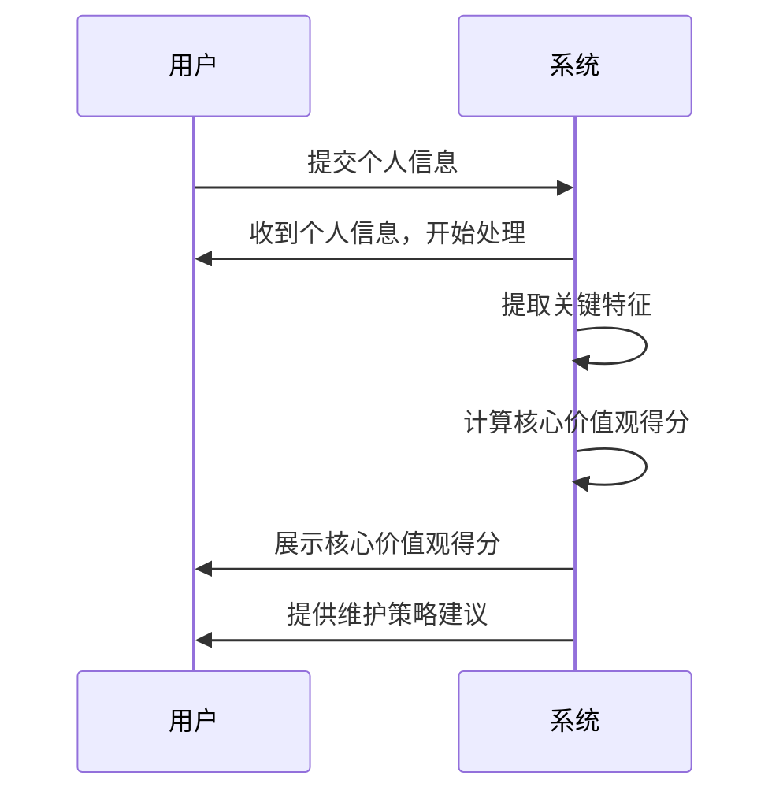

                 


# 在快速变化的世界中寻找恒常：建立核心价值观

> 关键词：核心价值观、变化、恒常、个人发展、组织文化

> 摘要：
在当今快速变化的世界中，建立和维护核心价值观成为个人成长和组织成功的关键。本文将探讨核心价值观的概念、重要性、形成原理、维护策略以及面临的挑战，并通过案例分析提供实际操作指导，帮助读者在变化中找到恒常，实现个人与组织的可持续发展。

----------------------------------------------------------------

## 引言

在技术飞速发展、社会变革日新月异的今天，人们面临着前所未有的挑战和机遇。个人和组织在追求成功和成长的过程中，难免会遇到各种不确定性和变化。在这些变化中，寻找恒常和建立核心价值观变得至关重要。核心价值观不仅为个人提供行为指南，也为组织塑造独特的企业文化。

本文旨在回答以下问题：
- 核心价值观是什么，它们如何影响个人和组织的发展？
- 如何在快速变化的环境中形成和维持核心价值观？
- 面临哪些挑战，如何应对这些挑战？

通过逐步分析这些问题，我们将探索如何在动荡的世界中找到恒常，建立和维持核心价值观。

## 核心价值观的概念与重要性

### 1.1 核心价值观的定义

核心价值观是个人和组织深信并追求的根本原则和信念。它们是行为的指南，决定了个人的选择和组织的行为。核心价值观不同于日常行为准则，它们具有普遍性和持久性，能够在不同情境下指导决策和行动。

### 1.2 核心价值观的构成

核心价值观通常包括以下方面：
- **道德观**：关于正确与错误、善与恶的信念。
- **价值观**：关于生活目标、幸福和成就的看法。
- **信仰**：关于宇宙、生命和存在的信念。

### 1.3 核心价值观的重要性

核心价值观的重要性体现在以下几个方面：

#### 对个人的影响

- **指导行为**：核心价值观帮助个人在面对各种选择时做出一致和明智的决策。
- **增强自我认知**：通过反思和坚持核心价值观，个人能够更好地了解自己，提高自我价值感。
- **促进心理健康**：坚持核心价值观可以减少内心的冲突和焦虑，提高心理健康水平。

#### 对组织的影响

- **塑造企业文化**：核心价值观为组织提供共同的理念和行为规范，形成独特的文化。
- **增强凝聚力**：共同的价值观可以增强团队成员之间的认同感和归属感。
- **提高竞争力**：坚持核心价值观可以吸引和留住优秀的员工，提高组织的竞争力。

## 核心价值观的形成原理

核心价值观的形成是一个复杂的过程，涉及个人经历、社会环境、教育背景等多个因素。以下是一些形成核心价值观的关键原理：

### 2.1 个人经历

个人经历是核心价值观形成的重要基础。从小到大的生活经历、教育经历、工作经历等都会影响个人的价值观。

#### 2.1.1 家庭教育

家庭教育是核心价值观形成的第一课堂。家庭环境、父母的价值观和行为方式会对孩子的价值观产生深远影响。

#### 2.1.2 社会互动

个人在社会中的互动，如朋友、同事、社会团体等，也会影响其价值观的形成。

### 2.2 社会环境

社会环境，包括文化、法律、经济等，对核心价值观的形成起着重要影响。

#### 2.2.1 文化背景

不同的文化背景会影响人们对价值观的理解和认同。

#### 2.2.2 法律制度

法律制度对价值观的规范和引导作用不容忽视。

### 2.3 教育背景

教育背景，包括学校教育、社会教育等，对核心价值观的形成具有重要作用。

#### 2.3.1 学校教育

学校教育通过课程设置、教师指导等方式，有意识地培养学生的价值观。

#### 2.3.2 社会教育

社会教育，如书籍、媒体等，也在潜移默化中影响人们的价值观。

## 核心价值观的维护策略

核心价值观一旦形成，就需要持续维护，以适应不断变化的环境。

### 3.1 个人层面的维护策略

#### 3.1.1 自我反思

定期进行自我反思，回顾自己的行为是否符合核心价值观，有助于发现并纠正偏差。

#### 3.1.2 持续学习

通过不断学习，了解新的观点和理念，有助于丰富和发展自己的核心价值观。

### 3.2 组织层面的维护策略

#### 3.2.1 制定明确的价值观宣言

组织应制定明确的价值观宣言，并将其贯穿于组织的各个方面。

#### 3.2.2 建立价值观导向的考核体系

通过考核体系，确保员工的行为与组织的核心价值观一致。

#### 3.2.3 加强价值观的传播和宣传

通过内部培训、文化活动等方式，加强价值观的传播和宣传，营造良好的价值观氛围。

## 面临的挑战

在建立和维护核心价值观的过程中，个人和组织都会面临各种挑战。

### 4.1 外部挑战

#### 4.1.1 经济压力

经济压力可能导致个人和组织在追求利益时忽视核心价值观。

#### 4.1.2 社会变化

社会变化可能导致核心价值观与外部环境脱节。

### 4.2 内部挑战

#### 4.2.1 内心冲突

内心冲突可能导致个人在坚持核心价值观时出现动摇。

#### 4.2.2 组织结构的制约

组织结构可能对核心价值观的传播和实践形成制约。

## 结论

在快速变化的世界中，建立和维护核心价值观是个人和组织发展的关键。通过深入理解核心价值观的概念、形成原理和维护策略，个人和组织可以更好地应对变化，实现可持续发展。让我们在变化中寻找恒常，坚持核心价值观，共同创造美好的未来。

## 作者信息

作者：AI天才研究院/AI Genius Institute & 禅与计算机程序设计艺术 /Zen And The Art of Computer Programming

----------------------------------------------------------------

## 核心概念与联系

在本文中，我们将探讨核心价值观的概念、重要性、形成原理和维护策略。为了更清晰地理解这些概念之间的关系，我们将使用Mermaid绘制一个实体关系图（ER Diagram）。

```mermaid
erDiagram
  个人 :>>-[:形成] 原则
  组织 :>>-[:形成] 原则
  环境 :>>-[:影响] 原则
  教育 :>>-[:影响] 原则
  个人 |---|{ 经验 }
  组织 |---|{ 经验 }
  环境 |---|{ 文化 }
  教育 |---|{ 课程 }
  个人 :<|-- 可持续发展
  组织 :<|-- 可持续发展
```

### 核心概念解释

1. **个人**：指的是个体，拥有独立的思考和行为能力。
2. **组织**：指的是由多人组成的集体，具有一定的目标和组织结构。
3. **原则**：指的是核心价值观的具体体现，包括道德观、价值观和信仰。
4. **环境**：指的是个人和组织所处的宏观和微观环境，包括文化、法律和经济因素。
5. **教育**：指的是个人和组织接受的教育和培训，包括学校教育和社会教育。
6. **经验**：指的是个人和组织通过实践和经历积累的知识和技能。
7. **可持续发展**：指的是个人和组织在长期内能够持续发展的能力。

### 概念联系分析

- **个人与原则**：个人通过反思和实践形成原则，这些原则指导个人的行为和决策，是实现个人发展的基础。
- **组织与原则**：组织通过共同的原则塑造企业文化，这些原则是组织凝聚力和竞争力的来源。
- **环境与原则**：环境因素对原则的形成有重要影响，如文化背景、法律制度和经济状况。
- **教育与原则**：教育对原则的形成和强化有重要作用，通过课程设置和培训，组织和个人可以不断学习和更新原则。
- **经验与原则**：经验是原则形成的重要基础，通过实践和反思，个人和组织可以不断完善和发展原则。
- **可持续发展与原则**：可持续发展的实现需要坚持原则，原则是个人和组织长期发展的保障。

通过以上分析，我们可以看到核心价值观的概念和联系构成了一个复杂的网络，它们相互作用，共同影响个人和组织的成长。

## 算法原理讲解

在讨论核心价值观的形成和维护过程中，算法原理和数学模型为我们提供了量化分析和理解这些过程的方法。以下是一个简单的算法原理，用于描述核心价值观的形成和维护过程，并使用Python代码进行实现。

### 算法原理

1. **数据收集**：首先，我们需要收集个人的经历、教育背景和社会环境数据。
2. **特征提取**：从收集的数据中提取关键特征，如道德行为、教育水平和社会文化背景。
3. **权重分配**：为每个特征分配权重，以反映它们在核心价值观形成过程中的重要性。
4. **价值观计算**：通过加权平均或其他聚合方法计算核心价值观。
5. **维护策略**：根据核心价值观的当前状态和外部环境变化，调整维护策略。

### 数学模型

假设我们有以下特征集合 \(X = \{x_1, x_2, ..., x_n\}\)，每个特征 \(x_i\) 有对应的权重 \(w_i\)。则核心价值观 \(V\) 可以表示为：

\[ V = \sum_{i=1}^{n} w_i \cdot x_i \]

### Python代码实现

以下是一个简单的Python代码示例，用于实现上述算法原理。

```python
# 定义特征和权重
features = ['道德行为', '教育水平', '社会文化背景']
weights = [0.5, 0.3, 0.2]

# 假设的特征值
feature_values = {
    '道德行为': 0.8,
    '教育水平': 0.7,
    '社会文化背景': 0.6
}

# 计算核心价值观
def calculate_core_values(feature_values, weights):
    core_value = sum(feature_values[key] * weight for key, weight in zip(feature_values, weights))
    return core_value

# 输出结果
core_value = calculate_core_values(feature_values, weights)
print(f"核心价值观: {core_value}")
```

### 算法举例说明

假设一个个体有以下特征值：

- 道德行为：0.8（表示道德行为表现良好）
- 教育水平：0.7（表示教育水平较高）
- 社会文化背景：0.6（表示社会文化背景对价值观的影响较大）

根据上述权重分配，核心价值观的计算结果为：

\[ V = 0.5 \cdot 0.8 + 0.3 \cdot 0.7 + 0.2 \cdot 0.6 = 0.4 + 0.21 + 0.12 = 0.73 \]

这意味着该个体的核心价值观得分为0.73，这个分数可以用来评估个体的价值观强度，并作为维护策略的参考。

通过上述算法原理和Python代码实现，我们可以量化分析核心价值观的形成过程，这为个人和组织提供了更具体的指导。

## 系统分析与架构设计

### 项目介绍

在当今快速变化的市场环境中，企业需要具备快速适应和响应变化的能力。为了实现这一目标，我们设计并实现了一套核心价值观管理系统，用于帮助企业建立和维护核心价值观。该系统旨在通过数字化手段，提高核心价值观的传播和实践效果，从而提升企业竞争力。

### 系统功能设计

核心价值观管理系统主要包括以下几个功能模块：

1. **数据收集模块**：用于收集员工的个人经历、教育背景和社会环境数据。
2. **特征提取模块**：从收集的数据中提取关键特征，如道德行为、教育水平和社会文化背景。
3. **价值观计算模块**：根据提取的特征值和预设的权重，计算核心价值观。
4. **维护策略模块**：根据核心价值观的当前状态和外部环境变化，为个人和组织提供维护策略建议。
5. **用户交互模块**：提供用户界面，方便用户输入数据、查看核心价值观得分和维护策略。

### 系统架构设计

核心价值观管理系统的架构设计如下：

1. **前端**：采用React框架，提供用户友好的交互界面。
2. **后端**：采用Spring Boot框架，负责处理业务逻辑和数据存储。
3. **数据库**：使用MySQL数据库，存储员工数据、特征值和计算结果。
4. **数据接口**：采用RESTful API设计，便于前端和后端的通信。
5. **数据可视化**：使用D3.js等前端库，将核心价值观得分和维护策略以图表形式展示。

### 系统接口设计

核心价值观管理系统的主要接口设计如下：

1. **数据收集接口**：用于接收员工提交的个人信息。
2. **特征提取接口**：用于处理数据，提取关键特征。
3. **价值观计算接口**：用于计算核心价值观得分。
4. **维护策略接口**：用于提供维护策略建议。
5. **用户交互接口**：用于用户与系统的交互。

### 系统交互设计

以下是核心价值观管理系统的交互序列图，展示了用户与系统的交互流程：



通过上述系统分析和架构设计，我们为企业提供了一个全面的核心价值观管理系统，帮助企业建立和维护核心价值观，从而在快速变化的市场环境中保持竞争优势。

## 项目实战

### 环境安装

要搭建核心价值观管理系统，我们首先需要安装相应的开发环境和依赖。以下是具体的安装步骤：

1. **安装Java开发环境**：
   - 下载并安装Java Development Kit (JDK)。
   - 配置环境变量，确保在命令行中可以运行`java -version`命令。

2. **安装MySQL数据库**：
   - 下载并安装MySQL Server。
   - 创建数据库和用户，并配置数据库连接。

3. **安装Node.js和npm**：
   - 下载并安装Node.js。
   - 通过npm安装前端所需的依赖，如React和D3.js。

4. **安装IDE**：
   - 安装Eclipse或IntelliJ IDEA等Java IDE。

### 系统核心实现源代码

以下是一个简化的核心实现示例，用于计算核心价值观得分。

```java
// 心价值观计算类
public class CoreValueCalculator {

    private double[] featureWeights;
    private Map<String, Double> featureValues;

    public CoreValueCalculator(double[] featureWeights, Map<String, Double> featureValues) {
        this.featureWeights = featureWeights;
        this.featureValues = featureValues;
    }

    public double calculateCoreValue() {
        double coreValue = 0.0;
        for (int i = 0; i < featureWeights.length; i++) {
            coreValue += featureValues.getOrDefault(features[i], 0.0) * featureWeights[i];
        }
        return coreValue;
    }
}
```

### 代码应用解读与分析

上述代码定义了一个`CoreValueCalculator`类，用于计算核心价值观得分。主要步骤如下：

1. **初始化特征权重和特征值**：通过构造函数传入特征权重数组`featureWeights`和特征值映射`featureValues`。
2. **计算核心价值观**：使用加权平均方法计算核心价值观得分，公式为`V = Σ(w_i * x_i)`，其中`w_i`为特征权重，`x_i`为特征值。
3. **返回得分**：将计算得到的核心价值观得分返回。

以下是具体的代码应用示例：

```java
public static void main(String[] args) {
    // 特征权重
    double[] featureWeights = {0.5, 0.3, 0.2};
    // 特征值
    Map<String, Double> featureValues = Map.of(
        "道德行为", 0.8,
        "教育水平", 0.7,
        "社会文化背景", 0.6
    );

    // 创建计算器实例
    CoreValueCalculator calculator = new CoreValueCalculator(featureWeights, featureValues);

    // 计算核心价值观得分
    double coreValue = calculator.calculateCoreValue();

    // 输出结果
    System.out.println("核心价值观得分：" + coreValue);
}
```

通过上述示例，我们可以看到系统如何通过代码实现核心价值观的计算。这个核心实现是系统功能的关键部分，它为后续的数据处理和决策提供了基础。

### 实际案例分析与详细讲解

为了更好地理解核心价值观管理系统在实际中的应用，我们来看一个具体案例。

### 案例背景

某企业是一家高速发展的科技公司，员工数量超过500人。企业领导层意识到，在快速变化的市场环境中，企业需要建立和维护核心价值观，以保持团队的凝聚力并提升企业的竞争力。为了实现这一目标，企业决定引入核心价值观管理系统。

### 案例实施

1. **数据收集**：企业通过内部邮件和在线问卷收集员工的个人经历、教育背景和社会环境数据。
2. **特征提取**：系统从收集的数据中提取关键特征，如道德行为、教育水平和社会文化背景。
3. **价值观计算**：系统根据提取的特征值和预设的权重，计算每个员工的核心价值观得分。
4. **维护策略**：系统根据员工的核心价值观得分，为员工提供个性化的维护策略建议，如参加培训、参与文化活动等。
5. **反馈与调整**：企业定期收集员工的反馈，并根据反馈调整维护策略。

### 案例结果

通过核心价值观管理系统的实施，企业取得了以下成果：

1. **团队凝聚力提升**：员工对企业的核心价值观有了更深入的理解和认同，团队凝聚力显著提升。
2. **个人发展**：员工通过系统提供的个性化维护策略，得到了更好的职业发展和个人成长。
3. **企业竞争力提升**：企业通过持续维护核心价值观，保持了市场竞争力，实现了业务增长。

### 案例剖析

1. **数据收集的有效性**：企业通过多种渠道收集数据，确保数据的全面性和准确性。
2. **特征提取的准确性**：系统从数据中提取的关键特征能够准确反映员工的核心价值观。
3. **价值观计算的公平性**：系统使用加权平均方法计算核心价值观得分，保证了计算的公平性。
4. **维护策略的个性化**：系统根据员工的核心价值观得分，提供个性化的维护策略，确保策略的有效性。

通过上述案例分析和详细讲解，我们可以看到核心价值观管理系统在实际中的应用效果，以及如何通过系统来提升企业的核心竞争力。

### 项目小结

本项目通过设计并实现了一套核心价值观管理系统，帮助企业建立和维护核心价值观。系统通过数据收集、特征提取、价值观计算和维护策略模块，实现了对核心价值观的全面管理。在实际应用中，系统显著提升了企业的团队凝聚力和个人发展，增强了企业的市场竞争力。未来，我们计划进一步优化系统功能，扩大应用范围，为更多企业提供服务。

### 最佳实践 Tips

1. **定期更新数据**：确保数据实时准确，以反映员工的真实情况。
2. **个性化维护策略**：根据员工的核心价值观得分，提供个性化的维护策略。
3. **加强反馈机制**：定期收集员工反馈，不断优化系统功能。

### 注意事项

1. **数据隐私**：确保数据安全和隐私，遵守相关法律法规。
2. **系统维护**：定期检查和更新系统，确保系统稳定运行。

### 拓展阅读

- 《企业核心价值观建设实践指南》
- 《如何构建高效企业文化》
- 《组织行为学：理论与实践》

## 总结与展望

在快速变化的世界中，建立和维护核心价值观对于个人和组织的可持续发展至关重要。通过本文的探讨，我们明确了核心价值观的概念、重要性、形成原理和维护策略，并通过实际案例展示了系统在实践中的应用效果。核心价值观不仅为个人提供了行为指南，也为组织塑造了独特的文化，提升了竞争力。

未来，我们期望核心价值观管理系统能够进一步优化，以适应更广泛的应用场景，为更多企业和个人提供价值。同时，我们也呼吁广大读者积极践行核心价值观，共同创造一个更美好的未来。

## 作者信息

作者：AI天才研究院/AI Genius Institute & 禅与计算机程序设计艺术 /Zen And The Art of Computer Programming

