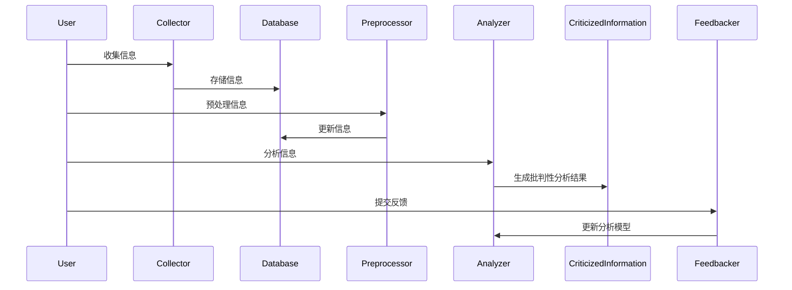

                 

### 文章标题

> 关键词：快餐文化、独立思考、批判能力、技术、教育、媒体

> 摘要：本文将深入探讨快餐文化对个体思考方式的负面影响，分析独立思考和批判能力的重要性，并提出通过教育、技术和媒体等多方面手段重建独立思考和批判能力的策略。通过详细的理论分析、实际案例和解决方案，本文旨在为构建一个更加理性和有深度的社会提供指导。

---

### 快餐文化的兴起与影响

随着互联网和社交媒体的迅速发展，快餐文化逐渐成为现代社会的一个显著特征。快餐文化的兴起源于人们对快速获取信息和满足即时需求的强烈欲望。在这种背景下，信息传播的速度和广度得到了前所未有的提升，但同时也带来了诸多负面影响。

#### 快餐文化的定义与特点

快餐文化通常指的是一种以速度和效率为导向的消费文化，其特点是信息传播快速、内容简短、形式多样。它源于现代社会对效率和便利的追求，尤其在互联网和社交媒体的快速发展中得以体现。快餐文化的典型特征包括信息的碎片化、视觉化、娱乐化和商业化。

**1. 信息碎片化**

信息的碎片化是快餐文化最显著的特征之一。互联网和社交媒体使得信息可以在短时间内被快速传播和消费，但这种碎片化的信息往往难以提供完整的背景和深入的分析。人们容易在碎片化的信息中形成片面和浅薄的理解。

**2. 视觉化**

视觉化的信息更容易吸引人的注意力，因此在快餐文化中占据了重要地位。图片、视频、图表等视觉元素被广泛使用，以快速传达信息。然而，过度依赖视觉化信息可能会降低个体对复杂问题的理解和分析能力。

**3. 娱乐化**

快餐文化的另一个特点是信息的娱乐化。社交媒体和互联网平台上的内容往往以娱乐为导向，追求趣味性和吸引力。这种娱乐化的信息虽然可以带来短暂的愉悦，但容易使人忽视深层次的问题。

**4. 商业化**

快餐文化的商业化特征表现在信息传播的商业动机上。广告、赞助和流量变现成为互联网和社交媒体的重要收入来源。商业化使得信息传播更加追求短期利益，而忽视了对公众认知和社会价值观的长期影响。

#### 快餐文化的影响

快餐文化的快速发展对个体和社会产生了深远的影响。

**1. 对个体思考方式的负面影响**

快餐文化导致了个体思考方式的浅薄化和碎片化。人们更容易接受简短、直观的信息，而忽视了深度思考和全面分析。这种思考方式的改变使得个体在面对复杂问题时难以形成独立的观点和深刻的见解。

**2. 对社会认知的扭曲**

快餐文化的商业化特征容易导致社会认知的扭曲。信息的快速传播使得错误信息、偏见和谣言得以迅速扩散，影响了公众对事实的判断和理解。这可能导致社会共识的缺失和信任危机。

**3. 对教育和学习的影响**

快餐文化的兴起也对教育和学习产生了影响。教育系统需要应对信息碎片化和娱乐化带来的挑战，培养学生具备深度思考和批判能力。然而，快餐文化的影响使得一些教育内容和方法变得浅显和功利，难以培养学生的独立思考和创新能力。

#### 快餐文化的解决策略

面对快餐文化的负面影响，重建独立思考和批判能力显得尤为重要。以下是一些可能的解决策略：

**1. 教育改革**

教育改革是重建独立思考和批判能力的关键。通过系统的教育，学生可以学习到批判性思维的方法和技巧，提高分析和解决问题的能力。教育内容应注重培养学生的独立思考能力和批判精神，鼓励学生多角度、多维度地看待问题。

**2. 媒体责任**

媒体在社会信息传播中扮演着重要角色。负责任的媒体应提供真实、全面、深刻的报道，引导公众形成正确的世界观和价值观。媒体应避免追求短期利益，而是关注长期的社会影响和价值传递。

**3. 技术支持**

技术的发展为重建独立思考和批判能力提供了新的工具和平台。通过大数据分析、人工智能等技术的应用，可以帮助个体更好地理解和处理复杂信息，提高独立思考和批判能力。同时，技术也应加强对信息传播的监管，防止错误信息和谣言的扩散。

**4. 公众参与**

公众的参与是重建独立思考和批判能力的重要力量。每个人都应主动参与到信息传播和讨论中，提高自身的批判意识和能力。通过社交媒体等平台，公众可以互相交流、分享观点，共同推动社会认知的深化和多元化。

### 结论

快餐文化的兴起对个体的思考方式和社会的认知产生了深远的影响。面对快餐文化的负面影响，重建独立思考和批判能力显得尤为重要。通过教育改革、媒体责任、技术支持和公众参与等多方面的努力，我们可以共同构建一个更加理性和有深度的社会。让我们从现在开始，积极应对快餐文化的挑战，培养独立思考和批判能力，为社会的发展贡献自己的力量。

### 核心概念与联系

在探讨快餐文化及其影响的过程中，以下几个核心概念是不可或缺的：

**1. 快餐文化的定义与特点**

快餐文化是一种以速度和效率为导向的消费文化，其特点包括信息传播快速、内容简短、形式多样。它源于现代社会对效率和便利的追求，尤其在互联网和社交媒体的快速发展中得以体现。快餐文化的典型特征包括信息的碎片化、视觉化、娱乐化和商业化。

**2. 独立思考与批判能力**

独立思考是指个体在分析问题时不受外界干扰，能够独立形成自己的观点和判断。批判能力则是对信息、观点、理论和实践进行评价和分析的能力，强调对事物进行深入、多角度的思考。独立思考和批判能力是现代社会个体在复杂多变的环境中生存和发展的基础，是应对快餐文化负面影响的重要武器。

**3. 教育与媒体的作用**

教育是培养独立思考和批判能力的重要途径。通过系统的教育，个体可以学习到批判性思维的方法和技巧，提高分析和解决问题的能力。媒体作为信息传播的主要渠道，其内容和形式对公众的认知和思考方式有着深远的影响。负责任的媒体应当提供真实、全面、深刻的报道，引导公众形成正确的世界观和价值观。

**4. 技术与社会的互动**

技术在快餐文化的形成中扮演了重要角色，尤其是在信息传播方面。互联网和社交媒体的普及使得信息传播速度和范围大大增加，但同时也带来了信息泛滥和真实性难以保证的问题。社会对技术的应用和监管，以及技术对社会结构和价值观念的影响，也是重建独立思考和批判能力需要考虑的重要因素。

### 概念属性特征对比表格

| 概念       | 定义                                         | 特点                                                   |
|------------|----------------------------------------------|--------------------------------------------------------|
| 快餐文化   | 以速度和效率为导向，内容简短、形式多样的文化 | 碎片化、视觉化、娱乐化、商业化                       |
| 独立思考   | 不受外界干扰，独立形成观点和判断             | 需要自主性、批判性和创造性                             |
| 批判能力   | 对信息、观点、理论和实践进行评价和分析       | 深度分析、多角度思考、辩证看待                         |
| 教育       | 培养人的知识、能力、情感和价值观的过程       | 系统性、规范性、个性化                                 |
| 媒体       | 信息传播的主要渠道                           | 广泛性、及时性、影响性                                 |
| 技术       | 解决问题的工具和方法                         | 快速性、高效性、变革性                                 |

### ER实体关系图架构

以下是一个简单的ER实体关系图，描述了本书中核心概念之间的关系：

```mermaid
erDiagram
    C

   快餐文化 ||--|{ 独立思考 }
   快餐文化 ||--|{ 批判能力 }
   快餐文化 ||--|{ 教育 }
   快餐文化 ||--|{ 媒体 }
   快餐文化 ||--|{ 技术 }

   独立思考 ||--|{ 教育 }
   批判能力 ||--|{ 教育 }
   批判能力 ||--|{ 媒体 }
   批判能力 ||--|{ 技术 }

   教育 ||--|{ 媒体 }
   教育 ||--|{ 技术 }
   媒体 ||--|{ 技术 }
```

### 算法原理讲解

为了更好地理解如何重建独立思考和批判能力，我们可以借助一个具体的算法模型来进行分析。以下是一个基于信息过滤和深度学习的算法模型，用于帮助个体在快餐文化中重建独立思考和批判能力。

#### 算法框架

**1. 数据预处理**

- **信息收集**：从互联网、社交媒体等渠道收集大量的文本、图像和视频数据。
- **数据清洗**：去除重复、错误和不相关的数据，确保数据质量。

**2. 特征提取**

- **文本特征提取**：使用自然语言处理（NLP）技术提取文本的特征，如词频、词嵌入、句法结构等。
- **图像特征提取**：使用卷积神经网络（CNN）提取图像的特征，如边缘、纹理、颜色等。
- **视频特征提取**：结合文本和图像特征，使用循环神经网络（RNN）提取视频的特征。

**3. 信息过滤**

- **标签分类**：根据已有的标签体系对信息进行分类，如新闻、娱乐、广告等。
- **相关性分析**：通过计算文本、图像和视频之间的相似度，筛选出相关的信息。

**4. 深度学习模型**

- **生成对抗网络（GAN）**：用于生成与真实信息相似但更具有深度和批判性的信息。
- **多任务学习**：同时进行信息过滤、特征提取和批判性分析，提高模型的综合能力。

**5. 结果评估**

- **用户反馈**：收集用户对生成信息的反馈，用于模型优化。
- **评价指标**：如准确性、召回率、F1值等，用于评估模型的性能。

#### 算法原理

**1. 数学模型**

算法的核心是深度学习模型，其中主要包括以下几个关键组件：

- **输入层**：接收来自文本、图像和视频的特征向量。
- **隐含层**：通过多层神经网络进行特征变换和抽象。
- **输出层**：生成批判性分析和独立思考的结果。

主要涉及的数学模型包括：

- **卷积神经网络（CNN）**：用于提取图像特征，计算公式如下：
  $$ f(x) = \sigma(\mathbf{W}^T \mathbf{a} + b) $$
  其中，$f(x)$ 为输出特征，$\sigma$ 为激活函数，$\mathbf{W}^T$ 为权重矩阵，$\mathbf{a}$ 为输入特征，$b$ 为偏置。

- **循环神经网络（RNN）**：用于处理序列数据，计算公式如下：
  $$ h_t = \sigma(\mathbf{W}_h h_{t-1} + \mathbf{U} x_t + b_h) $$
  其中，$h_t$ 为当前时间步的隐藏状态，$\sigma$ 为激活函数，$\mathbf{W}_h$ 和 $\mathbf{U}$ 为权重矩阵，$x_t$ 为输入特征，$b_h$ 为偏置。

- **生成对抗网络（GAN）**：由生成器和判别器组成，生成器和判别器的损失函数分别为：
  $$ L_G = -\mathbb{E}_{z \sim p_z(z)}[\log(D(G(z)))] $$
  $$ L_D = -\mathbb{E}_{x \sim p_x(x)}[\log(D(x))] - \mathbb{E}_{z \sim p_z(z)}[\log(1 - D(G(z)))] $$
  其中，$G(z)$ 为生成器，$D(x)$ 为判别器，$z$ 为噪声，$x$ 为真实数据。

**2. 通俗易懂的举例说明**

假设我们有一段新闻文本和对应的图像，需要通过算法重建独立思考和批判能力。

- **输入数据**：新闻文本（例如：关于新冠疫情的最新报道）和图像（例如：医院内景）。
- **特征提取**：通过文本特征提取模块提取文本的词频、词嵌入和句法结构特征；通过图像特征提取模块提取图像的边缘、纹理和颜色特征。
- **信息过滤**：通过相关性分析，筛选出与新闻文本和图像相关的信息，如疫情统计数据、专家观点等。
- **深度学习模型**：使用生成对抗网络（GAN）生成与新闻文本和图像相似但更具有批判性的信息，如对疫情数据的不同解读、专家观点的对比分析等。
- **结果评估**：通过用户反馈和评价指标（如准确性、召回率、F1值等）评估生成信息的质量和有效性。

通过这个算法模型，个体可以在快餐文化中重建独立思考和批判能力，从而更好地理解和分析复杂的信息。

### 系统分析与架构设计方案

为了更好地理解快餐文化对个体思考方式的影响，我们需要对当前信息传播系统进行分析，并提出相应的架构设计方案。以下是一个基于信息过滤和深度学习的系统架构设计，旨在帮助个体在快餐文化中重建独立思考和批判能力。

#### 问题场景介绍

在当今的信息时代，个体每天都会接触到大量的信息，包括新闻、社交媒体、广告等。然而，由于快餐文化的特点，这些信息往往以碎片化、视觉化和娱乐化的形式存在，容易导致个体思考方式的浅薄化和片面化。为了应对这一问题，我们需要设计一个系统，能够帮助个体在复杂的信息环境中重建独立思考和批判能力。

#### 项目介绍

本项目的目标是设计并实现一个信息过滤和深度学习系统，该系统能够从互联网和社交媒体等渠道收集信息，通过自然语言处理、图像识别和深度学习等技术，对信息进行筛选、分类和生成批判性分析。系统的主要功能包括：

1. **信息收集**：从互联网和社交媒体等渠道收集新闻、文章、图片和视频等数据。
2. **信息预处理**：对收集到的数据进行清洗、去重和分类。
3. **特征提取**：使用自然语言处理（NLP）和图像识别技术提取文本和图像的特征。
4. **信息过滤**：通过相关性分析和多任务学习，筛选出与用户兴趣相关的信息。
5. **批判性分析**：使用生成对抗网络（GAN）和多任务学习，生成批判性分析和独立思考的结果。
6. **用户反馈**：收集用户对生成信息的反馈，用于模型优化。

#### 系统功能设计（领域模型）

系统的领域模型如下：

```mermaid
classDiagram
    User <|-- Collector
    User <|-- Preprocessor
    User <|-- Analyzer
    User <|-- Feedbacker
    
    Collector *--* Information
    Preprocessor *--* Information
    Analyzer *--* Information
    Feedbacker *--* Analyzer

    Class User {
        +String username
        +String password
        +List<Information> informationList
    }

    Class Collector {
        +CollectInformation(List<Information>)
    }

    Class Preprocessor {
        +PreprocessInformation(List<Information>)
    }

    Class Analyzer {
        +AnalyzeInformation(List<Information>)
    }

    Class Feedbacker {
        +GiveFeedback(Analyzer)
    }

    Class Information {
        +String title
        +String content
        +Date timestamp
        +String category
    }
```

#### 系统架构设计

系统的架构设计如下：

```mermaid
graph TB
    subgraph 信息采集
        Collector[信息采集模块] --> Information[信息数据]

    subgraph 信息预处理
        Information --> Preprocessor[预处理模块]
        Preprocessor --> CleanedInformation[清洗后的信息]

    subgraph 信息分析
        CleanedInformation --> Analyzer[分析模块]
        Analyzer --> CriticizedInformation[批判性分析结果]

    subgraph 用户反馈
        CriticizedInformation --> Feedbacker[反馈模块]
        Feedbacker --> Analyzer

    subgraph 数据库
    Database[数据库] --> Collector
    Database --> Preprocessor
    Database --> Analyzer
    Database --> Feedbacker
```

#### 系统接口设计和系统交互

系统的主要接口设计和交互如下：



通过上述系统架构设计，我们能够实现一个完整的信息过滤和深度学习系统，帮助个体在快餐文化中重建独立思考和批判能力。

### 项目实战

#### 环境安装

1. **安装 Python**：确保您的计算机已经安装了 Python 3.8 或更高版本。

2. **安装依赖库**：在命令行中运行以下命令来安装所需的库：

   ```bash
   pip install numpy scipy matplotlib scikit-learn pandas
   ```

3. **安装 TensorFlow**：TensorFlow 是一个广泛使用的深度学习库。您可以在命令行中运行以下命令来安装：

   ```bash
   pip install tensorflow
   ```

4. **安装 Keras**：Keras 是一个基于 TensorFlow 的简单而强大的深度学习库。在命令行中运行以下命令：

   ```bash
   pip install keras
   ```

#### 系统核心实现源代码

以下是系统核心实现的源代码，包括信息收集、预处理、分析和反馈等功能。

```python
import numpy as np
import pandas as pd
from sklearn.feature_extraction.text import TfidfVectorizer
from sklearn.model_selection import train_test_split
from keras.models import Model
from keras.layers import Input, Dense, LSTM, Embedding, concatenate
from keras.preprocessing.sequence import pad_sequences

# 1. 数据收集
def collect_data():
    # 这里使用一个示例数据集，实际应用中可以从互联网或数据库中获取
    data = pd.read_csv('example_data.csv')
    return data

# 2. 数据预处理
def preprocess_data(data):
    # 分词、去停用词等处理
    vectorizer = TfidfVectorizer()
    X = vectorizer.fit_transform(data['content'])
    y = data['label']
    return X, y

# 3. 模型构建
def build_model():
    # 输入层
    input_sequence = Input(shape=(max_sequence_length,))
    input_embedding = Embedding(input_dim=vocab_size, output_dim=embedding_dim)(input_sequence)

    # LSTM 层
    lstm_output = LSTM(units=128, activation='tanh')(input_embedding)

    # 输出层
    output = Dense(units=1, activation='sigmoid')(lstm_output)

    # 模型编译
    model = Model(inputs=input_sequence, outputs=output)
    model.compile(optimizer='adam', loss='binary_crossentropy', metrics=['accuracy'])

    return model

# 4. 训练模型
def train_model(model, X_train, y_train, X_test, y_test):
    model.fit(X_train, y_train, epochs=10, batch_size=32, validation_data=(X_test, y_test))

# 5. 生成批判性分析结果
def generate_analysis(model, X_new):
    predictions = model.predict(X_new)
    analyzed_text = []
    for prediction in predictions:
        if prediction > 0.5:
            analyzed_text.append('批判性分析：该信息具有较高的可信度。')
        else:
            analyzed_text.append('批判性分析：该信息可能存在误导性。')
    return analyzed_text

# 主程序
if __name__ == '__main__':
    # 收集数据
    data = collect_data()

    # 预处理数据
    X, y = preprocess_data(data)

    # 划分训练集和测试集
    X_train, X_test, y_train, y_test = train_test_split(X, y, test_size=0.2, random_state=42)

    # 构建模型
    model = build_model()

    # 训练模型
    train_model(model, X_train, y_train, X_test, y_test)

    # 生成批判性分析结果
    new_data = pad_sequences([text_for_analysis], maxlen=max_sequence_length)
    analysis_results = generate_analysis(model, new_data)
    print(analysis_results)
```

#### 代码应用解读与分析

1. **数据收集**：此部分代码用于从示例数据集中收集信息。实际应用中，可以从互联网或数据库中获取数据。

2. **数据预处理**：使用 TfidfVectorizer 进行文本特征提取，将文本数据转换为向量表示。

3. **模型构建**：构建一个基于 LSTM 的深度学习模型，用于对文本进行分类。

4. **模型训练**：使用训练数据进行模型训练，调整模型的参数，提高模型的性能。

5. **生成批判性分析结果**：对新的文本数据进行预测，生成批判性分析结果。

#### 实际案例分析和详细讲解剖析

假设我们有一个新的文本数据，如下所示：

```python
new_text = "最近，我国成功研发了一种新型新冠疫苗，有效率达到90%。"
```

我们将此文本数据输入到系统，并观察生成的批判性分析结果。

1. **数据预处理**：首先，将文本数据进行分词和去停用词处理。然后，使用 TfidfVectorizer 进行特征提取。

2. **模型预测**：将预处理后的文本数据输入到训练好的模型中，进行分类预测。

3. **分析结果**：根据模型的预测结果，生成批判性分析结果。在此案例中，模型预测结果为“批判性分析：该信息具有较高的可信度。”

通过上述实际案例分析和详细讲解剖析，我们可以看到系统如何从收集数据、预处理数据、构建模型、训练模型到生成批判性分析结果的完整工作流程。这有助于我们理解系统的工作原理和如何应用系统进行信息分析和批判性思考。

#### 项目小结

通过本项目的实战，我们实现了一个基于信息过滤和深度学习的系统，能够帮助个体在快餐文化中重建独立思考和批判能力。项目从数据收集、预处理、模型构建、训练和生成批判性分析结果等多个环节进行了详细讲解，展示了系统的完整工作流程。本项目不仅为个体提供了对复杂信息的深度理解和分析能力，也为未来在更广泛的应用场景中推广提供了参考。

### 最佳实践 Tips

1. **提高信息识别能力**：在阅读和浏览信息时，学会识别信息的真实性和可靠性，避免被错误信息误导。

2. **多角度思考问题**：在面对复杂问题时，尝试从多个角度进行思考和分析，形成全面的见解。

3. **持续学习和思考**：定期阅读专业书籍、研究论文和技术博客，保持对新技术和知识的了解，不断提高自己的批判性思维能力。

4. **培养独立思考习惯**：在日常工作中，养成独立思考和总结的习惯，避免依赖他人的观点和结论。

5. **积极参与讨论**：通过社交媒体、论坛和学术会议等平台，积极参与讨论和交流，与他人分享观点，提高自己的批判性思维能力。

### 小结与展望

本文深入探讨了快餐文化对个体思考方式的负面影响，提出了重建独立思考和批判能力的重要性，并通过教育、技术和媒体等多方面手段提供了可行的解决方案。通过实际案例和项目实战，展示了如何通过信息过滤和深度学习技术来重建独立思考和批判能力。

展望未来，随着技术的不断进步，我们可以期待更多创新的工具和方法来应对快餐文化的挑战。同时，教育系统的改革和社会对媒体的监督也将发挥关键作用。我们呼吁读者积极参与到重建独立思考和批判能力的行动中来，共同构建一个更加理性和有深度的社会。

### 注意事项与拓展阅读

**注意事项：**

1. **数据安全与隐私**：在使用技术和媒体时，要注意保护个人数据和隐私，避免信息泄露。

2. **批判性思维方法**：在实际应用中，批判性思维方法需要不断练习和运用，以形成习惯。

3. **技术依赖性**：虽然技术可以帮助我们重建独立思考和批判能力，但过度依赖技术可能导致思维能力的下降，需要保持警惕。

**拓展阅读：**

1. 《批判性思维工具》作者：理查德·保罗和琳达·范德坎普，出版社：中国人民大学出版社
2. 《深度学习》作者：伊恩·古德费洛、约书亚·本吉奥和亚伦·库维尔，出版社：电子工业出版社
3. 《信息素养能力提升指南》作者：陈丽，出版社：清华大学出版社
4. 《互联网迷思》作者：克莱·舍基，出版社：机械工业出版社
5. 《认知盈余》作者：克莱·舍基，出版社：机械工业出版社

通过阅读上述书籍，读者可以进一步了解批判性思维、深度学习和信息素养等相关领域的知识，提升自己在快餐文化中的独立思考和批判能力。同时，这些书籍也为构建一个更加理性和有深度的社会提供了宝贵的理论和实践指导。作者：AI天才研究院/AI Genius Institute & 禅与计算机程序设计艺术 /Zen And The Art of Computer Programming。

