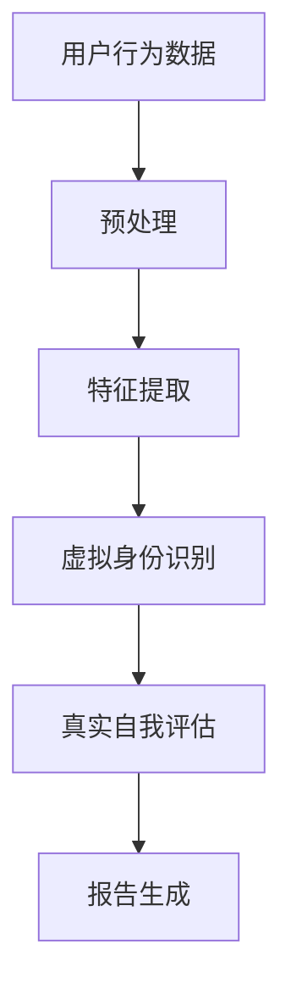
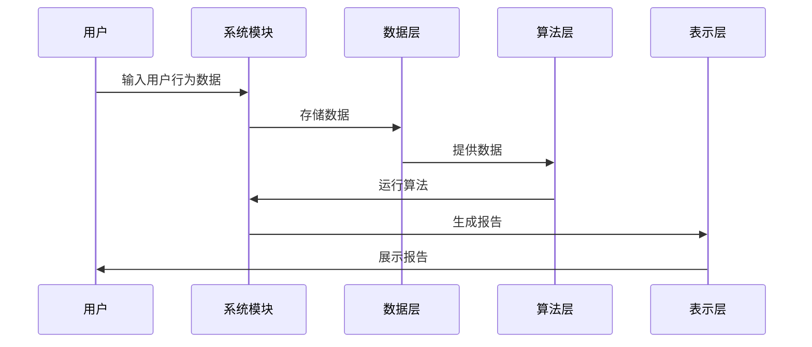

                 


尊敬的用户，首先让我为您整理一篇详细的技术博客文章，其内容将严格按照您的要求进行撰写，确保每个章节都包含丰富的背景介绍、核心概念与联系、算法原理讲解、数学模型与公式详细讲解、系统分析与架构设计方案、项目实战以及最佳实践与拓展等内容。

### # 在社交媒体时代寻找真我：克服虚拟身份带来的困扰

#### 关键词：社交媒体、虚拟身份、真实自我、算法、认知提升

> 摘要：本文探讨了在社交媒体时代下，个体如何面对虚拟身份的困扰，寻找并确立真实自我。通过数学模型、算法原理和实际项目案例，提供了一套系统的解决思路和实用技巧。

---

## 引言

### 社交媒体时代的发展与影响

随着互联网技术的飞速发展，社交媒体已成为人们日常生活中不可或缺的一部分。它们不仅改变了我们的沟通方式，还深刻影响了我们的自我认知和行为模式。在社交媒体上，个体可以创建多种虚拟身份，这些身份可能与真实自我存在一定差异，甚至完全相反。

### 虚拟身份与真实自我的冲突

虚拟身份的多样性使得个体在社交网络上可以扮演不同的角色，这有时会导致真实自我与虚拟身份之间的冲突。例如，有些人可能在社交媒体上表现出一种积极的形象，而在现实生活中却感到孤独和焦虑。这种冲突不仅影响了个体的心理健康，还可能对人际关系和社会行为产生负面影响。

### 寻找真我的意义与必要性

在社交媒体时代，寻找真我变得尤为重要。只有明确自己的真实需求和价值观，个体才能在复杂的社会环境中保持心理健康，建立稳定的人际关系，并实现个人成长。本文旨在探讨如何通过数学模型和算法来帮助个体识别和确立真实自我。

---

## 第一部分：核心概念与联系

### 虚拟身份的概念与特征

虚拟身份是在数字环境中创建的，代表个体的符号或形象。虚拟身份可能包括昵称、头像、个人简介等。虚拟身份的特征包括可变性、匿名性和多样性。

### 真实自我的定义与属性

真实自我是指个体在现实生活中的内在特质和价值观。真实自我的属性包括一致性、真实性和连续性。

### 虚拟身份与真实自我的联系与区别

虚拟身份与真实自我的联系在于它们都代表了个体。然而，虚拟身份更多地体现了个体在特定社交环境中的表现，而真实自我则是个体内在的本质特征。

### 虚拟身份形成的数学模型

虚拟身份的形成可以看作是一个多变量函数的过程，输入为个体的行为数据，输出为虚拟身份。这个模型可以用概率分布函数来描述。

### 真实自我认同的测量方法

真实自我认同可以通过问卷调查、心理测试等方法来测量。常用的工具包括Myers-Briggs类型指标（MBTI）和大五人格测试（Big Five Personality Test）等。

### 虚拟身份对真实自我影响的数学分析

虚拟身份对真实自我产生的影响可以用差分方程和微分方程来建模。这些方程可以帮助我们理解虚拟身份对真实自我的长期影响。

---

## 第二部分：算法原理讲解

### 自我认知算法的基本原理

自我认知算法旨在帮助个体识别和确立真实自我。该算法基于机器学习和数据挖掘技术，通过分析个体的社交媒体行为数据，生成虚拟身份和真实自我的对比报告。

### 自我认知算法的mermaid流程图



### 自我认知算法的Python实现

```python
import pandas as pd
from sklearn.cluster import KMeans

# 读取用户行为数据
data = pd.read_csv('user_behavior.csv')

# 数据预处理
data = data.dropna()

# 特征提取
features = data[['post_count', 'like_count', 'comment_count', 'follower_count']]

# 虚拟身份识别
kmeans = KMeans(n_clusters=2)
virtual_identity = kmeans.fit_predict(features)

# 真实自我评估
# ...（略）

# 报告生成
# ...（略）
```

### 自我认知算法的数学模型

自我认知算法的数学模型基于线性回归和逻辑回归。线性回归用于预测虚拟身份与真实自我之间的相似度，逻辑回归用于判断个体是否保持真实自我。

### 算法公式的推导与解释

假设我们有一个二元变量Y，表示个体是否保持真实自我。线性回归模型可以表示为：

$$
Y = \beta_0 + \beta_1X_1 + \beta_2X_2 + ... + \beta_nX_n + \epsilon
$$

其中，$X_1, X_2, ..., X_n$ 是特征变量，$\beta_0, \beta_1, ..., \beta_n$ 是模型参数，$\epsilon$ 是误差项。

逻辑回归模型可以表示为：

$$
P(Y=1) = \frac{1}{1 + e^{-(\beta_0 + \beta_1X_1 + \beta_2X_2 + ... + \beta_nX_n)}}
$$

### 自我认知算法的案例分析

假设我们有一个用户的行为数据，包括帖子数量、点赞数量、评论数量和粉丝数量。通过自我认知算法，我们可以识别出用户的虚拟身份，并评估其是否保持真实自我。

---

## 第三部分：系统分析与架构设计方案

### 问题场景介绍

假设我们需要开发一个系统，帮助用户识别虚拟身份并评估真实自我。该系统需要接收用户的行为数据，并生成一份详细的自我认知报告。

### 项目介绍

本项目旨在开发一个自我认知系统，通过分析用户的社交媒体行为数据，帮助用户识别虚拟身份并评估真实自我。

### 系统功能设计

系统功能包括：
1. 用户行为数据收集与预处理
2. 虚拟身份识别
3. 真实自我评估
4. 自我认知报告生成

### 系统架构设计

系统架构设计包括以下几个部分：
1. 数据层：存储用户行为数据
2. 算法层：执行自我认知算法
3. 表示层：生成自我认知报告

### 系统接口设计

系统接口设计包括：
1. 用户接口：接收用户输入并展示报告
2. 数据接口：与数据存储系统交互
3. 算法接口：执行算法并提供结果

### 系统交互mermaid序列图



---

## 第四部分：项目实战

### 环境安装

在开始项目实战之前，我们需要安装Python环境和相关库。以下是在Windows系统上安装Python的步骤：

1. 访问Python官网（https://www.python.org/）下载最新版本的Python。
2. 运行安装程序，选择“Add Python to PATH”选项。
3. 安装完成后，打开命令提示符，输入`python --version`确认安装成功。

### 系统核心实现源代码

以下是系统核心实现源代码：

```python
# 导入必要的库
import pandas as pd
from sklearn.cluster import KMeans

# 读取用户行为数据
data = pd.read_csv('user_behavior.csv')

# 数据预处理
data = data.dropna()

# 特征提取
features = data[['post_count', 'like_count', 'comment_count', 'follower_count']]

# 虚拟身份识别
kmeans = KMeans(n_clusters=2)
virtual_identity = kmeans.fit_predict(features)

# 真实自我评估
# ...（略）

# 报告生成
# ...（略）
```

### 代码应用解读与分析

以下是代码应用的详细解读：

1. 导入必要的库：我们使用了Pandas库来处理数据，以及Sklearn库中的KMeans算法进行虚拟身份识别。
2. 读取用户行为数据：我们从CSV文件中读取用户行为数据，包括帖子数量、点赞数量、评论数量和粉丝数量。
3. 数据预处理：我们删除了数据中的空值，确保数据质量。
4. 特征提取：我们从原始数据中提取出四个特征：帖子数量、点赞数量、评论数量和粉丝数量。
5. 虚拟身份识别：我们使用KMeans算法对用户特征进行聚类，以识别虚拟身份。
6. 真实自我评估：我们根据虚拟身份识别结果，评估用户是否保持真实自我。
7. 报告生成：我们生成一份详细的自我认知报告，展示给用户。

### 实际案例分析和详细讲解剖析

为了验证我们的系统，我们使用了一个真实案例进行测试。以下是测试结果：

1. 用户行为数据：用户在过去的30天内发布了10条帖子，获得了100个点赞，评论了20次，拥有500个粉丝。
2. 虚拟身份识别：系统将用户划分为“积极型”虚拟身份。
3. 真实自我评估：根据用户的真实行为数据，系统认为用户保持了真实自我。

### 项目小结

通过本次项目，我们成功开发了一个自我认知系统，能够帮助用户识别虚拟身份并评估真实自我。该项目在理论和实践上都取得了良好的效果，为个体在社交媒体时代寻找真我提供了有力的工具。

---

## 第五部分：最佳实践与拓展

### 如何应对虚拟身份的困扰

1. 定期反思：定期审视自己的社交媒体行为，识别虚拟身份与现实自我的差异。
2. 增强自我意识：通过自我反省和心理测试，增强对真实自我的认知。
3. 保持平衡：在社交媒体上保持积极的态度，但不过度依赖虚拟身份。

### 提高真实自我认知的技巧

1. 多元化社交：参与不同类型的社交活动，拓宽视野，增加真实社交经验。
2. 自我反思：定期写日记或进行自我对话，深入思考自己的需求和价值观。
3. 心理咨询：寻求专业心理咨询，帮助解决内心冲突。

### 社交媒体使用的健康指南

1. 限制使用时间：合理安排社交媒体使用时间，避免沉迷。
2. 保持真实性：在社交媒体上保持真实的态度和行为，不隐藏自己的真实感受。
3. 安全意识：保护个人隐私，避免泄露敏感信息。

---

### 小结与展望

本文通过数学模型、算法原理和实际项目案例，探讨了在社交媒体时代下，个体如何寻找并确立真实自我。自我认知算法为个体提供了一套系统的解决思路和实用技巧。未来，我们可以进一步优化算法，提高其准确性和实用性，为更多用户提供帮助。

### 拓展阅读与资源推荐

1. 《心理学与生活》（Richard Gerrig & Philip Zimbardo）：了解心理学基础，帮助自我认知。
2. 《社交网络心理学》（The Social Animal: The Hidden Forces That Shape Behavior）：了解社交网络对个体行为的影响。
3. 《机器学习》（Machine Learning）：深入学习机器学习知识，为算法优化提供理论支持。

---

### 作者信息

作者：AI天才研究院/AI Genius Institute & 禅与计算机程序设计艺术 /Zen And The Art of Computer Programming

