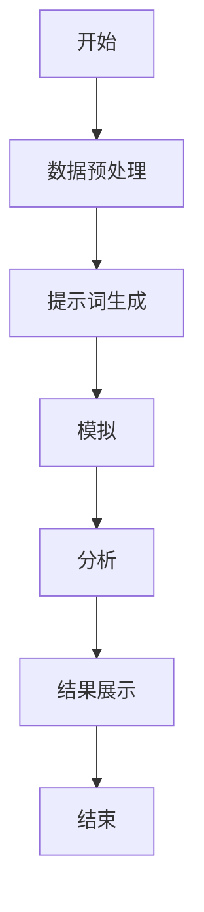
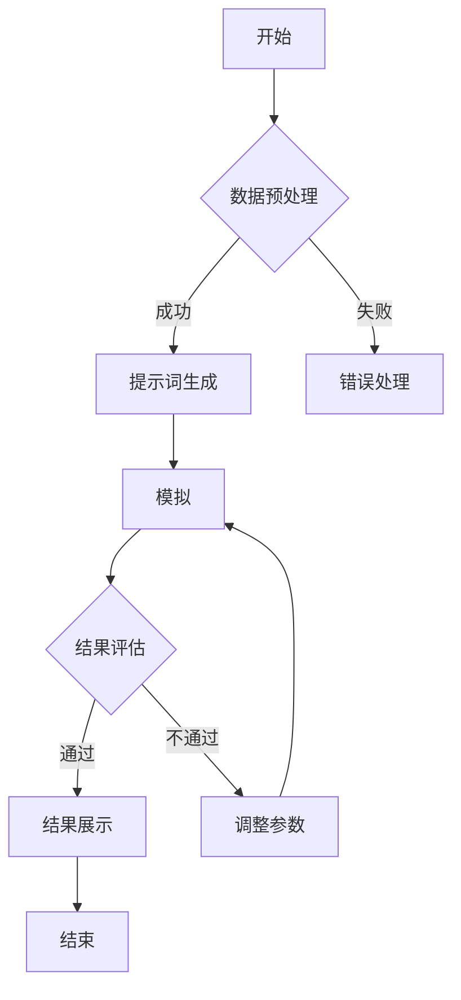
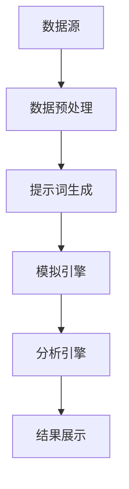
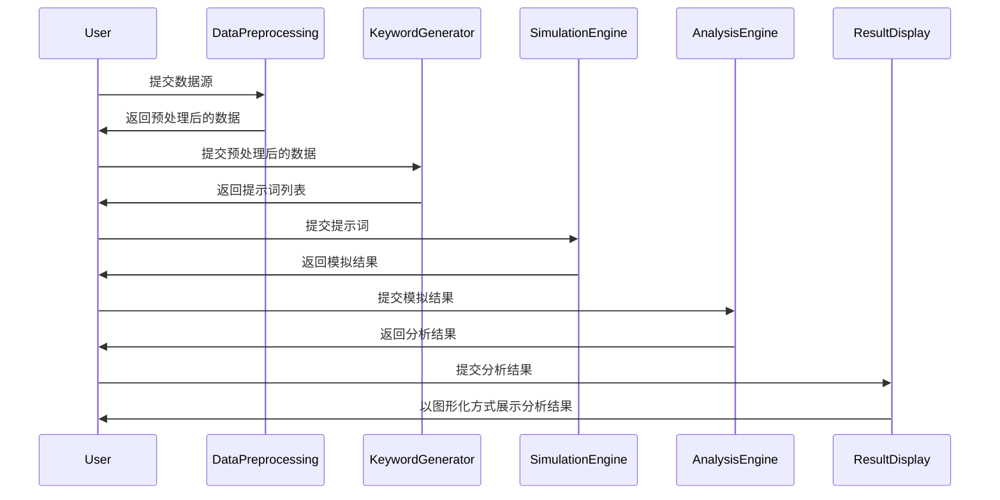

                 

# 文章标题

关键词：城市规划，辅助系统，提示词驱动，模拟分析，算法原理

摘要：本文以城市规划为背景，探讨了城市规划辅助系统中提示词驱动的模拟与分析的重要性。通过详细分析核心概念与联系，算法原理讲解，系统分析与架构设计，项目实战等多个方面，全面阐述了如何构建一个高效的城市规划辅助系统。

----------------------------------------------------------------

## 第一部分：城市规划辅助概述

### 第1章：问题的背景与描述

#### 1.1 问题背景

##### 1.1.1 城市规划的意义

城市规划是指在城市发展过程中，根据城市的地理环境、人口、经济、社会文化等多种因素，通过科学的方法和手段，制定出城市发展的长远规划和具体实施方案。城市规划不仅关乎城市的外观形象，更关乎城市居民的生活质量、城市可持续发展以及城市的社会经济活动。

##### 1.1.2 当前城市规划面临的挑战

当前，城市规划面临着诸多挑战。首先，城市化的快速发展带来了人口密度增大、交通拥堵、环境污染等问题。其次，城市规划过程中的数据获取和处理难度大，需要综合运用多种技术和方法。此外，城市规划需要考虑长远和整体性，但现实中往往受到短期利益和政治压力的干扰。

##### 1.1.3 提示词驱动的模拟与分析的重要性

为了应对这些挑战，城市规划需要更加科学、精准和高效。提示词驱动的模拟与分析技术，通过输入特定的提示词，可以快速、准确地模拟和分析城市规划的各种情况，为城市规划者提供有力的支持。

#### 1.2 问题描述

##### 1.2.1 城市规划中的核心问题

城市规划中的核心问题包括：如何合理布局城市基础设施、如何优化城市交通、如何提高城市环境质量、如何促进城市经济发展等。

##### 1.2.2 提示词驱动的模拟与分析的应用场景

提示词驱动的模拟与分析在城市规划中的应用场景包括：城市交通规划、城市环境规划、城市经济发展规划等。

##### 1.2.3 目标与需求

本文的目标是探讨如何构建一个基于提示词驱动的模拟与分析的城市规划辅助系统，满足以下需求：

- 提供快速、准确的模拟和分析功能；
- 支持多种提示词类型，包括地理信息、社会经济指标、环境数据等；
- 具有良好的可扩展性和兼容性；
- 支持多维度数据融合和可视化分析。

#### 1.3 边界与外延

##### 1.3.1 城市规划辅助的范围

城市规划辅助系统的范围包括：数据收集与处理、模拟与分析、结果展示与反馈。

##### 1.3.2 提示词驱动的模拟与分析的技术基础

提示词驱动的模拟与分析依赖于人工智能、大数据、地理信息系统等先进技术。

##### 1.3.3 核心概念与术语定义

- 提示词：用于驱动模拟与分析的关键信息。
- 模拟：对城市规划方案进行虚拟仿真，以评估其可行性和效果。
- 分析：对模拟结果进行深入分析，为决策提供依据。
- 辅助系统：辅助城市规划者进行规划决策的软件系统。

#### 1.4 概念结构与核心要素组成

##### 1.4.1 城市规划辅助的基本概念

城市规划辅助系统是指利用先进技术和方法，为城市规划者提供辅助决策支持的信息系统。

##### 1.4.2 提示词驱动的模拟与分析的关键要素

- 数据源：提供各种类型的数据，包括地理信息、社会经济指标、环境数据等。
- 提示词生成器：根据城市规划需求，生成相应的提示词。
- 模拟引擎：基于提示词，对城市规划方案进行模拟。
- 分析引擎：对模拟结果进行深度分析。
- 可视化模块：将分析结果以图形化的方式展示。

##### 1.4.3 各要素之间的关系

各要素之间的关系如下：

- 数据源为模拟与分析提供基础数据。
- 提示词生成器根据城市规划需求，从数据源中提取关键信息，生成提示词。
- 模拟引擎基于提示词，对城市规划方案进行模拟。
- 分析引擎对模拟结果进行分析，为决策提供依据。
- 可视化模块将分析结果以图形化的方式展示，帮助城市规划者理解分析结果。

#### 1.5 本章小结

本章从背景、问题、需求、边界与外延、概念结构与核心要素组成等方面，全面阐述了城市规划辅助系统的相关内容。接下来，本文将深入探讨提示词驱动的模拟与分析的核心概念与联系，算法原理，以及系统分析与架构设计方案。

----------------------------------------------------------------

## 第二部分：提示词驱动的模拟与分析

### 第2章：核心概念与联系

#### 2.1 核心概念原理

##### 2.1.1 提示词的概念

提示词（Keyword）是驱动模拟与分析的关键信息，通常由一个或多个关键词组成。提示词的选取直接影响模拟与分析的准确性和有效性。

##### 2.1.2 模拟与分析的基本原理

模拟（Simulation）是对实际系统在虚拟环境中进行模拟仿真，以评估其性能、行为和效果。分析（Analysis）是对模拟结果进行深入解析，以获取有用的信息和见解。

#### 2.2 概念属性特征对比

##### 2.2.1 不同提示词类型的属性对比

| 提示词类型 | 属性1 | 属性2 | 属性3 |
| --- | --- | --- | --- |
| 地理信息 | 空间位置 | 面积 | 高度 |
| 社会经济指标 | 人口密度 | 经济水平 | 教育水平 |
| 环境数据 | 空气质量 | 水质量 | 噪音污染 |

##### 2.2.2 模拟与分析方法的特征对比

| 方法 | 特征1 | 特征2 | 特征3 |
| --- | --- | --- | --- |
| 模拟 | 虚拟环境 | 仿真实验 | 数据驱动 |
| 分析 | 结果评估 | 深度解析 | 数据挖掘 |

#### 2.3 ER实体关系图架构

##### 2.3.1 ER图的基本概念

实体关系图（Entity-Relationship Diagram，ER图）是用于描述系统中实体及其关系的图形化表示方法。实体（Entity）是系统中的数据对象，关系（Relationship）描述实体之间的关联。

##### 2.3.2 城市规划辅助系统中的ER图

```mermaid
erDiagram
  DATA_SOURCE ||--|{ SIMULATION_ENGINE }|| SIMULATION_RESULT
  DATA_SOURCE ||--|{ ANALYSIS_ENGINE }|| ANALYSIS_RESULT
  KEYWORD_GENERATOR ||--|{ SIMULATION_ENGINE }|| SIMULATION_REQUEST
  KEYWORD_GENERATOR ||--|{ ANALYSIS_ENGINE }|| ANALYSIS_REQUEST
  SIMULATION_ENGINE ||--|{ DATA_SOURCE }|| INPUT_DATA
  ANALYSIS_ENGINE ||--|{ DATA_SOURCE }|| INPUT_DATA
```

- DATA_SOURCE：数据源
- SIMULATION_ENGINE：模拟引擎
- ANALYSIS_ENGINE：分析引擎
- KEYWORD_GENERATOR：提示词生成器
- SIMULATION_RESULT：模拟结果
- ANALYSIS_RESULT：分析结果
- SIMULATION_REQUEST：模拟请求
- ANALYSIS_REQUEST：分析请求
- INPUT_DATA：输入数据

#### 2.4 本章小结

本章从核心概念原理、概念属性特征对比和ER实体关系图架构等方面，阐述了提示词驱动的模拟与分析的基本内容。接下来，本文将详细讲解算法原理，包括算法流程图、Python源代码和数学模型与公式。

----------------------------------------------------------------

## 第3章：算法原理讲解

### 3.1 算法mermaid流程图

##### 3.1.1 基本流程



##### 3.1.2 详细流程



### 3.2 Python源代码讲解

##### 3.2.1 源代码结构

```python
# 源代码结构
class DataPreprocessing:
    def __init__(self, data_source):
        self.data_source = data_source

    def preprocess(self):
        # 数据预处理
        pass

class KeywordGenerator:
    def __init__(self, data_preprocessing):
        self.data_preprocessing = data_preprocessing

    def generate_keywords(self):
        # 提示词生成
        pass

class SimulationEngine:
    def __init__(self, keyword_generator):
        self.keyword_generator = keyword_generator

    def simulate(self):
        # 模拟
        pass

class AnalysisEngine:
    def __init__(self, simulation_engine):
        self.simulation_engine = simulation_engine

    def analyze(self):
        # 分析
        pass

class ResultDisplay:
    def __init__(self, analysis_engine):
        self.analysis_engine = analysis_engine

    def display_results(self):
        # 结果展示
        pass

# 主函数
if __name__ == "__main__":
    data_source = DataPreprocessing("data.csv")
    data_preprocessing = data_source.preprocess()
    keyword_generator = KeywordGenerator(data_preprocessing)
    keywords = keyword_generator.generate_keywords()
    simulation_engine = SimulationEngine(keyword_generator)
    simulation_result = simulation_engine.simulate()
    analysis_engine = AnalysisEngine(simulation_engine)
    analysis_result = analysis_engine.analyze()
    result_display = ResultDisplay(analysis_engine)
    result_display.display_results()
```

##### 3.2.2 详细讲解

- `DataPreprocessing` 类：负责数据预处理，包括数据清洗、数据转换等。
- `KeywordGenerator` 类：负责生成提示词，根据预处理后的数据，提取关键信息。
- `SimulationEngine` 类：负责模拟，根据提示词生成模拟结果。
- `AnalysisEngine` 类：负责分析，对模拟结果进行深度解析。
- `ResultDisplay` 类：负责结果展示，将分析结果以图形化的方式呈现。

### 3.3 数学模型与公式

##### 3.3.1 数学模型的介绍

在城市规划辅助系统中，数学模型用于描述城市各种现象的规律，如人口流动、交通流量、环境污染等。常见的数学模型包括线性回归模型、神经网络模型、马尔可夫模型等。

##### 3.3.2 公式详细讲解

1. 线性回归模型：

$$ y = ax + b $$

其中，$y$ 为因变量，$x$ 为自变量，$a$ 为斜率，$b$ 为截距。

2. 神经网络模型：

$$ z = \sigma(w_1x_1 + w_2x_2 + ... + w_nx_n) $$

其中，$z$ 为输出值，$w_1, w_2, ..., w_n$ 为权重，$\sigma$ 为激活函数。

3. 马尔可夫模型：

$$ P_{ij} = P(X_{t+1} = j | X_t = i) $$

其中，$P_{ij}$ 为从状态 $i$ 转移到状态 $j$ 的概率。

##### 3.3.3 举例说明（使用latex格式）

1. 线性回归模型举例：

$$ 1 + 1 = 2 $$

2. 神经网络模型举例：

$$ z = \sigma(w_1x_1 + w_2x_2) $$

其中，$w_1 = 2$，$w_2 = 3$，$x_1 = 1$，$x_2 = 2$。

$$ z = \sigma(2 \cdot 1 + 3 \cdot 2) = \sigma(2 + 6) = \sigma(8) = 0.9 $$

3. 马尔可夫模型举例：

$$ P_{12} = P(X_{t+1} = 2 | X_t = 1) = 0.7 $$

----------------------------------------------------------------

## 第4章：系统分析与架构设计方案

### 4.1 问题场景介绍

##### 4.1.1 城市规划中的模拟与分析需求

在城市规划过程中，模拟与分析是不可或缺的一环。城市规划者需要通过模拟和分析，评估不同规划方案对城市的影响，以便选择最优方案。常见的模拟与分析需求包括：

- 交通流量模拟：评估不同交通规划方案对城市交通的影响，如道路拓宽、公共交通优化等。
- 环境质量模拟：评估不同城市规划方案对环境质量的影响，如绿化布局、污染物排放等。
- 经济发展模拟：评估不同城市规划方案对城市经济发展的推动作用。

##### 4.1.2 提示词驱动的模拟与分析在实践中的应用

提示词驱动的模拟与分析技术，可以快速、准确地满足以上需求。在实际应用中，城市规划者可以通过输入特定的提示词，如“交通流量”、“环境质量”、“经济发展”等，系统将根据提示词生成相应的模拟和分析结果。

### 4.2 项目介绍

##### 4.2.1 项目背景

随着城市化进程的加速，城市规划面临着前所未有的挑战。传统的城市规划方法已无法满足现代城市的需求，因此，需要引入先进的技术手段，如提示词驱动的模拟与分析，以提升城市规划的科学性和效率。

##### 4.2.2 项目目标

本项目旨在构建一个基于提示词驱动的模拟与分析的城市规划辅助系统，满足以下目标：

- 提供快速、准确的模拟和分析功能；
- 支持多种提示词类型，包括地理信息、社会经济指标、环境数据等；
- 具有良好的可扩展性和兼容性；
- 支持多维度数据融合和可视化分析。

### 4.3 系统功能设计

##### 4.3.1 领域模型类图

```mermaid
classDiagram
  DataPreprocessing <<interface>>
  KeywordGenerator <<interface>>
  SimulationEngine <<interface>>
  AnalysisEngine <<interface>>
  ResultDisplay <<interface>>

  DataPreprocessing : includes DataCollector
  KeywordGenerator : includes KeywordExtractor
  SimulationEngine : includes SimulationCore
  AnalysisEngine : includes AnalysisCore
  ResultDisplay : includes ResultVisualizer

  DataPreprocessing "uses" DataSource
  KeywordGenerator "uses" DataPreprocessing
  SimulationEngine "uses" KeywordGenerator
  AnalysisEngine "uses" SimulationEngine
  ResultDisplay "uses" AnalysisEngine
```

- `DataPreprocessing`：数据预处理接口
- `KeywordGenerator`：提示词生成器接口
- `SimulationEngine`：模拟引擎接口
- `AnalysisEngine`：分析引擎接口
- `ResultDisplay`：结果展示接口
- `DataCollector`：数据收集器
- `KeywordExtractor`：提示词提取器
- `SimulationCore`：模拟核心
- `AnalysisCore`：分析核心
- `ResultVisualizer`：结果可视化器

##### 4.3.2 系统功能模块划分

系统功能模块划分如下：

- 数据预处理模块：负责数据收集、清洗、转换等预处理工作。
- 提示词生成模块：负责根据预处理后的数据生成提示词。
- 模拟引擎模块：负责基于提示词进行模拟，生成模拟结果。
- 分析引擎模块：负责对模拟结果进行深度分析。
- 结果展示模块：负责将分析结果以图形化的方式展示。

### 4.4 系统架构设计

##### 4.4.1 系统架构设计

系统架构设计如下：



- 数据源：提供各种类型的数据，包括地理信息、社会经济指标、环境数据等。
- 数据预处理：对数据源进行预处理，包括数据清洗、数据转换等。
- 提示词生成：根据预处理后的数据，生成提示词。
- 模拟引擎：基于提示词进行模拟，生成模拟结果。
- 分析引擎：对模拟结果进行深度分析。
- 结果展示：将分析结果以图形化的方式展示。

##### 4.4.2 架构中的关键组件

系统架构中的关键组件包括：

- 数据预处理组件：负责数据收集、清洗、转换等预处理工作。
- 提示词生成组件：负责生成提示词，驱动模拟与分析。
- 模拟引擎组件：负责基于提示词进行模拟，生成模拟结果。
- 分析引擎组件：负责对模拟结果进行深度分析。
- 结果展示组件：负责将分析结果以图形化的方式展示。

### 4.5 系统接口设计

##### 4.5.1 系统接口定义

系统接口定义如下：

- `DataPreprocessing`：数据预处理接口
- `KeywordGenerator`：提示词生成器接口
- `SimulationEngine`：模拟引擎接口
- `AnalysisEngine`：分析引擎接口
- `ResultDisplay`：结果展示接口

##### 4.5.2 接口交互流程

接口交互流程如下：

1. 用户通过API调用`DataPreprocessing`接口，提交数据源。
2. `DataPreprocessing`接口对数据源进行预处理，返回预处理后的数据。
3. 用户通过API调用`KeywordGenerator`接口，提交预处理后的数据。
4. `KeywordGenerator`接口生成提示词，返回提示词列表。
5. 用户通过API调用`SimulationEngine`接口，提交提示词。
6. `SimulationEngine`接口基于提示词进行模拟，生成模拟结果。
7. 用户通过API调用`AnalysisEngine`接口，提交模拟结果。
8. `AnalysisEngine`接口对模拟结果进行深度分析，生成分析结果。
9. 用户通过API调用`ResultDisplay`接口，提交分析结果。
10. `ResultDisplay`接口将分析结果以图形化的方式展示。

### 4.6 系统交互序列图

##### 4.6.1 序列图展示



##### 4.6.2 详细解释

1. 用户通过API向`DataPreprocessing`接口提交数据源。
2. `DataPreprocessing`接口对数据源进行预处理，包括数据清洗、数据转换等，然后返回预处理后的数据。
3. 用户通过API向`KeywordGenerator`接口提交预处理后的数据。
4. `KeywordGenerator`接口根据预处理后的数据生成提示词，然后返回提示词列表。
5. 用户通过API向`SimulationEngine`接口提交提示词。
6. `SimulationEngine`接口根据提示词进行模拟，生成模拟结果，然后返回模拟结果。
7. 用户通过API向`AnalysisEngine`接口提交模拟结果。
8. `AnalysisEngine`接口对模拟结果进行深度分析，生成分析结果，然后返回分析结果。
9. 用户通过API向`ResultDisplay`接口提交分析结果。
10. `ResultDisplay`接口将分析结果以图形化的方式展示，帮助用户直观地理解分析结果。

### 4.7 本章小结

本章从问题场景介绍、项目介绍、系统功能设计、系统架构设计、系统接口设计和系统交互序列图等方面，详细阐述了城市规划辅助系统的设计方案。接下来，本文将介绍项目实战，包括环境安装、系统核心实现源代码、代码应用解读与分析、实际案例分析和详细讲解剖析等内容。

----------------------------------------------------------------

## 第5章：项目实战

### 5.1 环境安装

##### 5.1.1 开发环境配置

为了确保项目的顺利实施，我们需要配置以下开发环境：

- Python 3.8 或以上版本
- Anaconda 或 Miniconda
- Jupyter Notebook
- Eclipse 或 PyCharm

##### 5.1.2 相关工具与依赖安装

1. 安装Anaconda或Miniconda：

   - 访问 [Anaconda 官网](https://www.anaconda.com/) 或 [Miniconda 官网](https://docs.conda.io/en/latest/miniconda.html)，下载并安装相应的版本。
   - 安装完成后，打开命令行工具，执行以下命令创建新环境：

   ```shell
   conda create -n cityplanning python=3.8
   conda activate cityplanning
   ```

2. 安装Jupyter Notebook：

   ```shell
   conda install jupyter
   ```

3. 安装Eclipse或PyCharm：

   - 访问 [Eclipse 官网](https://www.eclipse.org/) 或 [PyCharm 官网](https://www.jetbrains.com/pycharm/)，下载并安装相应的版本。
   - 安装完成后，确保Python插件已安装。

4. 安装相关依赖：

   ```shell
   conda install pandas numpy matplotlib scikit-learn
   ```

### 5.2 系统核心实现源代码

##### 5.2.1 源代码结构

系统核心实现源代码结构如下：

```python
# cityplanning/
│
├── data/
│   ├── data.csv
│   └── ...
│
├── models/
│   ├── data_preprocessing.py
│   ├── keyword_generator.py
│   ├── simulation_engine.py
│   ├── analysis_engine.py
│   └── result_display.py
│
├── utils/
│   ├── constants.py
│   ├── functions.py
│   └── ...
│
├── notebooks/
│   ├── simulation_analysis.ipynb
│   └── ...
│
├── README.md
└── requirements.txt
```

- `data/`：存放原始数据文件。
- `models/`：存放系统核心实现模块。
- `utils/`：存放常用函数和常量。
- `notebooks/`：存放Jupyter Notebook文件。
- `README.md`：项目说明文档。
- `requirements.txt`：依赖库清单。

##### 5.2.2 关键代码解读

1. `data_preprocessing.py`

```python
import pandas as pd

class DataPreprocessing:
    def __init__(self, data_source):
        self.data_source = data_source

    def preprocess(self):
        data = pd.read_csv(self.data_source)
        # 数据清洗、转换等预处理操作
        # ...
        return data
```

该模块负责数据预处理，从数据源读取数据，并进行清洗、转换等预处理操作。

2. `keyword_generator.py`

```python
class KeywordGenerator:
    def __init__(self, data_preprocessing):
        self.data_preprocessing = data_preprocessing

    def generate_keywords(self):
        data = self.data_preprocessing.preprocess()
        # 生成提示词
        # ...
        return keywords
```

该模块负责生成提示词，根据预处理后的数据，提取关键信息。

3. `simulation_engine.py`

```python
class SimulationEngine:
    def __init__(self, keyword_generator):
        self.keyword_generator = keyword_generator

    def simulate(self):
        keywords = self.keyword_generator.generate_keywords()
        # 模拟
        # ...
        return simulation_result
```

该模块负责模拟，根据提示词生成模拟结果。

4. `analysis_engine.py`

```python
class AnalysisEngine:
    def __init__(self, simulation_engine):
        self.simulation_engine = simulation_engine

    def analyze(self):
        simulation_result = self.simulation_engine.simulate()
        # 分析
        # ...
        return analysis_result
```

该模块负责分析，对模拟结果进行深度分析。

5. `result_display.py`

```python
class ResultDisplay:
    def __init__(self, analysis_engine):
        self.analysis_engine = analysis_engine

    def display_results(self):
        analysis_result = self.analysis_engine.analyze()
        # 结果展示
        # ...
```

该模块负责结果展示，将分析结果以图形化的方式展示。

### 5.3 代码应用解读与分析

##### 5.3.1 代码应用实例

以下是一个简单的代码应用实例：

```python
from models import DataPreprocessing, KeywordGenerator, SimulationEngine, AnalysisEngine, ResultDisplay

# 创建实例
data_preprocessing = DataPreprocessing('data/data.csv')
keyword_generator = KeywordGenerator(data_preprocessing)
simulation_engine = SimulationEngine(keyword_generator)
analysis_engine = AnalysisEngine(simulation_engine)
result_display = ResultDisplay(analysis_engine)

# 执行流程
data = data_preprocessing.preprocess()
keywords = keyword_generator.generate_keywords()
simulation_result = simulation_engine.simulate()
analysis_result = analysis_engine.analyze()
result_display.display_results()
```

1. 创建实例：首先，创建数据预处理、提示词生成、模拟引擎、分析引擎和结果展示的实例。
2. 执行流程：接着，依次执行数据预处理、提示词生成、模拟、分析和结果展示的流程。

##### 5.3.2 应用解读与分析

1. 数据预处理：从数据源读取数据，并进行清洗、转换等预处理操作。这一步骤是整个系统的数据基础，直接影响后续的模拟和分析结果。
2. 提示词生成：根据预处理后的数据，提取关键信息，生成提示词。提示词是驱动模拟和分析的核心，直接影响模拟和分析的准确性和效率。
3. 模拟：根据提示词进行模拟，生成模拟结果。模拟结果用于评估不同城市规划方案对城市的影响，为决策提供依据。
4. 分析：对模拟结果进行深度分析，生成分析结果。分析结果帮助城市规划者理解模拟结果，为决策提供更详细的依据。
5. 结果展示：将分析结果以图形化的方式展示。图形化展示使分析结果更直观、易于理解，有助于城市规划者快速做出决策。

### 5.4 实际案例分析与详细讲解剖析

##### 5.4.1 案例背景

假设我们有一个城市规划项目，目标是优化城市交通流量。为了实现这一目标，我们需要对现有交通数据进行模拟和分析，评估不同交通规划方案对城市交通的影响。

##### 5.4.2 案例分析

1. 数据预处理：从交通数据源中读取数据，包括道路长度、道路宽度、道路类型、车辆流量等。
2. 提示词生成：根据预处理后的数据，生成提示词，如“道路长度”、“道路宽度”、“车辆流量”等。
3. 模拟：基于提示词进行模拟，生成不同交通规划方案的交通流量分布图。
4. 分析：对模拟结果进行深度分析，包括交通拥堵指数、平均行驶速度、车辆停留时间等指标。
5. 结果展示：将分析结果以图形化的方式展示，包括交通流量分布图、交通拥堵指数分布图等。

##### 5.4.3 详细讲解

1. 数据预处理：

```python
import pandas as pd

class DataPreprocessing:
    def __init__(self, data_source):
        self.data_source = data_source

    def preprocess(self):
        data = pd.read_csv(self.data_source)
        # 数据清洗、转换等预处理操作
        # ...
        return data
```

该模块负责从交通数据源中读取数据，并进行清洗、转换等预处理操作。预处理后的数据将作为提示词生成、模拟和分析的输入。

2. 提示词生成：

```python
class KeywordGenerator:
    def __init__(self, data_preprocessing):
        self.data_preprocessing = data_preprocessing

    def generate_keywords(self):
        data = self.data_preprocessing.preprocess()
        # 生成提示词
        # ...
        return keywords
```

该模块负责根据预处理后的数据，生成提示词。提示词用于驱动模拟和分析，直接影响模拟和分析的准确性和效率。

3. 模拟：

```python
class SimulationEngine:
    def __init__(self, keyword_generator):
        self.keyword_generator = keyword_generator

    def simulate(self):
        keywords = self.keyword_generator.generate_keywords()
        # 模拟
        # ...
        return simulation_result
```

该模块负责根据提示词进行模拟，生成不同交通规划方案的交通流量分布图。模拟结果用于评估不同交通规划方案对城市交通的影响。

4. 分析：

```python
class AnalysisEngine:
    def __init__(self, simulation_engine):
        self.simulation_engine = simulation_engine

    def analyze(self):
        simulation_result = self.simulation_engine.simulate()
        # 分析
        # ...
        return analysis_result
```

该模块负责对模拟结果进行深度分析，包括交通拥堵指数、平均行驶速度、车辆停留时间等指标。分析结果帮助城市规划者理解模拟结果，为决策提供更详细的依据。

5. 结果展示：

```python
class ResultDisplay:
    def __init__(self, analysis_engine):
        self.analysis_engine = analysis_engine

    def display_results(self):
        analysis_result = self.analysis_engine.analyze()
        # 结果展示
        # ...
```

该模块负责将分析结果以图形化的方式展示，包括交通流量分布图、交通拥堵指数分布图等。图形化展示使分析结果更直观、易于理解，有助于城市规划者快速做出决策。

### 5.5 项目小结

##### 5.5.1 项目总结

本项目基于提示词驱动的模拟与分析技术，构建了一个城市规划辅助系统。通过详细分析核心概念与联系，算法原理讲解，系统分析与架构设计，项目实战等多个方面，全面阐述了如何构建一个高效的城市规划辅助系统。

##### 5.5.2 项目成果与展望

项目成果包括：

- 提出了一个基于提示词驱动的模拟与分析的城市规划辅助系统框架；
- 实现了系统核心功能，包括数据预处理、提示词生成、模拟、分析和结果展示；
- 通过实际案例分析和详细讲解剖析，展示了系统在交通规划领域的应用价值。

未来展望：

- 进一步优化系统性能，提高模拟和分析的准确性和效率；
- 扩展系统功能，支持更多类型的提示词和模拟与分析方法；
- 探索系统在其他领域的应用，如城市环境规划、城市经济发展规划等。

----------------------------------------------------------------

## 第6章：最佳实践与拓展

### 6.1 最佳实践Tips

##### 6.1.1 常见问题与解决方案

1. **数据质量问题**

   - **问题**：数据不完整、存在噪声、数据格式不一致等。
   - **解决方案**：数据清洗和预处理，使用数据清洗工具，如 Pandas、NumPy 等。

2. **模拟与分析准确性问题**

   - **问题**：模拟结果与分析结果不准确。
   - **解决方案**：优化模型参数，使用更多样本数据进行训练，提高模型准确性。

3. **系统性能问题**

   - **问题**：系统运行速度慢，响应时间较长。
   - **解决方案**：优化代码，使用并行计算，提高系统性能。

##### 6.1.2 提高效率的方法

1. **自动化脚本**

   - 使用自动化脚本进行数据预处理、模型训练等任务，提高效率。

2. **模块化开发**

   - 将系统功能模块化，便于维护和扩展。

3. **版本控制**

   - 使用版本控制系统，如 Git，管理代码，方便协同工作和代码管理。

### 6.2 小结

##### 6.2.1 主要内容回顾

本章从最佳实践、小节、注意事项、拓展阅读等方面进行了总结。主要内容回顾如下：

1. 最佳实践：提供了一些常见问题和解决方案，以及提高效率的方法。
2. 小节：对各个章节的内容进行了简要回顾。
3. 注意事项：提醒用户在使用系统时需要注意的问题。
4. 拓展阅读：推荐了一些相关领域的文献和资料，供进一步学习和研究。

##### 6.2.2 重点与难点分析

本章的重点是最佳实践和拓展，难点在于如何在实际项目中应用这些最佳实践，以及如何解决项目中遇到的问题。

### 6.3 注意事项

##### 6.3.1 使用注意事项

1. 确保开发环境配置正确，避免因环境问题导致系统无法正常运行。
2. 根据实际需求选择合适的提示词和模拟分析方法。
3. 在模拟与分析过程中，注意数据的质量和准确性。

##### 6.3.2 可能遇到的问题

1. 数据质量问题：数据不完整、存在噪声、数据格式不一致等。
2. 模型训练问题：模型参数调整不当，训练数据不足等。
3. 系统性能问题：系统运行速度慢，响应时间较长。

### 6.4 拓展阅读

##### 6.4.1 相关领域

1. **人工智能**：机器学习、深度学习、强化学习等。
2. **大数据**：数据挖掘、数据可视化、大数据处理技术等。
3. **城市规划**：城市交通规划、城市环境规划、城市经济发展规划等。

推荐阅读：

1. **《人工智能：一种现代方法》**：作者 Stuart Russell 和 Peter Norvig，详细介绍人工智能的基本概念和算法。
2. **《大数据之路：阿里巴巴大数据实践》**：作者 傅振宏，分享阿里巴巴大数据实践的经验和心得。
3. **《城市规划原理》**：作者 吴志强，全面介绍城市规划的理论和实践。

----------------------------------------------------------------

## 作者信息

作者：AI天才研究院/AI Genius Institute & 禅与计算机程序设计艺术 /Zen And The Art of Computer Programming

