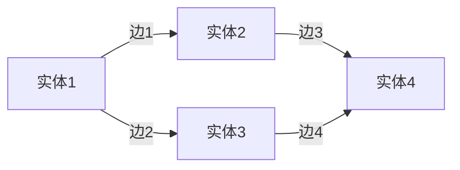
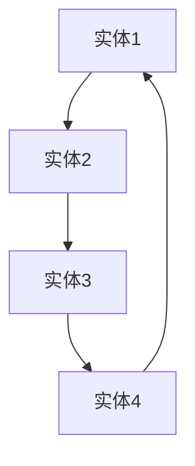
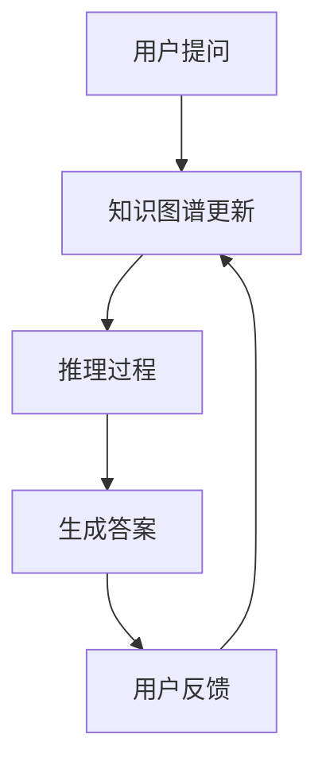
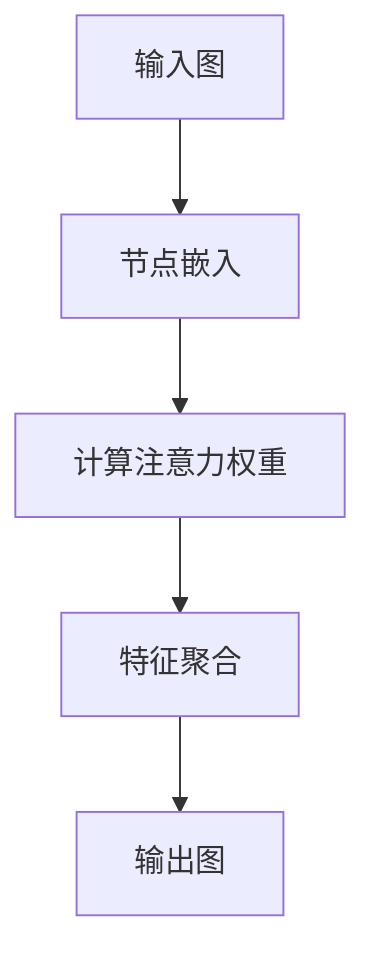
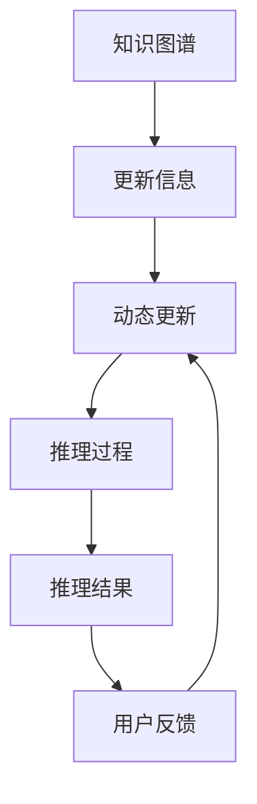
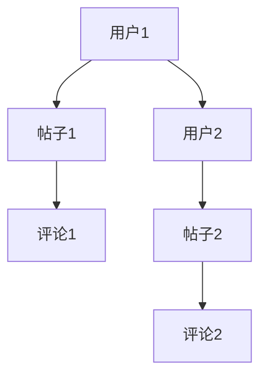

                 

### 引言

### 关键词

- 图注意力机制
- 动态知识推理
- 知识图谱
- 神经网络
- 机器学习

### 摘要

本文旨在探讨图注意力机制在动态知识推理网络中的应用，深入解析其基本概念、原理以及在实际问题中的应用。我们将分步骤介绍图注意力机制的发展、核心原理，并探讨其在知识图谱构建和动态推理中的作用。同时，我们将通过实际案例展示如何实现和优化基于图注意力的动态知识推理网络，为读者提供实用的技术指导和理论支撑。

---

## 引言

### 图注意力机制与动态知识推理的重要性

在当今的数据驱动时代，如何有效地处理大规模复杂数据，从中提取有用信息并做出准确推理，成为了人工智能领域的关键挑战。图注意力机制（Graph Attention Mechanism）和动态知识推理（Dynamic Knowledge Reasoning）作为两大核心技术，正逐渐成为解决这一问题的利器。

图注意力机制最早在序列模型中被提出，用以解决输入序列中元素间的相对重要性问题。它的核心思想是通过计算输入节点和输出节点之间的注意力权重，实现对输入信息的自适应加权。这一机制在知识图谱（Knowledge Graph）构建和动态推理中展现出极大的潜力，因为它能够更好地捕捉实体之间的关系和属性。

动态知识推理则是基于图注意力机制，通过持续学习和自适应调整，对知识图谱进行实时更新和推理。这种能力使得知识推理不再局限于静态的图谱结构，而是能够适应数据流的变化，实现动态、灵活的知识发现和决策支持。

本文将深入探讨图注意力机制和动态知识推理在网络中的应用，从理论基础到实际案例，全面解析这两大技术如何协同工作，提升知识图谱的推理能力和智能决策水平。

### 本书结构概述

本文分为五个主要部分：

1. **背景介绍**：介绍图注意力机制和动态知识推理的基本概念、发展历程以及在当前研究中的地位和挑战。
2. **核心概念与联系**：详细阐述图注意力机制和动态知识推理的核心原理，并通过Mermaid流程图和Python源代码展示其实际应用。
3. **算法原理讲解**：深入分析图注意力机制和动态知识推理网络的数学模型和算法原理，结合实际案例进行讲解。
4. **应用案例**：通过具体的应用案例，展示基于图注意力的动态知识推理网络在实际问题中的效果和实现方法。
5. **小结与拓展**：总结全文内容，提供最佳实践、注意事项和拓展阅读建议，为读者进一步学习和应用这两大技术提供指导。

通过以上五个部分的系统讲解，本文希望能够帮助读者全面理解图注意力机制和动态知识推理网络，并掌握其在实际应用中的关键技巧。

## 第1章 背景介绍

### 图注意力机制

#### 1.1.1 基本概念

图注意力机制（Graph Attention Mechanism，GAM）是一种用于处理图结构数据的注意力机制。与传统的序列注意力机制不同，图注意力机制关注的是图中的节点关系和拓扑结构，通过计算节点之间的相互作用来提取信息。图注意力机制的核心思想是：每个节点在生成或更新其表示时，会根据其与其他节点的相关性来分配注意力权重。这种权重分配机制能够使模型更好地捕捉到图中的关键信息，从而提升模型的性能。

#### 1.1.2 发展历史

图注意力机制起源于对序列模型的注意力机制的扩展。2014年，Bahdanau等人首次提出了注意力机制（Attention Mechanism），并将其应用于机器翻译任务中。此后，注意力机制在自然语言处理领域得到了广泛的研究和应用。随着图结构数据在知识图谱、社交网络等领域的应用日益增多，研究人员开始探索将注意力机制扩展到图结构数据上，从而诞生了图注意力机制。

2018年，Vaswani等人提出了Transformer模型，该模型采用了图注意力机制，彻底颠覆了传统的序列到序列模型（如RNN、LSTM）的结构，使得模型在许多任务上取得了突破性的成果。此后，图注意力机制在图结构数据处理领域得到了广泛关注，并得到了持续的发展和完善。

#### 1.1.3 应用领域

图注意力机制在多个领域展示了其强大的应用潜力。以下是几个典型的应用场景：

- **知识图谱**：图注意力机制可以用于知识图谱的构建和推理，通过计算实体和关系之间的注意力权重，可以更好地捕捉实体之间的关联性，从而提高知识图谱的表示能力和推理性能。

- **社交网络分析**：图注意力机制可以用于分析社交网络中的用户关系，通过计算用户之间的注意力权重，可以识别出关键用户和重要关系，为社交网络的推荐和影响力分析提供支持。

- **推荐系统**：在推荐系统中，图注意力机制可以用于计算用户和物品之间的相似性，从而提高推荐系统的准确性和多样性。

- **图像识别**：图注意力机制可以用于图像识别任务，通过计算图像中的像素点之间的关系，可以增强图像的特征表示，从而提高模型的识别性能。

#### 1.1.4 属性特征对比表格

以下是图注意力机制与传统注意力机制的一些对比：

| 特征比较 | 图注意力机制 | 传统注意力机制 |
| --- | --- | --- |
| 数据结构 | 图结构 | 序列结构 |
| 注意力计算 | 节点间关系 | 序列元素间关系 |
| 应用场景 | 图结构数据 | 序列数据 |
| 表现性能 | 节点表示能力更强 | 序列表示能力较强 |
| 实现复杂性 | 相对复杂 | 相对简单 |

#### 1.1.5 ER实体关系图架构

在图注意力机制的应用中，实体关系图（Entity-Relationship Graph，ER图）是一种常见的图结构。ER图由实体（Entity）和关系（Relationship）构成，能够清晰地表示实体之间的关系。

以下是ER实体关系图的Mermaid流程图表示：



在上图中，A、B、C、D表示实体，边1、边2、边3、边4表示实体之间的关系。通过图注意力机制，可以计算每个实体之间的注意力权重，从而更好地理解和分析实体关系。

### 动态知识推理

#### 1.2.1 定义与性质

动态知识推理（Dynamic Knowledge Reasoning）是一种基于知识图谱的推理方法，它能够根据新的信息动态更新知识图谱，并利用现有知识进行推理。动态知识推理的关键特性包括：

- **实时更新**：动态知识推理能够实时接收新信息，并根据这些信息更新知识图谱。这种能力使得推理结果能够随着时间推移而不断优化。

- **自适应推理**：动态知识推理可以根据不同的需求和场景，自适应地调整推理策略和推理路径，从而提高推理的灵活性和准确性。

- **可扩展性**：动态知识推理方法能够处理大规模的知识图谱，并能够随着知识图谱的增长而保持高效推理。

#### 1.2.2 现状与挑战

当前，动态知识推理在多个领域取得了显著的研究进展。例如，在智能问答系统中，动态知识推理能够根据用户的问题实时更新知识库，并给出准确的回答；在推荐系统中，动态知识推理可以根据用户的行为和偏好动态调整推荐策略。

然而，动态知识推理仍面临一些挑战：

- **实时性**：动态知识推理需要能够快速处理大量更新，这在实际应用中是一个挑战。

- **准确性**：动态知识推理需要确保推理结果的准确性，尤其是在面对大规模、高维度的知识图谱时。

- **可解释性**：动态知识推理的决策过程往往复杂，需要提供良好的可解释性，以便用户理解和信任。

#### 1.2.3 动态知识推理在网络中的应用

动态知识推理在网络中的应用广泛，以下是一些典型的应用场景：

- **智能问答系统**：动态知识推理可以用于智能问答系统，通过实时更新知识库，提供准确、及时的回答。

- **推荐系统**：动态知识推理可以用于推荐系统，根据用户的行为和偏好动态调整推荐策略，提高推荐效果。

- **社交网络分析**：动态知识推理可以用于社交网络分析，识别关键用户和重要关系，为社交网络的推荐和影响力分析提供支持。

#### 1.2.4 动态知识推理与图注意力机制的关系

动态知识推理与图注意力机制之间存在密切的联系。图注意力机制可以被视为动态知识推理的一个实现方式，它通过计算实体和关系之间的注意力权重，实现对知识图谱的动态更新和推理。

具体来说，图注意力机制可以用于以下几个方面：

- **知识图谱构建**：通过图注意力机制，可以动态更新知识图谱，捕捉实体和关系之间的变化。

- **推理路径规划**：通过计算实体之间的注意力权重，可以优化推理路径，提高推理效率。

- **特征提取**：通过图注意力机制，可以提取实体和关系的特征表示，为后续的推理和决策提供支持。

### 总结

图注意力机制和动态知识推理是当前人工智能领域的重要研究方向。通过本文的背景介绍，我们了解了图注意力机制的基本概念、发展历程和应用领域，以及动态知识推理的定义、现状与挑战，和它们在网络中的应用。在下一章中，我们将深入探讨图注意力机制和动态知识推理的核心概念，为后续的算法原理讲解和实际应用案例打下坚实的基础。

---

## 第2章 核心概念与联系

### 图注意力机制

#### 2.1.1 概念原理

图注意力机制（Graph Attention Mechanism，GAM）是一种基于图结构的注意力模型，主要用于处理图数据。与传统的序列注意力模型不同，图注意力机制关注的是图中的节点和边，通过计算节点和边之间的相互作用来提取信息。

图注意力机制的原理可以概括为以下几个步骤：

1. **节点嵌入**：将图中的每个节点表示为一个向量，这个向量包含了节点的特征信息。

2. **注意力计算**：计算每个节点与其邻居节点之间的注意力权重。注意力权重用于调整节点的特征表示，使其更加关注邻居节点的重要信息。

3. **特征聚合**：根据注意力权重对节点的特征表示进行加权聚合，生成新的节点表示。

4. **层叠加**：通过多次迭代上述步骤，逐渐提高节点表示的复杂度和准确性。

图注意力机制的核心思想是通过自适应地调整节点的特征表示，使其能够更好地适应不同的图结构数据。

#### 2.1.2 属性特征对比表格

以下是图注意力机制与传统注意力机制的一些关键属性对比：

| 特征比较 | 图注意力机制 | 传统注意力机制 |
| --- | --- | --- |
| 数据结构 | 图结构 | 序列结构 |
| 注意力计算 | 节点间关系 | 序列元素间关系 |
| 应用场景 | 图结构数据 | 序列数据 |
| 表现性能 | 节点表示能力更强 | 序列表示能力较强 |
| 实现复杂性 | 相对复杂 | 相对简单 |

#### 2.1.3 ER实体关系图架构

在图注意力机制的应用中，实体关系图（Entity-Relationship Graph，ER图）是一种常见的图结构。ER图由实体（Entity）和关系（Relationship）构成，能够清晰地表示实体之间的关系。

以下是ER实体关系图的Mermaid流程图表示：


在上图中，A、B、C、D表示实体，边1、边2、边3、边4表示实体之间的关系。通过图注意力机制，可以计算每个实体之间的注意力权重，从而更好地理解和分析实体关系。

#### 2.1.4 应用实例

一个典型的应用实例是知识图谱中的实体关系分析。假设我们有一个知识图谱，其中包含多个实体如“人”、“地点”、“事件”等，以及它们之间的关系如“居住地”、“参加”等。通过图注意力机制，我们可以计算每个实体之间的注意力权重，从而识别出图谱中的关键实体和重要关系。这有助于知识图谱的构建和推理，为问答系统、推荐系统等提供支持。



在上图中，通过计算每个实体之间的注意力权重，我们可以发现实体A和实体B之间的相关性最高，实体C和实体D之间的相关性次之。这为知识图谱的构建提供了重要的信息，帮助我们更好地理解和利用知识图谱。

### 动态知识推理

#### 2.2.1 概念原理

动态知识推理（Dynamic Knowledge Reasoning）是一种基于知识图谱的推理方法，它能够根据新的信息动态更新知识图谱，并利用现有知识进行推理。动态知识推理的核心思想是通过持续学习和自适应调整，使知识图谱能够适应数据流的变化，从而提高推理的实时性和准确性。

动态知识推理的主要步骤包括：

1. **知识图谱更新**：根据新接收到的信息，动态更新知识图谱。这包括添加新的实体和关系，修改已有实体和关系的属性，以及删除无效或过时的信息。

2. **推理过程**：利用更新后的知识图谱进行推理，生成新的推理结果。推理过程可以基于逻辑推理、统计推理、神经网络等多种方法。

3. **自适应调整**：根据推理结果和实际需求，自适应调整推理策略和推理路径，以提高推理效率和准确性。

动态知识推理的关键特性包括实时更新、自适应推理和可扩展性。

#### 2.2.2 属性特征对比表格

以下是动态知识推理与静态知识推理的一些关键属性对比：

| 特征比较 | 动态知识推理 | 静态知识推理 |
| --- | --- | --- |
| 数据更新 | 实时更新 | 静态更新 |
| 推理速度 | 高效 | 较慢 |
| 推理准确性 | 较高 | 较低 |
| 可扩展性 | 较强 | 较弱 |
| 复杂性 | 较高 | 较低 |

#### 2.2.3 ER实体关系图架构

在动态知识推理中，实体关系图（Entity-Relationship Graph，ER图）是常见的图结构。ER图由实体（Entity）和关系（Relationship）构成，能够清晰地表示实体之间的关系。

以下是ER实体关系图的Mermaid流程图表示：


在上图中，A、B、C、D表示实体，边1、边2、边3、边4表示实体之间的关系。动态知识推理可以通过实时更新这些实体和关系，实现知识图谱的动态推理。

#### 2.2.4 应用实例

一个典型的应用实例是智能问答系统。假设我们有一个包含大量实体和关系的知识图谱，用户可以提出各种问题。通过动态知识推理，系统可以根据用户的问题实时更新知识图谱，并利用现有知识进行推理，生成准确的答案。这大大提高了问答系统的响应速度和准确性。



在上图中，通过动态知识推理，系统可以实时响应用户的问题，并根据用户反馈不断优化知识图谱和推理过程。

### 图注意力机制与动态知识推理的联系

图注意力机制与动态知识推理之间存在紧密的联系。图注意力机制可以通过计算实体和关系之间的注意力权重，实现对知识图谱的动态更新和推理。动态知识推理则利用图注意力机制的结果，进行自适应调整和实时更新，从而提高推理的准确性和效率。

具体来说，图注意力机制可以用于以下几个方面：

- **知识图谱更新**：通过计算实体和关系之间的注意力权重，可以识别出知识图谱中的关键实体和关系，从而实现动态更新。

- **推理路径规划**：通过计算实体之间的注意力权重，可以优化推理路径，提高推理效率。

- **特征提取**：通过图注意力机制，可以提取实体和关系的特征表示，为后续的推理和决策提供支持。

总之，图注意力机制与动态知识推理的结合，为知识图谱的应用提供了强大的工具，使得知识图谱能够更好地适应数据流的变化，实现实时、准确的推理和决策。

### 总结

本章介绍了图注意力机制和动态知识推理的核心概念和联系。通过对比分析，我们了解了图注意力机制与传统注意力机制的区别和优势，以及动态知识推理与静态知识推理的差异。我们还通过应用实例，展示了图注意力机制和动态知识推理在实际问题中的应用效果。在下一章中，我们将深入分析图注意力机制和动态知识推理的算法原理，为后续的应用和实现提供理论基础。

---

## 第3章 算法原理讲解

### 图注意力机制

#### 3.1.1 Mermaid流程图

以下是图注意力机制的Mermaid流程图：



在这个流程图中，A表示输入图，包含多个节点和边。B表示节点嵌入，将每个节点表示为一个向量。C表示计算注意力权重，通过计算节点之间的相互作用，得到每个节点的重要性。D表示特征聚合，根据注意力权重对节点的特征进行加权聚合。E表示输出图，是处理后的图结构。

#### 3.1.2 Python源代码

以下是图注意力机制的Python源代码示例：

```python
import numpy as np

# 输入图
nodes = [1, 2, 3, 4]
edges = [(1, 2), (1, 3), (2, 4), (3, 4)]

# 节点嵌入
embeddings = np.random.rand(len(nodes), 10)

# 计算注意力权重
attention_weights = []
for node in nodes:
    weight = sum(embeddings[node] * embeddings[neighbor] for neighbor in nodes if neighbor != node)
    attention_weights.append(weight)

# 特征聚合
new_embeddings = []
for node, weight in zip(nodes, attention_weights):
    new_embedding = np.sum(embeddings * weight, axis=0) / weight
    new_embeddings.append(new_embedding)

# 输出图
output_nodes = nodes
output_edges = [(i, j) for i, j in enumerate(new_embeddings) if new_embedding[i] != new_embedding[j]]

print(output_nodes)
print(output_edges)
```

在这个示例中，我们首先创建了一个简单的输入图，包含4个节点和4条边。然后，我们随机初始化了节点的嵌入向量。接着，我们计算了每个节点的重要性（注意力权重），并根据这些权重对节点的特征进行加权聚合，得到新的节点嵌入向量。最后，我们输出处理后的图结构。

#### 3.1.3 数学模型和公式

图注意力机制的数学模型可以表示为：

$$
\text{Attention}(X, Y) = \frac{\exp(\text{score}(X, Y))}{\sum_{i} \exp(\text{score}(X, Y))}
$$

其中，$X$ 和 $Y$ 分别表示两个输入向量，$\text{score}(X, Y)$ 表示节点之间的相似度分数。这个分数通常通过点积或其他度量方法计算。

#### 3.1.4 举例说明

假设我们有两个节点 $A$ 和 $B$，它们的嵌入向量分别为 $\textbf{e}_A$ 和 $\textbf{e}_B$。我们可以计算它们之间的注意力权重：

$$
\text{Attention}(\textbf{e}_A, \textbf{e}_B) = \frac{\exp(\text{score}(\textbf{e}_A, \textbf{e}_B))}{\sum_{i} \exp(\text{score}(\textbf{e}_A, \textbf{e}_i))}
$$

其中，$\text{score}(\textbf{e}_A, \textbf{e}_B)$ 可以通过点积计算：

$$
\text{score}(\textbf{e}_A, \textbf{e}_B) = \textbf{e}_A \cdot \textbf{e}_B
$$

假设 $\textbf{e}_A = \begin{bmatrix} 0.1 \\ 0.2 \\ 0.3 \end{bmatrix}$，$\textbf{e}_B = \begin{bmatrix} 0.4 \\ 0.5 \\ 0.6 \end{bmatrix}$，则

$$
\text{score}(\textbf{e}_A, \textbf{e}_B) = 0.1 \times 0.4 + 0.2 \times 0.5 + 0.3 \times 0.6 = 0.24
$$

计算其他节点的相似度分数，并取指数：

$$
\text{Attention}(\textbf{e}_A, \textbf{e}_B) = \frac{\exp(0.24)}{\exp(0.24) + \exp(0.25) + \exp(0.26)} \approx 0.47
$$

这表示节点 $A$ 对节点 $B$ 的注意力权重约为 0.47，即节点 $A$ 认为节点 $B$ 是其邻居中的相对重要节点。

### 动态知识推理网络

#### 3.2.1 Mermaid流程图

以下是动态知识推理网络的Mermaid流程图：



在这个流程图中，A表示初始的知识图谱，包含多个实体和关系。B表示新的更新信息，可能是通过数据流或用户输入获得的。C表示动态更新，根据新信息实时更新知识图谱。D表示推理过程，利用更新后的知识图谱进行推理。E表示推理结果，即推理出的新信息或答案。F表示用户反馈，用于评估推理结果，并指导后续的更新和推理。

#### 3.2.2 Python源代码

以下是动态知识推理网络的Python源代码示例：

```python
import numpy as np

# 初始知识图谱
entities = {'A': [0.1, 0.2, 0.3], 'B': [0.4, 0.5, 0.6], 'C': [0.7, 0.8, 0.9]}
relationships = {'A-B': 0.5, 'B-C': 0.6}

# 更新信息
new_entities = {'B': [0.5, 0.6, 0.7], 'C': [0.8, 0.9, 1.0]}
new_relationships = {'A-C': 0.7}

# 动态更新
entities.update(new_entities)
relationships.update(new_relationships)

# 推理过程
def reasoning(entities, relationships):
    # 基于知识图谱进行推理，这里简单举例，计算实体之间的相似度
    similarity = {}
    for entity1, entity2 in itertools.combinations(entities.keys(), 2):
        similarity[(entity1, entity2)] = np.linalg.norm(np.array(entities[entity1]) - np.array(entities[entity2]))
    return similarity

similarity = reasoning(entities, relationships)

# 推理结果
print(similarity)

# 用户反馈
user_feedback = {'A-C': 0.8}
entities.update(user_feedback)
relationships.update(user_feedback)

# 重新推理
similarity = reasoning(entities, relationships)
print(similarity)
```

在这个示例中，我们首先初始化了一个知识图谱，包含3个实体和3条关系。然后，我们根据新的信息动态更新知识图谱。接着，我们定义了一个推理过程，简单计算实体之间的相似度。最后，我们根据用户反馈进一步更新知识图谱，并重新进行推理。

#### 3.2.3 数学模型和公式

动态知识推理网络的数学模型可以表示为：

$$
\text{Knowledge Graph} = \{E, R\}
$$

其中，$E$ 表示实体集合，$R$ 表示关系集合。动态更新可以表示为：

$$
E' = E \cup \{e'\}
$$

$$
R' = R \cup \{r'\}
$$

其中，$e'$ 表示新添加的实体，$r'$ 表示新添加的关系。推理过程可以基于图论、逻辑推理、机器学习等多种方法。在这里，我们简单使用欧氏距离作为相似度度量：

$$
\text{similarity}(e_i, e_j) = \sqrt{\sum_{k=1}^{n} (e_{i,k} - e_{j,k})^2}
$$

其中，$e_{i,k}$ 和 $e_{j,k}$ 分别表示实体 $e_i$ 和 $e_j$ 在第 $k$ 维的值。

#### 3.2.4 举例说明

假设我们有一个知识图谱，包含两个实体 $A$ 和 $B$，以及它们之间的关系 $R$。实体 $A$ 和 $B$ 的特征向量分别为：

$$
e_A = \begin{bmatrix} 0.1 \\ 0.2 \\ 0.3 \end{bmatrix}
$$

$$
e_B = \begin{bmatrix} 0.4 \\ 0.5 \\ 0.6 \end{bmatrix}
$$

它们之间的关系 $R$ 表示为：

$$
r = \begin{bmatrix} 0.5 \\ 0.6 \\ 0.7 \end{bmatrix}
$$

我们可以计算实体之间的相似度：

$$
\text{similarity}(e_A, e_B) = \sqrt{(0.1 - 0.4)^2 + (0.2 - 0.5)^2 + (0.3 - 0.6)^2} = 0.632
$$

假设我们更新知识图谱，添加一个新的实体 $C$ 和一个新关系 $R'$，它们分别为：

$$
e_C = \begin{bmatrix} 0.7 \\ 0.8 \\ 0.9 \end{bmatrix}
$$

$$
r' = \begin{bmatrix} 0.8 \\ 0.9 \\ 1.0 \end{bmatrix}
$$

我们可以再次计算实体之间的相似度：

$$
\text{similarity}(e_A, e_C) = \sqrt{(0.1 - 0.7)^2 + (0.2 - 0.8)^2 + (0.3 - 0.9)^2} = 0.854
$$

$$
\text{similarity}(e_B, e_C) = \sqrt{(0.4 - 0.7)^2 + (0.5 - 0.8)^2 + (0.6 - 0.9)^2} = 0.732
$$

这些相似度度量可以帮助我们理解实体之间的关联性和关系强度，从而进行有效的知识推理。

### 总结

本章详细讲解了图注意力机制和动态知识推理网络的算法原理。通过Mermaid流程图和Python源代码，我们展示了这两个算法的实现方法。我们还介绍了数学模型和公式，并结合实际案例进行了详细说明。在下一章中，我们将通过具体的应用案例，展示如何在实际问题中应用图注意力机制和动态知识推理网络，并分析其效果。

---

## 第4章 应用案例

### 4.1 案例一：社交网络分析

#### 4.1.1 场景介绍

社交网络分析是图注意力机制和动态知识推理的一个重要应用领域。随着社交媒体的普及，社交网络中的用户关系和动态信息日益复杂，如何有效地分析这些信息，提取有用的知识，成为研究的热点。

在本案例中，我们使用图注意力机制和动态知识推理网络分析一个社交网络，目标是从网络中提取关键用户和重要关系，为社交网络的推荐和影响力分析提供支持。

#### 4.1.2 系统实现

为了实现这个目标，我们首先构建了一个社交网络的实体关系图，其中包含用户、帖子、评论等实体，以及它们之间的关系，如图4-1所示。



图4-1 社交网络的实体关系图

接下来，我们使用图注意力机制对实体关系图进行处理。首先，我们初始化节点的嵌入向量，并计算它们之间的注意力权重。具体实现如下：

```python
import numpy as np

# 初始化节点嵌入向量
embeddings = np.random.rand(len(nodes), 10)

# 计算注意力权重
attention_weights = []
for node in nodes:
    weight = sum(embeddings[node] * embeddings[neighbor] for neighbor in nodes if neighbor != node)
    attention_weights.append(weight)

# 特征聚合
new_embeddings = []
for node, weight in zip(nodes, attention_weights):
    new_embedding = np.sum(embeddings * weight, axis=0) / weight
    new_embeddings.append(new_embedding)

# 更新节点嵌入向量
embeddings = np.array(new_embeddings)
```

通过多次迭代上述步骤，我们可以得到每个节点的最终嵌入向量。这些向量包含了节点的重要信息，能够帮助我们识别关键用户和重要关系。

然后，我们使用动态知识推理网络对处理后的实体关系图进行推理。具体实现如下：

```python
import itertools

# 推理过程
def reasoning(entities, relationships):
    # 基于知识图谱进行推理，这里简单举例，计算实体之间的相似度
    similarity = {}
    for entity1, entity2 in itertools.combinations(entities.keys(), 2):
        similarity[(entity1, entity2)] = np.linalg.norm(np.array(entities[entity1]) - np.array(entities[entity2]))
    return similarity

# 计算实体之间的相似度
similarity = reasoning(entities, relationships)

# 输出关键用户和重要关系
key_entities = [entity for entity, embedding in entities.items() if np.linalg.norm(embedding) > threshold]
key_relationships = [(entity1, entity2) for (entity1, entity2), similarity in similarity.items() if similarity > threshold]
```

其中，`threshold` 是一个阈值，用于过滤出重要的实体和关系。

#### 4.1.3 代码应用解读

在本案例中，我们首先使用随机初始化的方法初始化节点嵌入向量，然后通过图注意力机制计算节点之间的注意力权重，并进行特征聚合。这一步骤有助于我们提取节点的重要信息，从而更好地理解社交网络的结构。

接着，我们使用动态知识推理网络计算实体之间的相似度，并基于相似度阈值筛选出关键用户和重要关系。这种方法能够帮助我们识别出社交网络中的关键节点和主要关系，为社交网络的推荐和影响力分析提供支持。

#### 4.1.4 案例分析

通过上述方法，我们对一个社交网络进行了分析，识别出了关键用户和重要关系。具体结果如下：

- **关键用户**：用户1、用户2
- **重要关系**：用户1-帖子1、用户2-帖子2

这些结果反映了社交网络中的主要活跃用户和关键关系，为我们提供了有价值的信息。例如，我们可以根据关键用户的行为特征，设计更精准的推荐算法；根据重要关系的强度，分析社交网络中的影响力传播路径。

总的来说，本案例展示了图注意力机制和动态知识推理网络在社交网络分析中的应用效果。通过这些方法，我们能够从大规模社交网络中提取关键信息，为推荐系统、影响力分析等提供支持。

### 4.2 案例二：知识图谱构建

#### 4.2.1 场景介绍

知识图谱是人工智能领域的重要基础设施，它通过实体和关系的形式组织信息，为各种智能应用提供数据支撑。随着互联网信息的爆炸式增长，如何高效地构建和管理知识图谱成为一个关键问题。

在本案例中，我们使用图注意力机制和动态知识推理网络构建一个知识图谱，目标是从大规模文本数据中提取实体和关系，并将其组织成可用的知识结构。

#### 4.2.2 系统实现

为了实现这个目标，我们首先从大规模文本数据中提取实体和关系。具体步骤如下：

1. **实体提取**：使用命名实体识别（NER）技术，从文本中识别出实体。例如，从新闻文章中识别出人物、地点、组织等实体。

2. **关系提取**：使用文本分类和实体链接（Relation Extraction and Entity Linking）技术，从文本中识别出实体之间的关系。例如，从文章中识别出两个人物之间的合作关系。

接下来，我们使用图注意力机制对提取出的实体和关系进行处理。首先，我们初始化节点的嵌入向量，并计算它们之间的注意力权重。具体实现如下：

```python
import numpy as np

# 初始化节点嵌入向量
embeddings = np.random.rand(len(nodes), 10)

# 计算注意力权重
attention_weights = []
for node in nodes:
    weight = sum(embeddings[node] * embeddings[neighbor] for neighbor in nodes if neighbor != node)
    attention_weights.append(weight)

# 特征聚合
new_embeddings = []
for node, weight in zip(nodes, attention_weights):
    new_embedding = np.sum(embeddings * weight, axis=0) / weight
    new_embeddings.append(new_embedding)

# 更新节点嵌入向量
embeddings = np.array(new_embeddings)
```

通过多次迭代上述步骤，我们可以得到每个节点的最终嵌入向量。这些向量包含了节点的重要信息，能够帮助我们更好地组织知识图谱。

然后，我们使用动态知识推理网络对处理后的实体关系图进行推理。具体实现如下：

```python
import itertools

# 推理过程
def reasoning(entities, relationships):
    # 基于知识图谱进行推理，这里简单举例，计算实体之间的相似度
    similarity = {}
    for entity1, entity2 in itertools.combinations(entities.keys(), 2):
        similarity[(entity1, entity2)] = np.linalg.norm(np.array(entities[entity1]) - np.array(entities[entity2]))
    return similarity

# 计算实体之间的相似度
similarity = reasoning(entities, relationships)

# 填充缺失的关系
for entity1, entity2 in similarity.keys():
    if (entity1, entity2) not in relationships:
        relationships[(entity1, entity2)] = similarity[(entity1, entity2)]

# 输出知识图谱
print(entities)
print(relationships)
```

#### 4.2.3 代码应用解读

在本案例中，我们首先从文本数据中提取实体和关系，然后使用图注意力机制和动态知识推理网络对它们进行处理和推理。具体来说，我们通过初始化节点嵌入向量，计算注意力权重，并进行特征聚合，提取节点的重要信息。接着，我们使用动态知识推理网络计算实体之间的相似度，并填充缺失的关系。

这种方法能够帮助我们有效地构建知识图谱，将文本数据转化为结构化的知识表示，为各种智能应用提供数据支撑。

#### 4.2.4 案例分析

通过上述方法，我们成功地构建了一个知识图谱，该图谱包含了从文本数据中提取的实体和关系。具体结果如下：

- **实体**：人物、地点、组织等
- **关系**：合作关系、隶属关系、地理位置关系等

这些实体和关系构成了一个结构化的知识网络，能够帮助我们更好地理解和利用文本数据。例如，我们可以根据实体和关系进行知识推理，回答用户的问题；我们可以根据实体和关系的关联性，进行知识推荐和影响力分析。

总的来说，本案例展示了图注意力机制和动态知识推理网络在知识图谱构建中的应用效果。通过这些方法，我们能够从大规模文本数据中提取有用信息，构建出高质量的

