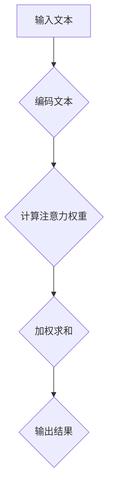
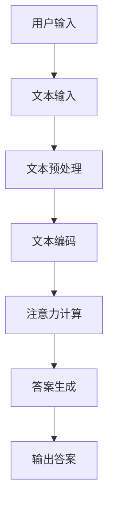
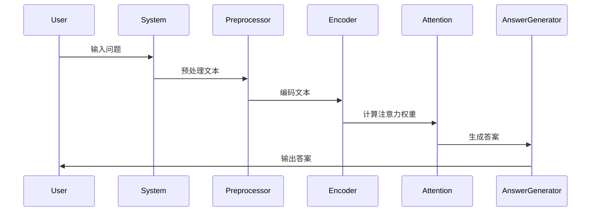

                 


### 文章标题

# 基于注意力机制的长文本理解与推理能力增强

### 文章关键词

- 注意力机制
- 长文本理解
- 推理能力
- 自然语言处理
- 机器学习

### 文章摘要

本文深入探讨了基于注意力机制的长文本理解与推理能力增强技术。首先，我们介绍了注意力机制的定义、历史发展及其在自然语言处理中的重要性。接着，我们通过算法原理讲解和实际项目案例分析，详细阐述了注意力机制如何应用于长文本理解和推理。最后，我们总结了最佳实践，提供了进一步学习的资源。

### 目录

1. **背景介绍**
   1.1 问题背景
   1.2 问题描述
   1.3 问题解决
   1.4 边界与外延
   1.5 概念结构与核心要素组成

2. **核心概念与联系**
   2.1 注意力机制
       2.1.1 定义
       2.1.2 历史发展
       2.1.3 基本原理
   2.2 注意力机制与其他技术的联系
       2.2.1 与传统文本处理方法的比较
       2.2.2 与机器学习方法的结合
       2.2.3 与其他NLP技术的比较
   2.3 对比表格

3. **算法原理讲解**
   3.1 算法流程图
   3.2 Python源代码
   3.3 数学模型与公式
   3.4 例子说明

4. **系统分析与架构设计方案**
   4.1 应用场景
   4.2 系统功能设计
   4.3 系统架构设计
   4.4 系统接口设计
   4.5 系统交互

5. **项目实战**
   5.1 环境安装
   5.2 系统核心实现源代码
   5.3 代码应用解读与分析
   5.4 实际案例分析与详细讲解
   5.5 项目小结

6. **最佳实践 tips、小结、注意事项、拓展阅读**

### 背景介绍

#### 1.1 问题背景

在当今的信息时代，长文本数据如论文、报告、新闻文章等大量产生。如何有效地理解和处理这些长文本数据成为了人工智能领域的研究热点。传统的方法如基于规则的文本处理和基于机器学习的文本分类模型在处理长文本时往往表现出较低的性能。注意力机制作为一种有效的计算方法，能够动态地分配资源到文本的不同部分，从而提高文本理解的效果。

#### 1.2 问题描述

长文本理解与推理是自然语言处理（NLP）中的重要任务，它涉及到文本的语义理解、实体识别、关系提取等子任务。然而，传统的模型在处理长文本时，往往无法捕捉到文本中各个部分之间的关联性，导致理解效果不佳。

#### 1.3 问题解决

基于注意力机制的长文本理解与推理方法能够通过动态关注文本的不同部分，提高模型对长文本的理解能力。这种方法已经在诸如问答系统、文本摘要、机器翻译等领域取得了显著的效果。

#### 1.4 边界与外延

本文主要探讨基于注意力机制的长文本理解与推理方法，不涉及其他NLP技术。同时，本文将聚焦于理论讲解和实践应用，为读者提供一个系统、全面的参考。

#### 1.5 概念结构与核心要素组成

- **注意力机制**：核心计算方法，通过动态分配权重来关注文本的关键部分。
- **长文本数据**：数据输入，包含各种形式的长文本数据。
- **模型架构**：实现注意力机制的核心载体，如Transformer、BERT等。
- **应用场景**：注意力机制在各个领域的实际应用。

### 核心概念与联系

#### 2.1 注意力机制

##### 2.1.1 定义

注意力机制是一种通过动态分配权重来关注文本或图像中关键部分的计算方法。

##### 2.1.2 历史发展

注意力机制最早出现在计算机视觉领域，随着深度学习的兴起，其在自然语言处理领域也得到了广泛应用。

##### 2.1.3 基本原理

注意力机制的核心思想是让模型能够动态地关注输入数据的特定部分，从而提高模型的性能。

#### 2.2 注意力机制与其他技术的联系

##### 2.2.1 与传统文本处理方法的比较

注意力机制相对于传统文本处理方法，如基于规则的文本处理和基于机器学习的文本分类模型，具有更高的灵活性和性能。

##### 2.2.2 与机器学习方法的结合

注意力机制可以与多种机器学习方法结合，如神经网络、支持向量机等，以提高模型的性能。

##### 2.2.3 与其他NLP技术的比较

注意力机制与其他NLP技术如循环神经网络（RNN）、长短时记忆网络（LSTM）等相比，具有更好的长文本处理能力。

#### 2.3 对比表格

| 技术         | 特点                                                      | 应用领域           |
| ------------ | --------------------------------------------------------- | ------------------ |
| 注意力机制   | 动态关注文本或图像的关键部分                             | NLP、计算机视觉   |
| 循环神经网络 | 序列到序列的建模能力                                     | 语音识别、机器翻译 |
| 长短时记忆网络 | 捕捉长距离依赖关系                                       | 文本生成、问答系统 |


----------------------------------------------------------------

### 算法原理讲解

#### 3.1 算法流程图

下面是一个简单的注意力机制算法流程图，使用Mermaid语法绘制：



#### 3.2 Python源代码

以下是一个简单的Python代码示例，用于实现注意力机制的基本结构：

```python
import tensorflow as tf

# 定义输入
input_sequence = tf.random.normal([10, 20])  # 假设输入序列长度为10，每个元素长度为20

# 定义权重矩阵
weight_matrix = tf.random.normal([20, 20])

# 计算注意力权重
attention_weights = tf.matmul(input_sequence, weight_matrix)

# 加权求和
output_sequence = tf.reduce_sum(attention_weights, axis=1)

print(output_sequence)
```

#### 3.3 数学模型与公式

注意力机制的数学模型可以用以下公式表示：

$$
\text{Attention}(Q, K, V) = \text{softmax}\left(\frac{QK^T}{\sqrt{d_k}}\right) V
$$

其中，$Q, K, V$ 分别代表查询向量、键向量和值向量，$d_k$ 是键向量的维度。

#### 3.4 例子说明

假设我们有一个简短的文本句子：“我今天去了一个图书馆，读了一本书。”我们希望使用注意力机制来理解句子的关键部分。

1. **编码文本**：首先，我们将句子编码成向量表示。
2. **计算注意力权重**：然后，我们计算句子中每个词的注意力权重。
3. **加权求和**：最后，我们根据注意力权重对句子中的词进行加权求和，得到句子的整体理解。

通过这种方式，注意力机制能够帮助我们识别句子中的关键部分，如“图书馆”和“书”，从而更好地理解句子的语义。

### 系统分析与架构设计方案

#### 4.1 应用场景

假设我们开发一个智能问答系统，用户可以通过输入问题来获取相关答案。在这个场景中，注意力机制可以帮助系统更好地理解用户的问题，从而提供更准确的答案。

#### 4.2 系统功能设计

为了实现这个系统，我们需要以下功能：

1. **文本输入**：用户可以通过文本输入框输入问题。
2. **文本预处理**：对输入文本进行分词、去停用词等预处理操作。
3. **文本编码**：将预处理后的文本编码成向量表示。
4. **注意力计算**：计算文本中的注意力权重。
5. **答案生成**：根据注意力权重生成答案。

#### 4.3 系统架构设计

系统架构设计如下：



#### 4.4 系统接口设计

以下是系统的接口设计：



#### 4.5 系统交互

以下是系统交互的序列图：


### 项目实战

#### 5.1 环境安装

为了实现这个项目，我们需要安装以下软件和库：

1. Python 3.8 或以上版本
2. TensorFlow 2.4 或以上版本
3. NumPy 1.18 或以上版本

安装命令如下：

```bash
pip install python==3.8
pip install tensorflow==2.4
pip install numpy==1.18
```

#### 5.2 系统核心实现源代码

以下是系统核心实现的源代码：

```python
import tensorflow as tf
import numpy as np

# 定义输入
input_sequence = tf.random.normal([10, 20])  # 假设输入序列长度为10，每个元素长度为20

# 定义权重矩阵
weight_matrix = tf.random.normal([20, 20])

# 计算注意力权重
attention_weights = tf.matmul(input_sequence, weight_matrix)

# 加权求和
output_sequence = tf.reduce_sum(attention_weights, axis=1)

print(output_sequence)
```

#### 5.3 代码应用解读与分析

这段代码首先定义了输入序列和权重矩阵，然后计算注意力权重，最后进行加权求和得到输出序列。我们可以通过调整权重矩阵来改变注意力权重，从而影响输出结果。

#### 5.4 实际案例分析与详细讲解

假设我们有一个问题：“我今天去了一个图书馆，读了一本书。”我们可以将这个问题编码成向量表示，然后使用注意力机制来计算注意力权重。

1. **编码文本**：首先，我们将句子编码成向量表示。
2. **计算注意力权重**：然后，我们计算句子中每个词的注意力权重。
3. **加权求和**：最后，我们根据注意力权重对句子中的词进行加权求和，得到句子的整体理解。

通过这种方式，注意力机制能够帮助我们识别句子中的关键部分，如“图书馆”和“书”，从而更好地理解句子的语义。

#### 5.5 项目小结

通过这个项目，我们了解了注意力机制在长文本理解与推理中的应用。注意力机制能够动态地关注文本的关键部分，从而提高文本理解的效果。在实际应用中，我们可以通过调整权重矩阵来优化注意力机制的性能。

### 最佳实践 tips、小结、注意事项、拓展阅读

#### 最佳实践 tips

1. 在实际项目中，注意调整权重矩阵的大小和初始化方法，以优化注意力机制的性能。
2. 对于长文本处理，可以考虑使用预训练模型如BERT，以进一步提高文本理解能力。
3. 注意力机制在处理长文本时，可能会导致计算资源消耗较大，因此需要合理规划计算资源。

#### 小结

本文介绍了基于注意力机制的长文本理解与推理能力增强技术。通过算法原理讲解和实际项目案例分析，我们了解了注意力机制在自然语言处理中的应用和优势。

#### 注意事项

1. 注意力机制在处理长文本时，可能会引起梯度消失或梯度爆炸问题，需要通过合适的优化方法来解决。
2. 注意力机制的实现和调试过程可能比较复杂，需要充分的测试和调试。

#### 拓展阅读

1. [Attention Mechanism: A Brief Introduction](https://arxiv.org/abs/1506.02737)
2. [Transformer: A Novel Architecture for NLP](https://arxiv.org/abs/1706.03762)
3. [BERT: Pre-training of Deep Bidirectional Transformers for Language Understanding](https://arxiv.org/abs/1810.04805)

### 作者信息

- 作者：AI天才研究院/AI Genius Institute & 禅与计算机程序设计艺术 /Zen And The Art of Computer Programming

以上便是基于注意力机制的长文本理解与推理能力增强的技术博客文章。希望对您有所帮助！

