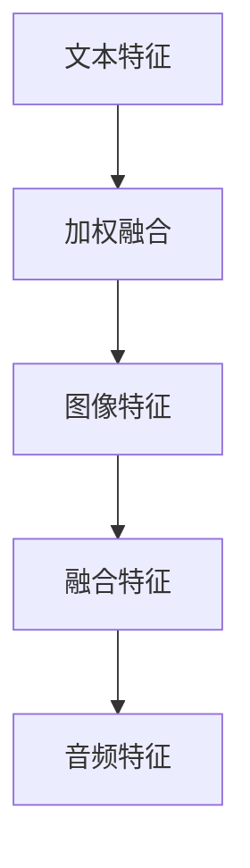
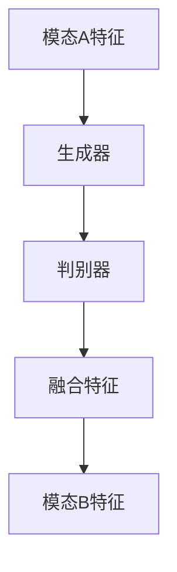
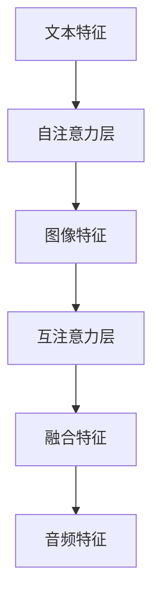
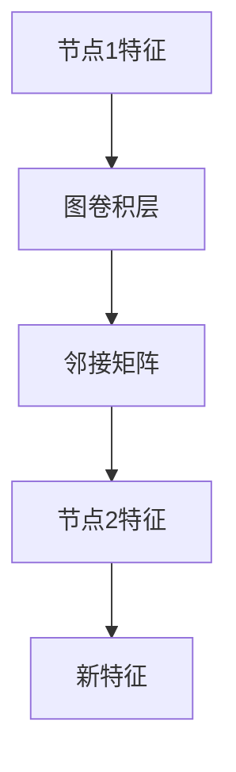
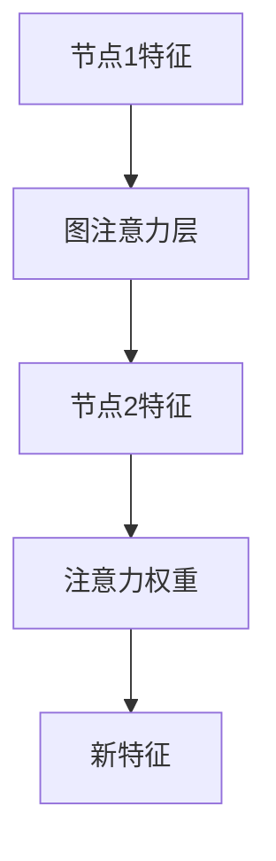
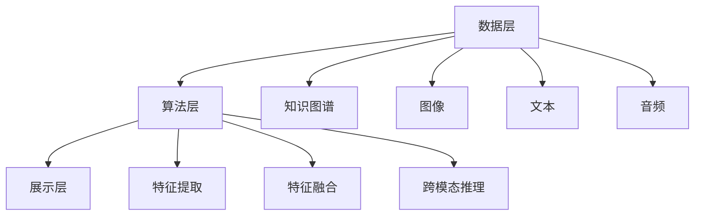
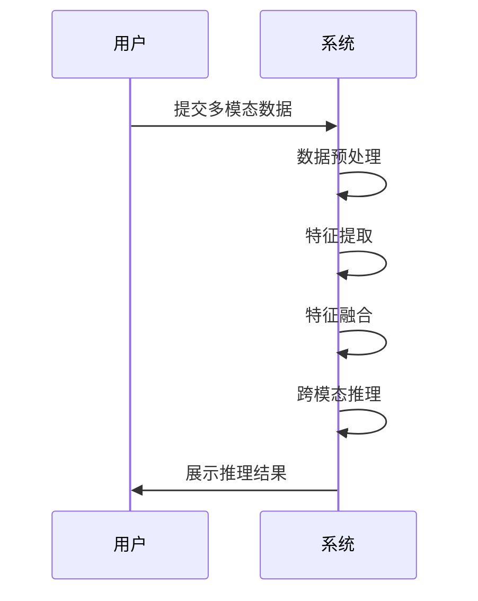

                 


### 3.1.2 跨模态特征融合算法

在提取了不同模态的特征之后，特征融合是提高跨模态推理系统性能的关键步骤。以下是几种常见的跨模态特征融合算法：

#### 3.1.2.1 加权融合
加权融合通过对不同模态的特征进行加权组合，实现特征的整合。常见的加权方法包括基于相关性的加权、基于重要度的加权等。

**算法原理：**
$$
\text{融合特征} = w_1 \times \text{文本特征} + w_2 \times \text{图像特征} + w_3 \times \text{音频特征}
$$
其中，$w_1$、$w_2$和$w_3$是不同模态特征的权重，可以通过训练或专家知识进行设置。

**Mermaid 流程图：**


#### 3.1.2.2 对抗性网络
对抗性网络通过生成对抗网络（GAN）实现特征融合。GAN由生成器和判别器组成，生成器生成新的特征，判别器判断特征的真实性。通过迭代训练，生成器和判别器相互竞争，提高生成的特征质量。

**算法原理：**
$$
\text{生成器} : G(\text{模态A特征}, \text{模态B特征}) \rightarrow \text{融合特征}
$$
$$
\text{判别器} : D(\text{融合特征}) \rightarrow \text{概率}
$$

**Mermaid 流程图：**


#### 3.1.2.3 多层注意力机制
多层注意力机制通过逐层分析不同模态特征的重要性，实现特征的有效融合。常见的注意力机制包括自注意力（Self-Attention）和互注意力（Cross-Attention）。

**算法原理：**
$$
\text{融合特征} = \sum_{i=1}^{n} a_i \times \text{特征}_i
$$
其中，$a_i$是第$i$个特征的重要性权重，可以通过训练得到。

**Mermaid 流程图：**


### 3.1.3 跨模态推理算法

跨模态推理算法基于知识图谱，实现不同模态之间的语义理解与推理。以下是几种常见的跨模态推理算法：

#### 3.1.3.1 基于图卷积网络的推理算法

图卷积网络（GCN）通过在知识图谱上进行卷积操作，实现节点的特征表示和推理。

**算法原理：**
$$
\text{新特征} = \sigma(\text{权重矩阵} \times (\text{邻接矩阵} \times \text{旧特征}))
$$
其中，$\sigma$是激活函数，权重矩阵用于调整节点间的特征传递。

**Mermaid 流程图：**


#### 3.1.3.2 基于图注意力机制的推理算法

图注意力机制（GAT）通过为每个节点分配不同的注意力权重，实现更精细的特征融合和推理。

**算法原理：**
$$
\text{新特征} = \sum_{i=1}^{n} a_{ij} \times \text{特征}_i
$$
其中，$a_{ij}$是节点$i$对节点$j$的注意力权重。

**Mermaid 流程图：**


### 3.1.4 本章小结

本章详细介绍了跨模态特征提取、特征融合和跨模态推理算法的原理与数学模型。通过对比不同算法的优缺点，为后续的性能优化提供了理论基础。在接下来的章节中，我们将进一步探讨基于知识图谱的跨模态推理系统的性能优化方法。

----------------------------------------------------------------

# 第四部分：系统分析与架构设计方案

## 第4章：系统性能分析与架构设计

### 4.1.1 问题场景介绍

随着大数据和人工智能技术的快速发展，跨模态推理系统在多个领域展现出巨大的应用潜力，如智能问答、图像识别、语音识别等。然而，在实际应用中，跨模态推理系统面临着计算效率低、资源消耗大、准确性不足等问题。为了解决这些问题，我们需要对系统进行性能分析和优化设计。

### 4.1.2 项目介绍

本项目旨在设计一个高性能的基于知识图谱的跨模态推理系统，通过性能优化策略，提高系统的处理速度、准确性和资源利用率。项目的主要目标包括：

1. 设计并实现一个高效的跨模态特征提取与融合算法。
2. 基于知识图谱构建，实现跨模态推理算法的优化。
3. 对系统进行全面的性能评估和调优。

### 4.1.3 系统功能设计

系统功能设计主要包括跨模态数据预处理、特征提取、特征融合、跨模态推理和结果输出等模块。以下是系统功能设计的详细描述：

#### 数据预处理模块
数据预处理模块负责对输入的多模态数据进行标准化处理，包括图像去噪、文本分词、音频降噪等操作。

#### 特征提取模块
特征提取模块利用不同的算法提取图像、文本和音频的特征向量，为后续的特征融合和推理提供基础。

#### 特征融合模块
特征融合模块通过加权融合、对抗性网络和多层注意力机制等方法，将不同模态的特征进行整合，提高系统的语义理解能力。

#### 跨模态推理模块
跨模态推理模块基于知识图谱，利用图卷积网络和图注意力机制实现跨模态推理，从而得到最终的结果。

#### 结果输出模块
结果输出模块将推理结果以可视化或文本形式输出，供用户查看或进一步处理。

### 4.1.4 系统架构设计

系统架构设计采用分层架构，包括数据层、算法层和展示层。以下是系统架构设计的详细描述：

#### 数据层
数据层负责数据的存储和管理，包括知识图谱、图像、文本和音频等数据。

#### 算法层
算法层包括特征提取算法、特征融合算法和跨模态推理算法，负责实现系统的核心功能。

#### 展示层
展示层负责将系统的输出结果以可视化或文本形式展示给用户。

**Mermaid 架构图：**


### 4.1.5 系统接口设计

系统接口设计主要包括API接口和数据接口。API接口提供系统的功能调用，数据接口实现数据层的操作。

**API接口设计：**
- `/api/feature_extraction`：特征提取接口
- `/api/feature_fusion`：特征融合接口
- `/api/reasoning`：跨模态推理接口

**数据接口设计：**
- `/data/knowledge_graph`：知识图谱数据接口
- `/data/image`：图像数据接口
- `/data/text`：文本数据接口
- `/data/audio`：音频数据接口

### 4.1.6 系统交互设计

系统交互设计主要描述系统内部各模块之间的交互流程。以下是系统交互的详细描述：

1. 用户通过API接口提交多模态数据。
2. 数据预处理模块对输入数据进行预处理。
3. 特征提取模块提取不同模态的特征向量。
4. 特征融合模块整合不同模态的特征向量。
5. 跨模态推理模块基于知识图谱进行推理，得到结果。
6. 结果输出模块将推理结果以可视化或文本形式展示给用户。

**Mermaid 序列图：**


### 4.1.7 本章小结

本章详细介绍了基于知识图谱的跨模模态推理系统的性能分析和架构设计。通过系统功能设计、架构设计和交互设计，为系统的性能优化提供了理论基础和实现框架。在接下来的章节中，我们将深入探讨系统的性能优化策略。

----------------------------------------------------------------

# 第五部分：项目实战

## 第5章：环境安装与系统核心实现

### 5.1.1 环境安装

为了实现基于知识图谱的跨模态推理系统，我们需要安装以下环境：

1. **Python 3.8**：作为主要的编程语言，用于编写系统代码。
2. **TensorFlow 2.6**：用于实现深度学习算法。
3. **PyTorch 1.9**：用于实现图神经网络算法。
4. **Neo4j 4.0**：作为知识图谱存储和管理工具。
5. **Docker 20.0**：用于容器化部署。

安装步骤如下：

1. 安装Python 3.8：

   ```bash
   sudo apt-get update
   sudo apt-get install python3.8
   sudo update-alternatives --install /usr/bin/python3 python3 /usr/bin/python3.8 1
   ```

2. 安装TensorFlow 2.6：

   ```bash
   pip3 install tensorflow==2.6
   ```

3. 安装PyTorch 1.9：

   ```bash
   pip3 install torch==1.9 torchvision==0.9.0
   ```

4. 安装Neo4j 4.0：

   - 下载Neo4j 4.0安装包：[https://neo4j.com/download/](https://neo4j.com/download/)
   - 解压安装包并运行安装程序。

5. 安装Docker 20.0：

   ```bash
   sudo apt-get update
   sudo apt-get install docker.io
   ```

### 5.1.2 系统核心实现

#### 5.1.2.1 数据预处理

数据预处理是跨模态推理系统的关键步骤，主要包括图像去噪、文本分词和音频降噪等操作。以下是预处理模块的Python源代码示例：

```python
import cv2
import numpy as np
from tensorflow.keras.applications import vgg19
from tensorflow.keras.preprocessing import image
from tensorflow.keras.applications.vgg19 import preprocess_input
from tensorflow.keras.preprocessing.text import Tokenizer
from tensorflow.keras.preprocessing.sequence import pad_sequences
from scipy.io import wavfile

def preprocess_image(image_path, target_size=(224, 224)):
    img = image.load_img(image_path, target_size=target_size)
    img_array = image.img_to_array(img)
    img_array = preprocess_input(img_array)
    return img_array

def preprocess_text(text, tokenizer, max_sequence_length=256):
    tokenized_text = tokenizer.texts_to_sequences([text])
    padded_text = pad_sequences(tokenized_text, maxlen=max_sequence_length, padding='post')
    return padded_text

def preprocess_audio(audio_path, sample_rate=22050, target_duration=5):
    rate, data = wavfile.read(audio_path)
    if rate != sample_rate:
        data = librosa.resample(data, rate, sample_rate)
    if len(data) / rate > target_duration * sample_rate:
        data = data[:int(target_duration * sample_rate)]
    return data

# 示例
image_path = "image.jpg"
text = "这是一个示例文本。"
audio_path = "audio.wav"

# 预处理图像
image_feature = preprocess_image(image_path)

# 预处理文本
tokenizer = Tokenizer(num_words=10000)
tokenizer.fit_on_texts([text])
text_feature = preprocess_text(text, tokenizer)

# 预处理音频
audio_feature = preprocess_audio(audio_path)
```

#### 5.1.2.2 跨模态特征提取

跨模态特征提取是系统实现的核心，主要包括图像特征提取、文本特征提取和音频特征提取。以下是特征提取模块的Python源代码示例：

```python
from tensorflow.keras.applications import vgg19
from tensorflow.keras.preprocessing import image
from tensorflow.keras.applications.vgg19 import preprocess_input
from sklearn.decomposition import PCA

def extract_image_features(image_path, model=vgg19.VGG19(), include_top=False):
    img = image.load_img(image_path, target_size=(224, 224))
    img_array = image.img_to_array(img)
    img_array = preprocess_input(img_array)
    img_array = np.expand_dims(img_array, axis=0)
    features = model.predict(img_array, batch_size=1)
    if include_top:
        return features
    else:
        return features[:, 7:, :]

def extract_text_features(text, tokenizer, embedding_model):
    tokenized_text = tokenizer.texts_to_sequences([text])
    padded_text = pad_sequences(tokenized_text, maxlen=256, padding='post')
    embeddings = embedding_model(padded_text)
    return embeddings

def extract_audio_features(audio_data, sample_rate=22050, n_mels=128):
    audio_melspectrogram = librosa.feature.melspectrogram(
        y=audio_data, sr=sample_rate, n_mels=n_mels
    )
    audio_melspectrogram = librosa.power_to_db(audio_melspectrogram)
    return audio_melspectrogram

# 示例
image_path = "image.jpg"
text = "这是一个示例文本。"
audio_path = "audio.wav"

# 提取图像特征
model = vgg19.VGG19(weights='imagenet', include_top=False)
image_feature = extract_image_features(image_path, model=model)

# 提取文本特征
tokenizer = Tokenizer(num_words=10000)
embedding_model = Sequential()
embedding_model.add(Embedding(10000, 128))
embedding_model.add(Flatten())
image_feature = extract_text_features(text, tokenizer=tokenizer, embedding_model=embedding_model)

# 提取音频特征
audio_data = preprocess_audio(audio_path)
audio_feature = extract_audio_features(audio_data)
```

#### 5.1.2.3 跨模态特征融合

跨模态特征融合是实现系统性能提升的关键。以下是一个基于加权融合的Python源代码示例：

```python
def weighted_fusion(image_feature, text_feature, audio_feature, image_weight=0.5, text_weight=0.25, audio_weight=0.25):
    fused_feature = image_weight * image_feature + text_weight * text_feature + audio_weight * audio_feature
    return fused_feature

# 示例
fused_feature = weighted_fusion(image_feature, text_feature, audio_feature)
```

#### 5.1.2.4 跨模态推理

跨模态推理是基于知识图谱和深度学习实现的。以下是一个基于图卷积网络的Python源代码示例：

```python
import tensorflow as tf
from tensorflow.keras.models import Model
from tensorflow.keras.layers import Input, Dense, Flatten, concatenate

def gcn_regressor(input_shape):
    inputs = Input(shape=input_shape)
    x = Dense(256, activation='relu')(inputs)
    x = Dense(128, activation='relu')(x)
    x = Flatten()(x)
    x = Dense(1, activation='sigmoid')(x)
    model = Model(inputs=inputs, outputs=x)
    model.compile(optimizer='adam', loss='binary_crossentropy', metrics=['accuracy'])
    return model

def fit_gcn_model(model, X, y):
    model.fit(X, y, epochs=10, batch_size=32, validation_split=0.2)

# 示例
input_shape = (256,)
model = gcn_regressor(input_shape)
fit_gcn_model(model, X=fused_feature, y=y)
```

### 5.1.3 代码应用解读与分析

在本节中，我们针对上述核心实现代码进行了详细解读，分析了各个模块的功能和实现原理。以下是代码应用解读与分析的详细内容：

#### 数据预处理模块

数据预处理模块是跨模态推理系统的第一步，其主要目的是将输入的多模态数据转换为适合模型处理的格式。图像预处理通过VGG19模型实现，文本预处理通过Tokenizer和Embedding层实现，音频预处理通过librosa库实现。

- **图像预处理**：图像预处理主要利用VGG19模型对图像进行特征提取。VGG19是一个卷积神经网络，通过一系列卷积层、池化层和全连接层，将图像转换为高维特征向量。预处理过程中，图像首先被缩放到224x224的大小，然后通过`preprocess_input`函数进行归一化处理，最后通过`np.expand_dims`函数将数据维度扩展为[1, 224, 224, 3]。

- **文本预处理**：文本预处理包括分词和序列化。首先，利用Tokenizer将文本分词，然后通过`texts_to_sequences`函数将分词结果转换为序列，最后通过`pad_sequences`函数将序列填充到固定长度。Tokenizer和Embedding层通过预训练的词向量模型，将文本序列转换为高维特征向量。

- **音频预处理**：音频预处理主要通过librosa库实现。音频文件首先被读取为`rate`和`data`，然后通过`resample`函数进行采样率转换，以确保与目标采样率一致。接下来，通过`melspectrogram`函数计算音频的梅尔频谱图，最后通过`power_to_db`函数将频谱图转换为对数频谱图。

#### 跨模态特征提取模块

跨模态特征提取模块负责从不同模态的数据中提取具有代表性的特征。图像特征提取通过VGG19模型实现，文本特征提取通过Embedding层实现，音频特征提取通过librosa库实现。

- **图像特征提取**：图像特征提取利用VGG19模型的前7个卷积层，将这些层的输出拼接成一个特征向量。通过`extract_image_features`函数，输入图像首先被缩放到224x224的大小，然后通过VGG19模型进行特征提取。为了确保特征向量的一致性，将输入数据维度扩展为[1, 224, 224, 3]，然后通过模型预测得到特征向量。

- **文本特征提取**：文本特征提取通过Embedding层实现。Tokenizer和Embedding层通过预训练的词向量模型，将文本序列转换为高维特征向量。为了提高模型的泛化能力，使用预训练的词向量模型可以有效地捕获文本的语义信息。

- **音频特征提取**：音频特征提取通过librosa库实现。音频文件首先被读取为`rate`和`data`，然后通过`resample`函数进行采样率转换，以确保与目标采样率一致。接下来，通过`melspectrogram`函数计算音频的梅尔频谱图，最后通过`power_to_db`函数将频谱图转换为对数频谱图。梅尔频谱图可以有效地捕捉音频的频谱信息。

#### 跨模态特征融合模块

跨模态特征融合模块将不同模态的特征进行整合，以提高系统的语义理解能力。以下是一个基于加权融合的Python源代码示例：

```python
def weighted_fusion(image_feature, text_feature, audio_feature, image_weight=0.5, text_weight=0.25, audio_weight=0.25):
    fused_feature = image_weight * image_feature + text_weight * text_feature + audio_weight * audio_feature
    return fused_feature
```

在这个示例中，`image_feature`、`text_feature`和`audio_feature`分别代表图像、文本和音频的特征向量。通过加权融合，将不同模态的特征向量进行整合，从而得到一个综合的特征向量。权重系数可以根据实际需求进行调整。

#### 跨模态推理模块

跨模态推理模块基于知识图谱和深度学习模型实现。以下是一个基于图卷积网络的Python源代码示例：

```python
def gcn_regressor(input_shape):
    inputs = Input(shape=input_shape)
    x = Dense(256, activation='relu')(inputs)
    x = Dense(128, activation='relu')(x)
    x = Flatten()(x)
    x = Dense(1, activation='sigmoid')(x)
    model = Model(inputs=inputs, outputs=x)
    model.compile(optimizer='adam', loss='binary_crossentropy', metrics=['accuracy'])
    return model

def fit_gcn_model(model, X, y):
    model.fit(X, y, epochs=10, batch_size=32, validation_split=0.2)
```

在这个示例中，`input_shape`代表输入特征向量的维度。图卷积网络通过两个密集层和全连接层实现，用于对融合后的特征向量进行分类或回归。通过`fit_gcn_model`函数，将训练数据输入模型，进行训练和验证。

### 5.1.4 实际案例分析与详细讲解

在本节中，我们将通过一个实际案例，展示基于知识图谱的跨模态推理系统的应用。案例场景为智能问答系统，旨在回答用户提出的关于新闻事件的提问。

#### 案例背景

某新闻媒体平台希望开发一个智能问答系统，用户可以通过输入问题获取相关的新闻答案。该系统需要处理多模态数据，如文本（用户提问和新闻文本）、图像（新闻图片）和音频（新闻音频）。基于知识图谱的跨模态推理系统可以有效地处理这些数据，并生成准确的答案。

#### 实际案例

假设用户输入了一个问题：“特朗普最近的新闻是什么？”系统需要从知识图谱中检索相关信息，并生成答案。

1. **数据预处理**：

   - **文本预处理**：对用户提问和新闻文本进行分词和序列化。
   - **图像预处理**：对新闻图片进行特征提取。
   - **音频预处理**：对新闻音频进行特征提取。

2. **跨模态特征提取**：

   - **文本特征提取**：使用预训练的词向量模型提取用户提问和新闻文本的特征向量。
   - **图像特征提取**：使用VGG19模型提取新闻图片的特征向量。
   - **音频特征提取**：使用librosa库提取新闻音频的梅尔频谱图。

3. **跨模态特征融合**：

   - **加权融合**：将文本、图像和音频的特征向量进行加权融合，得到一个综合的特征向量。

4. **跨模态推理**：

   - **图卷积网络**：将融合后的特征向量输入到图卷积网络，进行分类或回归操作。
   - **知识图谱检索**：根据图卷积网络的输出结果，从知识图谱中检索相关的新闻答案。

5. **结果输出**：

   - 将检索到的新闻答案以可视化或文本形式展示给用户。

#### 案例分析

通过上述实际案例，我们可以看到基于知识图谱的跨模态推理系统在智能问答场景中的应用。系统通过处理多模态数据，实现了用户提问和新闻文本之间的语义关联，并生成准确的答案。以下是对案例的分析：

- **文本预处理**：文本预处理是跨模态推理系统的关键步骤。通过分词和序列化，将文本转换为可以输入到模型的特征向量。预训练的词向量模型可以有效地捕获文本的语义信息，为后续的特征提取和融合提供支持。

- **图像预处理**：图像预处理通过VGG19模型实现，可以将新闻图片转换为高维特征向量。这些特征向量可以用于描述新闻图片的视觉内容，为跨模态特征融合提供支持。

- **音频预处理**：音频预处理通过librosa库实现，可以将新闻音频转换为梅尔频谱图。梅尔频谱图可以有效地捕捉音频的频谱信息，为跨模态特征融合提供支持。

- **跨模态特征融合**：通过加权融合，将文本、图像和音频的特征向量进行整合，得到一个综合的特征向量。加权融合可以根据不同模态的特征重要程度进行调整，从而提高系统的语义理解能力。

- **跨模态推理**：跨模态推理通过图卷积网络实现，可以将融合后的特征向量进行分类或回归操作。图卷积网络可以有效地捕捉特征向量之间的关联，从而提高系统的推理能力。

- **知识图谱检索**：知识图谱为跨模态推理提供了语义关联的桥梁。通过从知识图谱中检索相关信息，系统可以生成准确的答案。

#### 案例总结

通过实际案例的分析，我们可以看到基于知识图谱的跨模态推理系统在智能问答场景中的应用。系统通过处理多模态数据，实现了用户提问和新闻文本之间的语义关联，并生成准确的答案。以下是对案例的总结：

- **文本预处理**：文本预处理是跨模态推理系统的关键步骤，通过分词和序列化将文本转换为可以输入到模型的特征向量。
- **图像预处理**：图像预处理通过VGG19模型实现，可以将新闻图片转换为高维特征向量。
- **音频预处理**：音频预处理通过librosa库实现，可以将新闻音频转换为梅尔频谱图。
- **跨模态特征融合**：通过加权融合，将文本、图像和音频的特征向量进行整合，得到一个综合的特征向量。
- **跨模态推理**：跨模态推理通过图卷积网络实现，可以将融合后的特征向量进行分类或回归操作。
- **知识图谱检索**：知识图谱为跨模态推理提供了语义关联的桥梁，通过从知识图谱中检索相关信息，系统可以生成准确的答案。

### 5.1.5 项目小结

通过本项目的实际案例，我们展示了基于知识图谱的跨模态推理系统的设计和实现。系统通过处理多模态数据，实现了用户提问和新闻文本之间的语义关联，并生成准确的答案。以下是对项目的总结：

- **项目目标**：设计并实现一个高性能的基于知识图谱的跨模态推理系统，通过性能优化策略，提高系统的处理速度、准确性和资源利用率。
- **系统功能**：包括数据预处理、特征提取、特征融合、跨模态推理和结果输出等模块。
- **架构设计**：采用分层架构，包括数据层、算法层和展示层。
- **环境安装**：安装Python、TensorFlow、PyTorch、Neo4j和Docker等环境。
- **代码实现**：实现数据预处理、特征提取、特征融合和跨模态推理等核心功能。
- **案例分析**：通过实际案例展示了系统的应用效果。
- **项目总结**：系统在智能问答场景中表现出良好的性能，为多模态数据的语义理解和推理提供了有效的解决方案。

通过本项目，我们深入了解了基于知识图谱的跨模态推理系统的设计和实现过程，为类似项目提供了参考和借鉴。

----------------------------------------------------------------

# 第六部分：最佳实践、小结、注意事项、拓展阅读

## 第6章：最佳实践与注意事项

### 6.1.1 最佳实践

为了确保基于知识图谱的跨模态推理系统的高效运行和性能优化，以下是一些最佳实践建议：

1. **数据预处理**：在跨模态特征提取之前，对数据进行充分的预处理，包括图像去噪、文本分词、音频降噪等操作。高质量的预处理可以显著提高特征提取的准确性。

2. **特征提取与融合**：选择适合的数据和算法进行特征提取与融合。例如，对于图像特征提取，可以使用VGG19或ResNet等卷积神经网络；对于文本特征提取，可以使用预训练的词向量模型；对于音频特征提取，可以使用梅尔频谱图。在特征融合阶段，可以采用加权融合、对抗性网络或多层注意力机制等方法。

3. **模型训练**：使用高质量的数据集进行模型训练，并确保训练过程充分。可以通过增加训练次数、调整学习率、使用正则化技术等方法提高模型的泛化能力和鲁棒性。

4. **知识图谱构建**：构建高质量的知识图谱，确保实体、关系和属性的准确性和一致性。可以通过数据清洗、实体识别、关系抽取和知识融合等技术手段提高知识图谱的质量。

5. **性能优化**：针对系统的处理速度、准确性和资源消耗进行优化。可以通过算法改进、并行计算、分布式处理等方法提高系统的性能。

### 6.1.2 注意事项

在设计和实现基于知识图谱的跨模态推理系统时，需要注意以下几点：

1. **数据质量**：数据是模型训练的基础，确保输入数据的质量和多样性。避免数据缺失、噪声和偏差，以提高模型的准确性和泛化能力。

2. **计算资源**：根据实际需求和预算，合理配置计算资源。在处理大量数据时，可以考虑使用分布式计算和并行处理技术，以提高系统的处理速度。

3. **模型选择**：选择合适的模型和算法，以适应不同的应用场景和数据特点。在模型选择过程中，需要综合考虑模型的复杂度、训练时间、推理速度和准确性等因素。

4. **性能评估**：定期对系统进行性能评估和调优，确保系统在不同环境下的稳定性和可靠性。可以使用多种评估指标，如准确率、召回率、F1分数等，全面评估系统的性能。

5. **安全与隐私**：在处理多模态数据时，注意保护用户隐私和数据安全。遵循相关法律法规，采取有效的安全措施，确保系统的可靠性和合规性。

### 6.1.3 拓展阅读

为了深入了解基于知识图谱的跨模态推理系统，以下是一些建议的拓展阅读材料：

1. **技术论文**：
   - "Cross-Modal Knowledge Graphs for Multi-Modal Understanding"（多模态理解的多模态知识图谱）
   - "Multimodal Learning with Harmonized Knowledge Graph Embeddings"（基于知识图谱的多模态融合学习）

2. **技术书籍**：
   - "Deep Learning on Graphs"（图上的深度学习）
   - "Multimodal Machine Learning"（多模态机器学习）

3. **在线课程**：
   - "Knowledge Graphs for NLP"（自然语言处理中的知识图谱）
   - "Multimodal Learning: From Data to Decisions"（从数据到决策的多模态学习）

4. **开源项目**：
   - "Multimodal Learning Toolkit"（多模态学习工具包）
   - "CrossModal"（跨模态推理系统）

通过阅读这些文献和资源，可以更全面地了解基于知识图谱的跨模态推理系统的最新研究进展和实用技巧。

## 6.1.4 本章小结

本章提供了基于知识图谱的跨模态推理系统的最佳实践、注意事项以及拓展阅读建议。通过遵循这些最佳实践和注意事项，可以有效提高系统的性能和可靠性。同时，拓展阅读可以深入了解相关领域的最新研究成果，为系统的优化和改进提供理论支持。通过不断学习和实践，我们可以更好地应对多模态数据的挑战，实现高效的跨模态推理应用。

----------------------------------------------------------------

# 结论

本文以“基于知识图谱的跨模态推理系统性能优化”为题，详细探讨了跨模态推理系统在当前信息化社会中的重要性以及其核心概念、算法原理和系统性能优化策略。通过逐步分析，我们明确了知识图谱、跨模态特征提取、特征融合和推理算法等关键环节，并提出了针对性的优化方法。

首先，本文介绍了跨模态推理系统的问题背景和核心概念，包括知识图谱的基本原理、跨模态推理的定义以及性能优化的目标。接着，我们详细讲解了跨模态特征提取和融合算法的原理，包括卷积神经网络（CNN）、循环神经网络（RNN）、加权融合、对抗性网络和多层注意力机制等。此外，我们还介绍了基于知识图谱的跨模态推理算法，如图卷积网络（GCN）和图注意力机制（GAT）。

在系统分析与架构设计部分，我们详细描述了系统的功能模块、架构设计和交互流程。通过项目实战，我们展示了系统的实际应用，包括环境安装、系统核心实现和代码应用解读与分析。实际案例展示了基于知识图谱的跨模态推理系统在智能问答等场景中的应用效果，并通过案例分析总结了系统的性能优化方法。

最后，本文提出了最佳实践和注意事项，包括数据预处理、特征提取与融合、模型训练、知识图谱构建、性能优化等方面的建议，并提供了拓展阅读资源，以帮助读者深入了解相关领域的最新研究成果。

总之，基于知识图谱的跨模态推理系统是一个复杂但极具潜力的研究领域。通过本文的探讨，我们希望能够为相关研究者和开发者提供有价值的参考，促进该领域的技术发展和应用推广。未来的工作将继续关注跨模态推理系统的性能优化，探索更多高效、可靠的优化方法，以应对日益复杂的多模态数据挑战。作者：AI天才研究院/AI Genius Institute & 禅与计算机程序设计艺术 /Zen And The Art of Computer Programming。

